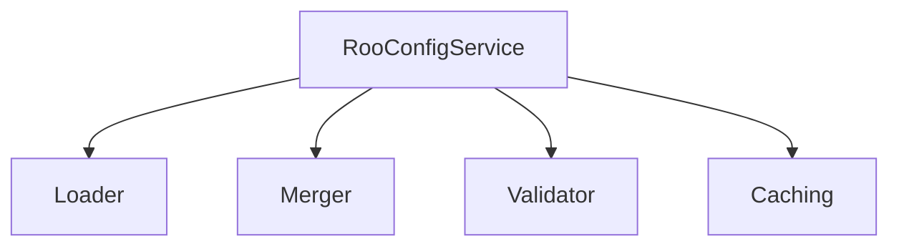
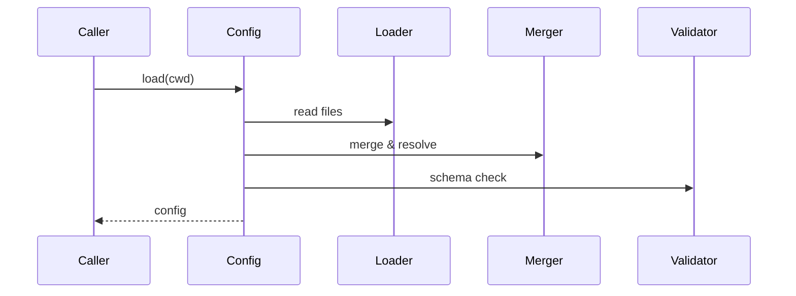

# services/roo-config — 技术架构与设计

## 目标
- 读取与合并项目中的 Roo 配置（模式/规则/模板），为核心模块提供统一视图。

## 组件架构


## 数据模型
- RooConfig: { modes, rules, templates, version }
- LoadOptions: { cwd, files[] }

## 公共 API
```ts
interface RooConfigService {
  load(opts?: LoadOptions): Promise<RooConfig>
  get(path: string): unknown
}
```

## 流程


## 错误分类
- ValidationError: 配置不合规
- IOErrors: 文件读取失败

## 测试
- 多文件合并；版本字段；schema 校验；缓存命中。