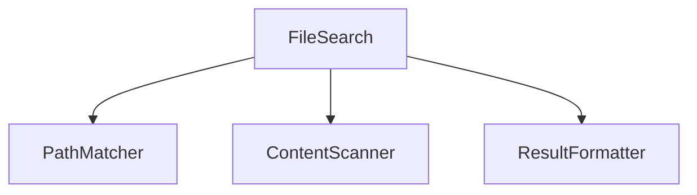
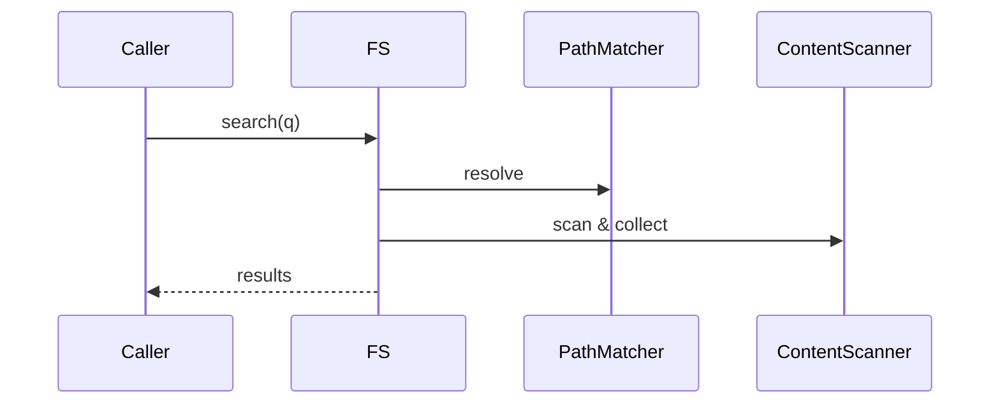

# services/search — 技术架构与设计

## 目标
- 文件级搜索服务：路径匹配与内容片段抽取，供上层工具与提示构建使用。

## 组件架构


## 数据模型
- FileSearchQuery: { patterns[], includes[], excludes[], maxResults }
- FileSearchResult: { path, matches[] }

## 公共 API
```ts
interface FileSearchService {
  search(q: FileSearchQuery): Promise<FileSearchResult[]>
}
```

## 流程


## 错误分类
- PatternError: 模式解析失败
- FSAccessError: 文件访问失败

## 测试
- 包含/排除组合；结果上限；二进制/文本过滤；格式化正确。