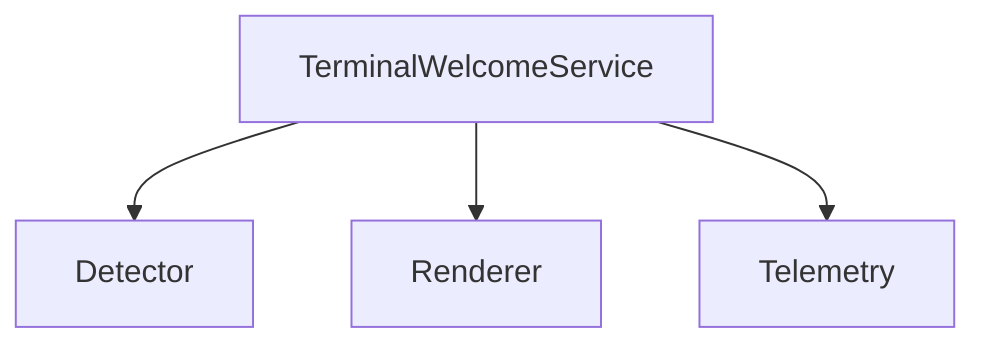
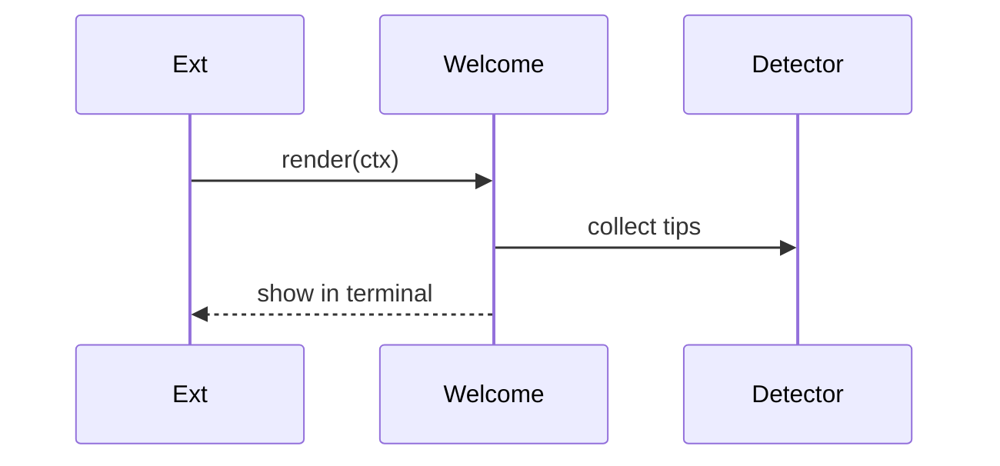

# services/terminal-welcome — 技术架构与设计

## 目标
- 在终端展示欢迎信息与快速提示，基于项目状态与用户配置。

## 组件架构


## 数据模型
- WelcomeMessage: { lines[], actions? }
- Context: { workspace, recentTasks, tips }

## 公共 API
```ts
class TerminalWelcomeService {
  render(context: Context): Promise<void>
}
```

## 流程


## 错误分类
- RenderError: 渲染失败

## 测试
- 提示来源覆盖；终端输出格式；异常降级。