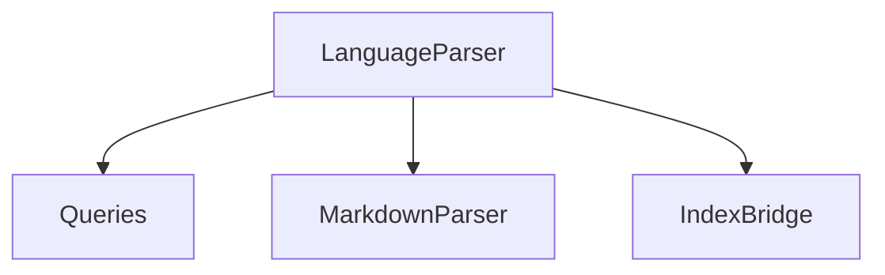
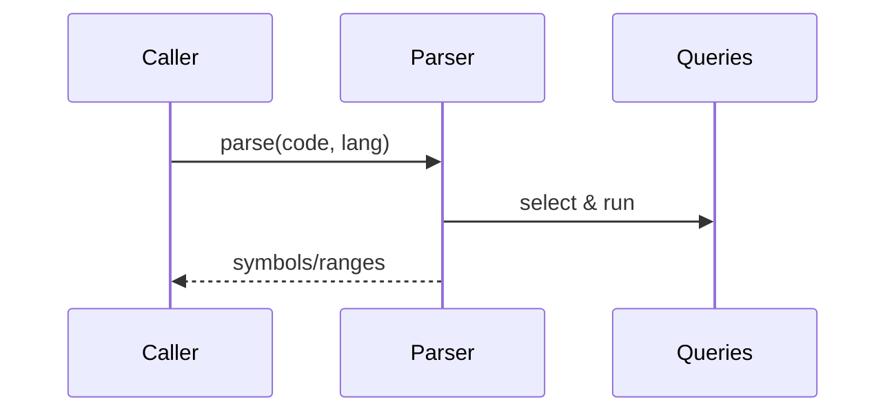

# services/tree-sitter — 技术架构与设计

## 目标
- 基于 tree-sitter 的语言与 Markdown 解析，抽取符号与结构供索引与提示使用。

## 组件架构


## 数据模型
- ParseResult: { symbols[], ranges[], errors[] }
- QuerySet: 按语言组织的查询集合（如 Ruby、TS、Python）

## 公共 API
```ts
interface LanguageParser {
  parse(code: string, languageId: string): Promise<ParseResult>
}
```

## 流程


## 错误分类
- ParseError: 语法树构建失败
- QueryError: 查询不匹配或错误

## 测试
- 多语言查询覆盖；边界符号；Markdown 特殊结构；错误路径与性能。