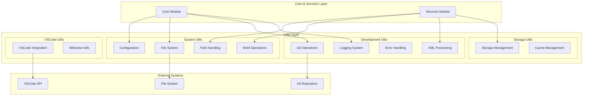
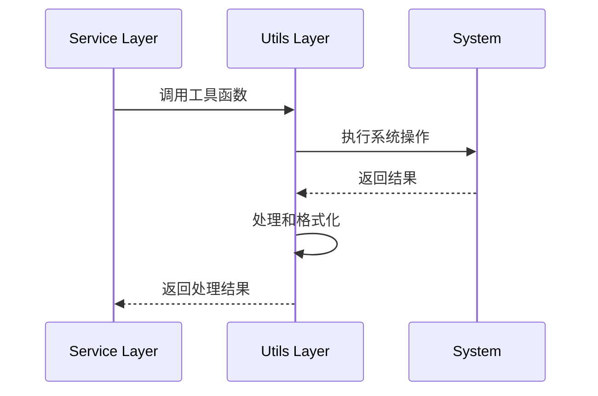

# Utils 模块架构文档

## 1. 模块概述

Utils 层是 Kilocode 项目的通用工具函数层，位于 `src/utils/` 目录下。该层提供各种通用的工具函数和实用程序，被项目的其他层广泛使用，包括文件系统操作、Git 集成、配置管理、日志系统等基础功能。

### 设计原则

- **通用性**: 提供可复用的通用工具函数

- **无状态**: 工具函数尽量保持无状态，便于测试和使用

- **高性能**: 优化常用操作的性能

- **易用性**: 提供简洁易用的 API 接口

## 2. 工具架构



## 3. 工具分类

### 3.1 System Utils (系统工具)

#### Configuration (配置管理)

- **文件**: `config.ts`

- **功能**: 处理配置文件的读取、写入和管理

- **核心特性**:

    - 配置文件解析

    - 默认值处理

    - 配置验证

    - 动态配置更新

```typescript
// 示例用法
interface ConfigOptions {
	apiKey?: string
	timeout?: number
	debug?: boolean
}

export function loadConfig(path: string): ConfigOptions
export function saveConfig(path: string, config: ConfigOptions): void
export function validateConfig(config: ConfigOptions): boolean
```

#### File System (文件系统)

- **文件**: `fs.ts`

- **功能**: 封装文件系统操作，提供异步和同步接口

- **核心特性**:

    - 文件读写操作

    - 目录管理

    - 文件监听

    - 权限检查

```typescript
// 示例用法
export async function readFileAsync(path: string): Promise<string>
export async function writeFileAsync(path: string, content: string): Promise<void>
export async function ensureDir(path: string): Promise<void>
export function watchFile(path: string, callback: (event: string) => void): void
```

#### Path Handling (路径处理)

- **文件**: `path.ts`

- **功能**: 处理文件路径的解析、转换和操作

- **核心特性**:

    - 路径规范化

    - 相对路径转换

    - 跨平台路径处理

    - 路径匹配

```typescript
// 示例用法
export function normalizePath(path: string): string
export function getRelativePath(from: string, to: string): string
export function isSubPath(parent: string, child: string): boolean
export function matchPath(pattern: string, path: string): boolean
```

#### Shell Operations (Shell 操作)

- **文件**: `shell.ts`

- **功能**: 执行 Shell 命令和系统操作

- **核心特性**:

    - 命令执行

    - 进程管理

    - 输出捕获

    - 错误处理

```typescript
// 示例用法
export async function execCommand(command: string, options?: ExecOptions): Promise<ExecResult>
export function spawnProcess(command: string, args: string[]): ChildProcess
export async function which(command: string): Promise<string | null>
```

### 3.2 Development Utils (开发工具)

#### Git Operations (Git 操作)

- **文件**: `git.ts`

- **功能**: Git 版本控制系统的集成和操作

- **核心特性**:

    - Git 命令封装

    - 仓库状态检查

    - 分支管理

    - 提交历史

```typescript
// 示例用法
export async function getGitStatus(repoPath: string): Promise<GitStatus>
export async function getCurrentBranch(repoPath: string): Promise<string>
export async function getCommitHistory(repoPath: string, limit?: number): Promise<GitCommit[]>
export async function stageFiles(repoPath: string, files: string[]): Promise<void>
```

#### XML Processing (XML 处理)

- **文件**: `xml.ts`

- **功能**: XML 文件的解析和处理

- **核心特性**:

    - XML 解析

    - 节点操作

    - 格式化输出

    - 验证功能

```typescript
// 示例用法
export function parseXML(xmlString: string): XMLDocument
export function formatXML(xmlString: string): string
export function validateXML(xmlString: string, schema?: string): boolean
export function queryXML(doc: XMLDocument, xpath: string): XMLNode[]
```

#### Error Handling (错误处理)

- **文件**: `errors.ts`

- **功能**: 统一的错误处理和异常管理

- **核心特性**:

    - 自定义错误类型

    - 错误分类

    - 错误报告

    - 堆栈跟踪

```typescript
// 示例用法
export class KilocodeError extends Error {
	constructor(
		message: string,
		public code: string,
		public details?: any,
	) {
		super(message)
	}
}

export function handleError(error: Error): void
export function createErrorReport(error: Error): ErrorReport
export function isKilocodeError(error: any): error is KilocodeError
```

#### Logging System (日志系统)

- **目录**: `logging/`

- **功能**: 提供完整的日志记录和管理功能

- **核心特性**:

    - 多级别日志

    - 日志格式化

    - 文件输出

    - 性能监控

```typescript
// 示例用法
export interface Logger {
	debug(message: string, ...args: any[]): void
	info(message: string, ...args: any[]): void
	warn(message: string, ...args: any[]): void
	error(message: string, error?: Error): void
}

export function createLogger(name: string): Logger
export function setLogLevel(level: LogLevel): void
export function configureFileOutput(path: string): void
```

### 3.3 Storage Utils (存储工具)

#### Storage Management (存储管理)

- **文件**: `storage.ts`

- **功能**: 数据存储和缓存管理

- **核心特性**:

    - 键值存储

    - 数据序列化

    - 过期管理

    - 存储清理

```typescript
// 示例用法
export interface StorageManager {
	get<T>(key: string): Promise<T | null>
	set<T>(key: string, value: T, ttl?: number): Promise<void>
	delete(key: string): Promise<void>
	clear(): Promise<void>
}

export function createStorageManager(path: string): StorageManager
export function createMemoryStorage(): StorageManager
```

### 3.4 VSCode Utils (VSCode 工具)

#### VSCode Integration (VSCode 集成)

- **文件**: `vscode.ts`

- **功能**: VSCode API 的封装和扩展

- **核心特性**:

    - 编辑器操作

    - 文档管理

    - UI 交互

    - 扩展管理

```typescript
// 示例用法
export function getCurrentEditor(): vscode.TextEditor | undefined
export function showMessage(message: string, type: "info" | "warn" | "error"): void
export function openDocument(path: string): Promise<vscode.TextDocument>
export function insertText(editor: vscode.TextEditor, text: string): void
```

#### Webview Utils (Webview 工具)

- **文件**: `webview.ts`

- **功能**: VSCode Webview 的管理和通信

- **核心特性**:

    - Webview 创建

    - 消息通信

    - 资源管理

    - 状态同步

```typescript
// 示例用法
export function createWebview(options: WebviewOptions): vscode.WebviewPanel
export function sendMessage(webview: vscode.Webview, message: any): void
export function handleMessage(webview: vscode.Webview, handler: MessageHandler): void
```

## 4. 工具使用模式

### 4.1 依赖注入模式



### 4.2 工具组合模式

```typescript
// 组合多个工具函数实现复杂功能
export async function deployProject(projectPath: string): Promise<void> {
	// 使用 Git 工具检查状态
	const gitStatus = await getGitStatus(projectPath)

	// 使用文件系统工具读取配置
	const config = await loadConfig(path.join(projectPath, "deploy.json"))

	// 使用 Shell 工具执行部署命令
	await execCommand(config.deployCommand, { cwd: projectPath })

	// 使用日志工具记录结果
	logger.info("Project deployed successfully")
}
```

## 5. 性能优化

### 5.1 缓存策略

- **文件系统缓存**: 缓存频繁访问的文件内容

- **配置缓存**: 缓存解析后的配置对象

- **Git 状态缓存**: 缓存 Git 仓库状态信息

### 5.2 异步优化

- **并发执行**: 支持多个操作并发执行

- **流式处理**: 对大文件使用流式处理

- **懒加载**: 按需加载工具模块

### 5.3 内存管理

- **对象池**: 复用常用对象

- **垃圾回收**: 及时清理不需要的资源

- **内存监控**: 监控内存使用情况

## 6. 测试策略

### 6.1 单元测试

- **目录**: `src/utils/__tests__/`

- **覆盖率**: 目标 90% 以上

- **测试类型**: 功能测试、边界测试、错误测试

### 6.2 集成测试

- **跨平台测试**: Windows、macOS、Linux

- **性能测试**: 大文件处理、高并发场景

- **兼容性测试**: 不同版本的依赖库

## 7. 扩展指南

### 7.1 添加新工具

1. **创建工具文件**: 在 `src/utils/` 下创建新的工具文件
2. **定义接口**: 设计清晰的函数接口
3. **实现功能**: 编写工具函数实现
4. **添加测试**: 编写对应的单元测试
5. **更新文档**: 更新工具文档

### 7.2 工具开发规范

- **函数命名**: 使用动词开头的描述性名称

- **参数设计**: 合理设计参数顺序和可选参数

- **错误处理**: 统一的错误处理和异常抛出

- **类型定义**: 完整的 TypeScript 类型定义

- **文档注释**: 详细的 JSDoc 注释

## 8. 维护和监控

### 8.1 性能监控

- 函数执行时间统计

- 内存使用情况监控

- 错误率统计

### 8.2 维护策略

- 定期代码审查

- 依赖库更新

- 性能优化

- 安全漏洞修复
