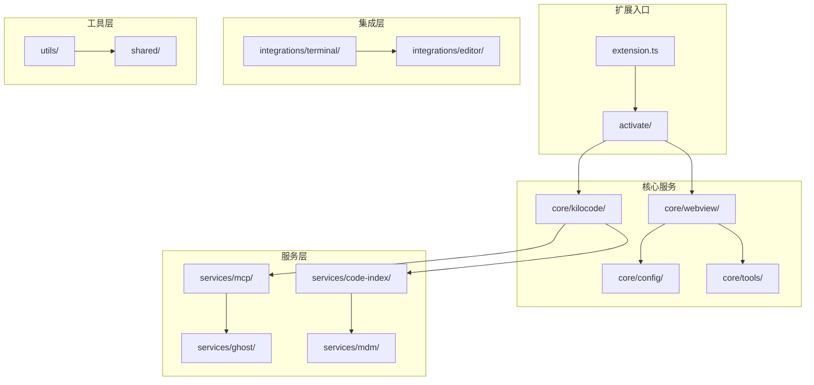

# VSCode 扩展核心模块

## 1. 模块概述

VSCode 扩展核心模块 (`src/`) 是 Kilocode 项目的核心组件，实现了 AI 代码助手的主要功能。该模块基于 VSCode Extension API 构建，提供智能代码生成、任务自动化、代码重构等核心功能。

## 2. 模块架构



## 3. 目录结构

```
src/
├── extension.ts              # 扩展主入口
├── activate/                 # 激活相关功能
├── core/                     # 核心功能模块
│   ├── kilocode/            # AI 核心逻辑
│   ├── webview/             # Web 视图管理
│   ├── config/              # 配置管理
│   ├── tools/               # 工具集合
│   ├── prompts/             # 提示词管理
│   └── task/                # 任务管理
├── services/                # 服务层
│   ├── mcp/                 # MCP 服务器管理
│   ├── code-index/          # 代码索引服务
│   ├── ghost/               # Ghost 服务
│   └── mdm/                 # MDM 服务
├── integrations/            # 集成功能
│   ├── terminal/            # 终端集成
│   └── editor/              # 编辑器集成
├── utils/                   # 工具函数
├── shared/                  # 共享代码
└── i18n/                    # 国际化
```

## 4. 核心组件

### 4.1 扩展入口 (extension.ts)

扩展的主入口文件，负责：

- 扩展激活和初始化
- 服务注册和配置
- 生命周期管理
- 错误处理和日志记录

```typescript
export async function activate(context: vscode.ExtensionContext) {
	// 初始化输出通道
	outputChannel = vscode.window.createOutputChannel("Kilo-Code")

	// 初始化遥测服务
	const telemetryService = TelemetryService.createInstance()

	// 初始化核心提供者
	const provider = new ClineProvider(context, outputChannel, "sidebar", contextProxy, mdmService)

	// 注册命令和功能
	registerCommands(context, provider)
}
```

### 4.2 核心 AI 逻辑 (core/kilocode/)

实现 AI 代码助手的核心功能：

- AI 模型调用和管理
- 对话上下文管理
- 代码生成和分析
- 任务执行流程

### 4.3 Web 视图管理 (core/webview/)

管理 VSCode Webview 界面：

- **ClineProvider**: 主要的 Webview 提供者
- **消息通信**: 前后端消息传递
- **状态管理**: 界面状态同步
- **事件处理**: 用户交互处理

### 4.4 工具系统 (core/tools/)

提供各种 AI 可用的工具：

- **文件操作**: 读取、写入、搜索文件
- **命令执行**: 终端命令执行
- **浏览器自动化**: 网页操作
- **代码分析**: 代码结构分析

## 5. 服务层详解

### 5.1 MCP 服务管理 (services/mcp/)

Model Context Protocol 服务器管理：

- **McpServerManager**: MCP 服务器生命周期管理
- **McpHub**: MCP 服务器注册中心
- **协议实现**: MCP 协议的具体实现

### 5.2 代码索引服务 (services/code-index/)

代码库索引和搜索功能：

- **CodeIndexManager**: 代码索引管理器
- **语义搜索**: 基于语义的代码搜索
- **实时更新**: 代码变更的实时索引更新

### 5.3 Ghost 服务 (services/ghost/)

代码补全和建议服务：

- **智能补全**: AI 驱动的代码补全
- **上下文感知**: 基于上下文的建议
- **性能优化**: 低延迟的补全响应

## 6. 集成功能

### 6.1 终端集成 (integrations/terminal/)

与 VSCode 终端的深度集成：

- **TerminalRegistry**: 终端实例管理
- **命令执行**: 安全的命令执行
- **结果捕获**: 命令输出的实时捕获

### 6.2 编辑器集成 (integrations/editor/)

与 VSCode 编辑器的集成：

- **DiffViewProvider**: 差异视图提供者
- **代码操作**: 代码重构和修改
- **语法高亮**: 自定义语法高亮

## 7. 配置管理

### 7.1 配置系统 (core/config/)

统一的配置管理：

- **ContextProxy**: 配置代理和缓存
- **设置同步**: 配置的实时同步
- **默认值**: 合理的默认配置

### 7.2 配置项

主要配置项包括：

```json
{
	"kilocode.allowedCommands": ["npm", "git", "python"],
	"kilocode.maxTokens": 4096,
	"kilocode.temperature": 0.7,
	"kilocode.model": "gpt-4",
	"kilocode.autoSave": true
}
```

## 8. 国际化支持

### 8.1 多语言支持 (i18n/)

支持 20+ 种语言：

- **动态加载**: 按需加载语言包
- **实时切换**: 运行时语言切换
- **本地化**: 完整的本地化支持

### 8.2 支持的语言

- 英语 (en)
- 中文简体 (zh-CN)
- 中文繁体 (zh-TW)
- 日语 (ja)
- 韩语 (ko)
- 德语 (de)
- 法语 (fr)
- 西班牙语 (es)
- 等等...

## 9. 性能优化

### 9.1 内存管理

- **懒加载**: 按需加载模块
- **缓存策略**: 智能缓存管理
- **垃圾回收**: 及时释放资源

### 9.2 响应性能

- **异步处理**: 非阻塞操作
- **流式处理**: 大数据流式处理
- **并发控制**: 合理的并发限制

## 10. 错误处理和日志

### 10.1 错误处理

- **异常捕获**: 全局异常处理
- **错误恢复**: 自动错误恢复机制
- **用户友好**: 友好的错误提示

### 10.2 日志系统

- **结构化日志**: JSON 格式日志
- **日志级别**: 分级日志管理
- **输出通道**: VSCode 输出面板

## 11. 测试策略

### 11.1 单元测试

- **测试框架**: Vitest
- **覆盖率**: 目标 80%+ 覆盖率
- **模拟对象**: Mock 外部依赖

### 11.2 集成测试

- **E2E 测试**: Playwright 自动化测试
- **VSCode 测试**: VSCode 扩展测试框架
- **性能测试**: 关键路径性能测试

## 12. 开发指南

### 12.1 开发环境

```bash
# 安装依赖
pnpm install

# 开发模式
pnpm dev

# 构建扩展
pnpm build

# 运行测试
pnpm test
```

### 12.2 调试方法

- **F5 调试**: VSCode 内置调试
- **日志调试**: 输出通道日志
- **断点调试**: TypeScript 断点支持

---

_本文档详细介绍了 VSCode 扩展核心模块的架构和实现，为开发者提供了全面的技术参考。_
