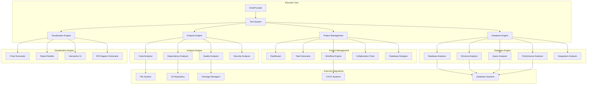
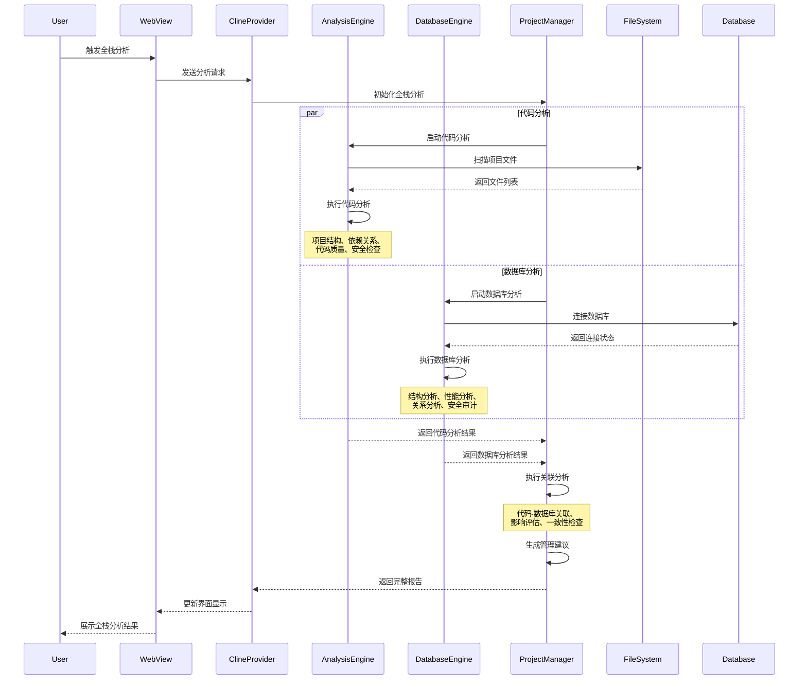
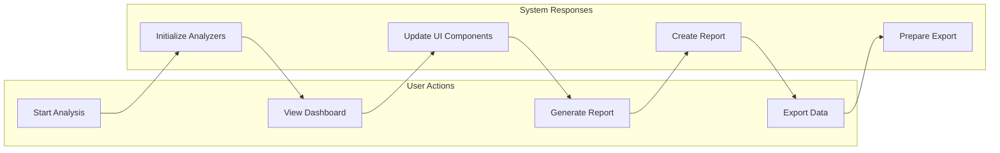
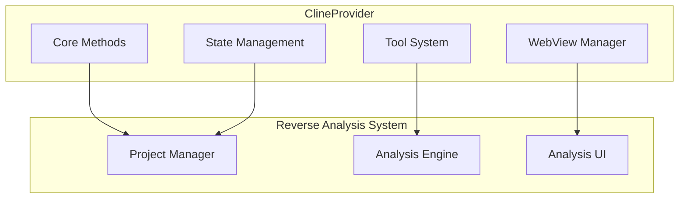
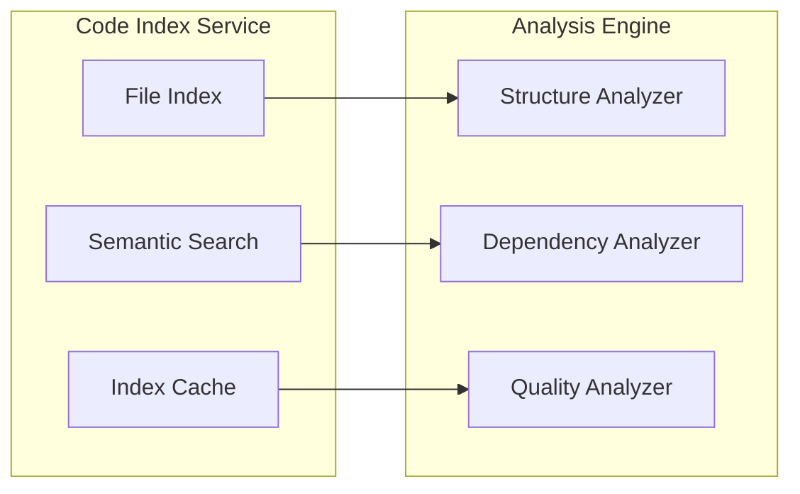
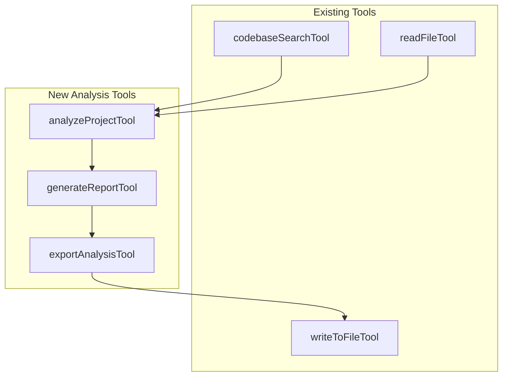
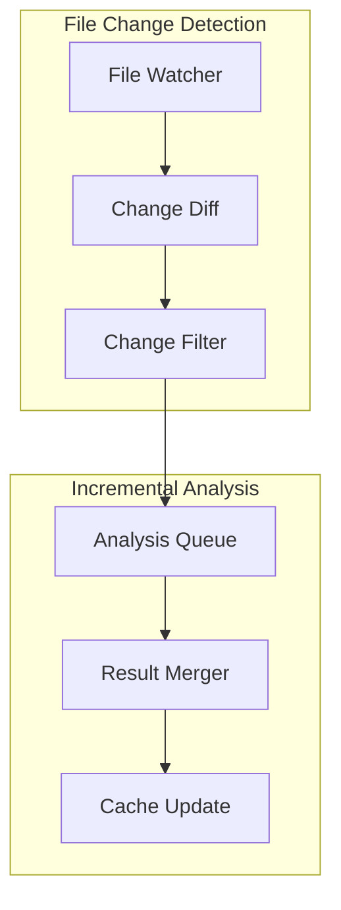
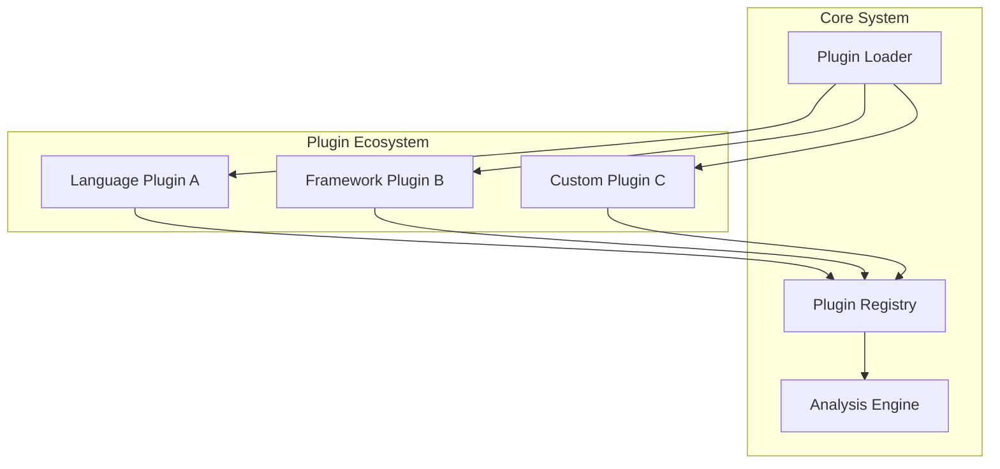

# 架构总览

## 1. 系统整体架构

### 1.1 主架构图



### 1.2 分层架构设计

#### 表现层 (Presentation Layer)

- **WebView UI**：用户交互界面
- **Project Dashboard**：项目概览仪表板
- **Visualization Components**：数据可视化组件

#### 业务逻辑层 (Business Logic Layer)

- **Project Manager**：项目管理核心逻辑
- **Analysis Engine**：分析引擎协调器
- **ClineProvider Integration**：与现有系统集成

#### 服务层 (Service Layer)

- **Code Index Service**：代码索引服务
- **File System Service**：文件系统操作
- **MCP Service**：模型控制协议服务

#### 分析层 (Analysis Layer)

- **Project Structure Analyzer**：项目结构分析
- **Dependency Relation Analyzer**：依赖关系分析
- **Code Quality Analyzer**：代码质量分析
- **Tech Stack Analyzer**：技术栈分析
- **Security Vulnerability Analyzer**：安全漏洞分析

#### 数据层 (Data Layer)

- **Analysis Cache**：分析结果缓存
- **Project Metadata**：项目元数据
- **Analysis Reports**：分析报告存储

### 2.4 数据库引擎

数据库引擎负责数据库相关的分析和管理功能：

- **数据库分析器**：连接和分析各种数据库系统
- **模式分析器**：分析数据库结构、表关系、约束
- **查询分析器**：分析SQL查询性能和优化建议
- **性能分析器**：监控数据库性能指标和瓶颈
- **集成分析器**：分析代码与数据库的关联关系

### 2.5 可视化引擎

可视化引擎负责将分析结果以直观的方式呈现给用户：

- **图表生成器**：生成各种类型的图表和图形
- **报告构建器**：构建结构化的分析报告
- **交互式界面**：提供用户友好的交互体验
- **ER图生成器**：生成数据库实体关系图
- **实时更新**：支持数据的实时更新和展示

## 2. 数据流设计

### 2.1 分析数据流



### 2.2 控制流设计



## 3. 与现有系统的集成点

### 3.1 ClineProvider 集成



### 3.2 代码索引系统集成



### 3.3 工具系统集成



## 4. 模块间通信机制

### 4.1 事件驱动架构

```typescript
// 事件总线接口
interface EventBus {
	emit<T>(event: string, data: T): void
	on<T>(event: string, handler: (data: T) => void): void
	off(event: string, handler: Function): void
}

// 分析事件类型
type AnalysisEvents = {
	"analysis.started": { projectPath: string; analysisId: string }
	"analysis.progress": { analysisId: string; progress: number; stage: string }
	"analysis.completed": { analysisId: string; results: AnalysisResults }
	"analysis.error": { analysisId: string; error: Error }
}
```

### 4.2 依赖注入容器

```typescript
// 服务容器接口
interface ServiceContainer {
	register<T>(token: string, factory: () => T): void
	resolve<T>(token: string): T
	singleton<T>(token: string, factory: () => T): void
}

// 服务注册
container.singleton("analysisEngine", () => new AnalysisEngine())
container.singleton("projectManager", () => new ProjectManager())
container.register("structureAnalyzer", () => new ProjectStructureAnalyzer())
```

## 5. 性能优化策略

### 5.1 增量分析



### 5.2 缓存策略

```typescript
// 多层缓存架构
interface CacheStrategy {
	// L1: 内存缓存 (最快)
	memoryCache: Map<string, AnalysisResult>

	// L2: 磁盘缓存 (持久化)
	diskCache: DiskCache

	// L3: 分布式缓存 (可选)
	distributedCache?: DistributedCache
}
```

## 6. 扩展性设计

### 6.1 插件架构



### 6.2 分析器扩展接口

```typescript
// 分析器基础接口
interface BaseAnalyzer {
	readonly name: string
	readonly version: string
	readonly supportedFileTypes: string[]

	analyze(context: AnalysisContext): Promise<AnalysisResult>
	canAnalyze(filePath: string): boolean
}

// 自定义分析器示例
class CustomFrameworkAnalyzer implements BaseAnalyzer {
	readonly name = "CustomFrameworkAnalyzer"
	readonly version = "1.0.0"
	readonly supportedFileTypes = [".tsx", ".jsx"]

	async analyze(context: AnalysisContext): Promise<AnalysisResult> {
		// 自定义分析逻辑
	}

	canAnalyze(filePath: string): boolean {
		return this.supportedFileTypes.some((ext) => filePath.endsWith(ext))
	}
}
```

## 7. 安全性考虑

### 7.1 数据安全

- **敏感信息过滤**：自动识别和过滤敏感信息
- **访问控制**：基于角色的访问控制机制
- **数据加密**：缓存和报告数据加密存储

### 7.2 代码安全

- **沙箱执行**：分析器在沙箱环境中运行
- **输入验证**：严格的输入参数验证
- **权限最小化**：最小权限原则

## 8. 监控和日志

### 8.1 性能监控

```typescript
// 性能指标接口
interface PerformanceMetrics {
	analysisTime: number
	memoryUsage: number
	cacheHitRate: number
	errorRate: number
}

// 监控服务
class MonitoringService {
	trackAnalysis(analysisId: string, metrics: PerformanceMetrics): void
	getMetrics(timeRange: TimeRange): AggregatedMetrics
	alertOnThreshold(metric: string, threshold: number): void
}
```

### 8.2 结构化日志

```typescript
// 日志接口
interface StructuredLogger {
	info(message: string, context?: LogContext): void
	warn(message: string, context?: LogContext): void
	error(message: string, error: Error, context?: LogContext): void
	debug(message: string, context?: LogContext): void
}

// 日志上下文
interface LogContext {
	analysisId?: string
	projectPath?: string
	userId?: string
	timestamp: number
}
```

---

_此架构设计确保了系统的可扩展性、性能和可维护性，为逆向项目分析和项目管理功能提供了坚实的技术基础。_
