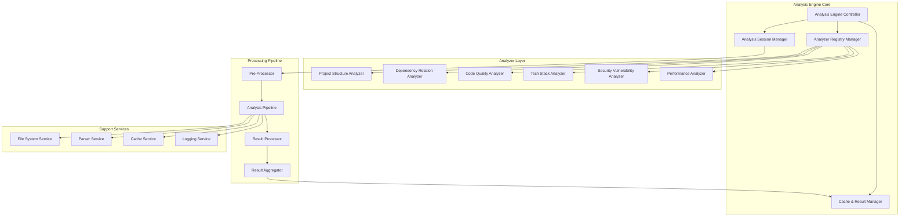

# 分析引擎设计

## 1. 分析引擎架构

### 1.1 核心架构



### 1.2 分析引擎实现

```typescript
// 分析引擎核心实现
export class AnalysisEngine implements IAnalysisEngine {
	private sessionManager: AnalysisSessionManager
	private analyzerRegistry: AnalyzerRegistry
	private cacheManager: CacheManager
	private eventBus: EventBus
	private config: AnalysisEngineConfig

	constructor(config: AnalysisEngineConfig) {
		this.config = config
		this.sessionManager = new AnalysisSessionManager()
		this.analyzerRegistry = new AnalyzerRegistry()
		this.cacheManager = new CacheManager(config.cache)
		this.eventBus = new EventBus()
	}

	async initialize(): Promise<void> {
		// 初始化各个组件
		await this.sessionManager.initialize()
		await this.analyzerRegistry.initialize()
		await this.cacheManager.initialize()

		// 注册内置分析器
		await this.registerBuiltInAnalyzers()

		// 启动事件监听
		this.setupEventListeners()
	}

	async analyzeProject(request: AnalysisRequest): Promise<AnalysisSession> {
		// 创建分析会话
		const session = await this.sessionManager.createSession(request)

		// 异步执行分析
		this.executeAnalysis(session).catch((error) => {
			this.handleAnalysisError(session, error)
		})

		return session
	}

	private async executeAnalysis(session: AnalysisSession): Promise<void> {
		try {
			// 更新会话状态
			await this.sessionManager.updateStatus(session.id, AnalysisStatus.RUNNING)

			// 创建分析管道
			const pipeline = new AnalysisPipeline(session, this.config)

			// 执行分析
			const results = await pipeline.execute()

			// 缓存结果
			await this.cacheManager.storeResults(session.id, results)

			// 更新会话
			await this.sessionManager.completeSession(session.id, results)

			// 发送完成事件
			this.eventBus.emit("session.completed", results)
		} catch (error) {
			await this.handleAnalysisError(session, error)
		}
	}

	private async registerBuiltInAnalyzers(): Promise<void> {
		const analyzers = [
			new ProjectStructureAnalyzer(),
			new DependencyAnalyzer(),
			new CodeQualityAnalyzer(),
			new TechStackAnalyzer(),
			new SecurityAnalyzer(),
			new PerformanceAnalyzer(),
		]

		for (const analyzer of analyzers) {
			await this.analyzerRegistry.register(analyzer)
		}
	}
}
```

## 2. 项目结构分析器

### 2.1 结构分析器设计

```typescript
// 项目结构分析器实现
export class ProjectStructureAnalyzer implements IProjectStructureAnalyzer {
	readonly metadata: AnalyzerMetadata = {
		id: "project-structure-analyzer",
		name: "Project Structure Analyzer",
		version: "1.0.0",
		description: "Analyzes project directory structure and file organization",
		author: "Kilocode Team",
		supportedLanguages: ["*"],
		supportedFileTypes: ["*"],
		category: AnalyzerCategory.STRUCTURE,
		priority: 100,
	}

	private fileSystemService: FileSystemService
	private patternMatcher: PatternMatcher
	private projectTypeDetector: ProjectTypeDetector

	constructor() {
		this.fileSystemService = new FileSystemService()
		this.patternMatcher = new PatternMatcher()
		this.projectTypeDetector = new ProjectTypeDetector()
	}

	async analyze(context: AnalysisContext): Promise<AnalysisResult> {
		const projectPath = context.projectPath

		// 1. 扫描目录结构
		const directoryStructure = await this.scanDirectoryStructure(projectPath)

		// 2. 识别项目类型
		const projectType = await this.identifyProjectType(projectPath, directoryStructure)

		// 3. 分类文件
		const fileClassification = await this.classifyFiles(directoryStructure)

		// 4. 提取项目元数据
		const projectMetadata = await this.extractProjectMetadata(projectPath)

		// 5. 识别配置文件
		const configFiles = await this.identifyConfigFiles(directoryStructure)

		// 6. 分析构建系统
		const buildSystem = await this.analyzeBuildSystem(projectPath, configFiles)

		return {
			analyzerId: this.metadata.id,
			projectType,
			directoryStructure,
			fileClassification,
			projectMetadata,
			configFiles,
			buildSystem,
			generatedAt: new Date(),
		}
	}

	private async scanDirectoryStructure(projectPath: string): Promise<DirectoryNode> {
		const scanner = new DirectoryScanner({
			maxDepth: this.config.maxScanDepth || 10,
			excludePatterns: this.config.excludePatterns || DEFAULT_EXCLUDE_PATTERNS,
			includeHidden: this.config.includeHidden || false,
		})

		return await scanner.scan(projectPath)
	}

	private async identifyProjectType(projectPath: string, structure: DirectoryNode): Promise<ProjectType> {
		const detectors = [
			new JavaScriptProjectDetector(),
			new TypeScriptProjectDetector(),
			new PythonProjectDetector(),
			new JavaProjectDetector(),
			new CSharpProjectDetector(),
			new RustProjectDetector(),
			new GoProjectDetector(),
		]

		const results = await Promise.all(detectors.map((detector) => detector.detect(projectPath, structure)))

		// 选择置信度最高的结果
		const bestMatch = results
			.filter((result) => result.confidence > 0.5)
			.sort((a, b) => b.confidence - a.confidence)[0]

		return (
			bestMatch || {
				primary: "unknown",
				language: "unknown",
				confidence: 0,
			}
		)
	}
}
```

### 2.2 目录扫描器

```typescript
// 目录扫描器实现
export class DirectoryScanner {
	private config: DirectoryScannerConfig
	private excludeMatcher: Minimatch[]

	constructor(config: DirectoryScannerConfig) {
		this.config = config
		this.excludeMatcher = config.excludePatterns.map((pattern) => new Minimatch(pattern))
	}

	async scan(rootPath: string): Promise<DirectoryNode> {
		const stats = await fs.stat(rootPath)

		const rootNode: DirectoryNode = {
			name: path.basename(rootPath),
			path: rootPath,
			type: "directory",
			children: [],
			stats: {
				fileCount: 0,
				directoryCount: 0,
				totalSize: 0,
				depth: 0,
				lastModified: stats.mtime,
			},
		}

		await this.scanRecursive(rootNode, 0)
		return rootNode
	}

	private async scanRecursive(node: DirectoryNode, depth: number): Promise<void> {
		if (depth >= this.config.maxDepth) {
			return
		}

		try {
			const entries = await fs.readdir(node.path, { withFileTypes: true })

			for (const entry of entries) {
				const fullPath = path.join(node.path, entry.name)

				// 检查是否应该排除
				if (this.shouldExclude(fullPath)) {
					continue
				}

				const childNode: DirectoryNode = {
					name: entry.name,
					path: fullPath,
					type: entry.isDirectory() ? "directory" : "file",
				}

				if (entry.isDirectory()) {
					childNode.children = []
					childNode.stats = {
						fileCount: 0,
						directoryCount: 0,
						totalSize: 0,
						depth: depth + 1,
						lastModified: new Date(),
					}

					await this.scanRecursive(childNode, depth + 1)

					// 更新统计信息
					node.stats!.directoryCount += 1 + childNode.stats!.directoryCount
					node.stats!.fileCount += childNode.stats!.fileCount
					node.stats!.totalSize += childNode.stats!.totalSize
				} else {
					const fileStats = await fs.stat(fullPath)
					childNode.fileInfo = {
						path: fullPath,
						size: fileStats.size,
						lastModified: fileStats.mtime,
						checksum: await this.calculateChecksum(fullPath),
					}

					// 分类文件
					childNode.category = this.classifyFile(entry.name)

					// 更新统计信息
					node.stats!.fileCount += 1
					node.stats!.totalSize += fileStats.size
				}

				node.children!.push(childNode)
			}
		} catch (error) {
			console.warn(`Failed to scan directory ${node.path}:`, error)
		}
	}

	private shouldExclude(filePath: string): boolean {
		const relativePath = path.relative(process.cwd(), filePath)
		return this.excludeMatcher.some((matcher) => matcher.match(relativePath))
	}

	private classifyFile(fileName: string): FileCategory {
		const ext = path.extname(fileName).toLowerCase()
		const baseName = path.basename(fileName, ext).toLowerCase()

		// 配置文件
		if (CONFIG_FILE_PATTERNS.some((pattern) => pattern.test(fileName))) {
			return FileCategory.CONFIG
		}

		// 测试文件
		if (TEST_FILE_PATTERNS.some((pattern) => pattern.test(fileName))) {
			return FileCategory.TEST
		}

		// 文档文件
		if (DOC_FILE_EXTENSIONS.includes(ext)) {
			return FileCategory.DOCUMENTATION
		}

		// 源代码文件
		if (SOURCE_FILE_EXTENSIONS.includes(ext)) {
			return FileCategory.SOURCE
		}

		// 资源文件
		if (ASSET_FILE_EXTENSIONS.includes(ext)) {
			return FileCategory.ASSET
		}

		// 构建文件
		if (BUILD_FILE_PATTERNS.some((pattern) => pattern.test(fileName))) {
			return FileCategory.BUILD
		}

		return FileCategory.OTHER
	}
}
```

## 3. 依赖关系分析器

### 3.1 依赖分析器设计

```typescript
// 依赖关系分析器实现
export class DependencyAnalyzer implements IDependencyAnalyzer {
	readonly metadata: AnalyzerMetadata = {
		id: "dependency-analyzer",
		name: "Dependency Relation Analyzer",
		version: "1.0.0",
		description: "Analyzes project dependencies and relationships",
		author: "Kilocode Team",
		supportedLanguages: ["javascript", "typescript", "python", "java"],
		supportedFileTypes: [".js", ".ts", ".py", ".java"],
		category: AnalyzerCategory.DEPENDENCY,
		priority: 90,
	}

	private parsers: Map<string, DependencyParser>
	private graphBuilder: DependencyGraphBuilder
	private circularDetector: CircularDependencyDetector

	constructor() {
		this.parsers = new Map()
		this.graphBuilder = new DependencyGraphBuilder()
		this.circularDetector = new CircularDependencyDetector()

		this.initializeParsers()
	}

	async analyze(context: AnalysisContext): Promise<AnalysisResult> {
		const projectPath = context.projectPath

		// 1. 解析依赖关系
		const dependencies = await this.parseDependencies(projectPath)

		// 2. 构建依赖图
		const dependencyGraph = await this.buildDependencyGraph(dependencies)

		// 3. 检测循环依赖
		const circularDependencies = await this.detectCircularDependencies(dependencyGraph)

		// 4. 计算依赖指标
		const metrics = await this.calculateDependencyMetrics(dependencyGraph)

		// 5. 生成优化建议
		const optimizations = await this.generateOptimizations(dependencyGraph, metrics)

		// 6. 评估风险
		const risks = await this.assessDependencyRisks(dependencyGraph)

		return {
			analyzerId: this.metadata.id,
			dependencyGraph,
			circularDependencies,
			metrics,
			optimizations,
			risks,
			generatedAt: new Date(),
		}
	}

	private async parseDependencies(projectPath: string): Promise<DependencyRelation[]> {
		const dependencies: DependencyRelation[] = []
		const sourceFiles = await this.findSourceFiles(projectPath)

		for (const filePath of sourceFiles) {
			const language = this.detectLanguage(filePath)
			const parser = this.parsers.get(language)

			if (parser) {
				try {
					const fileDependencies = await parser.parse(filePath)
					dependencies.push(...fileDependencies)
				} catch (error) {
					console.warn(`Failed to parse dependencies in ${filePath}:`, error)
				}
			}
		}

		return dependencies
	}

	private async buildDependencyGraph(dependencies: DependencyRelation[]): Promise<DependencyGraph> {
		return this.graphBuilder.build(dependencies)
	}

	private initializeParsers(): void {
		this.parsers.set("javascript", new JavaScriptDependencyParser())
		this.parsers.set("typescript", new TypeScriptDependencyParser())
		this.parsers.set("python", new PythonDependencyParser())
		this.parsers.set("java", new JavaDependencyParser())
	}
}
```

### 3.2 TypeScript 依赖解析器

```typescript
// TypeScript 依赖解析器
export class TypeScriptDependencyParser implements DependencyParser {
	private compiler: typeof ts

	constructor() {
		this.compiler = require("typescript")
	}

	async parse(filePath: string): Promise<DependencyRelation[]> {
		const sourceCode = await fs.readFile(filePath, "utf-8")
		const sourceFile = this.compiler.createSourceFile(filePath, sourceCode, this.compiler.ScriptTarget.Latest, true)

		const dependencies: DependencyRelation[] = []

		const visit = (node: ts.Node) => {
			// 处理 import 语句
			if (this.compiler.isImportDeclaration(node)) {
				const dependency = this.parseImportDeclaration(node, filePath)
				if (dependency) {
					dependencies.push(dependency)
				}
			}

			// 处理 require 调用
			if (
				this.compiler.isCallExpression(node) &&
				node.expression.kind === this.compiler.SyntaxKind.Identifier &&
				(node.expression as ts.Identifier).text === "require"
			) {
				const dependency = this.parseRequireCall(node, filePath)
				if (dependency) {
					dependencies.push(dependency)
				}
			}

			// 处理动态 import
			if (
				this.compiler.isCallExpression(node) &&
				node.expression.kind === this.compiler.SyntaxKind.ImportKeyword
			) {
				const dependency = this.parseDynamicImport(node, filePath)
				if (dependency) {
					dependencies.push(dependency)
				}
			}

			this.compiler.forEachChild(node, visit)
		}

		visit(sourceFile)
		return dependencies
	}

	private parseImportDeclaration(node: ts.ImportDeclaration, filePath: string): DependencyRelation | null {
		if (!node.moduleSpecifier || !this.compiler.isStringLiteral(node.moduleSpecifier)) {
			return null
		}

		const moduleName = node.moduleSpecifier.text
		const position = this.getPosition(node, filePath)

		return {
			id: this.generateId(),
			source: filePath,
			target: this.resolveModulePath(moduleName, filePath),
			type: DependencyRelationType.IMPORT,
			location: {
				filePath,
				range: {
					start: position,
					end: this.getEndPosition(node, filePath),
				},
				context: this.getContext(node),
			},
			isExternal: this.isExternalModule(moduleName),
			isOptional: false,
			metadata: {
				importType: this.getImportType(node),
				importedSymbols: this.getImportedSymbols(node),
			},
		}
	}

	private getImportType(node: ts.ImportDeclaration): string {
		if (node.importClause) {
			if (node.importClause.name) {
				return "default"
			}
			if (node.importClause.namedBindings) {
				if (this.compiler.isNamespaceImport(node.importClause.namedBindings)) {
					return "namespace"
				}
				if (this.compiler.isNamedImports(node.importClause.namedBindings)) {
					return "named"
				}
			}
		}
		return "side-effect"
	}

	private getImportedSymbols(node: ts.ImportDeclaration): string[] {
		const symbols: string[] = []

		if (node.importClause) {
			if (node.importClause.name) {
				symbols.push(node.importClause.name.text)
			}

			if (node.importClause.namedBindings) {
				if (this.compiler.isNamespaceImport(node.importClause.namedBindings)) {
					symbols.push(`* as ${node.importClause.namedBindings.name.text}`)
				} else if (this.compiler.isNamedImports(node.importClause.namedBindings)) {
					for (const element of node.importClause.namedBindings.elements) {
						symbols.push(element.name.text)
					}
				}
			}
		}

		return symbols
	}
}
```

### 3.3 循环依赖检测器

```typescript
// 循环依赖检测器
export class CircularDependencyDetector {
	detectCircularDependencies(graph: DependencyGraph): CircularDependency[] {
		const circularDependencies: CircularDependency[] = []
		const visited = new Set<string>()
		const recursionStack = new Set<string>()
		const pathStack: string[] = []

		for (const node of graph.nodes) {
			if (!visited.has(node.id)) {
				this.dfsDetectCycles(node.id, graph, visited, recursionStack, pathStack, circularDependencies)
			}
		}

		return this.analyzeCycles(circularDependencies, graph)
	}

	private dfsDetectCycles(
		nodeId: string,
		graph: DependencyGraph,
		visited: Set<string>,
		recursionStack: Set<string>,
		pathStack: string[],
		circularDependencies: CircularDependency[],
	): void {
		visited.add(nodeId)
		recursionStack.add(nodeId)
		pathStack.push(nodeId)

		const outgoingEdges = graph.edges.filter((edge) => edge.source === nodeId)

		for (const edge of outgoingEdges) {
			const targetId = edge.target

			if (!visited.has(targetId)) {
				this.dfsDetectCycles(targetId, graph, visited, recursionStack, pathStack, circularDependencies)
			} else if (recursionStack.has(targetId)) {
				// 发现循环依赖
				const cycleStartIndex = pathStack.indexOf(targetId)
				const cycle = pathStack.slice(cycleStartIndex).concat(targetId)

				circularDependencies.push({
					id: this.generateCycleId(cycle),
					cycle,
					length: cycle.length - 1,
					severity: this.calculateSeverity(cycle, graph),
					impact: this.calculateImpact(cycle, graph),
					suggestions: this.generateSuggestions(cycle, graph),
					locations: this.getLocations(cycle, graph),
				})
			}
		}

		pathStack.pop()
		recursionStack.delete(nodeId)
	}

	private calculateSeverity(cycle: string[], graph: DependencyGraph): CircularDependencySeverity {
		const cycleLength = cycle.length - 1
		const involvedFiles = new Set(cycle).size

		// 基于循环长度和涉及文件数量计算严重程度
		if (cycleLength <= 2 && involvedFiles <= 2) {
			return CircularDependencySeverity.LOW
		} else if (cycleLength <= 4 && involvedFiles <= 4) {
			return CircularDependencySeverity.MEDIUM
		} else if (cycleLength <= 8 && involvedFiles <= 8) {
			return CircularDependencySeverity.HIGH
		} else {
			return CircularDependencySeverity.CRITICAL
		}
	}

	private generateSuggestions(cycle: string[], graph: DependencyGraph): CircularDependencySuggestion[] {
		const suggestions: CircularDependencySuggestion[] = []

		// 建议1: 提取接口
		if (cycle.length <= 3) {
			suggestions.push({
				type: "extract_interface",
				description: "Extract common interfaces to break the circular dependency",
				effort: "medium",
				impact: "high",
				steps: [
					"Identify common functionality between modules",
					"Create interface definitions in a separate module",
					"Refactor modules to depend on interfaces instead of concrete implementations",
				],
			})
		}

		// 建议2: 依赖注入
		suggestions.push({
			type: "dependency_injection",
			description: "Use dependency injection to invert control flow",
			effort: "high",
			impact: "high",
			steps: [
				"Identify the dependency that can be injected",
				"Create injection points in the dependent module",
				"Configure dependency injection container",
			],
		})

		return suggestions
	}
}
```

## 4. 代码质量分析器

### 4.1 质量分析器设计

```typescript
// 代码质量分析器实现
export class CodeQualityAnalyzer implements ICodeQualityAnalyzer {
	readonly metadata: AnalyzerMetadata = {
		id: "code-quality-analyzer",
		name: "Code Quality Analyzer",
		version: "1.0.0",
		description: "Analyzes code quality metrics and identifies issues",
		author: "Kilocode Team",
		supportedLanguages: ["javascript", "typescript", "python", "java"],
		supportedFileTypes: [".js", ".ts", ".py", ".java"],
		category: AnalyzerCategory.QUALITY,
		priority: 85,
	}

	private complexityAnalyzer: ComplexityAnalyzer
	private codeSmellDetector: CodeSmellDetector
	private duplicationDetector: DuplicationDetector
	private maintainabilityCalculator: MaintainabilityCalculator

	constructor() {
		this.complexityAnalyzer = new ComplexityAnalyzer()
		this.codeSmellDetector = new CodeSmellDetector()
		this.duplicationDetector = new DuplicationDetector()
		this.maintainabilityCalculator = new MaintainabilityCalculator()
	}

	async analyze(context: AnalysisContext): Promise<AnalysisResult> {
		const projectPath = context.projectPath
		const sourceFiles = await this.findSourceFiles(projectPath)

		const results: QualityAnalysisResult[] = []

		// 并行分析文件
		const analysisPromises = sourceFiles.map(async (filePath) => {
			return this.analyzeFile(filePath)
		})

		const fileResults = await Promise.all(analysisPromises)

		// 聚合结果
		const aggregatedResult = this.aggregateResults(fileResults)

		// 计算总体评分
		const overallScore = this.calculateOverallScore(aggregatedResult)

		// 生成改进建议
		const suggestions = this.generateImprovementSuggestions(aggregatedResult)

		return {
			analyzerId: this.metadata.id,
			overallScore,
			categoryScores: aggregatedResult.categoryScores,
			issues: aggregatedResult.issues,
			complexity: aggregatedResult.complexity,
			codeSmells: aggregatedResult.codeSmells,
			refactoringSuggestions: suggestions,
			generatedAt: new Date(),
		}
	}

	private async analyzeFile(filePath: string): Promise<FileQualityResult> {
		const sourceCode = await fs.readFile(filePath, "utf-8")
		const language = this.detectLanguage(filePath)

		// 1. 复杂度分析
		const complexity = await this.complexityAnalyzer.analyze(sourceCode, language)

		// 2. 代码异味检测
		const codeSmells = await this.codeSmellDetector.detect(sourceCode, language)

		// 3. 质量问题检测
		const issues = await this.detectQualityIssues(sourceCode, language, filePath)

		// 4. 可维护性计算
		const maintainability = await this.maintainabilityCalculator.calculate(sourceCode, complexity, codeSmells)

		return {
			filePath,
			complexity,
			codeSmells,
			issues,
			maintainability,
			linesOfCode: this.countLinesOfCode(sourceCode),
			linesOfComments: this.countLinesOfComments(sourceCode),
		}
	}
}
```

### 4.2 复杂度分析器

```typescript
// 复杂度分析器
export class ComplexityAnalyzer {
	async analyze(sourceCode: string, language: string): Promise<ComplexityMetrics> {
		const parser = this.getParser(language)
		const ast = parser.parse(sourceCode)

		const metrics: ComplexityMetrics = {
			cyclomaticComplexity: this.calculateCyclomaticComplexity(ast),
			cognitiveComplexity: this.calculateCognitiveComplexity(ast),
			nestingDepth: this.calculateNestingDepth(ast),
			functionLength: this.calculateFunctionLength(ast),
			classComplexity: this.calculateClassComplexity(ast),
			fileComplexity: this.calculateFileComplexity(ast),
		}

		return metrics
	}

	private calculateCyclomaticComplexity(ast: ASTNode): ComplexityMeasure {
		const complexities: number[] = []

		const visit = (node: ASTNode) => {
			if (this.isFunctionNode(node)) {
				const complexity = this.calculateFunctionCyclomaticComplexity(node)
				complexities.push(complexity)
			}

			if (node.children) {
				node.children.forEach(visit)
			}
		}

		visit(ast)

		return this.createComplexityMeasure(complexities)
	}

	private calculateFunctionCyclomaticComplexity(functionNode: ASTNode): number {
		let complexity = 1 // 基础复杂度

		const visit = (node: ASTNode) => {
			// 增加复杂度的节点类型
			if (this.isDecisionNode(node)) {
				complexity++
			}

			if (node.children) {
				node.children.forEach(visit)
			}
		}

		visit(functionNode)
		return complexity
	}

	private isDecisionNode(node: ASTNode): boolean {
		const decisionTypes = [
			"IfStatement",
			"WhileStatement",
			"ForStatement",
			"DoWhileStatement",
			"SwitchCase",
			"ConditionalExpression",
			"LogicalExpression",
			"CatchClause",
		]

		return decisionTypes.includes(node.type)
	}

	private calculateCognitiveComplexity(ast: ASTNode): ComplexityMeasure {
		const complexities: number[] = []

		const visit = (node: ASTNode) => {
			if (this.isFunctionNode(node)) {
				const complexity = this.calculateFunctionCognitiveComplexity(node, 0)
				complexities.push(complexity)
			}

			if (node.children) {
				node.children.forEach(visit)
			}
		}

		visit(ast)

		return this.createComplexityMeasure(complexities)
	}

	private calculateFunctionCognitiveComplexity(node: ASTNode, nestingLevel: number): number {
		let complexity = 0

		const visit = (currentNode: ASTNode, currentNesting: number) => {
			const increment = this.getCognitiveComplexityIncrement(currentNode, currentNesting)
			complexity += increment

			const newNesting = this.shouldIncreaseNesting(currentNode) ? currentNesting + 1 : currentNesting

			if (currentNode.children) {
				currentNode.children.forEach((child) => visit(child, newNesting))
			}
		}

		if (node.children) {
			node.children.forEach((child) => visit(child, nestingLevel))
		}

		return complexity
	}

	private getCognitiveComplexityIncrement(node: ASTNode, nestingLevel: number): number {
		const baseIncrements: Record<string, number> = {
			IfStatement: 1,
			SwitchStatement: 1,
			ForStatement: 1,
			WhileStatement: 1,
			DoWhileStatement: 1,
			CatchClause: 1,
			ConditionalExpression: 1,
		}

		const baseIncrement = baseIncrements[node.type] || 0

		// 嵌套增加复杂度
		if (baseIncrement > 0 && nestingLevel > 0) {
			return baseIncrement + nestingLevel
		}

		// 逻辑运算符
		if (node.type === "LogicalExpression" && (node.operator === "&&" || node.operator === "||")) {
			return 1
		}

		return baseIncrement
	}
}
```

## 5. 安全漏洞分析器

### 5.1 安全分析器设计

```typescript
// 安全漏洞分析器实现
export class SecurityAnalyzer implements ISecurityAnalyzer {
	readonly metadata: AnalyzerMetadata = {
		id: "security-analyzer",
		name: "Security Vulnerability Analyzer",
		version: "1.0.0",
		description: "Scans for security vulnerabilities and issues",
		author: "Kilocode Team",
		supportedLanguages: ["javascript", "typescript", "python", "java"],
		supportedFileTypes: [".js", ".ts", ".py", ".java"],
		category: AnalyzerCategory.SECURITY,
		priority: 95,
	}

	private vulnerabilityScanner: VulnerabilityScanner
	private dependencyChecker: DependencyVulnerabilityChecker
	private codePatternAnalyzer: SecurityPatternAnalyzer
	private configurationAnalyzer: SecurityConfigurationAnalyzer

	constructor() {
		this.vulnerabilityScanner = new VulnerabilityScanner()
		this.dependencyChecker = new DependencyVulnerabilityChecker()
		this.codePatternAnalyzer = new SecurityPatternAnalyzer()
		this.configurationAnalyzer = new SecurityConfigurationAnalyzer()
	}

	async analyze(context: AnalysisContext): Promise<AnalysisResult> {
		const projectPath = context.projectPath

		// 1. 扫描代码漏洞
		const codeVulnerabilities = await this.scanCodeVulnerabilities(projectPath)

		// 2. 检查依赖漏洞
		const dependencyVulnerabilities = await this.checkDependencyVulnerabilities(projectPath)

		// 3. 分析配置安全性
		const configurationIssues = await this.analyzeConfigurationSecurity(projectPath)

		// 4. 生成安全建议
		const recommendations = await this.generateSecurityRecommendations(
			codeVulnerabilities,
			dependencyVulnerabilities,
			configurationIssues,
		)

		// 5. 计算安全评分
		const securityScore = this.calculateSecurityScore(
			codeVulnerabilities,
			dependencyVulnerabilities,
			configurationIssues,
		)

		return {
			analyzerId: this.metadata.id,
			securityScore,
			vulnerabilityStats: this.calculateVulnerabilityStats(codeVulnerabilities),
			securityIssues: codeVulnerabilities,
			dependencyVulnerabilities,
			recommendations,
			complianceChecks: await this.performComplianceChecks(projectPath),
			generatedAt: new Date(),
		}
	}

	private async scanCodeVulnerabilities(projectPath: string): Promise<SecurityIssue[]> {
		const sourceFiles = await this.findSourceFiles(projectPath)
		const vulnerabilities: SecurityIssue[] = []

		for (const filePath of sourceFiles) {
			const fileVulnerabilities = await this.scanFileVulnerabilities(filePath)
			vulnerabilities.push(...fileVulnerabilities)
		}

		return vulnerabilities
	}

	private async scanFileVulnerabilities(filePath: string): Promise<SecurityIssue[]> {
		const sourceCode = await fs.readFile(filePath, "utf-8")
		const language = this.detectLanguage(filePath)

		const scanners = [
			new InjectionVulnerabilityScanner(),
			new XSSVulnerabilityScanner(),
			new AuthenticationVulnerabilityScanner(),
			new CryptographyVulnerabilityScanner(),
			new DataExposureVulnerabilityScanner(),
		]

		const vulnerabilities: SecurityIssue[] = []

		for (const scanner of scanners) {
			if (scanner.supportsLanguage(language)) {
				const found = await scanner.scan(sourceCode, filePath)
				vulnerabilities.push(...found)
			}
		}

		return vulnerabilities
	}
}
```

### 5.2 注入漏洞扫描器

```typescript
// SQL 注入漏洞扫描器
export class InjectionVulnerabilityScanner implements VulnerabilityScanner {
	private patterns: SecurityPattern[]

	constructor() {
		this.patterns = [
			{
				id: "sql-injection-string-concat",
				name: "SQL Injection via String Concatenation",
				pattern: /(?:SELECT|INSERT|UPDATE|DELETE).*?\+.*?(?:req\.|request\.|params\.|query\.)/gi,
				severity: SecuritySeverity.HIGH,
				category: SecurityCategory.INPUT_VALIDATION,
				cwe: "CWE-89",
				description: "SQL query constructed using string concatenation with user input",
			},
			{
				id: "command-injection",
				name: "Command Injection",
				pattern: /(?:exec|spawn|system|eval)\s*\(\s*.*?(?:req\.|request\.|params\.|query\.)/gi,
				severity: SecuritySeverity.CRITICAL,
				category: SecurityCategory.INPUT_VALIDATION,
				cwe: "CWE-78",
				description: "Command execution with user-controlled input",
			},
			{
				id: "nosql-injection",
				name: "NoSQL Injection",
				pattern: /\$where.*?(?:req\.|request\.|params\.|query\.)/gi,
				severity: SecuritySeverity.HIGH,
				category: SecurityCategory.INPUT_VALIDATION,
				cwe: "CWE-943",
				description: "NoSQL query with user-controlled input",
			},
		]
	}

	async scan(sourceCode: string, filePath: string): Promise<SecurityIssue[]> {
		const issues: SecurityIssue[] = []
		const lines = sourceCode.split("\n")

		for (const pattern of this.patterns) {
			const matches = this.findMatches(sourceCode, pattern.pattern)

			for (const match of matches) {
				const location = this.getLocationFromMatch(match, lines, filePath)

				const issue: SecurityIssue = {
					id: this.generateIssueId(),
					type: SecurityIssueType.INJECTION,
					severity: pattern.severity,
					category: pattern.category,
					title: pattern.name,
					description: pattern.description,
					location,
					impact: this.calculateImpact(pattern.severity),
					remediation: this.getRemediation(pattern.id),
					cwe: pattern.cwe,
					metadata: {
						patternId: pattern.id,
						matchedText: match.text,
						confidence: this.calculateConfidence(match, sourceCode),
					},
				}

				issues.push(issue)
			}
		}

		return issues
	}

	private getRemediation(patternId: string): SecurityRemediation {
		const remediations: Record<string, SecurityRemediation> = {
			"sql-injection-string-concat": {
				description: "Use parameterized queries or prepared statements",
				steps: [
					"Replace string concatenation with parameterized queries",
					"Use ORM methods that automatically escape parameters",
					"Validate and sanitize all user inputs",
					"Implement input length limits",
				],
				references: [
					"https://owasp.org/www-community/attacks/SQL_Injection",
					"https://cheatsheetseries.owasp.org/cheatsheets/SQL_Injection_Prevention_Cheat_Sheet.html",
				],
				effort: "medium",
				priority: "high",
			},
			"command-injection": {
				description: "Avoid executing system commands with user input",
				steps: [
					"Use safe APIs instead of system commands",
					"If system commands are necessary, use allowlists for valid inputs",
					"Escape shell metacharacters",
					"Run commands with minimal privileges",
				],
				references: [
					"https://owasp.org/www-community/attacks/Command_Injection",
					"https://cheatsheetseries.owasp.org/cheatsheets/OS_Command_Injection_Defense_Cheat_Sheet.html",
				],
				effort: "high",
				priority: "critical",
			},
		}

		return (
			remediations[patternId] || {
				description: "Review and fix the identified security issue",
				steps: ["Analyze the code context", "Apply appropriate security measures"],
				references: [],
				effort: "medium",
				priority: "medium",
			}
		)
	}
}
```

## 6. 性能优化

### 6.1 增量分析实现

```typescript
// 增量分析管理器
export class IncrementalAnalysisManager {
	private changeDetector: FileChangeDetector
	private dependencyTracker: DependencyTracker
	private cacheManager: AnalysisCacheManager

	constructor() {
		this.changeDetector = new FileChangeDetector()
		this.dependencyTracker = new DependencyTracker()
		this.cacheManager = new AnalysisCacheManager()
	}

	async performIncrementalAnalysis(projectPath: string, lastAnalysisTime: Date): Promise<IncrementalAnalysisResult> {
		// 1. 检测文件变更
		const changes = await this.changeDetector.detectChanges(projectPath, lastAnalysisTime)

		// 2. 分析影响范围
		const affectedFiles = await this.analyzeImpactScope(changes)

		// 3. 执行增量分析
		const results = await this.executeIncrementalAnalysis(affectedFiles)

		// 4. 合并结果
		const mergedResults = await this.mergeWithCachedResults(results)

		return {
			changes,
			affectedFiles,
			results: mergedResults,
			analysisTime: new Date(),
		}
	}

	private async analyzeImpactScope(changes: FileChange[]): Promise<string[]> {
		const affectedFiles = new Set<string>()

		for (const change of changes) {
			// 直接受影响的文件
			affectedFiles.add(change.filePath)

			// 依赖此文件的其他文件
			const dependents = await this.dependencyTracker.getDependents(change.filePath)
			dependents.forEach((file) => affectedFiles.add(file))

			// 如果是配置文件变更，可能影响整个项目
			if (this.isConfigurationFile(change.filePath)) {
				const allFiles = await this.getAllProjectFiles()
				allFiles.forEach((file) => affectedFiles.add(file))
			}
		}

		return Array.from(affectedFiles)
	}
}
```

### 6.2 并行处理优化

```typescript
// 并行分析协调器
export class ParallelAnalysisCoordinator {
	private workerPool: WorkerPool
	private taskQueue: TaskQueue
	private resultAggregator: ResultAggregator

	constructor(config: ParallelAnalysisConfig) {
		this.workerPool = new WorkerPool(config.maxWorkers)
		this.taskQueue = new TaskQueue()
		this.resultAggregator = new ResultAggregator()
	}

	async executeParallelAnalysis(files: string[], analyzers: IAnalyzer[]): Promise<AnalysisResults> {
		// 1. 创建分析任务
		const tasks = this.createAnalysisTasks(files, analyzers)

		// 2. 按优先级排序任务
		const sortedTasks = this.prioritizeTasks(tasks)

		// 3. 分配任务到工作线程
		const taskPromises = sortedTasks.map((task) => this.workerPool.execute(task))

		// 4. 等待所有任务完成
		const results = await Promise.allSettled(taskPromises)

		// 5. 聚合结果
		return this.resultAggregator.aggregate(results)
	}

	private createAnalysisTasks(files: string[], analyzers: IAnalyzer[]): AnalysisTask[] {
		const tasks: AnalysisTask[] = []

		for (const filePath of files) {
			for (const analyzer of analyzers) {
				if (analyzer.canAnalyze({ filePath })) {
					tasks.push({
						id: this.generateTaskId(),
						type: "file-analysis",
						filePath,
						analyzerId: analyzer.metadata.id,
						priority: analyzer.metadata.priority,
						estimatedDuration: this.estimateTaskDuration(filePath, analyzer),
					})
				}
			}
		}

		return tasks
	}

	private prioritizeTasks(tasks: AnalysisTask[]): AnalysisTask[] {
		return tasks.sort((a, b) => {
			// 首先按优先级排序
			if (a.priority !== b.priority) {
				return b.priority - a.priority
			}

			// 然后按预估时间排序（短任务优先）
			return a.estimatedDuration - b.estimatedDuration
		})
	}
}
```

---

_分析引擎设计提供了完整的代码分析能力，支持多种分析器的协同工作，具备高性能的并行处理和增量分析能力，为项目的深度洞察提供了强大的技术支撑。_
