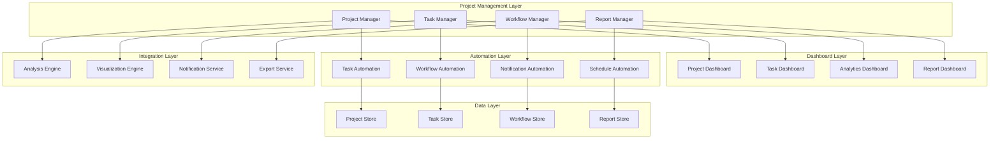

# 项目管理模块设计

## 1. 项目管理架构

### 1.1 模块架构图



### 1.2 项目管理器核心实现

```typescript
// 项目管理器核心实现
export class ProjectManager implements IProjectManager {
	private projects: Map<string, IProject>
	private taskManager: TaskManager
	private workflowManager: WorkflowManager
	private reportManager: ReportManager
	private eventBus: EventBus
	private config: ProjectManagerConfig

	constructor(config: ProjectManagerConfig) {
		this.config = config
		this.projects = new Map()
		this.taskManager = new TaskManager()
		this.workflowManager = new WorkflowManager()
		this.reportManager = new ReportManager()
		this.eventBus = new EventBus()
	}

	async initialize(): Promise<void> {
		await this.taskManager.initialize()
		await this.workflowManager.initialize()
		await this.reportManager.initialize()

		// 加载已存在的项目
		await this.loadExistingProjects()

		// 设置事件监听
		this.setupEventListeners()
	}

	async createProject(config: ProjectConfig): Promise<IProject> {
		// 验证项目配置
		const validationResult = await this.validateProjectConfig(config)
		if (!validationResult.valid) {
			throw new ValidationError("Invalid project configuration", validationResult.errors)
		}

		// 创建项目实例
		const project = new Project(config, {
			taskManager: this.taskManager,
			workflowManager: this.workflowManager,
			reportManager: this.reportManager,
			eventBus: this.eventBus,
		})

		// 初始化项目
		await project.initialize()

		// 注册项目
		this.projects.set(project.config.id, project)

		// 触发事件
		this.eventBus.emit("project.created", project)

		return project
	}

	async openProject(projectPath: string): Promise<IProject> {
		// 检查项目是否已经打开
		const existingProject = this.findProjectByPath(projectPath)
		if (existingProject) {
			return existingProject
		}

		// 加载项目配置
		const config = await this.loadProjectConfig(projectPath)

		// 创建项目实例
		const project = await this.createProject(config)

		// 触发事件
		this.eventBus.emit("project.opened", project)

		return project
	}

	async closeProject(projectId: string): Promise<void> {
		const project = this.projects.get(projectId)
		if (!project) {
			throw new Error(`Project ${projectId} not found`)
		}

		// 停止项目相关的任务和工作流
		await this.taskManager.stopProjectTasks(projectId)
		await this.workflowManager.stopProjectWorkflows(projectId)

		// 保存项目状态
		await project.save()

		// 清理资源
		await project.dispose()

		// 从注册表中移除
		this.projects.delete(projectId)

		// 触发事件
		this.eventBus.emit("project.closed", projectId)
	}

	private async loadExistingProjects(): Promise<void> {
		const projectPaths = await this.discoverProjects()

		for (const projectPath of projectPaths) {
			try {
				await this.openProject(projectPath)
			} catch (error) {
				console.warn(`Failed to load project at ${projectPath}:`, error)
			}
		}
	}

	private setupEventListeners(): void {
		// 监听分析完成事件，自动创建任务
		this.eventBus.on("analysis.completed", async (results: AnalysisResults) => {
			await this.handleAnalysisCompleted(results)
		})

		// 监听任务完成事件，触发工作流
		this.eventBus.on("task.completed", async (task: ITask) => {
			await this.handleTaskCompleted(task)
		})
	}
}
```

## 2. 项目仪表板设计

### 2.1 仪表板架构

```typescript
// 项目仪表板实现
export class ProjectDashboard implements IDashboard {
	private project: IProject
	private widgets: Map<string, IDashboardWidget>
	private layout: DashboardLayout
	private dataBindings: Map<string, DataBinding>
	private refreshManager: DashboardRefreshManager

	constructor(project: IProject, config: DashboardConfig) {
		this.project = project
		this.layout = config.layout
		this.widgets = new Map()
		this.dataBindings = new Map()
		this.refreshManager = new DashboardRefreshManager(config.refreshInterval)
	}

	async initialize(): Promise<void> {
		// 创建默认组件
		await this.createDefaultWidgets()

		// 设置数据绑定
		await this.setupDataBindings()

		// 启动自动刷新
		this.refreshManager.start(() => this.refreshData())
	}

	private async createDefaultWidgets(): Promise<void> {
		const defaultWidgets = [
			{
				id: "project-overview",
				type: WidgetType.OVERVIEW_CARD,
				title: "Project Overview",
				position: { x: 0, y: 0, width: 6, height: 4 },
				config: {
					showMetrics: ["files", "linesOfCode", "languages", "lastAnalysis"],
					refreshInterval: 30000,
				},
			},
			{
				id: "quality-metrics",
				type: WidgetType.METRICS_CHART,
				title: "Code Quality Metrics",
				position: { x: 6, y: 0, width: 6, height: 4 },
				config: {
					chartType: "radar",
					metrics: ["maintainability", "reliability", "security", "performance"],
					showTrend: true,
				},
			},
			{
				id: "issue-distribution",
				type: WidgetType.PIE_CHART,
				title: "Issue Distribution",
				position: { x: 0, y: 4, width: 4, height: 3 },
				config: {
					dataSource: "quality-analysis",
					groupBy: "severity",
					colors: ["#ff4757", "#ff6b7a", "#ffa502", "#2ed573"],
				},
			},
			{
				id: "dependency-graph",
				type: WidgetType.NETWORK_GRAPH,
				title: "Dependency Overview",
				position: { x: 4, y: 4, width: 8, height: 3 },
				config: {
					maxNodes: 50,
					showLabels: true,
					highlightCircular: true,
				},
			},
			{
				id: "task-progress",
				type: WidgetType.PROGRESS_LIST,
				title: "Active Tasks",
				position: { x: 0, y: 7, width: 6, height: 3 },
				config: {
					maxItems: 10,
					showProgress: true,
					groupBy: "status",
				},
			},
			{
				id: "recent-activity",
				type: WidgetType.ACTIVITY_FEED,
				title: "Recent Activity",
				position: { x: 6, y: 7, width: 6, height: 3 },
				config: {
					maxItems: 15,
					showTimestamp: true,
					filterTypes: ["analysis", "task", "workflow"],
				},
			},
		]

		for (const widgetConfig of defaultWidgets) {
			const widget = await this.createWidget(widgetConfig)
			this.widgets.set(widget.id, widget)
		}
	}

	private async createWidget(config: WidgetConfig): Promise<IDashboardWidget> {
		const widgetFactory = new DashboardWidgetFactory()
		return await widgetFactory.create(config, this.project)
	}
}
```

### 2.2 仪表板组件实现

```typescript
// 项目概览组件
export class ProjectOverviewWidget implements IDashboardWidget {
	readonly id: string
	readonly type = WidgetType.OVERVIEW_CARD
	readonly config: WidgetConfig
	readonly position: WidgetPosition

	private project: IProject
	private container: HTMLElement | null = null
	private data: ProjectOverviewData | null = null

	constructor(config: WidgetConfig, project: IProject) {
		this.id = config.id
		this.config = config
		this.position = config.position
		this.project = project
	}

	async render(container: HTMLElement): Promise<void> {
		this.container = container

		// 创建组件结构
		const widget = document.createElement("div")
		widget.className = "project-overview-widget"
		widget.innerHTML = this.getTemplate()

		container.appendChild(widget)

		// 加载数据
		await this.loadData()

		// 渲染数据
		this.renderData()
	}

	async update(data: ProjectOverviewData): Promise<void> {
		this.data = data
		this.renderData()
	}

	private async loadData(): Promise<void> {
		try {
			const [projectMetadata, latestAnalysis, taskSummary, fileSummary] = await Promise.all([
				this.project.getMetadata(),
				this.project.getLatestAnalysis(),
				this.getTaskSummary(),
				this.getFileSummary(),
			])

			this.data = {
				projectName: projectMetadata.name,
				projectPath: this.project.config.rootPath,
				totalFiles: fileSummary.totalFiles,
				linesOfCode: latestAnalysis?.summary.linesOfCode || 0,
				languages: latestAnalysis?.summary.languageDistribution || [],
				lastAnalysisTime: latestAnalysis?.generatedAt,
				qualityScore: latestAnalysis?.summary.overallScore || 0,
				activeTasks: taskSummary.activeTasks,
				completedTasks: taskSummary.completedTasks,
				pendingIssues: latestAnalysis?.summary.totalIssues || 0,
			}
		} catch (error) {
			console.error("Failed to load project overview data:", error)
			this.renderError(error)
		}
	}

	private renderData(): void {
		if (!this.container || !this.data) return

		// 更新项目名称
		const nameElement = this.container.querySelector(".project-name")
		if (nameElement) {
			nameElement.textContent = this.data.projectName
		}

		// 更新统计数据
		this.updateMetric("total-files", this.data.totalFiles)
		this.updateMetric("lines-of-code", this.formatNumber(this.data.linesOfCode))
		this.updateMetric("quality-score", `${this.data.qualityScore}/100`)
		this.updateMetric("active-tasks", this.data.activeTasks)

		// 更新语言分布
		this.renderLanguageDistribution()

		// 更新最后分析时间
		this.updateLastAnalysisTime()
	}

	private getTemplate(): string {
		return `
      <div class="widget-header">
        <h3 class="widget-title">Project Overview</h3>
        <button class="refresh-btn" onclick="this.refresh()">
          <i class="icon-refresh"></i>
        </button>
      </div>
      <div class="widget-content">
        <div class="project-info">
          <h4 class="project-name"></h4>
          <p class="project-path"></p>
        </div>
        <div class="metrics-grid">
          <div class="metric-item">
            <span class="metric-label">Files</span>
            <span class="metric-value" data-metric="total-files">-</span>
          </div>
          <div class="metric-item">
            <span class="metric-label">Lines of Code</span>
            <span class="metric-value" data-metric="lines-of-code">-</span>
          </div>
          <div class="metric-item">
            <span class="metric-label">Quality Score</span>
            <span class="metric-value" data-metric="quality-score">-</span>
          </div>
          <div class="metric-item">
            <span class="metric-label">Active Tasks</span>
            <span class="metric-value" data-metric="active-tasks">-</span>
          </div>
        </div>
        <div class="language-distribution">
          <h5>Languages</h5>
          <div class="language-bars"></div>
        </div>
        <div class="last-analysis">
          <span class="analysis-time"></span>
        </div>
      </div>
    `
	}
}

// 代码质量指标组件
export class QualityMetricsWidget implements IDashboardWidget {
	readonly id: string
	readonly type = WidgetType.METRICS_CHART
	readonly config: WidgetConfig
	readonly position: WidgetPosition

	private project: IProject
	private chart: Chart | null = null
	private container: HTMLElement | null = null

	constructor(config: WidgetConfig, project: IProject) {
		this.id = config.id
		this.config = config
		this.position = config.position
		this.project = project
	}

	async render(container: HTMLElement): Promise<void> {
		this.container = container

		// 创建图表容器
		const chartContainer = document.createElement("div")
		chartContainer.className = "quality-metrics-widget"
		chartContainer.innerHTML = `
      <div class="widget-header">
        <h3 class="widget-title">Code Quality Metrics</h3>
      </div>
      <div class="widget-content">
        <canvas id="quality-chart-${this.id}"></canvas>
      </div>
    `

		container.appendChild(chartContainer)

		// 初始化图表
		await this.initializeChart()

		// 加载数据
		await this.loadData()
	}

	private async initializeChart(): Promise<void> {
		const canvas = this.container?.querySelector(`#quality-chart-${this.id}`) as HTMLCanvasElement
		if (!canvas) return

		const ctx = canvas.getContext("2d")
		if (!ctx) return

		this.chart = new Chart(ctx, {
			type: "radar",
			data: {
				labels: ["Maintainability", "Reliability", "Security", "Performance", "Testability"],
				datasets: [
					{
						label: "Current",
						data: [0, 0, 0, 0, 0],
						backgroundColor: "rgba(46, 213, 115, 0.2)",
						borderColor: "rgba(46, 213, 115, 1)",
						borderWidth: 2,
						pointBackgroundColor: "rgba(46, 213, 115, 1)",
					},
				],
			},
			options: {
				responsive: true,
				maintainAspectRatio: false,
				scales: {
					r: {
						beginAtZero: true,
						max: 100,
						ticks: {
							stepSize: 20,
						},
					},
				},
				plugins: {
					legend: {
						display: false,
					},
				},
			},
		})
	}

	private async loadData(): Promise<void> {
		try {
			const analysis = await this.project.getLatestAnalysis()
			if (!analysis || !analysis.qualityAnalysis) return

			const scores = analysis.qualityAnalysis.categoryScores

			if (this.chart) {
				this.chart.data.datasets[0].data = [
					scores.maintainability,
					scores.reliability,
					scores.security,
					scores.performance,
					scores.testability,
				]

				this.chart.update()
			}
		} catch (error) {
			console.error("Failed to load quality metrics:", error)
		}
	}
}
```

## 3. 任务管理系统

### 3.1 任务管理器设计

```typescript
// 任务管理器实现
export class TaskManager implements ITaskManager {
	private tasks: Map<string, ITask>
	private taskQueue: TaskQueue
	private scheduler: TaskScheduler
	private executor: TaskExecutor
	private eventBus: EventBus

	constructor() {
		this.tasks = new Map()
		this.taskQueue = new TaskQueue()
		this.scheduler = new TaskScheduler()
		this.executor = new TaskExecutor()
		this.eventBus = new EventBus()
	}

	async initialize(): Promise<void> {
		await this.scheduler.initialize()
		await this.executor.initialize()

		// 加载持久化的任务
		await this.loadPersistedTasks()

		// 启动任务调度器
		this.scheduler.start()

		// 设置事件监听
		this.setupEventListeners()
	}

	async createTask(projectId: string, config: TaskConfig): Promise<ITask> {
		// 验证任务配置
		const validationResult = this.validateTaskConfig(config)
		if (!validationResult.valid) {
			throw new ValidationError("Invalid task configuration", validationResult.errors)
		}

		// 创建任务实例
		const task = new Task(config, {
			projectId,
			executor: this.executor,
			eventBus: this.eventBus,
		})

		// 注册任务
		this.tasks.set(task.id, task)

		// 如果有调度配置，添加到调度器
		if (config.schedule) {
			await this.scheduler.scheduleTask(task)
		}

		// 触发事件
		this.eventBus.emit("task.created", task)

		return task
	}

	async executeTask(taskId: string, context?: TaskContext): Promise<TaskResult> {
		const task = this.tasks.get(taskId)
		if (!task) {
			throw new Error(`Task ${taskId} not found`)
		}

		// 检查任务依赖
		await this.checkTaskDependencies(task)

		// 执行任务
		return await task.execute(context)
	}

	async createTasksFromAnalysis(analysis: AnalysisResults): Promise<ITask[]> {
		const tasks: ITask[] = []

		// 基于分析结果创建任务
		const taskGenerators = [
			new QualityImprovementTaskGenerator(),
			new SecurityFixTaskGenerator(),
			new RefactoringTaskGenerator(),
			new DocumentationTaskGenerator(),
			new TestingTaskGenerator(),
		]

		for (const generator of taskGenerators) {
			if (generator.canGenerate(analysis)) {
				const generatedTasks = await generator.generate(analysis)
				tasks.push(...generatedTasks)
			}
		}

		// 注册生成的任务
		for (const task of tasks) {
			this.tasks.set(task.id, task)
		}

		return tasks
	}

	private async checkTaskDependencies(task: ITask): Promise<void> {
		const dependencies = task.getDependencies()

		for (const depId of dependencies) {
			const depTask = this.tasks.get(depId)
			if (!depTask) {
				throw new Error(`Dependency task ${depId} not found`)
			}

			if (depTask.status !== TaskStatus.COMPLETED) {
				throw new Error(`Dependency task ${depId} is not completed`)
			}
		}
	}
}
```

### 3.2 任务自动生成器

```typescript
// 代码质量改进任务生成器
export class QualityImprovementTaskGenerator implements TaskGenerator {
	canGenerate(analysis: AnalysisResults): boolean {
		return analysis.qualityAnalysis !== undefined && analysis.qualityAnalysis.issues.length > 0
	}

	async generate(analysis: AnalysisResults): Promise<ITask[]> {
		const tasks: ITask[] = []
		const qualityAnalysis = analysis.qualityAnalysis!

		// 按严重程度分组问题
		const issuesByCategory = this.groupIssuesByCategory(qualityAnalysis.issues)

		// 为每个类别创建任务
		for (const [category, issues] of issuesByCategory) {
			if (issues.length === 0) continue

			const task = await this.createCategoryTask(category, issues, analysis.projectId)
			tasks.push(task)
		}

		// 创建复杂度优化任务
		if (this.shouldCreateComplexityTask(qualityAnalysis.complexity)) {
			const complexityTask = await this.createComplexityOptimizationTask(
				qualityAnalysis.complexity,
				analysis.projectId,
			)
			tasks.push(complexityTask)
		}

		return tasks
	}

	private async createCategoryTask(
		category: QualityCategory,
		issues: QualityIssue[],
		projectId: string,
	): Promise<ITask> {
		const config: TaskConfig = {
			id: this.generateTaskId(),
			name: `Fix ${category} Issues`,
			description: `Address ${issues.length} ${category} issues found in code analysis`,
			type: TaskType.REFACTORING,
			executor: {
				type: ExecutorType.BUILT_IN,
				config: {
					action: "fix-quality-issues",
					parameters: {
						category,
						issues: issues.map((issue) => ({
							id: issue.id,
							filePath: issue.location.filePath,
							severity: issue.severity,
							description: issue.description,
							suggestion: issue.fixSuggestion,
						})),
					},
				},
			},
			parameters: {
				category,
				issueCount: issues.length,
				priority: this.calculateTaskPriority(issues),
			},
			dependencies: [],
			timeout: this.estimateTaskTimeout(issues),
		}

		return new Task(config, { projectId })
	}

	private async createComplexityOptimizationTask(complexity: ComplexityMetrics, projectId: string): Promise<ITask> {
		const highComplexityItems = [
			...complexity.cyclomaticComplexity.highComplexityItems,
			...complexity.cognitiveComplexity.highComplexityItems,
		]

		const config: TaskConfig = {
			id: this.generateTaskId(),
			name: "Optimize Code Complexity",
			description: `Refactor ${highComplexityItems.length} high-complexity functions/classes`,
			type: TaskType.REFACTORING,
			executor: {
				type: ExecutorType.BUILT_IN,
				config: {
					action: "optimize-complexity",
					parameters: {
						items: highComplexityItems.map((item) => ({
							name: item.name,
							type: item.type,
							complexity: item.complexity,
							location: item.location,
							suggestion: item.suggestion,
						})),
					},
				},
			},
			parameters: {
				itemCount: highComplexityItems.length,
				averageComplexity: complexity.cyclomaticComplexity.average,
			},
			dependencies: [],
			timeout: 3600000, // 1 hour
		}

		return new Task(config, { projectId })
	}

	private groupIssuesByCategory(issues: QualityIssue[]): Map<QualityCategory, QualityIssue[]> {
		const grouped = new Map<QualityCategory, QualityIssue[]>()

		for (const issue of issues) {
			if (!grouped.has(issue.category)) {
				grouped.set(issue.category, [])
			}
			grouped.get(issue.category)!.push(issue)
		}

		return grouped
	}
}

// 安全修复任务生成器
export class SecurityFixTaskGenerator implements TaskGenerator {
	canGenerate(analysis: AnalysisResults): boolean {
		return analysis.securityAnalysis !== undefined && analysis.securityAnalysis.securityIssues.length > 0
	}

	async generate(analysis: AnalysisResults): Promise<ITask[]> {
		const tasks: ITask[] = []
		const securityAnalysis = analysis.securityAnalysis!

		// 按严重程度分组安全问题
		const issuesBySeverity = this.groupIssuesBySeverity(securityAnalysis.securityIssues)

		// 优先处理高危和严重问题
		for (const [severity, issues] of issuesBySeverity) {
			if (severity === SecuritySeverity.CRITICAL || severity === SecuritySeverity.HIGH) {
				const task = await this.createSecurityFixTask(severity, issues, analysis.projectId)
				tasks.push(task)
			}
		}

		// 创建依赖漏洞修复任务
		if (securityAnalysis.dependencyVulnerabilities.length > 0) {
			const depTask = await this.createDependencySecurityTask(
				securityAnalysis.dependencyVulnerabilities,
				analysis.projectId,
			)
			tasks.push(depTask)
		}

		return tasks
	}

	private async createSecurityFixTask(
		severity: SecuritySeverity,
		issues: SecurityIssue[],
		projectId: string,
	): Promise<ITask> {
		const config: TaskConfig = {
			id: this.generateTaskId(),
			name: `Fix ${severity} Security Issues`,
			description: `Address ${issues.length} ${severity} security vulnerabilities`,
			type: TaskType.REFACTORING,
			executor: {
				type: ExecutorType.BUILT_IN,
				config: {
					action: "fix-security-issues",
					parameters: {
						severity,
						issues: issues.map((issue) => ({
							id: issue.id,
							type: issue.type,
							filePath: issue.location.filePath,
							description: issue.description,
							remediation: issue.remediation,
							cwe: issue.cwe,
							cve: issue.cve,
						})),
					},
				},
			},
			parameters: {
				severity,
				issueCount: issues.length,
				priority: severity === SecuritySeverity.CRITICAL ? 100 : 90,
			},
			dependencies: [],
			timeout: this.estimateSecurityFixTimeout(issues),
		}

		return new Task(config, { projectId })
	}
}
```

## 4. 工作流自动化

### 4.1 工作流管理器

```typescript
// 工作流管理器实现
export class WorkflowManager implements IWorkflowManager {
	private workflows: Map<string, IWorkflow>
	private workflowEngine: WorkflowEngine
	private triggerManager: TriggerManager
	private eventBus: EventBus

	constructor() {
		this.workflows = new Map()
		this.workflowEngine = new WorkflowEngine()
		this.triggerManager = new TriggerManager()
		this.eventBus = new EventBus()
	}

	async initialize(): Promise<void> {
		await this.workflowEngine.initialize()
		await this.triggerManager.initialize()

		// 加载预定义工作流
		await this.loadPredefinedWorkflows()

		// 设置触发器监听
		this.setupTriggerListeners()
	}

	async createWorkflow(config: WorkflowConfig): Promise<IWorkflow> {
		// 验证工作流配置
		const validationResult = this.validateWorkflowConfig(config)
		if (!validationResult.valid) {
			throw new ValidationError("Invalid workflow configuration", validationResult.errors)
		}

		// 创建工作流实例
		const workflow = new Workflow(config, {
			engine: this.workflowEngine,
			eventBus: this.eventBus,
		})

		// 注册工作流
		this.workflows.set(workflow.id, workflow)

		// 注册触发器
		for (const trigger of config.triggers) {
			await this.triggerManager.registerTrigger(trigger, workflow.id)
		}

		return workflow
	}

	async executeWorkflow(workflowId: string, context: WorkflowContext): Promise<WorkflowResult> {
		const workflow = this.workflows.get(workflowId)
		if (!workflow) {
			throw new Error(`Workflow ${workflowId} not found`)
		}

		return await this.workflowEngine.execute(workflow, context)
	}

	private async loadPredefinedWorkflows(): Promise<void> {
		const predefinedWorkflows = [
			this.createAnalysisWorkflow(),
			this.createQualityImprovementWorkflow(),
			this.createSecurityAuditWorkflow(),
			this.createReleasePreparationWorkflow(),
		]

		for (const workflowConfig of predefinedWorkflows) {
			await this.createWorkflow(workflowConfig)
		}
	}

	private createAnalysisWorkflow(): WorkflowConfig {
		return {
			id: "automated-analysis",
			name: "Automated Project Analysis",
			description: "Automatically analyze project when files change",
			version: { major: 1, minor: 0, patch: 0 },
			steps: [
				{
					id: "detect-changes",
					name: "Detect File Changes",
					type: WorkflowStepType.ANALYSIS,
					action: {
						type: "built-in",
						name: "detect-file-changes",
						parameters: {
							watchPatterns: ["**/*.js", "**/*.ts", "**/*.py", "**/*.java"],
							excludePatterns: ["**/node_modules/**", "**/dist/**"],
						},
					},
					inputs: [],
					outputs: [
						{ name: "changedFiles", type: "array" },
						{ name: "changeType", type: "string" },
					],
				},
				{
					id: "run-analysis",
					name: "Run Incremental Analysis",
					type: WorkflowStepType.ANALYSIS,
					action: {
						type: "built-in",
						name: "run-incremental-analysis",
						parameters: {
							analyzers: ["structure", "dependency", "quality", "security"],
						},
					},
					inputs: [{ name: "changedFiles", type: "array", source: "detect-changes.changedFiles" }],
					outputs: [{ name: "analysisResults", type: "object" }],
				},
				{
					id: "generate-tasks",
					name: "Generate Improvement Tasks",
					type: WorkflowStepType.TASK_CREATION,
					action: {
						type: "built-in",
						name: "generate-tasks-from-analysis",
						parameters: {
							autoExecute: false,
							priorityThreshold: "medium",
						},
					},
					inputs: [{ name: "analysisResults", type: "object", source: "run-analysis.analysisResults" }],
					outputs: [{ name: "generatedTasks", type: "array" }],
				},
				{
					id: "send-notification",
					name: "Send Analysis Notification",
					type: WorkflowStepType.NOTIFICATION,
					action: {
						type: "built-in",
						name: "send-notification",
						parameters: {
							channels: ["dashboard", "email"],
							template: "analysis-complete",
						},
					},
					inputs: [
						{ name: "analysisResults", type: "object", source: "run-analysis.analysisResults" },
						{ name: "generatedTasks", type: "array", source: "generate-tasks.generatedTasks" },
					],
					outputs: [],
				},
			],
			triggers: [
				{
					type: TriggerType.FILE_CHANGE,
					config: {
						watchPaths: ["src/**"],
						debounceMs: 5000,
						batchChanges: true,
					},
					enabled: true,
				},
			],
			variables: [
				{
					name: "projectPath",
					type: VariableType.DIRECTORY_PATH,
					required: true,
					description: "Path to the project root directory",
				},
				{
					name: "analysisConfig",
					type: VariableType.OBJECT,
					required: false,
					defaultValue: {},
					description: "Custom analysis configuration",
				},
			],
			conditions: [],
			errorHandling: {
				onStepFailure: "continue",
				maxRetries: 3,
				retryDelay: 1000,
				notifyOnFailure: true,
			},
		}
	}
}
```

### 4.2 工作流执行引擎

```typescript
// 工作流执行引擎
export class WorkflowEngine {
	private stepExecutors: Map<WorkflowStepType, StepExecutor>
	private contextManager: WorkflowContextManager
	private eventBus: EventBus

	constructor() {
		this.stepExecutors = new Map()
		this.contextManager = new WorkflowContextManager()
		this.eventBus = new EventBus()
	}

	async initialize(): Promise<void> {
		// 注册步骤执行器
		this.registerStepExecutors()
	}

	async execute(workflow: IWorkflow, context: WorkflowContext): Promise<WorkflowResult> {
		const executionId = this.generateExecutionId()
		const startTime = new Date()

		try {
			// 初始化执行上下文
			const executionContext = await this.contextManager.createContext(executionId, workflow, context)

			// 验证工作流
			const validationResult = workflow.validate()
			if (!validationResult.valid) {
				throw new WorkflowValidationError("Workflow validation failed", validationResult.errors)
			}

			// 执行步骤
			const stepResults: WorkflowStepResult[] = []

			for (const step of workflow.steps) {
				try {
					// 检查步骤条件
					if (step.condition && !this.evaluateCondition(step.condition, executionContext)) {
						continue
					}

					// 执行步骤
					const stepResult = await this.executeStep(step, executionContext)
					stepResults.push(stepResult)

					// 更新执行上下文
					await this.contextManager.updateContext(executionContext, step.id, stepResult)

					// 发送进度事件
					this.eventBus.emit("workflow.step.completed", {
						workflowId: workflow.id,
						executionId,
						stepId: step.id,
						result: stepResult,
					})
				} catch (error) {
					// 处理步骤错误
					const errorResult = await this.handleStepError(step, error, executionContext)
					stepResults.push(errorResult)

					// 根据错误处理策略决定是否继续
					if (workflow.errorHandling?.onStepFailure === "stop") {
						break
					}
				}
			}

			const endTime = new Date()
			const result: WorkflowResult = {
				executionId,
				workflowId: workflow.id,
				success: stepResults.every((r) => r.success),
				startTime,
				endTime,
				duration: endTime.getTime() - startTime.getTime(),
				stepResults,
				context: executionContext,
				error: stepResults.find((r) => !r.success)?.error,
			}

			// 发送完成事件
			this.eventBus.emit("workflow.completed", result)

			return result
		} catch (error) {
			const endTime = new Date()
			const result: WorkflowResult = {
				executionId,
				workflowId: workflow.id,
				success: false,
				startTime,
				endTime,
				duration: endTime.getTime() - startTime.getTime(),
				stepResults: [],
				context,
				error: error as Error,
			}

			// 发送失败事件
			this.eventBus.emit("workflow.failed", result)

			return result
		}
	}

	private async executeStep(step: IWorkflowStep, context: WorkflowContext): Promise<WorkflowStepResult> {
		const executor = this.stepExecutors.get(step.type)
		if (!executor) {
			throw new Error(`No executor found for step type: ${step.type}`)
		}

		const startTime = new Date()

		try {
			// 准备输入数据
			const inputs = await this.prepareStepInputs(step, context)

			// 执行步骤
			const output = await executor.execute(step, inputs, context)

			const endTime = new Date()

			return {
				stepId: step.id,
				success: true,
				startTime,
				endTime,
				duration: endTime.getTime() - startTime.getTime(),
				inputs,
				outputs: output,
				error: undefined,
			}
		} catch (error) {
			const endTime = new Date()

			return {
				stepId: step.id,
				success: false,
				startTime,
				endTime,
				duration: endTime.getTime() - startTime.getTime(),
				inputs: {},
				outputs: {},
				error: error as Error,
			}
		}
	}

	private registerStepExecutors(): void {
		this.stepExecutors.set(WorkflowStepType.ANALYSIS, new AnalysisStepExecutor())
		this.stepExecutors.set(WorkflowStepType.TASK_CREATION, new TaskCreationStepExecutor())
		this.stepExecutors.set(WorkflowStepType.NOTIFICATION, new NotificationStepExecutor())
		this.stepExecutors.set(WorkflowStepType.REPORT_GENERATION, new ReportGenerationStepExecutor())
		this.stepExecutors.set(WorkflowStepType.FILE_OPERATION, new FileOperationStepExecutor())
		this.stepExecutors.set(WorkflowStepType.CUSTOM_SCRIPT, new CustomScriptStepExecutor())
	}
}
```

## 5. 报告生成系统

### 5.1 报告管理器

```typescript
// 报告管理器实现
export class ReportManager implements IReportManager {
	private reports: Map<string, IReport>
	private generators: Map<ReportType, ReportGenerator>
	private templates: Map<string, ReportTemplate>
	private scheduler: ReportScheduler

	constructor() {
		this.reports = new Map()
		this.generators = new Map()
		this.templates = new Map()
		this.scheduler = new ReportScheduler()
	}

	async initialize(): Promise<void> {
		// 注册报告生成器
		this.registerReportGenerators()

		// 加载报告模板
		await this.loadReportTemplates()

		// 启动调度器
		this.scheduler.start()
	}

	async generateReport(type: ReportType, config: ReportConfig, data: any): Promise<IReport> {
		const generator = this.generators.get(type)
		if (!generator) {
			throw new Error(`No generator found for report type: ${type}`)
		}

		// 生成报告
		const report = await generator.generate(config, data)

		// 存储报告
		this.reports.set(report.id, report)

		return report
	}

	async scheduleReport(config: ReportConfig): Promise<void> {
		if (!config.schedule) {
			throw new Error("Report schedule configuration is required")
		}

		await this.scheduler.scheduleReport(config)
	}

	private registerReportGenerators(): void {
		this.generators.set(ReportType.ANALYSIS_SUMMARY, new AnalysisSummaryReportGenerator())
		this.generators.set(ReportType.QUALITY_REPORT, new QualityReportGenerator())
		this.generators.set(ReportType.SECURITY_REPORT, new SecurityReportGenerator())
		this.generators.set(ReportType.DEPENDENCY_REPORT, new DependencyReportGenerator())
		this.generators.set(ReportType.PROGRESS_REPORT, new ProgressReportGenerator())
	}
}

// 分析摘要报告生成器
export class AnalysisSummaryReportGenerator implements ReportGenerator {
	async generate(config: ReportConfig, data: AnalysisResults): Promise<IReport> {
		const template = await this.loadTemplate(config.template)

		const sections: ReportSection[] = [
			await this.createExecutiveSummary(data),
			await this.createProjectOverview(data),
			await this.createQualityMetrics(data),
			await this.createSecuritySummary(data),
			await this.createDependencyAnalysis(data),
			await this.createRecommendations(data),
		]

		const report: IReport = {
			id: this.generateReportId(),
			config,
			generatedAt: new Date(),
			generatedBy: "system",
			sections,
			statistics: this.calculateStatistics(sections),
			attachments: await this.generateAttachments(data),
		}

		return report
	}

	private async createExecutiveSummary(data: AnalysisResults): Promise<ReportSection> {
		const summary = data.summary

		return {
			id: "executive-summary",
			title: "Executive Summary",
			type: SectionType.TEXT,
			content: {
				text: `
# Project Analysis Summary

This report provides a comprehensive analysis of the project codebase, covering code quality, security, dependencies, and overall project health.

## Key Findings

- **Total Files Analyzed**: ${summary.totalFiles.toLocaleString()}
- **Lines of Code**: ${summary.linesOfCode.toLocaleString()}
- **Overall Quality Score**: ${summary.overallScore}/100
- **Critical Issues**: ${summary.criticalIssues}
- **Security Vulnerabilities**: ${data.securityAnalysis?.vulnerabilityStats.total || 0}

## Project Health

${this.getHealthAssessment(summary.overallScore)}

## Priority Actions

${this.getPriorityActions(data)}
        `,
			},
			order: 1,
		}
	}

	private async createQualityMetrics(data: AnalysisResults): Promise<ReportSection> {
		const quality = data.qualityAnalysis
		if (!quality) {
			return this.createEmptySection("quality-metrics", "Code Quality Metrics")
		}

		const chartData = {
			labels: ["Maintainability", "Reliability", "Security", "Performance", "Testability"],
			datasets: [
				{
					label: "Quality Scores",
					data: [
						quality.categoryScores.maintainability,
						quality.categoryScores.reliability,
						quality.categoryScores.security,
						quality.categoryScores.performance,
						quality.categoryScores.testability,
					],
					backgroundColor: "rgba(46, 213, 115, 0.6)",
					borderColor: "rgba(46, 213, 115, 1)",
					borderWidth: 2,
				},
			],
		}

		return {
			id: "quality-metrics",
			title: "Code Quality Metrics",
			type: SectionType.CHART,
			content: {
				chartType: "radar",
				data: chartData,
				options: {
					responsive: true,
					scales: {
						r: {
							beginAtZero: true,
							max: 100,
						},
					},
				},
			},
			order: 3,
		}
	}
}
```

## 5. 数据库设计管理

### 5.1 数据库设计器

```typescript
class DatabaseDesignManager {
	private designStorage: DesignStorage
	private versionControl: VersionControl
	private codeGenerator: CodeGenerator

	async createDatabaseDesign(projectId: string, designConfig: DatabaseDesignConfig): Promise<DatabaseDesign> {
		const design: DatabaseDesign = {
			id: generateId(),
			projectId,
			name: designConfig.name,
			description: designConfig.description,
			version: "1.0.0",
			erDiagram: await this.createERDiagram(designConfig.tables),
			tables: designConfig.tables,
			relationships: designConfig.relationships,
			constraints: designConfig.constraints,
			indexes: designConfig.indexes,
			createdAt: new Date(),
			createdBy: this.getCurrentUser().id,
			metadata: {
				tags: designConfig.tags || [],
				category: designConfig.category,
				status: "draft",
			},
		}

		await this.designStorage.save(design)
		await this.versionControl.createVersion(design.id, design)

		return design
	}

	async updateDesign(designId: string, changes: DesignChange[]): Promise<DatabaseDesign> {
		const currentDesign = await this.designStorage.get(designId)
		const updatedDesign = await this.applyChanges(currentDesign, changes)

		// 创建新版本
		const newVersion = await this.versionControl.createVersion(designId, updatedDesign)

		// 生成迁移脚本
		const migration = await this.generateMigration(currentDesign, updatedDesign)

		await this.designStorage.save(updatedDesign)

		return updatedDesign
	}

	async generateCode(designId: string, codeGenConfig: CodeGenerationConfig): Promise<GeneratedCode> {
		const design = await this.designStorage.get(designId)

		const generatedCode: GeneratedCode = {
			id: generateId(),
			designId,
			config: codeGenConfig,
			files: [],
			generatedAt: new Date(),
		}

		// 生成 ORM 模型
		if (codeGenConfig.generateORM) {
			const ormFiles = await this.codeGenerator.generateORMModels(design, codeGenConfig.ormConfig)
			generatedCode.files.push(...ormFiles)
		}

		// 生成 API 接口
		if (codeGenConfig.generateAPI) {
			const apiFiles = await this.codeGenerator.generateAPIEndpoints(design, codeGenConfig.apiConfig)
			generatedCode.files.push(...apiFiles)
		}

		// 生成数据访问层
		if (codeGenConfig.generateDAL) {
			const dalFiles = await this.codeGenerator.generateDataAccessLayer(design, codeGenConfig.dalConfig)
			generatedCode.files.push(...dalFiles)
		}

		return generatedCode
	}
}
```

### 5.2 数据库版本管理

```typescript
class DatabaseVersionManager {
	private versionStorage: VersionStorage
	private migrationGenerator: MigrationGenerator
	private changeTracker: ChangeTracker

	async createSchemaVersion(databaseId: string, schema: DatabaseSchema): Promise<SchemaVersion> {
		const version: SchemaVersion = {
			id: generateId(),
			databaseId,
			version: await this.generateVersionNumber(databaseId),
			schema,
			changes: [],
			createdAt: new Date(),
			createdBy: this.getCurrentUser().id,
			status: "active",
			metadata: {
				description: `Schema version ${version.version}`,
				tags: [],
			},
		}

		await this.versionStorage.save(version)
		return version
	}

	async compareVersions(fromVersionId: string, toVersionId: string): Promise<SchemaDiff> {
		const fromVersion = await this.versionStorage.get(fromVersionId)
		const toVersion = await this.versionStorage.get(toVersionId)

		const diff: SchemaDiff = {
			id: generateId(),
			fromVersion: fromVersionId,
			toVersion: toVersionId,
			changes: [],
			createdAt: new Date(),
		}

		// 比较表结构
		const tableChanges = await this.compareTableStructures(fromVersion.schema.tables, toVersion.schema.tables)
		diff.changes.push(...tableChanges)

		// 比较索引
		const indexChanges = await this.compareIndexes(fromVersion.schema.indexes, toVersion.schema.indexes)
		diff.changes.push(...indexChanges)

		// 比较约束
		const constraintChanges = await this.compareConstraints(fromVersion.schema, toVersion.schema)
		diff.changes.push(...constraintChanges)

		return diff
	}

	async generateMigration(fromVersionId: string, toVersionId: string): Promise<Migration> {
		const diff = await this.compareVersions(fromVersionId, toVersionId)

		const migration: Migration = {
			id: generateId(),
			name: `migration_${fromVersionId}_to_${toVersionId}`,
			fromVersion: fromVersionId,
			toVersion: toVersionId,
			upScript: await this.migrationGenerator.generateUpScript(diff.changes),
			downScript: await this.migrationGenerator.generateDownScript(diff.changes),
			createdAt: new Date(),
			status: "pending",
			metadata: {
				description: `Migration from version ${fromVersionId} to ${toVersionId}`,
				estimatedDuration: this.estimateMigrationDuration(diff.changes),
				riskLevel: this.assessMigrationRisk(diff.changes),
			},
		}

		return migration
	}
}
```

### 5.3 数据库项目整合

```typescript
class DatabaseProjectIntegration {
	private correlationAnalyzer: CorrelationAnalyzer
	private impactAssessor: ImpactAssessor
	private consistencyChecker: ConsistencyChecker

	async analyzeProjectDatabaseIntegration(projectId: string, databaseIds: string[]): Promise<IntegrationAnalysis> {
		const projectAnalysis = await this.getProjectAnalysis(projectId)
		const databaseAnalyses = await Promise.all(databaseIds.map((id) => this.getDatabaseAnalysis(id)))

		const integrationAnalysis: IntegrationAnalysis = {
			id: generateId(),
			projectId,
			databaseIds,
			timestamp: new Date(),
			correlations: [],
			consistencyIssues: [],
			performanceImpacts: [],
			securityConsiderations: [],
			recommendations: [],
		}

		// 分析代码-数据库关联
		for (const dbAnalysis of databaseAnalyses) {
			const correlations = await this.correlationAnalyzer.analyzeCorrelations(projectAnalysis, dbAnalysis)
			integrationAnalysis.correlations.push(...correlations)
		}

		// 检查一致性
		const consistencyIssues = await this.consistencyChecker.checkConsistency(projectAnalysis, databaseAnalyses)
		integrationAnalysis.consistencyIssues.push(...consistencyIssues)

		// 评估性能影响
		const performanceImpacts = await this.assessPerformanceImpacts(projectAnalysis, databaseAnalyses)
		integrationAnalysis.performanceImpacts.push(...performanceImpacts)

		// 生成建议
		integrationAnalysis.recommendations = await this.generateIntegrationRecommendations(integrationAnalysis)

		return integrationAnalysis
	}

	async assessDatabaseChangeImpact(
		projectId: string,
		databaseChanges: DatabaseChange[],
	): Promise<ChangeImpactAssessment> {
		const projectAnalysis = await this.getProjectAnalysis(projectId)

		const impactAssessment: ChangeImpactAssessment = {
			id: generateId(),
			projectId,
			changes: databaseChanges,
			timestamp: new Date(),
			impacts: [],
			riskLevel: "low",
			affectedComponents: [],
			mitigationStrategies: [],
			testingRecommendations: [],
		}

		for (const change of databaseChanges) {
			const impact = await this.impactAssessor.assessSingleChange(change, projectAnalysis)
			impactAssessment.impacts.push(impact)
		}

		// 计算总体风险级别
		impactAssessment.riskLevel = this.calculateOverallRisk(impactAssessment.impacts)

		// 识别受影响的组件
		impactAssessment.affectedComponents = this.identifyAffectedComponents(impactAssessment.impacts)

		// 生成缓解策略
		impactAssessment.mitigationStrategies = await this.generateMitigationStrategies(impactAssessment.impacts)

		// 生成测试建议
		impactAssessment.testingRecommendations = await this.generateTestingRecommendations(impactAssessment.impacts)

		return impactAssessment
	}
}
```

## 6. 协作功能

### 6.1 团队协作

```typescript
class TeamCollaborationManager {
	private teamMembers: TeamMember[]
	private permissions: PermissionManager
	private notifications: NotificationService

	async shareAnalysisResults(analysisId: string, members: string[], permissions: SharePermission[]): Promise<void> {
		// 分享分析结果给团队成员
		const analysis = await this.getAnalysisResults(analysisId)

		for (const memberId of members) {
			await this.permissions.grantAccess(memberId, analysisId, permissions)
			await this.notifications.notifyMember(memberId, {
				type: "analysis_shared",
				analysisId,
				sharedBy: this.getCurrentUser().id,
				permissions,
			})
		}
	}

	async createCollaborativeTask(task: TaskDefinition, assignees: string[]): Promise<CollaborativeTask> {
		const collaborativeTask = await this.taskManager.createTask({
			...task,
			type: "collaborative",
			assignees,
			collaborationSettings: {
				allowComments: true,
				allowStatusUpdates: true,
				requireApproval: task.priority === "high",
			},
		})

		// 通知所有分配的成员
		for (const assigneeId of assignees) {
			await this.notifications.notifyMember(assigneeId, {
				type: "task_assigned",
				taskId: collaborativeTask.id,
				assignedBy: this.getCurrentUser().id,
			})
		}

		return collaborativeTask
	}

	async shareDesign(designId: string, members: string[], permissions: DesignSharePermission[]): Promise<void> {
		// 分享数据库设计给团队成员
		const design = await this.getDesign(designId)

		for (const memberId of members) {
			await this.permissions.grantDesignAccess(memberId, designId, permissions)
			await this.notifications.notifyMember(memberId, {
				type: "design_shared",
				designId,
				designName: design.name,
				sharedBy: this.getCurrentUser().id,
				permissions,
			})
		}
	}
}
```

---

_项目管理模块设计提供了完整的项目管理能力，包括智能仪表板、自动化任务生成、工作流编排和报告生成，为开发者提供了强大的项目管理和自动化支持。_
