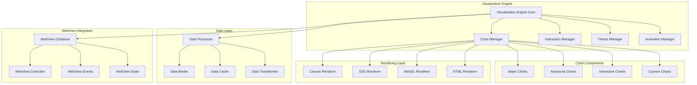

# 可视化引擎设计

## 1. 可视化引擎架构

### 1.1 整体架构图



### 1.2 可视化引擎核心实现

```typescript
// 可视化引擎核心实现
export class VisualizationEngine implements IVisualizationEngine {
	private chartManager: ChartManager
	private interactionManager: InteractionManager
	private themeManager: ThemeManager
	private animationManager: AnimationManager
	private dataProcessor: DataProcessor
	private renderers: Map<RendererType, IRenderer>
	private eventBus: EventBus
	private config: VisualizationConfig

	constructor(config: VisualizationConfig) {
		this.config = config
		this.chartManager = new ChartManager()
		this.interactionManager = new InteractionManager()
		this.themeManager = new ThemeManager(config.theme)
		this.animationManager = new AnimationManager(config.animation)
		this.dataProcessor = new DataProcessor()
		this.renderers = new Map()
		this.eventBus = new EventBus()
	}

	async initialize(): Promise<void> {
		// 初始化渲染器
		await this.initializeRenderers()

		// 初始化图表管理器
		await this.chartManager.initialize(this.renderers)

		// 初始化交互管理器
		await this.interactionManager.initialize()

		// 初始化主题管理器
		await this.themeManager.initialize()

		// 初始化动画管理器
		await this.animationManager.initialize()

		// 设置事件监听
		this.setupEventListeners()
	}

	async createChart(config: ChartConfig): Promise<IChart> {
		// 验证图表配置
		const validationResult = this.validateChartConfig(config)
		if (!validationResult.valid) {
			throw new ValidationError("Invalid chart configuration", validationResult.errors)
		}

		// 处理数据
		const processedData = await this.dataProcessor.process(config.data, config.dataTransform)

		// 创建图表实例
		const chart = await this.chartManager.createChart({
			...config,
			data: processedData,
			theme: this.themeManager.getCurrentTheme(),
			renderer: this.getRenderer(config.renderer || RendererType.CANVAS),
		})

		// 设置交互
		if (config.interactions) {
			await this.interactionManager.setupInteractions(chart, config.interactions)
		}

		// 设置动画
		if (config.animations) {
			await this.animationManager.setupAnimations(chart, config.animations)
		}

		// 触发事件
		this.eventBus.emit("chart.created", chart)

		return chart
	}

	async createDashboard(config: DashboardConfig): Promise<IDashboard> {
		// 创建仪表板容器
		const dashboard = new Dashboard(config, {
			chartManager: this.chartManager,
			themeManager: this.themeManager,
			eventBus: this.eventBus,
		})

		// 初始化仪表板
		await dashboard.initialize()

		// 创建图表组件
		for (const chartConfig of config.charts) {
			const chart = await this.createChart(chartConfig)
			await dashboard.addChart(chart, chartConfig.layout)
		}

		// 设置数据绑定
		if (config.dataBindings) {
			await this.setupDashboardDataBindings(dashboard, config.dataBindings)
		}

		return dashboard
	}

	async updateChartData(chartId: string, data: ChartData): Promise<void> {
		const chart = this.chartManager.getChart(chartId)
		if (!chart) {
			throw new Error(`Chart ${chartId} not found`)
		}

		// 处理新数据
		const processedData = await this.dataProcessor.process(data)

		// 更新图表
		await chart.updateData(processedData)

		// 触发动画
		if (chart.config.animations?.onDataUpdate) {
			await this.animationManager.playAnimation(chart, "dataUpdate")
		}

		// 触发事件
		this.eventBus.emit("chart.dataUpdated", { chartId, data: processedData })
	}

	private async initializeRenderers(): Promise<void> {
		// Canvas 渲染器
		const canvasRenderer = new CanvasRenderer({
			antialias: true,
			devicePixelRatio: window.devicePixelRatio || 1,
		})
		this.renderers.set(RendererType.CANVAS, canvasRenderer)

		// SVG 渲染器
		const svgRenderer = new SVGRenderer({
			precision: 2,
			enableCSSAnimations: true,
		})
		this.renderers.set(RendererType.SVG, svgRenderer)

		// WebGL 渲染器（用于大数据量可视化）
		if (this.config.enableWebGL) {
			const webglRenderer = new WebGLRenderer({
				antialias: true,
				alpha: true,
				preserveDrawingBuffer: false,
			})
			this.renderers.set(RendererType.WEBGL, webglRenderer)
		}

		// HTML 渲染器（用于简单图表）
		const htmlRenderer = new HTMLRenderer({
			enableTransitions: true,
			transitionDuration: 300,
		})
		this.renderers.set(RendererType.HTML, htmlRenderer)
	}

	private setupEventListeners(): void {
		// 监听主题变化
		this.themeManager.on("theme.changed", (theme: Theme) => {
			this.chartManager.updateAllChartsTheme(theme)
		})

		// 监听窗口大小变化
		window.addEventListener("resize", () => {
			this.chartManager.resizeAllCharts()
		})

		// 监听数据更新事件
		this.eventBus.on("data.updated", async (event: DataUpdateEvent) => {
			await this.handleDataUpdate(event)
		})
	}
}
```

## 2. 图表组件设计

### 2.1 基础图表组件

```typescript
// 基础图表抽象类
export abstract class BaseChart implements IChart {
	readonly id: string
	readonly type: ChartType
	readonly config: ChartConfig
	protected container: HTMLElement | null = null
	protected renderer: IRenderer
	protected data: ChartData
	protected theme: Theme
	protected eventBus: EventBus
	protected animationManager: AnimationManager

	constructor(config: ChartConfig, dependencies: ChartDependencies) {
		this.id = config.id
		this.type = config.type
		this.config = config
		this.renderer = dependencies.renderer
		this.data = config.data
		this.theme = dependencies.theme
		this.eventBus = dependencies.eventBus
		this.animationManager = dependencies.animationManager
	}

	async render(container: HTMLElement): Promise<void> {
		this.container = container

		// 创建图表容器
		const chartContainer = this.createChartContainer()
		container.appendChild(chartContainer)

		// 初始化渲染器
		await this.renderer.initialize(chartContainer)

		// 渲染图表
		await this.renderChart()

		// 设置事件监听
		this.setupEventListeners()

		// 播放入场动画
		if (this.config.animations?.onMount) {
			await this.animationManager.playAnimation(this, "mount")
		}
	}

	async updateData(data: ChartData): Promise<void> {
		const oldData = this.data
		this.data = data

		// 计算数据差异
		const dataDiff = this.calculateDataDiff(oldData, data)

		// 更新渲染
		await this.updateRender(dataDiff)

		// 触发事件
		this.eventBus.emit("chart.dataUpdated", {
			chartId: this.id,
			oldData,
			newData: data,
			diff: dataDiff,
		})
	}

	async updateTheme(theme: Theme): Promise<void> {
		this.theme = theme
		await this.applyTheme()
	}

	async resize(width?: number, height?: number): Promise<void> {
		if (!this.container) return

		const newWidth = width || this.container.clientWidth
		const newHeight = height || this.container.clientHeight

		await this.renderer.resize(newWidth, newHeight)
		await this.renderChart()
	}

	protected abstract renderChart(): Promise<void>
	protected abstract updateRender(dataDiff: DataDiff): Promise<void>
	protected abstract applyTheme(): Promise<void>

	protected createChartContainer(): HTMLElement {
		const container = document.createElement("div")
		container.className = `chart-container chart-${this.type}`
		container.id = `chart-${this.id}`

		// 应用基础样式
		container.style.width = "100%"
		container.style.height = "100%"
		container.style.position = "relative"

		return container
	}

	protected setupEventListeners(): void {
		if (!this.container) return

		// 鼠标事件
		this.container.addEventListener("mousemove", (event) => {
			this.handleMouseMove(event)
		})

		this.container.addEventListener("click", (event) => {
			this.handleClick(event)
		})

		this.container.addEventListener("wheel", (event) => {
			this.handleWheel(event)
		})
	}

	protected handleMouseMove(event: MouseEvent): void {
		const point = this.getChartPoint(event)
		const dataPoint = this.getDataPointAt(point)

		if (dataPoint) {
			this.showTooltip(dataPoint, point)
		} else {
			this.hideTooltip()
		}
	}

	protected handleClick(event: MouseEvent): void {
		const point = this.getChartPoint(event)
		const dataPoint = this.getDataPointAt(point)

		if (dataPoint) {
			this.eventBus.emit("chart.dataPointClicked", {
				chartId: this.id,
				dataPoint,
				event,
			})
		}
	}
}

// 线图实现
export class LineChart extends BaseChart {
	private path: Path2D | null = null
	private points: Point[] = []
	private scales: { x: Scale; y: Scale } | null = null

	protected async renderChart(): Promise<void> {
		if (!this.container || !this.renderer) return

		// 清除画布
		await this.renderer.clear()

		// 计算比例尺
		this.scales = this.calculateScales()

		// 计算点位置
		this.points = this.calculatePoints()

		// 绘制网格
		await this.drawGrid()

		// 绘制坐标轴
		await this.drawAxes()

		// 绘制线条
		await this.drawLine()

		// 绘制数据点
		await this.drawPoints()

		// 绘制标签
		await this.drawLabels()
	}

	protected async updateRender(dataDiff: DataDiff): Promise<void> {
		// 重新计算比例尺和点位置
		this.scales = this.calculateScales()
		const newPoints = this.calculatePoints()

		// 动画过渡到新位置
		if (this.config.animations?.onDataUpdate) {
			await this.animatePointTransition(this.points, newPoints)
		} else {
			this.points = newPoints
			await this.renderChart()
		}
	}

	protected async applyTheme(): Promise<void> {
		// 应用主题颜色和样式
		const lineColor = this.theme.colors.primary
		const pointColor = this.theme.colors.accent
		const gridColor = this.theme.colors.grid

		// 重新渲染以应用新主题
		await this.renderChart()
	}

	private calculateScales(): { x: Scale; y: Scale } {
		const data = this.data as LineChartData
		const containerRect = this.container!.getBoundingClientRect()

		const margin = { top: 20, right: 20, bottom: 40, left: 60 }
		const width = containerRect.width - margin.left - margin.right
		const height = containerRect.height - margin.top - margin.bottom

		// X轴比例尺
		const xExtent = d3.extent(data.points, (d) => d.x) as [number, number]
		const xScale = d3.scaleLinear().domain(xExtent).range([0, width])

		// Y轴比例尺
		const yExtent = d3.extent(data.points, (d) => d.y) as [number, number]
		const yScale = d3.scaleLinear().domain(yExtent).range([height, 0])

		return { x: xScale, y: yScale }
	}

	private calculatePoints(): Point[] {
		if (!this.scales) return []

		const data = this.data as LineChartData
		const margin = { top: 20, right: 20, bottom: 40, left: 60 }

		return data.points.map((point) => ({
			x: this.scales!.x(point.x) + margin.left,
			y: this.scales!.y(point.y) + margin.top,
			data: point,
		}))
	}

	private async drawLine(): Promise<void> {
		if (this.points.length === 0) return

		const lineGenerator = d3
			.line<Point>()
			.x((d) => d.x)
			.y((d) => d.y)
			.curve(d3.curveMonotoneX)

		const pathData = lineGenerator(this.points)
		if (!pathData) return

		await this.renderer.drawPath(pathData, {
			stroke: this.theme.colors.primary,
			strokeWidth: 2,
			fill: "none",
		})
	}

	private async drawPoints(): Promise<void> {
		for (const point of this.points) {
			await this.renderer.drawCircle(point.x, point.y, 4, {
				fill: this.theme.colors.accent,
				stroke: this.theme.colors.primary,
				strokeWidth: 1,
			})
		}
	}

	private async animatePointTransition(oldPoints: Point[], newPoints: Point[]): Promise<void> {
		const duration = 500
		const startTime = performance.now()

		const animate = (currentTime: number) => {
			const elapsed = currentTime - startTime
			const progress = Math.min(elapsed / duration, 1)

			// 使用缓动函数
			const easeProgress = this.easeInOutCubic(progress)

			// 插值计算当前点位置
			const currentPoints = oldPoints.map((oldPoint, index) => {
				const newPoint = newPoints[index]
				if (!newPoint) return oldPoint

				return {
					x: oldPoint.x + (newPoint.x - oldPoint.x) * easeProgress,
					y: oldPoint.y + (newPoint.y - oldPoint.y) * easeProgress,
					data: newPoint.data,
				}
			})

			this.points = currentPoints
			this.renderChart()

			if (progress < 1) {
				requestAnimationFrame(animate)
			}
		}

		requestAnimationFrame(animate)
	}

	private easeInOutCubic(t: number): number {
		return t < 0.5 ? 4 * t * t * t : (t - 1) * (2 * t - 2) * (2 * t - 2) + 1
	}
}

// 网络图实现
export class NetworkGraph extends BaseChart {
	private nodes: NetworkNode[] = []
	private links: NetworkLink[] = []
	private simulation: d3.Simulation<NetworkNode, NetworkLink> | null = null
	private zoom: d3.ZoomBehavior<SVGSVGElement, unknown> | null = null

	protected async renderChart(): Promise<void> {
		if (!this.container || !this.renderer) return

		// 准备数据
		this.prepareNetworkData()

		// 创建力导向布局
		this.createForceSimulation()

		// 渲染网络
		await this.renderNetwork()

		// 设置缩放
		this.setupZoom()
	}

	protected async updateRender(dataDiff: DataDiff): Promise<void> {
		// 更新网络数据
		this.prepareNetworkData()

		// 重启力导向模拟
		if (this.simulation) {
			this.simulation.nodes(this.nodes)
			this.simulation.force(
				"link",
				d3.forceLink(this.links).id((d: any) => d.id),
			)
			this.simulation.alpha(1).restart()
		}
	}

	protected async applyTheme(): Promise<void> {
		// 更新节点和连线颜色
		await this.updateNetworkColors()
	}

	private prepareNetworkData(): void {
		const data = this.data as NetworkGraphData

		// 处理节点
		this.nodes = data.nodes.map((node) => ({
			...node,
			x: node.x || Math.random() * this.container!.clientWidth,
			y: node.y || Math.random() * this.container!.clientHeight,
			vx: 0,
			vy: 0,
		}))

		// 处理连线
		this.links = data.links.map((link) => ({
			...link,
			source: typeof link.source === "string" ? this.nodes.find((n) => n.id === link.source)! : link.source,
			target: typeof link.target === "string" ? this.nodes.find((n) => n.id === link.target)! : link.target,
		}))
	}

	private createForceSimulation(): void {
		const width = this.container!.clientWidth
		const height = this.container!.clientHeight

		this.simulation = d3
			.forceSimulation(this.nodes)
			.force(
				"link",
				d3
					.forceLink(this.links)
					.id((d: any) => d.id)
					.distance(100),
			)
			.force("charge", d3.forceManyBody().strength(-300))
			.force("center", d3.forceCenter(width / 2, height / 2))
			.force("collision", d3.forceCollide().radius(30))

		this.simulation.on("tick", () => {
			this.updateNetworkPositions()
		})
	}

	private async renderNetwork(): Promise<void> {
		// 渲染连线
		for (const link of this.links) {
			await this.renderer.drawLine(
				(link.source as NetworkNode).x!,
				(link.source as NetworkNode).y!,
				(link.target as NetworkNode).x!,
				(link.target as NetworkNode).y!,
				{
					stroke: this.theme.colors.secondary,
					strokeWidth: link.weight || 1,
					opacity: 0.6,
				},
			)
		}

		// 渲染节点
		for (const node of this.nodes) {
			const radius = node.size || 10
			const color = node.color || this.theme.colors.primary

			await this.renderer.drawCircle(node.x!, node.y!, radius, {
				fill: color,
				stroke: this.theme.colors.background,
				strokeWidth: 2,
			})

			// 渲染标签
			if (node.label) {
				await this.renderer.drawText(node.label, node.x!, node.y! + radius + 15, {
					fontSize: 12,
					fill: this.theme.colors.text,
					textAlign: "center",
				})
			}
		}
	}

	private updateNetworkPositions(): void {
		// 更新渲染（在实际实现中，这里会更新DOM元素位置）
		this.renderChart()
	}

	private setupZoom(): void {
		if (this.renderer.type !== RendererType.SVG) return

		const svg = this.container!.querySelector("svg") as SVGSVGElement
		if (!svg) return

		this.zoom = d3
			.zoom<SVGSVGElement, unknown>()
			.scaleExtent([0.1, 10])
			.on("zoom", (event) => {
				const { transform } = event
				const g = svg.querySelector("g")
				if (g) {
					g.setAttribute("transform", transform.toString())
				}
			})

		d3.select(svg).call(this.zoom)
	}
}
```

### 2.2 高级图表组件

```typescript
// 热力图实现
export class HeatmapChart extends BaseChart {
	private colorScale: d3.ScaleSequential<string> | null = null
	private xScale: d3.ScaleBand<string> | null = null
	private yScale: d3.ScaleBand<string> | null = null

	protected async renderChart(): Promise<void> {
		if (!this.container || !this.renderer) return

		// 计算比例尺
		this.calculateScales()

		// 清除画布
		await this.renderer.clear()

		// 绘制热力图
		await this.drawHeatmap()

		// 绘制坐标轴
		await this.drawAxes()

		// 绘制图例
		await this.drawLegend()
	}

	protected async updateRender(dataDiff: DataDiff): Promise<void> {
		this.calculateScales()
		await this.renderChart()
	}

	protected async applyTheme(): Promise<void> {
		this.calculateScales()
		await this.renderChart()
	}

	private calculateScales(): void {
		const data = this.data as HeatmapData
		const containerRect = this.container!.getBoundingClientRect()

		const margin = { top: 20, right: 100, bottom: 60, left: 80 }
		const width = containerRect.width - margin.left - margin.right
		const height = containerRect.height - margin.top - margin.bottom

		// X轴比例尺
		this.xScale = d3.scaleBand().domain(data.xLabels).range([0, width]).padding(0.1)

		// Y轴比例尺
		this.yScale = d3.scaleBand().domain(data.yLabels).range([0, height]).padding(0.1)

		// 颜色比例尺
		const extent = d3.extent(data.values.flat()) as [number, number]
		this.colorScale = d3.scaleSequential(d3.interpolateViridis).domain(extent)
	}

	private async drawHeatmap(): Promise<void> {
		if (!this.xScale || !this.yScale || !this.colorScale) return

		const data = this.data as HeatmapData
		const margin = { top: 20, right: 100, bottom: 60, left: 80 }

		for (let i = 0; i < data.yLabels.length; i++) {
			for (let j = 0; j < data.xLabels.length; j++) {
				const value = data.values[i][j]
				const x = this.xScale(data.xLabels[j])! + margin.left
				const y = this.yScale(data.yLabels[i])! + margin.top
				const width = this.xScale.bandwidth()
				const height = this.yScale.bandwidth()
				const color = this.colorScale(value)

				await this.renderer.drawRect(x, y, width, height, {
					fill: color,
					stroke: this.theme.colors.background,
					strokeWidth: 1,
				})

				// 绘制数值标签
				if (this.config.showValues) {
					await this.renderer.drawText(value.toFixed(1), x + width / 2, y + height / 2, {
						fontSize: 10,
						fill: this.getContrastColor(color),
						textAlign: "center",
						textBaseline: "middle",
					})
				}
			}
		}
	}

	private getContrastColor(backgroundColor: string): string {
		// 计算对比色
		const rgb = d3.rgb(backgroundColor)
		const brightness = (rgb.r * 299 + rgb.g * 587 + rgb.b * 114) / 1000
		return brightness > 128 ? "#000000" : "#ffffff"
	}
}

// 树状图实现
export class TreeChart extends BaseChart {
	private root: d3.HierarchyNode<any> | null = null
	private treeLayout: d3.TreeLayout<any> | null = null

	protected async renderChart(): Promise<void> {
		if (!this.container || !this.renderer) return

		// 准备层次数据
		this.prepareHierarchyData()

		// 创建树布局
		this.createTreeLayout()

		// 渲染树
		await this.renderTree()
	}

	protected async updateRender(dataDiff: DataDiff): Promise<void> {
		this.prepareHierarchyData()
		this.createTreeLayout()
		await this.renderTree()
	}

	protected async applyTheme(): Promise<void> {
		await this.renderTree()
	}

	private prepareHierarchyData(): void {
		const data = this.data as TreeData
		this.root = d3.hierarchy(data.root)
	}

	private createTreeLayout(): void {
		if (!this.root) return

		const width = this.container!.clientWidth
		const height = this.container!.clientHeight

		this.treeLayout = d3.tree<any>().size([width - 100, height - 100])

		this.treeLayout(this.root)
	}

	private async renderTree(): Promise<void> {
		if (!this.root) return

		const margin = { top: 50, right: 50, bottom: 50, left: 50 }

		// 渲染连线
		const links = this.root.links()
		for (const link of links) {
			await this.renderer.drawLine(
				link.source.x! + margin.left,
				link.source.y! + margin.top,
				link.target.x! + margin.left,
				link.target.y! + margin.top,
				{
					stroke: this.theme.colors.secondary,
					strokeWidth: 2,
				},
			)
		}

		// 渲染节点
		const nodes = this.root.descendants()
		for (const node of nodes) {
			const x = node.x! + margin.left
			const y = node.y! + margin.top

			// 绘制节点圆圈
			await this.renderer.drawCircle(x, y, 8, {
				fill: node.children ? this.theme.colors.primary : this.theme.colors.accent,
				stroke: this.theme.colors.background,
				strokeWidth: 2,
			})

			// 绘制标签
			if (node.data.name) {
				await this.renderer.drawText(node.data.name, x, y - 15, {
					fontSize: 12,
					fill: this.theme.colors.text,
					textAlign: "center",
				})
			}
		}
	}
}
```

## 3. 交互式可视化设计

### 3.1 交互管理器

```typescript
// 交互管理器实现
export class InteractionManager {
	private interactions: Map<string, ChartInteraction>
	private eventBus: EventBus
	private gestureRecognizer: GestureRecognizer

	constructor() {
		this.interactions = new Map()
		this.eventBus = new EventBus()
		this.gestureRecognizer = new GestureRecognizer()
	}

	async initialize(): Promise<void> {
		await this.gestureRecognizer.initialize()
		this.setupGlobalEventListeners()
	}

	async setupInteractions(chart: IChart, interactions: InteractionConfig[]): Promise<void> {
		for (const config of interactions) {
			const interaction = this.createInteraction(config, chart)
			this.interactions.set(`${chart.id}-${config.type}`, interaction)
			await interaction.setup()
		}
	}

	private createInteraction(config: InteractionConfig, chart: IChart): ChartInteraction {
		switch (config.type) {
			case InteractionType.TOOLTIP:
				return new TooltipInteraction(config, chart, this.eventBus)
			case InteractionType.ZOOM:
				return new ZoomInteraction(config, chart, this.eventBus)
			case InteractionType.PAN:
				return new PanInteraction(config, chart, this.eventBus)
			case InteractionType.BRUSH:
				return new BrushInteraction(config, chart, this.eventBus)
			case InteractionType.SELECTION:
				return new SelectionInteraction(config, chart, this.eventBus)
			case InteractionType.DRILL_DOWN:
				return new DrillDownInteraction(config, chart, this.eventBus)
			default:
				throw new Error(`Unsupported interaction type: ${config.type}`)
		}
	}

	private setupGlobalEventListeners(): void {
		// 全局键盘事件
		document.addEventListener("keydown", (event) => {
			this.handleGlobalKeyDown(event)
		})

		// 全局鼠标事件
		document.addEventListener("mouseup", (event) => {
			this.handleGlobalMouseUp(event)
		})
	}
}

// 工具提示交互
export class TooltipInteraction implements ChartInteraction {
	private config: InteractionConfig
	private chart: IChart
	private eventBus: EventBus
	private tooltip: HTMLElement | null = null
	private isVisible: boolean = false

	constructor(config: InteractionConfig, chart: IChart, eventBus: EventBus) {
		this.config = config
		this.chart = chart
		this.eventBus = eventBus
	}

	async setup(): Promise<void> {
		this.createTooltip()
		this.setupEventListeners()
	}

	private createTooltip(): void {
		this.tooltip = document.createElement("div")
		this.tooltip.className = "chart-tooltip"
		this.tooltip.style.cssText = `
      position: absolute;
      background: rgba(0, 0, 0, 0.8);
      color: white;
      padding: 8px 12px;
      border-radius: 4px;
      font-size: 12px;
      pointer-events: none;
      z-index: 1000;
      opacity: 0;
      transition: opacity 0.2s ease;
    `

		document.body.appendChild(this.tooltip)
	}

	private setupEventListeners(): void {
		this.eventBus.on("chart.dataPointHover", (event: DataPointHoverEvent) => {
			if (event.chartId === this.chart.id) {
				this.showTooltip(event.dataPoint, event.position)
			}
		})

		this.eventBus.on("chart.dataPointLeave", (event: DataPointLeaveEvent) => {
			if (event.chartId === this.chart.id) {
				this.hideTooltip()
			}
		})
	}

	private showTooltip(dataPoint: any, position: Point): void {
		if (!this.tooltip) return

		// 格式化工具提示内容
		const content = this.formatTooltipContent(dataPoint)
		this.tooltip.innerHTML = content

		// 定位工具提示
		const tooltipRect = this.tooltip.getBoundingClientRect()
		const viewportWidth = window.innerWidth
		const viewportHeight = window.innerHeight

		let left = position.x + 10
		let top = position.y - 10

		// 防止工具提示超出视口
		if (left + tooltipRect.width > viewportWidth) {
			left = position.x - tooltipRect.width - 10
		}
		if (top - tooltipRect.height < 0) {
			top = position.y + 20
		}

		this.tooltip.style.left = `${left}px`
		this.tooltip.style.top = `${top}px`
		this.tooltip.style.opacity = "1"

		this.isVisible = true
	}

	private hideTooltip(): void {
		if (!this.tooltip || !this.isVisible) return

		this.tooltip.style.opacity = "0"
		this.isVisible = false
	}

	private formatTooltipContent(dataPoint: any): string {
		if (this.config.formatter) {
			return this.config.formatter(dataPoint)
		}

		// 默认格式化
		const entries = Object.entries(dataPoint)
			.filter(([key]) => key !== "id")
			.map(([key, value]) => `<div><strong>${key}:</strong> ${value}</div>`)

		return entries.join("")
	}
}

// 缩放交互
export class ZoomInteraction implements ChartInteraction {
	private config: InteractionConfig
	private chart: IChart
	private eventBus: EventBus
	private zoomBehavior: d3.ZoomBehavior<Element, unknown> | null = null
	private currentTransform: d3.ZoomTransform = d3.zoomIdentity

	constructor(config: InteractionConfig, chart: IChart, eventBus: EventBus) {
		this.config = config
		this.chart = chart
		this.eventBus = eventBus
	}

	async setup(): Promise<void> {
		this.createZoomBehavior()
		this.attachZoomBehavior()
	}

	private createZoomBehavior(): void {
		const minZoom = this.config.minZoom || 0.1
		const maxZoom = this.config.maxZoom || 10

		this.zoomBehavior = d3
			.zoom()
			.scaleExtent([minZoom, maxZoom])
			.on("zoom", (event) => {
				this.handleZoom(event)
			})
	}

	private attachZoomBehavior(): void {
		if (!this.chart.container || !this.zoomBehavior) return

		const zoomContainer = this.chart.container.querySelector(".zoom-container") || this.chart.container

		d3.select(zoomContainer).call(this.zoomBehavior)
	}

	private handleZoom(event: d3.D3ZoomEvent<Element, unknown>): void {
		this.currentTransform = event.transform

		// 应用变换到图表
		this.applyTransform(this.currentTransform)

		// 触发缩放事件
		this.eventBus.emit("chart.zoomed", {
			chartId: this.chart.id,
			transform: this.currentTransform,
			scale: this.currentTransform.k,
		})
	}

	private applyTransform(transform: d3.ZoomTransform): void {
		const chartContent = this.chart.container?.querySelector(".chart-content")
		if (chartContent) {
			;(chartContent as HTMLElement).style.transform = transform.toString()
		}
	}

	public resetZoom(): void {
		if (!this.zoomBehavior || !this.chart.container) return

		const zoomContainer = this.chart.container.querySelector(".zoom-container") || this.chart.container

		d3.select(zoomContainer).transition().duration(500).call(this.zoomBehavior.transform, d3.zoomIdentity)
	}
}
```

## 4. WebView 界面扩展设计

### 4.1 WebView 容器实现

```typescript
// WebView 容器实现
export class VisualizationWebView {
	private webview: vscode.Webview
	private panel: vscode.WebviewPanel
	private visualizationEngine: VisualizationEngine
	private messageHandler: WebViewMessageHandler
	private stateManager: WebViewStateManager

	constructor(context: vscode.ExtensionContext, config: WebViewConfig) {
		this.panel = vscode.window.createWebviewPanel(
			"kilocode-visualization",
			"Kilocode Visualization",
			vscode.ViewColumn.Two,
			{
				enableScripts: true,
				retainContextWhenHidden: true,
				localResourceRoots: [
					vscode.Uri.joinPath(context.extensionUri, "webview-ui"),
					vscode.Uri.joinPath(context.extensionUri, "node_modules"),
				],
			},
		)

		this.webview = this.panel.webview
		this.messageHandler = new WebViewMessageHandler(this.webview)
		this.stateManager = new WebViewStateManager()
		this.visualizationEngine = new VisualizationEngine(config.visualization)
	}

	async initialize(): Promise<void> {
		// 设置 WebView HTML 内容
		await this.setupWebViewContent()

		// 初始化可视化引擎
		await this.visualizationEngine.initialize()

		// 设置消息处理
		this.setupMessageHandling()

		// 设置状态管理
		await this.stateManager.initialize()

		// 监听面板事件
		this.setupPanelEventListeners()
	}

	async showDashboard(config: DashboardConfig): Promise<void> {
		const dashboard = await this.visualizationEngine.createDashboard(config)

		await this.messageHandler.sendMessage({
			type: "showDashboard",
			payload: {
				config,
				data: await dashboard.serialize(),
			},
		})
	}

	async updateChart(chartId: string, data: ChartData): Promise<void> {
		await this.visualizationEngine.updateChartData(chartId, data)

		await this.messageHandler.sendMessage({
			type: "updateChart",
			payload: {
				chartId,
				data,
			},
		})
	}

	private async setupWebViewContent(): Promise<void> {
		const htmlContent = await this.generateWebViewHTML()
		this.webview.html = htmlContent
	}

	private async generateWebViewHTML(): Promise<string> {
		const scriptUri = this.webview.asWebviewUri(
			vscode.Uri.joinPath(this.panel.webview.options.localResourceRoots![0], "main.js"),
		)

		const styleUri = this.webview.asWebviewUri(
			vscode.Uri.joinPath(this.panel.webview.options.localResourceRoots![0], "main.css"),
		)

		return `
      <!DOCTYPE html>
      <html lang="en">
      <head>
        <meta charset="UTF-8">
        <meta name="viewport" content="width=device-width, initial-scale=1.0">
        <title>Kilocode Visualization</title>
        <link href="${styleUri}" rel="stylesheet">
        <script src="https://d3js.org/d3.v7.min.js"></script>
        <script src="https://cdn.jsdelivr.net/npm/chart.js"></script>
      </head>
      <body>
        <div id="app">
          <div id="toolbar" class="toolbar">
            <div class="toolbar-section">
              <button id="refresh-btn" class="btn btn-primary">
                <i class="icon-refresh"></i> Refresh
              </button>
              <button id="export-btn" class="btn btn-secondary">
                <i class="icon-download"></i> Export
              </button>
            </div>
            <div class="toolbar-section">
              <select id="theme-selector" class="select">
                <option value="light">Light Theme</option>
                <option value="dark">Dark Theme</option>
                <option value="auto">Auto</option>
              </select>
            </div>
          </div>
          
          <div id="dashboard-container" class="dashboard-container">
            <div id="loading" class="loading">
              <div class="spinner"></div>
              <p>Loading visualization...</p>
            </div>
          </div>
          
          <div id="sidebar" class="sidebar">
            <div class="sidebar-header">
              <h3>Chart Controls</h3>
            </div>
            <div class="sidebar-content">
              <div id="chart-controls"></div>
            </div>
          </div>
        </div>
        
        <script src="${scriptUri}"></script>
      </body>
      </html>
    `
	}

	private setupMessageHandling(): void {
		this.webview.onDidReceiveMessage(async (message) => {
			await this.messageHandler.handleMessage(message)
		})

		// 注册消息处理器
		this.messageHandler.registerHandler("requestData", async (payload) => {
			return await this.handleDataRequest(payload)
		})

		this.messageHandler.registerHandler("chartInteraction", async (payload) => {
			await this.handleChartInteraction(payload)
		})

		this.messageHandler.registerHandler("exportChart", async (payload) => {
			return await this.handleChartExport(payload)
		})

		this.messageHandler.registerHandler("themeChanged", async (payload) => {
			await this.handleThemeChange(payload)
		})
	}

	private async handleDataRequest(payload: any): Promise<any> {
		const { dataType, parameters } = payload

		switch (dataType) {
			case "projectAnalysis":
				return await this.getProjectAnalysisData(parameters)
			case "qualityMetrics":
				return await this.getQualityMetricsData(parameters)
			case "dependencyGraph":
				return await this.getDependencyGraphData(parameters)
			default:
				throw new Error(`Unknown data type: ${dataType}`)
		}
	}

	private async handleChartInteraction(payload: any): Promise<void> {
		const { chartId, interactionType, data } = payload

		// 处理图表交互事件
		switch (interactionType) {
			case "dataPointClick":
				await this.handleDataPointClick(chartId, data)
				break
			case "zoomChange":
				await this.handleZoomChange(chartId, data)
				break
			case "selectionChange":
				await this.handleSelectionChange(chartId, data)
				break
		}
	}

	private async handleChartExport(payload: any): Promise<string> {
		const { chartId, format } = payload

		// 导出图表
		const chart = this.visualizationEngine.getChart(chartId)
		if (!chart) {
			throw new Error(`Chart ${chartId} not found`)
		}

		return await chart.export(format)
	}

	private setupPanelEventListeners(): void {
		// 监听面板关闭事件
		this.panel.onDidDispose(() => {
			this.dispose()
		})

		// 监听面板可见性变化
		this.panel.onDidChangeViewState((event) => {
			if (event.webviewPanel.visible) {
				this.onPanelVisible()
			} else {
				this.onPanelHidden()
			}
		})
	}

	private onPanelVisible(): void {
		// 面板变为可见时，刷新数据
		this.refreshAllCharts()
	}

	private onPanelHidden(): void {
		// 面板隐藏时，暂停数据更新
		this.pauseDataUpdates()
	}

	private async refreshAllCharts(): Promise<void> {
		const charts = this.visualizationEngine.getAllCharts()

		for (const chart of charts) {
			try {
				const latestData = await this.getLatestDataForChart(chart.id)
				await this.updateChart(chart.id, latestData)
			} catch (error) {
				console.error(`Failed to refresh chart ${chart.id}:`, error)
			}
		}
	}

	public dispose(): void {
		this.visualizationEngine.dispose()
		this.messageHandler.dispose()
		this.stateManager.dispose()
	}
}
```

### 4.2 数据绑定和更新机制

```typescript
// 数据绑定管理器
export class DataBindingManager {
	private bindings: Map<string, DataBinding>
	private updateScheduler: UpdateScheduler
	private eventBus: EventBus

	constructor() {
		this.bindings = new Map()
		this.updateScheduler = new UpdateScheduler()
		this.eventBus = new EventBus()
	}

	async initialize(): Promise<void> {
		await this.updateScheduler.initialize()
		this.setupEventListeners()
	}

	async createBinding(config: DataBindingConfig): Promise<DataBinding> {
		const binding = new DataBinding(config, {
			scheduler: this.updateScheduler,
			eventBus: this.eventBus,
		})

		await binding.initialize()
		this.bindings.set(binding.id, binding)

		return binding
	}

	async updateBinding(bindingId: string, data: any): Promise<void> {
		const binding = this.bindings.get(bindingId)
		if (!binding) {
			throw new Error(`Binding ${bindingId} not found`)
		}

		await binding.updateData(data)
	}

	private setupEventListeners(): void {
		// 监听数据源变化
		this.eventBus.on("dataSource.changed", async (event) => {
			await this.handleDataSourceChange(event)
		})

		// 监听绑定更新
		this.eventBus.on("binding.updated", (event) => {
			this.handleBindingUpdate(event)
		})
	}

	private async handleDataSourceChange(event: DataSourceChangeEvent): Promise<void> {
		// 找到受影响的绑定
		const affectedBindings = Array.from(this.bindings.values()).filter(
			(binding) => binding.dataSource === event.dataSource,
		)

		// 批量更新
		await Promise.all(affectedBindings.map((binding) => binding.refresh()))
	}
}

// 数据绑定实现
export class DataBinding {
	readonly id: string
	readonly config: DataBindingConfig
	readonly dataSource: string
	private scheduler: UpdateScheduler
	private eventBus: EventBus
	private lastUpdate: Date | null = null
	private updateInterval: number

	constructor(config: DataBindingConfig, dependencies: DataBindingDependencies) {
		this.id = config.id
		this.config = config
		this.dataSource = config.dataSource
		this.scheduler = dependencies.scheduler
		this.eventBus = dependencies.eventBus
		this.updateInterval = config.updateInterval || 30000 // 默认30秒
	}

	async initialize(): Promise<void> {
		// 设置定时更新
		if (this.config.autoUpdate) {
			this.scheduler.scheduleRecurring(this.id, () => this.refresh(), this.updateInterval)
		}

		// 初始数据加载
		await this.refresh()
	}

	async updateData(data: any): Promise<void> {
		// 数据转换
		const transformedData = await this.transformData(data)

		// 数据验证
		const validationResult = this.validateData(transformedData)
		if (!validationResult.valid) {
			throw new ValidationError("Invalid data", validationResult.errors)
		}

		// 更新时间戳
		this.lastUpdate = new Date()

		// 触发更新事件
		this.eventBus.emit("binding.updated", {
			bindingId: this.id,
			data: transformedData,
			timestamp: this.lastUpdate,
		})
	}

	async refresh(): Promise<void> {
		try {
			// 从数据源获取最新数据
			const data = await this.fetchDataFromSource()

			// 更新数据
			await this.updateData(data)
		} catch (error) {
			console.error(`Failed to refresh binding ${this.id}:`, error)

			// 触发错误事件
			this.eventBus.emit("binding.error", {
				bindingId: this.id,
				error,
				timestamp: new Date(),
			})
		}
	}

	private async fetchDataFromSource(): Promise<any> {
		// 根据数据源类型获取数据
		switch (this.config.sourceType) {
			case DataSourceType.ANALYSIS_RESULTS:
				return await this.fetchAnalysisResults()
			case DataSourceType.PROJECT_METRICS:
				return await this.fetchProjectMetrics()
			case DataSourceType.TASK_STATUS:
				return await this.fetchTaskStatus()
			case DataSourceType.REAL_TIME_EVENTS:
				return await this.fetchRealTimeEvents()
			default:
				throw new Error(`Unsupported data source type: ${this.config.sourceType}`)
		}
	}

	private async transformData(data: any): Promise<any> {
		if (!this.config.transform) {
			return data
		}

		// 应用数据转换
		const transformer = new DataTransformer(this.config.transform)
		return await transformer.transform(data)
	}

	private validateData(data: any): ValidationResult {
		if (!this.config.validation) {
			return { valid: true, errors: [] }
		}

		const validator = new DataValidator(this.config.validation)
		return validator.validate(data)
	}
}

// 更新调度器
export class UpdateScheduler {
	private scheduledTasks: Map<string, ScheduledTask>
	private isRunning: boolean = false

	constructor() {
		this.scheduledTasks = new Map()
	}

	async initialize(): Promise<void> {
		this.isRunning = true
		this.startScheduler()
	}

	scheduleRecurring(taskId: string, task: () => Promise<void>, interval: number): void {
		const scheduledTask: ScheduledTask = {
			id: taskId,
			task,
			interval,
			lastRun: null,
			nextRun: new Date(Date.now() + interval),
		}

		this.scheduledTasks.set(taskId, scheduledTask)
	}

	scheduleOnce(taskId: string, task: () => Promise<void>, delay: number): void {
		const scheduledTask: ScheduledTask = {
			id: taskId,
			task,
			interval: 0,
			lastRun: null,
			nextRun: new Date(Date.now() + delay),
		}

		this.scheduledTasks.set(taskId, scheduledTask)
	}

	unschedule(taskId: string): void {
		this.scheduledTasks.delete(taskId)
	}

	private startScheduler(): void {
		const checkInterval = 1000 // 每秒检查一次

		const check = async () => {
			if (!this.isRunning) return

			const now = new Date()

			for (const [taskId, scheduledTask] of this.scheduledTasks) {
				if (now >= scheduledTask.nextRun) {
					try {
						await scheduledTask.task()
						scheduledTask.lastRun = now

						// 如果是重复任务，计算下次运行时间
						if (scheduledTask.interval > 0) {
							scheduledTask.nextRun = new Date(now.getTime() + scheduledTask.interval)
						} else {
							// 一次性任务，执行后移除
							this.scheduledTasks.delete(taskId)
						}
					} catch (error) {
						console.error(`Scheduled task ${taskId} failed:`, error)
					}
				}
			}

			setTimeout(check, checkInterval)
		}

		check()
	}

	dispose(): void {
		this.isRunning = false
		this.scheduledTasks.clear()
	}
}
```

---

_可视化引擎设计提供了完整的数据可视化能力，包括多种图表类型、交互功能、WebView 集成和实时数据绑定，为 Kilocode 项目提供了强大的可视化分析界面。_
