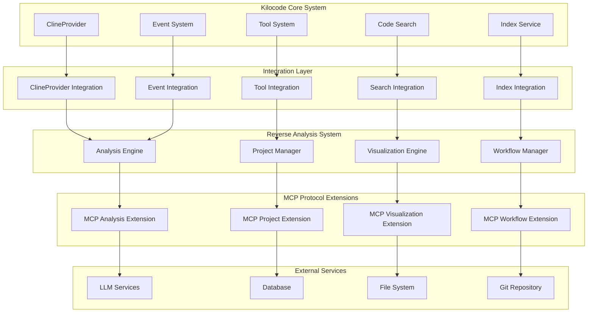

# 集成设计

## 1. 集成架构总览

### 1.1 集成架构图



### 1.2 集成策略

```typescript
// 集成管理器核心实现
export class IntegrationManager {
	private clineIntegration: ClineProviderIntegration
	private toolIntegration: ToolSystemIntegration
	private searchIntegration: SearchIntegration
	private indexIntegration: IndexIntegration
	private eventIntegration: EventIntegration
	private mcpExtensions: Map<string, MCPExtension>
	private eventBus: EventBus
	private config: IntegrationConfig

	constructor(config: IntegrationConfig) {
		this.config = config
		this.eventBus = new EventBus()
		this.mcpExtensions = new Map()

		// 初始化集成组件
		this.clineIntegration = new ClineProviderIntegration(config.cline, this.eventBus)
		this.toolIntegration = new ToolSystemIntegration(config.tools, this.eventBus)
		this.searchIntegration = new SearchIntegration(config.search, this.eventBus)
		this.indexIntegration = new IndexIntegration(config.index, this.eventBus)
		this.eventIntegration = new EventIntegration(config.events, this.eventBus)
	}

	async initialize(): Promise<void> {
		// 初始化各个集成组件
		await this.clineIntegration.initialize()
		await this.toolIntegration.initialize()
		await this.searchIntegration.initialize()
		await this.indexIntegration.initialize()
		await this.eventIntegration.initialize()

		// 初始化 MCP 扩展
		await this.initializeMCPExtensions()

		// 设置跨组件事件监听
		this.setupCrossComponentEvents()

		// 验证集成完整性
		await this.validateIntegration()
	}

	async registerMCPExtension(extension: MCPExtension): Promise<void> {
		await extension.initialize()
		this.mcpExtensions.set(extension.name, extension)

		// 注册扩展的工具和资源
		await this.toolIntegration.registerExtensionTools(extension.getTools())
		await this.searchIntegration.registerExtensionResources(extension.getResources())
	}

	private async initializeMCPExtensions(): Promise<void> {
		const extensions = [
			new AnalysisMCPExtension(this.config.mcp.analysis),
			new ProjectMCPExtension(this.config.mcp.project),
			new VisualizationMCPExtension(this.config.mcp.visualization),
			new WorkflowMCPExtension(this.config.mcp.workflow),
		]

		for (const extension of extensions) {
			await this.registerMCPExtension(extension)
		}
	}

	private setupCrossComponentEvents(): void {
		// 分析完成后触发项目管理更新
		this.eventBus.on("analysis.completed", async (results: AnalysisResults) => {
			await this.clineIntegration.notifyAnalysisCompleted(results)
			await this.toolIntegration.updateToolsWithAnalysis(results)
		})

		// 项目变更时触发重新分析
		this.eventBus.on("project.changed", async (change: ProjectChange) => {
			await this.searchIntegration.updateSearchIndex(change)
			await this.indexIntegration.incrementalUpdate(change)
		})

		// 工具执行结果反馈到可视化
		this.eventBus.on("tool.executed", async (result: ToolExecutionResult) => {
			await this.eventIntegration.broadcastToolResult(result)
		})
	}

	private async validateIntegration(): Promise<void> {
		const validations = [
			this.clineIntegration.validate(),
			this.toolIntegration.validate(),
			this.searchIntegration.validate(),
			this.indexIntegration.validate(),
			this.eventIntegration.validate(),
		]

		const results = await Promise.all(validations)
		const failures = results.filter((r) => !r.valid)

		if (failures.length > 0) {
			throw new IntegrationError("Integration validation failed", failures)
		}
	}
}
```

## 2. ClineProvider 集成

### 2.1 ClineProvider 集成实现

```typescript
// ClineProvider 集成实现
export class ClineProviderIntegration {
	private clineProvider: ClineProvider
	private analysisEngine: AnalysisEngine
	private projectManager: ProjectManager
	private eventBus: EventBus
	private config: ClineIntegrationConfig
	private toolRegistry: Map<string, AnalysisTool>

	constructor(config: ClineIntegrationConfig, eventBus: EventBus) {
		this.config = config
		this.eventBus = eventBus
		this.toolRegistry = new Map()
	}

	async initialize(): Promise<void> {
		// 获取 ClineProvider 实例
		this.clineProvider = await this.getClineProviderInstance()

		// 注册分析工具到 ClineProvider
		await this.registerAnalysisTools()

		// 设置事件监听
		this.setupEventListeners()

		// 扩展 ClineProvider 功能
		await this.extendClineProvider()
	}

	private async getClineProviderInstance(): Promise<ClineProvider> {
		// 从 Kilocode 核心系统获取 ClineProvider 实例
		const coreSystem = await import("../core/providers/ClineProvider")
		return coreSystem.ClineProvider.getInstance()
	}

	private async registerAnalysisTools(): Promise<void> {
		const analysisTools = [
			new ProjectAnalysisTool(),
			new QualityAnalysisTool(),
			new SecurityAnalysisTool(),
			new DependencyAnalysisTool(),
			new VisualizationTool(),
			new ReportGenerationTool(),
		]

		for (const tool of analysisTools) {
			await this.clineProvider.registerTool(tool)
			this.toolRegistry.set(tool.name, tool)
		}
	}

	private setupEventListeners(): void {
		// 监听 ClineProvider 的工具调用
		this.clineProvider.on("tool.called", async (event: ToolCallEvent) => {
			if (this.toolRegistry.has(event.toolName)) {
				await this.handleAnalysisToolCall(event)
			}
		})

		// 监听项目上下文变化
		this.clineProvider.on("context.changed", async (context: ProjectContext) => {
			await this.handleContextChange(context)
		})
	}

	private async extendClineProvider(): void {
		// 扩展 ClineProvider 的分析能力
		const analysisCapability = new AnalysisCapability({
			analysisEngine: this.analysisEngine,
			projectManager: this.projectManager,
			eventBus: this.eventBus,
		})

		await this.clineProvider.addCapability("analysis", analysisCapability)

		// 扩展项目管理能力
		const projectCapability = new ProjectManagementCapability({
			projectManager: this.projectManager,
			eventBus: this.eventBus,
		})

		await this.clineProvider.addCapability("project-management", projectCapability)
	}

	async notifyAnalysisCompleted(results: AnalysisResults): Promise<void> {
		// 将分析结果添加到 ClineProvider 的上下文中
		await this.clineProvider.addToContext({
			type: "analysis-results",
			data: results,
			timestamp: new Date(),
			relevance: "high",
		})

		// 生成分析摘要供 AI 使用
		const summary = this.generateAnalysisSummary(results)
		await this.clineProvider.addToContext({
			type: "analysis-summary",
			data: summary,
			timestamp: new Date(),
			relevance: "medium",
		})
	}

	private async handleAnalysisToolCall(event: ToolCallEvent): Promise<void> {
		const tool = this.toolRegistry.get(event.toolName)
		if (!tool) return

		try {
			// 执行分析工具
			const result = await tool.execute(event.parameters, event.context)

			// 将结果返回给 ClineProvider
			await this.clineProvider.returnToolResult(event.callId, result)

			// 触发内部事件
			this.eventBus.emit("analysis.tool.executed", {
				toolName: event.toolName,
				parameters: event.parameters,
				result,
				timestamp: new Date(),
			})
		} catch (error) {
			// 错误处理
			await this.clineProvider.returnToolError(event.callId, error)

			this.eventBus.emit("analysis.tool.error", {
				toolName: event.toolName,
				error,
				timestamp: new Date(),
			})
		}
	}

	private generateAnalysisSummary(results: AnalysisResults): string {
		const summary = `
# Project Analysis Summary

## Overview
- **Project**: ${results.projectId}
- **Analysis Date**: ${results.generatedAt.toISOString()}
- **Total Files**: ${results.summary.totalFiles}
- **Lines of Code**: ${results.summary.linesOfCode}
- **Overall Score**: ${results.summary.overallScore}/100

## Key Findings
${this.formatKeyFindings(results)}

## Recommendations
${this.formatRecommendations(results)}

## Quality Metrics
${this.formatQualityMetrics(results.qualityAnalysis)}

## Security Issues
${this.formatSecurityIssues(results.securityAnalysis)}
    `

		return summary.trim()
	}
}

// 项目分析工具
export class ProjectAnalysisTool implements AnalysisTool {
	readonly name = "project-analysis"
	readonly description = "Analyze project structure, dependencies, and code quality"

	readonly parameters = {
		type: "object",
		properties: {
			projectPath: {
				type: "string",
				description: "Path to the project root directory",
			},
			analysisType: {
				type: "string",
				enum: ["full", "incremental", "quick"],
				description: "Type of analysis to perform",
			},
			includeTests: {
				type: "boolean",
				description: "Whether to include test files in analysis",
				default: true,
			},
			analyzers: {
				type: "array",
				items: {
					type: "string",
					enum: ["structure", "dependency", "quality", "security"],
				},
				description: "Specific analyzers to run",
			},
		},
		required: ["projectPath"],
	}

	async execute(parameters: any, context: ToolContext): Promise<ToolResult> {
		const { projectPath, analysisType = "full", includeTests = true, analyzers } = parameters

		try {
			// 创建分析配置
			const analysisConfig: AnalysisConfig = {
				projectPath,
				analysisType,
				includeTests,
				analyzers: analyzers || ["structure", "dependency", "quality", "security"],
				outputFormat: "detailed",
			}

			// 执行分析
			const analysisEngine = new AnalysisEngine()
			const results = await analysisEngine.analyze(analysisConfig)

			// 格式化结果
			const formattedResults = this.formatAnalysisResults(results)

			return {
				success: true,
				data: formattedResults,
				message: "Project analysis completed successfully",
			}
		} catch (error) {
			return {
				success: false,
				error: error.message,
				message: "Project analysis failed",
			}
		}
	}

	private formatAnalysisResults(results: AnalysisResults): any {
		return {
			summary: {
				projectId: results.projectId,
				totalFiles: results.summary.totalFiles,
				linesOfCode: results.summary.linesOfCode,
				overallScore: results.summary.overallScore,
				analysisDate: results.generatedAt,
			},
			structure: results.structureAnalysis
				? {
						projectType: results.structureAnalysis.projectType,
						mainDirectories: results.structureAnalysis.structure.children?.slice(0, 10),
						buildSystem: results.structureAnalysis.buildSystem,
					}
				: null,
			quality: results.qualityAnalysis
				? {
						overallScore: results.qualityAnalysis.overallScore,
						categoryScores: results.qualityAnalysis.categoryScores,
						issueCount: results.qualityAnalysis.issues.length,
						topIssues: results.qualityAnalysis.issues
							.sort((a, b) => b.severity.localeCompare(a.severity))
							.slice(0, 5),
					}
				: null,
			security: results.securityAnalysis
				? {
						vulnerabilityCount: results.securityAnalysis.vulnerabilityStats.total,
						criticalIssues: results.securityAnalysis.securityIssues.filter(
							(issue) => issue.severity === "critical",
						).length,
						topVulnerabilities: results.securityAnalysis.securityIssues.slice(0, 5),
					}
				: null,
			dependencies: results.dependencyAnalysis
				? {
						totalDependencies: results.dependencyAnalysis.dependencyGraph.nodes.length,
						circularDependencies: results.dependencyAnalysis.circularDependencies.length,
						outdatedPackages: results.dependencyAnalysis.outdatedDependencies?.length || 0,
					}
				: null,
		}
	}
}
```

### 2.2 分析能力扩展

```typescript
// 分析能力扩展
export class AnalysisCapability implements ClineCapability {
	readonly name = "analysis"
	readonly description = "Advanced code analysis and project insights"

	private analysisEngine: AnalysisEngine
	private projectManager: ProjectManager
	private eventBus: EventBus

	constructor(dependencies: AnalysisCapabilityDependencies) {
		this.analysisEngine = dependencies.analysisEngine
		this.projectManager = dependencies.projectManager
		this.eventBus = dependencies.eventBus
	}

	async initialize(): Promise<void> {
		// 初始化分析能力
	}

	async getContextualInsights(context: ProjectContext): Promise<ContextualInsight[]> {
		const insights: ContextualInsight[] = []

		// 基于当前文件的洞察
		if (context.currentFile) {
			const fileInsights = await this.getFileInsights(context.currentFile)
			insights.push(...fileInsights)
		}

		// 基于选中代码的洞察
		if (context.selectedCode) {
			const codeInsights = await this.getCodeInsights(context.selectedCode)
			insights.push(...codeInsights)
		}

		// 基于项目状态的洞察
		const projectInsights = await this.getProjectInsights(context.projectPath)
		insights.push(...projectInsights)

		return insights
	}

	async suggestImprovements(context: ProjectContext): Promise<ImprovementSuggestion[]> {
		const suggestions: ImprovementSuggestion[] = []

		// 获取最新分析结果
		const project = await this.projectManager.getProject(context.projectPath)
		const latestAnalysis = await project?.getLatestAnalysis()

		if (!latestAnalysis) {
			suggestions.push({
				type: "analysis",
				priority: "high",
				title: "Run Project Analysis",
				description: "No recent analysis found. Run a comprehensive project analysis to get insights.",
				action: {
					type: "tool-call",
					tool: "project-analysis",
					parameters: { projectPath: context.projectPath },
				},
			})
			return suggestions
		}

		// 基于质量分析的建议
		if (latestAnalysis.qualityAnalysis) {
			const qualitySuggestions = this.generateQualitySuggestions(latestAnalysis.qualityAnalysis)
			suggestions.push(...qualitySuggestions)
		}

		// 基于安全分析的建议
		if (latestAnalysis.securityAnalysis) {
			const securitySuggestions = this.generateSecuritySuggestions(latestAnalysis.securityAnalysis)
			suggestions.push(...securitySuggestions)
		}

		// 基于依赖分析的建议
		if (latestAnalysis.dependencyAnalysis) {
			const dependencySuggestions = this.generateDependencySuggestions(latestAnalysis.dependencyAnalysis)
			suggestions.push(...dependencySuggestions)
		}

		return suggestions.sort((a, b) => this.getPriorityWeight(b.priority) - this.getPriorityWeight(a.priority))
	}

	private async getFileInsights(filePath: string): Promise<ContextualInsight[]> {
		const insights: ContextualInsight[] = []

		// 文件复杂度洞察
		const complexity = await this.analysisEngine.analyzeFileComplexity(filePath)
		if (complexity.cyclomaticComplexity > 10) {
			insights.push({
				type: "complexity",
				severity: "warning",
				message: `This file has high cyclomatic complexity (${complexity.cyclomaticComplexity}). Consider refactoring.`,
				location: { filePath },
				suggestion: "Break down large functions into smaller, more focused functions.",
			})
		}

		// 代码重复洞察
		const duplication = await this.analysisEngine.analyzeCodeDuplication(filePath)
		if (duplication.duplicatedLines > 50) {
			insights.push({
				type: "duplication",
				severity: "info",
				message: `Found ${duplication.duplicatedLines} lines of duplicated code in this file.`,
				location: { filePath },
				suggestion: "Extract common code into reusable functions or modules.",
			})
		}

		return insights
	}

	private generateQualitySuggestions(qualityAnalysis: CodeQualityResult): ImprovementSuggestion[] {
		const suggestions: ImprovementSuggestion[] = []

		// 低质量分数建议
		if (qualityAnalysis.overallScore < 70) {
			suggestions.push({
				type: "quality",
				priority: "high",
				title: "Improve Code Quality",
				description: `Overall quality score is ${qualityAnalysis.overallScore}/100. Focus on addressing critical issues.`,
				action: {
					type: "workflow",
					workflow: "quality-improvement",
					parameters: { analysisResults: qualityAnalysis },
				},
			})
		}

		// 特定类别的建议
		Object.entries(qualityAnalysis.categoryScores).forEach(([category, score]) => {
			if (score < 60) {
				suggestions.push({
					type: "quality",
					priority: "medium",
					title: `Improve ${category}`,
					description: `${category} score is ${score}/100. Review and address related issues.`,
					action: {
						type: "filter-issues",
						category,
					},
				})
			}
		})

		return suggestions
	}
}
```

## 3. 工具系统集成

### 3.1 工具系统集成实现

```typescript
// 工具系统集成实现
export class ToolSystemIntegration {
	private toolSystem: ToolSystem
	private analysisTools: Map<string, AnalysisTool>
	private projectTools: Map<string, ProjectTool>
	private visualizationTools: Map<string, VisualizationTool>
	private eventBus: EventBus
	private config: ToolIntegrationConfig

	constructor(config: ToolIntegrationConfig, eventBus: EventBus) {
		this.config = config
		this.eventBus = eventBus
		this.analysisTools = new Map()
		this.projectTools = new Map()
		this.visualizationTools = new Map()
	}

	async initialize(): Promise<void> {
		// 获取现有工具系统
		this.toolSystem = await this.getToolSystemInstance()

		// 注册新的分析工具
		await this.registerAnalysisTools()

		// 注册项目管理工具
		await this.registerProjectTools()

		// 注册可视化工具
		await this.registerVisualizationTools()

		// 设置工具间的协作
		this.setupToolCollaboration()
	}

	private async getToolSystemInstance(): Promise<ToolSystem> {
		// 从 Kilocode 核心系统获取工具系统实例
		const coreSystem = await import("../core/tools")
		return coreSystem.ToolSystem.getInstance()
	}

	private async registerAnalysisTools(): Promise<void> {
		const tools = [
			new StructureAnalysisTool(),
			new DependencyAnalysisTool(),
			new QualityAnalysisTool(),
			new SecurityAnalysisTool(),
			new PerformanceAnalysisTool(),
			new TestCoverageAnalysisTool(),
		]

		for (const tool of tools) {
			await this.toolSystem.registerTool(tool)
			this.analysisTools.set(tool.name, tool)
		}
	}

	private async registerProjectTools(): Promise<void> {
		const tools = [
			new ProjectDashboardTool(),
			new TaskManagementTool(),
			new WorkflowExecutionTool(),
			new ReportGenerationTool(),
			new ProjectMetricsTool(),
			new ProjectComparisonTool(),
		]

		for (const tool of tools) {
			await this.toolSystem.registerTool(tool)
			this.projectTools.set(tool.name, tool)
		}
	}

	private async registerVisualizationTools(): Promise<void> {
		const tools = [
			new ChartGenerationTool(),
			new DashboardCreationTool(),
			new NetworkVisualizationTool(),
			new HeatmapGenerationTool(),
			new TreeVisualizationTool(),
			new DataExportTool(),
		]

		for (const tool of tools) {
			await this.toolSystem.registerTool(tool)
			this.visualizationTools.set(tool.name, tool)
		}
	}

	async updateToolsWithAnalysis(results: AnalysisResults): Promise<void> {
		// 更新工具的上下文信息
		const context = {
			analysisResults: results,
			projectPath: results.projectId,
			timestamp: results.generatedAt,
		}

		// 通知所有相关工具
		for (const tool of this.analysisTools.values()) {
			if (tool.updateContext) {
				await tool.updateContext(context)
			}
		}

		for (const tool of this.projectTools.values()) {
			if (tool.updateContext) {
				await tool.updateContext(context)
			}
		}
	}

	private setupToolCollaboration(): void {
		// 设置工具间的数据流
		this.eventBus.on("tool.analysis.completed", async (event) => {
			// 分析完成后，自动触发相关工具
			await this.triggerDependentTools(event.toolName, event.result)
		})

		// 设置工具链
		this.setupToolChains()
	}

	private setupToolChains(): void {
		// 分析工具链：结构分析 -> 依赖分析 -> 质量分析 -> 安全分析
		this.toolSystem.createToolChain("comprehensive-analysis", [
			"structure-analysis",
			"dependency-analysis",
			"quality-analysis",
			"security-analysis",
		])

		// 可视化工具链：数据准备 -> 图表生成 -> 仪表板创建
		this.toolSystem.createToolChain("visualization-pipeline", [
			"data-preparation",
			"chart-generation",
			"dashboard-creation",
		])

		// 项目管理工具链：分析 -> 任务生成 -> 工作流执行
		this.toolSystem.createToolChain("project-management-pipeline", [
			"project-analysis",
			"task-generation",
			"workflow-execution",
		])
	}
}

// 结构分析工具
export class StructureAnalysisTool implements AnalysisTool {
	readonly name = "structure-analysis"
	readonly description = "Analyze project structure and organization"

	readonly parameters = {
		type: "object",
		properties: {
			projectPath: {
				type: "string",
				description: "Path to the project root",
			},
			depth: {
				type: "number",
				description: "Maximum depth to analyze",
				default: 10,
			},
			includeHidden: {
				type: "boolean",
				description: "Include hidden files and directories",
				default: false,
			},
		},
		required: ["projectPath"],
	}

	async execute(parameters: any, context: ToolContext): Promise<ToolResult> {
		const { projectPath, depth = 10, includeHidden = false } = parameters

		try {
			const analyzer = new ProjectStructureAnalyzer({
				maxDepth: depth,
				includeHidden,
				excludePatterns: ["node_modules/**", ".git/**", "dist/**", "build/**"],
			})

			const result = await analyzer.analyze(projectPath)

			return {
				success: true,
				data: {
					projectType: result.projectType,
					structure: result.structure,
					statistics: result.statistics,
					buildSystem: result.buildSystem,
					recommendations: this.generateStructureRecommendations(result),
				},
				message: "Project structure analysis completed",
			}
		} catch (error) {
			return {
				success: false,
				error: error.message,
				message: "Structure analysis failed",
			}
		}
	}

	private generateStructureRecommendations(result: ProjectStructureResult): string[] {
		const recommendations: string[] = []

		// 检查项目组织
		if (result.statistics.maxDepth > 8) {
			recommendations.push(
				"Consider flattening the directory structure - very deep nesting can make navigation difficult",
			)
		}

		if (result.statistics.totalDirectories > 100) {
			recommendations.push("Large number of directories detected - consider consolidating related modules")
		}

		// 检查构建系统
		if (!result.buildSystem) {
			recommendations.push("No build system detected - consider adding package.json, Makefile, or similar")
		}

		// 检查文档
		const hasReadme = result.structure.children?.some((child) => child.name.toLowerCase().includes("readme"))
		if (!hasReadme) {
			recommendations.push("Add a README file to document the project")
		}

		return recommendations
	}
}

// 依赖分析工具
export class DependencyAnalysisTool implements AnalysisTool {
	readonly name = "dependency-analysis"
	readonly description = "Analyze project dependencies and relationships"

	readonly parameters = {
		type: "object",
		properties: {
			projectPath: {
				type: "string",
				description: "Path to the project root",
			},
			includeDevDependencies: {
				type: "boolean",
				description: "Include development dependencies",
				default: true,
			},
			checkOutdated: {
				type: "boolean",
				description: "Check for outdated dependencies",
				default: true,
			},
			analyzeCircular: {
				type: "boolean",
				description: "Analyze circular dependencies",
				default: true,
			},
		},
		required: ["projectPath"],
	}

	async execute(parameters: any, context: ToolContext): Promise<ToolResult> {
		const { projectPath, includeDevDependencies = true, checkOutdated = true, analyzeCircular = true } = parameters

		try {
			const analyzer = new DependencyAnalyzer({
				includeDevDependencies,
				checkOutdated,
				analyzeCircular,
			})

			const result = await analyzer.analyze(projectPath)

			return {
				success: true,
				data: {
					dependencyGraph: result.dependencyGraph,
					statistics: result.statistics,
					circularDependencies: result.circularDependencies,
					outdatedDependencies: result.outdatedDependencies,
					securityVulnerabilities: result.securityVulnerabilities,
					recommendations: this.generateDependencyRecommendations(result),
				},
				message: "Dependency analysis completed",
			}
		} catch (error) {
			return {
				success: false,
				error: error.message,
				message: "Dependency analysis failed",
			}
		}
	}

	private generateDependencyRecommendations(result: DependencyAnalysisResult): string[] {
		const recommendations: string[] = []

		// 循环依赖建议
		if (result.circularDependencies.length > 0) {
			recommendations.push(
				`Found ${result.circularDependencies.length} circular dependencies - consider refactoring to break cycles`,
			)
		}

		// 过时依赖建议
		if (result.outdatedDependencies && result.outdatedDependencies.length > 0) {
			const criticalOutdated = result.outdatedDependencies.filter((dep) => dep.severity === "major")
			if (criticalOutdated.length > 0) {
				recommendations.push(
					`${criticalOutdated.length} dependencies are significantly outdated - update to improve security and performance`,
				)
			}
		}

		// 安全漏洞建议
		if (result.securityVulnerabilities && result.securityVulnerabilities.length > 0) {
			const highSeverity = result.securityVulnerabilities.filter(
				(vuln) => vuln.severity === "high" || vuln.severity === "critical",
			)
			if (highSeverity.length > 0) {
				recommendations.push(
					`${highSeverity.length} high-severity security vulnerabilities found - update affected packages immediately`,
				)
			}
		}

		return recommendations
	}
}
```

## 4. 代码索引系统集成

### 4.1 索引系统集成实现

```typescript
// 代码索引系统集成
export class IndexIntegration {
	private indexService: IndexService
	private analysisEngine: AnalysisEngine
	private eventBus: EventBus
	private config: IndexIntegrationConfig
	private indexUpdateQueue: IndexUpdateQueue

	constructor(config: IndexIntegrationConfig, eventBus: EventBus) {
		this.config = config
		this.eventBus = eventBus
		this.indexUpdateQueue = new IndexUpdateQueue()
	}

	async initialize(): Promise<void> {
		// 获取现有索引服务
		this.indexService = await this.getIndexServiceInstance()

		// 扩展索引模式
		await this.extendIndexSchema()

		// 设置增量更新
		this.setupIncrementalUpdating()

		// 设置事件监听
		this.setupEventListeners()
	}

	private async getIndexServiceInstance(): Promise<IndexService> {
		const coreSystem = await import("../core/services/IndexService")
		return coreSystem.IndexService.getInstance()
	}

	private async extendIndexSchema(): Promise<void> {
		// 扩展索引以支持分析结果
		const analysisSchema = {
			name: "analysis-results",
			fields: {
				projectId: { type: "string", indexed: true },
				analysisType: { type: "string", indexed: true },
				timestamp: { type: "date", indexed: true },
				overallScore: { type: "number", indexed: true },
				qualityScore: { type: "number", indexed: true },
				securityScore: { type: "number", indexed: true },
				issues: { type: "nested", indexed: true },
				tags: { type: "string[]", indexed: true },
			},
		}

		await this.indexService.addSchema(analysisSchema)

		// 扩展文件索引以包含分析元数据
		const fileAnalysisSchema = {
			name: "file-analysis",
			fields: {
				filePath: { type: "string", indexed: true },
				projectId: { type: "string", indexed: true },
				complexity: { type: "number", indexed: true },
				qualityScore: { type: "number", indexed: true },
				issues: { type: "nested", indexed: true },
				dependencies: { type: "string[]", indexed: true },
				lastAnalyzed: { type: "date", indexed: true },
			},
		}

		await this.indexService.addSchema(fileAnalysisSchema)
	}

	async incrementalUpdate(change: ProjectChange): Promise<void> {
		// 将更新添加到队列
		this.indexUpdateQueue.enqueue({
			type: change.type,
			filePath: change.filePath,
			projectId: change.projectId,
			timestamp: new Date(),
		})

		// 如果队列达到阈值，立即处理
		if (this.indexUpdateQueue.size() >= this.config.batchSize) {
			await this.processPendingUpdates()
		}
	}

	private async processPendingUpdates(): Promise<void> {
		const updates = this.indexUpdateQueue.dequeueAll()
		if (updates.length === 0) return

		// 按项目分组更新
		const updatesByProject = this.groupUpdatesByProject(updates)

		for (const [projectId, projectUpdates] of updatesByProject) {
			await this.processProjectUpdates(projectId, projectUpdates)
		}
	}

	private async processProjectUpdates(projectId: string, updates: IndexUpdate[]): Promise<void> {
		// 获取受影响的文件
		const affectedFiles = [...new Set(updates.map((u) => u.filePath))]

		// 重新分析受影响的文件
		for (const filePath of affectedFiles) {
			try {
				const analysisResult = await this.analysisEngine.analyzeFile(filePath)
				await this.updateFileIndex(filePath, analysisResult)
			} catch (error) {
				console.error(`Failed to update index for ${filePath}:`, error)
			}
		}

		// 更新项目级别的索引
		await this.updateProjectIndex(projectId)
	}

	private async updateFileIndex(filePath: string, analysis: FileAnalysisResult): Promise<void> {
		const indexData = {
			filePath,
			projectId: analysis.projectId,
			complexity: analysis.complexity?.cyclomaticComplexity || 0,
			qualityScore: analysis.qualityScore || 0,
			issues: analysis.issues || [],
			dependencies: analysis.dependencies || [],
			lastAnalyzed: new Date(),
		}

		await this.indexService.upsert("file-analysis", filePath, indexData)
	}

	private async updateProjectIndex(projectId: string): Promise<void> {
		// 获取项目的最新分析结果
		const latestAnalysis = await this.getLatestProjectAnalysis(projectId)
		if (!latestAnalysis) return

		const indexData = {
			projectId,
			analysisType: "comprehensive",
			timestamp: latestAnalysis.generatedAt,
			overallScore: latestAnalysis.summary.overallScore,
			qualityScore: latestAnalysis.qualityAnalysis?.overallScore || 0,
			securityScore: latestAnalysis.securityAnalysis?.overallScore || 0,
			issues: this.extractIssuesForIndex(latestAnalysis),
			tags: this.generateProjectTags(latestAnalysis),
		}

		await this.indexService.upsert("analysis-results", projectId, indexData)
	}

	async searchAnalysisResults(query: AnalysisSearchQuery): Promise<AnalysisSearchResult[]> {
		const searchParams = {
			index: "analysis-results",
			query: this.buildSearchQuery(query),
			sort: query.sort || [{ timestamp: "desc" }],
			size: query.limit || 50,
			from: query.offset || 0,
		}

		const results = await this.indexService.search(searchParams)
		return results.hits.map((hit) => this.mapSearchHitToResult(hit))
	}

	private buildSearchQuery(query: AnalysisSearchQuery): any {
		const must: any[] = []
		const filter: any[] = []

		// 文本搜索
		if (query.text) {
			must.push({
				multi_match: {
					query: query.text,
					fields: ["projectId", "issues.description", "tags"],
				},
			})
		}

		// 项目过滤
		if (query.projectIds && query.projectIds.length > 0) {
			filter.push({
				terms: { projectId: query.projectIds },
			})
		}

		// 分数范围过滤
		if (query.minScore !== undefined) {
			filter.push({
				range: { overallScore: { gte: query.minScore } },
			})
		}

		if (query.maxScore !== undefined) {
			filter.push({
				range: { overallScore: { lte: query.maxScore } },
			})
		}

		// 时间范围过滤
		if (query.dateRange) {
			filter.push({
				range: {
					timestamp: {
						gte: query.dateRange.from,
						lte: query.dateRange.to,
					},
				},
			})
		}

		return {
			bool: {
				must: must.length > 0 ? must : [{ match_all: {} }],
				filter,
			},
		}
	}

	private setupEventListeners(): void {
		// 监听分析完成事件
		this.eventBus.on("analysis.completed", async (results: AnalysisResults) => {
			await this.updateProjectIndex(results.projectId)
		})

		// 监听文件变更事件
		this.eventBus.on("file.changed", async (event: FileChangeEvent) => {
			await this.incrementalUpdate({
				type: "file-changed",
				filePath: event.filePath,
				projectId: event.projectId,
			})
		})

		// 定期处理待更新的索引
		setInterval(async () => {
			await this.processPendingUpdates()
		}, this.config.updateInterval || 30000)
	}
}

// 索引更新队列
export class IndexUpdateQueue {
	private queue: IndexUpdate[] = []
	private processing: boolean = false

	enqueue(update: IndexUpdate): void {
		this.queue.push(update)
	}

	dequeueAll(): IndexUpdate[] {
		const updates = [...this.queue]
		this.queue = []
		return updates
	}

	size(): number {
		return this.queue.length
	}

	isEmpty(): boolean {
		return this.queue.length === 0
	}
}
```

## 5. MCP 协议扩展

### 5.1 分析 MCP 扩展

```typescript
// 分析 MCP 扩展
export class AnalysisMCPExtension implements MCPExtension {
	readonly name = "kilocode-analysis"
	readonly version = "1.0.0"
	readonly description = "Advanced code analysis capabilities for Kilocode"

	private analysisEngine: AnalysisEngine
	private tools: Map<string, MCPTool>
	private resources: Map<string, MCPResource>

	constructor(config: AnalysisMCPConfig) {
		this.analysisEngine = new AnalysisEngine(config.analysis)
		this.tools = new Map()
		this.resources = new Map()
	}

	async initialize(): Promise<void> {
		await this.analysisEngine.initialize()
		this.registerTools()
		this.registerResources()
	}

	getTools(): MCPTool[] {
		return Array.from(this.tools.values())
	}

	getResources(): MCPResource[] {
		return Array.from(this.resources.values())
	}

	private registerTools(): void {
		// 项目分析工具
		this.tools.set("analyze_project", {
			name: "analyze_project",
			description: "Perform comprehensive project analysis",
			inputSchema: {
				type: "object",
				properties: {
					project_path: {
						type: "string",
						description: "Path to the project root directory",
					},
					analysis_types: {
						type: "array",
						items: {
							type: "string",
							enum: ["structure", "dependency", "quality", "security", "performance"],
						},
						description: "Types of analysis to perform",
					},
					output_format: {
						type: "string",
						enum: ["summary", "detailed", "json"],
						default: "summary",
						description: "Format of the analysis output",
					},
				},
				required: ["project_path"],
			},
			handler: this.handleProjectAnalysis.bind(this),
		})

		// 文件分析工具
		this.tools.set("analyze_file", {
			name: "analyze_file",
			description: "Analyze a specific file for quality and issues",
			inputSchema: {
				type: "object",
				properties: {
					file_path: {
						type: "string",
						description: "Path to the file to analyze",
					},
					analysis_depth: {
						type: "string",
						enum: ["basic", "detailed", "comprehensive"],
						default: "detailed",
						description: "Depth of analysis to perform",
					},
				},
				required: ["file_path"],
			},
			handler: this.handleFileAnalysis.bind(this),
		})

		// 代码质量检查工具
		this.tools.set("check_quality", {
			name: "check_quality",
			description: "Check code quality metrics and issues",
			inputSchema: {
				type: "object",
				properties: {
					target: {
						type: "string",
						description: "File or directory path to check",
					},
					rules: {
						type: "array",
						items: { type: "string" },
						description: "Specific quality rules to check",
					},
					threshold: {
						type: "number",
						minimum: 0,
						maximum: 100,
						description: "Quality threshold (0-100)",
					},
				},
				required: ["target"],
			},
			handler: this.handleQualityCheck.bind(this),
		})

		// 安全扫描工具
		this.tools.set("security_scan", {
			name: "security_scan",
			description: "Scan for security vulnerabilities",
			inputSchema: {
				type: "object",
				properties: {
					target: {
						type: "string",
						description: "Path to scan for security issues",
					},
					scan_types: {
						type: "array",
						items: {
							type: "string",
							enum: ["static", "dependency", "secrets", "configuration"],
						},
						description: "Types of security scans to perform",
					},
					severity_filter: {
						type: "string",
						enum: ["all", "high", "critical"],
						default: "all",
						description: "Minimum severity level to report",
					},
				},
				required: ["target"],
			},
			handler: this.handleSecurityScan.bind(this),
		})
	}

	private registerResources(): void {
		// 分析结果资源
		this.resources.set("analysis_results", {
			uri: "kilocode://analysis/results/{project_id}",
			name: "Analysis Results",
			description: "Access to project analysis results",
			mimeType: "application/json",
			handler: this.getAnalysisResults.bind(this),
		})

		// 质量报告资源
		this.resources.set("quality_report", {
			uri: "kilocode://quality/report/{project_id}",
			name: "Quality Report",
			description: "Detailed code quality report",
			mimeType: "text/markdown",
			handler: this.getQualityReport.bind(this),
		})

		// 安全报告资源
		this.resources.set("security_report", {
			uri: "kilocode://security/report/{project_id}",
			name: "Security Report",
			description: "Security vulnerability report",
			mimeType: "text/markdown",
			handler: this.getSecurityReport.bind(this),
		})
	}

	private async handleProjectAnalysis(params: any): Promise<MCPToolResult> {
		try {
			const { project_path, analysis_types = ["structure", "quality"], output_format = "summary" } = params

			const config: AnalysisConfig = {
				projectPath: project_path,
				analyzers: analysis_types,
				outputFormat: output_format,
			}

			const results = await this.analysisEngine.analyze(config)

			return {
				content: [
					{
						type: "text",
						text: this.formatAnalysisResults(results, output_format),
					},
				],
			}
		} catch (error) {
			return {
				content: [
					{
						type: "text",
						text: `Analysis failed: ${error.message}`,
					},
				],
				isError: true,
			}
		}
	}

	private async handleFileAnalysis(params: any): Promise<MCPToolResult> {
		try {
			const { file_path, analysis_depth = "detailed" } = params

			const result = await this.analysisEngine.analyzeFile(file_path, {
				depth: analysis_depth,
			})

			return {
				content: [
					{
						type: "text",
						text: this.formatFileAnalysisResult(result),
					},
				],
			}
		} catch (error) {
			return {
				content: [
					{
						type: "text",
						text: `File analysis failed: ${error.message}`,
					},
				],
				isError: true,
			}
		}
	}

	private async handleQualityCheck(params: any): Promise<MCPToolResult> {
		try {
			const { target, rules, threshold } = params

			const qualityResult = await this.analysisEngine.checkQuality(target, {
				rules,
				threshold,
			})

			return {
				content: [
					{
						type: "text",
						text: this.formatQualityResult(qualityResult),
					},
				],
			}
		} catch (error) {
			return {
				content: [
					{
						type: "text",
						text: `Quality check failed: ${error.message}`,
					},
				],
				isError: true,
			}
		}
	}

	private async handleSecurityScan(params: any): Promise<MCPToolResult> {
		try {
			const { target, scan_types = ["static", "dependency"], severity_filter = "all" } = params

			const securityResult = await this.analysisEngine.scanSecurity(target, {
				scanTypes: scan_types,
				severityFilter: severity_filter,
			})

			return {
				content: [
					{
						type: "text",
						text: this.formatSecurityResult(securityResult),
					},
				],
			}
		} catch (error) {
			return {
				content: [
					{
						type: "text",
						text: `Security scan failed: ${error.message}`,
					},
				],
				isError: true,
			}
		}
	}

	private formatAnalysisResults(results: AnalysisResults, format: string): string {
		switch (format) {
			case "summary":
				return this.formatAnalysisSummary(results)
			case "detailed":
				return this.formatDetailedAnalysis(results)
			case "json":
				return JSON.stringify(results, null, 2)
			default:
				return this.formatAnalysisSummary(results)
		}
	}

	private formatAnalysisSummary(results: AnalysisResults): string {
		return `
# Project Analysis Summary

**Project**: ${results.projectId}
**Analysis Date**: ${results.generatedAt.toISOString()}
**Overall Score**: ${results.summary.overallScore}/100

## Key Metrics
- **Total Files**: ${results.summary.totalFiles}
- **Lines of Code**: ${results.summary.linesOfCode}
- **Critical Issues**: ${results.summary.criticalIssues}

## Quality Analysis
${
	results.qualityAnalysis
		? `
- **Overall Quality**: ${results.qualityAnalysis.overallScore}/100
- **Maintainability**: ${results.qualityAnalysis.categoryScores.maintainability}/100
- **Reliability**: ${results.qualityAnalysis.categoryScores.reliability}/100
- **Security**: ${results.qualityAnalysis.categoryScores.security}/100
`
		: "Not performed"
}

## Security Analysis
${
	results.securityAnalysis
		? `
- **Vulnerabilities Found**: ${results.securityAnalysis.vulnerabilityStats.total}
- **Critical**: ${results.securityAnalysis.vulnerabilityStats.critical}
- **High**: ${results.securityAnalysis.vulnerabilityStats.high}
`
		: "Not performed"
}

## Recommendations
${this.generateRecommendations(results).join("\n")}
    `.trim()
	}

	private generateRecommendations(results: AnalysisResults): string[] {
		const recommendations: string[] = []

		if (results.summary.overallScore < 70) {
			recommendations.push("- Consider addressing critical quality issues to improve overall score")
		}

		if (results.securityAnalysis?.vulnerabilityStats.critical > 0) {
			recommendations.push("- Immediately address critical security vulnerabilities")
		}

		if (results.qualityAnalysis?.categoryScores.maintainability < 60) {
			recommendations.push("- Focus on improving code maintainability through refactoring")
		}

		return recommendations
	}
}
```

---

_集成设计文档详细描述了逆向项目分析系统与 Kilocode 现有系统的集成方案，包括 ClineProvider 集成、工具系统集成、代码索引集成和 MCP 协议扩展，确保新功能能够无缝融入现有架构。_
