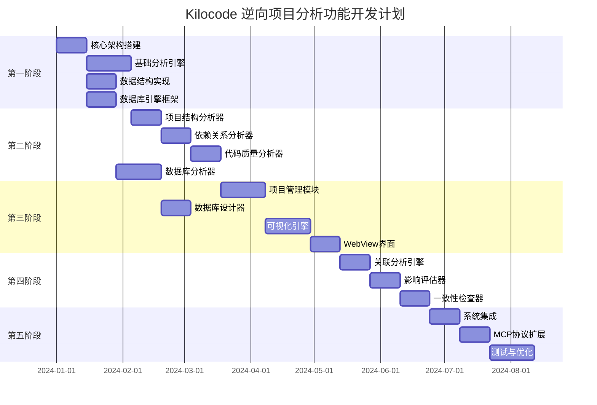
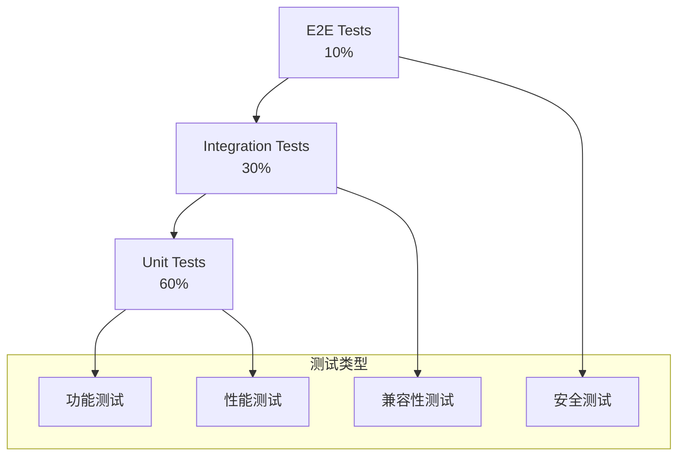

# 实施计划

## 1. 开发阶段划分

### 1.1 整体开发策略



### 1.2 开发阶段详细规划

#### 第一阶段：基础架构（4-5周）

**目标**：建立核心架构和基础设施

**主要任务**：

1. **核心架构搭建**（2周）

    - 实现事件驱动架构
    - 建立依赖注入容器
    - 创建配置管理系统
    - 实现基础错误处理

2. **基础分析引擎**（3周）

    - 实现分析引擎核心框架
    - 创建分析器基础接口
    - 实现分析会话管理
    - 建立结果缓存机制
    - 搭建数据库引擎基础框架

3. **数据结构实现**（2周）
    - 实现所有核心数据类型
    - 创建数据验证机制
    - 实现数据序列化/反序列化
    - 建立数据持久化基础
    - 创建数据库连接管理器

#### 第二阶段：分析器实现（8-10周）

**目标**：实现核心分析功能

**主要任务**：

1. **项目结构分析器**（2周）

    - 实现目录扫描器
    - 创建文件分类器
    - 实现项目类型检测
    - 建立构建系统识别

2. **依赖关系分析器**（2周）

    - 实现依赖图构建
    - 创建循环依赖检测
    - 实现包管理器集成
    - 建立依赖安全检查

3. **代码质量分析器**（2周）

    - 实现复杂度分析
    - 创建代码风格检查
    - 实现重复代码检测
    - 建立质量评分算法

4. **数据库结构分析器**（1周）

    - 实现数据库模式分析
    - 创建表关系检测
    - 实现索引分析
    - 建立数据类型检查

5. **数据库性能分析器**（1周）

    - 实现查询性能分析
    - 创建索引优化建议
    - 实现慢查询检测
    - 建立性能基准测试

6. **数据库安全审计器**（1周）
    - 实现权限检查
    - 创建安全漏洞扫描
    - 实现合规性检查
    - 建立安全评分机制

#### 第三阶段：管理与可视化（8-10周）

**目标**：实现项目管理和可视化功能

**主要任务**：

1. **项目管理模块**（3周）

    - 实现项目管理器
    - 创建任务管理系统
    - 实现工作流引擎
    - 建立报告生成系统

2. **数据库设计管理模块**（2周）

    - 实现数据库设计器
    - 创建ER图生成器
    - 实现数据库版本管理
    - 建立数据库文档生成

3. **可视化引擎**（3周）

    - 实现图表组件库
    - 创建交互式可视化
    - 实现数据绑定机制
    - 建立主题系统

4. **WebView界面**（2周）
    - 实现仪表板界面
    - 创建分析结果展示
    - 实现用户交互功能
    - 建立响应式布局

#### 第四阶段：数据库集成与关联分析（6-8周）

**目标**：实现数据库与项目的深度集成

**主要任务**：

1. **关联分析引擎**（2周）

    - 实现数据库与代码关联分析
    - 创建ORM映射检测
    - 实现查询与代码关联
    - 建立数据流追踪

2. **影响评估器**（2周）

    - 实现数据库变更影响分析
    - 创建代码变更影响评估
    - 实现依赖链影响分析
    - 建立风险评估机制

3. **一致性检查器**（2周）
    - 实现数据模型一致性检查
    - 创建API与数据库一致性验证
    - 实现文档与实现一致性检查
    - 建立自动化验证流程

#### 第五阶段：集成与优化（7-8周）

**目标**：完成系统集成和性能优化

**主要任务**：

1. **系统集成**（2周）

    - 实现ClineProvider集成
    - 创建工具系统集成
    - 实现索引系统集成
    - 建立事件系统集成

2. **MCP协议扩展**（2周）

    - 实现分析MCP扩展
    - 创建项目管理MCP扩展
    - 实现可视化MCP扩展
    - 建立工作流MCP扩展

3. **测试与优化**（3周）
    - 实现单元测试
    - 创建集成测试
    - 进行性能优化
    - 完成文档编写

## 2. 每个阶段的交付物

### 2.1 第一阶段交付物

#### 核心架构组件

```typescript
// 交付的核心组件
export interface Phase1Deliverables {
	// 事件系统
	eventBus: EventBus

	// 依赖注入容器
	container: DIContainer

	// 配置管理
	configManager: ConfigManager

	// 分析引擎框架
	analysisEngine: AnalysisEngineFramework

	// 基础数据结构
	dataStructures: {
		AnalysisConfig: typeof AnalysisConfig
		AnalysisResults: typeof AnalysisResults
		ProjectStructure: typeof ProjectStructure
		// ... 其他数据结构
	}
}
```

#### 验收标准

- [ ] 事件系统能够正常发布和订阅事件
- [ ] 依赖注入容器能够管理组件生命周期
- [ ] 配置管理能够加载和验证配置
- [ ] 分析引擎框架能够注册和执行分析器
- [ ] 所有数据结构通过类型检查和验证测试

### 2.2 第二阶段交付物

#### 分析器组件

```typescript
// 交付的分析器组件
export interface Phase2Deliverables {
	// 项目结构分析器
	structureAnalyzer: ProjectStructureAnalyzer

	// 依赖关系分析器
	dependencyAnalyzer: DependencyAnalyzer

	// 代码质量分析器
	qualityAnalyzer: CodeQualityAnalyzer

	// 分析器注册表
	analyzerRegistry: AnalyzerRegistry
}
```

#### 验收标准

- [ ] 项目结构分析器能够正确识别项目类型和结构
- [ ] 依赖关系分析器能够构建完整的依赖图
- [ ] 代码质量分析器能够生成准确的质量评分
- [ ] 所有分析器能够处理常见的项目类型
- [ ] 分析结果符合预定义的数据格式

### 2.3 第三阶段交付物

#### 管理与可视化组件

```typescript
// 交付的管理与可视化组件
export interface Phase3Deliverables {
	// 项目管理器
	projectManager: ProjectManager

	// 可视化引擎
	visualizationEngine: VisualizationEngine

	// WebView界面
	webviewUI: WebViewUI

	// 仪表板组件
	dashboardComponents: DashboardComponent[]
}
```

#### 验收标准

- [ ] 项目管理器能够管理多个项目的分析结果
- [ ] 可视化引擎能够生成各种类型的图表
- [ ] WebView界面能够正确显示分析结果
- [ ] 仪表板提供完整的项目概览功能
- [ ] 用户界面响应流畅，体验良好

### 2.4 第四阶段交付物

#### 集成与扩展组件

```typescript
// 交付的集成与扩展组件
export interface Phase4Deliverables {
	// 集成管理器
	integrationManager: IntegrationManager

	// MCP扩展
	mcpExtensions: MCPExtension[]

	// 完整的测试套件
	testSuite: TestSuite

	// 性能优化组件
	performanceOptimizations: PerformanceOptimization[]
}
```

#### 验收标准

- [ ] 与ClineProvider的集成功能正常
- [ ] 与工具系统的集成功能正常
- [ ] MCP协议扩展能够正确响应外部调用
- [ ] 所有功能通过集成测试
- [ ] 系统性能满足预期指标

## 3. 资源需求

### 3.1 人力资源

**核心开发团队**（5-6人）：

- **架构师**（1人）：负责整体架构设计和技术决策
- **前端开发工程师**（1人）：负责 WebView 界面和可视化组件
- **后端开发工程师**（2人）：负责分析引擎和项目管理模块
- **数据库工程师**（1人）：负责数据库分析和设计功能
- **测试工程师**（1人）：负责测试用例设计和质量保证

**预估工作量**：

- 总开发时间：26-32周
- 总人月：22-28人月
- 核心功能开发：20-24周
- 测试和优化：6-8周

### 3.2 技术资源

**开发环境**：

- Node.js 18+ 开发环境
- TypeScript 5.0+ 编译环境
- VS Code 扩展开发工具链
- Docker 容器化环境

**测试环境**：

- 多种项目类型的测试样本
- 性能测试基准环境
- 自动化测试基础设施
- 持续集成/持续部署管道

**第三方服务**：

- 代码质量分析服务
- 安全扫描服务
- 性能监控服务
- 文档生成服务

## 4. 技术风险评估

### 4.1 高风险项目

#### 风险1：与现有系统的兼容性

**风险等级**：高
**影响范围**：整个系统集成
**风险描述**：新功能可能与现有Kilocode系统产生冲突

**缓解策略**：

```typescript
// 兼容性检查机制
export class CompatibilityChecker {
	async checkSystemCompatibility(): Promise<CompatibilityReport> {
		const checks = [
			this.checkClineProviderVersion(),
			this.checkToolSystemVersion(),
			this.checkIndexServiceVersion(),
			this.checkEventSystemVersion(),
		]

		const results = await Promise.all(checks)
		return this.generateCompatibilityReport(results)
	}

	private async checkClineProviderVersion(): Promise<VersionCheck> {
		// 检查ClineProvider版本兼容性
		const currentVersion = await this.getClineProviderVersion()
		const requiredVersion = this.config.requiredVersions.clineProvider

		return {
			component: "ClineProvider",
			currentVersion,
			requiredVersion,
			compatible: this.isVersionCompatible(currentVersion, requiredVersion),
		}
	}
}
```

**监控指标**：

- 系统启动成功率
- 功能集成测试通过率
- 现有功能回归测试通过率

#### 风险2：性能影响

**风险等级**：中高
**影响范围**：系统整体性能
**风险描述**：大型项目分析可能影响IDE响应性能

**缓解策略**：

```typescript
// 性能监控和优化
export class PerformanceMonitor {
	private metrics: PerformanceMetrics = new PerformanceMetrics()

	async monitorAnalysisPerformance(analysisConfig: AnalysisConfig): Promise<void> {
		const startTime = performance.now()
		const memoryBefore = process.memoryUsage()

		try {
			// 执行分析
			await this.executeAnalysis(analysisConfig)
		} finally {
			const endTime = performance.now()
			const memoryAfter = process.memoryUsage()

			this.metrics.recordAnalysis({
				duration: endTime - startTime,
				memoryUsed: memoryAfter.heapUsed - memoryBefore.heapUsed,
				projectSize: analysisConfig.projectSize,
				analysisType: analysisConfig.analysisType,
			})

			// 检查性能阈值
			if (endTime - startTime > this.config.performanceThresholds.maxAnalysisTime) {
				this.handlePerformanceIssue("analysis_timeout", {
					duration: endTime - startTime,
					threshold: this.config.performanceThresholds.maxAnalysisTime,
				})
			}
		}
	}
}
```

**监控指标**：

- 分析执行时间
- 内存使用量
- CPU使用率
- IDE响应时间

#### 风险3：数据一致性

**风险等级**：中
**影响范围**：分析结果准确性
**风险描述**：多个分析器之间的数据可能不一致

**缓解策略**：

```typescript
// 数据一致性检查
export class DataConsistencyValidator {
	async validateAnalysisResults(results: AnalysisResults): Promise<ValidationResult> {
		const validations = [
			this.validateStructureConsistency(results),
			this.validateDependencyConsistency(results),
			this.validateQualityConsistency(results),
			this.validateCrossAnalyzerConsistency(results),
		]

		const validationResults = await Promise.all(validations)
		return this.aggregateValidationResults(validationResults)
	}

	private async validateCrossAnalyzerConsistency(results: AnalysisResults): Promise<ValidationResult> {
		const issues: ValidationIssue[] = []

		// 检查文件列表一致性
		const structureFiles = results.structureAnalysis?.fileList || []
		const qualityFiles = results.qualityAnalysis?.analyzedFiles || []

		const missingFiles = structureFiles.filter((file) => !qualityFiles.includes(file))
		if (missingFiles.length > 0) {
			issues.push({
				type: "missing_files",
				severity: "warning",
				message: `${missingFiles.length} files found in structure analysis but missing in quality analysis`,
				affectedFiles: missingFiles,
			})
		}

		return {
			valid: issues.length === 0,
			issues,
		}
	}
}
```

### 3.2 中风险项目

#### 风险4：第三方依赖

**风险等级**：中
**影响范围**：特定分析功能
**风险描述**：依赖的第三方分析工具可能不稳定

**缓解策略**：

- 实现分析器的降级机制
- 提供多个分析器实现的选择
- 建立分析器健康检查机制

#### 风险5：大型项目处理

**风险等级**：中
**影响范围**：分析功能可用性
**风险描述**：超大型项目可能导致分析失败或超时

**缓解策略**：

- 实现增量分析机制
- 提供分析范围限制选项
- 建立分析任务的分片处理

### 3.3 风险监控仪表板

```typescript
// 风险监控系统
export class RiskMonitoringDashboard {
	private riskMetrics: Map<string, RiskMetric> = new Map()

	async updateRiskMetrics(): Promise<void> {
		// 更新兼容性风险指标
		const compatibilityRisk = await this.assessCompatibilityRisk()
		this.riskMetrics.set("compatibility", compatibilityRisk)

		// 更新性能风险指标
		const performanceRisk = await this.assessPerformanceRisk()
		this.riskMetrics.set("performance", performanceRisk)

		// 更新数据一致性风险指标
		const consistencyRisk = await this.assessConsistencyRisk()
		this.riskMetrics.set("consistency", consistencyRisk)

		// 生成风险报告
		await this.generateRiskReport()
	}

	private async assessPerformanceRisk(): Promise<RiskMetric> {
		const recentAnalyses = await this.getRecentAnalyses(24) // 最近24小时
		const avgDuration = recentAnalyses.reduce((sum, a) => sum + a.duration, 0) / recentAnalyses.length
		const maxMemoryUsage = Math.max(...recentAnalyses.map((a) => a.memoryUsage))

		let riskLevel: RiskLevel = "low"
		if (avgDuration > this.thresholds.performance.warning) {
			riskLevel = "medium"
		}
		if (avgDuration > this.thresholds.performance.critical) {
			riskLevel = "high"
		}

		return {
			level: riskLevel,
			score: this.calculateRiskScore(avgDuration, maxMemoryUsage),
			indicators: {
				avgDuration,
				maxMemoryUsage,
				analysisCount: recentAnalyses.length,
			},
			recommendations: this.generatePerformanceRecommendations(avgDuration, maxMemoryUsage),
		}
	}
}
```

## 4. 测试策略

### 4.1 测试金字塔



### 4.2 单元测试策略

#### 测试覆盖率目标

- **代码覆盖率**：≥ 90%
- **分支覆盖率**：≥ 85%
- **函数覆盖率**：≥ 95%

#### 关键组件测试

```typescript
// 分析引擎单元测试示例
describe("AnalysisEngine", () => {
	let analysisEngine: AnalysisEngine
	let mockFileSystem: jest.Mocked<FileSystem>
	let mockConfigManager: jest.Mocked<ConfigManager>

	beforeEach(() => {
		mockFileSystem = createMockFileSystem()
		mockConfigManager = createMockConfigManager()
		analysisEngine = new AnalysisEngine(mockFileSystem, mockConfigManager)
	})

	describe("analyze", () => {
		it("should perform comprehensive analysis", async () => {
			// Arrange
			const config: AnalysisConfig = {
				projectPath: "/test/project",
				analyzers: ["structure", "quality", "security"],
				outputFormat: "detailed",
			}

			mockFileSystem.exists.mockResolvedValue(true)
			mockFileSystem.readDirectory.mockResolvedValue(["src", "test", "package.json"])

			// Act
			const result = await analysisEngine.analyze(config)

			// Assert
			expect(result).toBeDefined()
			expect(result.projectId).toBe("/test/project")
			expect(result.structureAnalysis).toBeDefined()
			expect(result.qualityAnalysis).toBeDefined()
			expect(result.securityAnalysis).toBeDefined()
		})

		it("should handle analysis errors gracefully", async () => {
			// Arrange
			const config: AnalysisConfig = {
				projectPath: "/nonexistent/project",
				analyzers: ["structure"],
				outputFormat: "summary",
			}

			mockFileSystem.exists.mockResolvedValue(false)

			// Act & Assert
			await expect(analysisEngine.analyze(config)).rejects.toThrow("Project path does not exist")
		})

		it("should respect analyzer selection", async () => {
			// Arrange
			const config: AnalysisConfig = {
				projectPath: "/test/project",
				analyzers: ["structure"],
				outputFormat: "summary",
			}

			mockFileSystem.exists.mockResolvedValue(true)

			// Act
			const result = await analysisEngine.analyze(config)

			// Assert
			expect(result.structureAnalysis).toBeDefined()
			expect(result.qualityAnalysis).toBeUndefined()
			expect(result.securityAnalysis).toBeUndefined()
		})
	})

	describe("analyzeFile", () => {
		it("should analyze single file correctly", async () => {
			// Arrange
			const filePath = "/test/project/src/main.ts"
			mockFileSystem.exists.mockResolvedValue(true)
			mockFileSystem.readFile.mockResolvedValue('export function main() { return "hello"; }')

			// Act
			const result = await analysisEngine.analyzeFile(filePath)

			// Assert
			expect(result).toBeDefined()
			expect(result.filePath).toBe(filePath)
			expect(result.complexity).toBeDefined()
			expect(result.qualityScore).toBeGreaterThan(0)
		})
	})
})

// 项目管理器单元测试示例
describe("ProjectManager", () => {
	let projectManager: ProjectManager
	let mockStorage: jest.Mocked<StorageService>
	let mockEventBus: jest.Mocked<EventBus>

	beforeEach(() => {
		mockStorage = createMockStorageService()
		mockEventBus = createMockEventBus()
		projectManager = new ProjectManager(mockStorage, mockEventBus)
	})

	describe("createProject", () => {
		it("should create new project successfully", async () => {
			// Arrange
			const projectConfig: ProjectConfig = {
				name: "Test Project",
				path: "/test/project",
				analysisConfig: {
					analyzers: ["structure", "quality"],
					schedule: "daily",
				},
			}

			mockStorage.save.mockResolvedValue(undefined)

			// Act
			const project = await projectManager.createProject(projectConfig)

			// Assert
			expect(project).toBeDefined()
			expect(project.name).toBe("Test Project")
			expect(mockStorage.save).toHaveBeenCalledWith(
				expect.stringMatching(/^project:/),
				expect.objectContaining({
					name: "Test Project",
					path: "/test/project",
				}),
			)
			expect(mockEventBus.emit).toHaveBeenCalledWith("project.created", expect.any(Object))
		})
	})

	describe("getProject", () => {
		it("should retrieve existing project", async () => {
			// Arrange
			const projectData = {
				id: "project-123",
				name: "Existing Project",
				path: "/existing/project",
				createdAt: new Date(),
				updatedAt: new Date(),
			}

			mockStorage.get.mockResolvedValue(projectData)

			// Act
			const project = await projectManager.getProject("/existing/project")

			// Assert
			expect(project).toBeDefined()
			expect(project?.name).toBe("Existing Project")
		})

		it("should return null for non-existent project", async () => {
			// Arrange
			mockStorage.get.mockResolvedValue(null)

			// Act
			const project = await projectManager.getProject("/nonexistent/project")

			// Assert
			expect(project).toBeNull()
		})
	})
})
```

### 4.3 集成测试策略

#### 测试场景

```typescript
// 集成测试示例
describe("Analysis Integration Tests", () => {
	let integrationTestSuite: IntegrationTestSuite

	beforeAll(async () => {
		integrationTestSuite = new IntegrationTestSuite()
		await integrationTestSuite.setup()
	})

	afterAll(async () => {
		await integrationTestSuite.teardown()
	})

	describe("End-to-End Analysis Flow", () => {
		it("should complete full analysis workflow", async () => {
			// Arrange
			const testProject = await integrationTestSuite.createTestProject("typescript-project")

			// Act
			const analysisResult = await integrationTestSuite.runFullAnalysis(testProject.path)

			// Assert
			expect(analysisResult).toBeDefined()
			expect(analysisResult.structureAnalysis).toBeDefined()
			expect(analysisResult.qualityAnalysis).toBeDefined()
			expect(analysisResult.securityAnalysis).toBeDefined()

			// Verify project management integration
			const project = await integrationTestSuite.projectManager.getProject(testProject.path)
			expect(project?.getLatestAnalysis()).toBeDefined()

			// Verify visualization integration
			const dashboard = await integrationTestSuite.visualizationEngine.createDashboard(analysisResult)
			expect(dashboard.charts).toHaveLength(4) // Structure, Quality, Security, Dependencies
		})

		it("should handle incremental analysis correctly", async () => {
			// Arrange
			const testProject = await integrationTestSuite.createTestProject("incremental-test")
			await integrationTestSuite.runFullAnalysis(testProject.path)

			// Modify a file
			await integrationTestSuite.modifyFile(testProject.path + "/src/main.ts", 'console.log("modified");')

			// Act
			const incrementalResult = await integrationTestSuite.runIncrementalAnalysis(testProject.path)

			// Assert
			expect(incrementalResult.changedFiles).toContain("/src/main.ts")
			expect(incrementalResult.analysisTime).toBeLessThan(5000) // Should be faster than full analysis
		})
	})

	describe("ClineProvider Integration", () => {
		it("should integrate with ClineProvider tools", async () => {
			// Arrange
			const mockClineProvider = integrationTestSuite.getMockClineProvider()
			const testProject = await integrationTestSuite.createTestProject("cline-integration")

			// Act
			const toolResult = await mockClineProvider.callTool("analyze_project", {
				project_path: testProject.path,
				analysis_types: ["structure", "quality"],
			})

			// Assert
			expect(toolResult.success).toBe(true)
			expect(toolResult.data).toBeDefined()
			expect(toolResult.data.summary).toBeDefined()
		})
	})
})
```

### 4.4 性能测试策略

#### 性能基准测试

```typescript
// 性能测试示例
describe("Performance Tests", () => {
	let performanceTestSuite: PerformanceTestSuite

	beforeAll(async () => {
		performanceTestSuite = new PerformanceTestSuite()
		await performanceTestSuite.setup()
	})

	describe("Analysis Performance", () => {
		it("should analyze small project within time limit", async () => {
			// Arrange
			const smallProject = await performanceTestSuite.createProject("small", {
				fileCount: 50,
				linesOfCode: 5000,
			})

			// Act
			const startTime = performance.now()
			const result = await performanceTestSuite.runAnalysis(smallProject.path)
			const endTime = performance.now()

			// Assert
			expect(endTime - startTime).toBeLessThan(10000) // 10 seconds
			expect(result).toBeDefined()
		})

		it("should analyze medium project within time limit", async () => {
			// Arrange
			const mediumProject = await performanceTestSuite.createProject("medium", {
				fileCount: 500,
				linesOfCode: 50000,
			})

			// Act
			const startTime = performance.now()
			const result = await performanceTestSuite.runAnalysis(mediumProject.path)
			const endTime = performance.now()

			// Assert
			expect(endTime - startTime).toBeLessThan(60000) // 60 seconds
			expect(result).toBeDefined()
		})

		it("should handle large project with incremental analysis", async () => {
			// Arrange
			const largeProject = await performanceTestSuite.createProject("large", {
				fileCount: 2000,
				linesOfCode: 200000,
			})

			// Act - Initial analysis
			const initialStartTime = performance.now()
			await performanceTestSuite.runAnalysis(largeProject.path)
			const initialEndTime = performance.now()

			// Modify a single file
			await performanceTestSuite.modifyFile(largeProject.path + "/src/main.ts")

			// Act - Incremental analysis
			const incrementalStartTime = performance.now()
			const incrementalResult = await performanceTestSuite.runIncrementalAnalysis(largeProject.path)
			const incrementalEndTime = performance.now()

			// Assert
			const initialTime = initialEndTime - initialStartTime
			const incrementalTime = incrementalEndTime - incrementalStartTime

			expect(incrementalTime).toBeLessThan(initialTime * 0.1) // Incremental should be <10% of initial
			expect(incrementalResult).toBeDefined()
		})
	})

	describe("Memory Usage Tests", () => {
		it("should not exceed memory limits during analysis", async () => {
			// Arrange
			const testProject = await performanceTestSuite.createProject("memory-test", {
				fileCount: 1000,
				linesOfCode: 100000,
			})

			const initialMemory = process.memoryUsage()

			// Act
			const result = await performanceTestSuite.runAnalysis(testProject.path)
			const finalMemory = process.memoryUsage()

			// Assert
			const memoryIncrease = finalMemory.heapUsed - initialMemory.heapUsed
			expect(memoryIncrease).toBeLessThan(500 * 1024 * 1024) // 500MB limit
			expect(result).toBeDefined()
		})
	})
})
```

### 4.5 测试自动化

#### CI/CD 集成

```yaml
# .github/workflows/test.yml
name: Test Suite

on:
    push:
        branches: [main, develop]
    pull_request:
        branches: [main]

jobs:
    unit-tests:
        runs-on: ubuntu-latest
        steps:
            - uses: actions/checkout@v3
            - uses: actions/setup-node@v3
              with:
                  node-version: "18"
            - run: npm ci
            - run: npm run test:unit
            - run: npm run test:coverage
            - uses: codecov/codecov-action@v3

    integration-tests:
        runs-on: ubuntu-latest
        needs: unit-tests
        steps:
            - uses: actions/checkout@v3
            - uses: actions/setup-node@v3
              with:
                  node-version: "18"
            - run: npm ci
            - run: npm run test:integration
            - run: npm run test:e2e

    performance-tests:
        runs-on: ubuntu-latest
        needs: integration-tests
        steps:
            - uses: actions/checkout@v3
            - uses: actions/setup-node@v3
              with:
                  node-version: "18"
            - run: npm ci
            - run: npm run test:performance
            - run: npm run benchmark
```

## 5. 成功标准

### 5.1 功能完整性

- [ ] 所有核心功能模块完成开发
- [ ] 支持主流编程语言项目分析
- [ ] 支持主流数据库系统分析
- [ ] 数据库设计管理功能完整
- [ ] 项目与数据库关联分析功能
- [ ] 项目管理功能完整可用
- [ ] 可视化界面友好易用
- [ ] MCP 协议集成成功

### 5.2 性能指标

- [ ] 中等规模项目（1000文件）分析时间 < 30秒
- [ ] 大型项目（5000文件）分析时间 < 2分钟
- [ ] 中等规模数据库（100表）分析时间 < 15秒
- [ ] 大型数据库（500表）分析时间 < 1分钟
- [ ] 内存使用峰值 < 800MB
- [ ] 扩展启动时间 < 5秒
- [ ] 界面响应时间 < 200ms
- [ ] 数据库连接建立时间 < 3秒

### 5.3 质量标准

- [ ] 代码测试覆盖率 > 80%
- [ ] 核心功能单元测试通过率 100%
- [ ] 数据库分析功能测试通过率 > 95%
- [ ] 集成测试通过率 > 95%
- [ ] 安全测试无高危漏洞
- [ ] 用户接受度测试评分 > 4.0/5.0
- [ ] 系统稳定性测试无严重缺陷

### 5.4 用户体验

- [ ] 用户学习成本 < 45分钟
- [ ] 核心功能操作步骤 < 5步
- [ ] 数据库连接配置 < 3步
- [ ] 错误信息清晰易懂
- [ ] 帮助文档完整准确
- [ ] 用户反馈响应及时

### 5.5 安全标准

- [ ] 数据库连接信息加密存储
- [ ] 敏感数据脱敏处理
- [ ] 访问权限控制机制
- [ ] 审计日志完整记录
- [ ] 安全漏洞扫描通过

## 6. 质量保证

### 6.1 代码质量标准

#### 代码规范

- **TypeScript**: 严格模式，所有类型必须明确定义
- **ESLint**: 使用推荐规则集 + 自定义规则
- **Prettier**: 统一代码格式
- **Husky**: Git hooks 确保提交前检查

#### 质量门禁

```typescript
// 质量门禁配置
export const qualityGates = {
	codeCoverage: {
		minimum: 90,
		branches: 85,
		functions: 95,
	},
	codeQuality: {
		maintainabilityIndex: 70,
		cyclomaticComplexity: 10,
		duplicatedLines: 3,
	},
	security: {
		vulnerabilities: 0,
		securityHotspots: 0,
	},
	performance: {
		buildTime: 120, // seconds
		testTime: 300, // seconds
		bundleSize: 5, // MB
	},
}
```

### 6.2 文档质量

#### 文档要求

- **API文档**: 所有公共接口必须有JSDoc注释
- **架构文档**: 保持与代码同步更新
- **用户文档**: 提供完整的使用指南
- **开发文档**: 包含开发环境搭建和贡献指南

#### 文档自动化

```typescript
// 文档生成自动化
export class DocumentationGenerator {
	async generateAPIDocs(): Promise<void> {
		// 生成API文档
		await this.generateTypeDoc()

		// 生成架构图
		await this.generateArchitectureDiagrams()

		// 生成用户指南
		await this.generateUserGuide()
	}

	private async generateTypeDoc(): Promise<void> {
		// 使用TypeDoc生成API文档
		const typedoc = new TypeDoc.Application()
		typedoc.options.addReader(new TypeDoc.TSConfigReader())
		typedoc.bootstrap({
			entryPoints: ["src/index.ts"],
			out: "docs/api",
		})

		const project = typedoc.convert()
		if (project) {
			await typedoc.generateDocs(project, "docs/api")
		}
	}
}
```

---

_实施计划文档详细规划了逆向项目分析功能的开发路径，包括四个阶段的详细任务分解、交付物定义、风险评估和全面的测试策略，确保项目能够按计划高质量交付。_
