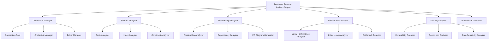

# 数据库逆向分析引擎设计

## 1. 概述

数据库逆向分析引擎是 Kilocode 项目的核心组件之一，负责对各种类型的数据库进行深度分析，提取结构信息、关系数据、性能指标和安全状况，为开发者提供全面的数据库洞察。

### 1.1 设计目标

- **多数据库支持**：支持主流关系型和非关系型数据库
- **深度分析**：提供结构、性能、安全等多维度分析
- **智能建议**：基于最佳实践提供优化建议
- **可视化展示**：直观的图表和报告展示
- **安全保障**：确保数据库连接和数据的安全性

### 1.2 支持的数据库类型

```typescript
enum DatabaseType {
	MYSQL = "mysql",
	POSTGRESQL = "postgresql",
	SQLITE = "sqlite",
	MONGODB = "mongodb",
	REDIS = "redis",
	ORACLE = "oracle",
	SQLSERVER = "sqlserver",
	MARIADB = "mariadb",
}
```

## 2. 架构设计

### 2.1 整体架构



### 2.2 核心组件

#### 2.2.1 连接管理器 (Connection Manager)

```typescript
interface IConnectionManager {
	// 连接管理
	createConnection(config: DatabaseConfig): Promise<DatabaseConnection>
	testConnection(config: DatabaseConfig): Promise<ConnectionTestResult>
	closeConnection(connectionId: string): Promise<void>

	// 连接池管理
	getConnectionPool(databaseId: string): ConnectionPool
	createConnectionPool(config: PoolConfig): Promise<ConnectionPool>

	// 凭据管理
	storeCredentials(credentials: DatabaseCredentials): Promise<string>
	getCredentials(credentialId: string): Promise<DatabaseCredentials>
	updateCredentials(credentialId: string, credentials: DatabaseCredentials): Promise<void>
}
```

#### 2.2.2 模式分析器 (Schema Analyzer)

```typescript
interface ISchemaAnalyzer {
	// 数据库结构分析
	analyzeDatabaseSchema(connection: DatabaseConnection): Promise<DatabaseSchema>
	analyzeTable(connection: DatabaseConnection, tableName: string): Promise<TableSchema>
	analyzeIndexes(connection: DatabaseConnection, tableName?: string): Promise<IndexAnalysis[]>
	analyzeConstraints(connection: DatabaseConnection): Promise<ConstraintAnalysis[]>

	// 视图和存储过程分析
	analyzeViews(connection: DatabaseConnection): Promise<ViewAnalysis[]>
	analyzeStoredProcedures(connection: DatabaseConnection): Promise<ProcedureAnalysis[]>
	analyzeTriggers(connection: DatabaseConnection): Promise<TriggerAnalysis[]>
}
```

#### 2.2.3 关系分析器 (Relationship Analyzer)

```typescript
interface IRelationshipAnalyzer {
	// 关系分析
	analyzeForeignKeys(schema: DatabaseSchema): Promise<ForeignKeyRelationship[]>
	analyzeDataDependencies(schema: DatabaseSchema): Promise<DataDependency[]>
	generateERDiagram(schema: DatabaseSchema): Promise<ERDiagram>

	// 数据流分析
	analyzeDataFlow(schema: DatabaseSchema): Promise<DataFlowAnalysis>
	detectCircularDependencies(schema: DatabaseSchema): Promise<CircularDependency[]>
}
```

#### 2.2.4 性能分析器 (Performance Analyzer)

```typescript
interface IPerformanceAnalyzer {
	// 性能分析
	analyzeQueryPerformance(connection: DatabaseConnection): Promise<QueryPerformanceAnalysis>
	analyzeIndexUsage(connection: DatabaseConnection): Promise<IndexUsageAnalysis>
	detectBottlenecks(connection: DatabaseConnection): Promise<PerformanceBottleneck[]>

	// 优化建议
	generateOptimizationSuggestions(analysis: PerformanceAnalysis): Promise<OptimizationSuggestion[]>
	analyzeTableSize(connection: DatabaseConnection): Promise<TableSizeAnalysis[]>
}
```

#### 2.2.5 安全分析器 (Security Analyzer)

```typescript
interface ISecurityAnalyzer {
	// 安全扫描
	scanVulnerabilities(connection: DatabaseConnection): Promise<SecurityVulnerability[]>
	analyzePermissions(connection: DatabaseConnection): Promise<PermissionAnalysis>
	analyzeDataSensitivity(schema: DatabaseSchema): Promise<DataSensitivityAnalysis>

	// 合规性检查
	checkCompliance(schema: DatabaseSchema, standards: ComplianceStandard[]): Promise<ComplianceReport>
	detectSensitiveData(connection: DatabaseConnection): Promise<SensitiveDataReport>
}
```

## 3. 数据结构定义

### 3.1 数据库配置

```typescript
interface DatabaseConfig {
	id: string
	name: string
	type: DatabaseType
	host: string
	port: number
	database: string
	credentialId: string
	ssl?: SSLConfig
	options?: Record<string, any>
}

interface DatabaseCredentials {
	id: string
	username: string
	password: string // 加密存储
	authMethod?: AuthMethod
	certificatePath?: string
}

interface SSLConfig {
	enabled: boolean
	rejectUnauthorized?: boolean
	ca?: string
	cert?: string
	key?: string
}
```

### 3.2 数据库模式

```typescript
interface DatabaseSchema {
	databaseName: string
	version: string
	charset: string
	collation: string
	tables: TableSchema[]
	views: ViewSchema[]
	procedures: ProcedureSchema[]
	functions: FunctionSchema[]
	triggers: TriggerSchema[]
	indexes: IndexSchema[]
	constraints: ConstraintSchema[]
}

interface TableSchema {
	name: string
	schema: string
	columns: ColumnSchema[]
	primaryKey: PrimaryKeySchema
	foreignKeys: ForeignKeySchema[]
	indexes: IndexSchema[]
	constraints: ConstraintSchema[]
	rowCount: number
	dataSize: number
	indexSize: number
	engine?: string
	charset?: string
	collation?: string
	comment?: string
}

interface ColumnSchema {
	name: string
	dataType: string
	length?: number
	precision?: number
	scale?: number
	nullable: boolean
	defaultValue?: any
	autoIncrement: boolean
	comment?: string
	position: number
}
```

### 3.3 分析结果

```typescript
interface DatabaseAnalysisResult {
	id: string
	databaseId: string
	timestamp: Date
	schema: DatabaseSchema
	relationships: RelationshipAnalysis
	performance: PerformanceAnalysis
	security: SecurityAnalysis
	recommendations: Recommendation[]
	metadata: AnalysisMetadata
}

interface RelationshipAnalysis {
	foreignKeys: ForeignKeyRelationship[]
	dependencies: DataDependency[]
	erDiagram: ERDiagram
	dataFlow: DataFlowAnalysis
	circularDependencies: CircularDependency[]
}

interface PerformanceAnalysis {
	queryPerformance: QueryPerformanceMetrics
	indexUsage: IndexUsageMetrics
	bottlenecks: PerformanceBottleneck[]
	tableSize: TableSizeMetrics[]
	recommendations: PerformanceRecommendation[]
}

interface SecurityAnalysis {
	vulnerabilities: SecurityVulnerability[]
	permissions: PermissionAnalysis
	sensitiveData: SensitiveDataReport
	compliance: ComplianceReport
	recommendations: SecurityRecommendation[]
}
```

## 4. 核心算法

### 4.1 关系发现算法

```typescript
class RelationshipDiscoveryAlgorithm {
	/**
	 * 发现表间关系
	 */
	async discoverRelationships(schema: DatabaseSchema): Promise<TableRelationship[]> {
		const relationships: TableRelationship[] = []

		// 1. 基于外键的显式关系
		const explicitRelations = this.discoverExplicitRelationships(schema)
		relationships.push(...explicitRelations)

		// 2. 基于命名约定的隐式关系
		const implicitRelations = this.discoverImplicitRelationships(schema)
		relationships.push(...implicitRelations)

		// 3. 基于数据分析的潜在关系
		const potentialRelations = await this.discoverPotentialRelationships(schema)
		relationships.push(...potentialRelations)

		return this.deduplicateRelationships(relationships)
	}

	private discoverExplicitRelationships(schema: DatabaseSchema): TableRelationship[] {
		// 分析外键约束
		return schema.tables.flatMap((table) =>
			table.foreignKeys.map((fk) => ({
				type: "explicit",
				sourceTable: table.name,
				targetTable: fk.referencedTable,
				columns: fk.columns,
				confidence: 1.0,
			})),
		)
	}

	private discoverImplicitRelationships(schema: DatabaseSchema): TableRelationship[] {
		// 基于命名约定发现关系
		const relationships: TableRelationship[] = []

		for (const table of schema.tables) {
			for (const column of table.columns) {
				// 检查是否为外键命名模式 (如 user_id, customer_id)
				const match = column.name.match(/^(.+)_id$/)
				if (match) {
					const referencedTable = this.findTableByName(schema, match[1])
					if (referencedTable) {
						relationships.push({
							type: "implicit",
							sourceTable: table.name,
							targetTable: referencedTable.name,
							columns: [{ source: column.name, target: "id" }],
							confidence: 0.8,
						})
					}
				}
			}
		}

		return relationships
	}
}
```

### 4.2 性能瓶颈检测算法

```typescript
class PerformanceBottleneckDetector {
	/**
	 * 检测性能瓶颈
	 */
	async detectBottlenecks(connection: DatabaseConnection): Promise<PerformanceBottleneck[]> {
		const bottlenecks: PerformanceBottleneck[] = []

		// 1. 慢查询检测
		const slowQueries = await this.detectSlowQueries(connection)
		bottlenecks.push(...slowQueries)

		// 2. 缺失索引检测
		const missingIndexes = await this.detectMissingIndexes(connection)
		bottlenecks.push(...missingIndexes)

		// 3. 表锁检测
		const lockContention = await this.detectLockContention(connection)
		bottlenecks.push(...lockContention)

		// 4. 资源使用检测
		const resourceIssues = await this.detectResourceIssues(connection)
		bottlenecks.push(...resourceIssues)

		return this.prioritizeBottlenecks(bottlenecks)
	}

	private async detectSlowQueries(connection: DatabaseConnection): Promise<PerformanceBottleneck[]> {
		const slowQueries = await connection.query(`
      SELECT query_time, lock_time, rows_sent, rows_examined, sql_text
      FROM mysql.slow_log 
      WHERE query_time > 1
      ORDER BY query_time DESC
      LIMIT 100
    `)

		return slowQueries.map((query) => ({
			type: "slow_query",
			severity: this.calculateSeverity(query.query_time),
			description: `Slow query detected: ${query.query_time}s`,
			query: query.sql_text,
			metrics: {
				queryTime: query.query_time,
				lockTime: query.lock_time,
				rowsExamined: query.rows_examined,
			},
			recommendations: this.generateQueryOptimizationRecommendations(query),
		}))
	}
}
```

## 5. 安全机制

### 5.1 连接安全

```typescript
class DatabaseSecurityManager {
	/**
	 * 安全连接管理
	 */
	async createSecureConnection(config: DatabaseConfig): Promise<DatabaseConnection> {
		// 1. 验证连接配置
		this.validateConnectionConfig(config)

		// 2. 获取加密的凭据
		const credentials = await this.getEncryptedCredentials(config.credentialId)

		// 3. 建立安全连接
		const connection = await this.establishSecureConnection(config, credentials)

		// 4. 记录连接审计日志
		await this.logConnectionAttempt(config, true)

		return connection
	}

	/**
	 * 凭据加密存储
	 */
	async storeCredentials(credentials: DatabaseCredentials): Promise<string> {
		const encryptedCredentials = {
			...credentials,
			password: await this.encryptPassword(credentials.password),
		}

		return await this.credentialStore.store(encryptedCredentials)
	}

	private async encryptPassword(password: string): Promise<string> {
		const key = await this.getEncryptionKey()
		return crypto.encrypt(password, key)
	}
}
```

### 5.2 数据脱敏

```typescript
class DataMaskingService {
	/**
	 * 敏感数据脱敏
	 */
	async maskSensitiveData(data: any[], schema: TableSchema): Promise<any[]> {
		const sensitiveColumns = this.identifySensitiveColumns(schema)

		return data.map((row) => {
			const maskedRow = { ...row }

			for (const column of sensitiveColumns) {
				if (maskedRow[column.name]) {
					maskedRow[column.name] = this.maskValue(maskedRow[column.name], column.type)
				}
			}

			return maskedRow
		})
	}

	private maskValue(value: any, type: SensitiveDataType): string {
		switch (type) {
			case "email":
				return this.maskEmail(value)
			case "phone":
				return this.maskPhone(value)
			case "credit_card":
				return this.maskCreditCard(value)
			case "ssn":
				return this.maskSSN(value)
			default:
				return "***"
		}
	}
}
```

## 6. 扩展机制

### 6.1 数据库驱动插件

```typescript
interface IDatabaseDriver {
	type: DatabaseType
	connect(config: DatabaseConfig): Promise<DatabaseConnection>
	disconnect(connection: DatabaseConnection): Promise<void>
	executeQuery(connection: DatabaseConnection, query: string): Promise<QueryResult>
	getSchema(connection: DatabaseConnection): Promise<DatabaseSchema>
}

class DatabaseDriverRegistry {
	private drivers = new Map<DatabaseType, IDatabaseDriver>()

	registerDriver(driver: IDatabaseDriver): void {
		this.drivers.set(driver.type, driver)
	}

	getDriver(type: DatabaseType): IDatabaseDriver {
		const driver = this.drivers.get(type)
		if (!driver) {
			throw new Error(`Driver not found for database type: ${type}`)
		}
		return driver
	}
}
```

### 6.2 分析器插件

```typescript
interface IAnalysisPlugin {
	name: string
	version: string
	supportedDatabases: DatabaseType[]
	analyze(connection: DatabaseConnection, schema: DatabaseSchema): Promise<AnalysisResult>
}

class AnalysisPluginManager {
	private plugins = new Map<string, IAnalysisPlugin>()

	registerPlugin(plugin: IAnalysisPlugin): void {
		this.plugins.set(plugin.name, plugin)
	}

	async runAnalysis(
		connection: DatabaseConnection,
		schema: DatabaseSchema,
		pluginNames?: string[],
	): Promise<AnalysisResult[]> {
		const targetPlugins = pluginNames
			? pluginNames.map((name) => this.plugins.get(name)).filter(Boolean)
			: Array.from(this.plugins.values())

		const results = await Promise.all(targetPlugins.map((plugin) => plugin!.analyze(connection, schema)))

		return results
	}
}
```

## 7. 性能优化

### 7.1 缓存策略

```typescript
class DatabaseAnalysisCache {
	private schemaCache = new Map<string, CachedSchema>()
	private analysisCache = new Map<string, CachedAnalysis>()

	async getSchema(databaseId: string): Promise<DatabaseSchema | null> {
		const cached = this.schemaCache.get(databaseId)

		if (cached && !this.isExpired(cached.timestamp)) {
			return cached.schema
		}

		return null
	}

	async cacheSchema(databaseId: string, schema: DatabaseSchema): Promise<void> {
		this.schemaCache.set(databaseId, {
			schema,
			timestamp: new Date(),
			ttl: 3600000, // 1 hour
		})
	}

	private isExpired(timestamp: Date): boolean {
		return Date.now() - timestamp.getTime() > 3600000
	}
}
```

### 7.2 增量分析

```typescript
class IncrementalAnalyzer {
	/**
	 * 增量分析
	 */
	async performIncrementalAnalysis(
		databaseId: string,
		lastAnalysis: DatabaseAnalysisResult,
	): Promise<DatabaseAnalysisResult> {
		// 1. 检测变更
		const changes = await this.detectSchemaChanges(databaseId, lastAnalysis.schema)

		if (changes.length === 0) {
			return lastAnalysis // 无变更，返回缓存结果
		}

		// 2. 仅分析变更部分
		const incrementalResult = await this.analyzeChanges(databaseId, changes)

		// 3. 合并结果
		return this.mergeAnalysisResults(lastAnalysis, incrementalResult)
	}

	private async detectSchemaChanges(databaseId: string, lastSchema: DatabaseSchema): Promise<SchemaChange[]> {
		const currentSchema = await this.getCurrentSchema(databaseId)
		return this.compareSchemas(lastSchema, currentSchema)
	}
}
```

## 8. 错误处理和监控

### 8.1 错误处理

```typescript
class DatabaseAnalysisErrorHandler {
	async handleAnalysisError(error: Error, context: AnalysisContext): Promise<void> {
		// 1. 记录错误日志
		await this.logError(error, context)

		// 2. 发送告警
		if (this.isCriticalError(error)) {
			await this.sendAlert(error, context)
		}

		// 3. 尝试恢复
		if (this.isRecoverableError(error)) {
			await this.attemptRecovery(context)
		}
	}

	private isCriticalError(error: Error): boolean {
		return (
			error instanceof ConnectionError || error instanceof SecurityError || error instanceof DataCorruptionError
		)
	}
}
```

### 8.2 监控指标

```typescript
interface AnalysisMetrics {
	analysisCount: number
	averageAnalysisTime: number
	errorRate: number
	cacheHitRate: number
	activeConnections: number
	memoryUsage: number
}

class MetricsCollector {
	private metrics: AnalysisMetrics = {
		analysisCount: 0,
		averageAnalysisTime: 0,
		errorRate: 0,
		cacheHitRate: 0,
		activeConnections: 0,
		memoryUsage: 0,
	}

	recordAnalysis(duration: number): void {
		this.metrics.analysisCount++
		this.metrics.averageAnalysisTime = (this.metrics.averageAnalysisTime + duration) / 2
	}

	recordError(): void {
		this.metrics.errorRate = this.metrics.errorRate * 0.9 + 0.1 // 指数移动平均
	}
}
```

## 9. 总结

数据库逆向分析引擎为 Kilocode 项目提供了强大的数据库分析能力，通过多维度的分析和智能化的建议，帮助开发者更好地理解和优化数据库设计。该引擎具有以下特点：

- **全面性**：支持多种数据库类型和分析维度
- **安全性**：提供完整的安全保障机制
- **可扩展性**：支持插件化扩展
- **高性能**：采用缓存和增量分析优化性能
- **易用性**：提供直观的可视化界面和报告

通过与项目分析引擎的深度整合，为开发者提供了从代码到数据库的全栈分析能力。
