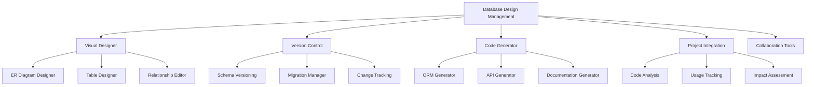

# 数据库设计管理模块

## 1. 概述

数据库设计管理模块是 Kilocode 项目管理系统的重要组成部分，提供可视化数据库设计、版本管理、代码生成和项目整合等功能，帮助开发者高效地进行数据库设计和管理。

### 1.1 设计目标

- **可视化设计**：提供直观的 ER 图设计器和表结构编辑器
- **版本管理**：完整的数据库 Schema 版本控制和迁移管理
- **代码生成**：自动生成 ORM 模型、API 接口和数据访问层代码
- **项目整合**：与项目代码深度整合，提供关联分析
- **协作支持**：支持团队协作和设计评审

### 1.2 核心功能模块



## 2. 架构设计

### 2.1 核心接口定义

#### 2.1.1 可视化设计器接口

```typescript
interface IVisualDesigner {
	// ER 图设计
	createERDiagram(name: string): Promise<ERDiagram>
	updateERDiagram(diagramId: string, diagram: ERDiagram): Promise<void>
	deleteERDiagram(diagramId: string): Promise<void>

	// 表设计
	createTable(diagramId: string, table: TableDesign): Promise<string>
	updateTable(tableId: string, table: TableDesign): Promise<void>
	deleteTable(tableId: string): Promise<void>

	// 关系设计
	createRelationship(relationship: RelationshipDesign): Promise<string>
	updateRelationship(relationshipId: string, relationship: RelationshipDesign): Promise<void>
	deleteRelationship(relationshipId: string): Promise<void>

	// 布局管理
	updateLayout(diagramId: string, layout: DiagramLayout): Promise<void>
	autoLayout(diagramId: string, algorithm: LayoutAlgorithm): Promise<DiagramLayout>
}
```

#### 2.1.2 版本控制接口

```typescript
interface IVersionControl {
	// 版本管理
	createVersion(projectId: string, schema: DatabaseSchema, message: string): Promise<string>
	getVersion(versionId: string): Promise<SchemaVersion>
	listVersions(projectId: string): Promise<SchemaVersion[]>

	// 比较和合并
	compareVersions(versionA: string, versionB: string): Promise<SchemaDiff>
	mergeVersions(baseVersion: string, targetVersion: string): Promise<MergeResult>

	// 迁移管理
	generateMigration(fromVersion: string, toVersion: string): Promise<Migration>
	executeMigration(migration: Migration, connection: DatabaseConnection): Promise<MigrationResult>
	rollbackMigration(migrationId: string, connection: DatabaseConnection): Promise<void>

	// 分支管理
	createBranch(projectId: string, branchName: string, baseVersion: string): Promise<string>
	mergeBranch(sourceBranch: string, targetBranch: string): Promise<MergeResult>
}
```

#### 2.1.3 代码生成器接口

```typescript
interface ICodeGenerator {
	// ORM 生成
	generateORMModels(schema: DatabaseSchema, config: ORMConfig): Promise<GeneratedCode[]>
	generateRepositories(schema: DatabaseSchema, config: RepositoryConfig): Promise<GeneratedCode[]>

	// API 生成
	generateAPIControllers(schema: DatabaseSchema, config: APIConfig): Promise<GeneratedCode[]>
	generateAPIRoutes(schema: DatabaseSchema, config: RouteConfig): Promise<GeneratedCode[]>
	generateAPIDocumentation(schema: DatabaseSchema): Promise<APIDocumentation>

	// 数据访问层生成
	generateDAL(schema: DatabaseSchema, config: DALConfig): Promise<GeneratedCode[]>
	generateQueries(schema: DatabaseSchema, operations: QueryOperation[]): Promise<GeneratedCode[]>

	// 文档生成
	generateDatabaseDocumentation(schema: DatabaseSchema): Promise<DatabaseDocumentation>
	generateERDiagramImage(diagram: ERDiagram, format: ImageFormat): Promise<Buffer>
}
```

#### 2.1.4 项目整合接口

```typescript
interface IProjectIntegration {
	// 代码分析
	analyzeCodeDatabaseUsage(projectPath: string): Promise<DatabaseUsageAnalysis>
	findDatabaseReferences(projectPath: string, tableName: string): Promise<CodeReference[]>

	// 影响评估
	assessSchemaChangeImpact(changes: SchemaChange[], projectPath: string): Promise<ImpactAssessment>
	validateSchemaCompatibility(schema: DatabaseSchema, projectPath: string): Promise<CompatibilityReport>

	// 同步管理
	syncSchemaWithCode(schema: DatabaseSchema, projectPath: string): Promise<SyncResult>
	updateCodeAfterSchemaChange(changes: SchemaChange[], projectPath: string): Promise<CodeUpdateResult>
}
```

## 3. 数据结构定义

### 3.1 设计数据结构

```typescript
interface ERDiagram {
	id: string
	name: string
	description?: string
	projectId: string
	tables: TableDesign[]
	relationships: RelationshipDesign[]
	layout: DiagramLayout
	metadata: DiagramMetadata
	createdAt: Date
	updatedAt: Date
	version: string
}

interface TableDesign {
	id: string
	name: string
	displayName?: string
	description?: string
	columns: ColumnDesign[]
	primaryKey: PrimaryKeyDesign
	indexes: IndexDesign[]
	constraints: ConstraintDesign[]
	position: Position
	color?: string
	metadata: TableMetadata
}

interface ColumnDesign {
	id: string
	name: string
	displayName?: string
	dataType: DataType
	length?: number
	precision?: number
	scale?: number
	nullable: boolean
	defaultValue?: any
	autoIncrement: boolean
	unique: boolean
	description?: string
	validationRules: ValidationRule[]
	metadata: ColumnMetadata
}

interface RelationshipDesign {
	id: string
	name?: string
	type: RelationshipType
	sourceTableId: string
	targetTableId: string
	sourceColumns: string[]
	targetColumns: string[]
	onUpdate: ReferentialAction
	onDelete: ReferentialAction
	cardinality: Cardinality
	description?: string
	metadata: RelationshipMetadata
}
```

### 3.2 版本控制数据结构

```typescript
interface SchemaVersion {
	id: string
	projectId: string
	branchId: string
	version: string
	schema: DatabaseSchema
	message: string
	author: string
	timestamp: Date
	parentVersionId?: string
	tags: string[]
	metadata: VersionMetadata
}

interface SchemaDiff {
	versionA: string
	versionB: string
	changes: SchemaChange[]
	summary: DiffSummary
	conflictResolution?: ConflictResolution[]
}

interface SchemaChange {
	type: ChangeType
	objectType: DatabaseObjectType
	objectName: string
	action: ChangeAction
	oldValue?: any
	newValue?: any
	impact: ChangeImpact
	dependencies: string[]
}

interface Migration {
	id: string
	name: string
	fromVersion: string
	toVersion: string
	upScript: string
	downScript: string
	changes: SchemaChange[]
	dependencies: string[]
	estimatedDuration: number
	riskLevel: RiskLevel
	metadata: MigrationMetadata
}
```

### 3.3 代码生成数据结构

```typescript
interface GeneratedCode {
	fileName: string
	filePath: string
	content: string
	language: ProgrammingLanguage
	framework?: string
	dependencies: string[]
	metadata: CodeMetadata
}

interface ORMConfig {
	framework: ORMFramework
	language: ProgrammingLanguage
	outputPath: string
	namingConvention: NamingConvention
	features: ORMFeature[]
	customTemplates?: Template[]
}

interface APIConfig {
	framework: APIFramework
	language: ProgrammingLanguage
	outputPath: string
	authenticationMethod: AuthMethod
	validationEnabled: boolean
	swaggerEnabled: boolean
	features: APIFeature[]
}
```

## 4. 核心功能实现

### 4.1 可视化设计器

#### 4.1.1 ER 图设计器

```typescript
class ERDiagramDesigner implements IVisualDesigner {
	private canvas: DiagramCanvas
	private toolbox: DesignToolbox
	private propertyPanel: PropertyPanel

	async createERDiagram(name: string): Promise<ERDiagram> {
		const diagram: ERDiagram = {
			id: generateId(),
			name,
			projectId: this.currentProjectId,
			tables: [],
			relationships: [],
			layout: this.createDefaultLayout(),
			metadata: this.createMetadata(),
			createdAt: new Date(),
			updatedAt: new Date(),
			version: "1.0.0",
		}

		await this.saveDiagram(diagram)
		return diagram
	}

	async createTable(diagramId: string, table: TableDesign): Promise<string> {
		// 1. 验证表设计
		this.validateTableDesign(table)

		// 2. 检查名称冲突
		await this.checkNameConflict(diagramId, table.name)

		// 3. 创建表
		const tableId = generateId()
		table.id = tableId

		// 4. 添加到图表
		await this.addTableToDiagram(diagramId, table)

		// 5. 触发事件
		this.eventEmitter.emit("tableCreated", { diagramId, table })

		return tableId
	}

	async createRelationship(relationship: RelationshipDesign): Promise<string> {
		// 1. 验证关系设计
		this.validateRelationshipDesign(relationship)

		// 2. 检查循环依赖
		await this.checkCircularDependency(relationship)

		// 3. 创建关系
		const relationshipId = generateId()
		relationship.id = relationshipId

		// 4. 更新相关表
		await this.updateRelatedTables(relationship)

		return relationshipId
	}

	private validateTableDesign(table: TableDesign): void {
		// 验证表名
		if (!table.name || !this.isValidTableName(table.name)) {
			throw new ValidationError("Invalid table name")
		}

		// 验证列
		if (!table.columns || table.columns.length === 0) {
			throw new ValidationError("Table must have at least one column")
		}

		// 验证主键
		if (!table.primaryKey || table.primaryKey.columns.length === 0) {
			throw new ValidationError("Table must have a primary key")
		}

		// 验证列定义
		for (const column of table.columns) {
			this.validateColumnDesign(column)
		}
	}
}
```

#### 4.1.2 表设计器

```typescript
class TableDesigner {
	private columnEditor: ColumnEditor
	private constraintEditor: ConstraintEditor
	private indexEditor: IndexEditor

	async designTable(tableId?: string): Promise<TableDesign> {
		const table = tableId ? await this.loadTable(tableId) : this.createNewTable()

		// 打开设计器界面
		const designerUI = new TableDesignerUI(table)

		// 绑定事件处理
		this.bindEventHandlers(designerUI)

		return new Promise((resolve, reject) => {
			designerUI.onSave = (updatedTable) => {
				this.validateAndSave(updatedTable).then(resolve).catch(reject)
			}

			designerUI.onCancel = () => {
				reject(new Error("Design cancelled"))
			}

			designerUI.show()
		})
	}

	private async validateAndSave(table: TableDesign): Promise<TableDesign> {
		// 1. 验证表设计
		await this.validateTableDesign(table)

		// 2. 生成 DDL
		const ddl = await this.generateDDL(table)

		// 3. 验证 DDL
		await this.validateDDL(ddl)

		// 4. 保存设计
		await this.saveTableDesign(table)

		return table
	}

	private async generateDDL(table: TableDesign): Promise<string> {
		const generator = new DDLGenerator()
		return generator.generateCreateTable(table)
	}
}
```

### 4.2 版本控制系统

#### 4.2.1 Schema 版本管理

```typescript
class SchemaVersionControl implements IVersionControl {
	private repository: SchemaRepository
	private diffEngine: SchemaDiffEngine
	private migrationGenerator: MigrationGenerator

	async createVersion(projectId: string, schema: DatabaseSchema, message: string): Promise<string> {
		// 1. 获取当前版本
		const currentVersion = await this.getCurrentVersion(projectId)

		// 2. 计算差异
		const diff = currentVersion ? await this.diffEngine.compare(currentVersion.schema, schema) : null

		// 3. 生成新版本号
		const newVersionNumber = this.generateVersionNumber(currentVersion?.version)

		// 4. 创建版本记录
		const version: SchemaVersion = {
			id: generateId(),
			projectId,
			branchId: await this.getCurrentBranchId(projectId),
			version: newVersionNumber,
			schema,
			message,
			author: await this.getCurrentUser(),
			timestamp: new Date(),
			parentVersionId: currentVersion?.id,
			tags: [],
			metadata: {
				changeCount: diff?.changes.length || 0,
				impactLevel: this.calculateImpactLevel(diff?.changes || []),
			},
		}

		// 5. 保存版本
		await this.repository.saveVersion(version)

		// 6. 生成迁移脚本
		if (diff && diff.changes.length > 0) {
			await this.generateMigrationScript(version, diff)
		}

		return version.id
	}

	async generateMigration(fromVersion: string, toVersion: string): Promise<Migration> {
		// 1. 获取版本信息
		const fromVersionData = await this.getVersion(fromVersion)
		const toVersionData = await this.getVersion(toVersion)

		// 2. 计算差异
		const diff = await this.diffEngine.compare(fromVersionData.schema, toVersionData.schema)

		// 3. 生成迁移脚本
		const upScript = await this.migrationGenerator.generateUpScript(diff.changes)
		const downScript = await this.migrationGenerator.generateDownScript(diff.changes)

		// 4. 创建迁移对象
		const migration: Migration = {
			id: generateId(),
			name: `Migration_${fromVersion}_to_${toVersion}`,
			fromVersion,
			toVersion,
			upScript,
			downScript,
			changes: diff.changes,
			dependencies: this.calculateDependencies(diff.changes),
			estimatedDuration: this.estimateMigrationDuration(diff.changes),
			riskLevel: this.assessMigrationRisk(diff.changes),
			metadata: {
				generatedAt: new Date(),
				generator: "auto",
			},
		}

		return migration
	}
}
```

#### 4.2.2 迁移管理器

```typescript
class MigrationManager {
	private executor: MigrationExecutor
	private validator: MigrationValidator
	private rollbackManager: RollbackManager

	async executeMigration(migration: Migration, connection: DatabaseConnection): Promise<MigrationResult> {
		// 1. 预检查
		await this.validator.validateMigration(migration, connection)

		// 2. 创建备份
		const backupId = await this.createBackup(connection)

		// 3. 开始事务
		const transaction = await connection.beginTransaction()

		try {
			// 4. 执行迁移
			const result = await this.executor.execute(migration, transaction)

			// 5. 验证结果
			await this.validator.validateResult(result, transaction)

			// 6. 提交事务
			await transaction.commit()

			// 7. 记录迁移历史
			await this.recordMigrationHistory(migration, result)

			return result
		} catch (error) {
			// 8. 回滚事务
			await transaction.rollback()

			// 9. 恢复备份
			await this.restoreBackup(backupId, connection)

			throw new MigrationError(`Migration failed: ${error.message}`, error)
		}
	}

	async rollbackMigration(migrationId: string, connection: DatabaseConnection): Promise<void> {
		// 1. 获取迁移信息
		const migration = await this.getMigration(migrationId)

		// 2. 验证回滚脚本
		await this.validator.validateRollbackScript(migration.downScript, connection)

		// 3. 执行回滚
		await this.rollbackManager.rollback(migration, connection)

		// 4. 更新迁移历史
		await this.updateMigrationHistory(migrationId, "rolled_back")
	}
}
```

### 4.3 代码生成器

#### 4.3.1 ORM 模型生成器

```typescript
class ORMModelGenerator implements ICodeGenerator {
	private templateEngine: TemplateEngine
	private namingConverter: NamingConverter

	async generateORMModels(schema: DatabaseSchema, config: ORMConfig): Promise<GeneratedCode[]> {
		const models: GeneratedCode[] = []

		for (const table of schema.tables) {
			const model = await this.generateTableModel(table, config)
			models.push(model)
		}

		// 生成关系配置
		const relationships = await this.generateRelationshipConfig(schema, config)
		models.push(relationships)

		// 生成索引文件
		const indexFile = await this.generateIndexFile(models, config)
		models.push(indexFile)

		return models
	}

	private async generateTableModel(table: TableSchema, config: ORMConfig): Promise<GeneratedCode> {
		// 1. 准备模板数据
		const templateData = {
			className: this.namingConverter.toClassName(table.name),
			tableName: table.name,
			columns: table.columns.map((col) => this.convertColumn(col, config)),
			primaryKey: this.convertPrimaryKey(table.primaryKey, config),
			relationships: this.convertRelationships(table.foreignKeys, config),
			indexes: this.convertIndexes(table.indexes, config),
		}

		// 2. 选择模板
		const template = await this.templateEngine.getTemplate(config.framework, "model")

		// 3. 生成代码
		const content = await this.templateEngine.render(template, templateData)

		// 4. 格式化代码
		const formattedContent = await this.formatCode(content, config.language)

		return {
			fileName: `${templateData.className}.${this.getFileExtension(config.language)}`,
			filePath: path.join(config.outputPath, "models"),
			content: formattedContent,
			language: config.language,
			framework: config.framework,
			dependencies: this.extractDependencies(content, config),
			metadata: {
				generatedAt: new Date(),
				generator: "orm-model-generator",
				sourceTable: table.name,
			},
		}
	}

	private convertColumn(column: ColumnSchema, config: ORMConfig): any {
		return {
			name: this.namingConverter.toPropertyName(column.name),
			type: this.mapDataType(column.dataType, config.language),
			nullable: column.nullable,
			defaultValue: this.convertDefaultValue(column.defaultValue, config.language),
			validations: this.generateValidations(column, config),
			decorators: this.generateDecorators(column, config),
		}
	}
}
```

#### 4.3.2 API 生成器

```typescript
class APIGenerator {
	private routeGenerator: RouteGenerator
	private controllerGenerator: ControllerGenerator
	private validationGenerator: ValidationGenerator

	async generateAPIControllers(schema: DatabaseSchema, config: APIConfig): Promise<GeneratedCode[]> {
		const controllers: GeneratedCode[] = []

		for (const table of schema.tables) {
			// 生成 CRUD 控制器
			const controller = await this.generateCRUDController(table, config)
			controllers.push(controller)

			// 生成验证器
			const validator = await this.validationGenerator.generate(table, config)
			controllers.push(validator)

			// 生成 DTO
			const dto = await this.generateDTO(table, config)
			controllers.push(dto)
		}

		return controllers
	}

	private async generateCRUDController(table: TableSchema, config: APIConfig): Promise<GeneratedCode> {
		const templateData = {
			controllerName: this.namingConverter.toControllerName(table.name),
			modelName: this.namingConverter.toClassName(table.name),
			routePath: this.namingConverter.toRoutePath(table.name),
			operations: this.generateOperations(table, config),
			validations: this.generateValidationRules(table, config),
			permissions: this.generatePermissions(table, config),
		}

		const template = await this.templateEngine.getTemplate(config.framework, "controller")

		const content = await this.templateEngine.render(template, templateData)

		return {
			fileName: `${templateData.controllerName}.${this.getFileExtension(config.language)}`,
			filePath: path.join(config.outputPath, "controllers"),
			content: await this.formatCode(content, config.language),
			language: config.language,
			framework: config.framework,
			dependencies: this.extractDependencies(content, config),
			metadata: {
				generatedAt: new Date(),
				generator: "api-controller-generator",
				sourceTable: table.name,
			},
		}
	}
}
```

### 4.4 项目整合分析器

#### 4.4.1 代码数据库使用分析

```typescript
class DatabaseUsageAnalyzer implements IProjectIntegration {
	private codeParser: CodeParser
	private queryExtractor: QueryExtractor
	private dependencyAnalyzer: DependencyAnalyzer

	async analyzeCodeDatabaseUsage(projectPath: string): Promise<DatabaseUsageAnalysis> {
		// 1. 扫描项目文件
		const files = await this.scanProjectFiles(projectPath)

		// 2. 解析代码文件
		const codeAnalysis = await this.analyzeCodeFiles(files)

		// 3. 提取数据库查询
		const queries = await this.extractDatabaseQueries(codeAnalysis)

		// 4. 分析表使用情况
		const tableUsage = await this.analyzeTableUsage(queries)

		// 5. 分析 ORM 使用情况
		const ormUsage = await this.analyzeORMUsage(codeAnalysis)

		// 6. 生成使用报告
		return {
			projectPath,
			analysisDate: new Date(),
			tableUsage,
			queryAnalysis: queries,
			ormUsage,
			dependencies: await this.analyzeDatabaseDependencies(codeAnalysis),
			recommendations: await this.generateUsageRecommendations(tableUsage, queries),
		}
	}

	async assessSchemaChangeImpact(changes: SchemaChange[], projectPath: string): Promise<ImpactAssessment> {
		// 1. 分析代码使用情况
		const usage = await this.analyzeCodeDatabaseUsage(projectPath)

		// 2. 评估每个变更的影响
		const impacts: ChangeImpact[] = []

		for (const change of changes) {
			const impact = await this.assessSingleChangeImpact(change, usage)
			impacts.push(impact)
		}

		// 3. 计算总体影响
		const overallImpact = this.calculateOverallImpact(impacts)

		// 4. 生成修复建议
		const fixSuggestions = await this.generateFixSuggestions(impacts)

		return {
			changes,
			impacts,
			overallImpact,
			affectedFiles: this.getAffectedFiles(impacts),
			fixSuggestions,
			estimatedEffort: this.estimateFixEffort(impacts),
		}
	}

	private async assessSingleChangeImpact(change: SchemaChange, usage: DatabaseUsageAnalysis): Promise<ChangeImpact> {
		switch (change.type) {
			case "table_dropped":
				return this.assessTableDropImpact(change, usage)
			case "column_dropped":
				return this.assessColumnDropImpact(change, usage)
			case "column_renamed":
				return this.assessColumnRenameImpact(change, usage)
			case "datatype_changed":
				return this.assessDatatypeChangeImpact(change, usage)
			default:
				return this.assessGenericImpact(change, usage)
		}
	}
}
```

## 5. 协作功能

### 5.1 设计评审系统

```typescript
class DesignReviewSystem {
	private reviewManager: ReviewManager
	private commentSystem: CommentSystem
	private approvalWorkflow: ApprovalWorkflow

	async createReview(designId: string, reviewers: string[]): Promise<string> {
		const review: DesignReview = {
			id: generateId(),
			designId,
			reviewers,
			status: "pending",
			createdAt: new Date(),
			comments: [],
			approvals: [],
		}

		// 发送评审通知
		await this.notifyReviewers(review)

		return await this.reviewManager.saveReview(review)
	}

	async addComment(reviewId: string, comment: ReviewComment): Promise<void> {
		await this.commentSystem.addComment(reviewId, comment)

		// 通知相关人员
		await this.notifyCommentAdded(reviewId, comment)
	}

	async approveDesign(reviewId: string, reviewerId: string, approval: ReviewApproval): Promise<void> {
		await this.approvalWorkflow.addApproval(reviewId, reviewerId, approval)

		// 检查是否所有评审者都已批准
		const review = await this.reviewManager.getReview(reviewId)
		if (await this.approvalWorkflow.isFullyApproved(review)) {
			await this.finalizeDesign(review.designId)
		}
	}
}
```

### 5.2 团队协作

```typescript
class TeamCollaboration {
	private lockManager: LockManager
	private conflictResolver: ConflictResolver
	private activityTracker: ActivityTracker

	async lockDesignElement(elementId: string, userId: string, lockType: LockType): Promise<Lock> {
		// 检查现有锁定
		const existingLock = await this.lockManager.getLock(elementId)
		if (existingLock && existingLock.userId !== userId) {
			throw new Error("Element is locked by another user")
		}

		// 创建锁定
		const lock: Lock = {
			id: generateId(),
			elementId,
			userId,
			lockType,
			acquiredAt: new Date(),
			expiresAt: new Date(Date.now() + 30 * 60 * 1000), // 30分钟
		}

		await this.lockManager.acquireLock(lock)
		return lock
	}

	async resolveConflict(conflictId: string, resolution: ConflictResolution): Promise<void> {
		const conflict = await this.conflictResolver.getConflict(conflictId)

		// 应用解决方案
		await this.conflictResolver.applyResolution(conflict, resolution)

		// 通知相关用户
		await this.notifyConflictResolved(conflict, resolution)
	}
}
```

## 6. 性能优化

### 6.1 设计缓存

```typescript
class DesignCache {
	private cache = new Map<string, CachedDesign>()
	private persistentCache: PersistentCache

	async getDesign(designId: string): Promise<ERDiagram | null> {
		// 检查内存缓存
		const cached = this.cache.get(designId)
		if (cached && !this.isExpired(cached)) {
			return cached.design
		}

		// 检查持久化缓存
		const persistent = await this.persistentCache.get(designId)
		if (persistent) {
			this.cache.set(designId, {
				design: persistent,
				timestamp: new Date(),
				ttl: 3600000, // 1小时
			})
			return persistent
		}

		return null
	}

	async cacheDesign(design: ERDiagram): Promise<void> {
		// 更新内存缓存
		this.cache.set(design.id, {
			design,
			timestamp: new Date(),
			ttl: 3600000,
		})

		// 更新持久化缓存
		await this.persistentCache.set(design.id, design)
	}
}
```

### 6.2 增量保存

```typescript
class IncrementalSaveManager {
	private changeTracker: ChangeTracker
	private saveQueue: SaveQueue

	async trackChange(change: DesignChange): Promise<void> {
		// 记录变更
		await this.changeTracker.recordChange(change)

		// 添加到保存队列
		await this.saveQueue.enqueue(change)

		// 触发自动保存
		this.scheduleAutoSave()
	}

	private scheduleAutoSave(): void {
		if (this.autoSaveTimer) {
			clearTimeout(this.autoSaveTimer)
		}

		this.autoSaveTimer = setTimeout(async () => {
			await this.performIncrementalSave()
		}, 5000) // 5秒后自动保存
	}

	private async performIncrementalSave(): Promise<void> {
		const changes = await this.saveQueue.dequeueAll()
		if (changes.length === 0) return

		// 合并变更
		const mergedChanges = this.mergeChanges(changes)

		// 批量保存
		await this.batchSave(mergedChanges)
	}
}
```

## 7. 总结

数据库设计管理模块为 Kilocode 项目提供了完整的数据库设计和管理能力，具有以下特点：

### 7.1 核心优势

- **可视化设计**：直观的 ER 图设计器和表结构编辑器
- **版本控制**：完整的 Schema 版本管理和迁移系统
- **代码生成**：自动生成 ORM、API 和文档
- **项目整合**：深度分析代码与数据库的关联关系
- **团队协作**：支持多人协作和设计评审

### 7.2 技术特色

- **智能分析**：自动检测影响和生成建议
- **安全可靠**：完整的备份和回滚机制
- **高性能**：缓存和增量保存优化
- **可扩展**：插件化架构支持自定义扩展

### 7.3 应用价值

通过数据库设计管理模块，开发团队可以：

- 提高数据库设计效率和质量
- 降低 Schema 变更的风险
- 自动化代码生成和文档维护
- 实现代码与数据库的一致性管理
- 支持敏捷开发和持续集成
