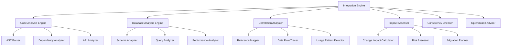

# 数据库与项目分析整合设计

## 1. 概述

数据库与项目分析整合模块是 Kilocode 逆向分析系统的核心组件，负责将数据库逆向分析与项目代码分析进行深度整合，提供全栈的分析能力和统一的洞察视图。

### 1.1 整合目标

- **全栈分析**：提供从前端到数据库的完整分析链路
- **关联发现**：自动发现代码与数据库之间的关联关系
- **影响评估**：评估数据库变更对项目代码的影响
- **一致性检查**：确保代码与数据库设计的一致性
- **优化建议**：基于全栈分析提供优化建议

### 1.2 整合架构



## 2. 核心接口定义

### 2.1 整合引擎接口

```typescript
interface IIntegrationEngine {
	// 全栈分析
	analyzeFullStack(projectPath: string, databaseConfigs: DatabaseConfig[]): Promise<FullStackAnalysis>

	// 关联分析
	analyzeCorrelations(codeAnalysis: CodeAnalysis, dbAnalysis: DatabaseAnalysis): Promise<CorrelationAnalysis>

	// 影响评估
	assessImpact(changes: Change[], context: AnalysisContext): Promise<ImpactAssessment>

	// 一致性检查
	checkConsistency(codeAnalysis: CodeAnalysis, dbAnalysis: DatabaseAnalysis): Promise<ConsistencyReport>

	// 优化建议
	generateOptimizations(fullStackAnalysis: FullStackAnalysis): Promise<OptimizationRecommendation[]>
}
```

### 2.2 关联分析器接口

```typescript
interface ICorrelationAnalyzer {
	// 代码-数据库关联
	findCodeDatabaseCorrelations(
		codeAnalysis: CodeAnalysis,
		dbAnalysis: DatabaseAnalysis,
	): Promise<CodeDatabaseCorrelation[]>

	// API-数据库映射
	mapAPIToDatabase(apiEndpoints: APIEndpoint[], dbSchema: DatabaseSchema): Promise<APIDatabaseMapping[]>

	// ORM-表映射
	mapORMToTables(ormModels: ORMModel[], dbTables: TableSchema[]): Promise<ORMTableMapping[]>

	// 查询-代码关联
	correlateQueriesWithCode(queries: DatabaseQuery[], codeFiles: CodeFile[]): Promise<QueryCodeCorrelation[]>
}
```

### 2.3 影响评估器接口

```typescript
interface IImpactAssessor {
	// 数据库变更影响
	assessDatabaseChangeImpact(changes: DatabaseChange[], codeAnalysis: CodeAnalysis): Promise<DatabaseChangeImpact>

	// 代码变更影响
	assessCodeChangeImpact(changes: CodeChange[], dbAnalysis: DatabaseAnalysis): Promise<CodeChangeImpact>

	// 架构变更影响
	assessArchitectureChangeImpact(
		changes: ArchitectureChange[],
		fullStackAnalysis: FullStackAnalysis,
	): Promise<ArchitectureChangeImpact>

	// 性能影响评估
	assessPerformanceImpact(changes: Change[], performanceBaseline: PerformanceBaseline): Promise<PerformanceImpact>
}
```

## 3. 数据结构定义

### 3.1 全栈分析结果

```typescript
interface FullStackAnalysis {
	id: string
	projectPath: string
	timestamp: Date

	// 代码分析结果
	codeAnalysis: CodeAnalysis

	// 数据库分析结果
	databaseAnalysis: DatabaseAnalysis

	// 关联分析结果
	correlationAnalysis: CorrelationAnalysis

	// 一致性检查结果
	consistencyReport: ConsistencyReport

	// 性能分析结果
	performanceAnalysis: PerformanceAnalysis

	// 安全分析结果
	securityAnalysis: SecurityAnalysis

	// 优化建议
	optimizations: OptimizationRecommendation[]

	// 元数据
	metadata: AnalysisMetadata
}

interface CodeAnalysis {
	projectStructure: ProjectStructure
	dependencies: DependencyGraph
	apiEndpoints: APIEndpoint[]
	ormModels: ORMModel[]
	databaseQueries: ExtractedQuery[]
	codeQuality: CodeQualityMetrics
	securityIssues: SecurityIssue[]
}

interface DatabaseAnalysis {
	schemas: DatabaseSchema[]
	relationships: RelationshipAnalysis
	performance: DatabasePerformanceAnalysis
	security: DatabaseSecurityAnalysis
	usage: DatabaseUsageAnalysis
	optimization: DatabaseOptimizationAnalysis
}
```

### 3.2 关联分析结果

```typescript
interface CorrelationAnalysis {
	// 代码-数据库关联
	codeDatabaseCorrelations: CodeDatabaseCorrelation[]

	// API-数据库映射
	apiDatabaseMappings: APIDatabaseMapping[]

	// ORM-表映射
	ormTableMappings: ORMTableMapping[]

	// 查询-代码关联
	queryCodeCorrelations: QueryCodeCorrelation[]

	// 数据流分析
	dataFlowAnalysis: DataFlowAnalysis

	// 使用模式分析
	usagePatterns: UsagePattern[]
}

interface CodeDatabaseCorrelation {
	id: string
	type: CorrelationType
	confidence: number

	// 代码侧信息
	codeElement: CodeElement
	codeLocation: CodeLocation

	// 数据库侧信息
	databaseElement: DatabaseElement

	// 关联详情
	correlationDetails: CorrelationDetails

	// 影响分析
	impactAnalysis: ImpactAnalysis
}

interface APIDatabaseMapping {
	apiEndpoint: APIEndpoint
	databaseOperations: DatabaseOperation[]
	dataFlow: DataFlowPath[]
	performanceMetrics: PerformanceMetrics
	securityConsiderations: SecurityConsideration[]
}
```

### 3.3 影响评估结果

```typescript
interface ImpactAssessment {
	assessmentId: string
	timestamp: Date
	changes: Change[]

	// 影响分析
	impacts: Impact[]

	// 风险评估
	riskAssessment: RiskAssessment

	// 修复建议
	fixRecommendations: FixRecommendation[]

	// 测试建议
	testRecommendations: TestRecommendation[]

	// 部署建议
	deploymentRecommendations: DeploymentRecommendation[]
}

interface Impact {
	id: string
	type: ImpactType
	severity: ImpactSeverity
	scope: ImpactScope

	// 受影响的组件
	affectedComponents: AffectedComponent[]

	// 影响描述
	description: string

	// 影响指标
	metrics: ImpactMetrics

	// 缓解措施
	mitigationStrategies: MitigationStrategy[]
}
```

## 4. 核心功能实现

### 4.1 全栈分析引擎

```typescript
class FullStackAnalysisEngine implements IIntegrationEngine {
	private codeAnalyzer: CodeAnalysisEngine
	private dbAnalyzer: DatabaseAnalysisEngine
	private correlationAnalyzer: CorrelationAnalyzer
	private consistencyChecker: ConsistencyChecker

	async analyzeFullStack(projectPath: string, databaseConfigs: DatabaseConfig[]): Promise<FullStackAnalysis> {
		// 1. 并行执行代码和数据库分析
		const [codeAnalysis, databaseAnalysis] = await Promise.all([
			this.analyzeCode(projectPath),
			this.analyzeDatabases(databaseConfigs),
		])

		// 2. 执行关联分析
		const correlationAnalysis = await this.correlationAnalyzer.analyzeCorrelations(codeAnalysis, databaseAnalysis)

		// 3. 执行一致性检查
		const consistencyReport = await this.consistencyChecker.checkConsistency(codeAnalysis, databaseAnalysis)

		// 4. 执行性能分析
		const performanceAnalysis = await this.analyzePerformance(codeAnalysis, databaseAnalysis, correlationAnalysis)

		// 5. 执行安全分析
		const securityAnalysis = await this.analyzeSecurity(codeAnalysis, databaseAnalysis, correlationAnalysis)

		// 6. 生成优化建议
		const optimizations = await this.generateOptimizations({
			codeAnalysis,
			databaseAnalysis,
			correlationAnalysis,
			consistencyReport,
			performanceAnalysis,
			securityAnalysis,
		})

		return {
			id: generateId(),
			projectPath,
			timestamp: new Date(),
			codeAnalysis,
			databaseAnalysis,
			correlationAnalysis,
			consistencyReport,
			performanceAnalysis,
			securityAnalysis,
			optimizations,
			metadata: this.generateMetadata(),
		}
	}

	private async analyzeCode(projectPath: string): Promise<CodeAnalysis> {
		// 1. 分析项目结构
		const projectStructure = await this.codeAnalyzer.analyzeProjectStructure(projectPath)

		// 2. 分析依赖关系
		const dependencies = await this.codeAnalyzer.analyzeDependencies(projectPath)

		// 3. 提取 API 端点
		const apiEndpoints = await this.codeAnalyzer.extractAPIEndpoints(projectPath)

		// 4. 分析 ORM 模型
		const ormModels = await this.codeAnalyzer.analyzeORMModels(projectPath)

		// 5. 提取数据库查询
		const databaseQueries = await this.codeAnalyzer.extractDatabaseQueries(projectPath)

		// 6. 分析代码质量
		const codeQuality = await this.codeAnalyzer.analyzeCodeQuality(projectPath)

		// 7. 检查安全问题
		const securityIssues = await this.codeAnalyzer.checkSecurityIssues(projectPath)

		return {
			projectStructure,
			dependencies,
			apiEndpoints,
			ormModels,
			databaseQueries,
			codeQuality,
			securityIssues,
		}
	}
}
```

### 4.2 关联分析器

```typescript
class CorrelationAnalyzer implements ICorrelationAnalyzer {
	private referenceMapper: ReferenceMapper
	private dataFlowTracer: DataFlowTracer
	private patternDetector: PatternDetector

	async findCodeDatabaseCorrelations(
		codeAnalysis: CodeAnalysis,
		dbAnalysis: DatabaseAnalysis,
	): Promise<CodeDatabaseCorrelation[]> {
		const correlations: CodeDatabaseCorrelation[] = []

		// 1. 基于 ORM 模型的关联
		const ormCorrelations = await this.findORMCorrelations(codeAnalysis.ormModels, dbAnalysis.schemas)
		correlations.push(...ormCorrelations)

		// 2. 基于查询的关联
		const queryCorrelations = await this.findQueryCorrelations(codeAnalysis.databaseQueries, dbAnalysis.schemas)
		correlations.push(...queryCorrelations)

		// 3. 基于 API 的关联
		const apiCorrelations = await this.findAPICorrelations(codeAnalysis.apiEndpoints, dbAnalysis.schemas)
		correlations.push(...apiCorrelations)

		// 4. 基于配置的关联
		const configCorrelations = await this.findConfigCorrelations(codeAnalysis.projectStructure, dbAnalysis.schemas)
		correlations.push(...configCorrelations)

		return this.deduplicateCorrelations(correlations)
	}

	private async findORMCorrelations(
		ormModels: ORMModel[],
		schemas: DatabaseSchema[],
	): Promise<CodeDatabaseCorrelation[]> {
		const correlations: CodeDatabaseCorrelation[] = []

		for (const model of ormModels) {
			// 查找对应的数据库表
			const matchingTable = this.findMatchingTable(model, schemas)

			if (matchingTable) {
				const correlation: CodeDatabaseCorrelation = {
					id: generateId(),
					type: "orm_table_mapping",
					confidence: this.calculateConfidence(model, matchingTable),
					codeElement: {
						type: "orm_model",
						name: model.name,
						filePath: model.filePath,
						properties: model.properties,
					},
					codeLocation: {
						filePath: model.filePath,
						startLine: model.startLine,
						endLine: model.endLine,
					},
					databaseElement: {
						type: "table",
						name: matchingTable.name,
						schema: matchingTable.schema,
						columns: matchingTable.columns,
					},
					correlationDetails: {
						mappingType: "direct",
						mappingRules: this.extractMappingRules(model, matchingTable),
						confidence: this.calculateMappingConfidence(model, matchingTable),
					},
					impactAnalysis: await this.analyzeCorrelationImpact(model, matchingTable),
				}

				correlations.push(correlation)
			}
		}

		return correlations
	}

	private async findQueryCorrelations(
		queries: ExtractedQuery[],
		schemas: DatabaseSchema[],
	): Promise<CodeDatabaseCorrelation[]> {
		const correlations: CodeDatabaseCorrelation[] = []

		for (const query of queries) {
			// 解析查询中涉及的表
			const involvedTables = this.parseQueryTables(query.sql)

			for (const tableName of involvedTables) {
				const matchingTable = this.findTableByName(schemas, tableName)

				if (matchingTable) {
					const correlation: CodeDatabaseCorrelation = {
						id: generateId(),
						type: "query_table_reference",
						confidence: 0.9, // 查询中的表引用通常是确定的
						codeElement: {
							type: "database_query",
							name: query.name || "anonymous_query",
							filePath: query.filePath,
							sql: query.sql,
						},
						codeLocation: {
							filePath: query.filePath,
							startLine: query.startLine,
							endLine: query.endLine,
						},
						databaseElement: {
							type: "table",
							name: matchingTable.name,
							schema: matchingTable.schema,
							columns: matchingTable.columns,
						},
						correlationDetails: {
							mappingType: "query_reference",
							queryType: query.type,
							operations: this.extractQueryOperations(query.sql, matchingTable),
						},
						impactAnalysis: await this.analyzeQueryImpact(query, matchingTable),
					}

					correlations.push(correlation)
				}
			}
		}

		return correlations
	}
}
```

### 4.3 影响评估器

```typescript
class ImpactAssessor implements IImpactAssessor {
	private changeAnalyzer: ChangeAnalyzer
	private riskCalculator: RiskCalculator
	private dependencyTracker: DependencyTracker

	async assessDatabaseChangeImpact(
		changes: DatabaseChange[],
		codeAnalysis: CodeAnalysis,
	): Promise<DatabaseChangeImpact> {
		const impacts: Impact[] = []

		for (const change of changes) {
			const impact = await this.assessSingleDatabaseChange(change, codeAnalysis)
			impacts.push(impact)
		}

		// 计算级联影响
		const cascadingImpacts = await this.calculateCascadingImpacts(impacts, codeAnalysis)
		impacts.push(...cascadingImpacts)

		// 评估总体风险
		const riskAssessment = await this.riskCalculator.assessRisk(impacts)

		// 生成修复建议
		const fixRecommendations = await this.generateFixRecommendations(impacts)

		return {
			assessmentId: generateId(),
			timestamp: new Date(),
			changes,
			impacts,
			riskAssessment,
			fixRecommendations,
			testRecommendations: await this.generateTestRecommendations(impacts),
			deploymentRecommendations: await this.generateDeploymentRecommendations(impacts),
		}
	}

	private async assessSingleDatabaseChange(change: DatabaseChange, codeAnalysis: CodeAnalysis): Promise<Impact> {
		switch (change.type) {
			case "table_dropped":
				return this.assessTableDropImpact(change, codeAnalysis)
			case "column_dropped":
				return this.assessColumnDropImpact(change, codeAnalysis)
			case "column_renamed":
				return this.assessColumnRenameImpact(change, codeAnalysis)
			case "datatype_changed":
				return this.assessDatatypeChangeImpact(change, codeAnalysis)
			case "constraint_added":
				return this.assessConstraintAddImpact(change, codeAnalysis)
			default:
				return this.assessGenericImpact(change, codeAnalysis)
		}
	}

	private async assessTableDropImpact(change: DatabaseChange, codeAnalysis: CodeAnalysis): Promise<Impact> {
		const tableName = change.objectName

		// 查找引用该表的代码
		const affectedComponents: AffectedComponent[] = []

		// 检查 ORM 模型
		const affectedModels = codeAnalysis.ormModels.filter((model) => model.tableName === tableName)
		affectedComponents.push(
			...affectedModels.map((model) => ({
				type: "orm_model",
				name: model.name,
				filePath: model.filePath,
				impactLevel: "critical",
			})),
		)

		// 检查查询
		const affectedQueries = codeAnalysis.databaseQueries.filter((query) =>
			this.queryReferencesTable(query.sql, tableName),
		)
		affectedComponents.push(
			...affectedQueries.map((query) => ({
				type: "database_query",
				name: query.name || "anonymous_query",
				filePath: query.filePath,
				impactLevel: "critical",
			})),
		)

		// 检查 API 端点
		const affectedAPIs = await this.findAPIsUsingTable(codeAnalysis.apiEndpoints, tableName)
		affectedComponents.push(
			...affectedAPIs.map((api) => ({
				type: "api_endpoint",
				name: api.path,
				filePath: api.filePath,
				impactLevel: "high",
			})),
		)

		return {
			id: generateId(),
			type: "breaking_change",
			severity: "critical",
			scope: "application",
			affectedComponents,
			description: `Table '${tableName}' will be dropped, affecting ${affectedComponents.length} components`,
			metrics: {
				affectedFiles: new Set(affectedComponents.map((c) => c.filePath)).size,
				affectedComponents: affectedComponents.length,
				estimatedFixTime: this.estimateFixTime(affectedComponents),
			},
			mitigationStrategies: [
				{
					type: "code_update",
					description: "Update or remove code references to the dropped table",
					effort: "high",
					risk: "medium",
				},
				{
					type: "data_migration",
					description: "Migrate data to alternative tables if needed",
					effort: "high",
					risk: "high",
				},
			],
		}
	}
}
```

### 4.4 一致性检查器

```typescript
class ConsistencyChecker {
	private schemaValidator: SchemaValidator
	private codeValidator: CodeValidator
	private mappingValidator: MappingValidator

	async checkConsistency(codeAnalysis: CodeAnalysis, dbAnalysis: DatabaseAnalysis): Promise<ConsistencyReport> {
		const issues: ConsistencyIssue[] = []

		// 1. 检查 ORM 模型与数据库表的一致性
		const ormIssues = await this.checkORMConsistency(codeAnalysis.ormModels, dbAnalysis.schemas)
		issues.push(...ormIssues)

		// 2. 检查查询与数据库结构的一致性
		const queryIssues = await this.checkQueryConsistency(codeAnalysis.databaseQueries, dbAnalysis.schemas)
		issues.push(...queryIssues)

		// 3. 检查 API 与数据库的一致性
		const apiIssues = await this.checkAPIConsistency(codeAnalysis.apiEndpoints, dbAnalysis.schemas)
		issues.push(...apiIssues)

		// 4. 检查数据类型一致性
		const datatypeIssues = await this.checkDatatypeConsistency(codeAnalysis, dbAnalysis)
		issues.push(...datatypeIssues)

		// 5. 检查约束一致性
		const constraintIssues = await this.checkConstraintConsistency(codeAnalysis, dbAnalysis)
		issues.push(...constraintIssues)

		return {
			reportId: generateId(),
			timestamp: new Date(),
			overallScore: this.calculateConsistencyScore(issues),
			issues,
			summary: this.generateSummary(issues),
			recommendations: await this.generateRecommendations(issues),
		}
	}

	private async checkORMConsistency(ormModels: ORMModel[], schemas: DatabaseSchema[]): Promise<ConsistencyIssue[]> {
		const issues: ConsistencyIssue[] = []

		for (const model of ormModels) {
			const matchingTable = this.findMatchingTable(model, schemas)

			if (!matchingTable) {
				issues.push({
					id: generateId(),
					type: "missing_table",
					severity: "error",
					description: `ORM model '${model.name}' references table '${model.tableName}' which does not exist`,
					codeLocation: {
						filePath: model.filePath,
						startLine: model.startLine,
						endLine: model.endLine,
					},
					databaseElement: {
						type: "table",
						name: model.tableName,
					},
					fixSuggestions: [
						"Create the missing table in the database",
						"Update the ORM model to reference an existing table",
						"Remove the unused ORM model",
					],
				})
				continue
			}

			// 检查列一致性
			const columnIssues = this.checkColumnConsistency(model, matchingTable)
			issues.push(...columnIssues)

			// 检查关系一致性
			const relationshipIssues = this.checkRelationshipConsistency(model, matchingTable)
			issues.push(...relationshipIssues)
		}

		return issues
	}
}
```

## 5. 可视化整合

### 5.1 全栈视图生成器

```typescript
class FullStackViewGenerator {
	private diagramGenerator: DiagramGenerator
	private reportGenerator: ReportGenerator
	private dashboardBuilder: DashboardBuilder

	async generateFullStackDiagram(analysis: FullStackAnalysis): Promise<FullStackDiagram> {
		// 1. 生成架构图
		const architectureDiagram = await this.generateArchitectureDiagram(analysis)

		// 2. 生成数据流图
		const dataFlowDiagram = await this.generateDataFlowDiagram(analysis)

		// 3. 生成依赖关系图
		const dependencyDiagram = await this.generateDependencyDiagram(analysis)

		// 4. 生成影响分析图
		const impactDiagram = await this.generateImpactDiagram(analysis)

		return {
			id: generateId(),
			analysisId: analysis.id,
			architectureDiagram,
			dataFlowDiagram,
			dependencyDiagram,
			impactDiagram,
			metadata: {
				generatedAt: new Date(),
				version: "1.0",
			},
		}
	}

	async generateInteractiveDashboard(analysis: FullStackAnalysis): Promise<InteractiveDashboard> {
		return this.dashboardBuilder.build({
			title: "Full Stack Analysis Dashboard",
			sections: [
				await this.createOverviewSection(analysis),
				await this.createCodeAnalysisSection(analysis.codeAnalysis),
				await this.createDatabaseAnalysisSection(analysis.databaseAnalysis),
				await this.createCorrelationSection(analysis.correlationAnalysis),
				await this.createConsistencySection(analysis.consistencyReport),
				await this.createOptimizationSection(analysis.optimizations),
			],
			interactiveElements: [
				this.createFilterControls(),
				this.createDrillDownControls(),
				this.createExportControls(),
			],
		})
	}
}
```

### 5.2 实时监控

```typescript
class RealTimeMonitor {
	private changeDetector: ChangeDetector
	private alertManager: AlertManager
	private metricsCollector: MetricsCollector

	async startMonitoring(projectPath: string, databaseConfigs: DatabaseConfig[]): Promise<void> {
		// 1. 监控代码变更
		this.changeDetector.watchCodeChanges(projectPath, async (changes) => {
			await this.handleCodeChanges(changes)
		})

		// 2. 监控数据库变更
		for (const config of databaseConfigs) {
			this.changeDetector.watchDatabaseChanges(config, async (changes) => {
				await this.handleDatabaseChanges(changes)
			})
		}

		// 3. 定期执行一致性检查
		setInterval(async () => {
			await this.performConsistencyCheck(projectPath, databaseConfigs)
		}, 300000) // 5分钟
	}

	private async handleCodeChanges(changes: CodeChange[]): Promise<void> {
		// 分析变更影响
		const impact = await this.assessCodeChangeImpact(changes)

		// 发送告警
		if (impact.severity === "high" || impact.severity === "critical") {
			await this.alertManager.sendAlert({
				type: "code_change_impact",
				severity: impact.severity,
				message: `Code changes detected with ${impact.severity} impact`,
				details: impact,
			})
		}

		// 更新指标
		this.metricsCollector.recordCodeChanges(changes)
	}
}
```

## 6. 性能优化

### 6.1 增量分析

```typescript
class IncrementalAnalysisEngine {
	private changeTracker: ChangeTracker
	private cacheManager: CacheManager
	private deltaProcessor: DeltaProcessor

	async performIncrementalAnalysis(
		projectPath: string,
		databaseConfigs: DatabaseConfig[],
		lastAnalysis: FullStackAnalysis,
	): Promise<FullStackAnalysis> {
		// 1. 检测变更
		const codeChanges = await this.changeTracker.detectCodeChanges(projectPath, lastAnalysis.timestamp)

		const dbChanges = await this.changeTracker.detectDatabaseChanges(databaseConfigs, lastAnalysis.timestamp)

		// 2. 如果没有变更，返回缓存结果
		if (codeChanges.length === 0 && dbChanges.length === 0) {
			return lastAnalysis
		}

		// 3. 增量分析
		const incrementalResult = await this.analyzeChanges(codeChanges, dbChanges, lastAnalysis)

		// 4. 合并结果
		return this.mergeAnalysisResults(lastAnalysis, incrementalResult)
	}

	private async analyzeChanges(
		codeChanges: CodeChange[],
		dbChanges: DatabaseChange[],
		baseAnalysis: FullStackAnalysis,
	): Promise<Partial<FullStackAnalysis>> {
		const result: Partial<FullStackAnalysis> = {}

		// 只分析受影响的部分
		if (codeChanges.length > 0) {
			result.codeAnalysis = await this.analyzeCodeChanges(codeChanges, baseAnalysis)
		}

		if (dbChanges.length > 0) {
			result.databaseAnalysis = await this.analyzeDatabaseChanges(dbChanges, baseAnalysis)
		}

		// 重新分析关联关系（如果有变更）
		if (codeChanges.length > 0 || dbChanges.length > 0) {
			result.correlationAnalysis = await this.reanalyzeCorrelations(
				result.codeAnalysis || baseAnalysis.codeAnalysis,
				result.databaseAnalysis || baseAnalysis.databaseAnalysis,
			)
		}

		return result
	}
}
```

### 6.2 并行处理

```typescript
class ParallelAnalysisEngine {
	private workerPool: WorkerPool
	private taskScheduler: TaskScheduler

	async analyzeInParallel(projectPath: string, databaseConfigs: DatabaseConfig[]): Promise<FullStackAnalysis> {
		// 1. 创建分析任务
		const tasks = this.createAnalysisTasks(projectPath, databaseConfigs)

		// 2. 并行执行任务
		const results = await this.taskScheduler.executeParallel(tasks)

		// 3. 合并结果
		return this.mergeParallelResults(results)
	}

	private createAnalysisTasks(projectPath: string, databaseConfigs: DatabaseConfig[]): AnalysisTask[] {
		return [
			// 代码分析任务
			{
				id: "code_analysis",
				type: "code",
				executor: async () => this.analyzeCode(projectPath),
				dependencies: [],
			},

			// 数据库分析任务（并行）
			...databaseConfigs.map((config, index) => ({
				id: `db_analysis_${index}`,
				type: "database",
				executor: async () => this.analyzeDatabase(config),
				dependencies: [],
			})),

			// 关联分析任务（依赖于代码和数据库分析）
			{
				id: "correlation_analysis",
				type: "correlation",
				executor: async (deps) => this.analyzeCorrelations(deps.code_analysis, deps.db_analysis),
				dependencies: ["code_analysis", ...databaseConfigs.map((_, i) => `db_analysis_${i}`)],
			},
		]
	}
}
```

## 7. 扩展机制

### 7.1 分析插件系统

```typescript
interface IAnalysisPlugin {
	name: string
	version: string
	type: AnalysisPluginType

	// 插件能力
	capabilities: PluginCapability[]

	// 分析方法
	analyze(context: AnalysisContext): Promise<AnalysisResult>

	// 配置验证
	validateConfig(config: any): boolean

	// 插件初始化
	initialize(config: any): Promise<void>

	// 插件清理
	cleanup(): Promise<void>
}

class AnalysisPluginManager {
	private plugins = new Map<string, IAnalysisPlugin>()
	private pluginConfigs = new Map<string, any>()

	async registerPlugin(plugin: IAnalysisPlugin, config?: any): Promise<void> {
		// 验证插件
		this.validatePlugin(plugin)

		// 验证配置
		if (config && !plugin.validateConfig(config)) {
			throw new Error(`Invalid configuration for plugin: ${plugin.name}`)
		}

		// 初始化插件
		await plugin.initialize(config || {})

		// 注册插件
		this.plugins.set(plugin.name, plugin)
		if (config) {
			this.pluginConfigs.set(plugin.name, config)
		}
	}

	async executePlugins(type: AnalysisPluginType, context: AnalysisContext): Promise<AnalysisResult[]> {
		const applicablePlugins = Array.from(this.plugins.values()).filter((plugin) => plugin.type === type)

		const results = await Promise.all(applicablePlugins.map((plugin) => plugin.analyze(context)))

		return results
	}
}
```

### 7.2 自定义规则引擎

```typescript
class CustomRuleEngine {
	private rules = new Map<string, AnalysisRule>()

	addRule(rule: AnalysisRule): void {
		this.validateRule(rule)
		this.rules.set(rule.id, rule)
	}

	async executeRules(context: AnalysisContext): Promise<RuleExecutionResult[]> {
		const results: RuleExecutionResult[] = []

		for (const rule of this.rules.values()) {
			if (this.isRuleApplicable(rule, context)) {
				const result = await this.executeRule(rule, context)
				results.push(result)
			}
		}

		return results
	}

	private async executeRule(rule: AnalysisRule, context: AnalysisContext): Promise<RuleExecutionResult> {
		try {
			const violations = await rule.check(context)

			return {
				ruleId: rule.id,
				ruleName: rule.name,
				status: "success",
				violations,
				executionTime: Date.now() - startTime,
			}
		} catch (error) {
			return {
				ruleId: rule.id,
				ruleName: rule.name,
				status: "error",
				error: error.message,
				executionTime: Date.now() - startTime,
			}
		}
	}
}
```

## 8. 总结

数据库与项目分析整合模块为 Kilocode 提供了强大的全栈分析能力，具有以下特点：

### 8.1 核心价值

- **全栈洞察**：提供从前端到数据库的完整分析视图
- **智能关联**：自动发现代码与数据库之间的关联关系
- **影响评估**：准确评估变更对整个系统的影响
- **一致性保障**：确保代码与数据库设计的一致性
- **优化指导**：基于全栈分析提供优化建议

### 8.2 技术优势

- **高性能**：采用增量分析和并行处理优化性能
- **可扩展**：支持插件化扩展和自定义规则
- **实时监控**：提供实时变更监控和告警
- **可视化**：丰富的图表和交互式仪表板

### 8.3 应用场景

- **架构评估**：评估现有系统的架构合理性
- **重构支持**：为系统重构提供影响分析
- **质量保障**：确保代码与数据库的一致性
- **性能优化**：识别性能瓶颈和优化机会
- **风险控制**：评估变更风险并提供缓解策略

通过数据库与项目分析的深度整合，Kilocode 为开发团队提供了前所未有的全栈分析能力，帮助团队更好地理解、维护和优化复杂的软件系统。
