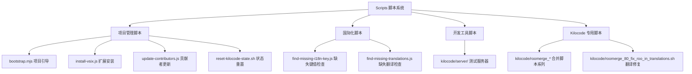

# Kilocode Scripts 技术文档

## 概述

Kilocode 项目的 scripts 目录包含了用于项目构建、开发、维护和部署的各种自动化脚本。这些脚本涵盖了从项目初始化、国际化管理、扩展安装到代码合并等多个方面的功能。

## 脚本系统架构



## 脚本分类

### 1. 项目管理脚本

- **bootstrap.mjs**: 项目引导脚本，自动检测并切换到 pnpm 包管理器
- **install-vsix.js**: VSCode 扩展 VSIX 文件安装脚本
- **update-contributors.js**: 自动更新 README 中的贡献者列表
- **reset-kilocode-state.sh**: 重置 Kilocode 扩展的本地状态

### 2. 国际化管理脚本

- **find-missing-i18n-key.js**: 检查代码中使用但在翻译文件中缺失的国际化键值
- **find-missing-translations.js**: 检查翻译文件中缺失的翻译条目

### 3. 开发工具脚本

- **kilocode/server/openai-test-server.ts**: OpenAI 兼容的测试服务器，用于测试 API 调用

### 4. Kilocode 专用脚本

- **kilocode/roomerge_01_init.sh**: Roo 代码合并初始化脚本
- **kilocode/roomerge_02_cleanup.sh**: 合并后的清理脚本
- **kilocode/roomerge_03_package_json.js**: package.json 合并冲突自动解决
- **kilocode/roomerge_80_fix_roo_in_translations.sh**: 翻译文件中品牌名称修复

## 使用指南

### 环境要求

- Node.js 18+
- pnpm (推荐) 或 npm
- Git (用于版本控制相关脚本)
- macOS/Linux (部分 shell 脚本)

### 常用命令

```bash
# 项目初始化和依赖安装
node scripts/bootstrap.mjs

# 检查国际化问题
node scripts/find-missing-i18n-key.js
node scripts/find-missing-translations.js

# 安装 VSIX 扩展
node scripts/install-vsix.js

# 更新贡献者列表
node scripts/update-contributors.js

# 启动测试服务器
npx tsx scripts/kilocode/server/openai-test-server.ts
```

### Roo 合并工作流

```bash
# 1. 初始化合并
./scripts/kilocode/roomerge_01_init.sh v3.15.5

# 2. 清理不需要的文件
./scripts/kilocode/roomerge_02_cleanup.sh

# 3. 解决 package.json 冲突
node scripts/kilocode/roomerge_03_package_json.js

# 4. 修复翻译文件中的品牌名称
./scripts/kilocode/roomerge_80_fix_roo_in_translations.sh
```

## 开发和维护

### 脚本开发规范

1. **命名规范**: 使用描述性的文件名，反映脚本的主要功能
2. **文档要求**: 每个脚本都应包含详细的注释和使用说明
3. **错误处理**: 实现适当的错误处理和用户友好的错误消息
4. **参数验证**: 对输入参数进行验证和类型检查

### 维护注意事项

1. **依赖管理**: 定期检查和更新脚本依赖的外部工具和库
2. **兼容性**: 确保脚本在不同操作系统和环境下的兼容性
3. **测试**: 在修改脚本后进行充分测试
4. **版本控制**: 重要变更应该有相应的版本记录

### 故障排除

1. **权限问题**: 确保 shell 脚本具有执行权限 (`chmod +x`)
2. **路径问题**: 脚本应从项目根目录执行
3. **依赖缺失**: 检查所需的外部工具是否已安装
4. **环境变量**: 某些脚本可能需要特定的环境变量设置

## 脚本详细文档

每个脚本的详细技术文档请参考对应的文档文件：

- [bootstrap.mjs](./bootstrap.md) - 项目引导脚本
- [find-missing-i18n-key.js](./find-missing-i18n-key.md) - 国际化键值检查
- [find-missing-translations.js](./find-missing-translations.md) - 翻译文件检查
- [install-vsix.js](./install-vsix.md) - VSIX 安装脚本
- [reset-kilocode-state.sh](./reset-kilocode-state.md) - 状态重置脚本
- [update-contributors.js](./update-contributors.md) - 贡献者更新脚本
- [kilocode/roomerge_01_init.sh](./kilocode/roomerge-01-init.md) - 合并初始化
- [kilocode/roomerge_02_cleanup.sh](./kilocode/roomerge-02-cleanup.md) - 合并清理
- [kilocode/roomerge_03_package_json.js](./kilocode/roomerge-03-package-json.md) - 包文件合并
- [kilocode/roomerge_80_fix_roo_in_translations.sh](./kilocode/roomerge-80-fix-translations.md) - 翻译修复
- [kilocode/server/openai-test-server.ts](./kilocode/server/openai-test-server.md) - 测试服务器

## 贡献指南

如需添加新脚本或修改现有脚本，请遵循以下步骤：

1. 在相应目录下创建脚本文件
2. 添加详细的注释和使用说明
3. 创建对应的技术文档
4. 更新本 README 文档
5. 进行充分测试
6. 提交 Pull Request

---

_最后更新: 2024年_
