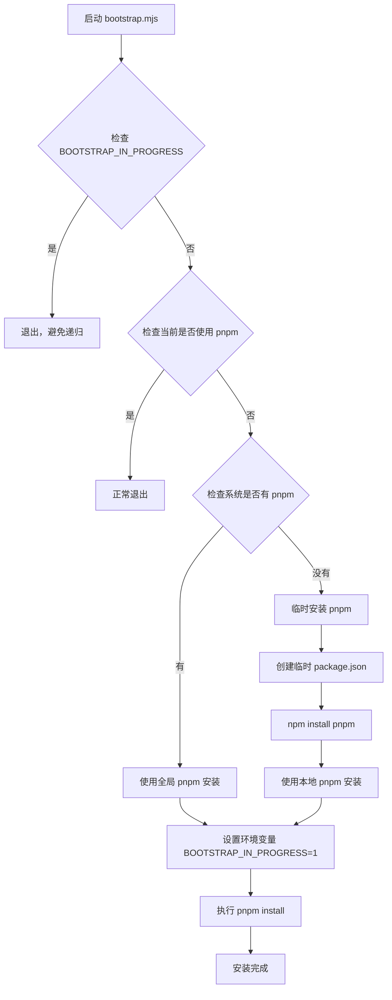

# bootstrap.mjs - 项目引导脚本

## 概述

`bootstrap.mjs` 是 Kilocode 项目的自动化引导脚本，主要用于确保项目使用 pnpm 作为包管理器。该脚本会自动检测当前环境，如果没有使用 pnpm，会自动安装并切换到 pnpm 进行依赖安装。

## 技术实现

### 核心功能

1. **环境检测**: 检查当前是否已经在使用 pnpm
2. **自动安装**: 如果系统没有 pnpm，会临时安装
3. **依赖安装**: 使用 pnpm 安装项目依赖
4. **防重复执行**: 通过环境变量防止递归调用

### 技术架构



### 关键代码逻辑

#### 1. 环境检测

```javascript
// 检查是否已在引导过程中
if (process.env.BOOTSTRAP_IN_PROGRESS) {
	console.log("⏭️  Bootstrap already in progress, continuing with normal installation...")
	process.exit(0)
}

// 检查是否已经在使用 pnpm
if (process.env.npm_execpath && process.env.npm_execpath.includes("pnpm")) {
	process.exit(0)
}
```

#### 2. pnpm 安装函数

```javascript
function runPnpmInstall(pnpmCommand) {
	return spawnSync(pnpmCommand, ["install"], {
		stdio: "inherit",
		shell: true,
		env: {
			...process.env,
			BOOTSTRAP_IN_PROGRESS: "1", // 设置环境变量防止递归
		},
	})
}
```

#### 3. 临时 package.json 创建

```javascript
function ensurePackageJson() {
	if (!existsSync("package.json")) {
		console.log("📦 Creating temporary package.json...")
		writeFileSync("package.json", JSON.stringify({ name: "temp", private: true }, null, 2))
	}
}
```

## 使用方法

### 基本用法

```bash
# 直接执行脚本
node scripts/bootstrap.mjs

# 或者通过 npm scripts 执行
npm run bootstrap
```

### 执行流程

1. 脚本检查当前环境是否已经在使用 pnpm
2. 如果没有，检查系统是否安装了 pnpm
3. 如果系统没有 pnpm，会临时安装到 node_modules
4. 使用 pnpm 执行 `pnpm install` 安装项目依赖
5. 设置环境变量防止递归调用

### 输出示例

```
🚀 Bootstrapping to pnpm...
✨ Found pnpm
🎉 Bootstrap completed successfully!
```

或者在没有 pnpm 的情况下：

```
🚀 Bootstrapping to pnpm...
⚠️  Unable to find pnpm, installing it temporarily...
📦 Creating temporary package.json...
📥 Installing pnpm locally...
🔧 Running pnpm install with local installation...
🎉 Bootstrap completed successfully!
```

## 依赖关系

### Node.js 内置模块

- `child_process`: 用于执行外部命令
- `fs`: 文件系统操作

### 外部依赖

- **pnpm**: 目标包管理器（会自动安装）
- **npm**: 用于临时安装 pnpm（系统自带）

## 配置选项

### 环境变量

- `BOOTSTRAP_IN_PROGRESS`: 防止递归调用的标志
- `npm_execpath`: npm 执行路径，用于检测当前包管理器

## 错误处理

### 常见错误情况

1. **pnpm 安装失败**: 脚本会退出并显示错误信息
2. **权限问题**: 可能需要管理员权限安装全局包
3. **网络问题**: 安装过程中的网络连接问题

### 错误处理机制

```javascript
try {
	// 主要逻辑
} catch (error) {
	console.error("💥 Bootstrap failed:", error.message)
	process.exit(1)
}
```

## 注意事项

### 使用建议

1. **首次运行**: 在克隆项目后首次运行此脚本
2. **CI/CD**: 可以在持续集成流程中使用
3. **团队协作**: 确保所有团队成员使用相同的包管理器

### 最佳实践

1. **定期更新**: 保持 pnpm 版本更新
2. **网络环境**: 确保良好的网络连接
3. **权限管理**: 避免使用 sudo 运行，使用 nvm 等工具管理 Node.js

### 故障排除

1. **权限错误**: 检查 Node.js 和 npm 的安装权限
2. **网络超时**: 配置 npm 镜像源
3. **版本冲突**: 清理 node_modules 后重新运行

## 维护说明

### 版本兼容性

- Node.js 14+
- npm 6+
- pnpm 7+

### 更新指南

1. 定期检查 pnpm 的最新版本
2. 测试脚本在不同操作系统上的兼容性
3. 更新错误处理逻辑以应对新的边缘情况

---

_文档版本: 1.0_  
_最后更新: 2024年_
