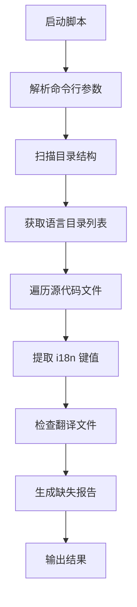

# find-missing-i18n-key.js - 国际化键值检查脚本

## 概述

`find-missing-i18n-key.js` 是用于检查代码中使用的国际化键值是否在翻译文件中存在的实用脚本。该脚本会扫描项目中的组件文件，查找所有使用的 i18n 键值，并检查这些键值是否在所有语言的翻译文件中都有对应的翻译。

## 技术实现

### 核心功能

1. **代码扫描**: 扫描指定目录下的 TypeScript/JavaScript 文件
2. **键值提取**: 使用正则表达式提取 i18n 键值
3. **翻译验证**: 检查键值在各语言文件中的存在性
4. **报告生成**: 生成详细的缺失翻译报告

### 技术架构



### 支持的目录结构

```
DIRS = {
    components: {
        path: "../webview-ui/src/components",
        localesDir: "../webview-ui/src/i18n/locales"
    },
    src: {
        path: "../src",
        localesDir: "../src/i18n/locales"
    }
}
```

### 正则表达式模式

```javascript
const i18nPatterns = [
	/{t\("([^"]+)"\)}/g, // {t("key")} 格式
	/i18nKey="([^"]+)"/g, // i18nKey="key" 格式
	/t\("([a-zA-Z][a-zA-Z0-9_]*[:.][a-zA-Z0-9_.]+)"\)/g, // t("key") 格式，包含冒号或点
]
```

## 使用方法

### 基本用法

```bash
# 检查所有语言的所有文件
node scripts/find-missing-i18n-key.js

# 只检查特定语言
node scripts/find-missing-i18n-key.js --locale=de

# 只检查特定文件
node scripts/find-missing-i18n-key.js --file=chat.json

# 显示帮助信息
node scripts/find-missing-i18n-key.js --help
```

### 命令行参数

| 参数                | 说明           | 示例               |
| ------------------- | -------------- | ------------------ |
| `--locale=<locale>` | 只检查指定语言 | `--locale=de`      |
| `--file=<file>`     | 只检查指定文件 | `--file=chat.json` |
| `--help`            | 显示帮助信息   | -                  |

### 输出示例

#### 成功情况

```
Checking components directory with 5 languages: de, fr, es, ja, zh

✅ All i18n keys are present!
```

#### 发现缺失键值

```
Checking components directory with 5 languages: de, fr, es, ja, zh

Missing i18n keys:

File: src/components/chat/ChatView.tsx
Key: chat:message.send
Missing in:
  - de/chat.json
  - fr/chat.json
-------------------
File: src/components/settings/ApiOptions.tsx
Key: settings:api.timeout
Missing in:
  - ja/settings.json
-------------------
```

## 技术细节

### 键值路径解析

```javascript
function getValueByPath(obj, path) {
	const parts = path.split(".")
	let current = obj

	for (const part of parts) {
		if (current === undefined || current === null) {
			return undefined
		}
		current = current[part]
	}

	return current
}
```

### 翻译文件检查逻辑

```javascript
function checkKeyInLocales(key, localeDirs, localesDir) {
	const [file, ...pathParts] = key.split(":")
	const jsonPath = pathParts.join(".")

	const missingLocales = []

	localeDirs.forEach((locale) => {
		const filePath = path.join(localesDir, locale, `${file}.json`)
		if (!fs.existsSync(filePath)) {
			missingLocales.push(`${locale}/${file}.json`)
			return
		}

		const json = JSON.parse(fs.readFileSync(filePath, "utf8"))
		if (getValueByPath(json, jsonPath) === undefined) {
			missingLocales.push(`${locale}/${file}.json`)
		}
	})

	return missingLocales
}
```

### 文件遍历逻辑

```javascript
function walk(dir, baseDir, localeDirs, localesDir) {
	const files = fs.readdirSync(dir)

	for (const file of files) {
		const filePath = path.join(dir, file)
		const stat = fs.statSync(filePath)

		// 排除测试文件和 __mocks__ 目录
		if (filePath.includes(".test.") || filePath.includes("__mocks__")) continue

		if (stat.isDirectory()) {
			walk(filePath, baseDir, localeDirs, localesDir)
		} else if (stat.isFile() && [".ts", ".tsx", ".js", ".jsx"].includes(path.extname(filePath))) {
			// 处理源代码文件
		}
	}
}
```

## 依赖关系

### Node.js 内置模块

- `fs`: 文件系统操作
- `path`: 路径处理

### 支持的文件类型

- `.ts` - TypeScript 文件
- `.tsx` - TypeScript React 文件
- `.js` - JavaScript 文件
- `.jsx` - JavaScript React 文件

## 配置选项

### 目录配置

可以通过修改 `DIRS` 对象来配置要扫描的目录：

```javascript
const DIRS = {
	components: {
		path: path.join(__dirname, "../webview-ui/src/components"),
		localesDir: path.join(__dirname, "../webview-ui/src/i18n/locales"),
	},
	src: {
		path: path.join(__dirname, "../src"),
		localesDir: path.join(__dirname, "../src/i18n/locales"),
	},
}
```

### 正则表达式配置

可以通过修改 `i18nPatterns` 数组来支持不同的 i18n 使用模式：

```javascript
const i18nPatterns = [
	/{t\("([^"]+)"\)}/g, // React 组件中的使用
	/i18nKey="([^"]+)"/g, // HTML 属性中的使用
	/t\("([a-zA-Z][a-zA-Z0-9_]*[:.][a-zA-Z0-9_.]+)"\)/g, // 函数调用中的使用
]
```

## 错误处理

### 常见错误情况

1. **目录不存在**: 翻译目录不存在时会显示警告
2. **JSON 解析错误**: 翻译文件格式错误
3. **权限问题**: 文件读取权限不足

### 错误处理机制

```javascript
function getLocaleDirs(localesDir) {
	try {
		const allLocales = fs.readdirSync(localesDir).filter((file) => {
			const stats = fs.statSync(path.join(localesDir, file))
			return stats.isDirectory()
		})

		return args.locale ? allLocales.filter((locale) => locale === args.locale) : allLocales
	} catch (error) {
		if (error.code === "ENOENT") {
			console.warn(`Warning: Locales directory not found: ${localesDir}`)
			return []
		}
		throw error
	}
}
```

## 注意事项

### 使用建议

1. **定期检查**: 在添加新的 i18n 键值后运行此脚本
2. **CI/CD 集成**: 可以集成到持续集成流程中
3. **团队协作**: 确保所有团队成员了解 i18n 键值命名规范

### 最佳实践

1. **键值命名**: 使用描述性的键值名称
2. **文件组织**: 按功能模块组织翻译文件
3. **版本控制**: 翻译文件应纳入版本控制

### 限制和注意事项

1. **动态键值**: 无法检测动态生成的键值
2. **注释代码**: 会检查注释中的键值
3. **字符串模板**: 复杂的字符串模板可能无法正确识别

## 维护说明

### 扩展支持

1. **新的 i18n 模式**: 添加新的正则表达式模式
2. **新的文件类型**: 扩展支持的文件类型列表
3. **新的目录结构**: 添加新的扫描目录配置

### 性能优化

1. **并行处理**: 可以考虑并行处理多个文件
2. **缓存机制**: 缓存翻译文件内容避免重复读取
3. **增量检查**: 只检查修改过的文件

---

_文档版本: 1.0_  
_最后更新: 2024年_
