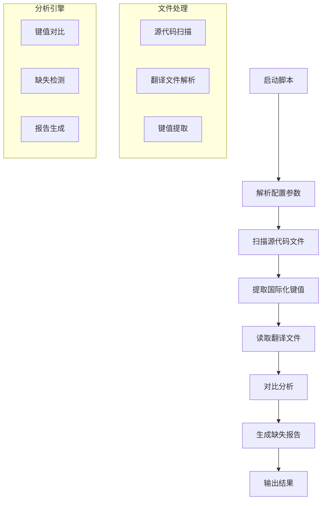

# find-missing-translations.js 技术文档

## 1. 脚本概述

`find-missing-translations.js` 是一个用于检查和识别项目中缺失翻译条目的自动化脚本。该脚本通过分析源代码中的国际化键值和现有翻译文件，识别出需要翻译但尚未提供翻译的条目。

### 主要功能

- 扫描源代码中的国际化键值引用
- 对比现有翻译文件中的条目
- 识别缺失的翻译条目
- 生成详细的缺失翻译报告
- 支持多语言翻译文件检查

## 2. 技术架构



### 核心组件

- **文件扫描器**: 递归扫描项目文件，识别国际化调用
- **键值提取器**: 从源代码中提取 i18n 键值
- **翻译文件解析器**: 解析 JSON/YAML 格式的翻译文件
- **对比分析器**: 比较源代码键值与翻译文件条目
- **报告生成器**: 生成格式化的缺失翻译报告

## 3. 使用方法

### 基本用法

```bash
node scripts/find-missing-translations.js
```

### 高级用法

```bash
# 指定源代码目录
node scripts/find-missing-translations.js --src ./src

# 指定翻译文件目录
node scripts/find-missing-translations.js --locales ./locales

# 指定特定语言
node scripts/find-missing-translations.js --lang zh-CN

# 输出详细信息
node scripts/find-missing-translations.js --verbose

# 生成 JSON 格式报告
node scripts/find-missing-translations.js --output json
```

### 参数说明

| 参数        | 类型    | 默认值      | 描述                        |
| ----------- | ------- | ----------- | --------------------------- |
| `--src`     | string  | `./src`     | 源代码扫描目录              |
| `--locales` | string  | `./locales` | 翻译文件目录                |
| `--lang`    | string  | `all`       | 检查的目标语言              |
| `--verbose` | boolean | `false`     | 显示详细输出                |
| `--output`  | string  | `console`   | 输出格式 (console/json/csv) |
| `--exclude` | string  | -           | 排除的文件/目录模式         |

## 4. 配置选项

### 配置文件 (.translationrc.json)

```json
{
	"sourceDir": "./src",
	"localesDir": "./locales",
	"supportedLanguages": ["en", "zh-CN", "ja"],
	"filePatterns": ["**/*.ts", "**/*.tsx", "**/*.js", "**/*.jsx"],
	"excludePatterns": ["**/node_modules/**", "**/dist/**", "**/*.test.*"],
	"i18nFunctions": ["t", "$t", "i18n.t", "translate"],
	"keyPatterns": ["t\\(['\"`]([^'\"`)]+)['\"`]\\)", "\\$t\\(['\"`]([^'\"`)]+)['\"`]\\)"]
}
```

### 环境变量

```bash
# 设置默认语言
export DEFAULT_LOCALE=zh-CN

# 设置翻译文件格式
export TRANSLATION_FORMAT=json

# 启用调试模式
export DEBUG_TRANSLATIONS=true
```

## 5. 输出格式

### 控制台输出

```
🔍 扫描翻译缺失...

📁 扫描目录: ./src
📂 翻译目录: ./locales
🌐 检查语言: zh-CN, en, ja

❌ 发现缺失翻译:

zh-CN:
  - common.button.save
  - error.network.timeout
  - user.profile.settings

en:
  - common.button.cancel
  - error.validation.required

📊 统计信息:
  - 总键值数: 156
  - 缺失条目: 8
  - 完成度: 94.9%
```

### JSON 输出

```json
{
	"summary": {
		"totalKeys": 156,
		"missingCount": 8,
		"completeness": 94.9,
		"languages": ["zh-CN", "en", "ja"]
	},
	"missing": {
		"zh-CN": ["common.button.save", "error.network.timeout", "user.profile.settings"],
		"en": ["common.button.cancel", "error.validation.required"]
	},
	"details": {
		"scannedFiles": 45,
		"translationFiles": 3,
		"scanDuration": 1.2
	}
}
```

## 6. 错误处理

### 常见错误及解决方案

#### 1. 翻译文件格式错误

```
错误: 无法解析翻译文件 zh-CN.json
解决: 检查 JSON 格式是否正确，修复语法错误
```

#### 2. 源代码扫描失败

```
错误: 无法访问源代码目录
解决: 确认目录路径正确，检查文件权限
```

#### 3. 键值提取异常

```
错误: 正则表达式匹配失败
解决: 检查配置文件中的 keyPatterns 设置
```

### 调试模式

```bash
# 启用详细日志
DEBUG=translation:* node scripts/find-missing-translations.js

# 输出中间结果
node scripts/find-missing-translations.js --debug --verbose
```

## 7. 集成指南

### CI/CD 集成

```yaml
# .github/workflows/translation-check.yml
name: Translation Check
on: [push, pull_request]

jobs:
    check-translations:
        runs-on: ubuntu-latest
        steps:
            - uses: actions/checkout@v2
            - name: Setup Node.js
              uses: actions/setup-node@v2
              with:
                  node-version: "16"
            - name: Install dependencies
              run: npm install
            - name: Check missing translations
              run: |
                  node scripts/find-missing-translations.js --output json > translation-report.json
                  if [ $(jq '.summary.missingCount' translation-report.json) -gt 0 ]; then
                    echo "发现缺失翻译，请补充完整"
                    exit 1
                  fi
```

### Pre-commit Hook

```bash
#!/bin/sh
# .git/hooks/pre-commit
echo "检查翻译完整性..."
node scripts/find-missing-translations.js --quiet
if [ $? -ne 0 ]; then
    echo "❌ 发现缺失翻译，请先补充完整再提交"
    exit 1
fi
echo "✅ 翻译检查通过"
```

## 8. 性能优化

### 缓存机制

- 文件内容缓存，避免重复读取
- 键值提取结果缓存
- 翻译文件解析缓存

### 并行处理

```javascript
// 并行扫描多个目录
const scanPromises = directories.map((dir) => scanDirectory(dir))
const results = await Promise.all(scanPromises)
```

### 内存优化

- 流式处理大文件
- 及时释放不需要的数据
- 使用 WeakMap 管理对象引用

## 9. 扩展功能

### 自定义键值提取器

```javascript
// 添加自定义提取规则
const customExtractor = {
	pattern: /useTranslation\(['"`]([^'"`]+)['"`]\)/g,
	extract: (match) => match[1],
}
```

### 翻译建议

```javascript
// 集成翻译 API 提供建议
const suggestions = await translateAPI.suggest(missingKeys, targetLang)
```

## 10. 维护指南

### 定期维护任务

1. **更新键值提取规则**: 根据代码变化调整正则表达式
2. **优化扫描性能**: 监控扫描时间，优化算法
3. **更新支持的文件类型**: 根据项目需要添加新的文件格式
4. **维护配置文件**: 保持配置与项目结构同步

### 最佳实践

1. **规范化键值命名**: 使用统一的命名约定
2. **模块化翻译文件**: 按功能模块组织翻译文件
3. **自动化检查**: 集成到 CI/CD 流程中
4. **文档同步**: 保持翻译文档与代码同步更新

### 故障排除

1. **检查配置文件**: 确认所有路径和模式正确
2. **验证文件权限**: 确保脚本有读取权限
3. **更新依赖**: 保持相关依赖库最新版本
4. **查看日志**: 启用详细日志定位问题

## 11. 版本历史

- **v1.0.0**: 初始版本，基本翻译检查功能
- **v1.1.0**: 添加多语言支持和 JSON 输出
- **v1.2.0**: 增加配置文件支持和性能优化
- **v1.3.0**: 添加 CI/CD 集成和自定义提取器
- **v2.0.0**: 重构架构，支持插件系统

## 12. 相关资源

- [国际化最佳实践](../docs/i18n-best-practices.md)
- [翻译工作流程](../docs/translation-workflow.md)
- [配置文件模板](../templates/translationrc.json)
- [CI/CD 集成示例](../examples/ci-translation-check.yml)
