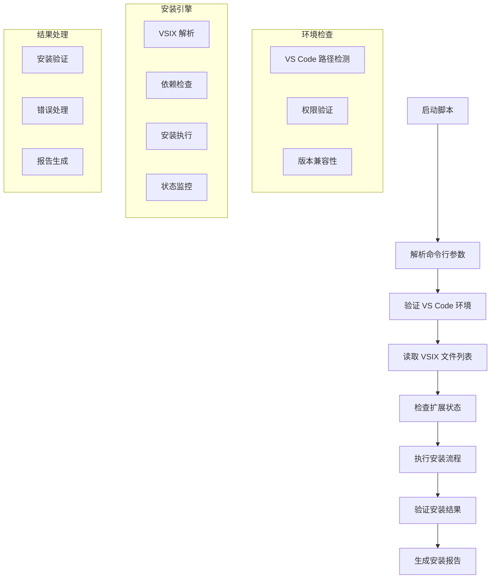

# install-vsix.js 技术文档

## 1. 脚本概述

`install-vsix.js` 是一个用于自动化安装 Visual Studio Code 扩展包（VSIX 文件）的 Node.js 脚本。该脚本简化了开发环境中扩展的安装和管理流程，支持批量安装、版本检查和依赖管理。

### 主要功能

- 自动安装指定的 VSIX 扩展包
- 支持批量安装多个扩展
- 检查扩展版本和兼容性
- 管理扩展依赖关系
- 提供安装进度和状态反馈

## 2. 技术架构



### 核心组件

- **环境检测器**: 检测 VS Code 安装路径和版本
- **VSIX 解析器**: 解析扩展包元数据和依赖
- **安装管理器**: 执行扩展安装和卸载操作
- **依赖解析器**: 处理扩展间的依赖关系
- **状态监控器**: 监控安装进度和状态

## 3. 使用方法

### 基本用法

```bash
# 安装单个 VSIX 文件
node scripts/install-vsix.js extension.vsix

# 安装多个扩展
node scripts/install-vsix.js ext1.vsix ext2.vsix ext3.vsix
```

### 高级用法

```bash
# 从目录批量安装
node scripts/install-vsix.js --dir ./extensions

# 强制重新安装
node scripts/install-vsix.js --force extension.vsix

# 安装到指定 VS Code 实例
node scripts/install-vsix.js --code-path "/path/to/code" extension.vsix

# 跳过依赖检查
node scripts/install-vsix.js --skip-deps extension.vsix

# 静默安装模式
node scripts/install-vsix.js --silent extension.vsix

# 生成详细报告
node scripts/install-vsix.js --verbose --report extension.vsix
```

### 参数说明

| 参数          | 类型    | 默认值   | 描述                     |
| ------------- | ------- | -------- | ------------------------ |
| `--dir`       | string  | -        | 指定包含 VSIX 文件的目录 |
| `--force`     | boolean | `false`  | 强制重新安装已存在的扩展 |
| `--code-path` | string  | 自动检测 | VS Code 可执行文件路径   |
| `--skip-deps` | boolean | `false`  | 跳过依赖关系检查         |
| `--silent`    | boolean | `false`  | 静默模式，减少输出信息   |
| `--verbose`   | boolean | `false`  | 详细输出模式             |
| `--report`    | boolean | `false`  | 生成安装报告             |
| `--dry-run`   | boolean | `false`  | 模拟安装，不执行实际操作 |

## 4. 配置选项

### 配置文件 (.vsixrc.json)

```json
{
	"vscode": {
		"path": "auto",
		"version": ">=1.60.0",
		"editions": ["stable", "insiders"]
	},
	"installation": {
		"timeout": 30000,
		"retries": 3,
		"concurrent": 2,
		"checkDependencies": true,
		"forceReinstall": false
	},
	"extensions": {
		"allowedPublishers": ["microsoft", "kilocode"],
		"blockedExtensions": [],
		"requiredExtensions": ["ms-vscode.vscode-typescript-next"]
	},
	"logging": {
		"level": "info",
		"file": "./logs/vsix-install.log",
		"console": true
	}
}
```

### 环境变量

```bash
# VS Code 安装路径
export VSCODE_PATH="/Applications/Visual Studio Code.app/Contents/Resources/app/bin/code"

# 扩展安装目录
export VSCODE_EXTENSIONS_DIR="~/.vscode/extensions"

# 安装超时时间（毫秒）
export VSIX_INSTALL_TIMEOUT=60000

# 启用调试模式
export DEBUG_VSIX_INSTALL=true
```

## 5. VSIX 文件处理

### 支持的文件格式

- **单个 VSIX 文件**: `extension.vsix`
- **压缩包**: `extensions.zip` (包含多个 VSIX)
- **清单文件**: `extensions.json` (扩展列表)

### 扩展清单格式

```json
{
	"extensions": [
		{
			"name": "kilocode-extension",
			"vsix": "./dist/kilocode-1.0.0.vsix",
			"required": true,
			"dependencies": ["ms-vscode.vscode-typescript-next"]
		},
		{
			"name": "theme-extension",
			"vsix": "./themes/dark-theme.vsix",
			"required": false,
			"category": "theme"
		}
	]
}
```

### 依赖关系处理

```javascript
// 依赖解析示例
const dependencies = {
	"kilocode.main": ["ms-vscode.typescript", "ms-vscode.eslint"],
	"kilocode.themes": [],
	"kilocode.snippets": ["kilocode.main"],
}
```

## 6. 安装流程

### 安装步骤

1. **环境检查**: 验证 VS Code 安装和版本
2. **文件验证**: 检查 VSIX 文件完整性
3. **依赖分析**: 解析扩展依赖关系
4. **冲突检测**: 检查版本冲突和兼容性
5. **执行安装**: 调用 VS Code CLI 安装扩展
6. **验证结果**: 确认安装成功
7. **清理工作**: 清理临时文件

### 安装状态

```
🔍 检查环境...
✅ VS Code 已找到: /usr/bin/code (v1.74.0)

📦 准备安装扩展...
  - kilocode-extension.vsix (v1.2.0)
  - theme-dark.vsix (v0.5.1)

🔗 检查依赖关系...
✅ 所有依赖已满足

⚡ 开始安装...
  ⏳ 安装 kilocode-extension...
  ✅ kilocode-extension 安装成功
  ⏳ 安装 theme-dark...
  ✅ theme-dark 安装成功

📊 安装完成:
  - 成功: 2
  - 失败: 0
  - 跳过: 0
```

## 7. 错误处理

### 常见错误及解决方案

#### 1. VS Code 未找到

```
错误: 无法找到 VS Code 可执行文件
解决:
  - 检查 VS Code 是否已安装
  - 设置正确的 VSCODE_PATH 环境变量
  - 使用 --code-path 参数指定路径
```

#### 2. 权限不足

```
错误: 权限被拒绝，无法安装扩展
解决:
  - 使用管理员权限运行脚本
  - 检查扩展目录的写入权限
  - 确认 VS Code 未在运行中
```

#### 3. 依赖冲突

```
错误: 扩展依赖版本冲突
解决:
  - 更新依赖扩展到兼容版本
  - 使用 --skip-deps 跳过依赖检查
  - 手动解决版本冲突
```

#### 4. VSIX 文件损坏

```
错误: VSIX 文件格式无效或损坏
解决:
  - 重新下载 VSIX 文件
  - 验证文件完整性
  - 检查文件权限
```

### 调试模式

```bash
# 启用详细日志
DEBUG=vsix:* node scripts/install-vsix.js extension.vsix

# 模拟安装（不执行实际操作）
node scripts/install-vsix.js --dry-run --verbose extension.vsix
```

## 8. 集成指南

### 开发环境设置

```bash
#!/bin/bash
# setup-dev-env.sh
echo "设置开发环境..."

# 安装必需扩展
node scripts/install-vsix.js \
  --dir ./dev-extensions \
  --force \
  --verbose

echo "开发环境设置完成"
```

### CI/CD 集成

```yaml
# .github/workflows/setup-extensions.yml
name: Setup VS Code Extensions
on: [workflow_dispatch]

jobs:
    setup-extensions:
        runs-on: ubuntu-latest
        steps:
            - uses: actions/checkout@v2
            - name: Setup Node.js
              uses: actions/setup-node@v2
              with:
                  node-version: "16"
            - name: Install VS Code
              run: |
                  wget -qO- https://packages.microsoft.com/keys/microsoft.asc | gpg --dearmor > packages.microsoft.gpg
                  sudo install -o root -g root -m 644 packages.microsoft.gpg /etc/apt/trusted.gpg.d/
                  sudo sh -c 'echo "deb [arch=amd64,arm64,armhf signed-by=/etc/apt/trusted.gpg.d/packages.microsoft.gpg] https://packages.microsoft.com/repos/code stable main" > /etc/apt/sources.list.d/vscode.list'
                  sudo apt update
                  sudo apt install code
            - name: Install Extensions
              run: node scripts/install-vsix.js --dir ./extensions --silent
```

### Docker 集成

```dockerfile
# Dockerfile.dev
FROM node:16-alpine

# 安装 VS Code Server
RUN wget -O- https://aka.ms/install-vscode-server/setup.sh | sh

# 复制扩展文件
COPY extensions/ /workspace/extensions/
COPY scripts/install-vsix.js /workspace/scripts/

# 安装扩展
RUN node /workspace/scripts/install-vsix.js --dir /workspace/extensions
```

## 9. 性能优化

### 并发安装

```javascript
// 并发安装多个扩展
const installPromises = vsixFiles.map((file) => installExtension(file, { concurrent: true }))
await Promise.allSettled(installPromises)
```

### 缓存机制

- 扩展元数据缓存
- 依赖关系缓存
- 安装状态缓存

### 资源管理

```javascript
// 内存优化
const stream = fs.createReadStream(vsixFile)
const parser = new VSIXParser({ streaming: true })
stream.pipe(parser)
```

## 10. 扩展功能

### 自定义安装器

```javascript
// 注册自定义安装器
const customInstaller = {
	name: "remote-installer",
	install: async (vsixUrl) => {
		const tempFile = await downloadVSIX(vsixUrl)
		return await installLocal(tempFile)
	},
}
```

### 扩展市场集成

```javascript
// 从市场安装扩展
const marketplaceInstaller = {
	install: async (extensionId) => {
		return await vscode.extensions.install(extensionId)
	},
}
```

## 11. 维护指南

### 定期维护任务

1. **更新 VS Code 兼容性**: 测试新版本 VS Code 的兼容性
2. **清理过期扩展**: 移除不再使用的扩展文件
3. **更新依赖映射**: 维护扩展依赖关系数据
4. **性能监控**: 监控安装时间和成功率

### 最佳实践

1. **版本管理**: 使用语义化版本控制扩展
2. **依赖最小化**: 减少不必要的扩展依赖
3. **测试覆盖**: 在不同环境中测试安装脚本
4. **文档同步**: 保持安装文档与脚本同步

### 故障排除清单

- [ ] 检查 VS Code 安装和版本
- [ ] 验证 VSIX 文件完整性
- [ ] 确认文件和目录权限
- [ ] 检查网络连接（如需下载）
- [ ] 查看详细错误日志
- [ ] 验证扩展兼容性

## 12. 安全考虑

### 文件验证

```javascript
// VSIX 文件签名验证
const crypto = require("crypto")
const verifyVSIX = (filePath, expectedHash) => {
	const fileBuffer = fs.readFileSync(filePath)
	const actualHash = crypto.createHash("sha256").update(fileBuffer).digest("hex")
	return actualHash === expectedHash
}
```

### 权限控制

- 最小权限原则
- 沙箱执行环境
- 文件访问限制

## 13. 版本历史

- **v1.0.0**: 初始版本，基本安装功能
- **v1.1.0**: 添加批量安装和依赖检查
- **v1.2.0**: 增加配置文件支持和错误处理
- **v1.3.0**: 添加并发安装和性能优化
- **v2.0.0**: 重构架构，支持插件系统

## 14. 相关资源

- [VS Code 扩展开发指南](../docs/vscode-extension-dev.md)
- [VSIX 打包教程](../docs/vsix-packaging.md)
- [扩展市场发布流程](../docs/marketplace-publishing.md)
- [开发环境配置模板](../templates/dev-environment.json)
