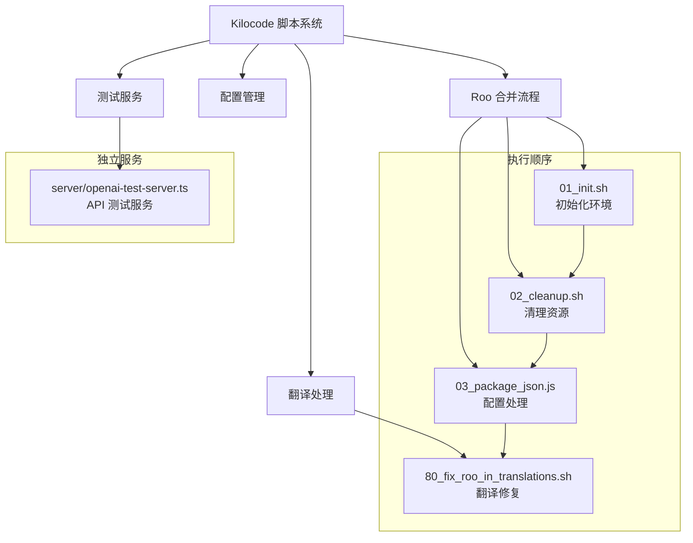

# Kilocode 脚本集合技术文档

## 1. 目录概述

### 目录结构

`scripts/kilocode/` 目录包含了专门用于 Kilocode 项目开发和维护的核心脚本集合，主要涉及代码合并、清理、配置管理和翻译处理等功能。

```
kilocode/
├── roomerge_01_init.sh              # Roo 合并初始化脚本
├── roomerge_02_cleanup.sh           # Roo 合并清理脚本
├── roomerge_03_package_json.js      # Package.json 处理脚本
├── roomerge_80_fix_roo_in_translations.sh  # 翻译文件修复脚本
└── server/                          # 服务器相关脚本
    ├── README.md                    # 服务器脚本文档
    └── openai-test-server.ts        # OpenAI 测试服务器
```

### 主要功能模块

- **Roo 合并系列**：处理代码库合并和集成流程
- **配置管理**：自动化配置文件处理和更新
- **翻译处理**：国际化文件的维护和修复
- **测试服务**：开发和测试环境支持

## 2. 技术架构



### 核心技术栈

- **Shell 脚本**：Bash 4.0+，用于系统级操作
- **Node.js**：JavaScript 运行时，用于配置处理
- **TypeScript**：类型安全的服务器开发
- **Git**：版本控制和代码合并
- **JSON 处理**：配置文件管理

## 3. 脚本分类和功能

### 3.1 Roo 合并系列脚本

| 脚本名称                                 | 执行顺序 | 主要功能               | 依赖关系 |
| ---------------------------------------- | -------- | ---------------------- | -------- |
| `roomerge_01_init.sh`                    | 1        | 环境初始化、依赖检查   | 无       |
| `roomerge_02_cleanup.sh`                 | 2        | 清理临时文件、重置状态 | 依赖 01  |
| `roomerge_03_package_json.js`            | 3        | 处理 package.json 配置 | 依赖 02  |
| `roomerge_80_fix_roo_in_translations.sh` | 4        | 修复翻译文件中的引用   | 依赖 03  |

### 3.2 服务器脚本

| 脚本名称                       | 类型       | 主要功能            | 使用场景 |
| ------------------------------ | ---------- | ------------------- | -------- |
| `server/openai-test-server.ts` | TypeScript | OpenAI API 测试服务 | 开发测试 |

## 4. 使用指南

### 4.1 完整 Roo 合并流程

```bash
# 进入脚本目录
cd scripts/kilocode

# 执行完整合并流程
./roomerge_01_init.sh
./roomerge_02_cleanup.sh
node roomerge_03_package_json.js
./roomerge_80_fix_roo_in_translations.sh
```

### 4.2 单独执行脚本

```bash
# 只执行初始化
./roomerge_01_init.sh

# 只处理配置文件
node roomerge_03_package_json.js

# 只修复翻译文件
./roomerge_80_fix_roo_in_translations.sh
```

### 4.3 测试服务器启动

```bash
# 进入服务器目录
cd scripts/kilocode/server

# 启动测试服务器
npx ts-node openai-test-server.ts
```

## 5. 集成和自动化

### 5.1 CI/CD 集成

```yaml
# GitHub Actions 示例
name: Roo Merge Process
on:
    push:
        branches: [main]
    pull_request:
        branches: [main]

jobs:
    roo-merge:
        runs-on: ubuntu-latest
        steps:
            - uses: actions/checkout@v3
            - uses: actions/setup-node@v3
              with:
                  node-version: "18"

            - name: Run Roo Merge Process
              run: |
                  cd scripts/kilocode
                  chmod +x *.sh
                  ./roomerge_01_init.sh
                  ./roomerge_02_cleanup.sh
                  node roomerge_03_package_json.js
                  ./roomerge_80_fix_roo_in_translations.sh
```

### 5.2 本地开发工作流

```bash
# 创建便捷脚本
cat > run-roo-merge.sh << 'EOF'
#!/bin/bash
set -e
cd "$(dirname "$0")/kilocode"
echo "Starting Roo merge process..."
./roomerge_01_init.sh
./roomerge_02_cleanup.sh
node roomerge_03_package_json.js
./roomerge_80_fix_roo_in_translations.sh
echo "Roo merge process completed!"
EOF

chmod +x run-roo-merge.sh
```

## 6. 环境要求

### 6.1 系统依赖

- **操作系统**：Linux/macOS（推荐），Windows WSL
- **Shell**：Bash 4.0+
- **Node.js**：16.0+
- **Git**：2.20+
- **TypeScript**：4.5+（用于服务器脚本）

### 6.2 权限要求

```bash
# 确保脚本具有执行权限
chmod +x scripts/kilocode/*.sh

# 确保 Node.js 脚本可读
chmod 644 scripts/kilocode/*.js
```

## 7. 监控和日志

### 7.1 日志配置

```bash
# 启用详细日志
export DEBUG=1
export VERBOSE=1

# 执行脚本并记录日志
./roomerge_01_init.sh 2>&1 | tee logs/roo-merge.log
```

### 7.2 错误监控

```bash
# 检查脚本执行状态
if ! ./roomerge_01_init.sh; then
    echo "Init script failed, aborting process"
    exit 1
fi
```

## 8. 故障排除

### 8.1 常见问题

1. **权限错误**

```bash
# 问题：Permission denied
# 解决：设置正确的执行权限
chmod +x scripts/kilocode/*.sh
```

2. **Node.js 版本不兼容**

```bash
# 问题：SyntaxError: Unexpected token
# 解决：升级 Node.js 版本
nvm install 18
nvm use 18
```

3. **Git 操作失败**

```bash
# 问题：Git merge conflicts
# 解决：手动解决冲突后重新执行
git status
git add .
git commit -m "Resolve merge conflicts"
```

### 8.2 调试技巧

```bash
# 启用 Shell 调试模式
bash -x roomerge_01_init.sh

# 检查脚本语法
bash -n roomerge_01_init.sh

# 逐步执行
set -x  # 在脚本开头添加
```

## 9. 最佳实践

### 9.1 执行前检查

- 确保工作目录干净（无未提交的更改）
- 备份重要配置文件
- 检查网络连接（如需要下载依赖）
- 验证所需权限和依赖

### 9.2 安全考虑

- 在测试环境先验证脚本功能
- 使用版本控制跟踪所有更改
- 定期备份关键配置文件
- 限制脚本执行权限范围

### 9.3 维护建议

- 定期更新脚本中的硬编码路径
- 监控脚本执行时间和资源使用
- 保持脚本文档的及时更新
- 建立脚本版本管理机制

## 10. 扩展和定制

### 10.1 添加新脚本

```bash
# 创建新的 Roo 合并脚本
touch roomerge_04_custom.sh
chmod +x roomerge_04_custom.sh

# 添加到执行序列
echo "./roomerge_04_custom.sh" >> run-all.sh
```

### 10.2 配置定制

```javascript
// 在 package.json 处理脚本中添加自定义逻辑
const customConfig = {
	"custom-field": "custom-value",
}

// 合并到现有配置
Object.assign(packageJson, customConfig)
```

## 11. 参考资料

### 11.1 相关文档

- [Bash 脚本编程指南](https://www.gnu.org/software/bash/manual/)
- [Node.js 官方文档](https://nodejs.org/docs/)
- [TypeScript 手册](https://www.typescriptlang.org/docs/)

### 11.2 工具和资源

- [ShellCheck](https://www.shellcheck.net/) - Shell 脚本静态分析
- [ESLint](https://eslint.org/) - JavaScript 代码检查
- [Prettier](https://prettier.io/) - 代码格式化

### 11.3 社区支持

- [Kilocode 官方文档](https://kilocode.ai/docs)
- [GitHub Issues](https://github.com/kilocode/kilocode/issues)
- [开发者社区](https://community.kilocode.ai)
