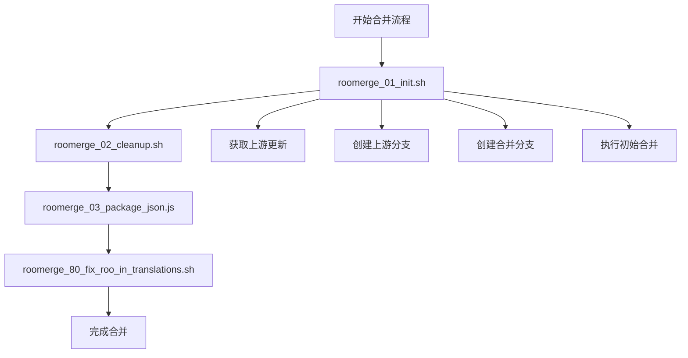
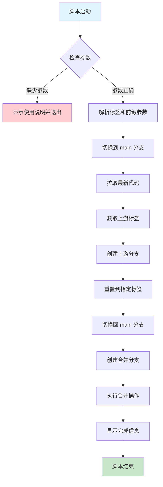
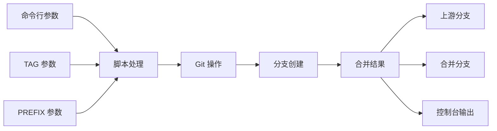

# Roo 合并初始化脚本 (roomerge_01_init.sh)

## 1. 脚本概述

### 脚本名称和用途

- **脚本名称**: `roomerge_01_init.sh`
- **主要用途**: 初始化 Roo 代码合并流程，创建必要的分支并准备合并环境
- **脚本类型**: Bash Shell 脚本

### 主要功能描述

该脚本是 Roo 合并系列脚本的第一步，负责：

- 从上游仓库获取最新的标签和代码
- 创建基于特定标签的上游分支
- 创建用于合并的工作分支
- 执行初始合并操作

### 在 Roo 合并流程中的作用和位置



### 适用场景和目标用户

- **目标用户**: Kilocode 项目维护者和开发者
- **适用场景**:
    - 从上游 Roo 项目合并新版本
    - 定期同步上游代码更新
    - 版本升级和功能集成

## 2. 技术架构

### 脚本执行流程



### 核心技术栈和依赖

- **Shell 环境**: Bash (#!/bin/bash)
- **版本控制**: Git
- **系统要求**: Unix-like 系统 (Linux/macOS)
- **外部依赖**:
    - Git 命令行工具
    - 上游仓库访问权限
    - 网络连接

### 输入输出数据流



## 3. 功能特性

### 详细功能列表

1. **参数验证**

    - 检查必需的 TAG 参数
    - 支持可选的 PREFIX 参数
    - 提供使用说明

2. **Git 仓库操作**

    - 切换到 main 分支
    - 拉取最新代码
    - 获取上游标签

3. **分支管理**

    - 创建上游快照分支
    - 创建合并工作分支
    - 支持分支前缀命名

4. **合并初始化**
    - 重置到指定标签
    - 执行初始合并操作
    - 处理合并冲突准备

### 支持的参数和选项

| 参数   | 类型   | 必需 | 描述             | 示例             |
| ------ | ------ | ---- | ---------------- | ---------------- |
| TAG    | 字符串 | 是   | 要合并的上游标签 | `v3.15.5`        |
| PREFIX | 字符串 | 否   | 分支名称前缀     | `my_github_name` |

### 配置文件和环境变量

- **Git 配置**: 依赖本地 Git 配置
- **上游仓库**: 需要配置 `upstream` 远程仓库
- **权限要求**: 需要对仓库的读写权限

## 4. 使用指南

### 安装和配置步骤

1. **确保 Git 环境**

    ```bash
    # 检查 Git 版本
    git --version

    # 配置上游仓库
    git remote add upstream https://github.com/original/repo.git
    ```

2. **设置脚本权限**
    ```bash
    chmod +x scripts/kilocode/roomerge_01_init.sh
    ```

### 基本使用示例

```bash
# 基本用法 - 合并指定标签
./scripts/kilocode/roomerge_01_init.sh v3.15.5

# 带前缀的用法 - 添加个人标识
./scripts/kilocode/roomerge_01_init.sh v3.15.5 my_github_name
```

### 高级使用场景

```bash
# 1. 批量处理多个标签
for tag in v3.15.5 v3.15.6 v3.15.7; do
    ./scripts/kilocode/roomerge_01_init.sh $tag batch_merge
done

# 2. 与其他脚本组合使用
./scripts/kilocode/roomerge_01_init.sh v3.15.5 && \
./scripts/kilocode/roomerge_02_cleanup.sh && \
./scripts/kilocode/roomerge_03_package_json.js
```

### 命令行参数说明

```bash
Usage: roomerge_01_init.sh <tag> [prefix]

参数说明:
  <tag>     必需参数，指定要合并的上游标签版本
  [prefix]  可选参数，为创建的分支添加前缀标识

示例:
  roomerge_01_init.sh v3.15.5
  roomerge_01_init.sh v3.15.5 my_github_name

创建的分支:
  - upstream-at-<tag> 或 <prefix>/upstream-at-<tag>
  - roo-<tag> 或 <prefix>/roo-<tag>
```

## 5. 技术实现

### 核心算法和逻辑

```bash
# 1. 参数验证逻辑
if [ -z "$1" ]; then
  echo "Usage: $0 <tag> [prefix]"
  exit 1
fi

# 2. 分支命名逻辑
TAG=$1
PREFIX=$2
BRANCH_PREFIX=""
if [ -n "$PREFIX" ]; then
  BRANCH_PREFIX="$PREFIX/"
fi

# 3. Git 操作序列
git checkout main
git pull
git fetch upstream --tags
git checkout -b "${BRANCH_PREFIX}upstream-at-$TAG" upstream/main
git reset --hard "$TAG"
git checkout main
git checkout -b "${BRANCH_PREFIX}roo-$TAG"
git merge "${BRANCH_PREFIX}upstream-at-$TAG"
```

### 关键代码片段分析

1. **错误处理机制**

    ```bash
    set -e  # 遇到错误立即退出
    ```

2. **分支创建策略**

    ```bash
    # 创建上游快照分支
    git checkout -b "${BRANCH_PREFIX}upstream-at-$TAG" upstream/main
    git reset --hard "$TAG"

    # 创建合并工作分支
    git checkout main
    git checkout -b "${BRANCH_PREFIX}roo-$TAG"
    ```

3. **合并操作**
    ```bash
    git merge "${BRANCH_PREFIX}upstream-at-$TAG"
    ```

### 错误处理机制

- **立即失败**: 使用 `set -e` 确保任何命令失败时脚本立即退出
- **参数验证**: 检查必需参数是否提供
- **Git 操作验证**: 依赖 Git 命令的内置错误处理

### 性能优化策略

- **最小化网络操作**: 只获取必要的标签和代码
- **本地分支操作**: 大部分操作在本地进行
- **增量更新**: 使用 `git pull` 而非完整克隆

## 6. 集成指南

### 在 Roo 合并流程中的集成

```bash
#!/bin/bash
# 完整的 Roo 合并流程

TAG="v3.15.5"
PREFIX="merge_$(date +%Y%m%d)"

# 步骤 1: 初始化合并
./scripts/kilocode/roomerge_01_init.sh $TAG $PREFIX

# 步骤 2: 清理不需要的文件
./scripts/kilocode/roomerge_02_cleanup.sh

# 步骤 3: 处理 package.json 冲突
./scripts/kilocode/roomerge_03_package_json.js

# 步骤 4: 修复翻译文件
./scripts/kilocode/roomerge_80_fix_roo_in_translations.sh

echo "合并流程完成，请检查分支: ${PREFIX}/roo-${TAG}"
```

### CI/CD 集成方法

```yaml
# GitHub Actions 示例
name: Roo Merge Process
on:
    workflow_dispatch:
        inputs:
            tag:
                description: "Upstream tag to merge"
                required: true
            prefix:
                description: "Branch prefix"
                required: false

jobs:
    merge:
        runs-on: ubuntu-latest
        steps:
            - uses: actions/checkout@v3
              with:
                  fetch-depth: 0

            - name: Configure Git
              run: |
                  git config user.name "GitHub Actions"
                  git config user.email "actions@github.com"
                  git remote add upstream https://github.com/original/repo.git

            - name: Initialize Merge
              run: |
                  ./scripts/kilocode/roomerge_01_init.sh ${{ github.event.inputs.tag }} ${{ github.event.inputs.prefix }}
```

### Docker 容器化支持

```dockerfile
FROM alpine/git:latest

# 安装必要工具
RUN apk add --no-cache bash

# 复制脚本
COPY scripts/kilocode/roomerge_01_init.sh /usr/local/bin/

# 设置工作目录
WORKDIR /workspace

# 设置入口点
ENTRYPOINT ["/usr/local/bin/roomerge_01_init.sh"]
```

## 7. 故障排除

### 常见问题和解决方案

#### 问题 1: "upstream" 远程仓库未配置

```bash
# 错误信息
fatal: 'upstream' does not appear to be a git repository

# 解决方案
git remote add upstream https://github.com/original/repo.git
git fetch upstream
```

#### 问题 2: 标签不存在

```bash
# 错误信息
fatal: reference is not a tree: v3.15.5

# 解决方案
git fetch upstream --tags
git tag -l | grep v3.15  # 查看可用标签
```

#### 问题 3: 分支已存在

```bash
# 错误信息
fatal: A branch named 'roo-v3.15.5' already exists

# 解决方案
git branch -D roo-v3.15.5  # 删除现有分支
# 或使用不同的前缀
./roomerge_01_init.sh v3.15.5 new_prefix
```

### 错误代码和含义

| 退出代码 | 含义         | 解决方法           |
| -------- | ------------ | ------------------ |
| 1        | 参数错误     | 检查命令行参数     |
| 128      | Git 操作失败 | 检查 Git 仓库状态  |
| 129      | 分支操作失败 | 检查分支是否已存在 |

### 调试技巧和工具

```bash
# 1. 启用详细输出
bash -x scripts/kilocode/roomerge_01_init.sh v3.15.5

# 2. 检查 Git 状态
git status
git branch -a
git remote -v

# 3. 验证标签
git tag -l | grep v3.15
git show v3.15.5
```

### 日志分析方法

```bash
# 创建日志文件
./scripts/kilocode/roomerge_01_init.sh v3.15.5 2>&1 | tee merge_init.log

# 分析关键信息
grep -E "(error|fatal|warning)" merge_init.log
grep "Creating branch" merge_init.log
```

## 8. 最佳实践

### 使用建议和注意事项

1. **执行前检查**

    - 确保工作目录干净 (`git status`)
    - 备份重要的本地更改
    - 验证上游仓库连接

2. **分支命名规范**

    - 使用有意义的前缀
    - 包含日期或版本信息
    - 避免特殊字符

3. **合并策略**
    - 先在测试分支验证
    - 逐步合并，不要跳跃版本
    - 保持合并历史清晰

### 性能优化建议

```bash
# 1. 使用浅克隆减少网络传输
git fetch upstream --tags --depth=1

# 2. 并行处理多个操作
git fetch upstream --tags &
git pull &
wait

# 3. 缓存凭据避免重复认证
git config credential.helper cache
```

### 安全考虑

- **权限控制**: 确保只有授权用户可以执行合并
- **代码审查**: 合并前进行代码审查
- **备份策略**: 定期备份重要分支
- **访问日志**: 记录合并操作的执行者和时间

### 维护和更新指南

1. **定期更新**

    - 检查脚本兼容性
    - 更新 Git 命令语法
    - 适配新的上游仓库结构

2. **监控和告警**
    ```bash
    # 添加执行时间监控
    start_time=$(date +%s)
    # ... 脚本执行 ...
    end_time=$(date +%s)
    echo "执行时间: $((end_time - start_time)) 秒"
    ```

## 9. 版本兼容性

### 支持的操作系统

- **Linux**: Ubuntu 18.04+, CentOS 7+, Debian 9+
- **macOS**: 10.14+
- **Windows**: WSL 2 环境

### 依赖版本要求

- **Git**: 2.20.0+
- **Bash**: 4.0+
- **网络**: 稳定的互联网连接

### 向后兼容性说明

- 支持 Git 2.x 所有版本
- 兼容不同的分支命名策略
- 适配各种上游仓库结构

### 升级指南

```bash
# 检查当前 Git 版本
git --version

# 升级 Git (Ubuntu)
sudo apt update && sudo apt upgrade git

# 升级 Git (macOS)
brew upgrade git

# 验证脚本兼容性
./scripts/kilocode/roomerge_01_init.sh --help
```

## 10. 参考资料

### 相关文档链接

- [Git 官方文档](https://git-scm.com/doc)
- [Git 分支管理最佳实践](https://git-scm.com/book/en/v2/Git-Branching-Branching-Workflows)
- [Shell 脚本编程指南](https://www.gnu.org/software/bash/manual/)

### 外部依赖文档

- [Git 命令参考](https://git-scm.com/docs)
- [Bash 脚本教程](https://tldp.org/LDP/Bash-Beginners-Guide/html/)
- [Unix Shell 编程](https://www.tutorialspoint.com/unix/unix-shell.htm)

### 社区资源

- [Kilocode 项目 GitHub](https://github.com/kilocode/kilocode)
- [Git 工作流讨论](https://github.com/kilocode/kilocode/discussions)
- [问题反馈](https://github.com/kilocode/kilocode/issues)

### 更新日志

- **v1.0.0**: 初始版本，支持基本合并功能
- **v1.1.0**: 添加分支前缀支持
- **v1.2.0**: 改进错误处理和日志输出
- **v1.3.0**: 优化性能和网络操作
