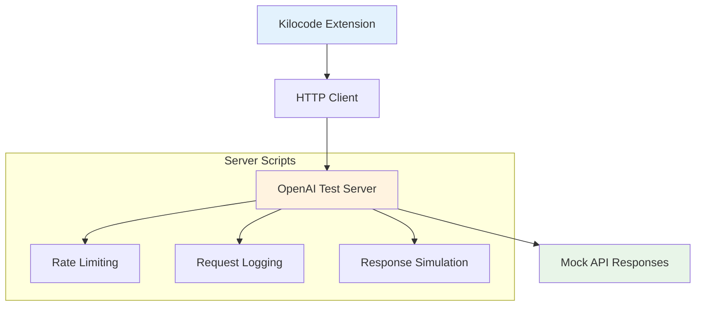

# Kilocode 服务器脚本目录

## 1. 目录概述

### 目录结构

```
scripts/kilocode/server/
├── README.md                    # 本文档
└── openai-test-server.ts       # OpenAI 测试服务器脚本
```

### 主要功能

`server` 子目录包含用于测试和开发的服务器脚本，主要用于：

- 模拟 OpenAI API 服务
- 提供本地测试环境
- 支持开发和调试工作流

## 2. 整体架构

### 服务器架构图



### 技术栈

- **运行时**: Node.js + TypeScript
- **HTTP 服务**: Express.js
- **开发工具**: ts-node
- **测试支持**: 模拟 OpenAI API 响应

## 3. 脚本概览

### openai-test-server.ts

**用途**: 提供 OpenAI API 的本地测试服务器

**主要功能**:

- 模拟 OpenAI Chat Completions API
- 支持流式和非流式响应
- 实现速率限制和错误模拟
- 提供健康检查端点

**技术特性**:

- TypeScript 实现
- Express.js 框架
- CORS 支持
- 请求日志记录
- 可配置的响应延迟

## 4. 使用场景

### 开发环境测试

```bash
# 启动测试服务器
cd scripts/kilocode/server
npx ts-node openai-test-server.ts
```

### 集成测试

- 在 CI/CD 流程中启动测试服务器
- 运行扩展的集成测试
- 验证 API 调用逻辑

### 调试和开发

- 本地开发时替代真实的 OpenAI API
- 测试错误处理逻辑
- 验证请求格式和响应处理

## 5. 配置和部署

### 环境要求

- Node.js 16+
- TypeScript 4.5+
- Express.js 4.x

### 安装依赖

```bash
# 在项目根目录
npm install express @types/express cors @types/cors
npm install -D ts-node typescript
```

### 启动服务

```bash
# 开发模式
npx ts-node scripts/kilocode/server/openai-test-server.ts

# 或者编译后运行
npx tsc scripts/kilocode/server/openai-test-server.ts
node scripts/kilocode/server/openai-test-server.js
```

## 6. API 接口

### 支持的端点

- `POST /v1/chat/completions` - 聊天完成 API
- `GET /v1/models` - 模型列表 API
- `GET /health` - 健康检查
- `GET /status` - 服务器状态

### 响应格式

遵循 OpenAI API 规范，支持：

- 标准 JSON 响应
- 流式 SSE 响应
- 错误响应模拟

## 7. 开发指南

### 添加新的 API 端点

1. 在 `openai-test-server.ts` 中添加路由
2. 实现响应逻辑
3. 添加适当的错误处理
4. 更新文档

### 自定义响应行为

- 修改响应延迟
- 添加新的错误场景
- 自定义响应内容

### 日志和监控

- 请求日志记录
- 性能监控
- 错误追踪

## 8. 最佳实践

### 安全考虑

- 仅在开发和测试环境使用
- 不要在生产环境暴露测试服务器
- 注意敏感信息的处理

### 性能优化

- 合理设置响应延迟
- 避免内存泄漏
- 适当的并发控制

### 维护建议

- 定期更新依赖
- 保持与 OpenAI API 规范的同步
- 添加适当的测试用例

## 9. 故障排除

### 常见问题

1. **端口占用**: 检查 3000 端口是否被占用
2. **依赖缺失**: 确保安装了所有必要的 npm 包
3. **TypeScript 错误**: 检查 TypeScript 配置和版本

### 调试技巧

- 使用 `console.log` 添加调试信息
- 检查网络请求和响应
- 使用浏览器开发者工具

## 10. 相关资源

### 文档链接

- [OpenAI API 文档](https://platform.openai.com/docs/api-reference)
- [Express.js 文档](https://expressjs.com/)
- [TypeScript 文档](https://www.typescriptlang.org/docs/)

### 项目文件

- `openai-test-server.md` - 详细的服务器脚本文档
- `../../README.md` - 脚本目录总览
