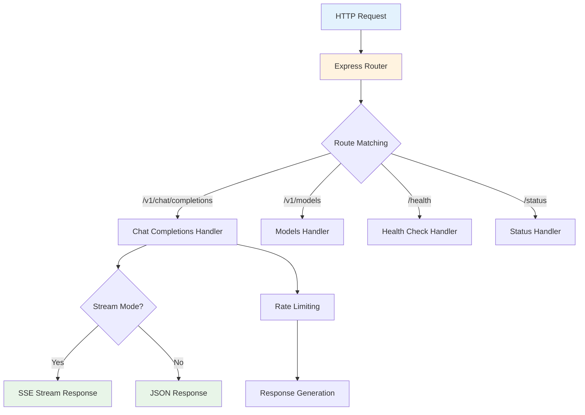
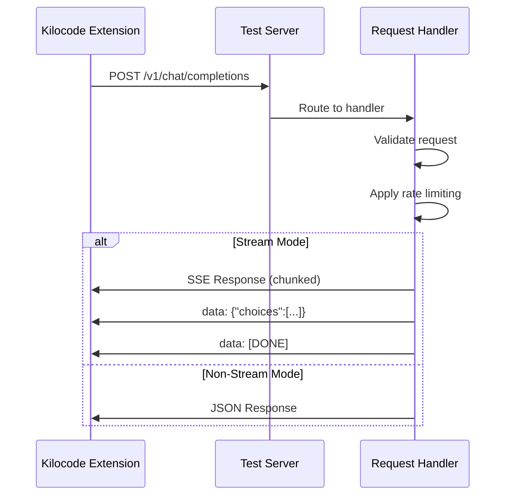

# OpenAI 测试服务器脚本 (openai-test-server.ts)

## 1. 脚本概述

### 脚本名称和用途

- **脚本名称**: `openai-test-server.ts`

- **主要用途**: 提供 OpenAI API 的本地测试服务器，用于开发和测试 Kilocode 扩展

- **脚本类型**: TypeScript Node.js 服务器应用

### 主要功能描述

该脚本实现了一个完整的 OpenAI API 模拟服务器，包括：

- 模拟 OpenAI Chat Completions API (支持流式和非流式)

- 提供模型列表 API

- 实现速率限制和错误模拟

- 支持 CORS 跨域请求

- 提供健康检查和状态监控端点

### 适用场景和目标用户

- **目标用户**: Kilocode 扩展开发者和测试人员

- **适用场景**:

    - 本地开发环境测试

    - CI/CD 集成测试

    - API 调用逻辑验证

    - 错误处理测试

## 2. 技术架构

### 服务器架构图



### 核心技术栈和依赖

- **运行时**: Node.js 16+

- **语言**: TypeScript 4.5+

- **Web 框架**: Express.js 4.x

- **跨域支持**: CORS middleware

- **流式响应**: Server-Sent Events (SSE)

### 输入输出数据流



## 3. 功能特性

### 详细功能列表

#### 1. Chat Completions API (`/v1/chat/completions`)

- **支持参数**:

    - `model`: 模型名称 (如 "gpt-3.5-turbo", "gpt-4")

    - `messages`: 消息数组

    - `stream`: 是否启用流式响应

    - `max_tokens`: 最大令牌数

    - `temperature`: 温度参数

- **响应格式**:

    ```typescript
    interface ChatCompletionResponse {
    	id: string
    	object: "chat.completion"
    	created: number
    	model: string
    	choices: Array<{
    		index: number
    		message: {
    			role: "assistant"
    			content: string
    		}
    		finish_reason: "stop" | "length"
    	}>
    	usage: {
    		prompt_tokens: number
    		completion_tokens: number
    		total_tokens: number
    	}
    }
    ```

#### 2. 模型列表 API (`/v1/models`)

- 返回可用模型列表

- 模拟 OpenAI 的模型响应格式

#### 3. 健康检查 (`/health`)

- 服务器状态检查

- 返回简单的健康状态

#### 4. 服务器状态 (`/status`)

- 详细的服务器运行状态

- 包含启动时间、请求计数等信息

### 速率限制功能

```typescript
// 简单的速率限制实现
const rateLimitMap = new Map<string, number>()

function checkRateLimit(ip: string): boolean {
	const now = Date.now()
	const lastRequest = rateLimitMap.get(ip) || 0

	if (now - lastRequest < 1000) {
		// 1秒限制
		return false
	}

	rateLimitMap.set(ip, now)
	return true
}
```

## 4. 使用指南

### 安装和配置步骤

#### 1. 安装依赖

```bash
# 在项目根目录
npm install express @types/express cors @types/cors
npm install -D ts-node typescript @types/node
```

#### 2. 配置 TypeScript

确保项目有 `tsconfig.json` 配置文件：

```json
{
	"compilerOptions": {
		"target": "ES2020",
		"module": "commonjs",
		"strict": true,
		"esModuleInterop": true,
		"skipLibCheck": true,
		"forceConsistentCasingInFileNames": true
	}
}
```

### 基本使用示例

#### 启动服务器

```bash
# 开发模式 (推荐)
npx ts-node scripts/kilocode/server/openai-test-server.ts

# 或编译后运行
npx tsc scripts/kilocode/server/openai-test-server.ts
node scripts/kilocode/server/openai-test-server.js
```

#### 测试 API 调用

```bash
# 测试 Chat Completions (非流式)
curl -X POST http://localhost:3000/v1/chat/completions \
  -H "Content-Type: application/json" \
  -d '{
    "model": "gpt-3.5-turbo",
    "messages": [{"role": "user", "content": "Hello!"}],
    "stream": false
  }'

# 测试流式响应
curl -X POST http://localhost:3000/v1/chat/completions \
  -H "Content-Type: application/json" \
  -d '{
    "model": "gpt-3.5-turbo",
    "messages": [{"role": "user", "content": "Hello!"}],
    "stream": true
  }'
```

### 高级使用场景

#### 在 Kilocode 扩展中配置

```typescript
// 在扩展配置中指向本地测试服务器
const config = {
	apiBaseUrl: "http://localhost:3000/v1",
	apiKey: "test-key", // 测试服务器会忽略实际的 API key
}
```

## 5. 技术实现

### 核心算法和逻辑

#### 1. 服务器初始化

```typescript
import express from "express"
import cors from "cors"

const app = express()
const PORT = 3000

// 中间件配置
app.use(cors())
app.use(express.json())

// 请求日志
app.use((req, res, next) => {
	console.log(`${new Date().toISOString()} ${req.method} ${req.path}`)
	next()
})
```

#### 2. Chat Completions 处理器

```typescript
app.post("/v1/chat/completions", (req, res) => {
	const { model, messages, stream = false } = req.body

	// 速率限制检查
	if (!checkRateLimit(req.ip)) {
		return res.status(429).json({
			error: {
				message: "Rate limit exceeded",
				type: "rate_limit_error",
			},
		})
	}

	if (stream) {
		handleStreamResponse(req, res)
	} else {
		handleNormalResponse(req, res)
	}
})
```

#### 3. 流式响应处理

```typescript
function handleStreamResponse(req: any, res: any) {
	res.writeHead(200, {
		"Content-Type": "text/event-stream",
		"Cache-Control": "no-cache",
		Connection: "keep-alive",
	})

	const chunks = ["Hello", " there", "! How", " can", " I", " help", " you", " today", "?"]

	chunks.forEach((chunk, index) => {
		setTimeout(() => {
			const response = {
				id: `chatcmpl-${Date.now()}`,
				object: "chat.completion.chunk",
				created: Math.floor(Date.now() / 1000),
				model: req.body.model || "gpt-3.5-turbo",
				choices: [
					{
						index: 0,
						delta: { content: chunk },
						finish_reason: null,
					},
				],
			}

			res.write(`data: ${JSON.stringify(response)}\n\n`)

			if (index === chunks.length - 1) {
				res.write("data: [DONE]\n\n")
				res.end()
			}
		}, index * 100)
	})
}
```

### 错误处理机制

```typescript
// 全局错误处理
app.use((err: any, req: any, res: any, next: any) => {
	console.error("Server error:", err)
	res.status(500).json({
		error: {
			message: "Internal server error",
			type: "server_error",
		},
	})
})

// 404 处理
app.use("*", (req, res) => {
	res.status(404).json({
		error: {
			message: "Not found",
			type: "not_found_error",
		},
	})
})
```

## 6. 集成指南

### 在开发工作流中的集成

#### 1. 开发环境启动脚本

```json
// package.json
{
	"scripts": {
		"test-server": "ts-node scripts/kilocode/server/openai-test-server.ts",
		"test-server:build": "tsc scripts/kilocode/server/openai-test-server.ts && node scripts/kilocode/server/openai-test-server.js"
	}
}
```

#### 2. CI/CD 集成

```yaml
# GitHub Actions 示例
name: Integration Tests
on: [push, pull_request]

jobs:
    test:
        runs-on: ubuntu-latest
        steps:
            - uses: actions/checkout@v3
            - uses: actions/setup-node@v3
              with:
                  node-version: "18"

            - name: Install dependencies
              run: npm install

            - name: Start test server
              run: |
                  npm run test-server &
                  sleep 5  # 等待服务器启动

            - name: Run integration tests
              run: npm test
```

### Docker 容器化

```dockerfile
# Dockerfile.test-server
FROM node:18-alpine

WORKDIR /app
COPY package*.json ./
RUN npm install

COPY scripts/kilocode/server/ ./scripts/kilocode/server/
COPY tsconfig.json ./

EXPOSE 3000
CMD ["npx", "ts-node", "scripts/kilocode/server/openai-test-server.ts"]
```

## 7. 故障排除

### 常见问题和解决方案

#### 问题 1: 端口占用

```bash
# 检查端口占用
lsof -i :3000  # macOS/Linux
netstat -ano | findstr :3000  # Windows

# 解决方案：修改端口或终止占用进程
```

#### 问题 2: TypeScript 编译错误

```bash
# 检查 TypeScript 配置
npx tsc --noEmit scripts/kilocode/server/openai-test-server.ts

# 常见解决方案
npm install -D @types/node @types/express @types/cors
```

#### 问题 3: CORS 错误

```typescript
// 确保 CORS 配置正确
app.use(
	cors({
		origin: ["http://localhost:3000", "vscode-webview://"],
		credentials: true,
	}),
)
```

### 调试技巧

1. **启用详细日志**

    ```typescript
    app.use((req, res, next) => {
    	console.log("Request:", {
    		method: req.method,
    		url: req.url,
    		headers: req.headers,
    		body: req.body,
    	})
    	next()
    })
    ```

2. **使用调试工具**

    ```bash
    # 使用 Node.js 调试器
    node --inspect scripts/kilocode/server/openai-test-server.js
    ```

## 8. 最佳实践

### 安全考虑

1. **仅开发使用**: 不要在生产环境部署此测试服务器
2. **网络隔离**: 仅绑定到 localhost，避免外部访问
3. **敏感数据**: 不要在测试响应中包含真实的敏感信息

### 性能优化

1. **响应缓存**: 对相同请求实现简单缓存
2. **连接池**: 合理管理并发连接
3. **内存管理**: 避免内存泄漏，定期清理速率限制映射

### 维护建议

1. **定期更新**: 保持与 OpenAI API 规范同步
2. **测试覆盖**: 添加单元测试和集成测试
3. **文档更新**: 及时更新 API 文档和使用说明

## 9. 版本兼容性

### 支持的环境

- **Node.js**: 16.x, 18.x, 20.x

- **TypeScript**: 4.5+

- **操作系统**: Windows, macOS, Linux

### 依赖版本要求

```json
{
	"dependencies": {
		"express": "^4.18.0",
		"cors": "^2.8.5"
	},
	"devDependencies": {
		"@types/express": "^4.17.0",
		"@types/cors": "^2.8.0",
		"@types/node": "^18.0.0",
		"ts-node": "^10.9.0",
		"typescript": "^4.9.0"
	}
}
```

## 10. 参考资料

### API 规范

- [OpenAI API Reference](https://platform.openai.com/docs/api-reference)

- [Server-Sent Events Specification](https://html.spec.whatwg.org/multipage/server-sent-events.html)

### 技术文档

- [Express.js Documentation](https://expressjs.com/)

- [TypeScript Handbook](https://www.typescriptlang.org/docs/)

- [Node.js Documentation](https://nodejs.org/docs/)

### 相关项目文件

- `../README.md` - 服务器脚本目录概览

- `../../README.md` - 脚本目录总览
