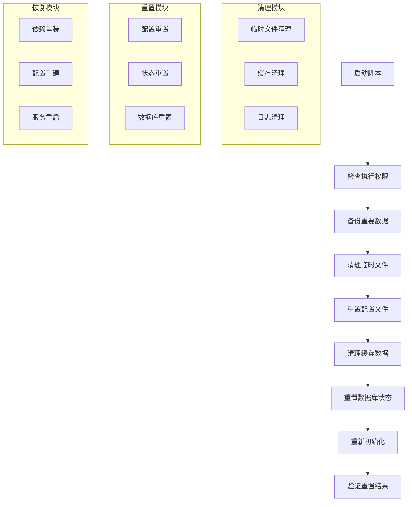

# reset-kilocode-state.sh 技术文档

## 1. 脚本概述

`reset-kilocode-state.sh` 是一个用于重置 Kilocode 项目状态的 Shell 脚本。该脚本能够清理项目的临时文件、缓存数据、配置状态，并将项目恢复到初始状态，常用于开发调试、测试环境重置和故障排除。

### 主要功能

- 清理项目临时文件和缓存
- 重置用户配置和状态数据
- 清理日志文件和调试信息
- 恢复默认配置设置
- 重新初始化项目依赖

## 2. 技术架构



### 核心组件

- **权限检查器**: 验证脚本执行权限和环境
- **备份管理器**: 创建重要数据的安全备份
- **清理引擎**: 系统性清理各类临时和缓存文件
- **配置重置器**: 恢复配置文件到默认状态
- **初始化器**: 重新初始化项目环境

## 3. 使用方法

### 基本用法

```bash
# 标准重置（交互式确认）
./scripts/reset-kilocode-state.sh

# 强制重置（跳过确认）
./scripts/reset-kilocode-state.sh --force

# 部分重置（仅清理缓存）
./scripts/reset-kilocode-state.sh --cache-only
```

### 高级用法

```bash
# 完全重置（包括用户数据）
./scripts/reset-kilocode-state.sh --full

# 保留用户配置的重置
./scripts/reset-kilocode-state.sh --keep-config

# 静默模式重置
./scripts/reset-kilocode-state.sh --silent

# 创建备份后重置
./scripts/reset-kilocode-state.sh --backup

# 仅重置开发环境
./scripts/reset-kilocode-state.sh --dev-only

# 重置并重新安装依赖
./scripts/reset-kilocode-state.sh --reinstall
```

### 参数说明

| 参数            | 描述                         |
| --------------- | ---------------------------- |
| `--force`       | 强制执行，跳过所有确认提示   |
| `--full`        | 完全重置，包括用户数据和配置 |
| `--cache-only`  | 仅清理缓存文件，保留其他数据 |
| `--keep-config` | 保留用户配置文件             |
| `--silent`      | 静默模式，减少输出信息       |
| `--backup`      | 重置前创建完整备份           |
| `--dev-only`    | 仅重置开发相关文件           |
| `--reinstall`   | 重置后重新安装所有依赖       |
| `--dry-run`     | 模拟执行，显示将要执行的操作 |

## 4. 重置范围

### 清理的文件和目录

```bash
# 临时文件
/tmp/kilocode-*
~/.kilocode/temp/*
./temp/*
./.temp/*

# 缓存文件
~/.kilocode/cache/*
./node_modules/.cache/*
./.next/cache/*
./dist/*
./build/*

# 日志文件
./logs/*
~/.kilocode/logs/*
/var/log/kilocode/*

# 状态文件
~/.kilocode/state.json
./kilocode-state.json
./.kilocode-session
```

### 重置的配置

```bash
# 用户配置
~/.kilocode/config.json
~/.kilocode/preferences.json
~/.kilocode/workspace.json

# 项目配置
./kilocode.config.js
./.kilocode/project.json
./package-lock.json
./yarn.lock

# 环境配置
./.env.local
./.env.development
./.env.test
```

### 数据库重置

```sql
-- 清理用户会话
DELETE FROM user_sessions;

-- 重置临时数据
DELETE FROM temp_data WHERE created_at < NOW() - INTERVAL '1 DAY';

-- 清理缓存表
TRUNCATE TABLE cache_entries;

-- 重置计数器
UPDATE system_counters SET value = 0;
```

## 5. 安全机制

### 备份策略

```bash
# 创建时间戳备份
BACKUP_DIR="./backups/$(date +%Y%m%d_%H%M%S)"
mkdir -p "$BACKUP_DIR"

# 备份重要配置
cp ~/.kilocode/config.json "$BACKUP_DIR/"
cp ./kilocode.config.js "$BACKUP_DIR/"

# 备份用户数据
tar -czf "$BACKUP_DIR/user_data.tar.gz" ~/.kilocode/data/
```

### 确认机制

```bash
# 交互式确认
echo "⚠️  警告: 此操作将重置所有 Kilocode 状态数据"
echo "📁 将要清理的目录:"
echo "   - ~/.kilocode/cache"
echo "   - ~/.kilocode/temp"
echo "   - ./logs"
echo ""
read -p "确认继续? (y/N): " confirm

if [[ $confirm != [yY] ]]; then
    echo "❌ 操作已取消"
    exit 1
fi
```

### 权限检查

```bash
# 检查执行权限
if [[ $EUID -eq 0 ]]; then
    echo "❌ 不建议以 root 权限运行此脚本"
    exit 1
fi

# 检查文件权限
if [[ ! -w ~/.kilocode ]]; then
    echo "❌ 没有写入权限: ~/.kilocode"
    exit 1
fi
```

## 6. 执行流程

### 重置步骤

```bash
#!/bin/bash
# 主要执行流程

# 1. 环境检查
check_environment() {
    echo "🔍 检查执行环境..."
    check_permissions
    check_dependencies
    check_running_processes
}

# 2. 创建备份
create_backup() {
    if [[ "$BACKUP" == "true" ]]; then
        echo "💾 创建备份..."
        backup_configs
        backup_user_data
    fi
}

# 3. 停止服务
stop_services() {
    echo "⏹️  停止相关服务..."
    pkill -f "kilocode"
    pkill -f "node.*kilocode"
}

# 4. 清理文件
cleanup_files() {
    echo "🧹 清理文件..."
    clean_temp_files
    clean_cache_files
    clean_log_files
}

# 5. 重置配置
reset_configs() {
    echo "⚙️  重置配置..."
    reset_user_config
    reset_project_config
}

# 6. 重新初始化
reinitialize() {
    echo "🔄 重新初始化..."
    npm install
    npm run build
}

# 7. 验证结果
verify_reset() {
    echo "✅ 验证重置结果..."
    check_file_cleanup
    check_config_reset
    check_services_status
}
```

### 状态输出

```
🚀 开始重置 Kilocode 状态...

🔍 检查执行环境...
✅ 权限检查通过
✅ 依赖检查通过
⚠️  发现运行中的进程: kilocode-server (PID: 1234)

💾 创建备份...
✅ 配置文件已备份到: ./backups/20231201_143022/
✅ 用户数据已备份

⏹️  停止相关服务...
✅ kilocode-server 已停止
✅ 所有相关进程已终止

🧹 清理文件...
✅ 临时文件已清理 (125 MB)
✅ 缓存文件已清理 (89 MB)
✅ 日志文件已清理 (45 MB)

⚙️  重置配置...
✅ 用户配置已重置
✅ 项目配置已重置

🔄 重新初始化...
✅ 依赖重新安装完成
✅ 项目构建完成

✅ 验证重置结果...
✅ 所有文件清理完成
✅ 配置重置成功
✅ 服务状态正常

🎉 Kilocode 状态重置完成!
```

## 7. 错误处理

### 常见错误及解决方案

#### 1. 权限不足

```bash
错误: Permission denied
解决:
  - 检查文件和目录权限
  - 确保当前用户有写入权限
  - 避免使用 root 权限运行
```

#### 2. 进程占用

```bash
错误: 无法删除文件，资源被占用
解决:
  - 停止所有 Kilocode 相关进程
  - 检查文件是否被其他程序占用
  - 使用 lsof 命令查看文件占用情况
```

#### 3. 磁盘空间不足

```bash
错误: No space left on device
解决:
  - 清理其他不必要的文件
  - 检查磁盘使用情况
  - 考虑移动备份到其他位置
```

### 错误恢复

```bash
# 错误恢复函数
recover_from_error() {
    local error_code=$1
    echo "❌ 发生错误 (代码: $error_code)"

    case $error_code in
        1) echo "🔧 尝试修复权限问题..."
           fix_permissions ;;
        2) echo "🔧 尝试强制停止进程..."
           force_kill_processes ;;
        3) echo "🔧 尝试清理磁盘空间..."
           emergency_cleanup ;;
    esac
}
```

## 8. 集成指南

### CI/CD 集成

```yaml
# .github/workflows/reset-environment.yml
name: Reset Test Environment
on:
    workflow_dispatch:
    schedule:
        - cron: "0 2 * * *" # 每天凌晨2点

jobs:
    reset-environment:
        runs-on: ubuntu-latest
        steps:
            - uses: actions/checkout@v2
            - name: Reset Kilocode State
              run: |
                  chmod +x scripts/reset-kilocode-state.sh
                  ./scripts/reset-kilocode-state.sh --force --silent
            - name: Verify Reset
              run: |
                  # 验证重置是否成功
                  test ! -d ~/.kilocode/cache
                  test ! -d ./logs
```

### Docker 集成

```dockerfile
# 在 Docker 容器中重置
FROM node:16-alpine
COPY scripts/reset-kilocode-state.sh /usr/local/bin/
RUN chmod +x /usr/local/bin/reset-kilocode-state.sh

# 容器启动时重置状态
ENTRYPOINT ["/usr/local/bin/reset-kilocode-state.sh", "--force", "--silent"]
```

### 开发工具集成

```json
// package.json
{
	"scripts": {
		"reset": "./scripts/reset-kilocode-state.sh",
		"reset:force": "./scripts/reset-kilocode-state.sh --force",
		"reset:cache": "./scripts/reset-kilocode-state.sh --cache-only",
		"reset:full": "./scripts/reset-kilocode-state.sh --full --backup"
	}
}
```

## 9. 性能优化

### 并行清理

```bash
# 并行执行清理任务
cleanup_parallel() {
    (
        clean_temp_files &
        clean_cache_files &
        clean_log_files &
        wait
    )
}
```

### 增量清理

```bash
# 基于时间的增量清理
incremental_cleanup() {
    local days_old=${1:-7}
    find ~/.kilocode/cache -type f -mtime +$days_old -delete
    find ./logs -type f -mtime +$days_old -delete
}
```

## 10. 监控和日志

### 操作日志

```bash
# 记录重置操作
log_operation() {
    local operation=$1
    local status=$2
    local timestamp=$(date '+%Y-%m-%d %H:%M:%S')

    echo "[$timestamp] $operation: $status" >> ~/.kilocode/reset.log
}
```

### 性能监控

```bash
# 监控清理性能
monitor_cleanup() {
    local start_time=$(date +%s)
    local start_size=$(du -sb ~/.kilocode | cut -f1)

    # 执行清理
    cleanup_files

    local end_time=$(date +%s)
    local end_size=$(du -sb ~/.kilocode | cut -f1)
    local duration=$((end_time - start_time))
    local cleaned_size=$((start_size - end_size))

    echo "清理完成: ${duration}秒, 释放空间: $(numfmt --to=iec $cleaned_size)"
}
```

## 11. 维护指南

### 定期维护任务

1. **更新清理规则**: 根据项目变化调整清理范围
2. **优化性能**: 监控执行时间，优化清理算法
3. **测试兼容性**: 在不同环境中测试脚本
4. **更新文档**: 保持使用说明与脚本同步

### 最佳实践

1. **谨慎使用**: 在生产环境中谨慎使用完全重置
2. **定期备份**: 重要数据定期备份
3. **权限控制**: 使用最小必要权限
4. **测试验证**: 在测试环境中验证脚本功能

### 故障排除清单

- [ ] 检查脚本执行权限
- [ ] 验证文件和目录权限
- [ ] 确认没有进程占用文件
- [ ] 检查磁盘空间是否充足
- [ ] 查看详细错误日志
- [ ] 验证备份是否完整

## 12. 版本历史

- **v1.0.0**: 初始版本，基本重置功能
- **v1.1.0**: 添加备份机制和安全检查
- **v1.2.0**: 增加部分重置选项
- **v1.3.0**: 添加并行清理和性能优化
- **v2.0.0**: 重构架构，支持模块化清理

## 13. 相关资源

- [项目配置管理指南](../docs/config-management.md)
- [备份恢复流程](../docs/backup-recovery.md)
- [开发环境设置](../docs/dev-environment-setup.md)
- [故障排除手册](../docs/troubleshooting.md)
