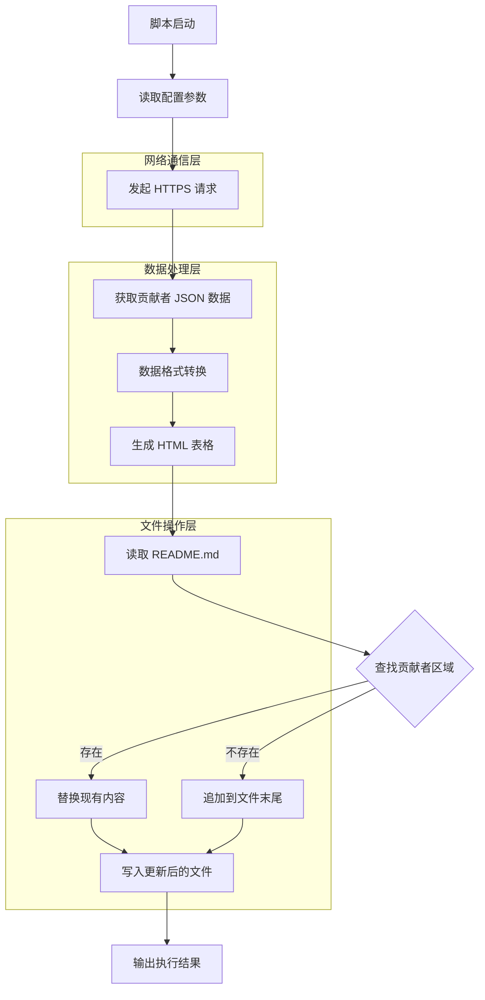

# update-contributors.js 技术文档

## 1. 脚本概述

### 脚本名称和用途

`update-contributors.js` 是一个自动化脚本，用于从 kilocode.ai 获取贡献者信息并更新项目 README.md 文件中的贡献者展示区域。

### 主要功能描述

- 从远程 API 获取贡献者数据
- 生成格式化的 HTML 表格展示贡献者头像
- 自动更新 README.md 文件中的贡献者部分
- 支持限制显示数量和"更多"链接

### 适用场景和目标用户

- **开源项目维护者**：自动维护贡献者列表
- **CI/CD 流程**：集成到自动化部署流程中
- **社区管理**：定期更新项目贡献者展示

## 2. 技术架构



### 核心技术栈和依赖

- **Node.js 原生模块**：
    - `fs` - 文件系统操作
    - `path` - 路径处理
    - `https` - HTTPS 请求
    - `url` - URL 处理

### 输入输出数据流

- **输入**：kilocode.ai/contributors.json API 数据
- **处理**：JSON 数据转换为 HTML 表格格式
- **输出**：更新后的 README.md 文件

## 3. 功能特性

### 详细的功能列表

1. **远程数据获取**

    - 从 kilocode.ai API 获取贡献者信息
    - 支持 HTTPS 协议安全传输
    - 自动 JSON 解析和错误处理

2. **数据格式转换**

    - kilocode.ai 格式转换为 GitHub 兼容格式
    - 头像 URL 生成和尺寸控制
    - 用户链接生成

3. **HTML 表格生成**

    - 5 列网格布局
    - 圆形头像样式
    - 响应式设计支持

4. **文件内容管理**
    - 智能区域识别和替换
    - 标记符管理
    - 内容完整性保护

### 支持的参数和选项

```javascript
// 配置常量
const MAX_CONTRIBUTORS_DISPLAY = 9 // 最大显示数量
const CONTRIBUTORS_JSON_URL = "..." // API 端点
const CONTRIBUTORS_PAGE_URL = "..." // 完整列表页面
const README_FILE = "../README.md" // 目标文件路径
```

### 配置文件和环境变量

- **文件路径配置**：通过 `__dirname` 自动计算相对路径
- **API 端点配置**：硬编码在脚本中，可根据需要修改
- **显示限制**：通过常量 `MAX_CONTRIBUTORS_DISPLAY` 控制

## 4. 使用指南

### 安装和配置步骤

```bash
# 确保 Node.js 环境
node --version  # 需要支持 ES modules

# 进入脚本目录
cd scripts

# 确保 README.md 文件存在
ls -la ../README.md
```

### 基本使用示例

```bash
# 直接执行脚本
node update-contributors.js

# 使用 npm scripts（如果配置）
npm run update-contributors

# 在 CI/CD 中使用
./scripts/update-contributors.js
```

### 高级使用场景

```bash
# 结合其他脚本使用
node update-contributors.js && git add README.md && git commit -m "Update contributors"

# 定时任务集成
# 在 crontab 中添加
0 0 * * 0 cd /path/to/project && node scripts/update-contributors.js
```

### 命令行参数说明

该脚本当前不支持命令行参数，所有配置通过脚本内部常量设置。

## 5. 技术实现

### 核心算法和逻辑

1. **HTTP 请求处理**

```javascript
function makeRequest(url) {
	return new Promise((resolve, reject) => {
		https
			.get(url, (res) => {
				let data = ""
				res.on("data", (chunk) => {
					data += chunk
				})
				res.on("end", () => {
					try {
						resolve(JSON.parse(data))
					} catch (error) {
						reject(error)
					}
				})
			})
			.on("error", reject)
	})
}
```

2. **HTML 表格生成算法**

```javascript
// 5列网格布局逻辑
for (let i = 0; i < displayContributors.length; i++) {
	if (i % 5 === 0) {
		// 每5个贡献者开始新行
		contributorGrid += "  <tr>\n"
	}
	// 添加贡献者单元格
}
```

### 关键代码片段分析

- **数据转换逻辑**：将 kilocode.ai 格式转换为标准 GitHub 格式
- **文件内容替换**：使用标记符进行精确的内容区域替换
- **错误处理机制**：Promise 链式调用和 try-catch 包装

### 错误处理机制

```javascript
try {
	// 主要逻辑
} catch (error) {
	console.error("Error updating contributors section:", error.message)
	console.error("Stack trace:", error.stack)
	process.exit(1)
}
```

### 性能优化策略

- 使用 Node.js 原生模块避免额外依赖
- 流式数据处理减少内存占用
- 单次文件读写操作提高效率

## 6. 集成指南

### CI/CD 集成方法

```yaml
# GitHub Actions 示例
name: Update Contributors
on:
    schedule:
        - cron: "0 0 * * 0" # 每周日执行
    workflow_dispatch:

jobs:
    update-contributors:
        runs-on: ubuntu-latest
        steps:
            - uses: actions/checkout@v3
            - uses: actions/setup-node@v3
              with:
                  node-version: "18"
            - name: Update contributors
              run: node scripts/update-contributors.js
            - name: Commit changes
              run: |
                  git config --local user.email "action@github.com"
                  git config --local user.name "GitHub Action"
                  git add README.md
                  git diff --staged --quiet || git commit -m "Update contributors list"
                  git push
```

### 与其他脚本的协作

```bash
# 与文档生成脚本结合
node scripts/update-contributors.js
node scripts/generate-docs.js
node scripts/update-changelog.js
```

### 自动化工作流集成

- **Pre-commit hooks**：在提交前自动更新贡献者
- **Release 流程**：在发布新版本时更新贡献者列表
- **定时任务**：定期同步最新的贡献者信息

### Docker 容器化支持

```dockerfile
FROM node:18-alpine
WORKDIR /app
COPY scripts/ ./scripts/
COPY README.md ./
RUN node scripts/update-contributors.js
```

## 7. 故障排除

### 常见问题和解决方案

1. **网络连接问题**

```bash
# 错误：ENOTFOUND kilocode.ai
# 解决：检查网络连接和 DNS 设置
ping kilocode.ai
nslookup kilocode.ai
```

2. **文件权限问题**

```bash
# 错误：EACCES: permission denied
# 解决：检查文件权限
chmod 644 README.md
ls -la README.md
```

3. **JSON 解析错误**

```bash
# 错误：Unexpected token in JSON
# 解决：检查 API 响应格式
curl -s https://kilocode.ai/contributors.json | jq .
```

### 错误代码和含义

- **Exit Code 1**：脚本执行失败，检查错误日志
- **Network Errors**：网络连接或 API 访问问题
- **File System Errors**：文件读写权限或路径问题

### 调试技巧和工具

```bash
# 启用详细日志
DEBUG=* node scripts/update-contributors.js

# 检查 API 响应
curl -v https://kilocode.ai/contributors.json

# 验证生成的 HTML
node -e "console.log(require('./scripts/update-contributors.js'))"
```

### 日志分析方法

- 查看控制台输出了解执行进度
- 检查错误堆栈跟踪定位问题
- 使用 `console.log` 添加调试信息

## 8. 最佳实践

### 使用建议和注意事项

1. **定期执行**：建议每周或每月执行一次
2. **备份文件**：执行前备份 README.md 文件
3. **测试环境**：先在测试环境验证脚本功能
4. **版本控制**：将更改提交到版本控制系统

### 性能优化建议

- 使用缓存机制减少 API 调用频率
- 实现增量更新避免不必要的文件写入
- 添加并发控制避免同时执行多个实例

### 安全考虑

- 验证 API 响应数据的完整性
- 使用 HTTPS 确保数据传输安全
- 限制文件写入权限范围

### 维护和更新指南

- 定期检查 API 端点的可用性
- 监控脚本执行日志和错误率
- 根据 API 变更更新数据处理逻辑

## 9. 版本兼容性

### 支持的操作系统

- **Linux**：Ubuntu 18.04+, CentOS 7+
- **macOS**：10.14+
- **Windows**：Windows 10+

### 依赖版本要求

- **Node.js**：14.0.0+（支持 ES modules）
- **npm**：6.0.0+
- **Git**：2.0+（用于版本控制集成）

### 向后兼容性说明

- 脚本使用 ES modules 语法，需要 Node.js 14+
- 生成的 HTML 兼容现代浏览器
- API 数据格式变更可能需要更新转换逻辑

### 升级指南

1. 备份现有配置和数据
2. 更新 Node.js 到最新 LTS 版本
3. 测试脚本功能是否正常
4. 更新 CI/CD 配置中的 Node.js 版本

## 10. 参考资料

### 相关文档链接

- [Node.js HTTPS 模块文档](https://nodejs.org/api/https.html)
- [Node.js File System 文档](https://nodejs.org/api/fs.html)
- [ES Modules 指南](https://nodejs.org/api/esm.html)

### 外部依赖文档

- [kilocode.ai API 文档](https://kilocode.ai/api-docs)
- [GitHub Contributors API](https://docs.github.com/en/rest/repos/repos#list-repository-contributors)

### 社区资源

- [Node.js 最佳实践](https://github.com/goldbergyoni/nodebestpractices)
- [JavaScript 代码规范](https://standardjs.com/)

### 更新日志

- **v1.0.0**：初始版本，支持基本的贡献者列表更新
- **v1.1.0**：添加网格布局和"更多"链接支持
- **v1.2.0**：改进错误处理和日志输出
