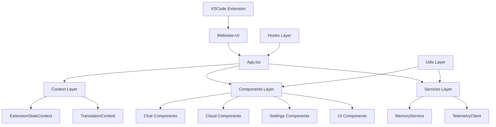
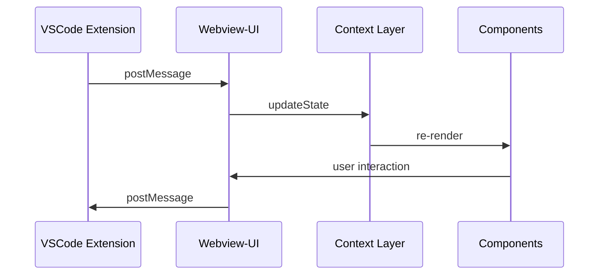

# Webview-UI 架构文档

## 1. 项目概述

Webview-UI 是 Kilocode 项目的前端用户界面模块，基于 React + TypeScript + Vite 构建，为 VSCode 扩展提供现代化的 Web 界面。该模块采用组件化架构，支持国际化、主题切换，并与 VSCode 扩展紧密集成。

## 2. 技术栈

### 2.1 核心技术

- **前端框架**: React 18.3.1
- **类型系统**: TypeScript 5.8.3
- **构建工具**: Vite 6.3.6
- **样式方案**: Tailwind CSS 4.0.0 + shadcn/ui
- **状态管理**: React Context + TanStack Query
- **测试框架**: Vitest 3.2.3 + Testing Library

### 2.2 UI 组件库

- **基础组件**: Radix UI 组件集
- **图标系统**: VSCode Codicons + Lucide React
- **样式工具**: class-variance-authority + clsx + tailwind-merge

### 2.3 功能特性

- **国际化**: i18next + react-i18next
- **代码高亮**: Shiki + rehype-highlight
- **数学公式**: KaTeX
- **图表渲染**: Mermaid
- **虚拟化**: React Virtuoso
- **音频支持**: use-sound

## 3. 架构设计

### 3.1 整体架构



### 3.2 模块分层

| 层级     | 模块        | 职责               |
| -------- | ----------- | ------------------ |
| 应用层   | App.tsx     | 应用入口，路由管理 |
| 上下文层 | context/    | 全局状态管理       |
| 组件层   | components/ | UI 组件实现        |
| 钩子层   | hooks/      | 自定义 React Hooks |
| 服务层   | services/   | 业务逻辑服务       |
| 工具层   | utils/      | 通用工具函数       |
| 国际化层 | i18n/       | 多语言支持         |

## 4. 核心模块

### 4.1 组件系统 (components/)

- **chat/**: 聊天界面组件
- **cloud/**: 云服务相关组件
- **common/**: 通用组件
- **settings/**: 设置界面组件
- **ui/**: 基础 UI 组件库
- **welcome/**: 欢迎页面组件

### 4.2 状态管理 (context/)

- **ExtensionStateContext**: 扩展状态管理
- **TranslationContext**: 国际化上下文

### 4.3 自定义钩子 (hooks/)

- **useAutoApprovalState**: 自动批准状态管理
- **useCloudUpsell**: 云服务升级提示
- **useKeybindings**: 键盘快捷键绑定

### 4.4 业务服务 (services/)

- **MemoryService**: 内存管理服务
- **mermaidSyntaxFixer**: Mermaid 语法修复

### 4.5 工具函数 (utils/)

- **command-parser**: 命令解析
- **format**: 格式化工具
- **highlight**: 代码高亮
- **TelemetryClient**: 遥测客户端

## 5. 数据流

### 5.1 VSCode 通信



### 5.2 状态管理流程

1. **初始化**: ExtensionStateContext 初始化全局状态
2. **通信**: 通过 VSCode API 与扩展通信
3. **更新**: Context 更新触发组件重渲染
4. **持久化**: 状态变更同步到 VSCode 扩展

## 6. 开发规范

### 6.1 组件开发

- 使用 TypeScript 严格模式
- 遵循 React Hooks 规范
- 采用函数式组件
- 使用 forwardRef 处理 ref 传递

### 6.2 样式规范

- 使用 Tailwind CSS 原子类
- 通过 shadcn/ui 组件库保持一致性
- 支持深色/浅色主题切换
- 响应式设计优先

### 6.3 测试策略

- 单元测试：Vitest + Testing Library
- 组件测试：React Testing Library
- E2E 测试：与 VSCode 扩展集成测试
- 覆盖率要求：核心组件 > 80%

## 7. 构建与部署

### 7.1 开发环境

```bash
npm run dev          # 开发服务器
npm run test         # 运行测试
npm run lint         # 代码检查
```

### 7.2 生产构建

```bash
npm run build        # 生产构建
npm run build:nightly # 夜间版本构建
```

### 7.3 集成流程

1. Webview-UI 构建产物输出到 `../src/webview-ui`
2. VSCode 扩展打包时包含 webview 资源
3. 通过 VSCode Webview API 加载和显示

## 8. 性能优化

### 8.1 代码分割

- 按路由分割代码块
- 懒加载非关键组件
- 动态导入第三方库

### 8.2 渲染优化

- React.memo 优化组件渲染
- useMemo/useCallback 缓存计算结果
- React Virtuoso 处理长列表

### 8.3 资源优化

- 图片懒加载
- 字体子集化
- CSS 压缩和优化

## 9. 扩展性设计

### 9.1 插件系统

- 支持动态加载组件
- 提供标准化的组件接口
- 主题和样式可定制

### 9.2 国际化扩展

- 支持多语言动态切换
- 翻译资源按需加载
- RTL 语言支持

### 9.3 功能扩展

- 模块化的功能组件
- 标准化的数据接口
- 可配置的用户界面

## 10. 维护指南

### 10.1 依赖管理

- 定期更新依赖版本
- 监控安全漏洞
- 保持与 VSCode API 兼容

### 10.2 代码质量

- ESLint 规则检查
- Prettier 代码格式化
- TypeScript 类型检查
- 单元测试覆盖

### 10.3 文档维护

- API 文档同步更新
- 组件使用示例
- 架构变更记录
- 最佳实践指南
