# Components 组件系统

## 概述

webview-ui 的组件系统是一个基于 React + TypeScript 的现代化前端架构，采用模块化设计理念，为 Kilocode VSCode 扩展提供丰富的用户界面组件。整个组件系统遵循单一职责原则，通过清晰的分层架构实现高内聚、低耦合的设计目标。

## 设计理念

### 1. 模块化架构

- **功能分离**: 按业务功能将组件分组到不同目录

- **可复用性**: 通用组件抽象到 `common/` 目录

- **可维护性**: 每个模块职责明确，便于独立开发和测试

### 2. 类型安全

- 全面使用 TypeScript 进行类型约束

- 严格的 Props 接口定义

- 完善的事件处理类型声明

### 3. 性能优化

- React.memo 优化渲染性能

- useCallback 和 useMemo 防止不必要的重渲染

- 虚拟滚动处理大量数据展示

## 组件分类架构

```mermaid
graph TD
    A[Components 组件系统] --> B[chat/ 聊天组件]
    A --> C[common/ 通用组件]
    A --> D[kilocode/ 核心业务组件]
    A --> E[history/ 历史记录组件]
    A --> F[cloud/ 云服务组件]
    A --> G[settings/ 设置组件]
    A --> H[ui/ UI基础组件]
    A --> I[welcome/ 欢迎页组件]
    A --> J[mcp/ MCP协议组件]
    A --> K[modes/ 模式组件]
    A --> L[marketplace/ 市场组件]
    A --> M[human-relay/ 人工中继组件]
    A --> N[error-boundary/ 错误边界组件]
    A --> O[kilocodeMcp/ MCP相关组件]

    B --> B1[ChatView 主聊天界面]
    B --> B2[ChatRow 消息行]
    B --> B3[ChatTextArea 输入区域]

    C --> C1[CodeBlock 代码块]
    C --> C2[Modal 模态框]
    C --> C3[Button 按钮组件]

    D --> D1[KiloModeSelector 模式选择器]
    D --> D2[ModelSelector 模型选择器]
    D --> D3[ProfileView 配置视图]

    N --> N1[ErrorBoundary 错误捕获]
    N --> N2[ErrorFallback 错误回退]

    O --> O1[McpProvider MCP提供者]
    O --> O2[McpConnector MCP连接器]
```



## 核心模块功能

### 1. Chat 聊天组件 (`chat/`)

**职责**: 处理用户与 AI 的交互界面

- **ChatView**: 主聊天界面，消息展示和交互控制

- **ChatRow**: 单条消息渲染，支持多种消息类型

- **ChatTextArea**: 用户输入区域，支持多行文本和快捷命令

- **TaskTimeline**: 任务执行时间线展示

### 2. Common 通用组件 (`common/`)

**职责**: 提供可复用的基础 UI 组件

- **CodeBlock**: 代码展示组件，支持语法高亮

- **Modal**: 模态对话框组件

- **MermaidBlock**: Mermaid 图表渲染组件

- **ImageViewer**: 图片查看器组件

### 3. Kilocode 核心业务组件 (`kilocode/`)

**职责**: Kilocode 特有的业务逻辑组件

- **KiloModeSelector**: 工作模式选择器

- **ModelSelector**: AI 模型选择器

- **ProfileView**: 用户配置管理界面

- **OrganizationSelector**: 组织选择器

### 4. History 历史记录组件 (`history/`)

**职责**: 任务历史管理和展示

- **HistoryView**: 历史记录主界面

- **TaskItem**: 单个任务项展示

- **DeleteTaskDialog**: 任务删除确认对话框

### 5. Settings 设置组件 (`settings/`)

**职责**: 应用配置和设置管理

- **ApiOptions**: API 配置选项

- **UISettings**: 界面设置选项

- **ModelSettings**: 模型配置设置

### 6. Cloud 云服务组件 (`cloud/`)

**职责**: 云服务相关功能和界面

- **CloudSync**: 云端同步功能

- **CloudStorage**: 云存储管理

- **CloudAuth**: 云服务认证

- **CloudSettings**: 云服务配置

### 7. UI 基础组件 (`ui/`)

**职责**: 提供基础的 UI 界面元素

- **Layout**: 布局组件

- **Navigation**: 导航组件

- **Toolbar**: 工具栏组件

- **StatusBar**: 状态栏组件

### 8. Welcome 欢迎页组件 (`welcome/`)

**职责**: 用户首次使用的引导界面

- **WelcomeView**: 欢迎页主界面

- **OnboardingSteps**: 引导步骤组件

- **QuickStart**: 快速开始指南

- **FeatureIntro**: 功能介绍组件

### 9. MCP 协议组件 (`mcp/`)

**职责**: MCP (Model Context Protocol) 协议相关功能

- **McpClient**: MCP 客户端

- **McpServer**: MCP 服务端

- **McpProtocol**: MCP 协议处理

- **McpTransport**: MCP 传输层

### 10. Modes 模式组件 (`modes/`)

**职责**: 不同工作模式的管理和切换

- **ModeSelector**: 模式选择器

- **ModeConfig**: 模式配置

- **ModeSwitch**: 模式切换器

- **CustomMode**: 自定义模式

### 11. Marketplace 市场组件 (`marketplace/`)

**职责**: 扩展和插件市场功能

- **MarketplaceView**: 市场主界面

- **ExtensionCard**: 扩展卡片

- **InstallManager**: 安装管理器

- **ReviewSystem**: 评价系统

### 12. Human Relay 人工中继组件 (`human-relay/`)

**职责**: 人工介入和中继功能

- **RelayInterface**: 中继接口

- **HumanApproval**: 人工审批

- **RelayQueue**: 中继队列

- **RelayHistory**: 中继历史

### 13. Error Boundary 错误边界组件 (`error-boundary/`)

**职责**: 错误捕获和处理

- **ErrorBoundary**: 错误边界组件

- **ErrorFallback**: 错误回退界面

- **ErrorReporter**: 错误报告器

- **ErrorRecovery**: 错误恢复机制

### 14. KilocodeMcp MCP相关组件 (`kilocodeMcp/`)

**职责**: Kilocode 特定的 MCP 功能实现

- **McpProvider**: MCP 提供者

- **McpConnector**: MCP 连接器

- **McpIntegration**: MCP 集成

- **McpConfiguration**: MCP 配置

## 组件通信机制

### 1. Context 状态管理

```typescript
// 扩展状态上下文
ExtensionStateContext - 全局状态管理 - 配置信息共享 - 事件通信桥梁

// 主题上下文
ThemeContext - 主题切换管理 - 样式变量共享
```

### 2. 事件通信

```typescript
// VSCode 扩展通信
vscode.postMessage({
	type: "messageType",
	payload: data,
})

// 组件间事件传递
interface ComponentProps {
	onEvent: (data: EventData) => void
	onStateChange: (state: State) => void
}
```

### 3. Hook 状态共享

```typescript
// 自定义 Hook 模式
useExtensionState() // 扩展状态管理
useSelectedModel() // 模型选择状态
useAppTranslation() // 国际化翻译
```

## 开发规范

### 1. 组件命名规范

- **PascalCase**: 组件名使用大驼峰命名

- **功能描述**: 组件名应清晰描述其功能

- **避免缩写**: 使用完整单词而非缩写

### 2. 文件组织规范

```
ComponentName/
├── ComponentName.tsx          # 主组件文件
├── ComponentName.module.css   # 样式文件（如需要）
├── hooks/                     # 组件专用 Hook
├── __tests__/                 # 测试文件
└── types.ts                   # 类型定义
```

### 3. Props 接口规范

```typescript
interface ComponentProps {
	// 必需属性
	id: string
	title: string

	// 可选属性
	className?: string
	disabled?: boolean

	// 事件处理
	onClick?: (event: MouseEvent) => void
	onSubmit?: (data: FormData) => void

	// 子组件
	children?: React.ReactNode
}
```

### 4. 性能优化规范

```typescript
// 使用 React.memo 优化渲染
const Component = React.memo<Props>(({ prop1, prop2 }) => {
  // 使用 useCallback 缓存函数
  const handleClick = useCallback(() => {
    // 处理逻辑
  }, [dependency])

  // 使用 useMemo 缓存计算结果
  const computedValue = useMemo(() => {
    return expensiveComputation(prop1)
  }, [prop1])

  return <div>{/* 组件内容 */}</div>
})
```

## 测试策略

### 1. 单元测试

- **组件渲染测试**: 验证组件正确渲染

- **Props 传递测试**: 验证属性正确传递和处理

- **事件处理测试**: 验证用户交互事件正确响应

- **状态变化测试**: 验证组件状态正确更新

### 2. 集成测试

- **组件协作测试**: 验证组件间正确协作

- **Context 集成测试**: 验证 Context 状态正确共享

- **Hook 集成测试**: 验证自定义 Hook 正确工作

### 3. 测试工具

```typescript
// 测试框架: Vitest + React Testing Library
import { render, screen, fireEvent } from '@testing-library/react'
import { describe, it, expect, vi } from 'vitest'

describe('ComponentName', () => {
  it('should render correctly', () => {
    render(<ComponentName />)
    expect(screen.getByRole('button')).toBeInTheDocument()
  })
})
```

## 性能优化指南

### 1. 渲染优化

- **避免内联对象**: 防止不必要的重渲染

- **合理使用 key**: 优化列表渲染性能

- **懒加载组件**: 使用 React.lazy 延迟加载

### 2. 内存优化

- **及时清理**: 组件卸载时清理定时器和事件监听

- **避免内存泄漏**: 正确处理异步操作和订阅

- **缓存策略**: 合理使用缓存减少重复计算

### 3. 网络优化

- **图片懒加载**: 延迟加载非关键图片资源

- **代码分割**: 按需加载组件代码

- **资源预加载**: 预加载关键资源

## 可访问性支持

### 1. 语义化标签

- 使用正确的 HTML 语义标签

- 提供适当的 ARIA 属性

- 确保键盘导航支持

### 2. 屏幕阅读器支持

- 提供 alt 文本描述

- 使用 aria-label 和 aria-describedby

- 确保焦点管理正确

### 3. 颜色和对比度

- 满足 WCAG 对比度要求

- 不仅依赖颜色传达信息

- 支持高对比度模式

## 国际化支持

### 1. 文本国际化

```typescript
// 使用 i18n Hook
const { t } = useAppTranslation()

// 文本翻译
<button>{t('common:save')}</button>

// 带参数的翻译
<span>{t('chat:messageCount', { count: messages.length })}</span>
```

### 2. 日期和数字格式化

- 根据用户区域设置格式化显示

- 支持多种日期时间格式

- 正确处理数字和货币格式

## 主题系统

### 1. CSS 变量系统

```css
/* VSCode 主题变量 */
--vscode-foreground
--vscode-background
--vscode-button-background
--vscode-input-background
```

### 2. 动态主题切换

- 支持明暗主题自动切换

- 跟随 VSCode 主题设置

- 自定义主题配置支持

## 未来发展方向

### 1. 组件库标准化

- 建立完整的设计系统

- 统一组件 API 设计

- 提供组件使用文档

### 2. 性能持续优化

- 引入更先进的性能监控

- 优化大数据量场景处理

- 提升用户交互响应速度

### 3. 功能扩展

- 支持更多交互模式

- 增强可访问性功能

- 扩展国际化支持范围
