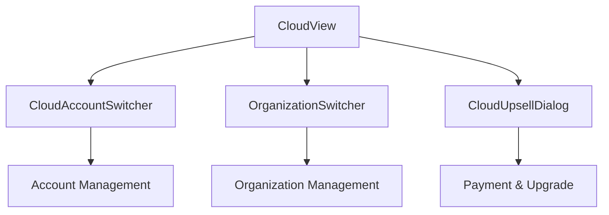
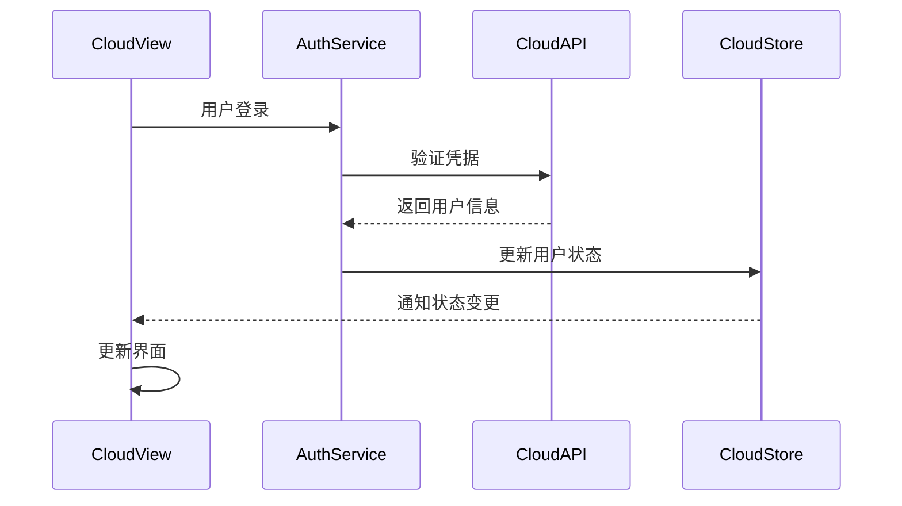

# Cloud 云服务组件

## 1. 模块概述

Cloud组件模块负责处理Kilocode的云服务相关功能，包括云账户管理、组织切换、云服务升级等核心业务逻辑。该模块是连接本地VSCode扩展与Kilocode云平台的重要桥梁。

### 核心功能

- 云账户认证和管理
- 组织/团队切换
- 云服务升级和付费管理
- 云端数据同步
- 用户权限和配额管理

### 业务价值

- 提供统一的云服务访问入口
- 支持多组织协作工作流
- 实现本地与云端的无缝集成
- 提供灵活的付费和升级机制

## 2. 组件列表

### 2.1 核心组件

| 组件名称             | 文件路径                 | 功能描述                         |
| -------------------- | ------------------------ | -------------------------------- |
| CloudView            | CloudView.tsx            | 云服务主视图，统一管理云相关功能 |
| CloudAccountSwitcher | CloudAccountSwitcher.tsx | 云账户切换器，支持多账户管理     |
| OrganizationSwitcher | OrganizationSwitcher.tsx | 组织切换器，支持多组织工作流     |
| CloudUpsellDialog    | CloudUpsellDialog.tsx    | 云服务升级对话框，处理付费升级   |

### 2.2 组件层次关系



## 3. 技术架构

### 3.1 设计模式

- **容器组件模式**: CloudView作为容器组件，管理子组件状态
- **复合组件模式**: 账户和组织切换器可独立使用
- **状态提升模式**: 云服务状态统一管理
- **错误边界模式**: 云服务异常统一处理

### 3.2 状态管理

```typescript
interface CloudState {
	currentUser: User | null
	currentOrganization: Organization | null
	organizations: Organization[]
	isAuthenticated: boolean
	subscription: Subscription | null
	loading: boolean
	error: string | null
}
```

### 3.3 数据流向



## 4. API文档

### 4.1 CloudView Props

```typescript
interface CloudViewProps {
	/** 初始显示的视图类型 */
	initialView?: "account" | "organization" | "billing"
	/** 是否显示升级提示 */
	showUpsell?: boolean
	/** 云服务配置 */
	config?: CloudConfig
	/** 状态变更回调 */
	onStateChange?: (state: CloudState) => void
	/** 错误处理回调 */
	onError?: (error: Error) => void
}
```

### 4.2 CloudAccountSwitcher Props

```typescript
interface CloudAccountSwitcherProps {
	/** 当前用户 */
	currentUser: User | null
	/** 可用账户列表 */
	accounts: User[]
	/** 账户切换回调 */
	onAccountSwitch: (user: User) => void
	/** 添加账户回调 */
	onAddAccount: () => void
	/** 是否显示加载状态 */
	loading?: boolean
}
```

### 4.3 OrganizationSwitcher Props

```typescript
interface OrganizationSwitcherProps {
	/** 当前组织 */
	currentOrganization: Organization | null
	/** 可用组织列表 */
	organizations: Organization[]
	/** 组织切换回调 */
	onOrganizationSwitch: (org: Organization) => void
	/** 创建组织回调 */
	onCreateOrganization: () => void
	/** 是否显示权限信息 */
	showPermissions?: boolean
}
```

## 5. 使用示例

### 5.1 基础使用

```tsx
import { CloudView } from "@/components/cloud/CloudView"

function App() {
	const handleStateChange = (state: CloudState) => {
		console.log("Cloud state changed:", state)
	}

	return <CloudView initialView="account" showUpsell={true} onStateChange={handleStateChange} />
}
```

### 5.2 账户切换器

```tsx
import { CloudAccountSwitcher } from "@/components/cloud/CloudAccountSwitcher"

function Header() {
	const { currentUser, accounts } = useCloudState()

	const handleAccountSwitch = async (user: User) => {
		await switchAccount(user.id)
		// 刷新相关数据
	}

	return (
		<CloudAccountSwitcher
			currentUser={currentUser}
			accounts={accounts}
			onAccountSwitch={handleAccountSwitch}
			onAddAccount={() => openAuthDialog()}
		/>
	)
}
```

### 5.3 组织管理

```tsx
import { OrganizationSwitcher } from "@/components/cloud/OrganizationSwitcher"

function Sidebar() {
	const { currentOrg, organizations } = useOrganizations()

	return (
		<OrganizationSwitcher
			currentOrganization={currentOrg}
			organizations={organizations}
			onOrganizationSwitch={switchOrganization}
			onCreateOrganization={() => openCreateOrgDialog()}
			showPermissions={true}
		/>
	)
}
```

## 6. 样式和主题

### 6.1 CSS类名规范

```css
/* 云服务主容器 */
.cloud-view {
	--cloud-primary-color: var(--vscode-button-background);
	--cloud-secondary-color: var(--vscode-button-secondaryBackground);
	--cloud-text-color: var(--vscode-foreground);
}

/* 账户切换器 */
.cloud-account-switcher {
	display: flex;
	align-items: center;
	gap: 8px;
}

/* 组织切换器 */
.cloud-org-switcher {
	min-width: 200px;
	position: relative;
}

/* 升级对话框 */
.cloud-upsell-dialog {
	max-width: 500px;
	padding: 24px;
}
```

### 6.2 主题变量

```typescript
const cloudTheme = {
	colors: {
		primary: "var(--vscode-button-background)",
		secondary: "var(--vscode-button-secondaryBackground)",
		success: "var(--vscode-testing-iconPassed)",
		warning: "var(--vscode-testing-iconQueued)",
		error: "var(--vscode-testing-iconFailed)",
	},
	spacing: {
		xs: "4px",
		sm: "8px",
		md: "16px",
		lg: "24px",
	},
}
```

## 7. 测试策略

### 7.1 单元测试

```typescript
// CloudView.spec.tsx
describe('CloudView', () => {
  it('should render account view by default', () => {
    render(<CloudView />);
    expect(screen.getByText('Account')).toBeInTheDocument();
  });

  it('should handle account switching', async () => {
    const onStateChange = jest.fn();
    render(<CloudView onStateChange={onStateChange} />);

    // 模拟账户切换
    fireEvent.click(screen.getByText('Switch Account'));
    await waitFor(() => {
      expect(onStateChange).toHaveBeenCalled();
    });
  });
});
```

### 7.2 集成测试

```typescript
// CloudIntegration.spec.tsx
describe("Cloud Integration", () => {
	it("should sync data after organization switch", async () => {
		const { result } = renderHook(() => useCloudState())

		act(() => {
			result.current.switchOrganization("org-123")
		})

		await waitFor(() => {
			expect(result.current.currentOrganization?.id).toBe("org-123")
		})
	})
})
```

## 8. 性能优化

### 8.1 React优化

```typescript
// 使用React.memo优化渲染
const CloudAccountSwitcher = React.memo(({
  currentUser,
  accounts,
  onAccountSwitch
}) => {
  // 使用useMemo缓存计算结果
  const sortedAccounts = useMemo(() =>
    accounts.sort((a, b) => a.name.localeCompare(b.name)),
    [accounts]
  );

  // 使用useCallback缓存回调函数
  const handleSwitch = useCallback((user: User) => {
    onAccountSwitch(user);
  }, [onAccountSwitch]);

  return (
    // 组件JSX
  );
});
```

### 8.2 数据缓存

```typescript
// 使用SWR进行数据缓存
function useOrganizations() {
	const { data, error, mutate } = useSWR("/api/organizations", fetcher, {
		revalidateOnFocus: false,
		dedupingInterval: 60000, // 1分钟内去重
	})

	return {
		organizations: data || [],
		loading: !error && !data,
		error,
		refresh: mutate,
	}
}
```

## 9. 可访问性

### 9.1 ARIA属性

```tsx
<button
  aria-label="Switch cloud account"
  aria-expanded={isOpen}
  aria-haspopup="listbox"
  role="combobox"
>
  {currentUser?.name}
</button>

<ul role="listbox" aria-label="Available accounts">
  {accounts.map(account => (
    <li
      key={account.id}
      role="option"
      aria-selected={account.id === currentUser?.id}
    >
      {account.name}
    </li>
  ))}
</ul>
```

### 9.2 键盘导航

```typescript
const handleKeyDown = (event: KeyboardEvent) => {
	switch (event.key) {
		case "ArrowDown":
			event.preventDefault()
			focusNextAccount()
			break
		case "ArrowUp":
			event.preventDefault()
			focusPreviousAccount()
			break
		case "Enter":
		case " ":
			event.preventDefault()
			selectFocusedAccount()
			break
		case "Escape":
			closeDropdown()
			break
	}
}
```

## 10. 国际化

### 10.1 文本资源

```json
{
	"cloud.account.switch": "Switch Account",
	"cloud.account.add": "Add Account",
	"cloud.organization.switch": "Switch Organization",
	"cloud.organization.create": "Create Organization",
	"cloud.upsell.title": "Upgrade to Pro",
	"cloud.upsell.description": "Unlock advanced features with Kilocode Pro",
	"cloud.error.auth": "Authentication failed",
	"cloud.error.network": "Network connection error"
}
```

### 10.2 使用示例

```tsx
import { useTranslation } from "react-i18next"

function CloudUpsellDialog() {
	const { t } = useTranslation()

	return (
		<Dialog>
			<DialogTitle>{t("cloud.upsell.title")}</DialogTitle>
			<DialogContent>{t("cloud.upsell.description")}</DialogContent>
		</Dialog>
	)
}
```

## 11. 错误处理

### 11.1 错误边界

```typescript
class CloudErrorBoundary extends React.Component {
  constructor(props) {
    super(props);
    this.state = { hasError: false, error: null };
  }

  static getDerivedStateFromError(error) {
    return { hasError: true, error };
  }

  componentDidCatch(error, errorInfo) {
    console.error('Cloud component error:', error, errorInfo);
    // 发送错误报告
    reportError(error, errorInfo);
  }

  render() {
    if (this.state.hasError) {
      return <CloudErrorFallback error={this.state.error} />;
    }

    return this.props.children;
  }
}
```

### 11.2 网络错误处理

```typescript
const handleCloudError = (error: Error) => {
	if (error.name === "NetworkError") {
		showNotification({
			type: "error",
			message: t("cloud.error.network"),
			action: {
				label: t("common.retry"),
				onClick: () => retryLastAction(),
			},
		})
	} else if (error.name === "AuthError") {
		redirectToLogin()
	} else {
		showNotification({
			type: "error",
			message: error.message,
		})
	}
}
```

## 12. 与其他模块的集成

### 12.1 与认证模块集成

```typescript
// 监听认证状态变化
useEffect(() => {
	const unsubscribe = authService.onAuthStateChange((user) => {
		if (user) {
			// 用户登录，加载云数据
			loadCloudData(user)
		} else {
			// 用户登出，清理云数据
			clearCloudData()
		}
	})

	return unsubscribe
}, [])
```

### 12.2 与设置模块集成

```typescript
// 同步云设置
const syncCloudSettings = async (settings: Settings) => {
	try {
		await cloudAPI.updateSettings(settings)
		showNotification({
			type: "success",
			message: t("settings.sync.success"),
		})
	} catch (error) {
		handleCloudError(error)
	}
}
```

## 13. 最佳实践

### 13.1 状态管理

- 使用Context API管理全局云状态
- 避免过度渲染，合理使用memo和callback
- 实现乐观更新提升用户体验

### 13.2 错误处理

- 提供友好的错误提示和恢复机制
- 实现自动重试和降级策略
- 记录详细的错误日志便于调试

### 13.3 性能优化

- 懒加载非关键云功能
- 缓存频繁访问的云数据
- 使用虚拟滚动处理大量组织列表

### 13.4 用户体验

- 提供清晰的加载状态指示
- 实现平滑的切换动画
- 支持离线模式和数据同步
