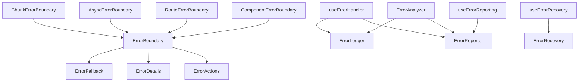
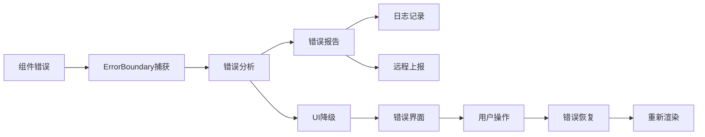

# Error Boundary 组件模块

## 1. 模块概述

Error Boundary 组件模块是 Kilocode 应用的错误处理核心，负责捕获和处理 React 组件树中的 JavaScript 错误，提供优雅的错误降级和用户友好的错误界面。该模块确保应用的稳定性和可靠性，防止单个组件的错误导致整个应用崩溃。

### 1.1 核心功能

- **错误捕获**: 捕获组件渲染、生命周期方法和构造函数中的错误
- **错误边界**: 防止错误向上传播，保护应用的其他部分
- **错误报告**: 自动收集和上报错误信息，便于问题追踪
- **降级UI**: 提供用户友好的错误界面和恢复选项
- **错误分析**: 提供详细的错误信息和调试工具

### 1.2 业务价值

- **提升用户体验**: 避免白屏和应用崩溃，提供友好的错误提示
- **增强应用稳定性**: 隔离错误影响范围，保证核心功能正常运行
- **便于问题诊断**: 自动收集错误信息，加速问题定位和修复
- **降低维护成本**: 减少用户投诉和支持工作量

## 2. 组件列表

### 2.1 核心组件

- **ErrorBoundary**: 主要的错误边界组件
- **ErrorFallback**: 默认的错误降级UI组件
- **ErrorDetails**: 错误详情展示组件
- **ErrorActions**: 错误恢复操作组件

### 2.2 专用错误边界

- **ChunkErrorBoundary**: 代码分割错误边界
- **AsyncErrorBoundary**: 异步操作错误边界
- **RouteErrorBoundary**: 路由级别错误边界
- **ComponentErrorBoundary**: 组件级别错误边界

### 2.3 Hook组件

- **useErrorHandler**: 错误处理Hook
- **useErrorRecovery**: 错误恢复Hook
- **useErrorReporting**: 错误报告Hook
- **useErrorBoundary**: 错误边界状态Hook

### 2.4 工具组件

- **ErrorLogger**: 错误日志记录器
- **ErrorReporter**: 错误报告器
- **ErrorAnalyzer**: 错误分析器
- **ErrorRecovery**: 错误恢复工具

### 2.5 组件层次关系



## 3. 技术架构

### 3.1 设计模式

- **错误边界模式**: 使用React Error Boundary捕获组件错误
- **降级模式**: 提供备用UI确保用户体验
- **观察者模式**: 错误事件的监听和处理
- **策略模式**: 不同类型错误的处理策略
- **工厂模式**: 错误处理器的创建和管理

### 3.2 状态管理

```typescript
interface ErrorBoundaryState {
	hasError: boolean
	error: Error | null
	errorInfo: React.ErrorInfo | null
	errorId: string
	retryCount: number
	isRecovering: boolean
}

interface ErrorContext {
	reportError: (error: Error, context?: string) => void
	clearError: () => void
	retryLastAction: () => void
	errorHistory: ErrorRecord[]
}
```

### 3.3 数据流



## 4. API文档

### 4.1 ErrorBoundary Props

```typescript
interface ErrorBoundaryProps {
	children: React.ReactNode
	fallback?: React.ComponentType<ErrorFallbackProps>
	onError?: (error: Error, errorInfo: React.ErrorInfo) => void
	isolate?: boolean
	level?: "page" | "section" | "component"
	enableRecovery?: boolean
	maxRetries?: number
	resetKeys?: Array<string | number>
	resetOnPropsChange?: boolean
}
```

### 4.2 ErrorFallback Props

```typescript
interface ErrorFallbackProps {
	error: Error
	errorInfo?: React.ErrorInfo
	resetError: () => void
	retryCount: number
	maxRetries: number
	level: "page" | "section" | "component"
}
```

### 4.3 useErrorHandler Hook

```typescript
interface UseErrorHandlerReturn {
	reportError: (error: Error, context?: string) => void
	clearError: () => void
	error: Error | null
	hasError: boolean
	isRecovering: boolean
	retry: () => void
}

const useErrorHandler: (options?: {
	onError?: (error: Error) => void
	enableRecovery?: boolean
	maxRetries?: number
}) => UseErrorHandlerReturn
```

### 4.4 useErrorBoundary Hook

```typescript
interface UseErrorBoundaryReturn {
	showBoundary: (error: Error) => void
	resetBoundary: () => void
	capturedError: Error | null
}

const useErrorBoundary: () => UseErrorBoundaryReturn
```

## 5. 使用示例

### 5.1 基本错误边界

```typescript
import { ErrorBoundary, ErrorFallback } from '@/components/error-boundary';

// 基本使用
const App: React.FC = () => {
  return (
    <ErrorBoundary
      fallback={ErrorFallback}
      onError={(error, errorInfo) => {
        console.error('Application error:', error, errorInfo);
      }}
    >
      <MainContent />
    </ErrorBoundary>
  );
};

// 自定义错误界面
const CustomErrorFallback: React.FC<ErrorFallbackProps> = ({
  error,
  resetError,
  retryCount
}) => {
  return (
    <div className="error-fallback">
      <h2>出现了一些问题</h2>
      <p>错误信息: {error.message}</p>
      <button onClick={resetError}>
        重试 ({retryCount}/3)
      </button>
    </div>
  );
};
```

### 5.2 路由级错误边界

```typescript
import { RouteErrorBoundary } from '@/components/error-boundary';

const AppRouter: React.FC = () => {
  return (
    <Router>
      <Routes>
        <Route path="/" element={
          <RouteErrorBoundary level="page">
            <HomePage />
          </RouteErrorBoundary>
        } />
        <Route path="/dashboard" element={
          <RouteErrorBoundary level="page">
            <DashboardPage />
          </RouteErrorBoundary>
        } />
      </Routes>
    </Router>
  );
};
```

### 5.3 异步错误处理

```typescript
import { useErrorHandler } from '@/components/error-boundary';

const DataComponent: React.FC = () => {
  const { reportError, hasError, retry } = useErrorHandler();
  const [data, setData] = useState(null);
  const [loading, setLoading] = useState(false);

  const fetchData = async () => {
    try {
      setLoading(true);
      const response = await api.getData();
      setData(response.data);
    } catch (error) {
      reportError(error as Error, 'data-fetch');
    } finally {
      setLoading(false);
    }
  };

  useEffect(() => {
    fetchData();
  }, []);

  if (hasError) {
    return (
      <div className="error-state">
        <p>数据加载失败</p>
        <button onClick={retry}>重试</button>
      </div>
    );
  }

  return (
    <div>
      {loading ? <Loading /> : <DataDisplay data={data} />}
    </div>
  );
};
```

### 5.4 组件级错误边界

```typescript
import { ComponentErrorBoundary } from '@/components/error-boundary';

const FeatureSection: React.FC = () => {
  return (
    <div className="feature-section">
      <ComponentErrorBoundary isolate>
        <FeatureA />
      </ComponentErrorBoundary>

      <ComponentErrorBoundary isolate>
        <FeatureB />
      </ComponentErrorBoundary>

      <ComponentErrorBoundary isolate>
        <FeatureC />
      </ComponentErrorBoundary>
    </div>
  );
};
```

## 6. 样式和主题

### 6.1 CSS类名规范

```css
/* 错误边界容器 */
.error-boundary {
	/* 基础样式 */
}

.error-boundary--page {
	/* 页面级错误边界 */
}

.error-boundary--section {
	/* 区域级错误边界 */
}

.error-boundary--component {
	/* 组件级错误边界 */
}

/* 错误降级界面 */
.error-fallback {
	display: flex;
	flex-direction: column;
	align-items: center;
	justify-content: center;
	padding: var(--spacing-xl);
	text-align: center;
}

.error-fallback__icon {
	font-size: var(--font-size-4xl);
	color: var(--color-error);
	margin-bottom: var(--spacing-md);
}

.error-fallback__title {
	font-size: var(--font-size-xl);
	font-weight: var(--font-weight-semibold);
	color: var(--color-text-primary);
	margin-bottom: var(--spacing-sm);
}

.error-fallback__message {
	font-size: var(--font-size-md);
	color: var(--color-text-secondary);
	margin-bottom: var(--spacing-lg);
	max-width: 400px;
}

.error-fallback__actions {
	display: flex;
	gap: var(--spacing-md);
	flex-wrap: wrap;
	justify-content: center;
}

/* 错误详情 */
.error-details {
	margin-top: var(--spacing-lg);
	padding: var(--spacing-md);
	background: var(--color-background-secondary);
	border-radius: var(--border-radius-md);
	border: 1px solid var(--color-border);
}

.error-details__summary {
	cursor: pointer;
	font-weight: var(--font-weight-medium);
	color: var(--color-text-primary);
}

.error-details__content {
	margin-top: var(--spacing-sm);
	font-family: var(--font-family-mono);
	font-size: var(--font-size-sm);
	color: var(--color-text-secondary);
	white-space: pre-wrap;
	overflow-x: auto;
}

/* 错误状态指示器 */
.error-indicator {
	display: inline-flex;
	align-items: center;
	gap: var(--spacing-xs);
	padding: var(--spacing-xs) var(--spacing-sm);
	background: var(--color-error-light);
	color: var(--color-error-dark);
	border-radius: var(--border-radius-sm);
	font-size: var(--font-size-sm);
}

.error-indicator__icon {
	width: 16px;
	height: 16px;
}
```

### 6.2 主题变量

```css
:root {
	/* 错误相关颜色 */
	--color-error: #ef4444;
	--color-error-light: #fef2f2;
	--color-error-dark: #dc2626;

	/* 警告相关颜色 */
	--color-warning: #f59e0b;
	--color-warning-light: #fffbeb;
	--color-warning-dark: #d97706;

	/* 错误边界特定变量 */
	--error-boundary-bg: var(--color-background);
	--error-boundary-border: var(--color-border);
	--error-fallback-max-width: 600px;
	--error-details-max-height: 300px;
}

/* 暗色主题适配 */
[data-theme="dark"] {
	--color-error-light: #450a0a;
	--color-error-dark: #fca5a5;
	--color-warning-light: #451a03;
	--color-warning-dark: #fbbf24;
}
```

### 6.3 响应式设计

```css
/* 移动端适配 */
@media (max-width: 768px) {
	.error-fallback {
		padding: var(--spacing-lg);
	}

	.error-fallback__title {
		font-size: var(--font-size-lg);
	}

	.error-fallback__actions {
		flex-direction: column;
		width: 100%;
	}

	.error-fallback__actions button {
		width: 100%;
	}

	.error-details__content {
		font-size: var(--font-size-xs);
	}
}

/* 平板适配 */
@media (min-width: 769px) and (max-width: 1024px) {
	.error-fallback {
		padding: var(--spacing-xl);
	}
}
```

## 7. 测试策略

### 7.1 单元测试

```typescript
import { render, screen } from '@testing-library/react';
import { ErrorBoundary, ErrorFallback } from '../ErrorBoundary';

// 测试错误捕获
describe('ErrorBoundary', () => {
  const ThrowError = ({ shouldThrow }: { shouldThrow: boolean }) => {
    if (shouldThrow) {
      throw new Error('Test error');
    }
    return <div>No error</div>;
  };

  it('should catch and display error', () => {
    const onError = jest.fn();

    render(
      <ErrorBoundary fallback={ErrorFallback} onError={onError}>
        <ThrowError shouldThrow={true} />
      </ErrorBoundary>
    );

    expect(screen.getByText(/出现了一些问题/)).toBeInTheDocument();
    expect(onError).toHaveBeenCalledWith(
      expect.any(Error),
      expect.any(Object)
    );
  });

  it('should reset error on retry', () => {
    const { rerender } = render(
      <ErrorBoundary fallback={ErrorFallback}>
        <ThrowError shouldThrow={true} />
      </ErrorBoundary>
    );

    const retryButton = screen.getByText(/重试/);
    fireEvent.click(retryButton);

    rerender(
      <ErrorBoundary fallback={ErrorFallback}>
        <ThrowError shouldThrow={false} />
      </ErrorBoundary>
    );

    expect(screen.getByText('No error')).toBeInTheDocument();
  });
});
```

### 7.2 集成测试

```typescript
import { renderHook, act } from "@testing-library/react"
import { useErrorHandler } from "../hooks/useErrorHandler"

describe("useErrorHandler", () => {
	it("should handle async errors", async () => {
		const { result } = renderHook(() => useErrorHandler())

		const testError = new Error("Async error")

		act(() => {
			result.current.reportError(testError)
		})

		expect(result.current.hasError).toBe(true)
		expect(result.current.error).toBe(testError)

		act(() => {
			result.current.clearError()
		})

		expect(result.current.hasError).toBe(false)
		expect(result.current.error).toBe(null)
	})
})
```

### 7.3 E2E测试

```typescript
// cypress/integration/error-boundary.spec.ts
describe("Error Boundary E2E", () => {
	it("should handle application errors gracefully", () => {
		cy.visit("/test-error-page")

		// 触发错误
		cy.get('[data-testid="trigger-error"]').click()

		// 验证错误界面显示
		cy.contains("出现了一些问题").should("be.visible")
		cy.get('[data-testid="retry-button"]').should("be.visible")

		// 测试重试功能
		cy.get('[data-testid="retry-button"]').click()
		cy.contains("No error").should("be.visible")
	})

	it("should report errors to analytics", () => {
		cy.intercept("POST", "/api/analytics/error", { statusCode: 200 }).as("errorReport")

		cy.visit("/test-error-page")
		cy.get('[data-testid="trigger-error"]').click()

		cy.wait("@errorReport").then((interception) => {
			expect(interception.request.body).to.have.property("error")
			expect(interception.request.body).to.have.property("timestamp")
		})
	})
})
```

## 8. 性能优化

### 8.1 错误边界优化

```typescript
// 使用React.memo优化错误边界组件
export const OptimizedErrorBoundary = React.memo(
  class extends React.Component<ErrorBoundaryProps, ErrorBoundaryState> {
    private retryTimeoutId: number | null = null;
    private errorReportQueue: Error[] = [];

    constructor(props: ErrorBoundaryProps) {
      super(props);
      this.state = {
        hasError: false,
        error: null,
        errorInfo: null,
        errorId: '',
        retryCount: 0,
        isRecovering: false,
      };
    }

    static getDerivedStateFromError(error: Error): Partial<ErrorBoundaryState> {
      return {
        hasError: true,
        error,
        errorId: generateErrorId(),
      };
    }

    componentDidCatch(error: Error, errorInfo: React.ErrorInfo) {
      this.setState({ errorInfo });

      // 批量处理错误报告
      this.queueErrorReport(error, errorInfo);

      // 调用外部错误处理器
      this.props.onError?.(error, errorInfo);
    }

    private queueErrorReport = (error: Error, errorInfo: React.ErrorInfo) => {
      this.errorReportQueue.push(error);

      // 防抖处理，避免频繁报告
      if (this.retryTimeoutId) {
        clearTimeout(this.retryTimeoutId);
      }

      this.retryTimeoutId = window.setTimeout(() => {
        this.flushErrorReports();
      }, 1000);
    };

    private flushErrorReports = () => {
      if (this.errorReportQueue.length > 0) {
        // 批量发送错误报告
        errorReporter.reportBatch(this.errorReportQueue);
        this.errorReportQueue = [];
      }
    };

    componentWillUnmount() {
      if (this.retryTimeoutId) {
        clearTimeout(this.retryTimeoutId);
      }
      this.flushErrorReports();
    }

    render() {
      if (this.state.hasError) {
        const FallbackComponent = this.props.fallback || ErrorFallback;
        return (
          <FallbackComponent
            error={this.state.error!}
            errorInfo={this.state.errorInfo}
            resetError={this.resetError}
            retryCount={this.state.retryCount}
            maxRetries={this.props.maxRetries || 3}
            level={this.props.level || 'component'}
          />
        );
      }

      return this.props.children;
    }

    private resetError = () => {
      this.setState(prevState => ({
        hasError: false,
        error: null,
        errorInfo: null,
        errorId: '',
        retryCount: prevState.retryCount + 1,
        isRecovering: true,
      }));

      // 延迟重置恢复状态
      setTimeout(() => {
        this.setState({ isRecovering: false });
      }, 100);
    };
  }
);
```

### 8.2 错误报告优化

```typescript
class ErrorReporter {
	private reportQueue: ErrorReport[] = []
	private isReporting = false
	private maxQueueSize = 50
	private reportInterval = 5000 // 5秒批量发送一次

	constructor() {
		// 定期发送错误报告
		setInterval(() => {
			this.flushReports()
		}, this.reportInterval)

		// 页面卸载时发送剩余报告
		window.addEventListener("beforeunload", () => {
			this.flushReports(true)
		})
	}

	report(error: Error, context?: string) {
		const report: ErrorReport = {
			message: error.message,
			stack: error.stack,
			context,
			timestamp: Date.now(),
			url: window.location.href,
			userAgent: navigator.userAgent,
		}

		this.reportQueue.push(report)

		// 队列满时立即发送
		if (this.reportQueue.length >= this.maxQueueSize) {
			this.flushReports()
		}
	}

	reportBatch(errors: Error[]) {
		errors.forEach((error) => this.report(error))
	}

	private async flushReports(immediate = false) {
		if (this.isReporting || this.reportQueue.length === 0) {
			return
		}

		this.isReporting = true
		const reports = [...this.reportQueue]
		this.reportQueue = []

		try {
			if (immediate && navigator.sendBeacon) {
				// 使用sendBeacon确保数据发送
				navigator.sendBeacon("/api/errors", JSON.stringify({ reports }))
			} else {
				await fetch("/api/errors", {
					method: "POST",
					headers: { "Content-Type": "application/json" },
					body: JSON.stringify({ reports }),
				})
			}
		} catch (error) {
			console.error("Failed to report errors:", error)
			// 重新加入队列，但限制重试次数
			if (!immediate) {
				this.reportQueue.unshift(...reports.slice(0, 10))
			}
		} finally {
			this.isReporting = false
		}
	}
}

export const errorReporter = new ErrorReporter()
```

### 8.3 内存管理

```typescript
// 错误信息缓存管理
class ErrorCache {
	private cache = new Map<string, CachedError>()
	private maxSize = 100
	private ttl = 5 * 60 * 1000 // 5分钟

	set(key: string, error: Error) {
		// 清理过期缓存
		this.cleanup()

		// 限制缓存大小
		if (this.cache.size >= this.maxSize) {
			const firstKey = this.cache.keys().next().value
			this.cache.delete(firstKey)
		}

		this.cache.set(key, {
			error,
			timestamp: Date.now(),
		})
	}

	get(key: string): Error | null {
		const cached = this.cache.get(key)
		if (!cached) return null

		// 检查是否过期
		if (Date.now() - cached.timestamp > this.ttl) {
			this.cache.delete(key)
			return null
		}

		return cached.error
	}

	private cleanup() {
		const now = Date.now()
		for (const [key, cached] of this.cache.entries()) {
			if (now - cached.timestamp > this.ttl) {
				this.cache.delete(key)
			}
		}
	}

	clear() {
		this.cache.clear()
	}
}

interface CachedError {
	error: Error
	timestamp: number
}

export const errorCache = new ErrorCache()
```

## 9. 可访问性

### 9.1 ARIA属性支持

```typescript
export const AccessibleErrorFallback: React.FC<ErrorFallbackProps> = ({
  error,
  resetError,
  retryCount,
  maxRetries,
}) => {
  const errorId = useId();
  const descriptionId = useId();

  return (
    <div
      role="alert"
      aria-labelledby={errorId}
      aria-describedby={descriptionId}
      className="error-fallback"
    >
      <div className="error-fallback__icon" aria-hidden="true">
        ⚠️
      </div>

      <h2 id={errorId} className="error-fallback__title">
        出现了一些问题
      </h2>

      <p id={descriptionId} className="error-fallback__message">
        应用遇到了意外错误，请尝试刷新页面或联系技术支持。
      </p>

      <div className="error-fallback__actions">
        <button
          onClick={resetError}
          disabled={retryCount >= maxRetries}
          aria-describedby="retry-description"
        >
          重试 ({retryCount}/{maxRetries})
        </button>

        <button
          onClick={() => window.location.reload()}
          aria-label="刷新整个页面"
        >
          刷新页面
        </button>
      </div>

      <div id="retry-description" className="sr-only">
        {retryCount >= maxRetries
          ? '已达到最大重试次数，请刷新页面'
          : '点击重试按钮尝试恢复应用'
        }
      </div>
    </div>
  );
};
```

### 9.2 键盘导航支持

```typescript
export const useErrorFallbackKeyboard = (resetError: () => void, onRefresh: () => void) => {
	useEffect(() => {
		const handleKeyDown = (event: KeyboardEvent) => {
			// Escape键重置错误
			if (event.key === "Escape") {
				resetError()
			}

			// F5或Ctrl+R刷新页面
			if (event.key === "F5" || (event.ctrlKey && event.key === "r")) {
				event.preventDefault()
				onRefresh()
			}

			// Enter键在聚焦按钮时触发点击
			if (event.key === "Enter" && event.target instanceof HTMLButtonElement) {
				event.target.click()
			}
		}

		document.addEventListener("keydown", handleKeyDown)
		return () => document.removeEventListener("keydown", handleKeyDown)
	}, [resetError, onRefresh])
}
```

### 9.3 屏幕阅读器支持

```typescript
export const ErrorAnnouncement: React.FC<{
  error: Error;
  level: 'page' | 'section' | 'component';
}> = ({ error, level }) => {
  const [announcement, setAnnouncement] = useState('');

  useEffect(() => {
    const levelText = {
      page: '页面',
      section: '区域',
      component: '组件',
    }[level];

    setAnnouncement(`${levelText}发生错误: ${error.message}`);

    // 清除公告以允许重复播报
    const timer = setTimeout(() => setAnnouncement(''), 1000);
    return () => clearTimeout(timer);
  }, [error, level]);

  return (
    <div
      aria-live="assertive"
      aria-atomic="true"
      className="sr-only"
    >
      {announcement}
    </div>
  );
};
```

## 10. 国际化

### 10.1 多语言支持

```typescript
// i18n/error-boundary.ts
export const errorBoundaryTranslations = {
  'zh-CN': {
    errorBoundary: {
      title: '出现了一些问题',
      message: '应用遇到了意外错误，请尝试刷新页面或联系技术支持。',
      retry: '重试',
      refresh: '刷新页面',
      details: '错误详情',
      reportError: '报告错误',
      maxRetriesReached: '已达到最大重试次数',
      errorReported: '错误已报告',
      levels: {
        page: '页面错误',
        section: '区域错误',
        component: '组件错误',
      },
    },
  },
  'en-US': {
    errorBoundary: {
      title: 'Something went wrong',
      message: 'The application encountered an unexpected error. Please try refreshing the page or contact technical support.',
      retry: 'Retry',
      refresh: 'Refresh Page',
      details: 'Error Details',
      reportError: 'Report Error',
      maxRetriesReached: 'Maximum retry attempts reached',
      errorReported: 'Error reported',
      levels: {
        page: 'Page Error',
        section: 'Section Error',
        component: 'Component Error',
      },
    },
  },
};

// 使用国际化的错误界面
export const LocalizedErrorFallback: React.FC<ErrorFallbackProps> = ({
  error,
  resetError,
  retryCount,
  maxRetries,
  level,
}) => {
  const { t } = useTranslation('errorBoundary');

  return (
    <div className="error-fallback">
      <h2>{t('errorBoundary.title')}</h2>
      <p>{t('errorBoundary.message')}</p>

      <div className="error-fallback__actions">
        <button
          onClick={resetError}
          disabled={retryCount >= maxRetries}
        >
          {t('errorBoundary.retry')} ({retryCount}/{maxRetries})
        </button>

        <button onClick={() => window.location.reload()}>
          {t('errorBoundary.refresh')}
        </button>
      </div>

      {retryCount >= maxRetries && (
        <p className="error-warning">
          {t('errorBoundary.maxRetriesReached')}
        </p>
      )}

      <details className="error-details">
        <summary>{t('errorBoundary.details')}</summary>
        <pre>{error.stack}</pre>
      </details>
    </div>
  );
};
```

### 10.2 错误消息本地化

```typescript
// 错误消息映射
const errorMessageMap = {
	"zh-CN": {
		ChunkLoadError: "代码块加载失败，请刷新页面重试",
		NetworkError: "网络连接异常，请检查网络设置",
		TimeoutError: "请求超时，请稍后重试",
		AuthenticationError: "身份验证失败，请重新登录",
		PermissionError: "权限不足，请联系管理员",
		ValidationError: "数据验证失败，请检查输入内容",
		UnknownError: "未知错误，请联系技术支持",
	},
	"en-US": {
		ChunkLoadError: "Failed to load code chunk, please refresh the page",
		NetworkError: "Network connection error, please check your network settings",
		TimeoutError: "Request timeout, please try again later",
		AuthenticationError: "Authentication failed, please log in again",
		PermissionError: "Insufficient permissions, please contact administrator",
		ValidationError: "Data validation failed, please check your input",
		UnknownError: "Unknown error, please contact technical support",
	},
}

export const getLocalizedErrorMessage = (error: Error, language: string = "zh-CN"): string => {
	const messages = errorMessageMap[language as keyof typeof errorMessageMap]

	// 尝试匹配错误类型
	for (const [errorType, message] of Object.entries(messages)) {
		if (error.name === errorType || error.message.includes(errorType)) {
			return message
		}
	}

	// 返回通用错误消息
	return messages.UnknownError || error.message
}
```

## 11. 错误处理策略

### 11.1 错误分类和处理

```typescript
enum ErrorSeverity {
	LOW = "low",
	MEDIUM = "medium",
	HIGH = "high",
	CRITICAL = "critical",
}

enum ErrorCategory {
	NETWORK = "network",
	CHUNK_LOAD = "chunk_load",
	RUNTIME = "runtime",
	VALIDATION = "validation",
	AUTHENTICATION = "authentication",
	PERMISSION = "permission",
}

interface ErrorClassification {
	category: ErrorCategory
	severity: ErrorSeverity
	recoverable: boolean
	userMessage: string
	technicalMessage: string
}

class ErrorClassifier {
	classify(error: Error): ErrorClassification {
		// 网络错误
		if (this.isNetworkError(error)) {
			return {
				category: ErrorCategory.NETWORK,
				severity: ErrorSeverity.MEDIUM,
				recoverable: true,
				userMessage: "网络连接异常，请检查网络设置后重试",
				technicalMessage: error.message,
			}
		}

		// 代码分割错误
		if (this.isChunkLoadError(error)) {
			return {
				category: ErrorCategory.CHUNK_LOAD,
				severity: ErrorSeverity.HIGH,
				recoverable: true,
				userMessage: "页面资源加载失败，请刷新页面重试",
				technicalMessage: error.message,
			}
		}

		// 运行时错误
		if (this.isRuntimeError(error)) {
			return {
				category: ErrorCategory.RUNTIME,
				severity: ErrorSeverity.HIGH,
				recoverable: false,
				userMessage: "应用遇到了意外错误，请联系技术支持",
				technicalMessage: error.message,
			}
		}

		// 默认分类
		return {
			category: ErrorCategory.RUNTIME,
			severity: ErrorSeverity.MEDIUM,
			recoverable: true,
			userMessage: "出现了一些问题，请重试",
			technicalMessage: error.message,
		}
	}

	private isNetworkError(error: Error): boolean {
		return error.message.includes("fetch") || error.message.includes("network") || error.name === "NetworkError"
	}

	private isChunkLoadError(error: Error): boolean {
		return error.message.includes("Loading chunk") || error.message.includes("ChunkLoadError")
	}

	private isRuntimeError(error: Error): boolean {
		return error.name === "TypeError" || error.name === "ReferenceError" || error.name === "RangeError"
	}
}

export const errorClassifier = new ErrorClassifier()
```

### 11.2 恢复策略

```typescript
interface RecoveryStrategy {
	canRecover(error: Error): boolean
	recover(error: Error): Promise<boolean>
	getRecoveryActions(error: Error): RecoveryAction[]
}

interface RecoveryAction {
	label: string
	action: () => Promise<void>
	primary?: boolean
}

class ChunkLoadRecoveryStrategy implements RecoveryStrategy {
	canRecover(error: Error): boolean {
		return errorClassifier.classify(error).category === ErrorCategory.CHUNK_LOAD
	}

	async recover(error: Error): Promise<boolean> {
		try {
			// 清除模块缓存
			if ("webpackChunkName" in error) {
				delete window.__webpack_require__.cache[error.webpackChunkName as string]
			}

			// 重新加载页面
			window.location.reload()
			return true
		} catch {
			return false
		}
	}

	getRecoveryActions(error: Error): RecoveryAction[] {
		return [
			{
				label: "刷新页面",
				action: async () => window.location.reload(),
				primary: true,
			},
			{
				label: "清除缓存并刷新",
				action: async () => {
					if ("caches" in window) {
						const cacheNames = await caches.keys()
						await Promise.all(cacheNames.map((name) => caches.delete(name)))
					}
					window.location.reload()
				},
			},
		]
	}
}

class NetworkRecoveryStrategy implements RecoveryStrategy {
	canRecover(error: Error): boolean {
		return errorClassifier.classify(error).category === ErrorCategory.NETWORK
	}

	async recover(error: Error): Promise<boolean> {
		// 检查网络连接
		if (!navigator.onLine) {
			return false
		}

		// 尝试重新发送请求
		try {
			const response = await fetch("/api/health")
			return response.ok
		} catch {
			return false
		}
	}

	getRecoveryActions(error: Error): RecoveryAction[] {
		return [
			{
				label: "重试",
				action: async () => {
					// 触发重试逻辑
					window.dispatchEvent(new CustomEvent("retry-last-action"))
				},
				primary: true,
			},
			{
				label: "检查网络",
				action: async () => {
					// 打开网络设置页面（如果支持）
					if ("navigator" in window && "connection" in navigator) {
						console.log("Network info:", (navigator as any).connection)
					}
				},
			},
		]
	}
}

export class RecoveryManager {
	private strategies: RecoveryStrategy[] = [new ChunkLoadRecoveryStrategy(), new NetworkRecoveryStrategy()]

	async attemptRecovery(error: Error): Promise<boolean> {
		for (const strategy of this.strategies) {
			if (strategy.canRecover(error)) {
				const success = await strategy.recover(error)
				if (success) {
					return true
				}
			}
		}
		return false
	}

	getRecoveryActions(error: Error): RecoveryAction[] {
		for (const strategy of this.strategies) {
			if (strategy.canRecover(error)) {
				return strategy.getRecoveryActions(error)
			}
		}

		// 默认恢复操作
		return [
			{
				label: "刷新页面",
				action: async () => window.location.reload(),
				primary: true,
			},
		]
	}
}

export const recoveryManager = new RecoveryManager()
```

## 12. 集成与最佳实践

### 12.1 与监控系统集成

```typescript
// 与Sentry集成
import * as Sentry from '@sentry/react';

export const SentryErrorBoundary = Sentry.withErrorBoundary(
  ({ children }: { children: React.ReactNode }) => children,
  {
    fallback: ({ error, resetError }) => (
      <ErrorFallback
        error={error}
        resetError={resetError}
        retryCount={0}
        maxRetries={3}
        level="component"
      />
    ),
    beforeCapture: (scope, error, errorInfo) => {
      scope.setTag('errorBoundary', true);
      scope.setContext('errorInfo', errorInfo);
      scope.setLevel('error');
    },
  }
);

// 与分析系统集成
export const AnalyticsErrorBoundary: React.FC<{
  children: React.ReactNode;
  componentName: string;
}> = ({ children, componentName }) => {
  const handleError = useCallback((error: Error, errorInfo: React.ErrorInfo) => {
    // 发送错误分析数据
    analytics.track('component_error', {
      component: componentName,
      error: error.message,
      stack: error.stack,
      componentStack: errorInfo.componentStack,
      timestamp: Date.now(),
    });
  }, [componentName]);

  return (
    <ErrorBoundary onError={handleError}>
      {children}
    </ErrorBoundary>
  );
};
```

### 12.2 开发工具集成

```typescript
// React DevTools集成
export const DevToolsErrorBoundary: React.FC<{
  children: React.ReactNode;
}> = ({ children }) => {
  const [errors, setErrors] = useState<Error[]>([]);

  const handleError = useCallback((error: Error) => {
    setErrors(prev => [...prev, error]);

    // 在开发模式下显示详细错误信息
    if (process.env.NODE_ENV === 'development') {
      console.group('🚨 Error Boundary Caught Error');
      console.error('Error:', error);
      console.error('Stack:', error.stack);
      console.groupEnd();
    }
  }, []);

  // 在React DevTools中显示错误信息
  useEffect(() => {
    if (process.env.NODE_ENV === 'development' && errors.length > 0) {
      (window as any).__REACT_DEVTOOLS_GLOBAL_HOOK__?.onCommitFiberRoot?.(
        null,
        { errors },
        null
      );
    }
  }, [errors]);

  return (
    <ErrorBoundary onError={handleError}>
      {children}
    </ErrorBoundary>
  );
};
```

### 12.3 最佳实践指南

```typescript
// 1. 错误边界层次化部署
export const AppWithErrorBoundaries: React.FC = () => {
  return (
    <ErrorBoundary level="page" fallback={PageErrorFallback}>
      <Header />

      <main>
        <ErrorBoundary level="section" fallback={SectionErrorFallback}>
          <Sidebar />
        </ErrorBoundary>

        <ErrorBoundary level="section" fallback={SectionErrorFallback}>
          <Content>
            <ErrorBoundary level="component" isolate>
              <FeatureA />
            </ErrorBoundary>

            <ErrorBoundary level="component" isolate>
              <FeatureB />
            </ErrorBoundary>
          </Content>
        </ErrorBoundary>
      </main>

      <Footer />
    </ErrorBoundary>
  );
};

// 2. 错误边界配置最佳实践
export const createErrorBoundaryConfig = (
  level: 'page' | 'section' | 'component'
) => {
  const configs = {
    page: {
      maxRetries: 1,
      enableRecovery: true,
      isolate: false,
      fallback: PageErrorFallback,
    },
    section: {
      maxRetries: 2,
      enableRecovery: true,
      isolate: true,
      fallback: SectionErrorFallback,
    },
    component: {
      maxRetries: 3,
      enableRecovery: false,
      isolate: true,
      fallback: ComponentErrorFallback,
    },
  };

  return configs[level];
};

// 3. 错误处理Hook最佳实践
export const useRobustAsyncOperation = <T>(
  operation: () => Promise<T>,
  options?: {
    retries?: number;
    retryDelay?: number;
    onError?: (error: Error) => void;
  }
) => {
  const { reportError } = useErrorHandler();
  const [state, setState] = useState<{
    data: T | null;
    loading: boolean;
    error: Error | null;
  }>({
    data: null,
    loading: false,
    error: null,
  });

  const execute = useCallback(async () => {
    setState(prev => ({ ...prev, loading: true, error: null }));

    let lastError: Error;
    const maxRetries = options?.retries ?? 3;

    for (let attempt = 0; attempt <= maxRetries; attempt++) {
      try {
        const result = await operation();
        setState({ data: result, loading: false, error: null });
        return result;
      } catch (error) {
        lastError = error as Error;

        if (attempt < maxRetries) {
          // 等待后重试
          await new Promise(resolve =>
            setTimeout(resolve, options?.retryDelay ?? 1000 * Math.pow(2, attempt))
          );
        }
      }
    }

    // 所有重试都失败
    setState({ data: null, loading: false, error: lastError! });
    reportError(lastError!, 'async-operation');
    options?.onError?.(lastError!);

    throw lastError!;
  }, [operation, options, reportError]);

  return { ...state, execute };
};
```

## 13. 故障排除

### 13.1 常见问题诊断

```typescript
// 错误诊断工具
export class ErrorDiagnostics {
	static diagnose(error: Error): DiagnosticResult {
		const checks = [
			this.checkChunkLoadError,
			this.checkNetworkError,
			this.checkMemoryError,
			this.checkPermissionError,
		]

		for (const check of checks) {
			const result = check(error)
			if (result.matches) {
				return result
			}
		}

		return {
			matches: true,
			category: "unknown",
			severity: "medium",
			suggestions: ["请联系技术支持并提供错误详情"],
		}
	}

	private static checkChunkLoadError(error: Error): DiagnosticResult {
		if (error.message.includes("Loading chunk")) {
			return {
				matches: true,
				category: "chunk_load",
				severity: "high",
				suggestions: ["刷新页面重新加载资源", "清除浏览器缓存", "检查网络连接", "尝试使用无痕模式"],
			}
		}
		return { matches: false }
	}

	private static checkNetworkError(error: Error): DiagnosticResult {
		if (error.message.includes("fetch") || error.name === "NetworkError") {
			return {
				matches: true,
				category: "network",
				severity: "medium",
				suggestions: ["检查网络连接", "尝试刷新页面", "检查防火墙设置", "联系网络管理员"],
			}
		}
		return { matches: false }
	}

	private static checkMemoryError(error: Error): DiagnosticResult {
		if (error.message.includes("out of memory") || error.name === "RangeError") {
			return {
				matches: true,
				category: "memory",
				severity: "critical",
				suggestions: ["关闭其他浏览器标签页", "重启浏览器", "清理浏览器缓存", "升级设备内存"],
			}
		}
		return { matches: false }
	}

	private static checkPermissionError(error: Error): DiagnosticResult {
		if (error.message.includes("permission") || error.message.includes("unauthorized")) {
			return {
				matches: true,
				category: "permission",
				severity: "high",
				suggestions: ["重新登录账户", "检查用户权限", "联系管理员", "清除登录状态重新认证"],
			}
		}
		return { matches: false }
	}
}

interface DiagnosticResult {
	matches: boolean
	category?: string
	severity?: string
	suggestions?: string[]
}
```

### 13.2 调试工具

```typescript
// 错误调试面板
export const ErrorDebugPanel: React.FC = () => {
  const [errors, setErrors] = useState<DebugError[]>([]);
  const [filter, setFilter] = useState<string>('all');

  useEffect(() => {
    const handleError = (event: ErrorEvent) => {
      const debugError: DebugError = {
        id: generateId(),
        message: event.error?.message || event.message,
        stack: event.error?.stack,
        timestamp: Date.now(),
        source: event.filename,
        line: event.lineno,
        column: event.colno,
        type: 'javascript',
      };

      setErrors(prev => [debugError, ...prev].slice(0, 100));
    };

    const handleUnhandledRejection = (event: PromiseRejectionEvent) => {
      const debugError: DebugError = {
        id: generateId(),
        message: event.reason?.message || String(event.reason),
        stack: event.reason?.stack,
        timestamp: Date.now(),
        type: 'promise',
      };

      setErrors(prev => [debugError, ...prev].slice(0, 100));
    };

    window.addEventListener('error', handleError);
    window.addEventListener('unhandledrejection', handleUnhandledRejection);

    return () => {
      window.removeEventListener('error', handleError);
      window.removeEventListener('unhandledrejection', handleUnhandledRejection);
    };
  }, []);

  const filteredErrors = errors.filter(error => {
    if (filter === 'all') return true;
    return error.type === filter;
  });

  if (process.env.NODE_ENV !== 'development') {
    return null;
  }

  return (
    <div className="error-debug-panel">
      <div className="debug-header">
        <h3>错误调试面板</h3>
        <select value={filter} onChange={(e) => setFilter(e.target.value)}>
          <option value="all">所有错误</option>
          <option value="javascript">JavaScript错误</option>
          <option value="promise">Promise错误</option>
        </select>
        <button onClick={() => setErrors([])}>清空</button>
      </div>

      <div className="debug-content">
        {filteredErrors.map(error => (
          <div key={error.id} className="debug-error-item">
            <div className="error-header">
              <span className="error-type">{error.type}</span>
              <span className="error-time">
                {new Date(error.timestamp).toLocaleTimeString()}
              </span>
            </div>
            <div className="error-message">{error.message}</div>
            {error.source && (
              <div className="error-source">
                {error.source}:{error.line}:{error.column}
              </div>
            )}
            {error.stack && (
              <details className="error-stack">
                <summary>堆栈跟踪</summary>
                <pre>{error.stack}</pre>
              </details>
            )}
          </div>
        ))}
      </div>
    </div>
  );
};

interface DebugError {
  id: string;
  message: string;
  stack?: string;
  timestamp: number;
  source?: string;
  line?: number;
  column?: number;
  type: 'javascript' | 'promise';
}
```

通过这个全面的 Error Boundary 组件模块文档，开发者可以：

1. **理解错误处理架构**: 掌握错误边界的设计原理和实现方式
2. **正确使用组件**: 了解各种错误边界组件的使用场景和配置方法
3. **实现错误恢复**: 学习如何实现智能的错误恢复机制
4. **优化用户体验**: 提供友好的错误界面和恢复选项
5. **监控和诊断**: 集成错误监控和诊断工具
6. **最佳实践**: 遵循错误处理的最佳实践和性能优化建议

该模块确保了应用的稳定性和可靠性，为用户提供了优雅的错误处理体验。
