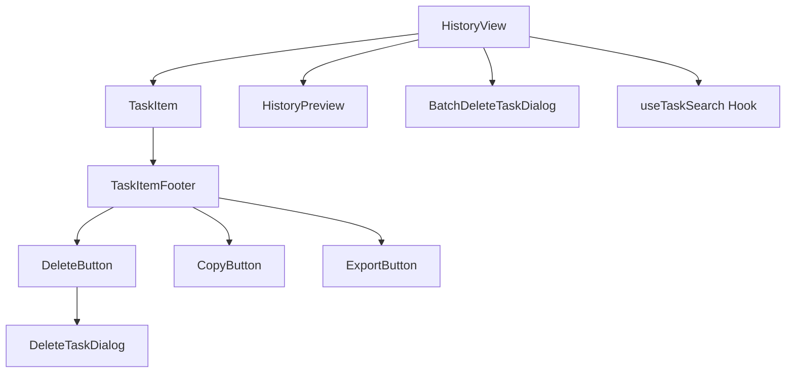
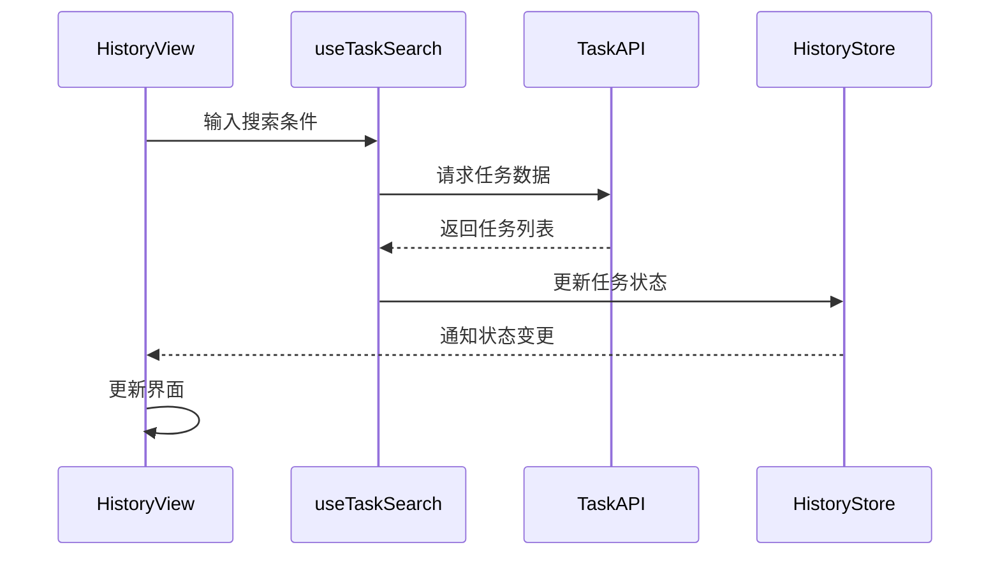

# History 历史记录组件

## 1. 模块概述

History组件模块负责管理和展示Kilocode的任务历史记录，提供完整的历史任务浏览、搜索、管理和导出功能。该模块是用户回顾和管理过往工作的重要工具。

### 核心功能

- 历史任务列表展示和分页
- 任务搜索和过滤
- 任务详情预览
- 批量删除和导出
- 任务收藏和标签管理
- 历史数据统计和分析

### 业务价值

- 提供完整的工作历史追溯
- 支持任务复用和参考
- 实现高效的历史数据管理
- 提供数据导出和备份功能

## 2. 组件列表

### 2.1 核心组件

| 组件名称              | 文件路径                  | 功能描述                         |
| --------------------- | ------------------------- | -------------------------------- |
| HistoryView           | HistoryView.tsx           | 历史记录主视图，统一管理历史功能 |
| HistoryPreview        | HistoryPreview.tsx        | 历史任务预览组件，显示任务详情   |
| TaskItem              | TaskItem.tsx              | 单个任务项组件，展示任务基本信息 |
| TaskItemFooter        | TaskItemFooter.tsx        | 任务项底部操作区域               |
| BatchDeleteTaskDialog | BatchDeleteTaskDialog.tsx | 批量删除确认对话框               |
| DeleteTaskDialog      | DeleteTaskDialog.tsx      | 单个任务删除确认对话框           |
| DeleteButton          | DeleteButton.tsx          | 删除按钮组件                     |
| CopyButton            | CopyButton.tsx            | 复制按钮组件                     |
| ExportButton          | ExportButton.tsx          | 导出按钮组件                     |

### 2.2 Hook组件

| Hook名称      | 文件路径         | 功能描述           |
| ------------- | ---------------- | ------------------ |
| useTaskSearch | useTaskSearch.ts | 任务搜索和过滤逻辑 |

### 2.3 组件层次关系



## 3. 技术架构

### 3.1 设计模式

- **列表-详情模式**: 左侧任务列表，右侧详情预览
- **虚拟滚动模式**: 处理大量历史数据的性能优化
- **搜索过滤模式**: 实时搜索和多维度过滤
- **批量操作模式**: 支持多选和批量处理

### 3.2 状态管理

```typescript
interface HistoryState {
	tasks: Task[]
	selectedTask: Task | null
	selectedTasks: Set<string>
	searchQuery: string
	filters: TaskFilters
	sortBy: SortOption
	loading: boolean
	hasMore: boolean
	error: string | null
}

interface TaskFilters {
	dateRange: [Date, Date] | null
	status: TaskStatus[]
	tags: string[]
	provider: string[]
}
```

### 3.3 数据流向



## 4. API文档

### 4.1 HistoryView Props

```typescript
interface HistoryViewProps {
	/** 初始选中的任务ID */
	initialTaskId?: string
	/** 是否显示搜索栏 */
	showSearch?: boolean
	/** 是否显示过滤器 */
	showFilters?: boolean
	/** 每页显示数量 */
	pageSize?: number
	/** 任务选择回调 */
	onTaskSelect?: (task: Task) => void
	/** 任务删除回调 */
	onTaskDelete?: (taskId: string) => void
}
```

### 4.2 TaskItem Props

```typescript
interface TaskItemProps {
	/** 任务数据 */
	task: Task
	/** 是否选中 */
	selected?: boolean
	/** 是否多选模式 */
	multiSelect?: boolean
	/** 点击回调 */
	onClick?: (task: Task) => void
	/** 选择状态变更回调 */
	onSelectionChange?: (taskId: string, selected: boolean) => void
	/** 删除回调 */
	onDelete?: (taskId: string) => void
}
```

### 4.3 useTaskSearch Hook

```typescript
interface UseTaskSearchResult {
	/** 搜索结果 */
	tasks: Task[]
	/** 加载状态 */
	loading: boolean
	/** 错误信息 */
	error: string | null
	/** 是否有更多数据 */
	hasMore: boolean
	/** 搜索函数 */
	search: (query: string) => void
	/** 设置过滤器 */
	setFilters: (filters: TaskFilters) => void
	/** 加载更多 */
	loadMore: () => void
	/** 刷新数据 */
	refresh: () => void
}
```

## 5. 使用示例

### 5.1 基础使用

```tsx
import { HistoryView } from "@/components/history/HistoryView"

function App() {
	const handleTaskSelect = (task: Task) => {
		console.log("Selected task:", task)
	}

	const handleTaskDelete = (taskId: string) => {
		console.log("Deleted task:", taskId)
	}

	return (
		<HistoryView
			showSearch={true}
			showFilters={true}
			pageSize={20}
			onTaskSelect={handleTaskSelect}
			onTaskDelete={handleTaskDelete}
		/>
	)
}
```

### 5.2 任务搜索

```tsx
import { useTaskSearch } from "@/components/history/useTaskSearch"

function TaskSearchExample() {
	const { tasks, loading, search, setFilters, loadMore, hasMore } = useTaskSearch()

	const handleSearch = (query: string) => {
		search(query)
	}

	const handleFilterChange = (filters: TaskFilters) => {
		setFilters(filters)
	}

	return (
		<div>
			<SearchInput onSearch={handleSearch} />
			<FilterPanel onFilterChange={handleFilterChange} />
			<TaskList tasks={tasks} loading={loading} onLoadMore={loadMore} hasMore={hasMore} />
		</div>
	)
}
```

### 5.3 批量操作

```tsx
import { useState } from "react"
import { BatchDeleteTaskDialog } from "@/components/history/BatchDeleteTaskDialog"

function BatchOperationExample() {
	const [selectedTasks, setSelectedTasks] = useState<Set<string>>(new Set())
	const [showDeleteDialog, setShowDeleteDialog] = useState(false)

	const handleBatchDelete = async (taskIds: string[]) => {
		try {
			await deleteMultipleTasks(taskIds)
			setSelectedTasks(new Set())
			setShowDeleteDialog(false)
		} catch (error) {
			console.error("Batch delete failed:", error)
		}
	}

	return (
		<>
			<button onClick={() => setShowDeleteDialog(true)} disabled={selectedTasks.size === 0}>
				Delete Selected ({selectedTasks.size})
			</button>

			<BatchDeleteTaskDialog
				open={showDeleteDialog}
				taskIds={Array.from(selectedTasks)}
				onConfirm={handleBatchDelete}
				onCancel={() => setShowDeleteDialog(false)}
			/>
		</>
	)
}
```

## 6. 样式和主题

### 6.1 CSS类名规范

```css
/* 历史视图主容器 */
.history-view {
	display: grid;
	grid-template-columns: 1fr 2fr;
	height: 100vh;
	gap: 16px;
}

/* 任务列表 */
.history-task-list {
	overflow-y: auto;
	border-right: 1px solid var(--vscode-panel-border);
}

/* 任务项 */
.history-task-item {
	padding: 12px 16px;
	border-bottom: 1px solid var(--vscode-list-inactiveSelectionBackground);
	cursor: pointer;
	transition: background-color 0.2s;
}

.history-task-item:hover {
	background-color: var(--vscode-list-hoverBackground);
}

.history-task-item.selected {
	background-color: var(--vscode-list-activeSelectionBackground);
	color: var(--vscode-list-activeSelectionForeground);
}

/* 任务预览 */
.history-preview {
	padding: 16px;
	overflow-y: auto;
}

/* 搜索栏 */
.history-search {
	padding: 16px;
	border-bottom: 1px solid var(--vscode-panel-border);
}

/* 批量操作栏 */
.history-batch-actions {
	display: flex;
	align-items: center;
	gap: 8px;
	padding: 8px 16px;
	background-color: var(--vscode-badge-background);
	border-bottom: 1px solid var(--vscode-panel-border);
}
```

### 6.2 主题变量

```typescript
const historyTheme = {
	colors: {
		primary: "var(--vscode-button-background)",
		secondary: "var(--vscode-button-secondaryBackground)",
		selected: "var(--vscode-list-activeSelectionBackground)",
		hover: "var(--vscode-list-hoverBackground)",
		border: "var(--vscode-panel-border)",
	},
	spacing: {
		xs: "4px",
		sm: "8px",
		md: "12px",
		lg: "16px",
		xl: "24px",
	},
	typography: {
		taskTitle: {
			fontSize: "14px",
			fontWeight: "500",
			lineHeight: "20px",
		},
		taskMeta: {
			fontSize: "12px",
			color: "var(--vscode-descriptionForeground)",
		},
	},
}
```

## 7. 测试策略

### 7.1 单元测试

```typescript
// HistoryView.spec.tsx
describe('HistoryView', () => {
  it('should render task list', () => {
    const tasks = [mockTask1, mockTask2];
    render(<HistoryView />, {
      wrapper: ({ children }) => (
        <HistoryProvider initialTasks={tasks}>
          {children}
        </HistoryProvider>
      ),
    });

    expect(screen.getByText(mockTask1.title)).toBeInTheDocument();
    expect(screen.getByText(mockTask2.title)).toBeInTheDocument();
  });

  it('should handle task selection', () => {
    const onTaskSelect = jest.fn();
    render(<HistoryView onTaskSelect={onTaskSelect} />);

    fireEvent.click(screen.getByText(mockTask1.title));
    expect(onTaskSelect).toHaveBeenCalledWith(mockTask1);
  });
});
```

### 7.2 搜索功能测试

```typescript
// useTaskSearch.spec.tsx
describe("useTaskSearch", () => {
	it("should filter tasks by search query", async () => {
		const { result } = renderHook(() => useTaskSearch())

		act(() => {
			result.current.search("test query")
		})

		await waitFor(() => {
			expect(result.current.tasks).toHaveLength(2)
			expect(result.current.tasks[0].title).toContain("test")
		})
	})

	it("should apply date range filter", async () => {
		const { result } = renderHook(() => useTaskSearch())

		act(() => {
			result.current.setFilters({
				dateRange: [new Date("2023-01-01"), new Date("2023-12-31")],
				status: [],
				tags: [],
				provider: [],
			})
		})

		await waitFor(() => {
			expect(
				result.current.tasks.every(
					(task) => task.createdAt >= new Date("2023-01-01") && task.createdAt <= new Date("2023-12-31"),
				),
			).toBe(true)
		})
	})
})
```

## 8. 性能优化

### 8.1 虚拟滚动

```typescript
import { FixedSizeList as List } from 'react-window';

const VirtualTaskList = ({ tasks, onTaskSelect }) => {
  const Row = ({ index, style }) => (
    <div style={style}>
      <TaskItem
        task={tasks[index]}
        onClick={onTaskSelect}
      />
    </div>
  );

  return (
    <List
      height={600}
      itemCount={tasks.length}
      itemSize={80}
      width="100%"
    >
      {Row}
    </List>
  );
};
```

### 8.2 搜索防抖

```typescript
import { useDebouncedCallback } from "use-debounce"

const useTaskSearch = () => {
	const [query, setQuery] = useState("")
	const [tasks, setTasks] = useState<Task[]>([])

	const debouncedSearch = useDebouncedCallback(async (searchQuery: string) => {
		const results = await searchTasks(searchQuery)
		setTasks(results)
	}, 300)

	const search = (newQuery: string) => {
		setQuery(newQuery)
		debouncedSearch(newQuery)
	}

	return { tasks, search }
}
```

### 8.3 数据缓存

```typescript
import { useQuery } from "@tanstack/react-query"

const useHistoryTasks = (filters: TaskFilters) => {
	return useQuery({
		queryKey: ["history-tasks", filters],
		queryFn: () => fetchHistoryTasks(filters),
		staleTime: 5 * 60 * 1000, // 5分钟
		cacheTime: 10 * 60 * 1000, // 10分钟
	})
}
```

## 9. 可访问性

### 9.1 ARIA属性

```tsx
<div role="listbox" aria-label="Task history list" aria-multiselectable={multiSelect}>
	{tasks.map((task) => (
		<div
			key={task.id}
			role="option"
			aria-selected={selectedTasks.has(task.id)}
			aria-label={`Task: ${task.title}, Created: ${task.createdAt}`}
			tabIndex={0}>
			<TaskItem task={task} />
		</div>
	))}
</div>
```

### 9.2 键盘导航

```typescript
const useKeyboardNavigation = (tasks: Task[], onTaskSelect: (task: Task) => void) => {
	const [focusedIndex, setFocusedIndex] = useState(0)

	const handleKeyDown = useCallback(
		(event: KeyboardEvent) => {
			switch (event.key) {
				case "ArrowDown":
					event.preventDefault()
					setFocusedIndex((prev) => Math.min(prev + 1, tasks.length - 1))
					break
				case "ArrowUp":
					event.preventDefault()
					setFocusedIndex((prev) => Math.max(prev - 1, 0))
					break
				case "Enter":
				case " ":
					event.preventDefault()
					onTaskSelect(tasks[focusedIndex])
					break
			}
		},
		[tasks, focusedIndex, onTaskSelect],
	)

	return { focusedIndex, handleKeyDown }
}
```

## 10. 国际化

### 10.1 文本资源

```json
{
	"history.title": "Task History",
	"history.search.placeholder": "Search tasks...",
	"history.filter.dateRange": "Date Range",
	"history.filter.status": "Status",
	"history.filter.tags": "Tags",
	"history.filter.provider": "Provider",
	"history.task.created": "Created",
	"history.task.updated": "Updated",
	"history.task.duration": "Duration",
	"history.batch.selected": "{count} tasks selected",
	"history.batch.delete": "Delete Selected",
	"history.batch.export": "Export Selected",
	"history.delete.confirm": "Are you sure you want to delete this task?",
	"history.delete.batch.confirm": "Are you sure you want to delete {count} tasks?",
	"history.export.success": "Tasks exported successfully",
	"history.empty.title": "No tasks found",
	"history.empty.description": "Start a new conversation to see your task history"
}
```

### 10.2 日期格式化

```typescript
import { useTranslation } from "react-i18next"
import { formatDistanceToNow, format } from "date-fns"
import { zhCN, enUS } from "date-fns/locale"

const useFormattedDate = () => {
	const { i18n } = useTranslation()
	const locale = i18n.language === "zh" ? zhCN : enUS

	const formatRelativeTime = (date: Date) => {
		return formatDistanceToNow(date, {
			addSuffix: true,
			locale,
		})
	}

	const formatAbsoluteTime = (date: Date) => {
		return format(date, "PPp", { locale })
	}

	return { formatRelativeTime, formatAbsoluteTime }
}
```

## 11. 错误处理

### 11.1 错误边界

```typescript
class HistoryErrorBoundary extends React.Component {
  constructor(props) {
    super(props);
    this.state = { hasError: false, error: null };
  }

  static getDerivedStateFromError(error) {
    return { hasError: true, error };
  }

  componentDidCatch(error, errorInfo) {
    console.error('History component error:', error, errorInfo);
    // 发送错误报告
    reportError(error, { component: 'History', ...errorInfo });
  }

  render() {
    if (this.state.hasError) {
      return (
        <div className="history-error-fallback">
          <h3>Something went wrong with task history</h3>
          <button onClick={() => window.location.reload()}>
            Reload Page
          </button>
        </div>
      );
    }

    return this.props.children;
  }
}
```

### 11.2 数据加载错误

```typescript
const HistoryView = () => {
  const { tasks, loading, error, retry } = useHistoryTasks();

  if (error) {
    return (
      <div className="history-error">
        <p>Failed to load task history</p>
        <button onClick={retry}>Try Again</button>
      </div>
    );
  }

  if (loading) {
    return <HistoryLoadingSkeleton />;
  }

  return <TaskList tasks={tasks} />;
};
```

## 12. 与其他模块的集成

### 12.1 与任务模块集成

```typescript
// 从历史记录恢复任务
const restoreTaskFromHistory = async (historyTask: Task) => {
	try {
		const newTask = await taskService.createFromHistory(historyTask)
		navigateToTask(newTask.id)
	} catch (error) {
		showNotification({
			type: "error",
			message: "Failed to restore task from history",
		})
	}
}
```

### 12.2 与导出模块集成

```typescript
// 导出历史数据
const exportHistoryData = async (tasks: Task[], format: "json" | "csv") => {
	try {
		const exportData = await exportService.exportTasks(tasks, format)
		downloadFile(exportData, `history-${Date.now()}.${format}`)
	} catch (error) {
		showNotification({
			type: "error",
			message: "Failed to export history data",
		})
	}
}
```

## 13. 最佳实践

### 13.1 数据管理

- 使用分页加载避免一次性加载大量数据
- 实现智能缓存策略提升用户体验
- 定期清理过期的历史数据

### 13.2 用户体验

- 提供多种视图模式（列表、卡片、时间线）
- 实现快速搜索和智能过滤
- 支持任务收藏和标签分类

### 13.3 性能优化

- 使用虚拟滚动处理大量数据
- 实现搜索防抖避免频繁请求
- 优化组件渲染减少不必要的更新

### 13.4 数据安全

- 实现安全的批量删除确认机制
- 提供数据恢复和备份功能
- 记录用户操作日志便于审计
