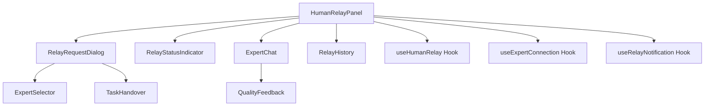
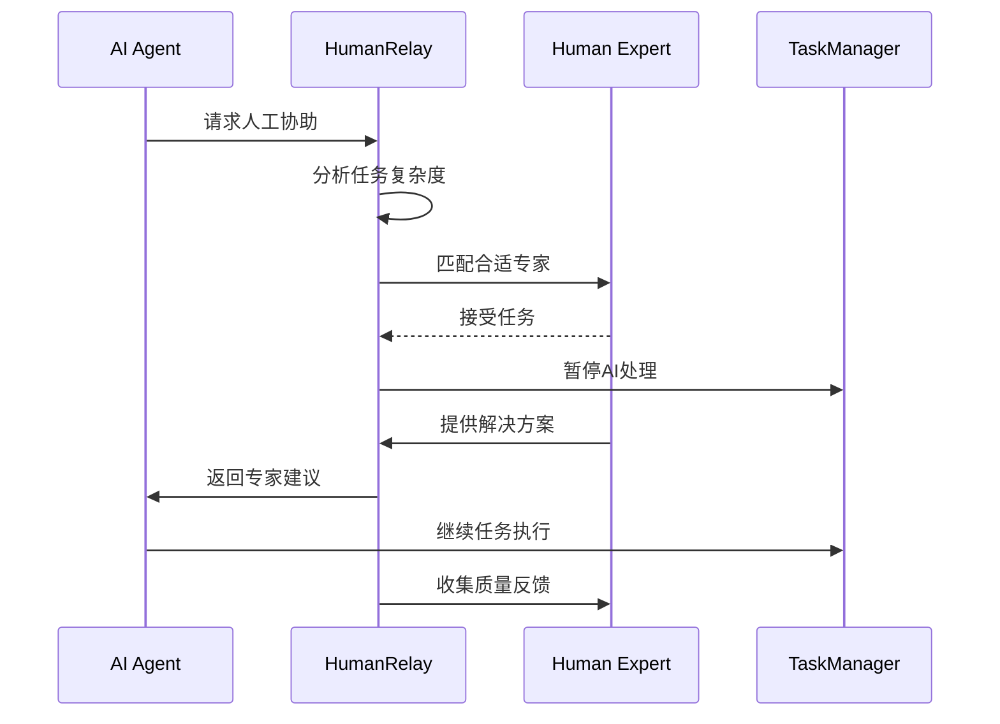

# Human Relay 人工中继组件

## 1. 模块概述

Human Relay组件模块负责实现AI与人工专家之间的无缝协作机制，当AI遇到复杂问题或需要专业判断时，可以将任务转交给人工专家处理，实现智能化的人机协作工作流。

### 核心功能

- AI任务转人工处理
- 人工专家接入和管理
- 实时协作状态监控
- 任务优先级和路由管理
- 专家反馈和质量评估
- 协作历史记录和分析

### 业务价值

- 提升复杂任务处理质量
- 实现AI能力边界的智能扩展
- 建立高效的人机协作机制
- 提供专业领域的深度支持

## 2. 组件列表

### 2.1 核心组件

| 组件名称             | 文件路径                 | 功能描述                         |
| -------------------- | ------------------------ | -------------------------------- |
| HumanRelayPanel      | HumanRelayPanel.tsx      | 人工中继主面板，统一管理中继功能 |
| RelayRequestDialog   | RelayRequestDialog.tsx   | 中继请求对话框，发起人工协助     |
| ExpertSelector       | ExpertSelector.tsx       | 专家选择器，选择合适的专家       |
| RelayStatusIndicator | RelayStatusIndicator.tsx | 中继状态指示器，显示当前状态     |
| ExpertChat           | ExpertChat.tsx           | 专家聊天界面，实时沟通           |
| TaskHandover         | TaskHandover.tsx         | 任务交接组件，处理任务转移       |
| QualityFeedback      | QualityFeedback.tsx      | 质量反馈组件，评估专家服务       |
| RelayHistory         | RelayHistory.tsx         | 中继历史记录，查看过往协作       |

### 2.2 Hook组件

| Hook名称             | 文件路径                | 功能描述             |
| -------------------- | ----------------------- | -------------------- |
| useHumanRelay        | useHumanRelay.ts        | 人工中继核心逻辑管理 |
| useExpertConnection  | useExpertConnection.ts  | 专家连接状态管理     |
| useRelayNotification | useRelayNotification.ts | 中继通知管理         |

### 2.3 组件层次关系



## 3. 技术架构

### 3.1 设计模式

- **状态机模式**: 管理中继请求的生命周期
- **观察者模式**: 实时监控专家状态和任务进度
- **策略模式**: 根据任务类型选择合适的专家
- **命令模式**: 封装任务交接和回滚操作

### 3.2 状态管理

```typescript
interface HumanRelayState {
	// 中继请求状态
	activeRelays: RelayRequest[]
	pendingRequests: RelayRequest[]
	completedRelays: RelayRequest[]

	// 专家状态
	availableExperts: Expert[]
	connectedExperts: Expert[]
	expertCapabilities: Map<string, Capability[]>

	// 任务状态
	currentTask: Task | null
	handoverStatus: HandoverStatus

	// 通信状态
	chatMessages: ChatMessage[]
	notifications: RelayNotification[]

	// 配置
	relaySettings: RelaySettings
	qualityThresholds: QualityThresholds
}

interface RelayRequest {
	id: string
	taskId: string
	requesterId: string
	expertId?: string
	priority: Priority
	category: TaskCategory
	description: string
	context: TaskContext
	status: RelayStatus
	createdAt: Date
	assignedAt?: Date
	completedAt?: Date
	estimatedDuration?: number
	actualDuration?: number
}

enum RelayStatus {
	PENDING = "pending",
	ASSIGNED = "assigned",
	IN_PROGRESS = "in_progress",
	COMPLETED = "completed",
	CANCELLED = "cancelled",
	ESCALATED = "escalated",
}
```

### 3.3 数据流向



## 4. API文档

### 4.1 HumanRelayPanel Props

```typescript
interface HumanRelayPanelProps {
	/** 当前任务 */
	currentTask?: Task
	/** 是否显示历史记录 */
	showHistory?: boolean
	/** 是否允许直接聊天 */
	allowDirectChat?: boolean
	/** 中继请求回调 */
	onRelayRequest?: (request: RelayRequestData) => void
	/** 任务完成回调 */
	onTaskComplete?: (result: TaskResult) => void
	/** 专家连接状态变更回调 */
	onExpertStatusChange?: (expert: Expert, status: ExpertStatus) => void
}
```

### 4.2 RelayRequestDialog Props

```typescript
interface RelayRequestDialogProps {
	/** 对话框开启状态 */
	open: boolean
	/** 任务上下文 */
	taskContext: TaskContext
	/** 可用专家列表 */
	availableExperts: Expert[]
	/** 请求确认回调 */
	onConfirm: (request: RelayRequestData) => void
	/** 取消回调 */
	onCancel: () => void
}

interface RelayRequestData {
	expertId?: string
	priority: Priority
	category: TaskCategory
	description: string
	expectedDuration?: number
	urgency: UrgencyLevel
	requiredSkills: string[]
}
```

### 4.3 useHumanRelay Hook

```typescript
interface UseHumanRelayResult {
	/** 当前中继状态 */
	relayState: HumanRelayState
	/** 发起中继请求 */
	requestRelay: (data: RelayRequestData) => Promise<RelayRequest>
	/** 取消中继请求 */
	cancelRelay: (requestId: string) => Promise<void>
	/** 发送消息给专家 */
	sendMessage: (expertId: string, message: string) => Promise<void>
	/** 提交质量反馈 */
	submitFeedback: (requestId: string, feedback: QualityFeedback) => Promise<void>
	/** 获取专家建议 */
	getExpertSuggestion: (requestId: string) => Promise<ExpertSuggestion>
	/** 连接状态 */
	connectionStatus: ConnectionStatus
	/** 错误信息 */
	error: string | null
}
```

## 5. 使用示例

### 5.1 基础中继请求

```tsx
import { HumanRelayPanel } from "@/components/human-relay/HumanRelayPanel"
import { useHumanRelay } from "@/components/human-relay/useHumanRelay"

function TaskWithRelay() {
	const { requestRelay, relayState } = useHumanRelay()
	const [currentTask, setCurrentTask] = useState<Task | null>(null)

	const handleRelayRequest = async (requestData: RelayRequestData) => {
		try {
			const relayRequest = await requestRelay(requestData)
			console.log("Relay request created:", relayRequest)
		} catch (error) {
			console.error("Failed to create relay request:", error)
		}
	}

	const handleTaskComplete = (result: TaskResult) => {
		setCurrentTask(null)
		console.log("Task completed with expert help:", result)
	}

	return (
		<div className="task-with-relay">
			<TaskInterface task={currentTask} />
			<HumanRelayPanel
				currentTask={currentTask}
				showHistory={true}
				allowDirectChat={true}
				onRelayRequest={handleRelayRequest}
				onTaskComplete={handleTaskComplete}
			/>
		</div>
	)
}
```

### 5.2 专家选择和任务交接

```tsx
import { RelayRequestDialog } from "@/components/human-relay/RelayRequestDialog"
import { ExpertSelector } from "@/components/human-relay/ExpertSelector"

function ExpertSelectionExample() {
	const [showDialog, setShowDialog] = useState(false)
	const [availableExperts, setAvailableExperts] = useState<Expert[]>([])
	const [taskContext, setTaskContext] = useState<TaskContext | null>(null)

	const handleExpertSelection = (expert: Expert) => {
		console.log("Selected expert:", expert)
	}

	const handleRelayConfirm = async (requestData: RelayRequestData) => {
		try {
			const request = await createRelayRequest(requestData)
			await assignExpert(request.id, requestData.expertId)
			setShowDialog(false)
		} catch (error) {
			console.error("Failed to assign expert:", error)
		}
	}

	return (
		<>
			<button onClick={() => setShowDialog(true)}>Request Human Expert</button>

			<RelayRequestDialog
				open={showDialog}
				taskContext={taskContext}
				availableExperts={availableExperts}
				onConfirm={handleRelayConfirm}
				onCancel={() => setShowDialog(false)}
			/>
		</>
	)
}
```

### 5.3 实时专家协作

```tsx
import { ExpertChat } from "@/components/human-relay/ExpertChat"
import { useExpertConnection } from "@/components/human-relay/useExpertConnection"

function ExpertCollaboration() {
	const { connectedExperts, sendMessage, messages, connectionStatus } = useExpertConnection()

	const handleSendMessage = async (expertId: string, message: string) => {
		try {
			await sendMessage(expertId, message)
		} catch (error) {
			console.error("Failed to send message:", error)
		}
	}

	const handleFileShare = async (expertId: string, file: File) => {
		try {
			await shareFileWithExpert(expertId, file)
		} catch (error) {
			console.error("Failed to share file:", error)
		}
	}

	return (
		<div className="expert-collaboration">
			<div className="connection-status">Status: {connectionStatus}</div>

			{connectedExperts.map((expert) => (
				<ExpertChat
					key={expert.id}
					expert={expert}
					messages={messages[expert.id] || []}
					onSendMessage={(message) => handleSendMessage(expert.id, message)}
					onFileShare={(file) => handleFileShare(expert.id, file)}
				/>
			))}
		</div>
	)
}
```

## 6. 样式和主题

### 6.1 CSS类名规范

```css
/* 人工中继主面板 */
.human-relay-panel {
	display: flex;
	flex-direction: column;
	height: 100%;
	background-color: var(--vscode-panel-background);
	border: 1px solid var(--vscode-panel-border);
}

/* 中继状态指示器 */
.relay-status-indicator {
	display: flex;
	align-items: center;
	gap: 8px;
	padding: 8px 12px;
	border-radius: 4px;
	font-size: 12px;
	font-weight: 500;
}

.relay-status-indicator.pending {
	background-color: var(--vscode-notificationsWarningIcon-foreground);
	color: var(--vscode-editor-background);
}

.relay-status-indicator.in-progress {
	background-color: var(--vscode-notificationsInfoIcon-foreground);
	color: var(--vscode-editor-background);
}

.relay-status-indicator.completed {
	background-color: var(--vscode-testing-iconPassed);
	color: var(--vscode-editor-background);
}

/* 专家聊天界面 */
.expert-chat {
	display: flex;
	flex-direction: column;
	height: 400px;
	border: 1px solid var(--vscode-input-border);
	border-radius: 6px;
}

.expert-chat-header {
	display: flex;
	align-items: center;
	justify-content: space-between;
	padding: 12px 16px;
	background-color: var(--vscode-editor-background);
	border-bottom: 1px solid var(--vscode-panel-border);
}

.expert-chat-messages {
	flex: 1;
	overflow-y: auto;
	padding: 16px;
}

.expert-chat-input {
	display: flex;
	gap: 8px;
	padding: 12px 16px;
	border-top: 1px solid var(--vscode-panel-border);
}

/* 中继请求对话框 */
.relay-request-dialog {
	width: 500px;
	max-height: 600px;
}

.relay-request-form {
	display: flex;
	flex-direction: column;
	gap: 16px;
	padding: 20px;
}

.expert-selector {
	display: grid;
	grid-template-columns: repeat(auto-fill, minmax(200px, 1fr));
	gap: 12px;
	max-height: 200px;
	overflow-y: auto;
}

.expert-card {
	padding: 12px;
	border: 1px solid var(--vscode-input-border);
	border-radius: 6px;
	cursor: pointer;
	transition: all 0.2s;
}

.expert-card:hover {
	border-color: var(--vscode-focusBorder);
	background-color: var(--vscode-list-hoverBackground);
}

.expert-card.selected {
	border-color: var(--vscode-button-background);
	background-color: var(--vscode-button-background);
	color: var(--vscode-button-foreground);
}
```

### 6.2 主题变量

```typescript
const humanRelayTheme = {
	colors: {
		primary: "var(--vscode-button-background)",
		secondary: "var(--vscode-button-secondaryBackground)",
		success: "var(--vscode-testing-iconPassed)",
		warning: "var(--vscode-notificationsWarningIcon-foreground)",
		info: "var(--vscode-notificationsInfoIcon-foreground)",
		error: "var(--vscode-notificationsErrorIcon-foreground)",
		border: "var(--vscode-panel-border)",
		background: "var(--vscode-panel-background)",
	},
	status: {
		pending: {
			color: "var(--vscode-notificationsWarningIcon-foreground)",
			background: "rgba(255, 193, 7, 0.1)",
		},
		inProgress: {
			color: "var(--vscode-notificationsInfoIcon-foreground)",
			background: "rgba(0, 123, 255, 0.1)",
		},
		completed: {
			color: "var(--vscode-testing-iconPassed)",
			background: "rgba(40, 167, 69, 0.1)",
		},
		cancelled: {
			color: "var(--vscode-notificationsErrorIcon-foreground)",
			background: "rgba(220, 53, 69, 0.1)",
		},
	},
	expert: {
		online: "var(--vscode-testing-iconPassed)",
		busy: "var(--vscode-notificationsWarningIcon-foreground)",
		offline: "var(--vscode-descriptionForeground)",
	},
}
```

## 7. 测试策略

### 7.1 单元测试

```typescript
// HumanRelayPanel.spec.tsx
describe('HumanRelayPanel', () => {
  it('should display relay status correctly', () => {
    const mockRelay = {
      id: '1',
      status: RelayStatus.IN_PROGRESS,
      expertId: 'expert-1',
    };

    render(<HumanRelayPanel />, {
      wrapper: ({ children }) => (
        <RelayProvider initialState={{ activeRelays: [mockRelay] }}>
          {children}
        </RelayProvider>
      ),
    });

    expect(screen.getByText('In Progress')).toBeInTheDocument();
    expect(screen.getByTestId('relay-status-indicator')).toHaveClass('in-progress');
  });

  it('should handle relay request creation', async () => {
    const onRelayRequest = jest.fn();
    render(<HumanRelayPanel onRelayRequest={onRelayRequest} />);

    fireEvent.click(screen.getByText('Request Expert Help'));

    // Fill form and submit
    fireEvent.change(screen.getByLabelText('Description'), {
      target: { value: 'Need help with complex algorithm' }
    });
    fireEvent.click(screen.getByText('Submit Request'));

    await waitFor(() => {
      expect(onRelayRequest).toHaveBeenCalledWith(
        expect.objectContaining({
          description: 'Need help with complex algorithm'
        })
      );
    });
  });
});
```

### 7.2 专家连接测试

```typescript
// useExpertConnection.spec.tsx
describe("useExpertConnection", () => {
	it("should establish connection with expert", async () => {
		const { result } = renderHook(() => useExpertConnection())

		act(() => {
			result.current.connectToExpert("expert-1")
		})

		await waitFor(() => {
			expect(result.current.connectionStatus).toBe("connected")
			expect(result.current.connectedExperts).toHaveLength(1)
		})
	})

	it("should handle message sending", async () => {
		const { result } = renderHook(() => useExpertConnection())

		await act(async () => {
			await result.current.sendMessage("expert-1", "Hello expert")
		})

		expect(result.current.messages["expert-1"]).toContainEqual(
			expect.objectContaining({
				content: "Hello expert",
				sender: "user",
			}),
		)
	})
})
```

## 8. 性能优化

### 8.1 连接池管理

```typescript
class ExpertConnectionPool {
	private connections = new Map<string, WebSocket>()
	private maxConnections = 5

	async getConnection(expertId: string): Promise<WebSocket> {
		if (this.connections.has(expertId)) {
			return this.connections.get(expertId)!
		}

		if (this.connections.size >= this.maxConnections) {
			// 关闭最久未使用的连接
			const oldestConnection = this.getOldestConnection()
			this.closeConnection(oldestConnection)
		}

		const connection = await this.createConnection(expertId)
		this.connections.set(expertId, connection)
		return connection
	}

	private async createConnection(expertId: string): Promise<WebSocket> {
		return new Promise((resolve, reject) => {
			const ws = new WebSocket(`ws://expert-service/${expertId}`)
			ws.onopen = () => resolve(ws)
			ws.onerror = reject
		})
	}
}
```

### 8.2 消息缓存

```typescript
import { LRUCache } from "lru-cache"

const messageCache = new LRUCache<string, ChatMessage[]>({
	max: 100, // 最多缓存100个对话
	ttl: 1000 * 60 * 30, // 30分钟过期
})

const useCachedMessages = (expertId: string) => {
	const [messages, setMessages] = useState<ChatMessage[]>(() => {
		return messageCache.get(expertId) || []
	})

	const addMessage = useCallback(
		(message: ChatMessage) => {
			setMessages((prev) => {
				const updated = [...prev, message]
				messageCache.set(expertId, updated)
				return updated
			})
		},
		[expertId],
	)

	return { messages, addMessage }
}
```

### 8.3 状态更新优化

```typescript
import { useCallback, useMemo } from "react"
import { debounce } from "lodash-es"

const useOptimizedRelayState = () => {
	const [state, setState] = useState<HumanRelayState>(initialState)

	const debouncedUpdateStatus = useMemo(
		() =>
			debounce((requestId: string, status: RelayStatus) => {
				setState((prev) => ({
					...prev,
					activeRelays: prev.activeRelays.map((relay) =>
						relay.id === requestId ? { ...relay, status } : relay,
					),
				}))
			}, 300),
		[],
	)

	const updateRelayStatus = useCallback(
		(requestId: string, status: RelayStatus) => {
			debouncedUpdateStatus(requestId, status)
		},
		[debouncedUpdateStatus],
	)

	return { state, updateRelayStatus }
}
```

## 9. 可访问性

### 9.1 ARIA属性

```tsx
<div role="region" aria-label="Human relay panel" aria-describedby="relay-description">
	<div id="relay-description" className="sr-only">
		Panel for requesting human expert assistance and monitoring relay status
	</div>

	<div role="status" aria-live="polite" aria-label={`Relay status: ${relayStatus}`}>
		<RelayStatusIndicator status={relayStatus} />
	</div>

	<div role="log" aria-label="Expert chat messages" aria-live="polite">
		{messages.map((message) => (
			<div key={message.id} role="article" aria-label={`Message from ${message.sender} at ${message.timestamp}`}>
				{message.content}
			</div>
		))}
	</div>
</div>
```

### 9.2 键盘导航

```typescript
const useRelayKeyboardNavigation = () => {
	const handleKeyDown = useCallback((event: KeyboardEvent) => {
		switch (event.key) {
			case "Escape":
				// 关闭当前对话框
				closeActiveDialog()
				break
			case "Enter":
				if (event.ctrlKey) {
					// Ctrl+Enter 发送消息
					sendCurrentMessage()
				}
				break
			case "Tab":
				// 在专家列表中导航
				if (event.shiftKey) {
					focusPreviousExpert()
				} else {
					focusNextExpert()
				}
				break
		}
	}, [])

	useEffect(() => {
		document.addEventListener("keydown", handleKeyDown)
		return () => document.removeEventListener("keydown", handleKeyDown)
	}, [handleKeyDown])
}
```

## 10. 国际化

### 10.1 文本资源

```json
{
	"humanRelay.title": "Human Expert Assistance",
	"humanRelay.requestHelp": "Request Expert Help",
	"humanRelay.status.pending": "Waiting for Expert",
	"humanRelay.status.assigned": "Expert Assigned",
	"humanRelay.status.inProgress": "In Progress",
	"humanRelay.status.completed": "Completed",
	"humanRelay.status.cancelled": "Cancelled",
	"humanRelay.expert.online": "Online",
	"humanRelay.expert.busy": "Busy",
	"humanRelay.expert.offline": "Offline",
	"humanRelay.chat.placeholder": "Type your message...",
	"humanRelay.chat.send": "Send",
	"humanRelay.chat.fileShare": "Share File",
	"humanRelay.request.title": "Request Expert Assistance",
	"humanRelay.request.description": "Description",
	"humanRelay.request.priority": "Priority",
	"humanRelay.request.category": "Category",
	"humanRelay.request.expectedDuration": "Expected Duration",
	"humanRelay.request.submit": "Submit Request",
	"humanRelay.request.cancel": "Cancel",
	"humanRelay.feedback.title": "Rate Expert Service",
	"humanRelay.feedback.quality": "Service Quality",
	"humanRelay.feedback.speed": "Response Speed",
	"humanRelay.feedback.helpfulness": "Helpfulness",
	"humanRelay.feedback.comments": "Additional Comments",
	"humanRelay.feedback.submit": "Submit Feedback",
	"humanRelay.history.title": "Relay History",
	"humanRelay.history.empty": "No relay history found",
	"humanRelay.notification.expertAssigned": "Expert {expertName} has been assigned to your request",
	"humanRelay.notification.taskCompleted": "Your task has been completed by expert {expertName}",
	"humanRelay.notification.newMessage": "New message from {expertName}",
	"humanRelay.error.connectionFailed": "Failed to connect to expert service",
	"humanRelay.error.requestFailed": "Failed to create relay request",
	"humanRelay.error.noExpertsAvailable": "No experts are currently available"
}
```

### 10.2 专家状态本地化

```typescript
import { useTranslation } from "react-i18next"

const useLocalizedExpertStatus = () => {
	const { t } = useTranslation()

	const getStatusText = (status: ExpertStatus) => {
		switch (status) {
			case ExpertStatus.ONLINE:
				return t("humanRelay.expert.online")
			case ExpertStatus.BUSY:
				return t("humanRelay.expert.busy")
			case ExpertStatus.OFFLINE:
				return t("humanRelay.expert.offline")
			default:
				return t("humanRelay.expert.unknown")
		}
	}

	const getStatusColor = (status: ExpertStatus) => {
		switch (status) {
			case ExpertStatus.ONLINE:
				return "var(--vscode-testing-iconPassed)"
			case ExpertStatus.BUSY:
				return "var(--vscode-notificationsWarningIcon-foreground)"
			case ExpertStatus.OFFLINE:
				return "var(--vscode-descriptionForeground)"
			default:
				return "var(--vscode-descriptionForeground)"
		}
	}

	return { getStatusText, getStatusColor }
}
```

## 11. 错误处理

### 11.1 连接错误处理

```typescript
const useRobustExpertConnection = (expertId: string) => {
	const [connectionState, setConnectionState] = useState<ConnectionState>("disconnected")
	const [retryCount, setRetryCount] = useState(0)
	const maxRetries = 3

	const connect = useCallback(async () => {
		try {
			setConnectionState("connecting")
			const connection = await establishConnection(expertId)
			setConnectionState("connected")
			setRetryCount(0)
			return connection
		} catch (error) {
			console.error("Connection failed:", error)

			if (retryCount < maxRetries) {
				setRetryCount((prev) => prev + 1)
				setTimeout(() => connect(), 1000 * Math.pow(2, retryCount)) // 指数退避
			} else {
				setConnectionState("failed")
				showNotification({
					type: "error",
					message: "Failed to connect to expert after multiple attempts",
				})
			}
		}
	}, [expertId, retryCount, maxRetries])

	return { connectionState, connect, retryCount }
}
```

### 11.2 任务交接错误处理

```typescript
const useTaskHandover = () => {
	const [handoverState, setHandoverState] = useState<HandoverState>("idle")

	const handoverTask = async (taskId: string, expertId: string) => {
		try {
			setHandoverState("transferring")

			// 1. 暂停当前AI处理
			await pauseAIProcessing(taskId)

			// 2. 创建任务快照
			const snapshot = await createTaskSnapshot(taskId)

			// 3. 转移给专家
			await transferToExpert(taskId, expertId, snapshot)

			setHandoverState("completed")
		} catch (error) {
			console.error("Task handover failed:", error)
			setHandoverState("failed")

			// 回滚操作
			try {
				await resumeAIProcessing(taskId)
			} catch (rollbackError) {
				console.error("Rollback failed:", rollbackError)
				// 记录严重错误，需要人工干预
				reportCriticalError("task-handover-rollback-failed", {
					taskId,
					expertId,
					originalError: error,
					rollbackError,
				})
			}

			throw error
		}
	}

	return { handoverState, handoverTask }
}
```

## 12. 与其他模块的集成

### 12.1 与任务管理模块集成

```typescript
// 任务暂停和恢复
const integrateWithTaskManager = () => {
	const pauseTaskForRelay = async (taskId: string) => {
		await taskManager.pauseTask(taskId, {
			reason: "human_relay_requested",
			timestamp: new Date(),
			canResume: true,
		})
	}

	const resumeTaskFromRelay = async (taskId: string, expertResult: ExpertResult) => {
		await taskManager.resumeTask(taskId, {
			expertInput: expertResult,
			resumePoint: "after_expert_consultation",
		})
	}

	return { pauseTaskForRelay, resumeTaskFromRelay }
}
```

### 12.2 与通知系统集成

```typescript
// 中继通知管理
const useRelayNotifications = () => {
	const { showNotification } = useNotificationSystem()

	const notifyExpertAssigned = (expertName: string) => {
		showNotification({
			type: "info",
			title: "Expert Assigned",
			message: `${expertName} has been assigned to help with your task`,
			duration: 5000,
			actions: [
				{
					label: "View Chat",
					action: () => openExpertChat(),
				},
			],
		})
	}

	const notifyTaskCompleted = (expertName: string, result: TaskResult) => {
		showNotification({
			type: "success",
			title: "Task Completed",
			message: `${expertName} has completed your task`,
			duration: 0, // 持久显示
			actions: [
				{
					label: "View Result",
					action: () => showTaskResult(result),
				},
				{
					label: "Rate Service",
					action: () => openFeedbackDialog(),
				},
			],
		})
	}

	return { notifyExpertAssigned, notifyTaskCompleted }
}
```

## 13. 最佳实践

### 13.1 专家匹配策略

- 根据任务类型和复杂度智能匹配专家
- 考虑专家的当前工作负载和可用时间
- 实现专家技能标签和任务需求的精确匹配

### 13.2 质量保证

- 建立专家服务质量评估体系
- 实现任务完成质量的自动检测
- 提供用户反馈和专家改进建议

### 13.3 成本控制

- 实现智能的任务复杂度评估
- 只在必要时才启用人工中继
- 优化专家资源分配和利用率

### 13.4 用户体验

- 提供清晰的中继状态反馈
- 实现无缝的AI-人工切换体验
- 保持任务上下文的完整性和连续性
