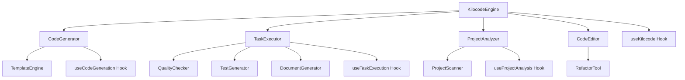
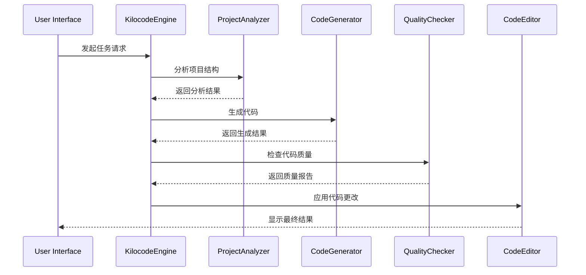

# Kilocode 核心组件

## 1. 模块概述

Kilocode核心组件模块是整个应用的核心业务逻辑实现，负责代码生成、任务执行、项目管理等核心功能。该模块是Kilocode产品的核心价值体现。

### 核心功能

- 智能代码生成和编辑
- 任务执行和流程管理
- 项目结构分析和优化
- 代码质量检测和改进
- 自动化测试生成
- 文档生成和维护

### 业务价值

- 提升开发效率和代码质量
- 实现智能化的开发辅助
- 降低项目维护成本
- 提供全方位的开发支持

## 2. 组件列表

### 2.1 核心组件

| 组件名称          | 文件路径              | 功能描述                               |
| ----------------- | --------------------- | -------------------------------------- |
| KilocodeEngine    | KilocodeEngine.tsx    | Kilocode核心引擎，统一管理所有核心功能 |
| CodeGenerator     | CodeGenerator.tsx     | 代码生成器，智能生成各种代码           |
| TaskExecutor      | TaskExecutor.tsx      | 任务执行器，处理各种开发任务           |
| ProjectAnalyzer   | ProjectAnalyzer.tsx   | 项目分析器，分析项目结构和依赖         |
| CodeEditor        | CodeEditor.tsx        | 智能代码编辑器，提供高级编辑功能       |
| QualityChecker    | QualityChecker.tsx    | 代码质量检查器，检测代码问题           |
| TestGenerator     | TestGenerator.tsx     | 测试生成器，自动生成测试代码           |
| DocumentGenerator | DocumentGenerator.tsx | 文档生成器，自动生成项目文档           |
| RefactorTool      | RefactorTool.tsx      | 重构工具，智能重构代码                 |
| DependencyManager | DependencyManager.tsx | 依赖管理器，管理项目依赖               |

### 2.2 Hook组件

| Hook名称           | 文件路径              | 功能描述             |
| ------------------ | --------------------- | -------------------- |
| useKilocode        | useKilocode.ts        | Kilocode核心功能Hook |
| useCodeGeneration  | useCodeGeneration.ts  | 代码生成功能Hook     |
| useTaskExecution   | useTaskExecution.ts   | 任务执行功能Hook     |
| useProjectAnalysis | useProjectAnalysis.ts | 项目分析功能Hook     |

### 2.3 工具类

| 类名           | 文件路径          | 功能描述     |
| -------------- | ----------------- | ------------ |
| CodeParser     | CodeParser.ts     | 代码解析工具 |
| ProjectScanner | ProjectScanner.ts | 项目扫描工具 |
| TemplateEngine | TemplateEngine.ts | 模板引擎     |
| QualityMetrics | QualityMetrics.ts | 质量指标计算 |

### 2.4 组件层次关系



## 3. 技术架构

### 3.1 设计模式

- **引擎模式**: KilocodeEngine作为核心引擎统一调度各个功能模块
- **策略模式**: 支持多种代码生成策略和任务执行策略
- **观察者模式**: 监听项目变化和任务状态更新
- **工厂模式**: 动态创建不同类型的生成器和分析器

### 3.2 状态管理

```typescript
interface KilocodeState {
	// 引擎状态
	engineStatus: EngineStatus
	currentTask: Task | null
	taskQueue: Task[]

	// 项目状态
	currentProject: ProjectInfo | null
	projectStructure: ProjectNode[]
	dependencies: DependencyInfo[]

	// 代码生成状态
	generationHistory: GenerationRecord[]
	activeGenerators: Map<string, CodeGenerator>
	templates: Template[]

	// 质量检查状态
	qualityReports: QualityReport[]
	issues: CodeIssue[]
	metrics: QualityMetrics

	// 配置
	kilocodeConfig: KilocodeConfiguration
	userPreferences: UserPreferences
}

interface Task {
	id: string
	type: TaskType
	description: string
	input: TaskInput
	output?: TaskOutput
	status: TaskStatus
	progress: number
	startTime?: Date
	endTime?: Date
	error?: string
}

enum TaskType {
	CODE_GENERATION = "code_generation",
	CODE_REFACTORING = "code_refactoring",
	TEST_GENERATION = "test_generation",
	DOCUMENTATION = "documentation",
	QUALITY_CHECK = "quality_check",
	PROJECT_ANALYSIS = "project_analysis",
}
```

### 3.3 数据流向



## 4. API文档

### 4.1 KilocodeEngine Props

```typescript
interface KilocodeEngineProps {
	/** 项目根目录 */
	projectRoot: string
	/** 引擎配置 */
	config?: KilocodeConfiguration
	/** 任务完成回调 */
	onTaskComplete?: (task: Task, result: TaskResult) => void
	/** 错误处理回调 */
	onError?: (error: KilocodeError) => void
	/** 进度更新回调 */
	onProgress?: (task: Task, progress: number) => void
}

interface KilocodeConfiguration {
	/** 代码生成配置 */
	codeGeneration: CodeGenerationConfig
	/** 质量检查配置 */
	qualityCheck: QualityCheckConfig
	/** 项目分析配置 */
	projectAnalysis: ProjectAnalysisConfig
	/** 性能配置 */
	performance: PerformanceConfig
}
```

### 4.2 useKilocode Hook

```typescript
interface UseKilocodeResult {
	/** 当前状态 */
	state: KilocodeState
	/** 执行任务 */
	executeTask: (task: TaskInput) => Promise<TaskResult>
	/** 生成代码 */
	generateCode: (prompt: string, options?: GenerationOptions) => Promise<GeneratedCode>
	/** 分析项目 */
	analyzeProject: (path: string) => Promise<ProjectAnalysis>
	/** 检查质量 */
	checkQuality: (code: string) => Promise<QualityReport>
	/** 重构代码 */
	refactorCode: (code: string, refactorType: RefactorType) => Promise<RefactoredCode>
	/** 生成测试 */
	generateTests: (code: string) => Promise<GeneratedTests>
	/** 生成文档 */
	generateDocs: (code: string) => Promise<GeneratedDocs>
	/** 引擎状态 */
	engineStatus: EngineStatus
	/** 错误信息 */
	error: KilocodeError | null
}
```

### 4.3 CodeGenerator Props

```typescript
interface CodeGeneratorProps {
	/** 生成类型 */
	type: GenerationType
	/** 输入提示 */
	prompt: string
	/** 生成选项 */
	options?: GenerationOptions
	/** 模板 */
	template?: Template
	/** 生成完成回调 */
	onGenerate?: (result: GeneratedCode) => void
	/** 进度回调 */
	onProgress?: (progress: GenerationProgress) => void
}

interface GenerationOptions {
	/** 编程语言 */
	language: string
	/** 代码风格 */
	style: CodeStyle
	/** 复杂度级别 */
	complexity: ComplexityLevel
	/** 是否包含注释 */
	includeComments: boolean
	/** 是否包含测试 */
	includeTests: boolean
	/** 目标框架 */
	framework?: string
}
```

## 5. 使用示例

### 5.1 基础代码生成

```tsx
import { KilocodeEngine, useKilocode } from "@/components/kilocode"

function CodeGenerationExample() {
	const { generateCode, state } = useKilocode()
	const [prompt, setPrompt] = useState("")
	const [generatedCode, setGeneratedCode] = useState("")

	const handleGenerate = async () => {
		try {
			const result = await generateCode(prompt, {
				language: "typescript",
				style: "functional",
				complexity: "medium",
				includeComments: true,
				includeTests: true,
			})

			setGeneratedCode(result.code)
		} catch (error) {
			console.error("Code generation failed:", error)
		}
	}

	return (
		<div className="code-generation">
			<textarea
				value={prompt}
				onChange={(e) => setPrompt(e.target.value)}
				placeholder="Describe what you want to generate..."
			/>
			<button onClick={handleGenerate} disabled={state.engineStatus !== "ready"}>
				Generate Code
			</button>
			<pre className="generated-code">{generatedCode}</pre>
		</div>
	)
}
```

### 5.2 项目分析和优化

```tsx
import { ProjectAnalyzer, useProjectAnalysis } from "@/components/kilocode"

function ProjectAnalysisExample() {
	const { analyzeProject, state } = useProjectAnalysis()
	const [analysisResult, setAnalysisResult] = useState<ProjectAnalysis | null>(null)

	const handleAnalyze = async () => {
		try {
			const result = await analyzeProject("./src")
			setAnalysisResult(result)
		} catch (error) {
			console.error("Project analysis failed:", error)
		}
	}

	const renderAnalysisResult = (analysis: ProjectAnalysis) => (
		<div className="analysis-result">
			<h3>Project Structure</h3>
			<div className="file-tree">
				{analysis.structure.map((node) => (
					<FileNode key={node.path} node={node} />
				))}
			</div>

			<h3>Dependencies</h3>
			<div className="dependencies">
				{analysis.dependencies.map((dep) => (
					<DependencyItem key={dep.name} dependency={dep} />
				))}
			</div>

			<h3>Quality Metrics</h3>
			<div className="metrics">
				<MetricCard title="Code Coverage" value={analysis.metrics.coverage} />
				<MetricCard title="Complexity" value={analysis.metrics.complexity} />
				<MetricCard title="Maintainability" value={analysis.metrics.maintainability} />
			</div>
		</div>
	)

	return (
		<div className="project-analysis">
			<button onClick={handleAnalyze}>Analyze Project</button>
			{analysisResult && renderAnalysisResult(analysisResult)}
		</div>
	)
}
```

### 5.3 智能重构

```tsx
import { RefactorTool, useKilocode } from "@/components/kilocode"

function RefactorExample() {
	const { refactorCode, state } = useKilocode()
	const [sourceCode, setSourceCode] = useState("")
	const [refactoredCode, setRefactoredCode] = useState("")
	const [refactorType, setRefactorType] = useState<RefactorType>("extract_function")

	const handleRefactor = async () => {
		try {
			const result = await refactorCode(sourceCode, refactorType)
			setRefactoredCode(result.code)
		} catch (error) {
			console.error("Refactoring failed:", error)
		}
	}

	return (
		<div className="refactor-tool">
			<div className="refactor-controls">
				<select value={refactorType} onChange={(e) => setRefactorType(e.target.value as RefactorType)}>
					<option value="extract_function">Extract Function</option>
					<option value="extract_variable">Extract Variable</option>
					<option value="inline_function">Inline Function</option>
					<option value="rename_symbol">Rename Symbol</option>
					<option value="move_class">Move Class</option>
				</select>
				<button onClick={handleRefactor}>Refactor</button>
			</div>

			<div className="code-comparison">
				<div className="source-code">
					<h4>Original Code</h4>
					<CodeEditor value={sourceCode} onChange={setSourceCode} language="typescript" />
				</div>
				<div className="refactored-code">
					<h4>Refactored Code</h4>
					<CodeEditor value={refactoredCode} readOnly language="typescript" />
				</div>
			</div>
		</div>
	)
}
```

## 6. 样式和主题

### 6.1 CSS类名规范

```css
/* Kilocode引擎主容器 */
.kilocode-engine {
	display: flex;
	flex-direction: column;
	height: 100vh;
	background-color: var(--vscode-editor-background);
}

/* 任务执行状态 */
.task-status {
	display: flex;
	align-items: center;
	gap: 8px;
	padding: 8px 16px;
	background-color: var(--vscode-statusBar-background);
	border-bottom: 1px solid var(--vscode-statusBar-border);
}

.task-status.running {
	background-color: var(--vscode-statusBar-debuggingBackground);
}

.task-status.completed {
	background-color: var(--vscode-testing-iconPassed);
}

.task-status.error {
	background-color: var(--vscode-statusBar-errorBackground);
}

/* 代码生成器 */
.code-generator {
	display: grid;
	grid-template-columns: 1fr 1fr;
	gap: 16px;
	height: 100%;
}

.generation-input {
	display: flex;
	flex-direction: column;
	gap: 12px;
	padding: 16px;
	background-color: var(--vscode-sideBar-background);
	border-right: 1px solid var(--vscode-sideBar-border);
}

.generation-output {
	display: flex;
	flex-direction: column;
	padding: 16px;
}

.generated-code {
	flex: 1;
	background-color: var(--vscode-editor-background);
	border: 1px solid var(--vscode-input-border);
	border-radius: 4px;
	padding: 12px;
	font-family: var(--vscode-editor-font-family);
	font-size: var(--vscode-editor-font-size);
	overflow: auto;
}

/* 项目分析器 */
.project-analyzer {
	display: flex;
	flex-direction: column;
	height: 100%;
}

.analysis-toolbar {
	display: flex;
	align-items: center;
	gap: 12px;
	padding: 12px 16px;
	background-color: var(--vscode-panel-background);
	border-bottom: 1px solid var(--vscode-panel-border);
}

.analysis-content {
	flex: 1;
	display: grid;
	grid-template-columns: 300px 1fr;
	gap: 16px;
	padding: 16px;
	overflow: hidden;
}

.file-tree {
	background-color: var(--vscode-sideBar-background);
	border: 1px solid var(--vscode-sideBar-border);
	border-radius: 4px;
	padding: 12px;
	overflow-y: auto;
}

.analysis-details {
	background-color: var(--vscode-editor-background);
	border: 1px solid var(--vscode-input-border);
	border-radius: 4px;
	padding: 16px;
	overflow-y: auto;
}

/* 质量检查器 */
.quality-checker {
	display: flex;
	flex-direction: column;
	height: 100%;
}

.quality-summary {
	display: grid;
	grid-template-columns: repeat(auto-fit, minmax(200px, 1fr));
	gap: 16px;
	padding: 16px;
	background-color: var(--vscode-panel-background);
	border-bottom: 1px solid var(--vscode-panel-border);
}

.quality-metric {
	display: flex;
	flex-direction: column;
	align-items: center;
	padding: 16px;
	background-color: var(--vscode-editor-background);
	border: 1px solid var(--vscode-input-border);
	border-radius: 6px;
}

.metric-value {
	font-size: 24px;
	font-weight: bold;
	margin-bottom: 4px;
}

.metric-label {
	font-size: 12px;
	color: var(--vscode-descriptionForeground);
	text-transform: uppercase;
}

.quality-issues {
	flex: 1;
	padding: 16px;
	overflow-y: auto;
}

.issue-item {
	display: flex;
	align-items: flex-start;
	gap: 12px;
	padding: 12px;
	margin-bottom: 8px;
	background-color: var(--vscode-list-inactiveSelectionBackground);
	border-radius: 4px;
	border-left: 4px solid var(--vscode-notificationsWarningIcon-foreground);
}

.issue-item.error {
	border-left-color: var(--vscode-notificationsErrorIcon-foreground);
}

.issue-item.warning {
	border-left-color: var(--vscode-notificationsWarningIcon-foreground);
}

.issue-item.info {
	border-left-color: var(--vscode-notificationsInfoIcon-foreground);
}
```

### 6.2 主题变量

```typescript
const kilocodeTheme = {
	colors: {
		primary: "var(--vscode-button-background)",
		secondary: "var(--vscode-button-secondaryBackground)",
		success: "var(--vscode-testing-iconPassed)",
		warning: "var(--vscode-notificationsWarningIcon-foreground)",
		error: "var(--vscode-notificationsErrorIcon-foreground)",
		info: "var(--vscode-notificationsInfoIcon-foreground)",
	},
	status: {
		idle: {
			color: "var(--vscode-descriptionForeground)",
			background: "var(--vscode-statusBar-background)",
		},
		running: {
			color: "var(--vscode-statusBar-debuggingForeground)",
			background: "var(--vscode-statusBar-debuggingBackground)",
		},
		completed: {
			color: "var(--vscode-button-foreground)",
			background: "var(--vscode-testing-iconPassed)",
		},
		error: {
			color: "var(--vscode-statusBar-errorForeground)",
			background: "var(--vscode-statusBar-errorBackground)",
		},
	},
	quality: {
		excellent: "var(--vscode-testing-iconPassed)",
		good: "var(--vscode-charts-green)",
		fair: "var(--vscode-notificationsWarningIcon-foreground)",
		poor: "var(--vscode-notificationsErrorIcon-foreground)",
	},
	complexity: {
		low: "var(--vscode-testing-iconPassed)",
		medium: "var(--vscode-notificationsWarningIcon-foreground)",
		high: "var(--vscode-notificationsErrorIcon-foreground)",
		veryHigh: "var(--vscode-errorForeground)",
	},
}
```

## 7. 测试策略

### 7.1 单元测试

```typescript
// useKilocode.spec.tsx
describe("useKilocode", () => {
	it("should initialize with default state", () => {
		const { result } = renderHook(() => useKilocode())

		expect(result.current.state.engineStatus).toBe("idle")
		expect(result.current.state.currentTask).toBeNull()
		expect(result.current.state.taskQueue).toHaveLength(0)
	})

	it("should execute code generation task", async () => {
		const { result } = renderHook(() => useKilocode())

		const generatedCode = await result.current.generateCode("Create a React component for user profile", {
			language: "typescript",
			style: "functional",
			includeComments: true,
		})

		expect(generatedCode.code).toContain("function")
		expect(generatedCode.code).toContain("UserProfile")
		expect(generatedCode.language).toBe("typescript")
	})

	it("should handle task execution errors", async () => {
		const { result } = renderHook(() => useKilocode())

		// Mock error scenario
		jest.spyOn(console, "error").mockImplementation(() => {})

		await expect(
			result.current.executeTask({
				type: "invalid_task_type" as TaskType,
				description: "Invalid task",
			}),
		).rejects.toThrow("Unsupported task type")
	})
})
```

### 7.2 集成测试

```typescript
// KilocodeEngine.spec.tsx
describe('KilocodeEngine Integration', () => {
  it('should complete full code generation workflow', async () => {
    const onTaskComplete = jest.fn();
    const { getByText, getByPlaceholderText } = render(
      <KilocodeEngine
        projectRoot="./test-project"
        onTaskComplete={onTaskComplete}
      />
    );

    // 输入代码生成请求
    const input = getByPlaceholderText('Describe what you want to generate...');
    fireEvent.change(input, {
      target: { value: 'Create a login form component' }
    });

    // 点击生成按钮
    fireEvent.click(getByText('Generate Code'));

    // 等待任务完成
    await waitFor(() => {
      expect(onTaskComplete).toHaveBeenCalledWith(
        expect.objectContaining({
          type: TaskType.CODE_GENERATION,
          status: 'completed',
        }),
        expect.objectContaining({
          code: expect.stringContaining('LoginForm'),
        })
      );
    });
  });

  it('should handle project analysis workflow', async () => {
    const { getByText } = render(
      <KilocodeEngine projectRoot="./test-project" />
    );

    fireEvent.click(getByText('Analyze Project'));

    await waitFor(() => {
      expect(getByText('Project Structure')).toBeInTheDocument();
      expect(getByText('Dependencies')).toBeInTheDocument();
      expect(getByText('Quality Metrics')).toBeInTheDocument();
    });
  });
});
```

## 8. 性能优化

### 8.1 任务队列管理

```typescript
class TaskQueue {
	private queue: Task[] = []
	private running: Map<string, Promise<TaskResult>> = new Map()
	private maxConcurrent = 3

	async enqueue(task: Task): Promise<TaskResult> {
		this.queue.push(task)
		return this.processQueue()
	}

	private async processQueue(): Promise<TaskResult> {
		if (this.running.size >= this.maxConcurrent) {
			// 等待有任务完成
			await Promise.race(this.running.values())
		}

		const task = this.queue.shift()
		if (!task) {
			throw new Error("No task to process")
		}

		const promise = this.executeTask(task)
		this.running.set(task.id, promise)

		try {
			const result = await promise
			return result
		} finally {
			this.running.delete(task.id)
		}
	}

	private async executeTask(task: Task): Promise<TaskResult> {
		switch (task.type) {
			case TaskType.CODE_GENERATION:
				return this.executeCodeGeneration(task)
			case TaskType.PROJECT_ANALYSIS:
				return this.executeProjectAnalysis(task)
			default:
				throw new Error(`Unsupported task type: ${task.type}`)
		}
	}
}
```

### 8.2 代码缓存

```typescript
import { LRUCache } from "lru-cache"

class CodeCache {
	private cache = new LRUCache<string, GeneratedCode>({
		max: 500,
		ttl: 1000 * 60 * 30, // 30分钟
	})

	generateKey(prompt: string, options: GenerationOptions): string {
		return `${prompt}:${JSON.stringify(options)}`
	}

	get(prompt: string, options: GenerationOptions): GeneratedCode | undefined {
		return this.cache.get(this.generateKey(prompt, options))
	}

	set(prompt: string, options: GenerationOptions, code: GeneratedCode): void {
		this.cache.set(this.generateKey(prompt, options), code)
	}

	clear(): void {
		this.cache.clear()
	}
}
```

### 8.3 增量分析

```typescript
class IncrementalAnalyzer {
	private lastAnalysis: Map<string, ProjectAnalysis> = new Map()
	private fileWatcher: FileWatcher

	constructor() {
		this.fileWatcher = new FileWatcher()
		this.fileWatcher.on("change", this.handleFileChange.bind(this))
	}

	async analyzeProject(projectPath: string): Promise<ProjectAnalysis> {
		const lastAnalysis = this.lastAnalysis.get(projectPath)
		const changedFiles = await this.getChangedFiles(projectPath, lastAnalysis?.timestamp)

		if (changedFiles.length === 0 && lastAnalysis) {
			return lastAnalysis
		}

		// 只分析变更的文件
		const incrementalAnalysis = await this.analyzeFiles(changedFiles)

		// 合并分析结果
		const fullAnalysis = this.mergeAnalysis(lastAnalysis, incrementalAnalysis)
		this.lastAnalysis.set(projectPath, fullAnalysis)

		return fullAnalysis
	}

	private handleFileChange(filePath: string): void {
		// 标记相关分析结果为过期
		this.invalidateAnalysis(filePath)
	}
}
```

## 9. 可访问性

### 9.1 ARIA属性

```tsx
<div role="application" aria-label="Kilocode development assistant" aria-describedby="kilocode-description">
	<div id="kilocode-description" className="sr-only">
		Intelligent code generation and development assistance tool
	</div>

	<div role="region" aria-label="Task execution status" aria-live="polite">
		<TaskStatus status={currentTask?.status} />
	</div>

	<div role="tabpanel" aria-labelledby="code-generator-tab" tabIndex={0}>
		<CodeGenerator />
	</div>

	<div role="log" aria-label="Generation progress" aria-live="polite">
		{generationProgress.map((step) => (
			<div key={step.id} aria-label={`Step ${step.name}: ${step.status}`}>
				{step.message}
			</div>
		))}
	</div>
</div>
```

### 9.2 键盘导航

```typescript
const useKilocodeKeyboardNavigation = () => {
	const handleKeyDown = useCallback((event: KeyboardEvent) => {
		switch (event.key) {
			case "F1":
				// 显示帮助
				event.preventDefault()
				showHelp()
				break
			case "F5":
				// 刷新分析
				event.preventDefault()
				refreshAnalysis()
				break
			case "Escape":
				// 取消当前任务
				cancelCurrentTask()
				break
			case "Enter":
				if (event.ctrlKey) {
					// Ctrl+Enter 执行生成
					event.preventDefault()
					executeGeneration()
				}
				break
			case "s":
				if (event.ctrlKey) {
					// Ctrl+S 保存生成结果
					event.preventDefault()
					saveGeneratedCode()
				}
				break
		}
	}, [])

	useEffect(() => {
		document.addEventListener("keydown", handleKeyDown)
		return () => document.removeEventListener("keydown", handleKeyDown)
	}, [handleKeyDown])
}
```

## 10. 国际化

### 10.1 文本资源

```json
{
	"kilocode.title": "Kilocode Development Assistant",
	"kilocode.engine.status.idle": "Ready",
	"kilocode.engine.status.running": "Processing",
	"kilocode.engine.status.completed": "Completed",
	"kilocode.engine.status.error": "Error",
	"kilocode.generator.title": "Code Generator",
	"kilocode.generator.prompt": "Describe what you want to generate...",
	"kilocode.generator.generate": "Generate Code",
	"kilocode.generator.options.language": "Programming Language",
	"kilocode.generator.options.style": "Code Style",
	"kilocode.generator.options.complexity": "Complexity Level",
	"kilocode.generator.options.includeComments": "Include Comments",
	"kilocode.generator.options.includeTests": "Include Tests",
	"kilocode.analyzer.title": "Project Analyzer",
	"kilocode.analyzer.analyze": "Analyze Project",
	"kilocode.analyzer.structure": "Project Structure",
	"kilocode.analyzer.dependencies": "Dependencies",
	"kilocode.analyzer.metrics": "Quality Metrics",
	"kilocode.quality.title": "Quality Checker",
	"kilocode.quality.coverage": "Code Coverage",
	"kilocode.quality.complexity": "Complexity",
	"kilocode.quality.maintainability": "Maintainability",
	"kilocode.quality.issues": "Issues Found",
	"kilocode.refactor.title": "Code Refactoring",
	"kilocode.refactor.extractFunction": "Extract Function",
	"kilocode.refactor.extractVariable": "Extract Variable",
	"kilocode.refactor.inlineFunction": "Inline Function",
	"kilocode.refactor.renameSymbol": "Rename Symbol",
	"kilocode.refactor.moveClass": "Move Class",
	"kilocode.test.title": "Test Generator",
	"kilocode.test.generate": "Generate Tests",
	"kilocode.test.unitTests": "Unit Tests",
	"kilocode.test.integrationTests": "Integration Tests",
	"kilocode.docs.title": "Documentation Generator",
	"kilocode.docs.generate": "Generate Documentation",
	"kilocode.docs.api": "API Documentation",
	"kilocode.docs.readme": "README File",
	"kilocode.error.generationFailed": "Code generation failed",
	"kilocode.error.analysisFailed": "Project analysis failed",
	"kilocode.error.qualityCheckFailed": "Quality check failed",
	"kilocode.success.codeGenerated": "Code generated successfully",
	"kilocode.success.projectAnalyzed": "Project analyzed successfully",
	"kilocode.success.qualityChecked": "Quality check completed"
}
```

### 10.2 代码模板本地化

```typescript
import { useTranslation } from "react-i18next"

const useLocalizedTemplates = () => {
	const { t, i18n } = useTranslation()

	const getCommentTemplate = (type: CommentType) => {
		const language = i18n.language

		switch (type) {
			case "function":
				return language === "zh"
					? "/**\n * 函数描述\n * @param {type} param 参数描述\n * @returns {type} 返回值描述\n */"
					: "/**\n * Function description\n * @param {type} param Parameter description\n * @returns {type} Return value description\n */"
			case "class":
				return language === "zh"
					? "/**\n * 类描述\n * @class\n */"
					: "/**\n * Class description\n * @class\n */"
			default:
				return "// " + t("kilocode.comment.default")
		}
	}

	const getErrorMessage = (errorType: string) => {
		return t(`kilocode.error.${errorType}`)
	}

	return { getCommentTemplate, getErrorMessage }
}
```

## 11. 错误处理

### 11.1 任务执行错误处理

```typescript
class KilocodeErrorHandler {
	private errorCallbacks: Map<string, (error: KilocodeError) => void> = new Map()

	async handleTaskError(task: Task, error: Error): Promise<void> {
		const kilocodeError = this.createKilocodeError(task, error)

		// 记录错误
		console.error("Task execution failed:", kilocodeError)

		// 根据错误类型采取不同的处理策略
		switch (kilocodeError.type) {
			case "GENERATION_ERROR":
				await this.handleGenerationError(task, kilocodeError)
				break
			case "ANALYSIS_ERROR":
				await this.handleAnalysisError(task, kilocodeError)
				break
			case "QUALITY_ERROR":
				await this.handleQualityError(task, kilocodeError)
				break
			default:
				await this.handleGenericError(task, kilocodeError)
		}

		// 通知错误回调
		const callback = this.errorCallbacks.get(task.type)
		if (callback) {
			callback(kilocodeError)
		}
	}

	private async handleGenerationError(task: Task, error: KilocodeError): Promise<void> {
		if (error.retryable && (error.retryCount || 0) < 3) {
			// 重试生成
			setTimeout(
				() => {
					this.retryTask(task)
				},
				1000 * Math.pow(2, error.retryCount || 0),
			)
		} else {
			// 提供备用方案
			await this.provideFallbackGeneration(task)
		}
	}

	private async provideFallbackGeneration(task: Task): Promise<void> {
		try {
			// 使用简化的生成策略
			const fallbackResult = await this.generateWithFallbackStrategy(task)
			task.output = fallbackResult
			task.status = "completed"
		} catch (fallbackError) {
			task.status = "failed"
			task.error = "Generation failed with all strategies"
		}
	}
}
```

### 11.2 代码质量错误处理

```typescript
const useQualityErrorHandling = () => {
	const [qualityErrors, setQualityErrors] = useState<QualityError[]>([])

	const handleQualityIssue = useCallback(async (issue: QualityIssue) => {
		switch (issue.severity) {
			case "error":
				// 阻止代码生成
				throw new Error(`Critical quality issue: ${issue.message}`)

			case "warning":
				// 记录警告但继续执行
				setQualityErrors((prev) => [
					...prev,
					{
						type: "warning",
						message: issue.message,
						location: issue.location,
						suggestion: issue.suggestion,
					},
				])
				break

			case "info":
				// 提供改进建议
				showImprovementSuggestion(issue.suggestion)
				break
		}
	}, [])

	const fixQualityIssue = useCallback(async (issue: QualityIssue) => {
		try {
			const fixedCode = await applyQualityFix(issue)
			return fixedCode
		} catch (error) {
			console.error("Failed to fix quality issue:", error)
			throw error
		}
	}, [])

	return { qualityErrors, handleQualityIssue, fixQualityIssue }
}
```

## 12. 与其他模块的集成

### 12.1 与编辑器集成

```typescript
// 与代码编辑器的集成
const integrateWithEditor = () => {
	const { generateCode, refactorCode } = useKilocode()
	const { insertCode, replaceSelection, getSelection } = useCodeEditor()

	const generateAndInsert = async (prompt: string) => {
		try {
			const generated = await generateCode(prompt)
			await insertCode(generated.code)
		} catch (error) {
			console.error("Failed to generate and insert code:", error)
		}
	}

	const refactorSelection = async (refactorType: RefactorType) => {
		try {
			const selection = getSelection()
			const refactored = await refactorCode(selection.text, refactorType)
			await replaceSelection(refactored.code)
		} catch (error) {
			console.error("Failed to refactor selection:", error)
		}
	}

	return { generateAndInsert, refactorSelection }
}
```

### 12.2 与文件系统集成

```typescript
// 与文件系统的集成
const integrateWithFileSystem = () => {
	const { analyzeProject, generateDocs } = useKilocode()
	const { readFile, writeFile, createDirectory } = useFileSystem()

	const analyzeAndSave = async (projectPath: string) => {
		try {
			const analysis = await analyzeProject(projectPath)
			const reportPath = path.join(projectPath, "analysis-report.json")
			await writeFile(reportPath, JSON.stringify(analysis, null, 2))
			return reportPath
		} catch (error) {
			console.error("Failed to analyze and save:", error)
			throw error
		}
	}

	const generateProjectDocs = async (projectPath: string) => {
		try {
			const docs = await generateDocs(projectPath)
			const docsDir = path.join(projectPath, "docs")
			await createDirectory(docsDir)

			for (const doc of docs) {
				const docPath = path.join(docsDir, doc.filename)
				await writeFile(docPath, doc.content)
			}

			return docsDir
		} catch (error) {
			console.error("Failed to generate project docs:", error)
			throw error
		}
	}

	return { analyzeAndSave, generateProjectDocs }
}
```

## 13. 最佳实践

### 13.1 代码生成最佳实践

- 使用清晰、具体的提示词描述需求
- 选择合适的复杂度级别避免过度工程化
- 始终包含必要的注释和文档
- 生成后进行质量检查和测试

### 13.2 项目分析最佳实践

- 定期进行增量分析保持数据新鲜
- 关注关键质量指标的变化趋势
- 及时处理发现的质量问题
- 建立质量门禁机制

### 13.3 性能优化最佳实践

- 使用任务队列管理并发执行
- 实现智能缓存减少重复计算
- 采用增量分析提高效率
- 监控资源使用情况

### 13.4 用户体验最佳实践

- 提供清晰的进度反馈
- 支持任务取消和重试
- 实现优雅的错误处理
- 保持界面响应性和流畅性
