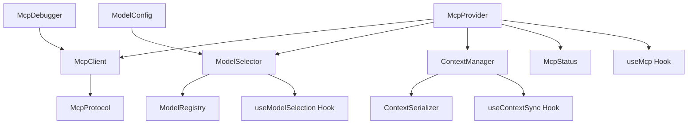
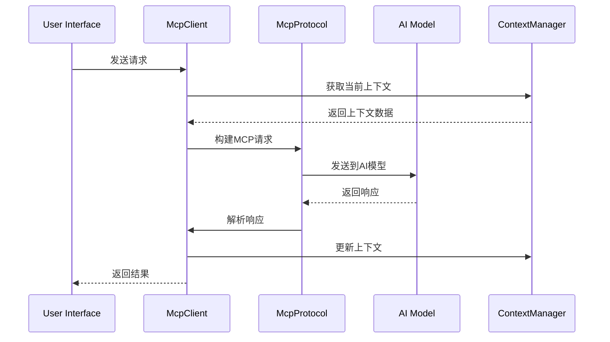

# KilocodeMcp MCP协议组件

## 1. 模块概述

KilocodeMcp组件模块负责实现Model Context Protocol (MCP)的集成，提供与外部AI模型和服务的标准化通信接口。该模块是Kilocode与各种AI服务提供商进行交互的核心桥梁。

### 核心功能

- MCP协议的完整实现
- 多AI模型提供商支持
- 上下文管理和传递
- 模型切换和负载均衡
- 请求/响应缓存机制
- 错误处理和重试机制

### 业务价值

- 统一的AI模型接入标准
- 灵活的模型切换能力
- 高效的上下文管理
- 可扩展的服务架构

## 2. 组件列表

### 2.1 核心组件

| 组件名称       | 文件路径           | 功能描述                       |
| -------------- | ------------------ | ------------------------------ |
| McpProvider    | McpProvider.tsx    | MCP协议提供者，管理全局MCP状态 |
| McpClient      | McpClient.tsx      | MCP客户端，处理协议通信        |
| ModelSelector  | ModelSelector.tsx  | 模型选择器，切换AI模型         |
| ContextManager | ContextManager.tsx | 上下文管理器，处理对话上下文   |
| McpStatus      | McpStatus.tsx      | MCP连接状态显示                |
| ModelConfig    | ModelConfig.tsx    | 模型配置界面                   |
| McpDebugger    | McpDebugger.tsx    | MCP协议调试工具                |

### 2.2 Hook组件

| Hook名称          | 文件路径             | 功能描述        |
| ----------------- | -------------------- | --------------- |
| useMcp            | useMcp.ts            | MCP协议核心Hook |
| useModelSelection | useModelSelection.ts | 模型选择管理    |
| useContextSync    | useContextSync.ts    | 上下文同步管理  |

### 2.3 工具类

| 类名              | 文件路径             | 功能描述         |
| ----------------- | -------------------- | ---------------- |
| McpProtocol       | McpProtocol.ts       | MCP协议实现      |
| ModelRegistry     | ModelRegistry.ts     | 模型注册表       |
| ContextSerializer | ContextSerializer.ts | 上下文序列化工具 |

### 2.4 组件层次关系



## 3. 技术架构

### 3.1 设计模式

- **提供者模式**: 通过McpProvider管理全局MCP状态
- **策略模式**: 支持多种AI模型提供商的不同实现
- **观察者模式**: 监听模型状态变化和上下文更新
- **工厂模式**: 动态创建不同类型的模型客户端

### 3.2 状态管理

```typescript
interface McpState {
	// 连接状态
	connectionStatus: ConnectionStatus
	activeConnections: Map<string, McpConnection>

	// 模型管理
	availableModels: ModelInfo[]
	selectedModel: ModelInfo | null
	modelCapabilities: Map<string, ModelCapability[]>

	// 上下文管理
	currentContext: ConversationContext
	contextHistory: ContextSnapshot[]
	maxContextLength: number

	// 请求管理
	pendingRequests: Map<string, McpRequest>
	requestQueue: McpRequest[]
	rateLimits: Map<string, RateLimit>

	// 配置
	mcpConfig: McpConfiguration
	modelConfigs: Map<string, ModelConfiguration>
}

interface McpConnection {
	id: string
	provider: string
	model: string
	status: ConnectionStatus
	lastActivity: Date
	capabilities: string[]
	metadata: Record<string, any>
}

interface ConversationContext {
	id: string
	messages: ContextMessage[]
	systemPrompt?: string
	temperature?: number
	maxTokens?: number
	metadata: Record<string, any>
}
```

### 3.3 数据流向



## 4. API文档

### 4.1 McpProvider Props

```typescript
interface McpProviderProps {
	/** 子组件 */
	children: React.ReactNode
	/** 初始配置 */
	initialConfig?: McpConfiguration
	/** 默认模型 */
	defaultModel?: string
	/** 调试模式 */
	debugMode?: boolean
}

interface McpConfiguration {
	/** 支持的提供商 */
	providers: ProviderConfig[]
	/** 默认超时时间 */
	timeout: number
	/** 重试配置 */
	retryConfig: RetryConfig
	/** 缓存配置 */
	cacheConfig: CacheConfig
}
```

### 4.2 useMcp Hook

```typescript
interface UseMcpResult {
	/** 当前MCP状态 */
	state: McpState
	/** 发送消息 */
	sendMessage: (message: string, options?: SendOptions) => Promise<McpResponse>
	/** 切换模型 */
	switchModel: (modelId: string) => Promise<void>
	/** 获取模型列表 */
	getAvailableModels: () => Promise<ModelInfo[]>
	/** 更新上下文 */
	updateContext: (context: Partial<ConversationContext>) => void
	/** 清除上下文 */
	clearContext: () => void
	/** 连接状态 */
	connectionStatus: ConnectionStatus
	/** 错误信息 */
	error: McpError | null
}

interface SendOptions {
	/** 流式响应 */
	stream?: boolean
	/** 温度参数 */
	temperature?: number
	/** 最大令牌数 */
	maxTokens?: number
	/** 系统提示 */
	systemPrompt?: string
}
```

### 4.3 ModelSelector Props

```typescript
interface ModelSelectorProps {
	/** 当前选中的模型 */
	selectedModel?: ModelInfo
	/** 可用模型列表 */
	availableModels: ModelInfo[]
	/** 模型变更回调 */
	onModelChange: (model: ModelInfo) => void
	/** 是否显示模型详情 */
	showDetails?: boolean
	/** 是否允许配置 */
	allowConfiguration?: boolean
}

interface ModelInfo {
	id: string
	name: string
	provider: string
	description: string
	capabilities: ModelCapability[]
	pricing: PricingInfo
	limits: ModelLimits
	status: ModelStatus
}
```

## 5. 使用示例

### 5.1 基础MCP集成

```tsx
import { McpProvider, useMcp } from "@/components/kilocodeMcp"

function App() {
	const mcpConfig = {
		providers: [
			{
				name: "openai",
				apiKey: process.env.OPENAI_API_KEY,
				models: ["gpt-4", "gpt-3.5-turbo"],
			},
			{
				name: "anthropic",
				apiKey: process.env.ANTHROPIC_API_KEY,
				models: ["claude-3-opus", "claude-3-sonnet"],
			},
		],
		timeout: 30000,
		retryConfig: {
			maxRetries: 3,
			backoffMultiplier: 2,
		},
	}

	return (
		<McpProvider initialConfig={mcpConfig} defaultModel="gpt-4">
			<ChatInterface />
		</McpProvider>
	)
}

function ChatInterface() {
	const { sendMessage, switchModel, state } = useMcp()
	const [message, setMessage] = useState("")
	const [response, setResponse] = useState("")

	const handleSendMessage = async () => {
		try {
			const result = await sendMessage(message, {
				stream: true,
				temperature: 0.7,
			})
			setResponse(result.content)
		} catch (error) {
			console.error("Failed to send message:", error)
		}
	}

	return (
		<div>
			<ModelSelector
				selectedModel={state.selectedModel}
				availableModels={state.availableModels}
				onModelChange={switchModel}
			/>
			<input value={message} onChange={(e) => setMessage(e.target.value)} placeholder="Type your message..." />
			<button onClick={handleSendMessage}>Send</button>
			<div>{response}</div>
		</div>
	)
}
```

### 5.2 流式响应处理

```tsx
import { useMcp } from "@/components/kilocodeMcp"

function StreamingChat() {
	const { sendMessage } = useMcp()
	const [streamingResponse, setStreamingResponse] = useState("")

	const handleStreamingMessage = async (message: string) => {
		setStreamingResponse("")

		try {
			const stream = await sendMessage(message, {
				stream: true,
			})

			for await (const chunk of stream) {
				setStreamingResponse((prev) => prev + chunk.content)
			}
		} catch (error) {
			console.error("Streaming failed:", error)
		}
	}

	return (
		<div>
			<div className="streaming-response">
				{streamingResponse}
				<span className="cursor">|</span>
			</div>
		</div>
	)
}
```

### 5.3 上下文管理

```tsx
import { useContextSync } from "@/components/kilocodeMcp"

function ContextAwareChat() {
	const { context, updateContext, clearContext, saveSnapshot, restoreSnapshot } = useContextSync()

	const handleContextUpdate = (newMessage: ContextMessage) => {
		updateContext({
			messages: [...context.messages, newMessage],
		})
	}

	const handleSaveContext = async () => {
		const snapshot = await saveSnapshot()
		console.log("Context saved:", snapshot.id)
	}

	const handleRestoreContext = async (snapshotId: string) => {
		await restoreSnapshot(snapshotId)
	}

	return (
		<div>
			<div className="context-info">
				Messages: {context.messages.length}
				<button onClick={handleSaveContext}>Save Context</button>
				<button onClick={clearContext}>Clear Context</button>
			</div>

			<div className="context-messages">
				{context.messages.map((message) => (
					<div key={message.id} className={`message ${message.role}`}>
						{message.content}
					</div>
				))}
			</div>
		</div>
	)
}
```

## 6. 样式和主题

### 6.1 CSS类名规范

```css
/* MCP状态指示器 */
.mcp-status {
	display: flex;
	align-items: center;
	gap: 8px;
	padding: 8px 12px;
	border-radius: 4px;
	font-size: 12px;
	font-weight: 500;
}

.mcp-status.connected {
	background-color: rgba(40, 167, 69, 0.1);
	color: var(--vscode-testing-iconPassed);
	border: 1px solid var(--vscode-testing-iconPassed);
}

.mcp-status.connecting {
	background-color: rgba(255, 193, 7, 0.1);
	color: var(--vscode-notificationsWarningIcon-foreground);
	border: 1px solid var(--vscode-notificationsWarningIcon-foreground);
}

.mcp-status.disconnected {
	background-color: rgba(220, 53, 69, 0.1);
	color: var(--vscode-notificationsErrorIcon-foreground);
	border: 1px solid var(--vscode-notificationsErrorIcon-foreground);
}

/* 模型选择器 */
.model-selector {
	position: relative;
	min-width: 200px;
}

.model-selector-trigger {
	display: flex;
	align-items: center;
	justify-content: space-between;
	padding: 8px 12px;
	background-color: var(--vscode-input-background);
	border: 1px solid var(--vscode-input-border);
	border-radius: 4px;
	cursor: pointer;
	transition: border-color 0.2s;
}

.model-selector-trigger:hover {
	border-color: var(--vscode-focusBorder);
}

.model-selector-dropdown {
	position: absolute;
	top: 100%;
	left: 0;
	right: 0;
	z-index: 1000;
	background-color: var(--vscode-dropdown-background);
	border: 1px solid var(--vscode-dropdown-border);
	border-radius: 4px;
	box-shadow: 0 4px 12px rgba(0, 0, 0, 0.15);
	max-height: 300px;
	overflow-y: auto;
}

.model-option {
	padding: 12px 16px;
	cursor: pointer;
	transition: background-color 0.2s;
}

.model-option:hover {
	background-color: var(--vscode-list-hoverBackground);
}

.model-option.selected {
	background-color: var(--vscode-list-activeSelectionBackground);
	color: var(--vscode-list-activeSelectionForeground);
}

/* 上下文管理器 */
.context-manager {
	display: flex;
	flex-direction: column;
	height: 100%;
}

.context-header {
	display: flex;
	align-items: center;
	justify-content: space-between;
	padding: 12px 16px;
	border-bottom: 1px solid var(--vscode-panel-border);
	background-color: var(--vscode-editor-background);
}

.context-messages {
	flex: 1;
	overflow-y: auto;
	padding: 16px;
}

.context-message {
	margin-bottom: 16px;
	padding: 12px;
	border-radius: 6px;
}

.context-message.user {
	background-color: var(--vscode-button-background);
	color: var(--vscode-button-foreground);
	margin-left: 20%;
}

.context-message.assistant {
	background-color: var(--vscode-input-background);
	border: 1px solid var(--vscode-input-border);
	margin-right: 20%;
}

.context-message.system {
	background-color: var(--vscode-badge-background);
	color: var(--vscode-badge-foreground);
	font-style: italic;
	text-align: center;
}
```

### 6.2 主题变量

```typescript
const mcpTheme = {
	colors: {
		primary: "var(--vscode-button-background)",
		secondary: "var(--vscode-button-secondaryBackground)",
		success: "var(--vscode-testing-iconPassed)",
		warning: "var(--vscode-notificationsWarningIcon-foreground)",
		error: "var(--vscode-notificationsErrorIcon-foreground)",
		info: "var(--vscode-notificationsInfoIcon-foreground)",
	},
	status: {
		connected: {
			color: "var(--vscode-testing-iconPassed)",
			background: "rgba(40, 167, 69, 0.1)",
			border: "var(--vscode-testing-iconPassed)",
		},
		connecting: {
			color: "var(--vscode-notificationsWarningIcon-foreground)",
			background: "rgba(255, 193, 7, 0.1)",
			border: "var(--vscode-notificationsWarningIcon-foreground)",
		},
		disconnected: {
			color: "var(--vscode-notificationsErrorIcon-foreground)",
			background: "rgba(220, 53, 69, 0.1)",
			border: "var(--vscode-notificationsErrorIcon-foreground)",
		},
	},
	models: {
		openai: "#10A37F",
		anthropic: "#D97706",
		google: "#4285F4",
		microsoft: "#0078D4",
		default: "var(--vscode-foreground)",
	},
}
```

## 7. 测试策略

### 7.1 单元测试

```typescript
// useMcp.spec.tsx
describe('useMcp', () => {
  it('should initialize with default configuration', () => {
    const { result } = renderHook(() => useMcp(), {
      wrapper: ({ children }) => (
        <McpProvider>{children}</McpProvider>
      ),
    });

    expect(result.current.state.connectionStatus).toBe('disconnected');
    expect(result.current.state.availableModels).toHaveLength(0);
  });

  it('should send message successfully', async () => {
    const mockResponse = { content: 'Hello, world!' };
    jest.spyOn(McpProtocol.prototype, 'sendMessage').mockResolvedValue(mockResponse);

    const { result } = renderHook(() => useMcp(), {
      wrapper: ({ children }) => (
        <McpProvider>{children}</McpProvider>
      ),
    });

    const response = await result.current.sendMessage('Hello');
    expect(response).toEqual(mockResponse);
  });

  it('should handle connection errors', async () => {
    const mockError = new Error('Connection failed');
    jest.spyOn(McpProtocol.prototype, 'connect').mockRejectedValue(mockError);

    const { result } = renderHook(() => useMcp(), {
      wrapper: ({ children }) => (
        <McpProvider>{children}</McpProvider>
      ),
    });

    await act(async () => {
      try {
        await result.current.switchModel('gpt-4');
      } catch (error) {
        expect(error).toBe(mockError);
      }
    });

    expect(result.current.error).toBe(mockError);
  });
});
```

### 7.2 集成测试

```typescript
// McpIntegration.spec.tsx
describe('MCP Integration', () => {
  it('should handle full conversation flow', async () => {
    const { getByText, getByPlaceholderText } = render(
      <McpProvider>
        <ChatInterface />
      </McpProvider>
    );

    // 选择模型
    fireEvent.click(getByText('Select Model'));
    fireEvent.click(getByText('GPT-4'));

    // 发送消息
    const input = getByPlaceholderText('Type your message...');
    fireEvent.change(input, { target: { value: 'Hello, AI!' } });
    fireEvent.click(getByText('Send'));

    // 等待响应
    await waitFor(() => {
      expect(getByText(/Hello/)).toBeInTheDocument();
    });
  });

  it('should handle model switching during conversation', async () => {
    const { getByText } = render(
      <McpProvider>
        <ChatInterface />
      </McpProvider>
    );

    // 开始对话
    fireEvent.click(getByText('Send'));

    // 切换模型
    fireEvent.click(getByText('GPT-4'));
    fireEvent.click(getByText('Claude-3'));

    // 验证上下文保持
    expect(getByText('Context preserved')).toBeInTheDocument();
  });
});
```

## 8. 性能优化

### 8.1 请求缓存

```typescript
import { LRUCache } from "lru-cache"

class McpCache {
	private cache = new LRUCache<string, McpResponse>({
		max: 1000,
		ttl: 1000 * 60 * 10, // 10分钟
	})

	generateKey(request: McpRequest): string {
		return `${request.model}:${JSON.stringify(request.messages)}:${request.temperature}`
	}

	get(request: McpRequest): McpResponse | undefined {
		return this.cache.get(this.generateKey(request))
	}

	set(request: McpRequest, response: McpResponse): void {
		this.cache.set(this.generateKey(request), response)
	}

	clear(): void {
		this.cache.clear()
	}
}
```

### 8.2 连接池管理

```typescript
class McpConnectionPool {
	private connections = new Map<string, McpConnection>()
	private maxConnections = 10
	private idleTimeout = 5 * 60 * 1000 // 5分钟

	async getConnection(provider: string, model: string): Promise<McpConnection> {
		const key = `${provider}:${model}`

		if (this.connections.has(key)) {
			const connection = this.connections.get(key)!
			if (connection.status === "connected") {
				connection.lastActivity = new Date()
				return connection
			}
		}

		if (this.connections.size >= this.maxConnections) {
			await this.closeIdleConnections()
		}

		const connection = await this.createConnection(provider, model)
		this.connections.set(key, connection)
		return connection
	}

	private async closeIdleConnections(): Promise<void> {
		const now = new Date()
		const toClose: string[] = []

		for (const [key, connection] of this.connections) {
			if (now.getTime() - connection.lastActivity.getTime() > this.idleTimeout) {
				toClose.push(key)
			}
		}

		for (const key of toClose) {
			const connection = this.connections.get(key)
			if (connection) {
				await connection.close()
				this.connections.delete(key)
			}
		}
	}
}
```

### 8.3 上下文压缩

```typescript
class ContextCompressor {
	private maxTokens = 4000
	private compressionRatio = 0.7

	compressContext(context: ConversationContext): ConversationContext {
		if (this.estimateTokens(context) <= this.maxTokens) {
			return context
		}

		// 保留系统消息和最近的消息
		const systemMessages = context.messages.filter((m) => m.role === "system")
		const userMessages = context.messages.filter((m) => m.role !== "system")

		const targetLength = Math.floor(userMessages.length * this.compressionRatio)
		const recentMessages = userMessages.slice(-targetLength)

		return {
			...context,
			messages: [...systemMessages, ...recentMessages],
		}
	}

	private estimateTokens(context: ConversationContext): number {
		return context.messages.reduce((total, message) => {
			return total + Math.ceil(message.content.length / 4) // 粗略估算
		}, 0)
	}
}
```

## 9. 可访问性

### 9.1 ARIA属性

```tsx
<div role="region" aria-label="MCP model selection and status" aria-describedby="mcp-description">
	<div id="mcp-description" className="sr-only">
		Model Context Protocol interface for AI model selection and communication
	</div>

	<div role="combobox" aria-expanded={isDropdownOpen} aria-haspopup="listbox" aria-labelledby="model-selector-label">
		<label id="model-selector-label">Select AI Model</label>
		<ModelSelector />
	</div>

	<div role="status" aria-live="polite" aria-label={`Connection status: ${connectionStatus}`}>
		<McpStatus status={connectionStatus} />
	</div>
</div>
```

### 9.2 键盘导航

```typescript
const useMcpKeyboardNavigation = () => {
	const handleKeyDown = useCallback((event: KeyboardEvent) => {
		switch (event.key) {
			case "Tab":
				// 在模型选项间导航
				if (event.shiftKey) {
					focusPreviousModel()
				} else {
					focusNextModel()
				}
				break
			case "Enter":
			case " ":
				// 选择当前聚焦的模型
				selectFocusedModel()
				break
			case "Escape":
				// 关闭模型选择器
				closeModelSelector()
				break
			case "F5":
				// 刷新模型列表
				event.preventDefault()
				refreshModels()
				break
		}
	}, [])

	useEffect(() => {
		document.addEventListener("keydown", handleKeyDown)
		return () => document.removeEventListener("keydown", handleKeyDown)
	}, [handleKeyDown])
}
```

## 10. 国际化

### 10.1 文本资源

```json
{
	"mcp.title": "Model Context Protocol",
	"mcp.status.connected": "Connected",
	"mcp.status.connecting": "Connecting",
	"mcp.status.disconnected": "Disconnected",
	"mcp.status.error": "Connection Error",
	"mcp.model.select": "Select Model",
	"mcp.model.current": "Current Model",
	"mcp.model.switch": "Switch Model",
	"mcp.model.configure": "Configure Model",
	"mcp.context.clear": "Clear Context",
	"mcp.context.save": "Save Context",
	"mcp.context.restore": "Restore Context",
	"mcp.context.messages": "{count} messages",
	"mcp.context.tokens": "{count} tokens",
	"mcp.request.sending": "Sending request...",
	"mcp.request.streaming": "Receiving response...",
	"mcp.request.completed": "Request completed",
	"mcp.request.failed": "Request failed",
	"mcp.error.connectionFailed": "Failed to connect to model provider",
	"mcp.error.requestTimeout": "Request timed out",
	"mcp.error.rateLimited": "Rate limit exceeded",
	"mcp.error.invalidResponse": "Invalid response from model",
	"mcp.debug.title": "MCP Debug Console",
	"mcp.debug.clearLogs": "Clear Logs",
	"mcp.debug.exportLogs": "Export Logs",
	"mcp.config.title": "Model Configuration",
	"mcp.config.temperature": "Temperature",
	"mcp.config.maxTokens": "Max Tokens",
	"mcp.config.systemPrompt": "System Prompt",
	"mcp.config.save": "Save Configuration",
	"mcp.config.reset": "Reset to Default"
}
```

### 10.2 模型信息本地化

```typescript
import { useTranslation } from "react-i18next"

const useLocalizedModelInfo = () => {
	const { t, i18n } = useTranslation()

	const getModelDisplayName = (model: ModelInfo) => {
		const key = `models.${model.id}.name`
		const translated = t(key)
		return translated !== key ? translated : model.name
	}

	const getModelDescription = (model: ModelInfo) => {
		const key = `models.${model.id}.description`
		const translated = t(key)
		return translated !== key ? translated : model.description
	}

	const formatModelCapabilities = (capabilities: ModelCapability[]) => {
		return capabilities.map((cap) => t(`capabilities.${cap}`)).join(", ")
	}

	return {
		getModelDisplayName,
		getModelDescription,
		formatModelCapabilities,
	}
}
```

## 11. 错误处理

### 11.1 连接错误处理

```typescript
class McpErrorHandler {
	private retryConfig: RetryConfig
	private errorCallbacks: Map<string, (error: McpError) => void> = new Map()

	async handleConnectionError(error: McpError, connection: McpConnection): Promise<void> {
		console.error("MCP connection error:", error)

		switch (error.type) {
			case "NETWORK_ERROR":
				await this.handleNetworkError(error, connection)
				break
			case "AUTH_ERROR":
				await this.handleAuthError(error, connection)
				break
			case "RATE_LIMIT_ERROR":
				await this.handleRateLimitError(error, connection)
				break
			case "MODEL_ERROR":
				await this.handleModelError(error, connection)
				break
			default:
				await this.handleGenericError(error, connection)
		}
	}

	private async handleNetworkError(error: McpError, connection: McpConnection): Promise<void> {
		if (this.shouldRetry(error)) {
			const delay = this.calculateBackoffDelay(error.retryCount || 0)
			setTimeout(() => {
				this.retryConnection(connection)
			}, delay)
		} else {
			this.notifyConnectionFailed(connection, error)
		}
	}

	private async handleRateLimitError(error: McpError, connection: McpConnection): Promise<void> {
		const resetTime = error.resetTime || Date.now() + 60000 // 默认1分钟后重试
		const delay = resetTime - Date.now()

		setTimeout(
			() => {
				this.retryConnection(connection)
			},
			Math.max(delay, 0),
		)
	}

	private shouldRetry(error: McpError): boolean {
		const maxRetries = this.retryConfig.maxRetries || 3
		return (error.retryCount || 0) < maxRetries && error.retryable !== false
	}
}
```

### 11.2 请求错误处理

```typescript
const useMcpErrorHandling = () => {
	const [errors, setErrors] = useState<McpError[]>([])

	const handleRequestError = useCallback(async (error: McpError, request: McpRequest) => {
		setErrors((prev) => [...prev, error])

		// 根据错误类型采取不同的处理策略
		switch (error.code) {
			case "CONTEXT_TOO_LONG":
				// 自动压缩上下文并重试
				const compressedRequest = await compressRequestContext(request)
				return retryRequest(compressedRequest)

			case "MODEL_OVERLOADED":
				// 切换到备用模型
				const fallbackModel = await getFallbackModel(request.model)
				if (fallbackModel) {
					return retryWithModel(request, fallbackModel)
				}
				break

			case "INVALID_API_KEY":
				// 提示用户更新API密钥
				showApiKeyUpdateDialog()
				break

			default:
				// 显示通用错误消息
				showErrorNotification(error.message)
		}
	}, [])

	const clearErrors = useCallback(() => {
		setErrors([])
	}, [])

	return { errors, handleRequestError, clearErrors }
}
```

## 12. 与其他模块的集成

### 12.1 与聊天模块集成

```typescript
// 与聊天界面的集成
const integrateMcpWithChat = () => {
	const { sendMessage: mcpSendMessage } = useMcp()
	const { addMessage, updateMessage } = useChat()

	const sendChatMessage = async (content: string) => {
		// 添加用户消息到聊天界面
		const userMessage = addMessage({
			role: "user",
			content,
			timestamp: new Date(),
		})

		// 添加占位符助手消息
		const assistantMessage = addMessage({
			role: "assistant",
			content: "",
			timestamp: new Date(),
			status: "pending",
		})

		try {
			// 通过MCP发送消息
			const response = await mcpSendMessage(content, { stream: true })

			// 更新助手消息
			updateMessage(assistantMessage.id, {
				content: response.content,
				status: "completed",
			})
		} catch (error) {
			updateMessage(assistantMessage.id, {
				content: "Sorry, I encountered an error processing your request.",
				status: "error",
				error: error.message,
			})
		}
	}

	return { sendChatMessage }
}
```

### 12.2 与设置模块集成

```typescript
// 与设置系统的集成
const integrateMcpWithSettings = () => {
	const { updateConfig } = useMcp()
	const { settings, updateSettings } = useSettings()

	const syncMcpSettings = useCallback(() => {
		const mcpSettings = {
			defaultModel: settings.ai.defaultModel,
			temperature: settings.ai.temperature,
			maxTokens: settings.ai.maxTokens,
			providers: settings.ai.providers,
		}

		updateConfig(mcpSettings)
	}, [settings, updateConfig])

	// 监听设置变化
	useEffect(() => {
		syncMcpSettings()
	}, [settings.ai, syncMcpSettings])

	return { syncMcpSettings }
}
```

## 13. 最佳实践

### 13.1 模型选择策略

- 根据任务类型自动推荐合适的模型
- 考虑成本、速度和质量的平衡
- 实现智能的模型切换和负载均衡

### 13.2 上下文管理

- 实现智能的上下文压缩和截断
- 保持重要信息的完整性
- 提供上下文快照和恢复功能

### 13.3 错误恢复

- 实现优雅的错误处理和重试机制
- 提供清晰的错误信息和解决建议
- 支持自动故障转移和备用方案

### 13.4 性能优化

- 使用请求缓存减少重复调用
- 实现连接池管理提高效率
- 优化上下文传输减少延迟
