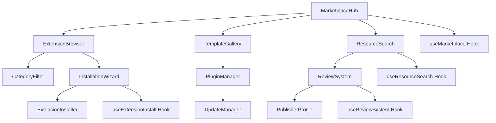
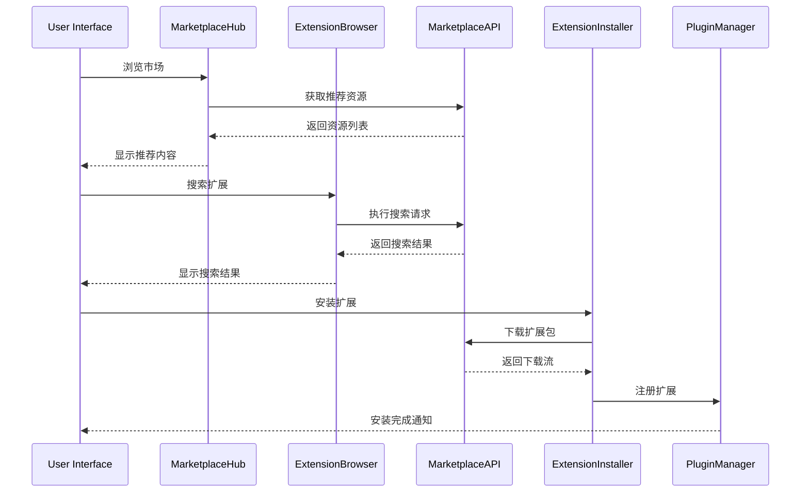

# Marketplace 市场组件

## 1. 模块概述

Marketplace市场组件模块是Kilocode应用的扩展市场系统，为用户提供插件、模板、工具等资源的浏览、搜索、安装和管理功能。该模块是连接开发者生态和用户需求的重要桥梁。

### 核心功能

- 扩展资源浏览和搜索
- 插件安装和卸载管理
- 模板下载和应用
- 用户评价和反馈系统
- 开发者资源发布
- 版本管理和更新通知

### 业务价值

- 丰富应用功能和扩展性
- 构建开发者生态系统
- 提升用户开发效率
- 促进社区协作和分享

## 2. 组件列表

### 2.1 核心组件

| 组件名称           | 文件路径               | 功能描述                     |
| ------------------ | ---------------------- | ---------------------------- |
| MarketplaceHub     | MarketplaceHub.tsx     | 市场主页，展示推荐和热门资源 |
| ExtensionBrowser   | ExtensionBrowser.tsx   | 扩展浏览器，分类展示各类扩展 |
| PluginManager      | PluginManager.tsx      | 插件管理器，管理已安装插件   |
| TemplateGallery    | TemplateGallery.tsx    | 模板画廊，展示代码模板       |
| ResourceSearch     | ResourceSearch.tsx     | 资源搜索，智能搜索和过滤     |
| InstallationWizard | InstallationWizard.tsx | 安装向导，引导用户安装资源   |
| ReviewSystem       | ReviewSystem.tsx       | 评价系统，用户评价和反馈     |
| PublisherProfile   | PublisherProfile.tsx   | 发布者档案，展示开发者信息   |
| UpdateManager      | UpdateManager.tsx      | 更新管理器，处理资源更新     |
| CategoryFilter     | CategoryFilter.tsx     | 分类过滤器，按类别筛选资源   |

### 2.2 Hook组件

| Hook名称            | 文件路径               | 功能描述         |
| ------------------- | ---------------------- | ---------------- |
| useMarketplace      | useMarketplace.ts      | 市场核心功能Hook |
| useExtensionInstall | useExtensionInstall.ts | 扩展安装功能Hook |
| useResourceSearch   | useResourceSearch.ts   | 资源搜索功能Hook |
| useReviewSystem     | useReviewSystem.ts     | 评价系统功能Hook |

### 2.3 服务类

| 类名               | 文件路径              | 功能描述     |
| ------------------ | --------------------- | ------------ |
| MarketplaceAPI     | MarketplaceAPI.ts     | 市场API服务  |
| ExtensionInstaller | ExtensionInstaller.ts | 扩展安装服务 |
| ResourceDownloader | ResourceDownloader.ts | 资源下载服务 |
| ReviewService      | ReviewService.ts      | 评价服务     |

### 2.4 组件层次关系



## 3. 技术架构

### 3.1 设计模式

- **门面模式**: MarketplaceHub作为统一入口管理各个子系统
- **策略模式**: 支持多种安装策略和搜索算法
- **观察者模式**: 监听安装进度和更新通知
- **工厂模式**: 动态创建不同类型的资源处理器

### 3.2 状态管理

```typescript
interface MarketplaceState {
	// 市场状态
	isLoading: boolean
	currentView: MarketplaceView
	selectedCategory: Category | null
	searchQuery: string

	// 资源数据
	extensions: Extension[]
	templates: Template[]
	plugins: Plugin[]
	featuredResources: Resource[]

	// 安装状态
	installedExtensions: Map<string, InstalledExtension>
	installationQueue: InstallationTask[]
	downloadProgress: Map<string, DownloadProgress>

	// 用户交互
	favorites: string[]
	recentlyViewed: string[]
	userReviews: Review[]

	// 搜索和过滤
	searchResults: SearchResult[]
	activeFilters: Filter[]
	sortBy: SortOption

	// 配置
	marketplaceConfig: MarketplaceConfiguration
	userPreferences: UserPreferences
}

interface Extension {
	id: string
	name: string
	description: string
	version: string
	author: Publisher
	category: Category
	tags: string[]
	downloadCount: number
	rating: number
	reviewCount: number
	size: number
	lastUpdated: Date
	compatibility: CompatibilityInfo
	screenshots: string[]
	readme: string
	changelog: string
	license: string
	repository: string
	homepage: string
}

interface InstallationTask {
	id: string
	resourceId: string
	resourceType: ResourceType
	status: InstallationStatus
	progress: number
	startTime: Date
	estimatedTime?: number
	error?: string
}

enum InstallationStatus {
	PENDING = "pending",
	DOWNLOADING = "downloading",
	INSTALLING = "installing",
	COMPLETED = "completed",
	FAILED = "failed",
	CANCELLED = "cancelled",
}
```

### 3.3 数据流向



## 4. API文档

### 4.1 MarketplaceHub Props

```typescript
interface MarketplaceHubProps {
	/** 初始视图 */
	initialView?: MarketplaceView
	/** 市场配置 */
	config?: MarketplaceConfiguration
	/** 资源选择回调 */
	onResourceSelect?: (resource: Resource) => void
	/** 安装完成回调 */
	onInstallComplete?: (resource: Resource) => void
	/** 错误处理回调 */
	onError?: (error: MarketplaceError) => void
}

interface MarketplaceConfiguration {
	/** API端点 */
	apiEndpoint: string
	/** 支持的资源类型 */
	supportedTypes: ResourceType[]
	/** 安装目录 */
	installDirectory: string
	/** 自动更新设置 */
	autoUpdate: boolean
	/** 缓存配置 */
	cache: CacheConfig
}
```

### 4.2 useMarketplace Hook

```typescript
interface UseMarketplaceResult {
	/** 当前状态 */
	state: MarketplaceState
	/** 搜索资源 */
	searchResources: (query: string, filters?: Filter[]) => Promise<SearchResult[]>
	/** 安装资源 */
	installResource: (resourceId: string) => Promise<InstallationResult>
	/** 卸载资源 */
	uninstallResource: (resourceId: string) => Promise<void>
	/** 更新资源 */
	updateResource: (resourceId: string) => Promise<UpdateResult>
	/** 获取资源详情 */
	getResourceDetails: (resourceId: string) => Promise<ResourceDetails>
	/** 提交评价 */
	submitReview: (resourceId: string, review: ReviewInput) => Promise<Review>
	/** 添加到收藏 */
	addToFavorites: (resourceId: string) => Promise<void>
	/** 获取安装历史 */
	getInstallationHistory: () => InstallationRecord[]
	/** 检查更新 */
	checkForUpdates: () => Promise<UpdateInfo[]>
	/** 错误信息 */
	error: MarketplaceError | null
}
```

### 4.3 ExtensionBrowser Props

```typescript
interface ExtensionBrowserProps {
	/** 显示类别 */
	category?: Category
	/** 搜索查询 */
	searchQuery?: string
	/** 排序选项 */
	sortBy?: SortOption
	/** 过滤器 */
	filters?: Filter[]
	/** 每页显示数量 */
	pageSize?: number
	/** 扩展选择回调 */
	onExtensionSelect?: (extension: Extension) => void
	/** 安装回调 */
	onInstall?: (extension: Extension) => void
}

interface Filter {
	type: FilterType
	value: string | number | boolean
	operator: FilterOperator
}

enum FilterType {
	CATEGORY = "category",
	RATING = "rating",
	DOWNLOAD_COUNT = "downloadCount",
	LAST_UPDATED = "lastUpdated",
	SIZE = "size",
	COMPATIBILITY = "compatibility",
}

enum SortOption {
	RELEVANCE = "relevance",
	POPULARITY = "popularity",
	RATING = "rating",
	RECENT = "recent",
	NAME = "name",
	SIZE = "size",
}
```

## 5. 使用示例

### 5.1 基础市场浏览

```tsx
import { MarketplaceHub, useMarketplace } from "@/components/marketplace"

function MarketplaceBrowseExample() {
	const { state, searchResources, installResource } = useMarketplace()
	const [searchQuery, setSearchQuery] = useState("")
	const [selectedResource, setSelectedResource] = useState<Resource | null>(null)

	const handleSearch = async () => {
		try {
			const results = await searchResources(searchQuery, [
				{ type: FilterType.CATEGORY, value: "development", operator: "equals" },
				{ type: FilterType.RATING, value: 4, operator: "gte" },
			])

			console.log("Search results:", results)
		} catch (error) {
			console.error("Search failed:", error)
		}
	}

	const handleInstall = async (resource: Resource) => {
		try {
			const result = await installResource(resource.id)
			if (result.success) {
				toast.success(`${resource.name} installed successfully!`)
			}
		} catch (error) {
			toast.error(`Failed to install ${resource.name}`)
		}
	}

	return (
		<div className="marketplace-browse">
			<div className="search-section">
				<input
					type="text"
					value={searchQuery}
					onChange={(e) => setSearchQuery(e.target.value)}
					placeholder="Search extensions, templates, and tools..."
					className="search-input"
				/>
				<button onClick={handleSearch} className="search-button">
					Search
				</button>
			</div>

			<MarketplaceHub
				initialView="browse"
				onResourceSelect={setSelectedResource}
				onInstallComplete={(resource) => {
					toast.success(`${resource.name} installed!`)
				}}
				onError={(error) => {
					toast.error(error.message)
				}}
			/>

			{selectedResource && (
				<ResourceDetailsModal
					resource={selectedResource}
					onInstall={() => handleInstall(selectedResource)}
					onClose={() => setSelectedResource(null)}
				/>
			)}
		</div>
	)
}
```

### 5.2 扩展管理

```tsx
import { PluginManager, useExtensionInstall } from "@/components/marketplace"

function ExtensionManagementExample() {
	const { installedExtensions, installExtension, uninstallExtension, updateExtension, checkForUpdates } =
		useExtensionInstall()

	const [availableUpdates, setAvailableUpdates] = useState<UpdateInfo[]>([])

	useEffect(() => {
		const checkUpdates = async () => {
			const updates = await checkForUpdates()
			setAvailableUpdates(updates)
		}

		checkUpdates()
		const interval = setInterval(checkUpdates, 60000 * 60) // 每小时检查一次

		return () => clearInterval(interval)
	}, [checkForUpdates])

	const handleBatchUpdate = async () => {
		for (const update of availableUpdates) {
			try {
				await updateExtension(update.extensionId)
			} catch (error) {
				console.error(`Failed to update ${update.name}:`, error)
			}
		}
	}

	const renderExtensionCard = (extension: InstalledExtension) => (
		<div key={extension.id} className="extension-card">
			<div className="extension-info">
				<h3>{extension.name}</h3>
				<p>{extension.description}</p>
				<div className="extension-meta">
					<span>Version: {extension.version}</span>
					<span>Size: {formatSize(extension.size)}</span>
					<span>Installed: {formatDate(extension.installedDate)}</span>
				</div>
			</div>

			<div className="extension-actions">
				<button onClick={() => uninstallExtension(extension.id)} className="uninstall-button">
					Uninstall
				</button>

				{availableUpdates.some((u) => u.extensionId === extension.id) && (
					<button onClick={() => updateExtension(extension.id)} className="update-button">
						Update Available
					</button>
				)}

				<button
					onClick={() => toggleExtension(extension.id)}
					className={`toggle-button ${extension.enabled ? "enabled" : "disabled"}`}>
					{extension.enabled ? "Disable" : "Enable"}
				</button>
			</div>
		</div>
	)

	return (
		<div className="extension-management">
			<div className="management-header">
				<h2>Installed Extensions</h2>
				<div className="header-actions">
					{availableUpdates.length > 0 && (
						<button onClick={handleBatchUpdate} className="batch-update-button">
							Update All ({availableUpdates.length})
						</button>
					)}
					<button onClick={checkForUpdates} className="check-updates-button">
						Check for Updates
					</button>
				</div>
			</div>

			<div className="extensions-grid">{Array.from(installedExtensions.values()).map(renderExtensionCard)}</div>

			{installedExtensions.size === 0 && (
				<div className="empty-state">
					<p>No extensions installed yet.</p>
					<button onClick={() => navigateToMarketplace()}>Browse Marketplace</button>
				</div>
			)}
		</div>
	)
}
```

### 5.3 模板画廊

```tsx
import { TemplateGallery, useMarketplace } from "@/components/marketplace"

function TemplateGalleryExample() {
	const { state, searchResources } = useMarketplace()
	const [selectedCategory, setSelectedCategory] = useState<Category | null>(null)
	const [templates, setTemplates] = useState<Template[]>([])

	useEffect(() => {
		const loadTemplates = async () => {
			const filters = selectedCategory
				? [{ type: FilterType.CATEGORY, value: selectedCategory.id, operator: "equals" }]
				: []

			const results = await searchResources("", filters)
			const templateResults = results.filter((r) => r.type === "template") as Template[]
			setTemplates(templateResults)
		}

		loadTemplates()
	}, [selectedCategory, searchResources])

	const handleTemplateUse = async (template: Template) => {
		try {
			// 下载并应用模板
			const templateContent = await downloadTemplate(template.id)
			await applyTemplate(templateContent)

			toast.success(`Template "${template.name}" applied successfully!`)
		} catch (error) {
			toast.error(`Failed to apply template: ${error.message}`)
		}
	}

	const renderTemplateCard = (template: Template) => (
		<div key={template.id} className="template-card">
			<div className="template-preview">
				{template.screenshots.length > 0 ? (
					
				) : (
					<div className="no-preview">
						<CodeIcon />
					</div>
				)}
			</div>

			<div className="template-info">
				<h3>{template.name}</h3>
				<p>{template.description}</p>

				<div className="template-meta">
					<span className="category">{template.category.name}</span>
					<span className="downloads">{template.downloadCount} downloads</span>
					<div className="rating">
						<StarRating value={template.rating} />
						<span>({template.reviewCount})</span>
					</div>
				</div>

				<div className="template-tags">
					{template.tags.map((tag) => (
						<span key={tag} className="tag">
							{tag}
						</span>
					))}
				</div>
			</div>

			<div className="template-actions">
				<button onClick={() => handleTemplateUse(template)} className="use-template-button">
					Use Template
				</button>
				<button onClick={() => previewTemplate(template)} className="preview-button">
					Preview
				</button>
				<button onClick={() => addToFavorites(template.id)} className="favorite-button">
					<HeartIcon />
				</button>
			</div>
		</div>
	)

	return (
		<div className="template-gallery">
			<div className="gallery-header">
				<h2>Code Templates</h2>
				<CategoryFilter
					categories={state.categories}
					selectedCategory={selectedCategory}
					onCategorySelect={setSelectedCategory}
				/>
			</div>

			<div className="templates-grid">{templates.map(renderTemplateCard)}</div>

			{templates.length === 0 && (
				<div className="empty-state">
					<p>No templates found for the selected category.</p>
				</div>
			)}
		</div>
	)
}
```

## 6. 样式和主题

### 6.1 CSS类名规范

```css
/* 市场主容器 */
.marketplace-hub {
	display: flex;
	flex-direction: column;
	height: 100vh;
	background-color: var(--vscode-editor-background);
}

/* 市场导航 */
.marketplace-nav {
	display: flex;
	align-items: center;
	gap: 16px;
	padding: 12px 20px;
	background-color: var(--vscode-titleBar-activeBackground);
	border-bottom: 1px solid var(--vscode-titleBar-border);
}

.nav-item {
	padding: 8px 16px;
	border-radius: 4px;
	cursor: pointer;
	transition: background-color 0.2s;
}

.nav-item:hover {
	background-color: var(--vscode-titleBar-inactiveBackground);
}

.nav-item.active {
	background-color: var(--vscode-button-background);
	color: var(--vscode-button-foreground);
}

/* 搜索区域 */
.search-section {
	display: flex;
	align-items: center;
	gap: 12px;
	padding: 16px 20px;
	background-color: var(--vscode-sideBar-background);
	border-bottom: 1px solid var(--vscode-sideBar-border);
}

.search-input {
	flex: 1;
	padding: 8px 12px;
	background-color: var(--vscode-input-background);
	border: 1px solid var(--vscode-input-border);
	border-radius: 4px;
	color: var(--vscode-input-foreground);
	font-size: 14px;
}

.search-input:focus {
	outline: none;
	border-color: var(--vscode-focusBorder);
}

.search-button {
	padding: 8px 16px;
	background-color: var(--vscode-button-background);
	color: var(--vscode-button-foreground);
	border: none;
	border-radius: 4px;
	cursor: pointer;
	font-size: 14px;
}

.search-button:hover {
	background-color: var(--vscode-button-hoverBackground);
}

/* 资源网格 */
.resources-grid {
	display: grid;
	grid-template-columns: repeat(auto-fill, minmax(320px, 1fr));
	gap: 20px;
	padding: 20px;
	overflow-y: auto;
}

/* 资源卡片 */
.resource-card {
	display: flex;
	flex-direction: column;
	background-color: var(--vscode-editor-background);
	border: 1px solid var(--vscode-input-border);
	border-radius: 8px;
	overflow: hidden;
	transition:
		transform 0.2s,
		box-shadow 0.2s;
}

.resource-card:hover {
	transform: translateY(-2px);
	box-shadow: 0 4px 12px rgba(0, 0, 0, 0.15);
	border-color: var(--vscode-focusBorder);
}

.resource-preview {
	height: 160px;
	background-color: var(--vscode-sideBar-background);
	display: flex;
	align-items: center;
	justify-content: center;
	overflow: hidden;
}

.resource-preview img {
	width: 100%;
	height: 100%;
	object-fit: cover;
}

.no-preview {
	display: flex;
	align-items: center;
	justify-content: center;
	color: var(--vscode-descriptionForeground);
	font-size: 48px;
}

.resource-info {
	padding: 16px;
	flex: 1;
}

.resource-info h3 {
	margin: 0 0 8px 0;
	font-size: 16px;
	font-weight: 600;
	color: var(--vscode-foreground);
}

.resource-info p {
	margin: 0 0 12px 0;
	font-size: 14px;
	color: var(--vscode-descriptionForeground);
	line-height: 1.4;
	display: -webkit-box;
	-webkit-line-clamp: 2;
	-webkit-box-orient: vertical;
	overflow: hidden;
}

.resource-meta {
	display: flex;
	align-items: center;
	gap: 12px;
	margin-bottom: 12px;
	font-size: 12px;
	color: var(--vscode-descriptionForeground);
}

.category {
	background-color: var(--vscode-badge-background);
	color: var(--vscode-badge-foreground);
	padding: 2px 6px;
	border-radius: 3px;
	font-size: 11px;
}

.rating {
	display: flex;
	align-items: center;
	gap: 4px;
}

.star-rating {
	display: flex;
	gap: 1px;
}

.star {
	width: 12px;
	height: 12px;
	color: var(--vscode-charts-yellow);
}

.star.empty {
	color: var(--vscode-descriptionForeground);
}

.resource-tags {
	display: flex;
	flex-wrap: wrap;
	gap: 6px;
	margin-bottom: 12px;
}

.tag {
	background-color: var(--vscode-button-secondaryBackground);
	color: var(--vscode-button-secondaryForeground);
	padding: 2px 6px;
	border-radius: 3px;
	font-size: 11px;
}

.resource-actions {
	display: flex;
	gap: 8px;
	padding: 12px 16px;
	background-color: var(--vscode-sideBar-background);
	border-top: 1px solid var(--vscode-sideBar-border);
}

.install-button {
	flex: 1;
	padding: 8px 12px;
	background-color: var(--vscode-button-background);
	color: var(--vscode-button-foreground);
	border: none;
	border-radius: 4px;
	cursor: pointer;
	font-size: 13px;
	font-weight: 500;
}

.install-button:hover {
	background-color: var(--vscode-button-hoverBackground);
}

.install-button:disabled {
	background-color: var(--vscode-button-secondaryBackground);
	color: var(--vscode-button-secondaryForeground);
	cursor: not-allowed;
}

.preview-button,
.favorite-button {
	padding: 8px;
	background-color: transparent;
	border: 1px solid var(--vscode-input-border);
	border-radius: 4px;
	cursor: pointer;
	color: var(--vscode-foreground);
}

.preview-button:hover,
.favorite-button:hover {
	background-color: var(--vscode-list-hoverBackground);
}

/* 安装进度 */
.installation-progress {
	position: fixed;
	bottom: 20px;
	right: 20px;
	width: 320px;
	background-color: var(--vscode-notifications-background);
	border: 1px solid var(--vscode-notifications-border);
	border-radius: 6px;
	padding: 16px;
	box-shadow: 0 4px 12px rgba(0, 0, 0, 0.15);
}

.progress-header {
	display: flex;
	align-items: center;
	justify-content: space-between;
	margin-bottom: 12px;
}

.progress-title {
	font-size: 14px;
	font-weight: 500;
	color: var(--vscode-notifications-foreground);
}

.progress-bar {
	width: 100%;
	height: 6px;
	background-color: var(--vscode-progressBar-background);
	border-radius: 3px;
	overflow: hidden;
	margin-bottom: 8px;
}

.progress-fill {
	height: 100%;
	background-color: var(--vscode-progressBar-foreground);
	transition: width 0.3s ease;
}

.progress-status {
	font-size: 12px;
	color: var(--vscode-descriptionForeground);
}

/* 分类过滤器 */
.category-filter {
	display: flex;
	align-items: center;
	gap: 8px;
	padding: 12px 20px;
	background-color: var(--vscode-panel-background);
	border-bottom: 1px solid var(--vscode-panel-border);
	overflow-x: auto;
}

.category-chip {
	padding: 6px 12px;
	background-color: var(--vscode-button-secondaryBackground);
	color: var(--vscode-button-secondaryForeground);
	border: none;
	border-radius: 16px;
	cursor: pointer;
	font-size: 12px;
	white-space: nowrap;
	transition: background-color 0.2s;
}

.category-chip:hover {
	background-color: var(--vscode-list-hoverBackground);
}

.category-chip.active {
	background-color: var(--vscode-button-background);
	color: var(--vscode-button-foreground);
}

/* 空状态 */
.empty-state {
	display: flex;
	flex-direction: column;
	align-items: center;
	justify-content: center;
	padding: 60px 20px;
	text-align: center;
	color: var(--vscode-descriptionForeground);
}

.empty-state p {
	margin-bottom: 16px;
	font-size: 16px;
}

.empty-state button {
	padding: 10px 20px;
	background-color: var(--vscode-button-background);
	color: var(--vscode-button-foreground);
	border: none;
	border-radius: 4px;
	cursor: pointer;
	font-size: 14px;
}
```

### 6.2 主题变量

```typescript
const marketplaceTheme = {
	colors: {
		primary: "var(--vscode-button-background)",
		secondary: "var(--vscode-button-secondaryBackground)",
		success: "var(--vscode-testing-iconPassed)",
		warning: "var(--vscode-notificationsWarningIcon-foreground)",
		error: "var(--vscode-notificationsErrorIcon-foreground)",
		info: "var(--vscode-notificationsInfoIcon-foreground)",
	},
	installation: {
		pending: {
			color: "var(--vscode-descriptionForeground)",
			background: "var(--vscode-button-secondaryBackground)",
		},
		downloading: {
			color: "var(--vscode-button-foreground)",
			background: "var(--vscode-button-background)",
		},
		installing: {
			color: "var(--vscode-button-foreground)",
			background: "var(--vscode-progressBar-foreground)",
		},
		completed: {
			color: "var(--vscode-button-foreground)",
			background: "var(--vscode-testing-iconPassed)",
		},
		failed: {
			color: "var(--vscode-button-foreground)",
			background: "var(--vscode-notificationsErrorIcon-foreground)",
		},
	},
	rating: {
		excellent: "var(--vscode-testing-iconPassed)",
		good: "var(--vscode-charts-green)",
		average: "var(--vscode-charts-yellow)",
		poor: "var(--vscode-charts-orange)",
		terrible: "var(--vscode-notificationsErrorIcon-foreground)",
	},
	category: {
		development: "var(--vscode-charts-blue)",
		theme: "var(--vscode-charts-purple)",
		language: "var(--vscode-charts-green)",
		snippet: "var(--vscode-charts-orange)",
		debugger: "var(--vscode-charts-red)",
		formatter: "var(--vscode-charts-yellow)",
	},
}
```

## 7. 测试策略

### 7.1 单元测试

```typescript
// useMarketplace.spec.tsx
describe("useMarketplace", () => {
	it("should initialize with default state", () => {
		const { result } = renderHook(() => useMarketplace())

		expect(result.current.state.isLoading).toBe(false)
		expect(result.current.state.extensions).toHaveLength(0)
		expect(result.current.state.searchQuery).toBe("")
	})

	it("should search resources successfully", async () => {
		const { result } = renderHook(() => useMarketplace())

		const searchResults = await result.current.searchResources("react", [
			{ type: FilterType.CATEGORY, value: "development", operator: "equals" },
		])

		expect(searchResults).toBeDefined()
		expect(searchResults.length).toBeGreaterThan(0)
		expect(searchResults[0]).toHaveProperty("name")
		expect(searchResults[0]).toHaveProperty("description")
	})

	it("should handle installation process", async () => {
		const { result } = renderHook(() => useMarketplace())

		const installationResult = await result.current.installResource("test-extension-id")

		expect(installationResult.success).toBe(true)
		expect(result.current.state.installedExtensions.has("test-extension-id")).toBe(true)
	})

	it("should handle installation errors", async () => {
		const { result } = renderHook(() => useMarketplace())

		// Mock error scenario
		jest.spyOn(console, "error").mockImplementation(() => {})

		await expect(result.current.installResource("invalid-extension-id")).rejects.toThrow("Extension not found")
	})
})
```

### 7.2 集成测试

```typescript
// MarketplaceHub.spec.tsx
describe('MarketplaceHub Integration', () => {
  it('should complete full resource discovery workflow', async () => {
    const onResourceSelect = jest.fn();
    const { getByText, getByPlaceholderText } = render(
      <MarketplaceHub
        initialView="browse"
        onResourceSelect={onResourceSelect}
      />
    );

    // 搜索资源
    const searchInput = getByPlaceholderText('Search extensions, templates, and tools...');
    fireEvent.change(searchInput, { target: { value: 'typescript' } });
    fireEvent.click(getByText('Search'));

    // 等待搜索结果
    await waitFor(() => {
      expect(getByText(/typescript/i)).toBeInTheDocument();
    });

    // 选择资源
    fireEvent.click(getByText(/typescript/i));

    expect(onResourceSelect).toHaveBeenCalledWith(
      expect.objectContaining({
        name: expect.stringContaining('typescript'),
      })
    );
  });

  it('should handle installation workflow', async () => {
    const onInstallComplete = jest.fn();
    const { getByText } = render(
      <MarketplaceHub
        initialView="browse"
        onInstallComplete={onInstallComplete}
      />
    );

    // 点击安装按钮
    fireEvent.click(getByText('Install'));

    // 等待安装完成
    await waitFor(() => {
      expect(onInstallComplete).toHaveBeenCalledWith(
        expect.objectContaining({
          status: 'completed',
        })
      );
    });
  });
});
```

## 8. 性能优化

### 8.1 虚拟滚动

```typescript
import { FixedSizeList as List } from 'react-window';

const VirtualizedResourceList: React.FC<{
  resources: Resource[];
  onResourceSelect: (resource: Resource) => void;
}> = ({ resources, onResourceSelect }) => {
  const Row = ({ index, style }: { index: number; style: React.CSSProperties }) => (
    <div style={style}>
      <ResourceCard
        resource={resources[index]}
        onSelect={() => onResourceSelect(resources[index])}
      />
    </div>
  );

  return (
    <List
      height={600}
      itemCount={resources.length}
      itemSize={200}
      width="100%"
    >
      {Row}
    </List>
  );
};
```

### 8.2 搜索防抖

```typescript
import { useDebouncedCallback } from "use-debounce"

const useSearchDebounce = () => {
	const { searchResources } = useMarketplace()

	const debouncedSearch = useDebouncedCallback(async (query: string, filters: Filter[]) => {
		if (query.trim().length < 2) return

		try {
			const results = await searchResources(query, filters)
			return results
		} catch (error) {
			console.error("Search failed:", error)
		}
	}, 300)

	return { debouncedSearch }
}
```

### 8.3 资源缓存

```typescript
import { QueryClient, useQuery } from "react-query"

const useResourceCache = () => {
	const queryClient = new QueryClient({
		defaultOptions: {
			queries: {
				staleTime: 5 * 60 * 1000, // 5分钟
				cacheTime: 10 * 60 * 1000, // 10分钟
			},
		},
	})

	const useResourceDetails = (resourceId: string) => {
		return useQuery(["resource", resourceId], () => fetchResourceDetails(resourceId), {
			enabled: !!resourceId,
			retry: 2,
		})
	}

	const prefetchResource = (resourceId: string) => {
		queryClient.prefetchQuery(["resource", resourceId], () => fetchResourceDetails(resourceId))
	}

	return { useResourceDetails, prefetchResource }
}
```

## 9. 可访问性

### 9.1 ARIA属性

```tsx
<div role="application" aria-label="Extension marketplace" aria-describedby="marketplace-description">
	<div id="marketplace-description" className="sr-only">
		Browse, search, and install extensions, templates, and development tools
	</div>

	<div role="search" aria-label="Resource search">
		<input type="text" aria-label="Search resources" aria-describedby="search-help" />
		<div id="search-help" className="sr-only">
			Search for extensions, templates, themes, and other development resources
		</div>
	</div>

	<div role="grid" aria-label="Available resources" aria-rowcount={resources.length}>
		{resources.map((resource, index) => (
			<div
				key={resource.id}
				role="gridcell"
				aria-rowindex={index + 1}
				aria-describedby={`resource-${resource.id}-description`}>
				<ResourceCard resource={resource} />
			</div>
		))}
	</div>

	<div role="status" aria-live="polite" aria-label="Installation status">
		{installationStatus && <span>{installationStatus}</span>}
	</div>
</div>
```

### 9.2 键盘导航

```typescript
const useMarketplaceKeyboardNavigation = () => {
	const handleKeyDown = useCallback((event: KeyboardEvent) => {
		switch (event.key) {
			case "/":
				// 聚焦搜索框
				event.preventDefault()
				focusSearchInput()
				break
			case "Escape":
				// 清除搜索或关闭模态框
				clearSearchOrCloseModal()
				break
			case "Enter":
				if (event.target instanceof HTMLElement) {
					// 激活当前聚焦的元素
					event.target.click()
				}
				break
			case "ArrowDown":
			case "ArrowUp":
				// 在资源列表中导航
				navigateResourceList(event.key === "ArrowDown" ? 1 : -1)
				event.preventDefault()
				break
			case "i":
				if (event.ctrlKey) {
					// Ctrl+I 安装选中的资源
					event.preventDefault()
					installSelectedResource()
				}
				break
		}
	}, [])

	useEffect(() => {
		document.addEventListener("keydown", handleKeyDown)
		return () => document.removeEventListener("keydown", handleKeyDown)
	}, [handleKeyDown])
}
```

## 10. 国际化

### 10.1 文本资源

```json
{
	"marketplace.title": "Extension Marketplace",
	"marketplace.search.placeholder": "Search extensions, templates, and tools...",
	"marketplace.search.button": "Search",
	"marketplace.categories.all": "All Categories",
	"marketplace.categories.development": "Development",
	"marketplace.categories.themes": "Themes",
	"marketplace.categories.languages": "Languages",
	"marketplace.categories.snippets": "Snippets",
	"marketplace.categories.debuggers": "Debuggers",
	"marketplace.categories.formatters": "Formatters",
	"marketplace.sort.relevance": "Relevance",
	"marketplace.sort.popularity": "Popularity",
	"marketplace.sort.rating": "Rating",
	"marketplace.sort.recent": "Recently Updated",
	"marketplace.sort.name": "Name",
	"marketplace.sort.size": "Size",
	"marketplace.install.button": "Install",
	"marketplace.install.installing": "Installing...",
	"marketplace.install.installed": "Installed",
	"marketplace.install.update": "Update Available",
	"marketplace.install.uninstall": "Uninstall",
	"marketplace.install.enable": "Enable",
	"marketplace.install.disable": "Disable",
	"marketplace.details.description": "Description",
	"marketplace.details.changelog": "Changelog",
	"marketplace.details.readme": "README",
	"marketplace.details.reviews": "Reviews",
	"marketplace.details.version": "Version",
	"marketplace.details.size": "Size",
	"marketplace.details.downloads": "Downloads",
	"marketplace.details.rating": "Rating",
	"marketplace.details.author": "Author",
	"marketplace.details.license": "License",
	"marketplace.details.repository": "Repository",
	"marketplace.details.homepage": "Homepage",
	"marketplace.reviews.write": "Write a Review",
	"marketplace.reviews.rating": "Rating",
	"marketplace.reviews.comment": "Comment",
	"marketplace.reviews.submit": "Submit Review",
	"marketplace.reviews.helpful": "Helpful",
	"marketplace.reviews.report": "Report",
	"marketplace.empty.noResults": "No resources found matching your search.",
	"marketplace.empty.noInstalled": "No extensions installed yet.",
	"marketplace.empty.browseMarketplace": "Browse Marketplace",
	"marketplace.error.installFailed": "Installation failed",
	"marketplace.error.uninstallFailed": "Uninstall failed",
	"marketplace.error.updateFailed": "Update failed",
	"marketplace.error.searchFailed": "Search failed",
	"marketplace.error.networkError": "Network error occurred",
	"marketplace.success.installed": "Successfully installed",
	"marketplace.success.uninstalled": "Successfully uninstalled",
	"marketplace.success.updated": "Successfully updated",
	"marketplace.progress.downloading": "Downloading...",
	"marketplace.progress.installing": "Installing...",
	"marketplace.progress.completed": "Installation completed",
	"marketplace.management.title": "Installed Extensions",
	"marketplace.management.checkUpdates": "Check for Updates",
	"marketplace.management.updateAll": "Update All",
	"marketplace.management.batchUpdate": "Update All ({count})",
	"marketplace.templates.title": "Code Templates",
	"marketplace.templates.use": "Use Template",
	"marketplace.templates.preview": "Preview",
	"marketplace.templates.applied": "Template applied successfully"
}
```

### 10.2 本地化Hook

```typescript
import { useTranslation } from "react-i18next"

const useMarketplaceTranslation = () => {
	const { t, i18n } = useTranslation()

	const formatDownloadCount = (count: number) => {
		const language = i18n.language

		if (count >= 1000000) {
			return language === "zh"
				? `${(count / 1000000).toFixed(1)}M 下载`
				: `${(count / 1000000).toFixed(1)}M downloads`
		} else if (count >= 1000) {
			return language === "zh" ? `${(count / 1000).toFixed(1)}K 下载` : `${(count / 1000).toFixed(1)}K downloads`
		} else {
			return language === "zh" ? `${count} 下载` : `${count} downloads`
		}
	}

	const formatFileSize = (bytes: number) => {
		const language = i18n.language
		const units = language === "zh" ? ["字节", "KB", "MB", "GB"] : ["bytes", "KB", "MB", "GB"]

		let size = bytes
		let unitIndex = 0

		while (size >= 1024 && unitIndex < units.length - 1) {
			size /= 1024
			unitIndex++
		}

		return `${size.toFixed(1)} ${units[unitIndex]}`
	}

	const getInstallationStatusText = (status: InstallationStatus) => {
		return t(`marketplace.install.${status}`)
	}

	return {
		t,
		formatDownloadCount,
		formatFileSize,
		getInstallationStatusText,
	}
}
```

## 11. 错误处理

### 11.1 安装错误处理

```typescript
class MarketplaceErrorHandler {
	private errorCallbacks: Map<string, (error: MarketplaceError) => void> = new Map()

	async handleInstallationError(resourceId: string, error: Error): Promise<void> {
		const marketplaceError = this.createMarketplaceError("INSTALLATION_ERROR", error)

		// 记录错误
		console.error("Installation failed:", marketplaceError)

		// 根据错误类型采取不同的处理策略
		switch (marketplaceError.code) {
			case "NETWORK_ERROR":
				await this.handleNetworkError(resourceId, marketplaceError)
				break
			case "PERMISSION_ERROR":
				await this.handlePermissionError(resourceId, marketplaceError)
				break
			case "COMPATIBILITY_ERROR":
				await this.handleCompatibilityError(resourceId, marketplaceError)
				break
			case "DISK_SPACE_ERROR":
				await this.handleDiskSpaceError(resourceId, marketplaceError)
				break
			default:
				await this.handleGenericError(resourceId, marketplaceError)
		}

		// 通知错误回调
		const callback = this.errorCallbacks.get("installation")
		if (callback) {
			callback(marketplaceError)
		}
	}

	private async handleNetworkError(resourceId: string, error: MarketplaceError): Promise<void> {
		if (error.retryable && (error.retryCount || 0) < 3) {
			// 重试安装
			setTimeout(
				() => {
					this.retryInstallation(resourceId)
				},
				1000 * Math.pow(2, error.retryCount || 0),
			)
		} else {
			// 提供离线安装选项
			await this.offerOfflineInstallation(resourceId)
		}
	}

	private async handleCompatibilityError(resourceId: string, error: MarketplaceError): Promise<void> {
		// 检查是否有兼容版本
		const compatibleVersions = await this.findCompatibleVersions(resourceId)

		if (compatibleVersions.length > 0) {
			// 提供兼容版本选择
			await this.offerCompatibleVersions(resourceId, compatibleVersions)
		} else {
			// 显示兼容性要求
			await this.showCompatibilityRequirements(resourceId)
		}
	}
}
```

### 11.2 搜索错误处理

```typescript
const useSearchErrorHandling = () => {
	const [searchErrors, setSearchErrors] = useState<SearchError[]>([])

	const handleSearchError = useCallback(async (error: Error, query: string) => {
		const searchError: SearchError = {
			type: "search_error",
			message: error.message,
			query,
			timestamp: new Date(),
			retryable: true,
		}

		setSearchErrors((prev) => [...prev, searchError])

		// 根据错误类型提供不同的处理方案
		if (error.message.includes("network")) {
			// 网络错误 - 提供缓存结果
			const cachedResults = await getCachedSearchResults(query)
			if (cachedResults.length > 0) {
				showCachedResultsNotification()
				return cachedResults
			}
		} else if (error.message.includes("timeout")) {
			// 超时错误 - 简化搜索
			const simplifiedResults = await performSimplifiedSearch(query)
			return simplifiedResults
		}

		throw error
	}, [])

	const retrySearch = useCallback(async (searchError: SearchError) => {
		try {
			const results = await performSearch(searchError.query)
			// 移除错误记录
			setSearchErrors((prev) => prev.filter((e) => e !== searchError))
			return results
		} catch (error) {
			console.error("Retry search failed:", error)
			throw error
		}
	}, [])

	return { searchErrors, handleSearchError, retrySearch }
}
```

## 12. 与其他模块的集成

### 12.1 与设置系统集成

```typescript
// 与设置系统的集成
const integrateWithSettings = () => {
	const { getSettings, updateSettings } = useSettings()
	const { state, installResource } = useMarketplace()

	const getMarketplaceSettings = () => {
		return (
			getSettings("marketplace") || {
				autoUpdate: true,
				installDirectory: "./extensions",
				allowPrerelease: false,
				maxConcurrentDownloads: 3,
			}
		)
	}

	const updateMarketplaceSettings = async (newSettings: MarketplaceSettings) => {
		await updateSettings("marketplace", newSettings)
		// 应用新设置
		applyMarketplaceSettings(newSettings)
	}

	const installWithSettings = async (resourceId: string) => {
		const settings = getMarketplaceSettings()

		return installResource(resourceId, {
			installDirectory: settings.installDirectory,
			allowPrerelease: settings.allowPrerelease,
		})
	}

	return {
		getMarketplaceSettings,
		updateMarketplaceSettings,
		installWithSettings,
	}
}
```

### 12.2 与通知系统集成

```typescript
// 与通知系统的集成
const integrateWithNotifications = () => {
	const { showNotification, showProgress } = useNotifications()
	const { state } = useMarketplace()

	useEffect(() => {
		// 监听安装进度
		state.installationQueue.forEach((task) => {
			if (task.status === "downloading" || task.status === "installing") {
				showProgress({
					id: task.id,
					title: `${task.status === "downloading" ? "Downloading" : "Installing"} ${task.resourceId}`,
					progress: task.progress,
					cancellable: true,
					onCancel: () => cancelInstallation(task.id),
				})
			} else if (task.status === "completed") {
				showNotification({
					type: "success",
					title: "Installation Complete",
					message: `${task.resourceId} has been installed successfully.`,
					actions: [
						{
							label: "View Extension",
							action: () => navigateToExtension(task.resourceId),
						},
					],
				})
			} else if (task.status === "failed") {
				showNotification({
					type: "error",
					title: "Installation Failed",
					message: `Failed to install ${task.resourceId}: ${task.error}`,
					actions: [
						{
							label: "Retry",
							action: () => retryInstallation(task.id),
						},
						{
							label: "Report Issue",
							action: () => reportInstallationIssue(task),
						},
					],
				})
			}
		})
	}, [state.installationQueue, showNotification, showProgress])

	return { showInstallationNotification }
}
```

## 13. 最佳实践

### 13.1 资源发现最佳实践

- 使用清晰、描述性的搜索关键词
- 利用分类和标签进行精确过滤
- 查看用户评价和下载量作为质量参考
- 检查兼容性要求和依赖关系

### 13.2 安装管理最佳实践

- 定期检查和更新已安装的扩展
- 及时卸载不再使用的扩展
- 监控扩展对性能的影响
- 备份重要的扩展配置

### 13.3 安全最佳实践

- 只从可信的发布者安装扩展
- 仔细阅读权限要求
- 定期审查已安装扩展的权限
- 报告可疑或恶意的扩展

### 13.4 性能最佳实践

- 限制同时安装的扩展数量
- 使用虚拟滚动处理大量资源列表
- 实现智能缓存减少网络请求
- 优化搜索和过滤算法
