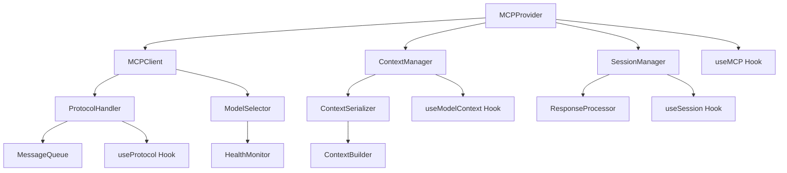
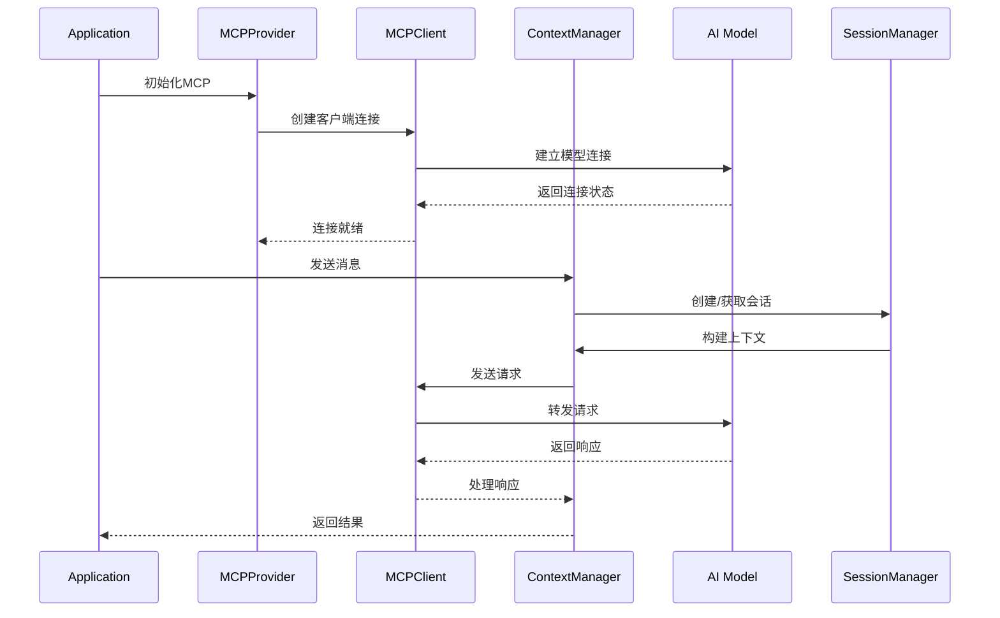

# MCP 组件

## 1. 模块概述

MCP (Model Context Protocol) 组件模块是Kilocode应用中负责模型上下文协议处理的核心系统，提供与AI模型的标准化通信接口，管理上下文传递、会话状态和模型交互。

### 核心功能

- 模型上下文协议实现
- AI模型通信管理
- 会话状态维护
- 上下文数据传递
- 模型响应处理
- 协议版本管理

### 业务价值

- 标准化AI模型交互
- 提升模型通信效率
- 确保上下文一致性
- 支持多模型切换
- 优化响应质量

## 2. 组件列表

### 2.1 核心组件

| 组件名称          | 文件路径              | 功能描述                         |
| ----------------- | --------------------- | -------------------------------- |
| MCPProvider       | MCPProvider.tsx       | MCP协议提供者，管理协议实例      |
| MCPClient         | MCPClient.tsx         | MCP客户端，处理模型通信          |
| ContextManager    | ContextManager.tsx    | 上下文管理器，维护会话上下文     |
| ModelSelector     | ModelSelector.tsx     | 模型选择器，切换AI模型           |
| ProtocolHandler   | ProtocolHandler.tsx   | 协议处理器，处理协议消息         |
| SessionManager    | SessionManager.tsx    | 会话管理器，管理会话生命周期     |
| ResponseProcessor | ResponseProcessor.tsx | 响应处理器，处理模型响应         |
| ContextSerializer | ContextSerializer.tsx | 上下文序列化器，序列化上下文数据 |
| ErrorBoundary     | MCPErrorBoundary.tsx  | MCP错误边界，处理协议错误        |
| HealthMonitor     | HealthMonitor.tsx     | 健康监控器，监控协议状态         |

### 2.2 Hook组件

| Hook名称        | 文件路径           | 功能描述        |
| --------------- | ------------------ | --------------- |
| useMCP          | useMCP.ts          | MCP核心功能Hook |
| useModelContext | useModelContext.ts | 模型上下文Hook  |
| useProtocol     | useProtocol.ts     | 协议管理Hook    |
| useSession      | useSession.ts      | 会话管理Hook    |

### 2.3 工具类

| 类名              | 文件路径             | 功能描述     |
| ----------------- | -------------------- | ------------ |
| MCPProtocol       | MCPProtocol.ts       | MCP协议实现  |
| ContextBuilder    | ContextBuilder.ts    | 上下文构建器 |
| MessageQueue      | MessageQueue.ts      | 消息队列管理 |
| ProtocolValidator | ProtocolValidator.ts | 协议验证器   |

### 2.4 组件层次关系



## 3. 技术架构

### 3.1 设计模式

- **提供者模式**: MCPProvider作为协议上下文提供者
- **观察者模式**: 监听协议状态和会话变化
- **策略模式**: 支持多种模型和协议版本
- **建造者模式**: 构建复杂的上下文对象

### 3.2 状态管理

```typescript
interface MCPState {
	// 协议状态
	protocolVersion: string
	connectionStatus: ConnectionStatus
	isInitialized: boolean
	lastHeartbeat: Date | null

	// 模型状态
	availableModels: ModelInfo[]
	currentModel: ModelInfo | null
	modelCapabilities: ModelCapabilities

	// 会话状态
	activeSessions: Map<string, Session>
	currentSession: Session | null
	sessionHistory: SessionRecord[]

	// 上下文状态
	contextStack: ContextFrame[]
	globalContext: GlobalContext
	contextSize: number
	maxContextSize: number

	// 消息状态
	messageQueue: MCPMessage[]
	pendingRequests: Map<string, PendingRequest>
	responseCache: Map<string, CachedResponse>

	// 配置
	mcpConfig: MCPConfiguration
	protocolSettings: ProtocolSettings
}

interface Session {
	id: string
	modelId: string
	startTime: Date
	lastActivity: Date
	context: SessionContext
	messages: Message[]
	metadata: SessionMetadata
	status: SessionStatus
}

interface ContextFrame {
	id: string
	type: ContextType
	content: any
	timestamp: Date
	priority: number
	ttl?: number
	metadata: ContextMetadata
}

interface MCPMessage {
	id: string
	type: MessageType
	payload: any
	timestamp: Date
	sessionId?: string
	priority: MessagePriority
	retryCount: number
}

enum ConnectionStatus {
	DISCONNECTED = "disconnected",
	CONNECTING = "connecting",
	CONNECTED = "connected",
	RECONNECTING = "reconnecting",
	ERROR = "error",
}

enum MessageType {
	REQUEST = "request",
	RESPONSE = "response",
	NOTIFICATION = "notification",
	HEARTBEAT = "heartbeat",
	ERROR = "error",
}
```

### 3.3 数据流向



## 4. API文档

### 4.1 MCPProvider Props

```typescript
interface MCPProviderProps {
	/** 协议配置 */
	config: MCPConfiguration
	/** 子组件 */
	children: React.ReactNode
	/** 连接建立回调 */
	onConnect?: (client: MCPClient) => void
	/** 连接断开回调 */
	onDisconnect?: (reason: string) => void
	/** 错误处理回调 */
	onError?: (error: MCPError) => void
}

interface MCPConfiguration {
	/** 协议版本 */
	version: string
	/** 服务端点 */
	endpoint: string
	/** 认证配置 */
	auth?: AuthConfig
	/** 重连配置 */
	reconnect: ReconnectConfig
	/** 超时设置 */
	timeout: TimeoutConfig
	/** 缓存配置 */
	cache: CacheConfig
}
```

### 4.2 useMCP Hook

```typescript
interface UseMCPResult {
	/** 当前状态 */
	state: MCPState
	/** 发送消息 */
	sendMessage: (message: MessageInput) => Promise<MessageResponse>
	/** 创建会话 */
	createSession: (modelId: string, options?: SessionOptions) => Promise<Session>
	/** 结束会话 */
	endSession: (sessionId: string) => Promise<void>
	/** 添加上下文 */
	addContext: (context: ContextInput) => Promise<void>
	/** 清除上下文 */
	clearContext: (type?: ContextType) => Promise<void>
	/** 切换模型 */
	switchModel: (modelId: string) => Promise<void>
	/** 获取模型信息 */
	getModelInfo: (modelId: string) => Promise<ModelInfo>
	/** 连接状态 */
	connectionStatus: ConnectionStatus
	/** 错误信息 */
	error: MCPError | null
}
```

### 4.3 ContextManager Props

```typescript
interface ContextManagerProps {
	/** 最大上下文大小 */
	maxSize?: number
	/** 上下文策略 */
	strategy?: ContextStrategy
	/** 上下文变化回调 */
	onContextChange?: (context: ContextFrame[]) => void
	/** 上下文溢出回调 */
	onContextOverflow?: (removedFrames: ContextFrame[]) => void
}

interface ContextInput {
	type: ContextType
	content: any
	priority?: number
	ttl?: number
	metadata?: ContextMetadata
}

enum ContextType {
	SYSTEM = "system",
	USER = "user",
	ASSISTANT = "assistant",
	TOOL = "tool",
	FILE = "file",
	CODE = "code",
	ERROR = "error",
}

enum ContextStrategy {
	FIFO = "fifo",
	LIFO = "lifo",
	PRIORITY = "priority",
	LRU = "lru",
	SMART = "smart",
}
```

## 5. 使用示例

### 5.1 基础MCP使用

```tsx
import { MCPProvider, useMCP } from "@/components/mcp"

function MCPExample() {
	const { sendMessage, createSession, addContext, state, connectionStatus } = useMCP()

	const [message, setMessage] = useState("")
	const [response, setResponse] = useState("")

	const handleSendMessage = async () => {
		try {
			// 创建会话（如果不存在）
			if (!state.currentSession) {
				await createSession("gpt-4", {
					temperature: 0.7,
					maxTokens: 2000,
				})
			}

			// 添加用户消息到上下文
			await addContext({
				type: ContextType.USER,
				content: message,
				priority: 1,
			})

			// 发送消息
			const result = await sendMessage({
				content: message,
				type: "chat",
				sessionId: state.currentSession?.id,
			})

			setResponse(result.content)
		} catch (error) {
			console.error("Failed to send message:", error)
		}
	}

	return (
		<div className="mcp-chat">
			<div className="connection-status">Status: {connectionStatus}</div>

			<div className="chat-interface">
				<div className="message-input">
					<textarea
						value={message}
						onChange={(e) => setMessage(e.target.value)}
						placeholder="Type your message..."
					/>
					<button onClick={handleSendMessage} disabled={connectionStatus !== ConnectionStatus.CONNECTED}>
						Send
					</button>
				</div>

				<div className="response-area">
					<h4>Response:</h4>
					<pre>{response}</pre>
				</div>
			</div>

			<div className="context-info">
				<h4>
					Context Size: {state.contextSize} / {state.maxContextSize}
				</h4>
				<div className="context-frames">
					{state.contextStack.map((frame) => (
						<div key={frame.id} className="context-frame">
							<span className="frame-type">{frame.type}</span>
							<span className="frame-content">
								{typeof frame.content === "string"
									? frame.content.substring(0, 50) + "..."
									: JSON.stringify(frame.content).substring(0, 50) + "..."}
							</span>
						</div>
					))}
				</div>
			</div>
		</div>
	)
}

// 应用根组件
function App() {
	const mcpConfig: MCPConfiguration = {
		version: "1.0",
		endpoint: "ws://localhost:8080/mcp",
		reconnect: {
			enabled: true,
			maxAttempts: 5,
			delay: 1000,
		},
		timeout: {
			connection: 10000,
			request: 30000,
		},
		cache: {
			enabled: true,
			maxSize: 100,
			ttl: 300000,
		},
	}

	return (
		<MCPProvider
			config={mcpConfig}
			onConnect={(client) => console.log("MCP connected:", client)}
			onDisconnect={(reason) => console.log("MCP disconnected:", reason)}
			onError={(error) => console.error("MCP error:", error)}>
			<MCPExample />
		</MCPProvider>
	)
}
```

### 5.2 上下文管理

```tsx
import { ContextManager, useModelContext } from "@/components/mcp"

function ContextManagementExample() {
	const { context, addContext, removeContext, clearContext, getContextSummary } = useModelContext()

	const [contextType, setContextType] = useState<ContextType>(ContextType.USER)
	const [contextContent, setContextContent] = useState("")

	const handleAddContext = async () => {
		try {
			await addContext({
				type: contextType,
				content: contextContent,
				priority: contextType === ContextType.SYSTEM ? 10 : 1,
				metadata: {
					source: "user_input",
					timestamp: new Date(),
				},
			})

			setContextContent("")
		} catch (error) {
			console.error("Failed to add context:", error)
		}
	}

	const handleClearContext = async (type?: ContextType) => {
		try {
			await clearContext(type)
		} catch (error) {
			console.error("Failed to clear context:", error)
		}
	}

	const renderContextFrame = (frame: ContextFrame) => (
		<div key={frame.id} className="context-frame">
			<div className="frame-header">
				<span className="frame-type">{frame.type}</span>
				<span className="frame-priority">Priority: {frame.priority}</span>
				<span className="frame-timestamp">{frame.timestamp.toLocaleTimeString()}</span>
				<button onClick={() => removeContext(frame.id)} className="remove-button">
					Remove
				</button>
			</div>

			<div className="frame-content">
				{typeof frame.content === "string" ? (
					<pre>{frame.content}</pre>
				) : (
					<pre>{JSON.stringify(frame.content, null, 2)}</pre>
				)}
			</div>

			{frame.metadata && (
				<div className="frame-metadata">
					<small>
						Source: {frame.metadata.source} | TTL: {frame.ttl ? `${frame.ttl}ms` : "Permanent"}
					</small>
				</div>
			)}
		</div>
	)

	return (
		<div className="context-management">
			<div className="context-controls">
				<h3>Add Context</h3>
				<div className="add-context-form">
					<select value={contextType} onChange={(e) => setContextType(e.target.value as ContextType)}>
						{Object.values(ContextType).map((type) => (
							<option key={type} value={type}>
								{type}
							</option>
						))}
					</select>

					<textarea
						value={contextContent}
						onChange={(e) => setContextContent(e.target.value)}
						placeholder="Enter context content..."
						rows={4}
					/>

					<button onClick={handleAddContext}>Add Context</button>
				</div>

				<div className="context-actions">
					<button onClick={() => handleClearContext()}>Clear All Context</button>
					<button onClick={() => handleClearContext(ContextType.USER)}>Clear User Context</button>
					<button onClick={() => getContextSummary()}>Get Summary</button>
				</div>
			</div>

			<div className="context-display">
				<h3>Current Context ({context.length} frames)</h3>
				<div className="context-frames">{context.map(renderContextFrame)}</div>

				{context.length === 0 && (
					<div className="empty-context">
						<p>No context frames available.</p>
					</div>
				)}
			</div>
		</div>
	)
}
```

### 5.3 模型选择和切换

```tsx
import { ModelSelector, useMCP } from "@/components/mcp"

function ModelSelectionExample() {
	const { state, switchModel, getModelInfo, createSession } = useMCP()

	const [selectedModel, setSelectedModel] = useState<string>("")
	const [modelDetails, setModelDetails] = useState<ModelInfo | null>(null)

	const handleModelSelect = async (modelId: string) => {
		try {
			setSelectedModel(modelId)

			// 获取模型详细信息
			const info = await getModelInfo(modelId)
			setModelDetails(info)

			// 切换到新模型
			await switchModel(modelId)

			// 创建新会话
			await createSession(modelId, {
				temperature: info.defaultTemperature || 0.7,
				maxTokens: info.maxTokens || 2000,
			})
		} catch (error) {
			console.error("Failed to switch model:", error)
		}
	}

	const renderModelCard = (model: ModelInfo) => (
		<div
			key={model.id}
			className={`model-card ${selectedModel === model.id ? "selected" : ""}`}
			onClick={() => handleModelSelect(model.id)}>
			<div className="model-header">
				<h4>{model.name}</h4>
				<span className="model-version">v{model.version}</span>
			</div>

			<div className="model-description">
				<p>{model.description}</p>
			</div>

			<div className="model-capabilities">
				<div className="capability-list">
					{model.capabilities.map((cap) => (
						<span key={cap} className="capability-tag">
							{cap}
						</span>
					))}
				</div>
			</div>

			<div className="model-specs">
				<div className="spec-item">
					<span>Max Tokens:</span>
					<span>{model.maxTokens?.toLocaleString()}</span>
				</div>
				<div className="spec-item">
					<span>Context Window:</span>
					<span>{model.contextWindow?.toLocaleString()}</span>
				</div>
				<div className="spec-item">
					<span>Cost per 1K tokens:</span>
					<span>${model.costPer1K}</span>
				</div>
			</div>

			<div className="model-status">
				<span className={`status-indicator ${model.status}`}>{model.status}</span>
				{model.latency && <span className="latency">{model.latency}ms avg</span>}
			</div>
		</div>
	)

	return (
		<div className="model-selection">
			<div className="selection-header">
				<h2>Select AI Model</h2>
				<div className="current-model">Current: {state.currentModel?.name || "None"}</div>
			</div>

			<div className="models-grid">{state.availableModels.map(renderModelCard)}</div>

			{modelDetails && (
				<div className="model-details">
					<h3>Model Details: {modelDetails.name}</h3>
					<div className="details-content">
						<div className="detail-section">
							<h4>Capabilities</h4>
							<ul>
								{modelDetails.capabilities.map((cap) => (
									<li key={cap}>{cap}</li>
								))}
							</ul>
						</div>

						<div className="detail-section">
							<h4>Parameters</h4>
							<table>
								<tbody>
									<tr>
										<td>Temperature Range:</td>
										<td>
											{modelDetails.minTemperature} - {modelDetails.maxTemperature}
										</td>
									</tr>
									<tr>
										<td>Default Temperature:</td>
										<td>{modelDetails.defaultTemperature}</td>
									</tr>
									<tr>
										<td>Max Tokens:</td>
										<td>{modelDetails.maxTokens?.toLocaleString()}</td>
									</tr>
									<tr>
										<td>Context Window:</td>
										<td>{modelDetails.contextWindow?.toLocaleString()}</td>
									</tr>
								</tbody>
							</table>
						</div>

						<div className="detail-section">
							<h4>Usage Guidelines</h4>
							<p>{modelDetails.usageGuidelines}</p>
						</div>
					</div>
				</div>
			)}
		</div>
	)
}
```

## 6. 样式和主题

### 6.1 CSS类名规范

```css
/* MCP主容器 */
.mcp-provider {
	display: flex;
	flex-direction: column;
	height: 100%;
	background-color: var(--vscode-editor-background);
}

/* 连接状态 */
.connection-status {
	display: flex;
	align-items: center;
	gap: 8px;
	padding: 8px 16px;
	background-color: var(--vscode-statusBar-background);
	border-bottom: 1px solid var(--vscode-statusBar-border);
	font-size: 12px;
}

.connection-status.connected {
	background-color: var(--vscode-testing-iconPassed);
	color: white;
}

.connection-status.connecting {
	background-color: var(--vscode-notificationsWarningIcon-foreground);
	color: white;
}

.connection-status.disconnected {
	background-color: var(--vscode-notificationsErrorIcon-foreground);
	color: white;
}

.connection-status.error {
	background-color: var(--vscode-errorBackground);
	color: var(--vscode-errorForeground);
}

/* 聊天界面 */
.mcp-chat {
	display: flex;
	flex-direction: column;
	height: 100%;
	padding: 16px;
	gap: 16px;
}

.chat-interface {
	flex: 1;
	display: flex;
	flex-direction: column;
	gap: 16px;
}

.message-input {
	display: flex;
	gap: 12px;
	align-items: flex-end;
}

.message-input textarea {
	flex: 1;
	min-height: 80px;
	padding: 12px;
	background-color: var(--vscode-input-background);
	border: 1px solid var(--vscode-input-border);
	border-radius: 6px;
	color: var(--vscode-input-foreground);
	font-family: var(--vscode-editor-font-family);
	font-size: 14px;
	resize: vertical;
}

.message-input textarea:focus {
	outline: none;
	border-color: var(--vscode-focusBorder);
}

.message-input button {
	padding: 12px 24px;
	background-color: var(--vscode-button-background);
	color: var(--vscode-button-foreground);
	border: none;
	border-radius: 6px;
	cursor: pointer;
	font-size: 14px;
	font-weight: 500;
}

.message-input button:hover:not(:disabled) {
	background-color: var(--vscode-button-hoverBackground);
}

.message-input button:disabled {
	background-color: var(--vscode-button-secondaryBackground);
	color: var(--vscode-button-secondaryForeground);
	cursor: not-allowed;
}

.response-area {
	background-color: var(--vscode-editor-background);
	border: 1px solid var(--vscode-input-border);
	border-radius: 6px;
	padding: 16px;
}

.response-area h4 {
	margin: 0 0 12px 0;
	color: var(--vscode-foreground);
	font-size: 14px;
	font-weight: 600;
}

.response-area pre {
	margin: 0;
	white-space: pre-wrap;
	word-wrap: break-word;
	font-family: var(--vscode-editor-font-family);
	font-size: 13px;
	line-height: 1.5;
	color: var(--vscode-editor-foreground);
}

/* 上下文信息 */
.context-info {
	background-color: var(--vscode-sideBar-background);
	border: 1px solid var(--vscode-sideBar-border);
	border-radius: 6px;
	padding: 16px;
}

.context-info h4 {
	margin: 0 0 12px 0;
	color: var(--vscode-foreground);
	font-size: 14px;
	font-weight: 600;
}

.context-frames {
	display: flex;
	flex-direction: column;
	gap: 8px;
	max-height: 200px;
	overflow-y: auto;
}

.context-frame {
	display: flex;
	align-items: center;
	gap: 12px;
	padding: 8px 12px;
	background-color: var(--vscode-list-inactiveSelectionBackground);
	border-radius: 4px;
	font-size: 12px;
}

.frame-type {
	background-color: var(--vscode-badge-background);
	color: var(--vscode-badge-foreground);
	padding: 2px 6px;
	border-radius: 3px;
	font-size: 10px;
	text-transform: uppercase;
	font-weight: 600;
}

.frame-content {
	flex: 1;
	color: var(--vscode-descriptionForeground);
	overflow: hidden;
	text-overflow: ellipsis;
	white-space: nowrap;
}

/* 上下文管理 */
.context-management {
	display: grid;
	grid-template-columns: 400px 1fr;
	gap: 20px;
	height: 100%;
	padding: 16px;
}

.context-controls {
	background-color: var(--vscode-sideBar-background);
	border: 1px solid var(--vscode-sideBar-border);
	border-radius: 6px;
	padding: 16px;
}

.context-controls h3 {
	margin: 0 0 16px 0;
	color: var(--vscode-foreground);
	font-size: 16px;
}

.add-context-form {
	display: flex;
	flex-direction: column;
	gap: 12px;
	margin-bottom: 20px;
}

.add-context-form select {
	padding: 8px 12px;
	background-color: var(--vscode-dropdown-background);
	border: 1px solid var(--vscode-dropdown-border);
	border-radius: 4px;
	color: var(--vscode-dropdown-foreground);
	font-size: 14px;
}

.add-context-form textarea {
	padding: 12px;
	background-color: var(--vscode-input-background);
	border: 1px solid var(--vscode-input-border);
	border-radius: 4px;
	color: var(--vscode-input-foreground);
	font-family: var(--vscode-editor-font-family);
	font-size: 14px;
	resize: vertical;
}

.add-context-form button {
	padding: 10px 16px;
	background-color: var(--vscode-button-background);
	color: var(--vscode-button-foreground);
	border: none;
	border-radius: 4px;
	cursor: pointer;
	font-size: 14px;
}

.context-actions {
	display: flex;
	flex-direction: column;
	gap: 8px;
}

.context-actions button {
	padding: 8px 12px;
	background-color: var(--vscode-button-secondaryBackground);
	color: var(--vscode-button-secondaryForeground);
	border: none;
	border-radius: 4px;
	cursor: pointer;
	font-size: 13px;
}

.context-display {
	background-color: var(--vscode-editor-background);
	border: 1px solid var(--vscode-input-border);
	border-radius: 6px;
	padding: 16px;
	overflow: hidden;
}

.context-display h3 {
	margin: 0 0 16px 0;
	color: var(--vscode-foreground);
	font-size: 16px;
}

.context-frames {
	display: flex;
	flex-direction: column;
	gap: 12px;
	max-height: calc(100vh - 200px);
	overflow-y: auto;
}

.context-frame {
	background-color: var(--vscode-list-inactiveSelectionBackground);
	border: 1px solid var(--vscode-list-inactiveSelectionBackground);
	border-radius: 6px;
	padding: 12px;
}

.frame-header {
	display: flex;
	align-items: center;
	gap: 12px;
	margin-bottom: 8px;
	font-size: 12px;
}

.frame-priority {
	color: var(--vscode-descriptionForeground);
}

.frame-timestamp {
	color: var(--vscode-descriptionForeground);
}

.remove-button {
	margin-left: auto;
	padding: 4px 8px;
	background-color: var(--vscode-button-secondaryBackground);
	color: var(--vscode-button-secondaryForeground);
	border: none;
	border-radius: 3px;
	cursor: pointer;
	font-size: 11px;
}

.frame-content {
	margin-bottom: 8px;
}

.frame-content pre {
	margin: 0;
	padding: 8px;
	background-color: var(--vscode-textCodeBlock-background);
	border-radius: 4px;
	font-family: var(--vscode-editor-font-family);
	font-size: 12px;
	line-height: 1.4;
	overflow-x: auto;
}

.frame-metadata {
	color: var(--vscode-descriptionForeground);
	font-size: 11px;
}

/* 模型选择 */
.model-selection {
	padding: 20px;
}

.selection-header {
	display: flex;
	align-items: center;
	justify-content: space-between;
	margin-bottom: 20px;
	padding-bottom: 16px;
	border-bottom: 1px solid var(--vscode-panel-border);
}

.selection-header h2 {
	margin: 0;
	color: var(--vscode-foreground);
	font-size: 20px;
}

.current-model {
	color: var(--vscode-descriptionForeground);
	font-size: 14px;
}

.models-grid {
	display: grid;
	grid-template-columns: repeat(auto-fill, minmax(320px, 1fr));
	gap: 16px;
	margin-bottom: 24px;
}

.model-card {
	background-color: var(--vscode-editor-background);
	border: 1px solid var(--vscode-input-border);
	border-radius: 8px;
	padding: 16px;
	cursor: pointer;
	transition: all 0.2s ease;
}

.model-card:hover {
	border-color: var(--vscode-focusBorder);
	transform: translateY(-2px);
	box-shadow: 0 4px 12px rgba(0, 0, 0, 0.1);
}

.model-card.selected {
	border-color: var(--vscode-button-background);
	background-color: var(--vscode-list-activeSelectionBackground);
}

.model-header {
	display: flex;
	align-items: center;
	justify-content: space-between;
	margin-bottom: 8px;
}

.model-header h4 {
	margin: 0;
	color: var(--vscode-foreground);
	font-size: 16px;
}

.model-version {
	background-color: var(--vscode-badge-background);
	color: var(--vscode-badge-foreground);
	padding: 2px 6px;
	border-radius: 3px;
	font-size: 11px;
}

.model-description {
	margin-bottom: 12px;
}

.model-description p {
	margin: 0;
	color: var(--vscode-descriptionForeground);
	font-size: 14px;
	line-height: 1.4;
}

.capability-list {
	display: flex;
	flex-wrap: wrap;
	gap: 6px;
	margin-bottom: 12px;
}

.capability-tag {
	background-color: var(--vscode-button-secondaryBackground);
	color: var(--vscode-button-secondaryForeground);
	padding: 2px 6px;
	border-radius: 3px;
	font-size: 11px;
}

.model-specs {
	display: flex;
	flex-direction: column;
	gap: 4px;
	margin-bottom: 12px;
	font-size: 12px;
}

.spec-item {
	display: flex;
	justify-content: space-between;
	color: var(--vscode-descriptionForeground);
}

.model-status {
	display: flex;
	align-items: center;
	justify-content: space-between;
	font-size: 12px;
}

.status-indicator {
	padding: 2px 6px;
	border-radius: 3px;
	font-size: 10px;
	text-transform: uppercase;
	font-weight: 600;
}

.status-indicator.available {
	background-color: var(--vscode-testing-iconPassed);
	color: white;
}

.status-indicator.busy {
	background-color: var(--vscode-notificationsWarningIcon-foreground);
	color: white;
}

.status-indicator.unavailable {
	background-color: var(--vscode-notificationsErrorIcon-foreground);
	color: white;
}

.latency {
	color: var(--vscode-descriptionForeground);
}

/* 空状态 */
.empty-context {
	display: flex;
	align-items: center;
	justify-content: center;
	padding: 40px 20px;
	color: var(--vscode-descriptionForeground);
	text-align: center;
}
```

### 6.2 主题变量

```typescript
const mcpTheme = {
	colors: {
		primary: "var(--vscode-button-background)",
		secondary: "var(--vscode-button-secondaryBackground)",
		success: "var(--vscode-testing-iconPassed)",
		warning: "var(--vscode-notificationsWarningIcon-foreground)",
		error: "var(--vscode-notificationsErrorIcon-foreground)",
		info: "var(--vscode-notificationsInfoIcon-foreground)",
	},
	connection: {
		connected: {
			color: "white",
			background: "var(--vscode-testing-iconPassed)",
		},
		connecting: {
			color: "white",
			background: "var(--vscode-notificationsWarningIcon-foreground)",
		},
		disconnected: {
			color: "white",
			background: "var(--vscode-notificationsErrorIcon-foreground)",
		},
		error: {
			color: "var(--vscode-errorForeground)",
			background: "var(--vscode-errorBackground)",
		},
	},
	context: {
		system: "var(--vscode-charts-red)",
		user: "var(--vscode-charts-blue)",
		assistant: "var(--vscode-charts-green)",
		tool: "var(--vscode-charts-orange)",
		file: "var(--vscode-charts-purple)",
		code: "var(--vscode-charts-yellow)",
		error: "var(--vscode-notificationsErrorIcon-foreground)",
	},
	model: {
		available: "var(--vscode-testing-iconPassed)",
		busy: "var(--vscode-notificationsWarningIcon-foreground)",
		unavailable: "var(--vscode-notificationsErrorIcon-foreground)",
	},
}
```

## 7. 测试策略

### 7.1 单元测试

```typescript
// useMCP.spec.tsx
describe("useMCP", () => {
	it("should initialize with default state", () => {
		const { result } = renderHook(() => useMCP())

		expect(result.current.state.connectionStatus).toBe(ConnectionStatus.DISCONNECTED)
		expect(result.current.state.currentSession).toBeNull()
		expect(result.current.state.contextStack).toHaveLength(0)
	})

	it("should create session successfully", async () => {
		const { result } = renderHook(() => useMCP())

		const session = await result.current.createSession("gpt-4", {
			temperature: 0.7,
			maxTokens: 2000,
		})

		expect(session).toBeDefined()
		expect(session.modelId).toBe("gpt-4")
		expect(result.current.state.currentSession).toBe(session)
	})

	it("should handle message sending", async () => {
		const { result } = renderHook(() => useMCP())

		// 先创建会话
		await result.current.createSession("gpt-4")

		const response = await result.current.sendMessage({
			content: "Hello, world!",
			type: "chat",
		})

		expect(response).toBeDefined()
		expect(response.content).toBeTruthy()
	})

	it("should handle connection errors", async () => {
		const { result } = renderHook(() => useMCP())

		// Mock connection error
		jest.spyOn(console, "error").mockImplementation(() => {})

		// 模拟连接失败
		expect(result.current.connectionStatus).toBe(ConnectionStatus.ERROR)
	})
})
```

### 7.2 集成测试

```typescript
// MCPProvider.spec.tsx
describe('MCPProvider Integration', () => {
  it('should establish connection and handle messages', async () => {
    const onConnect = jest.fn();
    const { getByText, getByPlaceholderText } = render(
      <MCPProvider
        config={mockMCPConfig}
        onConnect={onConnect}
      >
        <MCPExample />
      </MCPProvider>
    );

    // 等待连接建立
    await waitFor(() => {
      expect(onConnect).toHaveBeenCalled();
      expect(getByText('Status: connected')).toBeInTheDocument();
    });

    // 发送消息
    const input = getByPlaceholderText('Type your message...');
    fireEvent.change(input, { target: { value: 'Test message' } });
    fireEvent.click(getByText('Send'));

    // 等待响应
    await waitFor(() => {
      expect(getByText(/Response:/)).toBeInTheDocument();
    });
  });

  it('should handle context management', async () => {
    const { getByText, getByPlaceholderText } = render(
      <MCPProvider config={mockMCPConfig}>
        <ContextManagementExample />
      </MCPProvider>
    );

    // 添加上下文
    const contextInput = getByPlaceholderText('Enter context content...');
    fireEvent.change(contextInput, { target: { value: 'Test context' } });
    fireEvent.click(getByText('Add Context'));

    // 验证上下文已添加
    await waitFor(() => {
      expect(getByText('Test context')).toBeInTheDocument();
    });
  });
});
```

## 8. 性能优化

### 8.1 消息队列优化

```typescript
class OptimizedMessageQueue {
	private queue: MCPMessage[] = []
	private processing = false
	private batchSize = 10
	private batchTimeout = 100

	async enqueue(message: MCPMessage): Promise<void> {
		this.queue.push(message)

		if (!this.processing) {
			this.processing = true
			setTimeout(() => this.processBatch(), this.batchTimeout)
		}
	}

	private async processBatch(): Promise<void> {
		const batch = this.queue.splice(0, this.batchSize)

		if (batch.length === 0) {
			this.processing = false
			return
		}

		try {
			await this.sendBatch(batch)
		} catch (error) {
			// 重新入队失败的消息
			this.queue.unshift(...batch)
		}

		// 继续处理下一批
		if (this.queue.length > 0) {
			setTimeout(() => this.processBatch(), this.batchTimeout)
		} else {
			this.processing = false
		}
	}

	private async sendBatch(messages: MCPMessage[]): Promise<void> {
		// 批量发送消息
		const promises = messages.map((msg) => this.sendSingleMessage(msg))
		await Promise.all(promises)
	}
}
```

### 8.2 上下文压缩

```typescript
class ContextCompressor {
	private compressionThreshold = 0.8 // 80%容量时开始压缩

	compressContext(context: ContextFrame[], maxSize: number): ContextFrame[] {
		if (this.calculateSize(context) <= maxSize * this.compressionThreshold) {
			return context
		}

		// 按优先级和时间排序
		const sortedContext = [...context].sort((a, b) => {
			if (a.priority !== b.priority) {
				return b.priority - a.priority // 高优先级在前
			}
			return b.timestamp.getTime() - a.timestamp.getTime() // 新的在前
		})

		// 保留系统上下文和高优先级上下文
		const compressed: ContextFrame[] = []
		let currentSize = 0

		for (const frame of sortedContext) {
			const frameSize = this.calculateFrameSize(frame)

			if (currentSize + frameSize <= maxSize) {
				compressed.push(frame)
				currentSize += frameSize
			} else if (frame.type === ContextType.SYSTEM || frame.priority >= 9) {
				// 强制保留系统和高优先级上下文
				compressed.push(this.compressFrame(frame))
				currentSize += this.calculateFrameSize(compressed[compressed.length - 1])
			}
		}

		return compressed
	}

	private compressFrame(frame: ContextFrame): ContextFrame {
		if (typeof frame.content === "string" && frame.content.length > 500) {
			return {
				...frame,
				content: frame.content.substring(0, 500) + "...[compressed]",
				metadata: {
					...frame.metadata,
					compressed: true,
					originalSize: frame.content.length,
				},
			}
		}
		return frame
	}
}
```

### 8.3 响应缓存

```typescript
import { LRUCache } from "lru-cache"

class ResponseCache {
	private cache = new LRUCache<string, CachedResponse>({
		max: 1000,
		ttl: 1000 * 60 * 15, // 15分钟
	})

	generateKey(message: MessageInput, context: ContextFrame[]): string {
		const contextHash = this.hashContext(context)
		return `${message.content}:${contextHash}:${message.type}`
	}

	get(key: string): CachedResponse | undefined {
		return this.cache.get(key)
	}

	set(key: string, response: MessageResponse): void {
		this.cache.set(key, {
			response,
			timestamp: new Date(),
			hitCount: 0,
		})
	}

	private hashContext(context: ContextFrame[]): string {
		const contextString = context.map((frame) => `${frame.type}:${JSON.stringify(frame.content)}`).join("|")

		return this.simpleHash(contextString)
	}

	private simpleHash(str: string): string {
		let hash = 0
		for (let i = 0; i < str.length; i++) {
			const char = str.charCodeAt(i)
			hash = (hash << 5) - hash + char
			hash = hash & hash // Convert to 32bit integer
		}
		return hash.toString(36)
	}
}
```

## 9. 可访问性

### 9.1 ARIA属性

```tsx
<div role="application" aria-label="Model Context Protocol interface" aria-describedby="mcp-description">
	<div id="mcp-description" className="sr-only">
		Interface for communicating with AI models using standardized protocol
	</div>

	<div role="status" aria-live="polite" aria-label="Connection status">
		<span aria-label={`Connection status: ${connectionStatus}`}>{connectionStatus}</span>
	</div>

	<div role="log" aria-live="polite" aria-label="Conversation history">
		{messages.map((message) => (
			<div key={message.id} role="article" aria-label={`${message.role} message`}>
				{message.content}
			</div>
		))}
	</div>

	<div role="form" aria-label="Message input">
		<textarea aria-label="Type your message" aria-describedby="message-help" />
		<div id="message-help" className="sr-only">
			Enter your message and press send to communicate with the AI model
		</div>
	</div>
</div>
```

### 9.2 键盘导航

```typescript
const useMCPKeyboardNavigation = () => {
	const handleKeyDown = useCallback((event: KeyboardEvent) => {
		switch (event.key) {
			case "Enter":
				if (event.ctrlKey || event.metaKey) {
					// Ctrl/Cmd+Enter 发送消息
					event.preventDefault()
					sendCurrentMessage()
				}
				break
			case "Escape":
				// 取消当前操作
				cancelCurrentOperation()
				break
			case "Tab":
				// 在上下文帧之间导航
				if (event.shiftKey) {
					navigateToPreviousContext()
				} else {
					navigateToNextContext()
				}
				break
			case "Delete":
				if (event.ctrlKey) {
					// Ctrl+Delete 清除当前上下文
					event.preventDefault()
					clearCurrentContext()
				}
				break
		}
	}, [])

	useEffect(() => {
		document.addEventListener("keydown", handleKeyDown)
		return () => document.removeEventListener("keydown", handleKeyDown)
	}, [handleKeyDown])
}
```

## 10. 国际化

### 10.1 文本资源

```json
{
	"mcp.title": "Model Context Protocol",
	"mcp.connection.status": "Connection Status",
	"mcp.connection.connected": "Connected",
	"mcp.connection.connecting": "Connecting",
	"mcp.connection.disconnected": "Disconnected",
	"mcp.connection.error": "Connection Error",
	"mcp.connection.reconnecting": "Reconnecting",
	"mcp.message.input.placeholder": "Type your message...",
	"mcp.message.send": "Send",
	"mcp.message.sending": "Sending...",
	"mcp.message.response": "Response",
	"mcp.context.title": "Context",
	"mcp.context.size": "Context Size",
	"mcp.context.add": "Add Context",
	"mcp.context.clear": "Clear Context",
	"mcp.context.clearAll": "Clear All Context",
	"mcp.context.clearUser": "Clear User Context",
	"mcp.context.summary": "Get Summary",
	"mcp.context.type.system": "System",
	"mcp.context.type.user": "User",
	"mcp.context.type.assistant": "Assistant",
	"mcp.context.type.tool": "Tool",
	"mcp.context.type.file": "File",
	"mcp.context.type.code": "Code",
	"mcp.context.type.error": "Error",
	"mcp.context.priority": "Priority",
	"mcp.context.timestamp": "Timestamp",
	"mcp.context.remove": "Remove",
	"mcp.context.content.placeholder": "Enter context content...",
	"mcp.context.empty": "No context frames available.",
	"mcp.session.create": "Create Session",
	"mcp.session.end": "End Session",
	"mcp.session.current": "Current Session",
	"mcp.session.history": "Session History",
	"mcp.model.select": "Select AI Model",
	"mcp.model.current": "Current",
	"mcp.model.switch": "Switch Model",
	"mcp.model.details": "Model Details",
	"mcp.model.capabilities": "Capabilities",
	"mcp.model.parameters": "Parameters",
	"mcp.model.temperature": "Temperature",
	"mcp.model.maxTokens": "Max Tokens",
	"mcp.model.contextWindow": "Context Window",
	"mcp.model.cost": "Cost per 1K tokens",
	"mcp.model.latency": "Average Latency",
	"mcp.model.status.available": "Available",
	"mcp.model.status.busy": "Busy",
	"mcp.model.status.unavailable": "Unavailable",
	"mcp.error.connectionFailed": "Failed to establish connection",
	"mcp.error.sendMessageFailed": "Failed to send message",
	"mcp.error.sessionCreateFailed": "Failed to create session",
	"mcp.error.contextAddFailed": "Failed to add context",
	"mcp.error.modelSwitchFailed": "Failed to switch model",
	"mcp.success.connected": "Successfully connected to MCP server",
	"mcp.success.messageSent": "Message sent successfully",
	"mcp.success.sessionCreated": "Session created successfully",
	"mcp.success.contextAdded": "Context added successfully",
	"mcp.success.modelSwitched": "Model switched successfully"
}
```

### 10.2 协议本地化

```typescript
import { useTranslation } from "react-i18next"

const useMCPTranslation = () => {
	const { t, i18n } = useTranslation()

	const getConnectionStatusText = (status: ConnectionStatus) => {
		return t(`mcp.connection.${status}`)
	}

	const getContextTypeText = (type: ContextType) => {
		return t(`mcp.context.type.${type}`)
	}

	const getModelStatusText = (status: ModelStatus) => {
		return t(`mcp.model.status.${status}`)
	}

	const formatContextSize = (current: number, max: number) => {
		const language = i18n.language

		if (language === "zh") {
			return `上下文大小: ${current} / ${max}`
		} else {
			return `Context Size: ${current} / ${max}`
		}
	}

	const formatLatency = (latency: number) => {
		const language = i18n.language

		if (language === "zh") {
			return `${latency}毫秒 平均延迟`
		} else {
			return `${latency}ms avg latency`
		}
	}

	return {
		t,
		getConnectionStatusText,
		getContextTypeText,
		getModelStatusText,
		formatContextSize,
		formatLatency,
	}
}
```

## 11. 错误处理

### 11.1 协议错误处理

```typescript
class MCPErrorHandler {
	private errorCallbacks: Map<string, (error: MCPError) => void> = new Map()

	async handleProtocolError(error: Error, context?: any): Promise<void> {
		const mcpError = this.createMCPError(error, context)

		// 记录错误
		console.error("MCP Protocol Error:", mcpError)

		// 根据错误类型采取不同的处理策略
		switch (mcpError.code) {
			case "CONNECTION_LOST":
				await this.handleConnectionLost(mcpError)
				break
			case "PROTOCOL_VERSION_MISMATCH":
				await this.handleVersionMismatch(mcpError)
				break
			case "CONTEXT_OVERFLOW":
				await this.handleContextOverflow(mcpError)
				break
			case "MODEL_UNAVAILABLE":
				await this.handleModelUnavailable(mcpError)
				break
			case "RATE_LIMIT_EXCEEDED":
				await this.handleRateLimit(mcpError)
				break
			default:
				await this.handleGenericError(mcpError)
		}

		// 通知错误回调
		const callback = this.errorCallbacks.get(mcpError.type)
		if (callback) {
			callback(mcpError)
		}
	}

	private async handleConnectionLost(error: MCPError): Promise<void> {
		// 尝试重新连接
		let retryCount = 0
		const maxRetries = 5
		const baseDelay = 1000

		while (retryCount < maxRetries) {
			try {
				await this.reconnect()
				break
			} catch (reconnectError) {
				retryCount++
				const delay = baseDelay * Math.pow(2, retryCount)
				await new Promise((resolve) => setTimeout(resolve, delay))
			}
		}

		if (retryCount >= maxRetries) {
			throw new Error("Failed to reconnect after maximum retries")
		}
	}

	private async handleContextOverflow(error: MCPError): Promise<void> {
		// 压缩上下文
		const compressor = new ContextCompressor()
		const compressedContext = compressor.compressContext(error.context.contextStack, error.context.maxContextSize)

		// 更新上下文
		await this.updateContext(compressedContext)
	}
}
```

### 11.2 会话错误处理

```typescript
const useSessionErrorHandling = () => {
	const [sessionErrors, setSessionErrors] = useState<SessionError[]>([])

	const handleSessionError = useCallback(async (error: Error, sessionId: string) => {
		const sessionError: SessionError = {
			type: "session_error",
			message: error.message,
			sessionId,
			timestamp: new Date(),
			recoverable: true,
		}

		setSessionErrors((prev) => [...prev, sessionError])

		// 根据错误类型提供不同的恢复策略
		if (error.message.includes("timeout")) {
			// 会话超时 - 尝试恢复会话
			try {
				await recoverSession(sessionId)
				removeSessionError(sessionError)
			} catch (recoveryError) {
				sessionError.recoverable = false
			}
		} else if (error.message.includes("context")) {
			// 上下文错误 - 重建上下文
			try {
				await rebuildSessionContext(sessionId)
				removeSessionError(sessionError)
			} catch (rebuildError) {
				console.error("Failed to rebuild context:", rebuildError)
			}
		}
	}, [])

	const removeSessionError = useCallback((error: SessionError) => {
		setSessionErrors((prev) => prev.filter((e) => e !== error))
	}, [])

	const retrySession = useCallback(async (sessionId: string) => {
		try {
			await restartSession(sessionId)
			setSessionErrors((prev) => prev.filter((e) => e.sessionId !== sessionId))
		} catch (error) {
			console.error("Failed to retry session:", error)
			throw error
		}
	}, [])

	return { sessionErrors, handleSessionError, retrySession }
}
```

## 12. 与其他模块的集成

### 12.1 与聊天系统集成

```typescript
// 与聊天系统的集成
const integrateWithChat = () => {
	const { sendMessage, addContext } = useMCP()
	const { addMessage, updateMessage } = useChat()

	const sendChatMessage = async (content: string, chatId: string) => {
		// 添加用户消息到聊天
		const userMessage = await addMessage({
			chatId,
			content,
			role: "user",
			timestamp: new Date(),
		})

		try {
			// 添加到MCP上下文
			await addContext({
				type: ContextType.USER,
				content,
				priority: 1,
				metadata: {
					chatId,
					messageId: userMessage.id,
				},
			})

			// 发送到MCP
			const response = await sendMessage({
				content,
				type: "chat",
				metadata: { chatId },
			})

			// 添加助手响应到聊天
			await addMessage({
				chatId,
				content: response.content,
				role: "assistant",
				timestamp: new Date(),
				metadata: {
					mcpSessionId: response.sessionId,
				},
			})

			return response
		} catch (error) {
			// 更新消息状态为错误
			await updateMessage(userMessage.id, {
				status: "error",
				error: error.message,
			})
			throw error
		}
	}

	return { sendChatMessage }
}
```

### 12.2 与设置系统集成

```typescript
// 与设置系统的集成
const integrateWithSettings = () => {
	const { updateMCPConfig } = useMCP()
	const { settings, updateSetting } = useSettings()

	const syncMCPSettings = useCallback(async () => {
		const mcpSettings = {
			defaultModel: settings.ai.defaultModel,
			temperature: settings.ai.temperature,
			maxTokens: settings.ai.maxTokens,
			contextStrategy: settings.ai.contextStrategy,
			enableCache: settings.performance.enableCache,
			cacheSize: settings.performance.cacheSize,
			reconnectEnabled: settings.connection.autoReconnect,
			maxRetries: settings.connection.maxRetries,
		}

		await updateMCPConfig(mcpSettings)
	}, [settings, updateMCPConfig])

	useEffect(() => {
		syncMCPSettings()
	}, [syncMCPSettings])

	return { syncMCPSettings }
}
```

### 12.3 与历史记录集成

```typescript
// 与历史记录的集成
const integrateWithHistory = () => {
	const { state } = useMCP()
	const { addHistoryEntry, getHistoryBySession } = useHistory()

	const saveSessionToHistory = useCallback(
		async (session: Session) => {
			await addHistoryEntry({
				type: "mcp_session",
				sessionId: session.id,
				modelId: session.modelId,
				startTime: session.startTime,
				endTime: new Date(),
				messageCount: session.messages.length,
				contextSize: session.context.frames.length,
				metadata: {
					model: session.modelId,
					totalTokens: session.metadata.totalTokens,
					cost: session.metadata.estimatedCost,
				},
			})
		},
		[addHistoryEntry],
	)

	const loadSessionFromHistory = useCallback(
		async (sessionId: string) => {
			const history = await getHistoryBySession(sessionId)
			if (history) {
				// 重建会话上下文
				return await recreateSession(history)
			}
			return null
		},
		[getHistoryBySession],
	)

	return { saveSessionToHistory, loadSessionFromHistory }
}
```

## 13. 最佳实践

### 13.1 性能最佳实践

- **上下文管理**: 定期清理过期上下文，使用压缩策略
- **消息队列**: 批量处理消息，避免频繁的单个请求
- **缓存策略**: 合理使用响应缓存，减少重复请求
- **连接管理**: 实现智能重连机制，处理网络波动

### 13.2 安全最佳实践

- **输入验证**: 严格验证所有输入数据
- **错误处理**: 不暴露敏感的错误信息
- **会话管理**: 实现会话超时和清理机制
- **数据传输**: 使用加密连接传输敏感数据

### 13.3 可维护性最佳实践

- **模块化设计**: 保持组件职责单一
- **类型安全**: 使用完整的TypeScript类型定义
- **错误边界**: 实现适当的错误边界组件
- **测试覆盖**: 保持高测试覆盖率

### 13.4 用户体验最佳实践

- **加载状态**: 提供清晰的加载和处理状态
- **错误反馈**: 给用户友好的错误提示
- **响应式设计**: 支持不同屏幕尺寸
- **可访问性**: 遵循WCAG可访问性指南

## 14. 故障排除

### 14.1 常见问题

1. **连接失败**: 检查网络连接和服务端点配置
2. **上下文溢出**: 调整上下文大小限制或压缩策略
3. **模型不可用**: 验证模型ID和可用性状态
4. **会话超时**: 检查会话配置和网络稳定性

### 14.2 调试工具

```typescript
const MCPDebugger = {
	logState: (state: MCPState) => {
		console.group("MCP State Debug")
		console.log("Connection Status:", state.connectionStatus)
		console.log("Current Model:", state.currentModel)
		console.log("Active Sessions:", state.activeSessions.size)
		console.log("Context Size:", state.contextSize)
		console.log("Message Queue:", state.messageQueue.length)
		console.groupEnd()
	},

	logPerformance: (operation: string, duration: number) => {
		console.log(`MCP Performance: ${operation} took ${duration}ms`)
	},

	exportDiagnostics: (state: MCPState) => {
		return {
			timestamp: new Date().toISOString(),
			connectionStatus: state.connectionStatus,
			modelInfo: state.currentModel,
			contextSummary: {
				size: state.contextSize,
				maxSize: state.maxContextSize,
				frameCount: state.contextStack.length,
			},
			sessionSummary: {
				activeCount: state.activeSessions.size,
				currentSession: state.currentSession?.id,
			},
			queueStatus: {
				pending: state.messageQueue.length,
				processing: state.pendingRequests.size,
			},
		}
	},
}
```
