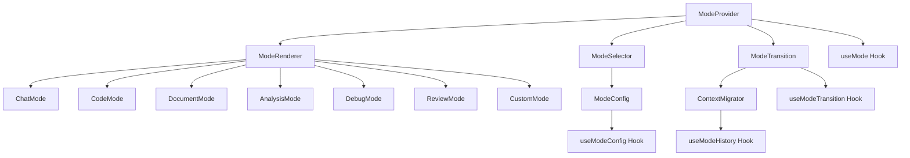
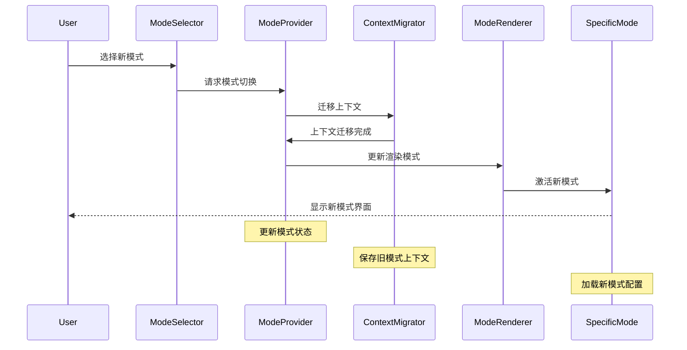

# Modes 组件

## 1. 模块概述

Modes 组件模块是Kilocode应用中负责管理不同工作模式的核心系统，提供多种AI交互模式的切换和配置，包括聊天模式、代码生成模式、文档模式等，为用户提供针对不同场景优化的工作体验。

### 核心功能

- 多种工作模式管理
- 模式间无缝切换
- 模式特定配置
- 上下文保持和迁移
- 模式状态持久化
- 自定义模式支持

### 业务价值

- 提升用户工作效率
- 优化不同场景体验
- 简化复杂操作流程
- 支持个性化定制
- 增强产品易用性

## 2. 组件列表

### 2.1 核心组件

| 组件名称       | 文件路径           | 功能描述                           |
| -------------- | ------------------ | ---------------------------------- |
| ModeProvider   | ModeProvider.tsx   | 模式上下文提供者，管理全局模式状态 |
| ModeSelector   | ModeSelector.tsx   | 模式选择器，切换不同工作模式       |
| ModeRenderer   | ModeRenderer.tsx   | 模式渲染器，渲染当前模式界面       |
| ChatMode       | ChatMode.tsx       | 聊天模式，标准对话交互             |
| CodeMode       | CodeMode.tsx       | 代码模式，代码生成和编辑           |
| DocumentMode   | DocumentMode.tsx   | 文档模式，文档创建和编辑           |
| AnalysisMode   | AnalysisMode.tsx   | 分析模式，数据分析和可视化         |
| DebugMode      | DebugMode.tsx      | 调试模式，代码调试和问题诊断       |
| ReviewMode     | ReviewMode.tsx     | 审查模式，代码审查和质量检查       |
| CustomMode     | CustomMode.tsx     | 自定义模式，用户定义的工作模式     |
| ModeTransition | ModeTransition.tsx | 模式转换，处理模式切换动画         |
| ModeConfig     | ModeConfig.tsx     | 模式配置，管理模式设置             |

### 2.2 Hook组件

| Hook名称          | 文件路径             | 功能描述         |
| ----------------- | -------------------- | ---------------- |
| useMode           | useMode.ts           | 模式管理核心Hook |
| useModeTransition | useModeTransition.ts | 模式切换Hook     |
| useModeConfig     | useModeConfig.ts     | 模式配置Hook     |
| useModeHistory    | useModeHistory.ts    | 模式历史Hook     |

### 2.3 工具类

| 类名            | 文件路径           | 功能描述     |
| --------------- | ------------------ | ------------ |
| ModeManager     | ModeManager.ts     | 模式管理器   |
| ModeRegistry    | ModeRegistry.ts    | 模式注册表   |
| ContextMigrator | ContextMigrator.ts | 上下文迁移器 |
| ModeValidator   | ModeValidator.ts   | 模式验证器   |

### 2.4 组件层次关系



## 3. 技术架构

### 3.1 设计模式

- **策略模式**: 不同模式实现不同的交互策略
- **状态模式**: 管理模式状态和转换
- **工厂模式**: 动态创建模式实例
- **观察者模式**: 监听模式变化和状态更新

### 3.2 状态管理

```typescript
interface ModeState {
	// 当前模式
	currentMode: ModeType
	previousMode: ModeType | null
	modeHistory: ModeHistoryEntry[]

	// 模式配置
	modeConfigs: Map<ModeType, ModeConfig>
	availableModes: ModeInfo[]
	customModes: CustomModeDefinition[]

	// 转换状态
	isTransitioning: boolean
	transitionProgress: number
	transitionDirection: TransitionDirection

	// 上下文状态
	modeContexts: Map<ModeType, ModeContext>
	sharedContext: SharedContext
	contextMigrationQueue: ContextMigration[]

	// UI状态
	selectorVisible: boolean
	configPanelOpen: boolean
	quickSwitchEnabled: boolean

	// 性能状态
	modeLoadTimes: Map<ModeType, number>
	lastSwitchTime: Date | null
	switchCount: number
}

interface ModeInfo {
	type: ModeType
	name: string
	description: string
	icon: string
	category: ModeCategory
	features: string[]
	requirements: ModeRequirement[]
	isEnabled: boolean
	isCustom: boolean
	version: string
}

interface ModeConfig {
	// 基础配置
	enabled: boolean
	displayName: string
	shortcut: string
	icon: string

	// 行为配置
	autoSave: boolean
	contextRetention: ContextRetentionPolicy
	transitionAnimation: boolean

	// AI配置
	aiModel: string
	temperature: number
	maxTokens: number
	systemPrompt: string

	// UI配置
	theme: ModeTheme
	layout: LayoutConfig
	toolbarItems: ToolbarItem[]

	// 高级配置
	plugins: string[]
	customSettings: Record<string, any>
}

interface ModeContext {
	id: string
	modeType: ModeType
	data: any
	metadata: ContextMetadata
	createdAt: Date
	lastAccessed: Date
	size: number
	isShared: boolean
}

enum ModeType {
	CHAT = "chat",
	CODE = "code",
	DOCUMENT = "document",
	ANALYSIS = "analysis",
	DEBUG = "debug",
	REVIEW = "review",
	CUSTOM = "custom",
}

enum ModeCategory {
	COMMUNICATION = "communication",
	DEVELOPMENT = "development",
	PRODUCTIVITY = "productivity",
	ANALYSIS = "analysis",
	CUSTOM = "custom",
}

enum TransitionDirection {
	FORWARD = "forward",
	BACKWARD = "backward",
	LATERAL = "lateral",
}
```

### 3.3 数据流向



## 4. API文档

### 4.1 ModeProvider Props

```typescript
interface ModeProviderProps {
	/** 初始模式 */
	initialMode?: ModeType
	/** 可用模式列表 */
	availableModes?: ModeType[]
	/** 模式配置 */
	modeConfigs?: Partial<Record<ModeType, ModeConfig>>
	/** 子组件 */
	children: React.ReactNode
	/** 模式切换回调 */
	onModeChange?: (newMode: ModeType, oldMode: ModeType) => void
	/** 模式加载回调 */
	onModeLoad?: (mode: ModeType, loadTime: number) => void
	/** 错误处理回调 */
	onError?: (error: ModeError) => void
}
```

### 4.2 useMode Hook

```typescript
interface UseModeResult {
	/** 当前状态 */
	state: ModeState
	/** 切换模式 */
	switchMode: (mode: ModeType, options?: SwitchOptions) => Promise<void>
	/** 获取模式配置 */
	getModeConfig: (mode: ModeType) => ModeConfig
	/** 更新模式配置 */
	updateModeConfig: (mode: ModeType, config: Partial<ModeConfig>) => Promise<void>
	/** 注册自定义模式 */
	registerCustomMode: (definition: CustomModeDefinition) => Promise<void>
	/** 获取模式上下文 */
	getModeContext: (mode: ModeType) => ModeContext | null
	/** 保存模式上下文 */
	saveModeContext: (mode: ModeType, context: any) => Promise<void>
	/** 清除模式上下文 */
	clearModeContext: (mode: ModeType) => Promise<void>
	/** 获取模式历史 */
	getModeHistory: () => ModeHistoryEntry[]
	/** 快速切换到上一个模式 */
	switchToPrevious: () => Promise<void>
	/** 检查模式是否可用 */
	isModeAvailable: (mode: ModeType) => boolean
}

interface SwitchOptions {
	/** 是否保存当前上下文 */
	saveContext?: boolean
	/** 是否迁移上下文 */
	migrateContext?: boolean
	/** 转换动画 */
	animation?: TransitionAnimation
	/** 强制切换 */
	force?: boolean
}
```

### 4.3 ModeSelector Props

```typescript
interface ModeSelectorProps {
	/** 显示模式 */
	variant?: "dropdown" | "tabs" | "grid" | "sidebar"
	/** 是否显示图标 */
	showIcons?: boolean
	/** 是否显示描述 */
	showDescriptions?: boolean
	/** 是否启用快捷键 */
	enableShortcuts?: boolean
	/** 自定义样式类 */
	className?: string
	/** 模式过滤器 */
	filter?: (mode: ModeInfo) => boolean
	/** 模式排序器 */
	sorter?: (a: ModeInfo, b: ModeInfo) => number
	/** 选择回调 */
	onSelect?: (mode: ModeType) => void
}
```

## 5. 使用示例

### 5.1 基础模式使用

```tsx
import { ModeProvider, useMode, ModeSelector } from "@/components/modes"

function ModeExample() {
	const { state, switchMode, getModeConfig, saveModeContext } = useMode()

	const [workData, setWorkData] = useState(null)

	const handleModeSwitch = async (newMode: ModeType) => {
		try {
			// 保存当前工作上下文
			if (workData) {
				await saveModeContext(state.currentMode, workData)
			}

			// 切换到新模式
			await switchMode(newMode, {
				saveContext: true,
				migrateContext: true,
				animation: "slide",
			})

			console.log(`Switched to ${newMode} mode`)
		} catch (error) {
			console.error("Failed to switch mode:", error)
		}
	}

	const renderModeContent = () => {
		switch (state.currentMode) {
			case ModeType.CHAT:
				return <ChatModeContent />
			case ModeType.CODE:
				return <CodeModeContent />
			case ModeType.DOCUMENT:
				return <DocumentModeContent />
			case ModeType.ANALYSIS:
				return <AnalysisModeContent />
			default:
				return <div>Unknown mode</div>
		}
	}

	return (
		<div className="mode-container">
			<div className="mode-header">
				<h2>Current Mode: {state.currentMode}</h2>
				<ModeSelector variant="tabs" showIcons={true} enableShortcuts={true} onSelect={handleModeSwitch} />
			</div>

			<div className="mode-content">
				{state.isTransitioning ? (
					<div className="transition-overlay">
						<div className="transition-progress">
							Switching modes... {Math.round(state.transitionProgress * 100)}%
						</div>
					</div>
				) : (
					renderModeContent()
				)}
			</div>

			<div className="mode-status">
				<div className="mode-info">
					<span>Mode: {state.currentMode}</span>
					<span>Switches: {state.switchCount}</span>
					{state.lastSwitchTime && <span>Last: {state.lastSwitchTime.toLocaleTimeString()}</span>}
				</div>

				{state.previousMode && (
					<button onClick={() => switchMode(state.previousMode!)} className="back-button">
						Back to {state.previousMode}
					</button>
				)}
			</div>
		</div>
	)
}

// 应用根组件
function App() {
	const modeConfigs = {
		[ModeType.CHAT]: {
			enabled: true,
			displayName: "Chat",
			shortcut: "Ctrl+1",
			icon: "chat",
			aiModel: "gpt-4",
			temperature: 0.7,
			systemPrompt: "You are a helpful assistant.",
		},
		[ModeType.CODE]: {
			enabled: true,
			displayName: "Code",
			shortcut: "Ctrl+2",
			icon: "code",
			aiModel: "gpt-4",
			temperature: 0.3,
			systemPrompt: "You are a coding assistant.",
		},
		[ModeType.DOCUMENT]: {
			enabled: true,
			displayName: "Document",
			shortcut: "Ctrl+3",
			icon: "document",
			aiModel: "gpt-4",
			temperature: 0.5,
			systemPrompt: "You are a writing assistant.",
		},
	}

	return (
		<ModeProvider
			initialMode={ModeType.CHAT}
			modeConfigs={modeConfigs}
			onModeChange={(newMode, oldMode) => {
				console.log(`Mode changed from ${oldMode} to ${newMode}`)
			}}
			onModeLoad={(mode, loadTime) => {
				console.log(`Mode ${mode} loaded in ${loadTime}ms`)
			}}>
			<ModeExample />
		</ModeProvider>
	)
}
```

### 5.2 自定义模式创建

```tsx
import { useMode, CustomModeDefinition } from "@/components/modes"

function CustomModeExample() {
	const { registerCustomMode, state } = useMode()

	const [customModeData, setCustomModeData] = useState({
		name: "",
		description: "",
		systemPrompt: "",
		aiModel: "gpt-4",
		temperature: 0.7,
	})

	const createCustomMode = async () => {
		try {
			const customMode: CustomModeDefinition = {
				type: `custom_${Date.now()}` as ModeType,
				name: customModeData.name,
				description: customModeData.description,
				icon: "custom",
				category: ModeCategory.CUSTOM,
				config: {
					enabled: true,
					displayName: customModeData.name,
					shortcut: "",
					icon: "custom",
					aiModel: customModeData.aiModel,
					temperature: customModeData.temperature,
					systemPrompt: customModeData.systemPrompt,
					autoSave: true,
					contextRetention: "session",
					transitionAnimation: true,
					theme: "default",
					layout: {
						sidebar: true,
						toolbar: true,
						statusBar: true,
					},
					toolbarItems: [
						{ id: "save", label: "Save", icon: "save" },
						{ id: "export", label: "Export", icon: "export" },
					],
					plugins: [],
					customSettings: {},
				},
				component: CustomModeRenderer,
				validator: (context: any) => {
					return context && typeof context === "object"
				},
			}

			await registerCustomMode(customMode)

			// 清空表单
			setCustomModeData({
				name: "",
				description: "",
				systemPrompt: "",
				aiModel: "gpt-4",
				temperature: 0.7,
			})

			alert("Custom mode created successfully!")
		} catch (error) {
			console.error("Failed to create custom mode:", error)
			alert("Failed to create custom mode")
		}
	}

	const CustomModeRenderer = ({ context, onContextChange }) => {
		return (
			<div className="custom-mode">
				<h3>Custom Mode: {customModeData.name}</h3>
				<div className="custom-content">
					<textarea
						value={context?.content || ""}
						onChange={(e) => onContextChange({ content: e.target.value })}
						placeholder="Enter your content here..."
						rows={10}
					/>
				</div>
				<div className="custom-actions">
					<button onClick={() => console.log("Custom action 1")}>Action 1</button>
					<button onClick={() => console.log("Custom action 2")}>Action 2</button>
				</div>
			</div>
		)
	}

	return (
		<div className="custom-mode-creator">
			<h2>Create Custom Mode</h2>

			<div className="form-group">
				<label>Mode Name:</label>
				<input
					type="text"
					value={customModeData.name}
					onChange={(e) =>
						setCustomModeData((prev) => ({
							...prev,
							name: e.target.value,
						}))
					}
					placeholder="Enter mode name"
				/>
			</div>

			<div className="form-group">
				<label>Description:</label>
				<textarea
					value={customModeData.description}
					onChange={(e) =>
						setCustomModeData((prev) => ({
							...prev,
							description: e.target.value,
						}))
					}
					placeholder="Describe your custom mode"
					rows={3}
				/>
			</div>

			<div className="form-group">
				<label>System Prompt:</label>
				<textarea
					value={customModeData.systemPrompt}
					onChange={(e) =>
						setCustomModeData((prev) => ({
							...prev,
							systemPrompt: e.target.value,
						}))
					}
					placeholder="Enter system prompt for AI"
					rows={4}
				/>
			</div>

			<div className="form-group">
				<label>AI Model:</label>
				<select
					value={customModeData.aiModel}
					onChange={(e) =>
						setCustomModeData((prev) => ({
							...prev,
							aiModel: e.target.value,
						}))
					}>
					<option value="gpt-4">GPT-4</option>
					<option value="gpt-3.5-turbo">GPT-3.5 Turbo</option>
					<option value="claude-3">Claude 3</option>
				</select>
			</div>

			<div className="form-group">
				<label>Temperature: {customModeData.temperature}</label>
				<input
					type="range"
					min="0"
					max="1"
					step="0.1"
					value={customModeData.temperature}
					onChange={(e) =>
						setCustomModeData((prev) => ({
							...prev,
							temperature: parseFloat(e.target.value),
						}))
					}
				/>
			</div>

			<button
				onClick={createCustomMode}
				disabled={!customModeData.name || !customModeData.description}
				className="create-button">
				Create Custom Mode
			</button>

			<div className="existing-custom-modes">
				<h3>Existing Custom Modes</h3>
				{state.customModes.length === 0 ? (
					<p>No custom modes created yet.</p>
				) : (
					<ul>
						{state.customModes.map((mode) => (
							<li key={mode.type}>
								<strong>{mode.name}</strong>
								<p>{mode.description}</p>
							</li>
						))}
					</ul>
				)}
			</div>
		</div>
	)
}
```

### 5.3 模式配置管理

```tsx
import { useModeConfig, ModeConfig } from "@/components/modes"

function ModeConfigExample() {
	const { getModeConfig, updateModeConfig, resetModeConfig, exportModeConfigs, importModeConfigs } = useModeConfig()

	const [selectedMode, setSelectedMode] = useState<ModeType>(ModeType.CHAT)
	const [config, setConfig] = useState<ModeConfig | null>(null)
	const [isEditing, setIsEditing] = useState(false)

	useEffect(() => {
		const modeConfig = getModeConfig(selectedMode)
		setConfig(modeConfig)
	}, [selectedMode, getModeConfig])

	const handleConfigUpdate = async (field: keyof ModeConfig, value: any) => {
		if (!config) return

		const updatedConfig = { ...config, [field]: value }
		setConfig(updatedConfig)

		try {
			await updateModeConfig(selectedMode, { [field]: value })
		} catch (error) {
			console.error("Failed to update config:", error)
			// 回滚更改
			setConfig(getModeConfig(selectedMode))
		}
	}

	const handleReset = async () => {
		try {
			await resetModeConfig(selectedMode)
			setConfig(getModeConfig(selectedMode))
			alert("Configuration reset successfully")
		} catch (error) {
			console.error("Failed to reset config:", error)
		}
	}

	const handleExport = async () => {
		try {
			const configs = await exportModeConfigs()
			const blob = new Blob([JSON.stringify(configs, null, 2)], {
				type: "application/json",
			})
			const url = URL.createObjectURL(blob)
			const a = document.createElement("a")
			a.href = url
			a.download = "mode-configs.json"
			a.click()
			URL.revokeObjectURL(url)
		} catch (error) {
			console.error("Failed to export configs:", error)
		}
	}

	const handleImport = async (event: React.ChangeEvent<HTMLInputElement>) => {
		const file = event.target.files?.[0]
		if (!file) return

		try {
			const text = await file.text()
			const configs = JSON.parse(text)
			await importModeConfigs(configs)
			setConfig(getModeConfig(selectedMode))
			alert("Configurations imported successfully")
		} catch (error) {
			console.error("Failed to import configs:", error)
			alert("Failed to import configurations")
		}
	}

	if (!config) {
		return <div>Loading configuration...</div>
	}

	return (
		<div className="mode-config">
			<div className="config-header">
				<h2>Mode Configuration</h2>
				<div className="config-actions">
					<button onClick={handleExport}>Export All</button>
					<label className="import-button">
						Import
						<input type="file" accept=".json" onChange={handleImport} style={{ display: "none" }} />
					</label>
				</div>
			</div>

			<div className="mode-selector">
				<label>Select Mode:</label>
				<select value={selectedMode} onChange={(e) => setSelectedMode(e.target.value as ModeType)}>
					{Object.values(ModeType).map((mode) => (
						<option key={mode} value={mode}>
							{mode.charAt(0).toUpperCase() + mode.slice(1)}
						</option>
					))}
				</select>
			</div>

			<div className="config-form">
				<div className="config-section">
					<h3>Basic Settings</h3>

					<div className="form-group">
						<label>Display Name:</label>
						<input
							type="text"
							value={config.displayName}
							onChange={(e) => handleConfigUpdate("displayName", e.target.value)}
							disabled={!isEditing}
						/>
					</div>

					<div className="form-group">
						<label>Shortcut:</label>
						<input
							type="text"
							value={config.shortcut}
							onChange={(e) => handleConfigUpdate("shortcut", e.target.value)}
							disabled={!isEditing}
							placeholder="e.g., Ctrl+1"
						/>
					</div>

					<div className="form-group">
						<label>
							<input
								type="checkbox"
								checked={config.enabled}
								onChange={(e) => handleConfigUpdate("enabled", e.target.checked)}
								disabled={!isEditing}
							/>
							Enabled
						</label>
					</div>

					<div className="form-group">
						<label>
							<input
								type="checkbox"
								checked={config.autoSave}
								onChange={(e) => handleConfigUpdate("autoSave", e.target.checked)}
								disabled={!isEditing}
							/>
							Auto Save
						</label>
					</div>
				</div>

				<div className="config-section">
					<h3>AI Settings</h3>

					<div className="form-group">
						<label>AI Model:</label>
						<select
							value={config.aiModel}
							onChange={(e) => handleConfigUpdate("aiModel", e.target.value)}
							disabled={!isEditing}>
							<option value="gpt-4">GPT-4</option>
							<option value="gpt-3.5-turbo">GPT-3.5 Turbo</option>
							<option value="claude-3">Claude 3</option>
						</select>
					</div>

					<div className="form-group">
						<label>Temperature: {config.temperature}</label>
						<input
							type="range"
							min="0"
							max="1"
							step="0.1"
							value={config.temperature}
							onChange={(e) => handleConfigUpdate("temperature", parseFloat(e.target.value))}
							disabled={!isEditing}
						/>
					</div>

					<div className="form-group">
						<label>Max Tokens:</label>
						<input
							type="number"
							value={config.maxTokens}
							onChange={(e) => handleConfigUpdate("maxTokens", parseInt(e.target.value))}
							disabled={!isEditing}
							min="1"
							max="4000"
						/>
					</div>

					<div className="form-group">
						<label>System Prompt:</label>
						<textarea
							value={config.systemPrompt}
							onChange={(e) => handleConfigUpdate("systemPrompt", e.target.value)}
							disabled={!isEditing}
							rows={4}
							placeholder="Enter system prompt for this mode"
						/>
					</div>
				</div>

				<div className="config-section">
					<h3>UI Settings</h3>

					<div className="form-group">
						<label>Theme:</label>
						<select
							value={config.theme}
							onChange={(e) => handleConfigUpdate("theme", e.target.value)}
							disabled={!isEditing}>
							<option value="default">Default</option>
							<option value="dark">Dark</option>
							<option value="light">Light</option>
							<option value="high-contrast">High Contrast</option>
						</select>
					</div>

					<div className="form-group">
						<label>
							<input
								type="checkbox"
								checked={config.transitionAnimation}
								onChange={(e) => handleConfigUpdate("transitionAnimation", e.target.checked)}
								disabled={!isEditing}
							/>
							Transition Animation
						</label>
					</div>

					<div className="form-group">
						<label>Context Retention:</label>
						<select
							value={config.contextRetention}
							onChange={(e) => handleConfigUpdate("contextRetention", e.target.value)}
							disabled={!isEditing}>
							<option value="none">None</option>
							<option value="session">Session</option>
							<option value="persistent">Persistent</option>
						</select>
					</div>
				</div>
			</div>

			<div className="config-actions">
				{isEditing ? (
					<>
						<button onClick={() => setIsEditing(false)}>Done</button>
						<button onClick={handleReset} className="reset-button">
							Reset to Default
						</button>
					</>
				) : (
					<button onClick={() => setIsEditing(true)}>Edit</button>
				)}
			</div>
		</div>
	)
}
```

## 6. 样式和主题

### 6.1 CSS类名规范

```css
/* 模式容器 */
.mode-container {
	display: flex;
	flex-direction: column;
	height: 100vh;
	background-color: var(--vscode-editor-background);
}

.mode-header {
	display: flex;
	align-items: center;
	justify-content: space-between;
	padding: 12px 16px;
	background-color: var(--vscode-titleBar-activeBackground);
	border-bottom: 1px solid var(--vscode-titleBar-border);
}

.mode-header h2 {
	margin: 0;
	color: var(--vscode-titleBar-activeForeground);
	font-size: 16px;
	font-weight: 600;
}

.mode-content {
	flex: 1;
	position: relative;
	overflow: hidden;
}

.mode-status {
	display: flex;
	align-items: center;
	justify-content: space-between;
	padding: 8px 16px;
	background-color: var(--vscode-statusBar-background);
	border-top: 1px solid var(--vscode-statusBar-border);
	font-size: 12px;
}

.mode-info {
	display: flex;
	gap: 16px;
	color: var(--vscode-statusBar-foreground);
}

.back-button {
	padding: 4px 8px;
	background-color: var(--vscode-button-secondaryBackground);
	color: var(--vscode-button-secondaryForeground);
	border: none;
	border-radius: 3px;
	cursor: pointer;
	font-size: 11px;
}

/* 模式选择器 */
.mode-selector {
	display: flex;
	align-items: center;
	gap: 8px;
}

.mode-selector.tabs {
	display: flex;
	background-color: var(--vscode-tab-inactiveBackground);
	border-radius: 6px;
	padding: 2px;
}

.mode-tab {
	display: flex;
	align-items: center;
	gap: 6px;
	padding: 8px 12px;
	background-color: transparent;
	color: var(--vscode-tab-inactiveForeground);
	border: none;
	border-radius: 4px;
	cursor: pointer;
	font-size: 13px;
	transition: all 0.2s ease;
}

.mode-tab:hover {
	background-color: var(--vscode-tab-hoverBackground);
	color: var(--vscode-tab-hoverForeground);
}

.mode-tab.active {
	background-color: var(--vscode-tab-activeBackground);
	color: var(--vscode-tab-activeForeground);
	box-shadow: 0 1px 3px rgba(0, 0, 0, 0.1);
}

.mode-tab-icon {
	width: 16px;
	height: 16px;
	opacity: 0.8;
}

.mode-tab.active .mode-tab-icon {
	opacity: 1;
}

.mode-selector.dropdown {
	position: relative;
}

.mode-dropdown-trigger {
	display: flex;
	align-items: center;
	gap: 8px;
	padding: 8px 12px;
	background-color: var(--vscode-dropdown-background);
	border: 1px solid var(--vscode-dropdown-border);
	border-radius: 4px;
	color: var(--vscode-dropdown-foreground);
	cursor: pointer;
	font-size: 13px;
}

.mode-dropdown-menu {
	position: absolute;
	top: 100%;
	right: 0;
	min-width: 200px;
	background-color: var(--vscode-menu-background);
	border: 1px solid var(--vscode-menu-border);
	border-radius: 4px;
	box-shadow: 0 4px 12px rgba(0, 0, 0, 0.15);
	z-index: 1000;
	max-height: 300px;
	overflow-y: auto;
}

.mode-dropdown-item {
	display: flex;
	align-items: center;
	gap: 8px;
	padding: 8px 12px;
	color: var(--vscode-menu-foreground);
	cursor: pointer;
	font-size: 13px;
	border: none;
	background: none;
	width: 100%;
	text-align: left;
}

.mode-dropdown-item:hover {
	background-color: var(--vscode-menu-selectionBackground);
	color: var(--vscode-menu-selectionForeground);
}

.mode-dropdown-item.active {
	background-color: var(--vscode-list-activeSelectionBackground);
	color: var(--vscode-list-activeSelectionForeground);
}

.mode-dropdown-item-description {
	font-size: 11px;
	color: var(--vscode-descriptionForeground);
	margin-top: 2px;
}

/* 转换动画 */
.transition-overlay {
	position: absolute;
	top: 0;
	left: 0;
	right: 0;
	bottom: 0;
	background-color: var(--vscode-editor-background);
	display: flex;
	align-items: center;
	justify-content: center;
	z-index: 100;
}

.transition-progress {
	text-align: center;
	color: var(--vscode-foreground);
	font-size: 14px;
}

.mode-transition-enter {
	opacity: 0;
	transform: translateX(20px);
}

.mode-transition-enter-active {
	opacity: 1;
	transform: translateX(0);
	transition:
		opacity 300ms ease,
		transform 300ms ease;
}

.mode-transition-exit {
	opacity: 1;
	transform: translateX(0);
}

.mode-transition-exit-active {
	opacity: 0;
	transform: translateX(-20px);
	transition:
		opacity 300ms ease,
		transform 300ms ease;
}

/* 模式配置 */
.mode-config {
	padding: 20px;
	max-width: 800px;
	margin: 0 auto;
}

.config-header {
	display: flex;
	align-items: center;
	justify-content: space-between;
	margin-bottom: 24px;
	padding-bottom: 16px;
	border-bottom: 1px solid var(--vscode-panel-border);
}

.config-header h2 {
	margin: 0;
	color: var(--vscode-foreground);
	font-size: 20px;
}

.config-actions {
	display: flex;
	gap: 8px;
}

.config-actions button,
.import-button {
	padding: 6px 12px;
	background-color: var(--vscode-button-secondaryBackground);
	color: var(--vscode-button-secondaryForeground);
	border: none;
	border-radius: 4px;
	cursor: pointer;
	font-size: 13px;
}

.config-actions button:hover,
.import-button:hover {
	background-color: var(--vscode-button-secondaryHoverBackground);
}

.mode-selector {
	margin-bottom: 24px;
}

.mode-selector label {
	display: block;
	margin-bottom: 8px;
	color: var(--vscode-foreground);
	font-size: 14px;
	font-weight: 500;
}

.mode-selector select {
	padding: 8px 12px;
	background-color: var(--vscode-dropdown-background);
	border: 1px solid var(--vscode-dropdown-border);
	border-radius: 4px;
	color: var(--vscode-dropdown-foreground);
	font-size: 14px;
	min-width: 200px;
}

.config-form {
	display: grid;
	gap: 24px;
}

.config-section {
	background-color: var(--vscode-editor-background);
	border: 1px solid var(--vscode-input-border);
	border-radius: 6px;
	padding: 16px;
}

.config-section h3 {
	margin: 0 0 16px 0;
	color: var(--vscode-foreground);
	font-size: 16px;
	font-weight: 600;
}

.form-group {
	margin-bottom: 16px;
}

.form-group:last-child {
	margin-bottom: 0;
}

.form-group label {
	display: block;
	margin-bottom: 6px;
	color: var(--vscode-foreground);
	font-size: 13px;
	font-weight: 500;
}

.form-group input[type="text"],
.form-group input[type="number"],
.form-group select,
.form-group textarea {
	width: 100%;
	padding: 8px 12px;
	background-color: var(--vscode-input-background);
	border: 1px solid var(--vscode-input-border);
	border-radius: 4px;
	color: var(--vscode-input-foreground);
	font-size: 13px;
	font-family: var(--vscode-font-family);
}

.form-group input[type="text"]:focus,
.form-group input[type="number"]:focus,
.form-group select:focus,
.form-group textarea:focus {
	outline: none;
	border-color: var(--vscode-focusBorder);
}

.form-group input[type="text"]:disabled,
.form-group input[type="number"]:disabled,
.form-group select:disabled,
.form-group textarea:disabled {
	background-color: var(--vscode-input-background);
	color: var(--vscode-disabledForeground);
	cursor: not-allowed;
	opacity: 0.6;
}

.form-group input[type="checkbox"] {
	margin-right: 8px;
}

.form-group input[type="range"] {
	width: 100%;
	margin: 8px 0;
}

.form-group textarea {
	resize: vertical;
	min-height: 80px;
}

.reset-button {
	background-color: var(--vscode-button-background) !important;
	color: var(--vscode-button-foreground) !important;
}

.reset-button:hover {
	background-color: var(--vscode-button-hoverBackground) !important;
}

/* 自定义模式创建器 */
.custom-mode-creator {
	padding: 20px;
	max-width: 600px;
	margin: 0 auto;
}

.custom-mode-creator h2 {
	margin: 0 0 24px 0;
	color: var(--vscode-foreground);
	font-size: 20px;
}

.create-button {
	padding: 10px 20px;
	background-color: var(--vscode-button-background);
	color: var(--vscode-button-foreground);
	border: none;
	border-radius: 4px;
	cursor: pointer;
	font-size: 14px;
	font-weight: 500;
	margin-top: 16px;
}

.create-button:hover:not(:disabled) {
	background-color: var(--vscode-button-hoverBackground);
}

.create-button:disabled {
	background-color: var(--vscode-button-secondaryBackground);
	color: var(--vscode-button-secondaryForeground);
	cursor: not-allowed;
}

.existing-custom-modes {
	margin-top: 32px;
	padding-top: 24px;
	border-top: 1px solid var(--vscode-panel-border);
}

.existing-custom-modes h3 {
	margin: 0 0 16px 0;
	color: var(--vscode-foreground);
	font-size: 16px;
}

.existing-custom-modes ul {
	list-style: none;
	padding: 0;
	margin: 0;
}

.existing-custom-modes li {
	padding: 12px;
	background-color: var(--vscode-list-inactiveSelectionBackground);
	border-radius: 4px;
	margin-bottom: 8px;
}

.existing-custom-modes li strong {
	color: var(--vscode-foreground);
	font-size: 14px;
}

.existing-custom-modes li p {
	margin: 4px 0 0 0;
	color: var(--vscode-descriptionForeground);
	font-size: 12px;
}

/* 自定义模式渲染器 */
.custom-mode {
	padding: 16px;
	height: 100%;
	display: flex;
	flex-direction: column;
}

.custom-mode h3 {
	margin: 0 0 16px 0;
	color: var(--vscode-foreground);
	font-size: 16px;
}

.custom-content {
	flex: 1;
	margin-bottom: 16px;
}

.custom-content textarea {
	width: 100%;
	height: 100%;
	padding: 12px;
	background-color: var(--vscode-editor-background);
	border: 1px solid var(--vscode-input-border);
	border-radius: 4px;
	color: var(--vscode-editor-foreground);
	font-family: var(--vscode-editor-font-family);
	font-size: 13px;
	resize: none;
}

.custom-actions {
	display: flex;
	gap: 8px;
}

.custom-actions button {
	padding: 8px 16px;
	background-color: var(--vscode-button-secondaryBackground);
	color: var(--vscode-button-secondaryForeground);
	border: none;
	border-radius: 4px;
	cursor: pointer;
	font-size: 13px;
}

.custom-actions button:hover {
	background-color: var(--vscode-button-secondaryHoverBackground);
}
```

### 6.2 主题变量

```typescript
const modeTheme = {
	colors: {
		primary: "var(--vscode-button-background)",
		secondary: "var(--vscode-button-secondaryBackground)",
		success: "var(--vscode-testing-iconPassed)",
		warning: "var(--vscode-notificationsWarningIcon-foreground)",
		error: "var(--vscode-notificationsErrorIcon-foreground)",
		info: "var(--vscode-notificationsInfoIcon-foreground)",
	},
	modes: {
		chat: {
			primary: "var(--vscode-charts-blue)",
			icon: "💬",
		},
		code: {
			primary: "var(--vscode-charts-green)",
			icon: "💻",
		},
		document: {
			primary: "var(--vscode-charts-orange)",
			icon: "📄",
		},
		analysis: {
			primary: "var(--vscode-charts-purple)",
			icon: "📊",
		},
		debug: {
			primary: "var(--vscode-charts-red)",
			icon: "🐛",
		},
		review: {
			primary: "var(--vscode-charts-yellow)",
			icon: "👀",
		},
		custom: {
			primary: "var(--vscode-charts-foreground)",
			icon: "⚙️",
		},
	},
	transitions: {
		duration: "300ms",
		easing: "cubic-bezier(0.4, 0, 0.2, 1)",
	},
}
```

## 7. 测试策略

### 7.1 单元测试

```typescript
// useMode.spec.tsx
describe("useMode", () => {
	it("should initialize with default mode", () => {
		const { result } = renderHook(() => useMode())

		expect(result.current.state.currentMode).toBe(ModeType.CHAT)
		expect(result.current.state.previousMode).toBeNull()
		expect(result.current.state.isTransitioning).toBe(false)
	})

	it("should switch modes successfully", async () => {
		const { result } = renderHook(() => useMode())

		await act(async () => {
			await result.current.switchMode(ModeType.CODE)
		})

		expect(result.current.state.currentMode).toBe(ModeType.CODE)
		expect(result.current.state.previousMode).toBe(ModeType.CHAT)
		expect(result.current.state.switchCount).toBe(1)
	})

	it("should save and restore context", async () => {
		const { result } = renderHook(() => useMode())

		const testContext = { data: "test data" }

		await act(async () => {
			await result.current.saveModeContext(ModeType.CHAT, testContext)
		})

		const savedContext = result.current.getModeContext(ModeType.CHAT)
		expect(savedContext?.data).toEqual(testContext)
	})

	it("should handle mode switching errors", async () => {
		const { result } = renderHook(() => useMode())

		// Mock error
		jest.spyOn(console, "error").mockImplementation(() => {})

		await expect(result.current.switchMode("invalid_mode" as ModeType)).rejects.toThrow()
	})
})
```

### 7.2 集成测试

```typescript
// ModeProvider.spec.tsx
describe('ModeProvider Integration', () => {
  it('should provide mode context to children', () => {
    const TestComponent = () => {
      const { state } = useMode();
      return <div data-testid="current-mode">{state.currentMode}</div>;
    };

    const { getByTestId } = render(
      <ModeProvider initialMode={ModeType.CODE}>
        <TestComponent />
      </ModeProvider>
    );

    expect(getByTestId('current-mode')).toHaveTextContent('code');
  });

  it('should handle mode transitions', async () => {
    const onModeChange = jest.fn();

    const TestComponent = () => {
      const { switchMode } = useMode();
      return (
        <button onClick={() => switchMode(ModeType.DOCUMENT)}>
          Switch
        </button>
      );
    };

    const { getByText } = render(
      <ModeProvider onModeChange={onModeChange}>
        <TestComponent />
      </ModeProvider>
    );

    fireEvent.click(getByText('Switch'));

    await waitFor(() => {
      expect(onModeChange).toHaveBeenCalledWith(
        ModeType.DOCUMENT,
        ModeType.CHAT
      );
    });
  });
});
```

## 8. 性能优化

### 8.1 模式懒加载

```typescript
const ModeRenderer = React.memo(({ mode }: { mode: ModeType }) => {
  const [ModeComponent, setModeComponent] = useState<React.ComponentType | null>(null);
  const [loading, setLoading] = useState(true);

  useEffect(() => {
    let cancelled = false;

    const loadModeComponent = async () => {
      setLoading(true);

      try {
        let component;

        switch (mode) {
          case ModeType.CHAT:
            component = (await import('./ChatMode')).default;
            break;
          case ModeType.CODE:
            component = (await import('./CodeMode')).default;
            break;
          case ModeType.DOCUMENT:
            component = (await import('./DocumentMode')).default;
            break;
          case ModeType.ANALYSIS:
            component = (await import('./AnalysisMode')).default;
            break;
          case ModeType.DEBUG:
            component = (await import('./DebugMode')).default;
            break;
          case ModeType.REVIEW:
            component = (await import('./ReviewMode')).default;
            break;
          default:
            component = (await import('./DefaultMode')).default;
        }

        if (!cancelled) {
          setModeComponent(() => component);
          setLoading(false);
        }
      } catch (error) {
        if (!cancelled) {
          console.error('Failed to load mode component:', error);
          setLoading(false);
        }
      }
    };

    loadModeComponent();

    return () => {
      cancelled = true;
    };
  }, [mode]);

  if (loading) {
    return (
      <div className="mode-loading">
        <div className="loading-spinner" />
        <div>Loading {mode} mode...</div>
      </div>
    );
  }

  if (!ModeComponent) {
    return (
      <div className="mode-error">
        Failed to load {mode} mode
      </div>
    );
  }

  return <ModeComponent />;
});
```

### 8.2 上下文优化

```typescript
class OptimizedContextManager {
	private contextCache = new Map<string, ModeContext>()
	private compressionThreshold = 1024 * 1024 // 1MB

	async saveContext(mode: ModeType, context: any): Promise<void> {
		const serialized = JSON.stringify(context)
		const size = new Blob([serialized]).size

		let finalContext = context

		// 如果上下文过大，进行压缩
		if (size > this.compressionThreshold) {
			finalContext = await this.compressContext(context)
		}

		const modeContext: ModeContext = {
			id: `${mode}_${Date.now()}`,
			modeType: mode,
			data: finalContext,
			metadata: {
				originalSize: size,
				compressed: size > this.compressionThreshold,
				timestamp: new Date(),
			},
			createdAt: new Date(),
			lastAccessed: new Date(),
			size: new Blob([JSON.stringify(finalContext)]).size,
			isShared: false,
		}

		this.contextCache.set(mode, modeContext)

		// 异步持久化到存储
		this.persistContext(modeContext)
	}

	async loadContext(mode: ModeType): Promise<ModeContext | null> {
		// 先从缓存获取
		let context = this.contextCache.get(mode)

		if (!context) {
			// 从持久化存储加载
			context = await this.loadPersistedContext(mode)
			if (context) {
				this.contextCache.set(mode, context)
			}
		}

		if (context) {
			context.lastAccessed = new Date()

			// 如果是压缩的上下文，解压缩
			if (context.metadata.compressed) {
				context.data = await this.decompressContext(context.data)
			}
		}

		return context
	}

	private async compressContext(context: any): Promise<any> {
		// 简单的压缩策略：移除不必要的字段，截断长文本
		const compressed = { ...context }

		if (compressed.messages && Array.isArray(compressed.messages)) {
			// 只保留最近的消息
			compressed.messages = compressed.messages.slice(-50)
		}

		if (compressed.content && typeof compressed.content === "string") {
			// 截断过长的内容
			if (compressed.content.length > 10000) {
				compressed.content = compressed.content.substring(0, 10000) + "...[truncated]"
			}
		}

		return compressed
	}
}
```

### 8.3 转换动画优化

```typescript
const useOptimizedTransition = () => {
	const [isTransitioning, setIsTransitioning] = useState(false)
	const [transitionProgress, setTransitionProgress] = useState(0)
	const transitionRef = useRef<number>()

	const startTransition = useCallback((duration: number = 300) => {
		setIsTransitioning(true)
		setTransitionProgress(0)

		const startTime = performance.now()

		const animate = (currentTime: number) => {
			const elapsed = currentTime - startTime
			const progress = Math.min(elapsed / duration, 1)

			setTransitionProgress(progress)

			if (progress < 1) {
				transitionRef.current = requestAnimationFrame(animate)
			} else {
				setIsTransitioning(false)
				setTransitionProgress(0)
			}
		}

		transitionRef.current = requestAnimationFrame(animate)
	}, [])

	const cancelTransition = useCallback(() => {
		if (transitionRef.current) {
			cancelAnimationFrame(transitionRef.current)
			setIsTransitioning(false)
			setTransitionProgress(0)
		}
	}, [])

	useEffect(() => {
		return () => {
			if (transitionRef.current) {
				cancelAnimationFrame(transitionRef.current)
			}
		}
	}, [])

	return { isTransitioning, transitionProgress, startTransition, cancelTransition }
}
```

## 9. 可访问性

### 9.1 ARIA属性

```tsx
<div role="application" aria-label="Mode management interface" aria-describedby="mode-description">
	<div id="mode-description" className="sr-only">
		Interface for switching between different AI interaction modes
	</div>

	<div role="tablist" aria-label="Available modes" aria-orientation="horizontal">
		{availableModes.map((mode) => (
			<button
				key={mode.type}
				role="tab"
				aria-selected={currentMode === mode.type}
				aria-controls={`mode-panel-${mode.type}`}
				aria-describedby={`mode-desc-${mode.type}`}
				onClick={() => switchMode(mode.type)}>
				<span aria-hidden="true">{mode.icon}</span>
				{mode.name}
				<div id={`mode-desc-${mode.type}`} className="sr-only">
					{mode.description}
				</div>
			</button>
		))}
	</div>

	<div
		role="tabpanel"
		id={`mode-panel-${currentMode}`}
		aria-labelledby={`mode-tab-${currentMode}`}
		aria-live="polite">
		{renderModeContent()}
	</div>

	<div role="status" aria-live="polite" aria-atomic="true">
		{isTransitioning && (
			<span>
				Switching to {targetMode} mode, {Math.round(transitionProgress * 100)}% complete
			</span>
		)}
	</div>
</div>
```

### 9.2 键盘导航

```typescript
const useModeKeyboardNavigation = () => {
	const { switchMode, state } = useMode()
	const availableModes = Object.values(ModeType)

	const handleKeyDown = useCallback(
		(event: KeyboardEvent) => {
			// 模式快捷键
			if (event.ctrlKey || event.metaKey) {
				switch (event.key) {
					case "1":
						event.preventDefault()
						switchMode(ModeType.CHAT)
						break
					case "2":
						event.preventDefault()
						switchMode(ModeType.CODE)
						break
					case "3":
						event.preventDefault()
						switchMode(ModeType.DOCUMENT)
						break
					case "4":
						event.preventDefault()
						switchMode(ModeType.ANALYSIS)
						break
					case "5":
						event.preventDefault()
						switchMode(ModeType.DEBUG)
						break
					case "6":
						event.preventDefault()
						switchMode(ModeType.REVIEW)
						break
				}
			}

			// Tab键在模式间导航
			if (event.key === "Tab" && event.altKey) {
				event.preventDefault()
				const currentIndex = availableModes.indexOf(state.currentMode)
				const nextIndex = event.shiftKey
					? (currentIndex - 1 + availableModes.length) % availableModes.length
					: (currentIndex + 1) % availableModes.length

				switchMode(availableModes[nextIndex])
			}

			// 回到上一个模式
			if (event.key === "Escape" && state.previousMode) {
				event.preventDefault()
				switchMode(state.previousMode)
			}
		},
		[switchMode, state, availableModes],
	)

	useEffect(() => {
		document.addEventListener("keydown", handleKeyDown)
		return () => document.removeEventListener("keydown", handleKeyDown)
	}, [handleKeyDown])
}
```

## 10. 国际化

### 10.1 文本资源

```json
{
	"modes.title": "工作模式",
	"modes.current": "当前模式",
	"modes.switch": "切换模式",
	"modes.previous": "上一个模式",
	"modes.loading": "加载中...",
	"modes.error": "模式加载失败",
	"modes.chat.name": "聊天模式",
	"modes.chat.description": "标准对话交互模式",
	"modes.code.name": "代码模式",
	"modes.code.description": "代码生成和编辑模式",
	"modes.document.name": "文档模式",
	"modes.document.description": "文档创建和编辑模式",
	"modes.analysis.name": "分析模式",
	"modes.analysis.description": "数据分析和可视化模式",
	"modes.debug.name": "调试模式",
	"modes.debug.description": "代码调试和问题诊断模式",
	"modes.review.name": "审查模式",
	"modes.review.description": "代码审查和质量检查模式",
	"modes.custom.name": "自定义模式",
	"modes.custom.description": "用户定义的工作模式",
	"modes.transition.switching": "正在切换到 {mode} 模式",
	"modes.transition.progress": "进度: {progress}%",
	"modes.config.title": "模式配置",
	"modes.config.basic": "基础设置",
	"modes.config.ai": "AI设置",
	"modes.config.ui": "界面设置",
	"modes.config.save": "保存配置",
	"modes.config.reset": "重置为默认",
	"modes.shortcuts.switch": "切换模式: Ctrl+{number}",
	"modes.shortcuts.previous": "上一个模式: Esc",
	"modes.shortcuts.navigate": "模式导航: Alt+Tab"
}
```

### 10.2 多语言支持

```typescript
import { useTranslation } from 'react-i18next';

const ModeSelector = () => {
  const { t } = useTranslation('modes');

  return (
    <div className="mode-selector">
      <h3>{t('title')}</h3>
      {availableModes.map(mode => (
        <button key={mode.type}>
          {t(`${mode.type}.name`)}
          <span className="mode-description">
            {t(`${mode.type}.description`)}
          </span>
        </button>
      ))}
    </div>
  );
};
```

## 11. 错误处理

### 11.1 错误边界

```typescript
class ModeErrorBoundary extends React.Component<
  { children: React.ReactNode; fallback?: React.ComponentType<{ error: Error }> },
  { hasError: boolean; error: Error | null }
> {
  constructor(props: any) {
    super(props);
    this.state = { hasError: false, error: null };
  }

  static getDerivedStateFromError(error: Error) {
    return { hasError: true, error };
  }

  componentDidCatch(error: Error, errorInfo: React.ErrorInfo) {
    console.error('Mode component error:', error, errorInfo);

    // 发送错误报告
    this.reportError(error, errorInfo);
  }

  private reportError(error: Error, errorInfo: React.ErrorInfo) {
    // 错误上报逻辑
    const errorReport = {
      message: error.message,
      stack: error.stack,
      componentStack: errorInfo.componentStack,
      timestamp: new Date().toISOString(),
      userAgent: navigator.userAgent,
      url: window.location.href,
    };

    // 发送到错误监控服务
    console.error('Error Report:', errorReport);
  }

  render() {
    if (this.state.hasError) {
      const FallbackComponent = this.props.fallback || DefaultErrorFallback;
      return <FallbackComponent error={this.state.error!} />;
    }

    return this.props.children;
  }
}

const DefaultErrorFallback = ({ error }: { error: Error }) => (
  <div className="mode-error-fallback">
    <h3>模式加载失败</h3>
    <p>抱歉，当前模式遇到了问题。</p>
    <details>
      <summary>错误详情</summary>
      <pre>{error.message}</pre>
    </details>
    <button onClick={() => window.location.reload()}>
      重新加载
    </button>
  </div>
);
```

### 11.2 异步错误处理

```typescript
const useModeErrorHandler = () => {
	const [errors, setErrors] = useState<ModeError[]>([])

	const handleError = useCallback((error: ModeError) => {
		setErrors((prev) => [...prev, error])

		// 根据错误类型采取不同处理策略
		switch (error.type) {
			case "SWITCH_FAILED":
				// 尝试回退到上一个模式
				console.warn("Mode switch failed, attempting rollback")
				break
			case "CONTEXT_SAVE_FAILED":
				// 提示用户保存失败
				console.error("Context save failed:", error.message)
				break
			case "CONFIG_LOAD_FAILED":
				// 使用默认配置
				console.warn("Config load failed, using defaults")
				break
			default:
				console.error("Unknown mode error:", error)
		}
	}, [])

	const clearErrors = useCallback(() => {
		setErrors([])
	}, [])

	const removeError = useCallback((errorId: string) => {
		setErrors((prev) => prev.filter((error) => error.id !== errorId))
	}, [])

	return { errors, handleError, clearErrors, removeError }
}
```

## 12. 集成与其他模块

### 12.1 与设置系统集成

```typescript
const useModeSettingsIntegration = () => {
	const { updateSettings, getSettings } = useSettings()
	const { updateModeConfig, getModeConfig } = useMode()

	const syncModeSettings = useCallback(
		async (mode: ModeType) => {
			const settings = getSettings()
			const modeConfig = getModeConfig(mode)

			// 同步AI设置
			if (settings.ai) {
				await updateModeConfig(mode, {
					aiModel: settings.ai.defaultModel,
					temperature: settings.ai.temperature,
					maxTokens: settings.ai.maxTokens,
				})
			}

			// 同步UI设置
			if (settings.ui) {
				await updateModeConfig(mode, {
					theme: settings.ui.theme,
					transitionAnimation: settings.ui.animations,
				})
			}
		},
		[updateModeConfig, getModeConfig, getSettings, updateSettings],
	)

	return { syncModeSettings }
}
```

### 12.2 与历史系统集成

```typescript
const useModeHistoryIntegration = () => {
	const { addHistoryEntry } = useHistory()
	const { state } = useMode()

	useEffect(() => {
		if (state.currentMode && state.previousMode) {
			addHistoryEntry({
				type: "mode_switch",
				data: {
					from: state.previousMode,
					to: state.currentMode,
					timestamp: new Date(),
				},
			})
		}
	}, [state.currentMode, state.previousMode, addHistoryEntry])
}
```

## 13. 最佳实践

### 13.1 性能最佳实践

- 使用React.memo优化组件渲染
- 实现模式组件的懒加载
- 合理管理上下文大小和生命周期
- 使用requestAnimationFrame优化动画
- 避免在模式切换时进行重型计算

### 13.2 用户体验最佳实践

- 提供清晰的模式切换反馈
- 保持模式间的一致性体验
- 支持键盘快捷键操作
- 提供模式使用指导
- 合理的默认配置

### 13.3 开发最佳实践

- 遵循单一职责原则
- 使用TypeScript确保类型安全
- 编写全面的测试用例
- 提供详细的错误信息
- 保持API的向后兼容性

## 14. 故障排除

### 14.1 常见问题

1. **模式切换失败**

    - 检查模式是否已注册
    - 验证模式配置是否正确
    - 查看控制台错误信息

2. **上下文丢失**

    - 确认上下文保存设置
    - 检查存储空间是否充足
    - 验证序列化/反序列化逻辑

3. **性能问题**
    - 检查模式组件是否正确优化
    - 监控内存使用情况
    - 优化上下文大小

### 14.2 调试工具

```typescript
const ModeDebugPanel = () => {
  const { state } = useMode();

  return (
    <div className="mode-debug-panel">
      <h4>模式调试信息</h4>
      <pre>{JSON.stringify(state, null, 2)}</pre>
    </div>
  );
};
```
