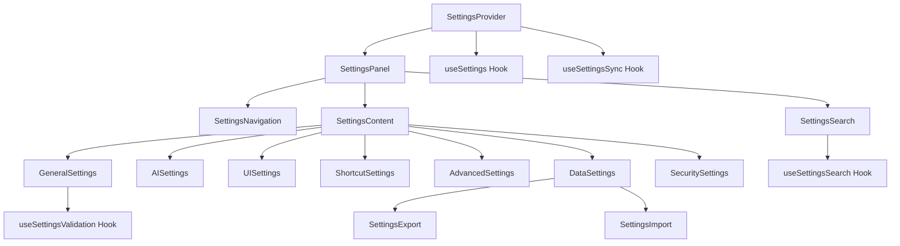
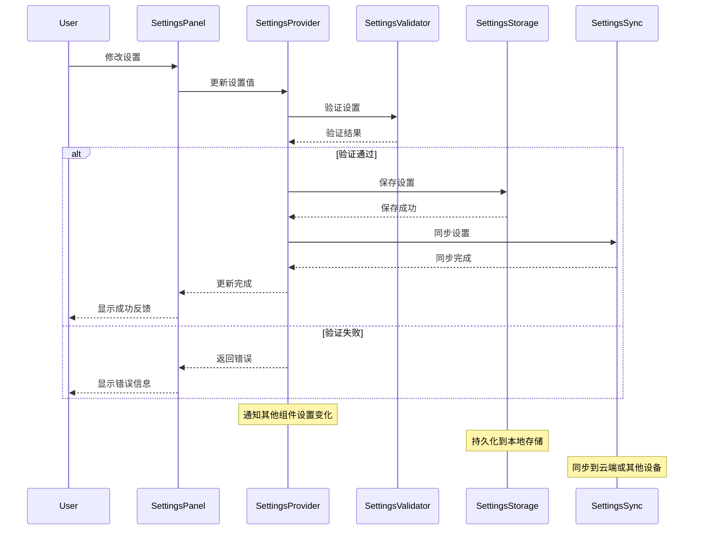

# Settings 组件

## 1. 模块概述

Settings 组件模块是Kilocode应用中负责管理用户设置和应用配置的核心系统，提供全面的配置管理功能，包括用户偏好设置、AI模型配置、界面主题、快捷键设置等，为用户提供个性化的使用体验。

### 核心功能

- 用户偏好设置管理
- AI模型和参数配置
- 界面主题和布局设置
- 快捷键和操作配置
- 数据导入导出功能
- 设置同步和备份
- 实时配置预览
- 设置重置和恢复

### 业务价值

- 提升用户个性化体验
- 优化工作流程效率
- 支持多用户场景
- 增强产品易用性
- 提供灵活的配置选项

## 2. 组件列表

### 2.1 核心组件

| 组件名称           | 文件路径               | 功能描述                           |
| ------------------ | ---------------------- | ---------------------------------- |
| SettingsProvider   | SettingsProvider.tsx   | 设置上下文提供者，管理全局设置状态 |
| SettingsPanel      | SettingsPanel.tsx      | 设置面板主容器，组织各设置分类     |
| SettingsNavigation | SettingsNavigation.tsx | 设置导航，切换不同设置分类         |
| GeneralSettings    | GeneralSettings.tsx    | 通用设置，基础配置选项             |
| AISettings         | AISettings.tsx         | AI设置，模型和参数配置             |
| UISettings         | UISettings.tsx         | 界面设置，主题和布局配置           |
| ShortcutSettings   | ShortcutSettings.tsx   | 快捷键设置，键盘快捷键配置         |
| AdvancedSettings   | AdvancedSettings.tsx   | 高级设置，开发者和实验性功能       |
| DataSettings       | DataSettings.tsx       | 数据设置，导入导出和同步           |
| SecuritySettings   | SecuritySettings.tsx   | 安全设置，隐私和权限配置           |
| SettingsSearch     | SettingsSearch.tsx     | 设置搜索，快速查找配置项           |
| SettingsExport     | SettingsExport.tsx     | 设置导出，配置备份功能             |
| SettingsImport     | SettingsImport.tsx     | 设置导入，配置恢复功能             |

### 2.2 Hook组件

| Hook名称              | 文件路径                 | 功能描述         |
| --------------------- | ------------------------ | ---------------- |
| useSettings           | useSettings.ts           | 设置管理核心Hook |
| useSettingsSync       | useSettingsSync.ts       | 设置同步Hook     |
| useSettingsValidation | useSettingsValidation.ts | 设置验证Hook     |
| useSettingsSearch     | useSettingsSearch.ts     | 设置搜索Hook     |

### 2.3 工具类

| 类名              | 文件路径             | 功能描述   |
| ----------------- | -------------------- | ---------- |
| SettingsManager   | SettingsManager.ts   | 设置管理器 |
| SettingsValidator | SettingsValidator.ts | 设置验证器 |
| SettingsStorage   | SettingsStorage.ts   | 设置存储器 |
| SettingsMigrator  | SettingsMigrator.ts  | 设置迁移器 |

### 2.4 组件层次关系



## 3. 技术架构

### 3.1 设计模式

- **观察者模式**: 监听设置变化并通知相关组件
- **策略模式**: 不同类型设置采用不同的验证和存储策略
- **工厂模式**: 动态创建设置项组件
- **命令模式**: 设置操作的撤销和重做

### 3.2 状态管理

```typescript
interface SettingsState {
	// 通用设置
	general: GeneralSettings
	ai: AISettings
	ui: UISettings
	shortcuts: ShortcutSettings
	advanced: AdvancedSettings
	data: DataSettings
	security: SecuritySettings

	// 元数据
	version: string
	lastModified: Date
	isDirty: boolean
	isLoading: boolean
	isSaving: boolean

	// 搜索和导航
	currentCategory: SettingsCategory
	searchQuery: string
	searchResults: SettingItem[]

	// 同步状态
	syncStatus: SyncStatus
	lastSyncTime: Date | null
	syncConflicts: SyncConflict[]

	// 验证状态
	validationErrors: ValidationError[]
	isValid: boolean

	// 历史记录
	history: SettingsHistoryEntry[]
	canUndo: boolean
	canRedo: boolean
}

interface GeneralSettings {
	language: string
	timezone: string
	autoSave: boolean
	autoUpdate: boolean
	telemetry: boolean
	crashReporting: boolean
	startupBehavior: StartupBehavior
	defaultWorkspace: string
}

interface AISettings {
	defaultModel: string
	temperature: number
	maxTokens: number
	topP: number
	frequencyPenalty: number
	presencePenalty: number
	systemPrompt: string
	customModels: CustomModel[]
	apiKeys: Record<string, string>
	rateLimits: RateLimit[]
	caching: CacheSettings
}

interface UISettings {
	theme: ThemeType
	colorScheme: ColorScheme
	fontSize: number
	fontFamily: string
	layout: LayoutSettings
	animations: boolean
	transparency: number
	compactMode: boolean
	sidebarPosition: SidebarPosition
	toolbarVisible: boolean
	statusBarVisible: boolean
}

interface ShortcutSettings {
	globalShortcuts: Record<string, KeyBinding>
	contextShortcuts: Record<string, Record<string, KeyBinding>>
	customShortcuts: CustomShortcut[]
	enabled: boolean
	conflictResolution: ConflictResolution
}

interface AdvancedSettings {
	debugMode: boolean
	experimentalFeatures: string[]
	performanceMode: PerformanceMode
	memoryLimit: number
	logLevel: LogLevel
	developerMode: boolean
	customCSS: string
	customJS: string
	pluginSettings: Record<string, any>
}

interface DataSettings {
	storageLocation: string
	backupEnabled: boolean
	backupFrequency: BackupFrequency
	retentionPeriod: number
	compressionEnabled: boolean
	encryptionEnabled: boolean
	syncEnabled: boolean
	syncProvider: SyncProvider
	exportFormat: ExportFormat
}

interface SecuritySettings {
	authenticationRequired: boolean
	sessionTimeout: number
	passwordPolicy: PasswordPolicy
	twoFactorEnabled: boolean
	auditLogging: boolean
	dataEncryption: boolean
	networkSecurity: NetworkSecurity
	permissions: Permission[]
}

enum SettingsCategory {
	GENERAL = "general",
	AI = "ai",
	UI = "ui",
	SHORTCUTS = "shortcuts",
	ADVANCED = "advanced",
	DATA = "data",
	SECURITY = "security",
}

enum SyncStatus {
	IDLE = "idle",
	SYNCING = "syncing",
	SUCCESS = "success",
	ERROR = "error",
	CONFLICT = "conflict",
}

enum ThemeType {
	AUTO = "auto",
	LIGHT = "light",
	DARK = "dark",
	HIGH_CONTRAST = "high-contrast",
}
```

### 3.3 数据流向



## 4. API文档

### 4.1 SettingsProvider Props

```typescript
interface SettingsProviderProps {
	/** 初始设置 */
	initialSettings?: Partial<SettingsState>
	/** 设置存储适配器 */
	storageAdapter?: SettingsStorageAdapter
	/** 同步适配器 */
	syncAdapter?: SettingsSyncAdapter
	/** 子组件 */
	children: React.ReactNode
	/** 设置变化回调 */
	onSettingsChange?: (settings: SettingsState) => void
	/** 同步状态回调 */
	onSyncStatusChange?: (status: SyncStatus) => void
	/** 错误处理回调 */
	onError?: (error: SettingsError) => void
}
```

### 4.2 useSettings Hook

```typescript
interface UseSettingsResult {
	/** 当前设置状态 */
	settings: SettingsState
	/** 更新设置 */
	updateSettings: <T extends keyof SettingsState>(category: T, updates: Partial<SettingsState[T]>) => Promise<void>
	/** 获取设置值 */
	getSetting: <T extends keyof SettingsState, K extends keyof SettingsState[T]>(
		category: T,
		key: K,
	) => SettingsState[T][K]
	/** 重置设置 */
	resetSettings: (category?: SettingsCategory) => Promise<void>
	/** 导出设置 */
	exportSettings: (format?: ExportFormat) => Promise<string>
	/** 导入设置 */
	importSettings: (data: string, format?: ExportFormat) => Promise<void>
	/** 同步设置 */
	syncSettings: () => Promise<void>
	/** 验证设置 */
	validateSettings: (settings?: Partial<SettingsState>) => ValidationResult
	/** 撤销操作 */
	undo: () => Promise<void>
	/** 重做操作 */
	redo: () => Promise<void>
	/** 搜索设置 */
	searchSettings: (query: string) => SettingItem[]
}

interface SettingItem {
	id: string
	category: SettingsCategory
	key: string
	label: string
	description: string
	type: SettingType
	value: any
	defaultValue: any
	options?: SettingOption[]
	validation?: ValidationRule[]
}

interface ValidationResult {
	isValid: boolean
	errors: ValidationError[]
	warnings: ValidationWarning[]
}
```

### 4.3 SettingsPanel Props

```typescript
interface SettingsPanelProps {
	/** 初始分类 */
	initialCategory?: SettingsCategory
	/** 是否显示搜索 */
	showSearch?: boolean
	/** 是否显示导航 */
	showNavigation?: boolean
	/** 自定义样式类 */
	className?: string
	/** 分类过滤器 */
	categoryFilter?: (category: SettingsCategory) => boolean
	/** 设置项过滤器 */
	settingFilter?: (item: SettingItem) => boolean
	/** 分类变化回调 */
	onCategoryChange?: (category: SettingsCategory) => void
	/** 设置变化回调 */
	onSettingChange?: (item: SettingItem, value: any) => void
}
```

## 5. 使用示例

### 5.1 基础设置使用

```tsx
import { SettingsProvider, useSettings, SettingsPanel } from "@/components/settings"

function SettingsExample() {
	const { settings, updateSettings, getSetting, resetSettings, exportSettings, importSettings } = useSettings()

	const [exportData, setExportData] = useState("")

	const handleThemeChange = async (theme: ThemeType) => {
		try {
			await updateSettings("ui", { theme })
			console.log("Theme updated successfully")
		} catch (error) {
			console.error("Failed to update theme:", error)
		}
	}

	const handleLanguageChange = async (language: string) => {
		try {
			await updateSettings("general", { language })
			console.log("Language updated successfully")
		} catch (error) {
			console.error("Failed to update language:", error)
		}
	}

	const handleExportSettings = async () => {
		try {
			const data = await exportSettings("json")
			setExportData(data)

			// 下载文件
			const blob = new Blob([data], { type: "application/json" })
			const url = URL.createObjectURL(blob)
			const a = document.createElement("a")
			a.href = url
			a.download = "kilocode-settings.json"
			a.click()
			URL.revokeObjectURL(url)
		} catch (error) {
			console.error("Failed to export settings:", error)
		}
	}

	const handleImportSettings = async (event: React.ChangeEvent<HTMLInputElement>) => {
		const file = event.target.files?.[0]
		if (!file) return

		try {
			const text = await file.text()
			await importSettings(text, "json")
			alert("Settings imported successfully")
		} catch (error) {
			console.error("Failed to import settings:", error)
			alert("Failed to import settings")
		}
	}

	const handleResetCategory = async (category: SettingsCategory) => {
		if (confirm(`Are you sure you want to reset ${category} settings?`)) {
			try {
				await resetSettings(category)
				alert(`${category} settings reset successfully`)
			} catch (error) {
				console.error("Failed to reset settings:", error)
			}
		}
	}

	return (
		<div className="settings-example">
			<div className="settings-header">
				<h2>Application Settings</h2>
				<div className="settings-actions">
					<button onClick={handleExportSettings}>Export Settings</button>
					<label className="import-button">
						Import Settings
						<input type="file" accept=".json" onChange={handleImportSettings} style={{ display: "none" }} />
					</label>
				</div>
			</div>

			<div className="quick-settings">
				<div className="setting-group">
					<label>Theme:</label>
					<select
						value={getSetting("ui", "theme")}
						onChange={(e) => handleThemeChange(e.target.value as ThemeType)}>
						<option value={ThemeType.AUTO}>Auto</option>
						<option value={ThemeType.LIGHT}>Light</option>
						<option value={ThemeType.DARK}>Dark</option>
						<option value={ThemeType.HIGH_CONTRAST}>High Contrast</option>
					</select>
				</div>

				<div className="setting-group">
					<label>Language:</label>
					<select
						value={getSetting("general", "language")}
						onChange={(e) => handleLanguageChange(e.target.value)}>
						<option value="en">English</option>
						<option value="zh">中文</option>
						<option value="ja">日本語</option>
						<option value="ko">한국어</option>
					</select>
				</div>

				<div className="setting-group">
					<label>
						<input
							type="checkbox"
							checked={getSetting("general", "autoSave")}
							onChange={(e) => updateSettings("general", { autoSave: e.target.checked })}
						/>
						Auto Save
					</label>
				</div>

				<div className="setting-group">
					<label>
						<input
							type="checkbox"
							checked={getSetting("ui", "animations")}
							onChange={(e) => updateSettings("ui", { animations: e.target.checked })}
						/>
						Animations
					</label>
				</div>
			</div>

			<SettingsPanel
				showSearch={true}
				showNavigation={true}
				onCategoryChange={(category) => {
					console.log("Category changed to:", category)
				}}
				onSettingChange={(item, value) => {
					console.log("Setting changed:", item.key, value)
				}}
			/>

			<div className="settings-status">
				<div className="status-info">
					<span>Last Modified: {settings.lastModified.toLocaleString()}</span>
					<span>Version: {settings.version}</span>
					<span>Sync Status: {settings.syncStatus}</span>
				</div>

				<div className="status-actions">
					{settings.isDirty && <span className="dirty-indicator">Unsaved changes</span>}

					{settings.canUndo && <button onClick={() => undo()}>Undo</button>}

					{settings.canRedo && <button onClick={() => redo()}>Redo</button>}
				</div>
			</div>

			<div className="category-reset">
				<h3>Reset Settings</h3>
				<div className="reset-buttons">
					{Object.values(SettingsCategory).map((category) => (
						<button key={category} onClick={() => handleResetCategory(category)} className="reset-button">
							Reset {category}
						</button>
					))}
				</div>
			</div>
		</div>
	)
}

// 应用根组件
function App() {
	const storageAdapter = new LocalStorageAdapter()
	const syncAdapter = new CloudSyncAdapter()

	return (
		<SettingsProvider
			storageAdapter={storageAdapter}
			syncAdapter={syncAdapter}
			onSettingsChange={(settings) => {
				console.log("Settings changed:", settings)
			}}
			onSyncStatusChange={(status) => {
				console.log("Sync status:", status)
			}}
			onError={(error) => {
				console.error("Settings error:", error)
			}}>
			<SettingsExample />
		</SettingsProvider>
	)
}
```

### 5.2 自定义设置组件

```tsx
import { useSettings, SettingItem } from "@/components/settings"

function CustomSettingComponent({ item }: { item: SettingItem }) {
	const { updateSettings, getSetting } = useSettings()

	const currentValue = getSetting(item.category, item.key)

	const handleChange = async (newValue: any) => {
		try {
			await updateSettings(item.category, { [item.key]: newValue })
		} catch (error) {
			console.error("Failed to update setting:", error)
		}
	}

	const renderSettingInput = () => {
		switch (item.type) {
			case "boolean":
				return (
					<label className="checkbox-setting">
						<input
							type="checkbox"
							checked={currentValue}
							onChange={(e) => handleChange(e.target.checked)}
						/>
						<span className="checkmark"></span>
						{item.label}
					</label>
				)

			case "string":
				return (
					<div className="string-setting">
						<label>{item.label}</label>
						<input
							type="text"
							value={currentValue || ""}
							onChange={(e) => handleChange(e.target.value)}
							placeholder={item.defaultValue}
						/>
					</div>
				)

			case "number":
				return (
					<div className="number-setting">
						<label>{item.label}</label>
						<input
							type="number"
							value={currentValue || 0}
							onChange={(e) => handleChange(parseFloat(e.target.value))}
							min={item.validation?.min}
							max={item.validation?.max}
							step={item.validation?.step}
						/>
					</div>
				)

			case "select":
				return (
					<div className="select-setting">
						<label>{item.label}</label>
						<select value={currentValue} onChange={(e) => handleChange(e.target.value)}>
							{item.options?.map((option) => (
								<option key={option.value} value={option.value}>
									{option.label}
								</option>
							))}
						</select>
					</div>
				)

			case "range":
				return (
					<div className="range-setting">
						<label>
							{item.label}: {currentValue}
						</label>
						<input
							type="range"
							value={currentValue || 0}
							onChange={(e) => handleChange(parseFloat(e.target.value))}
							min={item.validation?.min || 0}
							max={item.validation?.max || 100}
							step={item.validation?.step || 1}
						/>
						<div className="range-labels">
							<span>{item.validation?.min || 0}</span>
							<span>{item.validation?.max || 100}</span>
						</div>
					</div>
				)

			case "color":
				return (
					<div className="color-setting">
						<label>{item.label}</label>
						<input
							type="color"
							value={currentValue || "#000000"}
							onChange={(e) => handleChange(e.target.value)}
						/>
					</div>
				)

			default:
				return (
					<div className="unknown-setting">
						<label>{item.label}</label>
						<span>Unsupported setting type: {item.type}</span>
					</div>
				)
		}
	}

	return (
		<div className="custom-setting-item">
			{renderSettingInput()}
			{item.description && <div className="setting-description">{item.description}</div>}
		</div>
	)
}

// 设置分组组件
function SettingsGroup({
	title,
	items,
	collapsible = false,
}: {
	title: string
	items: SettingItem[]
	collapsible?: boolean
}) {
	const [collapsed, setCollapsed] = useState(false)

	return (
		<div className="settings-group">
			<div className="group-header">
				<h3>{title}</h3>
				{collapsible && (
					<button className="collapse-button" onClick={() => setCollapsed(!collapsed)}>
						{collapsed ? "▶" : "▼"}
					</button>
				)}
			</div>

			{!collapsed && (
				<div className="group-content">
					{items.map((item) => (
						<CustomSettingComponent key={item.id} item={item} />
					))}
				</div>
			)}
		</div>
	)
}
```

### 5.3 设置搜索和过滤

```tsx
import { useSettingsSearch } from "@/components/settings"

function SettingsSearchExample() {
	const { searchQuery, searchResults, setSearchQuery, clearSearch, searchHistory, addToHistory } = useSettingsSearch()

	const [showAdvancedSearch, setShowAdvancedSearch] = useState(false)
	const [filters, setFilters] = useState({
		category: "",
		type: "",
		modified: false,
	})

	const handleSearch = (query: string) => {
		setSearchQuery(query)
		if (query.trim()) {
			addToHistory(query)
		}
	}

	const handleAdvancedSearch = () => {
		// 实现高级搜索逻辑
		const filteredResults = searchResults.filter((item) => {
			if (filters.category && item.category !== filters.category) {
				return false
			}
			if (filters.type && item.type !== filters.type) {
				return false
			}
			if (filters.modified && !item.isModified) {
				return false
			}
			return true
		})

		return filteredResults
	}

	const highlightText = (text: string, query: string) => {
		if (!query) return text

		const regex = new RegExp(`(${query})`, "gi")
		const parts = text.split(regex)

		return parts.map((part, index) => (regex.test(part) ? <mark key={index}>{part}</mark> : part))
	}

	return (
		<div className="settings-search">
			<div className="search-header">
				<div className="search-input-container">
					<input
						type="text"
						value={searchQuery}
						onChange={(e) => handleSearch(e.target.value)}
						placeholder="Search settings..."
						className="search-input"
					/>
					<button onClick={clearSearch} className="clear-search" disabled={!searchQuery}>
						✕
					</button>
				</div>

				<button onClick={() => setShowAdvancedSearch(!showAdvancedSearch)} className="advanced-search-toggle">
					Advanced
				</button>
			</div>

			{showAdvancedSearch && (
				<div className="advanced-search">
					<div className="filter-group">
						<label>Category:</label>
						<select
							value={filters.category}
							onChange={(e) => setFilters((prev) => ({ ...prev, category: e.target.value }))}>
							<option value="">All Categories</option>
							{Object.values(SettingsCategory).map((category) => (
								<option key={category} value={category}>
									{category.charAt(0).toUpperCase() + category.slice(1)}
								</option>
							))}
						</select>
					</div>

					<div className="filter-group">
						<label>Type:</label>
						<select
							value={filters.type}
							onChange={(e) => setFilters((prev) => ({ ...prev, type: e.target.value }))}>
							<option value="">All Types</option>
							<option value="boolean">Boolean</option>
							<option value="string">String</option>
							<option value="number">Number</option>
							<option value="select">Select</option>
							<option value="range">Range</option>
						</select>
					</div>

					<div className="filter-group">
						<label>
							<input
								type="checkbox"
								checked={filters.modified}
								onChange={(e) => setFilters((prev) => ({ ...prev, modified: e.target.checked }))}
							/>
							Modified only
						</label>
					</div>
				</div>
			)}

			{searchHistory.length > 0 && !searchQuery && (
				<div className="search-history">
					<h4>Recent Searches</h4>
					<div className="history-items">
						{searchHistory.slice(0, 5).map((query, index) => (
							<button key={index} onClick={() => handleSearch(query)} className="history-item">
								{query}
							</button>
						))}
					</div>
				</div>
			)}

			<div className="search-results">
				{searchQuery && (
					<div className="results-header">
						<span>
							{searchResults.length} results for "{searchQuery}"
						</span>
					</div>
				)}

				{searchResults.length === 0 && searchQuery && (
					<div className="no-results">
						<p>No settings found matching "{searchQuery}"</p>
						<p>Try different keywords or check the advanced filters.</p>
					</div>
				)}

				{searchResults.map((item) => (
					<div key={item.id} className="search-result-item">
						<div className="result-header">
							<h4>{highlightText(item.label, searchQuery)}</h4>
							<span className="result-category">{item.category}</span>
						</div>
						<div className="result-description">{highlightText(item.description, searchQuery)}</div>
						<div className="result-path">
							{item.category} → {item.key}
						</div>
					</div>
				))}
			</div>
		</div>
	)
}
```

## 6. 样式和主题

### 6.1 CSS类名规范

```css
/* 设置容器 */
.settings-container {
	display: flex;
	height: 100vh;
	background-color: var(--vscode-editor-background);
	color: var(--vscode-foreground);
}

.settings-sidebar {
	width: 240px;
	background-color: var(--vscode-sideBar-background);
	border-right: 1px solid var(--vscode-sideBar-border);
	overflow-y: auto;
}

.settings-content {
	flex: 1;
	padding: 20px;
	overflow-y: auto;
}

/* 设置导航 */
.settings-navigation {
	padding: 16px 0;
}

.nav-item {
	display: flex;
	align-items: center;
	padding: 8px 16px;
	cursor: pointer;
	color: var(--vscode-sideBar-foreground);
	text-decoration: none;
	transition: background-color 0.2s ease;
}

.nav-item:hover {
	background-color: var(--vscode-list-hoverBackground);
}

.nav-item.active {
	background-color: var(--vscode-list-activeSelectionBackground);
	color: var(--vscode-list-activeSelectionForeground);
}

.nav-item-icon {
	width: 16px;
	height: 16px;
	margin-right: 8px;
	opacity: 0.8;
}

.nav-item.active .nav-item-icon {
	opacity: 1;
}

/* 设置搜索 */
.settings-search {
	padding: 16px;
	border-bottom: 1px solid var(--vscode-panel-border);
}

.search-input-container {
	position: relative;
	display: flex;
	align-items: center;
}

.search-input {
	width: 100%;
	padding: 8px 32px 8px 12px;
	background-color: var(--vscode-input-background);
	border: 1px solid var(--vscode-input-border);
	border-radius: 4px;
	color: var(--vscode-input-foreground);
	font-size: 13px;
}

.search-input:focus {
	outline: none;
	border-color: var(--vscode-focusBorder);
}

.clear-search {
	position: absolute;
	right: 8px;
	background: none;
	border: none;
	color: var(--vscode-input-foreground);
	cursor: pointer;
	padding: 4px;
	opacity: 0.6;
}

.clear-search:hover {
	opacity: 1;
}

.clear-search:disabled {
	opacity: 0.3;
	cursor: not-allowed;
}

/* 设置面板 */
.settings-panel {
	max-width: 800px;
}

.settings-header {
	display: flex;
	align-items: center;
	justify-content: space-between;
	margin-bottom: 24px;
	padding-bottom: 16px;
	border-bottom: 1px solid var(--vscode-panel-border);
}

.settings-header h2 {
	margin: 0;
	font-size: 20px;
	font-weight: 600;
}

.settings-actions {
	display: flex;
	gap: 8px;
}

.settings-actions button,
.import-button {
	padding: 6px 12px;
	background-color: var(--vscode-button-secondaryBackground);
	color: var(--vscode-button-secondaryForeground);
	border: none;
	border-radius: 4px;
	cursor: pointer;
	font-size: 13px;
}

.settings-actions button:hover,
.import-button:hover {
	background-color: var(--vscode-button-secondaryHoverBackground);
}

/* 设置分组 */
.settings-group {
	margin-bottom: 32px;
	background-color: var(--vscode-editor-background);
	border: 1px solid var(--vscode-input-border);
	border-radius: 6px;
	overflow: hidden;
}

.group-header {
	display: flex;
	align-items: center;
	justify-content: space-between;
	padding: 16px 20px;
	background-color: var(--vscode-editorGroupHeader-tabsBackground);
	border-bottom: 1px solid var(--vscode-input-border);
}

.group-header h3 {
	margin: 0;
	font-size: 16px;
	font-weight: 600;
}

.collapse-button {
	background: none;
	border: none;
	color: var(--vscode-foreground);
	cursor: pointer;
	padding: 4px;
	font-size: 12px;
}

.group-content {
	padding: 20px;
}

/* 设置项 */
.custom-setting-item {
	margin-bottom: 20px;
}

.custom-setting-item:last-child {
	margin-bottom: 0;
}

.setting-description {
	margin-top: 4px;
	font-size: 12px;
	color: var(--vscode-descriptionForeground);
	line-height: 1.4;
}

/* 不同类型的设置项 */
.checkbox-setting {
	display: flex;
	align-items: center;
	cursor: pointer;
	font-size: 14px;
}

.checkbox-setting input[type="checkbox"] {
	margin-right: 8px;
}

.string-setting,
.number-setting,
.select-setting {
	display: flex;
	flex-direction: column;
	gap: 6px;
}

.string-setting label,
.number-setting label,
.select-setting label {
	font-size: 14px;
	font-weight: 500;
}

.string-setting input,
.number-setting input,
.select-setting select {
	padding: 8px 12px;
	background-color: var(--vscode-input-background);
	border: 1px solid var(--vscode-input-border);
	border-radius: 4px;
	color: var(--vscode-input-foreground);
	font-size: 13px;
}

.string-setting input:focus,
.number-setting input:focus,
.select-setting select:focus {
	outline: none;
	border-color: var(--vscode-focusBorder);
}

.range-setting {
	display: flex;
	flex-direction: column;
	gap: 8px;
}

.range-setting label {
	font-size: 14px;
	font-weight: 500;
}

.range-setting input[type="range"] {
	width: 100%;
}

.range-labels {
	display: flex;
	justify-content: space-between;
	font-size: 12px;
	color: var(--vscode-descriptionForeground);
}

.color-setting {
	display: flex;
	align-items: center;
	gap: 12px;
}

.color-setting label {
	font-size: 14px;
	font-weight: 500;
}

.color-setting input[type="color"] {
	width: 40px;
	height: 32px;
	border: 1px solid var(--vscode-input-border);
	border-radius: 4px;
	cursor: pointer;
}

/* 快速设置 */
.quick-settings {
	display: grid;
	grid-template-columns: repeat(auto-fit, minmax(200px, 1fr));
	gap: 16px;
	margin-bottom: 32px;
	padding: 20px;
	background-color: var(--vscode-editorWidget-background);
	border: 1px solid var(--vscode-editorWidget-border);
	border-radius: 6px;
}

.setting-group {
	display: flex;
	flex-direction: column;
	gap: 6px;
}

.setting-group label {
	font-size: 13px;
	font-weight: 500;
}

.setting-group select,
.setting-group input {
	padding: 6px 8px;
	background-color: var(--vscode-input-background);
	border: 1px solid var(--vscode-input-border);
	border-radius: 3px;
	color: var(--vscode-input-foreground);
	font-size: 12px;
}

/* 设置状态 */
.settings-status {
	display: flex;
	align-items: center;
	justify-content: space-between;
	margin-top: 32px;
	padding: 12px 16px;
	background-color: var(--vscode-statusBar-background);
	border: 1px solid var(--vscode-statusBar-border);
	border-radius: 4px;
	font-size: 12px;
}

.status-info {
	display: flex;
	gap: 16px;
	color: var(--vscode-statusBar-foreground);
}

.status-actions {
	display: flex;
	align-items: center;
	gap: 8px;
}

.dirty-indicator {
	color: var(--vscode-notificationsWarningIcon-foreground);
	font-weight: 500;
}

.status-actions button {
	padding: 4px 8px;
	background-color: var(--vscode-button-secondaryBackground);
	color: var(--vscode-button-secondaryForeground);
	border: none;
	border-radius: 3px;
	cursor: pointer;
	font-size: 11px;
}

/* 搜索结果 */
.search-results {
	margin-top: 16px;
}

.results-header {
	margin-bottom: 12px;
	font-size: 13px;
	color: var(--vscode-descriptionForeground);
}

.no-results {
	text-align: center;
	padding: 32px;
	color: var(--vscode-descriptionForeground);
}

.search-result-item {
	padding: 12px;
	margin-bottom: 8px;
	background-color: var(--vscode-list-inactiveSelectionBackground);
	border-radius: 4px;
	cursor: pointer;
}

.search-result-item:hover {
	background-color: var(--vscode-list-hoverBackground);
}

.result-header {
	display: flex;
	align-items: center;
	justify-content: space-between;
	margin-bottom: 4px;
}

.result-header h4 {
	margin: 0;
	font-size: 14px;
}

.result-category {
	font-size: 11px;
	color: var(--vscode-descriptionForeground);
	background-color: var(--vscode-badge-background);
	color: var(--vscode-badge-foreground);
	padding: 2px 6px;
	border-radius: 3px;
}

.result-description {
	font-size: 12px;
	color: var(--vscode-descriptionForeground);
	margin-bottom: 4px;
}

.result-path {
	font-size: 11px;
	color: var(--vscode-descriptionForeground);
	font-family: var(--vscode-editor-font-family);
}

.search-result-item mark {
	background-color: var(--vscode-editor-findMatchHighlightBackground);
	color: var(--vscode-editor-foreground);
	padding: 1px 2px;
	border-radius: 2px;
}

/* 搜索历史 */
.search-history {
	margin-bottom: 16px;
}

.search-history h4 {
	margin: 0 0 8px 0;
	font-size: 13px;
	color: var(--vscode-foreground);
}

.history-items {
	display: flex;
	flex-wrap: wrap;
	gap: 6px;
}

.history-item {
	padding: 4px 8px;
	background-color: var(--vscode-button-secondaryBackground);
	color: var(--vscode-button-secondaryForeground);
	border: none;
	border-radius: 12px;
	cursor: pointer;
	font-size: 11px;
}

.history-item:hover {
	background-color: var(--vscode-button-secondaryHoverBackground);
}

/* 高级搜索 */
.advanced-search {
	margin-top: 12px;
	padding: 12px;
	background-color: var(--vscode-editorWidget-background);
	border: 1px solid var(--vscode-editorWidget-border);
	border-radius: 4px;
}

.filter-group {
	display: flex;
	align-items: center;
	gap: 8px;
	margin-bottom: 8px;
}

.filter-group:last-child {
	margin-bottom: 0;
}

.filter-group label {
	min-width: 80px;
	font-size: 12px;
}

.filter-group select {
	padding: 4px 8px;
	background-color: var(--vscode-input-background);
	border: 1px solid var(--vscode-input-border);
	border-radius: 3px;
	color: var(--vscode-input-foreground);
	font-size: 12px;
}

/* 重置按钮 */
.category-reset {
	margin-top: 32px;
	padding: 20px;
	background-color: var(--vscode-editorWidget-background);
	border: 1px solid var(--vscode-editorWidget-border);
	border-radius: 6px;
}

.category-reset h3 {
	margin: 0 0 16px 0;
	font-size: 16px;
	color: var(--vscode-foreground);
}

.reset-buttons {
	display: flex;
	flex-wrap: wrap;
	gap: 8px;
}

.reset-button {
	padding: 6px 12px;
	background-color: var(--vscode-button-background);
	color: var(--vscode-button-foreground);
	border: none;
	border-radius: 4px;
	cursor: pointer;
	font-size: 12px;
}

.reset-button:hover {
	background-color: var(--vscode-button-hoverBackground);
}
```
