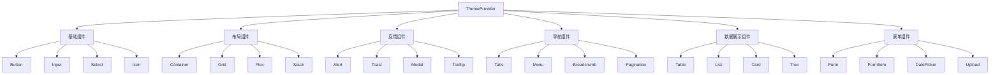

# UI 组件

## 1. 模块概述

UI 组件模块是Kilocode应用中的基础UI组件库，提供一套完整的、可复用的界面组件，包括按钮、输入框、对话框、加载器等基础组件，以及复合组件如表格、表单、导航等，确保整个应用的界面一致性和用户体验。

### 核心功能

- 基础UI组件库
- 复合交互组件
- 主题和样式系统
- 响应式设计支持
- 可访问性优化
- 动画和过渡效果
- 组件状态管理
- 自定义样式支持

### 业务价值

- 提升开发效率
- 保证界面一致性
- 优化用户体验
- 降低维护成本
- 支持快速迭代

## 2. 组件列表

### 2.1 基础组件

| 组件名称 | 文件路径     | 功能描述                       |
| -------- | ------------ | ------------------------------ |
| Button   | Button.tsx   | 按钮组件，支持多种样式和状态   |
| Input    | Input.tsx    | 输入框组件，支持多种类型和验证 |
| Select   | Select.tsx   | 选择器组件，支持单选和多选     |
| Checkbox | Checkbox.tsx | 复选框组件，支持组合使用       |
| Radio    | Radio.tsx    | 单选框组件，支持分组           |
| Switch   | Switch.tsx   | 开关组件，布尔值切换           |
| Slider   | Slider.tsx   | 滑块组件，数值范围选择         |
| Progress | Progress.tsx | 进度条组件，显示进度状态       |
| Spinner  | Spinner.tsx  | 加载动画组件，多种样式         |
| Avatar   | Avatar.tsx   | 头像组件，支持图片和文字       |
| Badge    | Badge.tsx    | 徽章组件，状态和数量显示       |
| Tag      | Tag.tsx      | 标签组件，分类和标记           |
| Divider  | Divider.tsx  | 分割线组件，内容分隔           |
| Icon     | Icon.tsx     | 图标组件，SVG图标库            |

### 2.2 布局组件

| 组件名称    | 文件路径        | 功能描述                     |
| ----------- | --------------- | ---------------------------- |
| Container   | Container.tsx   | 容器组件，内容包装           |
| Grid        | Grid.tsx        | 网格布局组件，响应式网格     |
| Flex        | Flex.tsx        | 弹性布局组件，Flexbox封装    |
| Stack       | Stack.tsx       | 堆叠布局组件，垂直或水平排列 |
| Spacer      | Spacer.tsx      | 间距组件，空白占位           |
| Center      | Center.tsx      | 居中组件，内容居中对齐       |
| AspectRatio | AspectRatio.tsx | 宽高比组件，保持比例         |

### 2.3 反馈组件

| 组件名称      | 文件路径          | 功能描述               |
| ------------- | ----------------- | ---------------------- |
| Alert         | Alert.tsx         | 警告组件，消息提示     |
| Toast         | Toast.tsx         | 吐司组件，临时通知     |
| Modal         | Modal.tsx         | 模态框组件，弹窗对话   |
| Drawer        | Drawer.tsx        | 抽屉组件，侧边面板     |
| Popover       | Popover.tsx       | 弹出框组件，悬浮内容   |
| Tooltip       | Tooltip.tsx       | 工具提示组件，悬停说明 |
| Notification  | Notification.tsx  | 通知组件，系统消息     |
| ConfirmDialog | ConfirmDialog.tsx | 确认对话框，操作确认   |

### 2.4 导航组件

| 组件名称   | 文件路径       | 功能描述               |
| ---------- | -------------- | ---------------------- |
| Tabs       | Tabs.tsx       | 标签页组件，内容切换   |
| Breadcrumb | Breadcrumb.tsx | 面包屑组件，路径导航   |
| Menu       | Menu.tsx       | 菜单组件，选项列表     |
| Dropdown   | Dropdown.tsx   | 下拉菜单组件，选项展开 |
| Pagination | Pagination.tsx | 分页组件，页面导航     |
| Steps      | Steps.tsx      | 步骤条组件，流程指示   |

### 2.5 数据展示组件

| 组件名称  | 文件路径      | 功能描述                   |
| --------- | ------------- | -------------------------- |
| Table     | Table.tsx     | 表格组件，数据展示         |
| List      | List.tsx      | 列表组件，项目展示         |
| Card      | Card.tsx      | 卡片组件，内容容器         |
| Collapse  | Collapse.tsx  | 折叠面板组件，内容展开收起 |
| Tree      | Tree.tsx      | 树形组件，层级数据         |
| Timeline  | Timeline.tsx  | 时间轴组件，时序展示       |
| Statistic | Statistic.tsx | 统计数值组件，数据展示     |

### 2.6 表单组件

| 组件名称    | 文件路径        | 功能描述               |
| ----------- | --------------- | ---------------------- |
| Form        | Form.tsx        | 表单组件，表单容器     |
| FormItem    | FormItem.tsx    | 表单项组件，字段包装   |
| FormGroup   | FormGroup.tsx   | 表单分组组件，字段分组 |
| Textarea    | Textarea.tsx    | 文本域组件，多行输入   |
| DatePicker  | DatePicker.tsx  | 日期选择器，日期输入   |
| TimePicker  | TimePicker.tsx  | 时间选择器，时间输入   |
| ColorPicker | ColorPicker.tsx | 颜色选择器，颜色输入   |
| Upload      | Upload.tsx      | 上传组件，文件上传     |

### 2.7 Hook组件

| Hook名称        | 文件路径           | 功能描述     |
| --------------- | ------------------ | ------------ |
| useTheme        | useTheme.ts        | 主题管理Hook |
| useBreakpoint   | useBreakpoint.ts   | 断点检测Hook |
| useDisclosure   | useDisclosure.ts   | 显示状态Hook |
| useClipboard    | useClipboard.ts    | 剪贴板Hook   |
| useLocalStorage | useLocalStorage.ts | 本地存储Hook |
| useDebounce     | useDebounce.ts     | 防抖Hook     |
| useThrottle     | useThrottle.ts     | 节流Hook     |

### 2.8 组件层次关系



## 3. 技术架构

### 3.1 设计模式

- **组合模式**: 组件可以嵌套组合使用
- **策略模式**: 不同主题和样式策略
- **观察者模式**: 主题变化通知
- **工厂模式**: 动态创建组件实例

### 3.2 主题系统

```typescript
interface Theme {
	// 颜色系统
	colors: {
		primary: ColorPalette
		secondary: ColorPalette
		success: ColorPalette
		warning: ColorPalette
		error: ColorPalette
		info: ColorPalette
		gray: ColorPalette
		background: string
		surface: string
		text: {
			primary: string
			secondary: string
			disabled: string
			inverse: string
		}
		border: {
			default: string
			light: string
			dark: string
		}
	}

	// 字体系统
	typography: {
		fontFamily: {
			sans: string
			mono: string
		}
		fontSize: {
			xs: string
			sm: string
			base: string
			lg: string
			xl: string
			"2xl": string
			"3xl": string
			"4xl": string
		}
		fontWeight: {
			normal: number
			medium: number
			semibold: number
			bold: number
		}
		lineHeight: {
			tight: number
			normal: number
			relaxed: number
		}
	}

	// 间距系统
	spacing: {
		0: string
		1: string
		2: string
		3: string
		4: string
		5: string
		6: string
		8: string
		10: string
		12: string
		16: string
		20: string
		24: string
		32: string
		40: string
		48: string
		56: string
		64: string
	}

	// 圆角系统
	borderRadius: {
		none: string
		sm: string
		base: string
		md: string
		lg: string
		xl: string
		full: string
	}

	// 阴影系统
	shadows: {
		xs: string
		sm: string
		base: string
		md: string
		lg: string
		xl: string
		"2xl": string
		inner: string
	}

	// 断点系统
	breakpoints: {
		sm: string
		md: string
		lg: string
		xl: string
		"2xl": string
	}

	// 动画系统
	transitions: {
		duration: {
			fast: string
			normal: string
			slow: string
		}
		easing: {
			ease: string
			easeIn: string
			easeOut: string
			easeInOut: string
		}
	}

	// Z-index系统
	zIndex: {
		hide: number
		auto: number
		base: number
		docked: number
		dropdown: number
		sticky: number
		banner: number
		overlay: number
		modal: number
		popover: number
		skipLink: number
		toast: number
		tooltip: number
	}
}

interface ColorPalette {
	50: string
	100: string
	200: string
	300: string
	400: string
	500: string
	600: string
	700: string
	800: string
	900: string
}

// 组件变体系统
interface ComponentVariants {
	// 按钮变体
	button: {
		solid: ButtonVariant
		outline: ButtonVariant
		ghost: ButtonVariant
		link: ButtonVariant
	}

	// 输入框变体
	input: {
		outline: InputVariant
		filled: InputVariant
		flushed: InputVariant
		unstyled: InputVariant
	}

	// 警告变体
	alert: {
		solid: AlertVariant
		subtle: AlertVariant
		"left-accent": AlertVariant
		"top-accent": AlertVariant
	}
}

interface ButtonVariant {
	bg: string
	color: string
	border: string
	_hover: {
		bg: string
		color?: string
		border?: string
	}
	_active: {
		bg: string
		color?: string
	}
	_disabled: {
		bg: string
		color: string
		opacity: number
	}
}
```

### 3.3 组件状态管理

```typescript
interface ComponentState {
	// 基础状态
	isLoading: boolean
	isDisabled: boolean
	isReadOnly: boolean
	isRequired: boolean
	isInvalid: boolean

	// 交互状态
	isHovered: boolean
	isFocused: boolean
	isPressed: boolean
	isSelected: boolean
	isExpanded: boolean

	// 尺寸状态
	size: ComponentSize
	variant: ComponentVariant
	colorScheme: ColorScheme

	// 自定义状态
	[key: string]: any
}

enum ComponentSize {
	XS = "xs",
	SM = "sm",
	MD = "md",
	LG = "lg",
	XL = "xl",
}

enum ComponentVariant {
	SOLID = "solid",
	OUTLINE = "outline",
	GHOST = "ghost",
	LINK = "link",
}

enum ColorScheme {
	PRIMARY = "primary",
	SECONDARY = "secondary",
	SUCCESS = "success",
	WARNING = "warning",
	ERROR = "error",
	INFO = "info",
	GRAY = "gray",
}
```

## 4. API文档

### 4.1 Button组件

```typescript
interface ButtonProps extends React.ButtonHTMLAttributes<HTMLButtonElement> {
	/** 按钮变体 */
	variant?: ComponentVariant
	/** 按钮尺寸 */
	size?: ComponentSize
	/** 颜色方案 */
	colorScheme?: ColorScheme
	/** 是否加载中 */
	isLoading?: boolean
	/** 加载文本 */
	loadingText?: string
	/** 左侧图标 */
	leftIcon?: React.ReactElement
	/** 右侧图标 */
	rightIcon?: React.ReactElement
	/** 是否全宽 */
	isFullWidth?: boolean
	/** 是否禁用 */
	isDisabled?: boolean
	/** 子组件 */
	children: React.ReactNode
}
```

### 4.2 Input组件

```typescript
interface InputProps extends React.InputHTMLAttributes<HTMLInputElement> {
	/** 输入框变体 */
	variant?: "outline" | "filled" | "flushed" | "unstyled"
	/** 输入框尺寸 */
	size?: ComponentSize
	/** 是否无效 */
	isInvalid?: boolean
	/** 是否只读 */
	isReadOnly?: boolean
	/** 是否必填 */
	isRequired?: boolean
	/** 左侧元素 */
	leftElement?: React.ReactElement
	/** 右侧元素 */
	rightElement?: React.ReactElement
	/** 占位符 */
	placeholder?: string
	/** 错误信息 */
	errorMessage?: string
	/** 帮助文本 */
	helperText?: string
}
```

### 4.3 Modal组件

```typescript
interface ModalProps {
	/** 是否显示 */
	isOpen: boolean
	/** 关闭回调 */
	onClose: () => void
	/** 模态框尺寸 */
	size?: "xs" | "sm" | "md" | "lg" | "xl" | "full"
	/** 是否居中 */
	isCentered?: boolean
	/** 是否可通过ESC关闭 */
	closeOnEsc?: boolean
	/** 是否可通过点击遮罩关闭 */
	closeOnOverlayClick?: boolean
	/** 初始焦点元素 */
	initialFocusRef?: React.RefObject<HTMLElement>
	/** 最终焦点元素 */
	finalFocusRef?: React.RefObject<HTMLElement>
	/** 子组件 */
	children: React.ReactNode
}

interface ModalHeaderProps {
	children: React.ReactNode
	className?: string
}

interface ModalBodyProps {
	children: React.ReactNode
	className?: string
}

interface ModalFooterProps {
	children: React.ReactNode
	className?: string
}
```

### 4.4 useTheme Hook

```typescript
interface UseThemeResult {
	/** 当前主题 */
	theme: Theme
	/** 切换主题 */
	setTheme: (theme: Theme) => void
	/** 切换颜色模式 */
	toggleColorMode: () => void
	/** 当前颜色模式 */
	colorMode: "light" | "dark"
	/** 设置颜色模式 */
	setColorMode: (mode: "light" | "dark") => void
	/** 获取颜色值 */
	getColor: (color: string) => string
	/** 获取间距值 */
	getSpacing: (space: string | number) => string
}
```

## 5. 使用示例

### 5.1 基础组件使用

```tsx
import { Button, Input, Select, Checkbox, Alert, Modal, useDisclosure } from "@/components/ui"

function BasicComponentsExample() {
	const { isOpen, onOpen, onClose } = useDisclosure()
	const [formData, setFormData] = useState({
		name: "",
		email: "",
		category: "",
		newsletter: false,
	})

	const handleSubmit = (e: React.FormEvent) => {
		e.preventDefault()
		console.log("Form submitted:", formData)
		onOpen() // 显示成功模态框
	}

	const handleInputChange = (field: string, value: any) => {
		setFormData((prev) => ({ ...prev, [field]: value }))
	}

	return (
		<div className="basic-components-example">
			<Alert
				status="info"
				variant="left-accent"
				title="Welcome!"
				description="Fill out the form below to get started."
			/>

			<form onSubmit={handleSubmit} className="form">
				<div className="form-group">
					<Input
						label="Full Name"
						placeholder="Enter your full name"
						value={formData.name}
						onChange={(e) => handleInputChange("name", e.target.value)}
						isRequired
						helperText="This will be displayed on your profile"
					/>
				</div>

				<div className="form-group">
					<Input
						type="email"
						label="Email Address"
						placeholder="Enter your email"
						value={formData.email}
						onChange={(e) => handleInputChange("email", e.target.value)}
						isRequired
						leftElement={<Icon name="mail" />}
					/>
				</div>

				<div className="form-group">
					<Select
						label="Category"
						placeholder="Select a category"
						value={formData.category}
						onChange={(value) => handleInputChange("category", value)}
						options={[
							{ value: "developer", label: "Developer" },
							{ value: "designer", label: "Designer" },
							{ value: "manager", label: "Manager" },
							{ value: "other", label: "Other" },
						]}
					/>
				</div>

				<div className="form-group">
					<Checkbox
						isChecked={formData.newsletter}
						onChange={(checked) => handleInputChange("newsletter", checked)}>
						Subscribe to newsletter
					</Checkbox>
				</div>

				<div className="form-actions">
					<Button
						type="submit"
						colorScheme="primary"
						size="lg"
						isDisabled={!formData.name || !formData.email}
						rightIcon={<Icon name="arrow-right" />}>
						Submit
					</Button>

					<Button
						variant="outline"
						onClick={() => setFormData({ name: "", email: "", category: "", newsletter: false })}>
						Reset
					</Button>
				</div>
			</form>

			<Modal isOpen={isOpen} onClose={onClose} size="md" isCentered>
				<ModalHeader>
					<h3>Success!</h3>
				</ModalHeader>
				<ModalBody>
					<p>Your form has been submitted successfully.</p>
					<Alert
						status="success"
						variant="subtle"
						title="Form Submitted"
						description="We'll get back to you soon."
					/>
				</ModalBody>
				<ModalFooter>
					<Button onClick={onClose} colorScheme="primary">
						Close
					</Button>
				</ModalFooter>
			</Modal>
		</div>
	)
}
```

### 5.2 布局组件使用

```tsx
import { Container, Grid, Flex, Stack, Card, Badge } from "@/components/ui"

function LayoutExample() {
	const projects = [
		{ id: 1, name: "Project Alpha", status: "active", progress: 75 },
		{ id: 2, name: "Project Beta", status: "pending", progress: 30 },
		{ id: 3, name: "Project Gamma", status: "completed", progress: 100 },
	]

	return (
		<Container maxWidth="1200px" padding="6">
			<Stack spacing="8">
				<div className="header">
					<h1>Dashboard</h1>
					<p>Welcome to your project dashboard</p>
				</div>

				<Grid templateColumns="repeat(auto-fit, minmax(300px, 1fr))" gap="6">
					{projects.map((project) => (
						<Card key={project.id} padding="6">
							<Stack spacing="4">
								<Flex justify="between" align="center">
									<h3>{project.name}</h3>
									<Badge
										colorScheme={
											project.status === "active"
												? "success"
												: project.status === "pending"
													? "warning"
													: "gray"
										}>
										{project.status}
									</Badge>
								</Flex>

								<div className="progress-section">
									<Flex justify="between" align="center" marginBottom="2">
										<span>Progress</span>
										<span>{project.progress}%</span>
									</Flex>
									<Progress value={project.progress} colorScheme="primary" size="sm" />
								</div>

								<Flex gap="2">
									<Button size="sm" variant="outline" isFullWidth>
										View
									</Button>
									<Button size="sm" colorScheme="primary" isFullWidth>
										Edit
									</Button>
								</Flex>
							</Stack>
						</Card>
					))}
				</Grid>

				<Card padding="6">
					<Stack spacing="4">
						<h2>Recent Activity</h2>
						<Stack spacing="3">
							{["Project Alpha updated", "New team member added", "Beta release deployed"].map(
								(activity, index) => (
									<Flex key={index} align="center" gap="3">
										<div className="activity-dot" />
										<span>{activity}</span>
										<Spacer />
										<span className="activity-time">2 hours ago</span>
									</Flex>
								),
							)}
						</Stack>
					</Stack>
				</Card>
			</Stack>
		</Container>
	)
}
```

### 5.3 表格组件使用

```tsx
import { Table, Button, Badge, Input, Select } from "@/components/ui"

function TableExample() {
	const [data, setData] = useState([
		{ id: 1, name: "John Doe", email: "john@example.com", role: "Admin", status: "Active" },
		{ id: 2, name: "Jane Smith", email: "jane@example.com", role: "User", status: "Inactive" },
		{ id: 3, name: "Bob Johnson", email: "bob@example.com", role: "User", status: "Active" },
	])

	const [searchTerm, setSearchTerm] = useState("")
	const [statusFilter, setStatusFilter] = useState("")
	const [sortField, setSortField] = useState("")
	const [sortDirection, setSortDirection] = useState<"asc" | "desc">("asc")

	const filteredData = useMemo(() => {
		let filtered = data

		// 搜索过滤
		if (searchTerm) {
			filtered = filtered.filter(
				(item) =>
					item.name.toLowerCase().includes(searchTerm.toLowerCase()) ||
					item.email.toLowerCase().includes(searchTerm.toLowerCase()),
			)
		}

		// 状态过滤
		if (statusFilter) {
			filtered = filtered.filter((item) => item.status === statusFilter)
		}

		// 排序
		if (sortField) {
			filtered = [...filtered].sort((a, b) => {
				const aValue = a[sortField as keyof typeof a]
				const bValue = b[sortField as keyof typeof b]

				if (sortDirection === "asc") {
					return aValue < bValue ? -1 : aValue > bValue ? 1 : 0
				} else {
					return aValue > bValue ? -1 : aValue < bValue ? 1 : 0
				}
			})
		}

		return filtered
	}, [data, searchTerm, statusFilter, sortField, sortDirection])

	const handleSort = (field: string) => {
		if (sortField === field) {
			setSortDirection(sortDirection === "asc" ? "desc" : "asc")
		} else {
			setSortField(field)
			setSortDirection("asc")
		}
	}

	const handleDelete = (id: number) => {
		if (confirm("Are you sure you want to delete this user?")) {
			setData((prev) => prev.filter((item) => item.id !== id))
		}
	}

	const columns = [
		{
			key: "name",
			title: "Name",
			sortable: true,
			render: (value: string, row: any) => (
				<div className="user-cell">
					<Avatar name={value} size="sm" />
					<span>{value}</span>
				</div>
			),
		},
		{
			key: "email",
			title: "Email",
			sortable: true,
		},
		{
			key: "role",
			title: "Role",
			sortable: true,
			render: (value: string) => <Badge colorScheme={value === "Admin" ? "primary" : "gray"}>{value}</Badge>,
		},
		{
			key: "status",
			title: "Status",
			sortable: true,
			render: (value: string) => <Badge colorScheme={value === "Active" ? "success" : "gray"}>{value}</Badge>,
		},
		{
			key: "actions",
			title: "Actions",
			render: (_: any, row: any) => (
				<Flex gap="2">
					<Button size="sm" variant="outline">
						Edit
					</Button>
					<Button size="sm" colorScheme="error" variant="outline" onClick={() => handleDelete(row.id)}>
						Delete
					</Button>
				</Flex>
			),
		},
	]

	return (
		<div className="table-example">
			<div className="table-header">
				<h2>User Management</h2>
				<Button colorScheme="primary" leftIcon={<Icon name="plus" />}>
					Add User
				</Button>
			</div>

			<div className="table-filters">
				<Input
					placeholder="Search users..."
					value={searchTerm}
					onChange={(e) => setSearchTerm(e.target.value)}
					leftElement={<Icon name="search" />}
				/>

				<Select
					placeholder="Filter by status"
					value={statusFilter}
					onChange={setStatusFilter}
					options={[
						{ value: "", label: "All Status" },
						{ value: "Active", label: "Active" },
						{ value: "Inactive", label: "Inactive" },
					]}
				/>
			</div>

			<Table
				data={filteredData}
				columns={columns}
				sortField={sortField}
				sortDirection={sortDirection}
				onSort={handleSort}
				emptyMessage="No users found"
				isLoading={false}
			/>

			<div className="table-footer">
				<span>
					{filteredData.length} of {data.length} users
				</span>
				<Pagination currentPage={1} totalPages={1} onPageChange={() => {}} />
			</div>
		</div>
	)
}
```

### 5.4 主题定制

```tsx
import { ThemeProvider, extendTheme, useTheme } from "@/components/ui"

// 自定义主题
const customTheme = extendTheme({
	colors: {
		primary: {
			50: "#e3f2fd",
			100: "#bbdefb",
			200: "#90caf9",
			300: "#64b5f6",
			400: "#42a5f5",
			500: "#2196f3",
			600: "#1e88e5",
			700: "#1976d2",
			800: "#1565c0",
			900: "#0d47a1",
		},
		brand: {
			50: "#f0f9ff",
			100: "#e0f2fe",
			200: "#bae6fd",
			300: "#7dd3fc",
			400: "#38bdf8",
			500: "#0ea5e9",
			600: "#0284c7",
			700: "#0369a1",
			800: "#075985",
			900: "#0c4a6e",
		},
	},
	fonts: {
		heading: "Inter, sans-serif",
		body: "Inter, sans-serif",
		mono: "Fira Code, monospace",
	},
	components: {
		Button: {
			variants: {
				gradient: {
					bg: "linear-gradient(45deg, #667eea 0%, #764ba2 100%)",
					color: "white",
					_hover: {
						bg: "linear-gradient(45deg, #5a6fd8 0%, #6a4190 100%)",
					},
				},
			},
		},
	},
})

function ThemeExample() {
	const { colorMode, toggleColorMode, getColor } = useTheme()

	return (
		<div className="theme-example">
			<div className="theme-controls">
				<Button onClick={toggleColorMode}>Toggle {colorMode === "light" ? "Dark" : "Light"} Mode</Button>
			</div>

			<Stack spacing="6">
				<Card padding="6">
					<h3>Color Palette</h3>
					<Grid templateColumns="repeat(5, 1fr)" gap="2">
						{[50, 100, 200, 300, 400, 500, 600, 700, 800, 900].map((shade) => (
							<div
								key={shade}
								className="color-swatch"
								style={{
									backgroundColor: getColor(`primary.${shade}`),
									height: "40px",
									borderRadius: "4px",
								}}
							/>
						))}
					</Grid>
				</Card>

				<Card padding="6">
					<h3>Button Variants</h3>
					<Flex gap="4" wrap="wrap">
						<Button variant="solid" colorScheme="primary">
							Solid
						</Button>
						<Button variant="outline" colorScheme="primary">
							Outline
						</Button>
						<Button variant="ghost" colorScheme="primary">
							Ghost
						</Button>
						<Button variant="gradient">Gradient</Button>
					</Flex>
				</Card>

				<Card padding="6">
					<h3>Typography</h3>
					<Stack spacing="3">
						<h1 style={{ fontSize: getColor("fontSize.4xl") }}>Heading 1</h1>
						<h2 style={{ fontSize: getColor("fontSize.3xl") }}>Heading 2</h2>
						<h3 style={{ fontSize: getColor("fontSize.2xl") }}>Heading 3</h3>
						<p style={{ fontSize: getColor("fontSize.base") }}>
							Body text with normal font size and line height.
						</p>
						<p
							style={{
								fontSize: getColor("fontSize.sm"),
								color: getColor("text.secondary"),
							}}>
							Small text for captions and helper text.
						</p>
					</Stack>
				</Card>
			</Stack>
		</div>
	)
}

// 应用根组件
function App() {
	return (
		<ThemeProvider theme={customTheme}>
			<ThemeExample />
		</ThemeProvider>
	)
}
```

## 6. 样式和主题

### 6.1 CSS变量系统

```css
:root {
	/* 颜色变量 */
	--ui-color-primary-50: #e3f2fd;
	--ui-color-primary-100: #bbdefb;
	--ui-color-primary-200: #90caf9;
	--ui-color-primary-300: #64b5f6;
	--ui-color-primary-400: #42a5f5;
	--ui-color-primary-500: #2196f3;
	--ui-color-primary-600: #1e88e5;
	--ui-color-primary-700: #1976d2;
	--ui-color-primary-800: #1565c0;
	--ui-color-primary-900: #0d47a1;

	/* 字体变量 */
	--ui-font-family-sans: "Inter", -apple-system, BlinkMacSystemFont, "Segoe UI", sans-serif;
	--ui-font-family-mono: "Fira Code", "Monaco", "Cascadia Code", monospace;

	--ui-font-size-xs: 0.75rem;
	--ui-font-size-sm: 0.875rem;
	--ui-font-size-base: 1rem;
	--ui-font-size-lg: 1.125rem;
	--ui-font-size-xl: 1.25rem;
	--ui-font-size-2xl: 1.5rem;
	--ui-font-size-3xl: 1.875rem;
	--ui-font-size-4xl: 2.25rem;

	/* 间距变量 */
	--ui-spacing-0: 0;
	--ui-spacing-1: 0.25rem;
	--ui-spacing-2: 0.5rem;
	--ui-spacing-3: 0.75rem;
	--ui-spacing-4: 1rem;
	--ui-spacing-5: 1.25rem;
	--ui-spacing-6: 1.5rem;
	--ui-spacing-8: 2rem;
	--ui-spacing-10: 2.5rem;
	--ui-spacing-12: 3rem;
	--ui-spacing-16: 4rem;
	--ui-spacing-20: 5rem;
	--ui-spacing-24: 6rem;
	--ui-spacing-32: 8rem;

	/* 圆角变量 */
	--ui-border-radius-none: 0;
	--ui-border-radius-sm: 0.125rem;
	--ui-border-radius-base: 0.25rem;
	--ui-border-radius-md: 0.375rem;
	--ui-border-radius-lg: 0.5rem;
	--ui-border-radius-xl: 0.75rem;
	--ui-border-radius-full: 9999px;

	/* 阴影变量 */
	--ui-shadow-xs: 0 0 0 1px rgba(0, 0, 0, 0.05);
	--ui-shadow-sm: 0 1px 2px 0 rgba(0, 0, 0, 0.05);
	--ui-shadow-base: 0 1px 3px 0 rgba(0, 0, 0, 0.1), 0 1px 2px 0 rgba(0, 0, 0, 0.06);
	--ui-shadow-md: 0 4px 6px -1px rgba(0, 0, 0, 0.1), 0 2px 4px -1px rgba(0, 0, 0, 0.06);
	--ui-shadow-lg: 0 10px 15px -3px rgba(0, 0, 0, 0.1), 0 4px 6px -2px rgba(0, 0, 0, 0.05);
	--ui-shadow-xl: 0 20px 25px -5px rgba(0, 0, 0, 0.1), 0 10px 10px -5px rgba(0, 0, 0, 0.04);

	/* 过渡变量 */
	--ui-transition-duration-fast: 150ms;
	--ui-transition-duration-normal: 200ms;
	--ui-transition-duration-slow: 300ms;

	--ui-transition-easing-ease: cubic-bezier(0.4, 0, 0.2, 1);
	--ui-transition-easing-ease-in: cubic-bezier(0.4, 0, 1, 1);
	--ui-transition-easing-ease-out: cubic-bezier(0, 0, 0.2, 1);
	--ui-transition-easing-ease-in-out: cubic-bezier(0.4, 0, 0.2, 1);

	/* Z-index变量 */
	--ui-z-index-hide: -1;
	--ui-z-index-auto: auto;
	--ui-z-index-base: 0;
	--ui-z-index-docked: 10;
	--ui-z-index-dropdown: 1000;
	--ui-z-index-sticky: 1100;
	--ui-z-index-banner: 1200;
	--ui-z-index-overlay: 1300;
	--ui-z-index-modal: 1400;
	--ui-z-index-popover: 1500;
	--ui-z-index-skip-link: 1600;
	--ui-z-index-toast: 1700;
	--ui-z-index-tooltip: 1800;
}

/* 暗色主题 */
[data-theme="dark"] {
	--ui-color-background: #1a1a1a;
	--ui-color-surface: #2d2d2d;
	--ui-color-text-primary: #ffffff;
	--ui-color-text-secondary: #a0a0a0;
	--ui-color-text-disabled: #666666;
	--ui-color-border-default: #404040;
	--ui-color-border-light: #333333;
	--ui-color-border-dark: #555555;
}

/* 亮色主题 */
[data-theme="light"] {
	--ui-color-background: #ffffff;
	--ui-color-surface: #f8f9fa;
	--ui-color-text-primary: #1a1a1a;
	--ui-color-text-secondary: #666666;
	--ui-color-text-disabled: #a0a0a0;
	--ui-color-border-default: #e0e0e0;
	--ui-color-border-light: #f0f0f0;
	--ui-color-border-dark: #d0d0d0;
}
```

### 6.2 组件样式

```css
/* Button组件 */
.ui-button {
	display: inline-flex;
	align-items: center;
	justify-content: center;
	gap: var(--ui-spacing-2);
	padding: var(--ui-spacing-2) var(--ui-spacing-4);
	border: 1px solid transparent;
	border-radius: var(--ui-border-radius-md);
	font-family: var(--ui-font-family-sans);
	font-size: var(--ui-font-size-sm);
	font-weight: 500;
	line-height: 1.2;
	text-decoration: none;
	cursor: pointer;
	transition: all var(--ui-transition-duration-normal) var(--ui-transition-easing-ease);
	user-select: none;
	white-space: nowrap;
}

.ui-button:focus {
	outline: 2px solid var(--ui-color-primary-500);
	outline-offset: 2px;
}

.ui-button:disabled {
	opacity: 0.6;
	cursor: not-allowed;
	pointer-events: none;
}

/* Button尺寸 */
.ui-button--size-xs {
	padding: var(--ui-spacing-1) var(--ui-spacing-2);
	font-size: var(--ui-font-size-xs);
}

.ui-button--size-sm {
	padding: var(--ui-spacing-2) var(--ui-spacing-3);
	font-size: var(--ui-font-size-sm);
}

.ui-button--size-md {
	padding: var(--ui-spacing-2) var(--ui-spacing-4);
	font-size: var(--ui-font-size-sm);
}

.ui-button--size-lg {
	padding: var(--ui-spacing-3) var(--ui-spacing-6);
	font-size: var(--ui-font-size-base);
}

.ui-button--size-xl {
	padding: var(--ui-spacing-4) var(--ui-spacing-8);
	font-size: var(--ui-font-size-lg);
}

/* Button变体 */
.ui-button--variant-solid {
	background-color: var(--ui-color-primary-500);
	color: white;
}

.ui-button--variant-solid:hover:not(:disabled) {
	background-color: var(--ui-color-primary-600);
}

.ui-button--variant-solid:active:not(:disabled) {
	background-color: var(--ui-color-primary-700);
}

.ui-button--variant-outline {
	background-color: transparent;
	border-color: var(--ui-color-primary-500);
	color: var(--ui-color-primary-500);
}

.ui-button--variant-outline:hover:not(:disabled) {
	background-color: var(--ui-color-primary-50);
}

.ui-button--variant-ghost {
	background-color: transparent;
	color: var(--ui-color-primary-500);
}

.ui-button--variant-ghost:hover:not(:disabled) {
	background-color: var(--ui-color-primary-50);
}

.ui-button--variant-link {
	background-color: transparent;
	color: var(--ui-color-primary-500);
	text-decoration: underline;
	border: none;
	padding: 0;
}

.ui-button--variant-link:hover:not(:disabled) {
	text-decoration: none;
}

/* Button全宽 */
.ui-button--full-width {
	width: 100%;
}

/* Button加载状态 */
.ui-button--loading {
	position: relative;
	color: transparent;
}

.ui-button--loading::after {
	content: "";
	position: absolute;
	top: 50%;
	left: 50%;
	width: 16px;
	height: 16px;
	margin: -8px 0 0 -8px;
	border: 2px solid currentColor;
	border-radius: 50%;
	border-top-color: transparent;
	animation: ui-spin 1s linear infinite;
}

@keyframes ui-spin {
	to {
		transform: rotate(360deg);
	}
}

/* Input组件 */
.ui-input {
	display: inline-flex;
	align-items: center;
	position: relative;
	width: 100%;
}

.ui-input__field {
	width: 100%;
	padding: var(--ui-spacing-2) var(--ui-spacing-3);
	border: 1px solid var(--ui-color-border-default);
	border-radius: var(--ui-border-radius-md);
	background-color: var(--ui-color-background);
	color: var(--ui-color-text-primary);
	font-family: var(--ui-font-family-sans);
	font-size: var(--ui-font-size-sm);
	line-height: 1.2;
	transition: all var(--ui-transition-duration-normal) var(--ui-transition-easing-ease);
}

.ui-input__field:focus {
	outline: none;
	border-color: var(--ui-color-primary-500);
	box-shadow: 0 0 0 1px var(--ui-color-primary-500);
}

.ui-input__field:disabled {
	opacity: 0.6;
	cursor: not-allowed;
	background-color: var(--ui-color-surface);
}

.ui-input__field::placeholder {
	color: var(--ui-color-text-disabled);
}

/* Input变体 */
.ui-input--variant-outline .ui-input__field {
	border: 1px solid var(--ui-color-border-default);
}

.ui-input--variant-filled .ui-input__field {
	border: 1px solid transparent;
	background-color: var(--ui-color-surface);
}

.ui-input--variant-flushed .ui-input__field {
	border: none;
	border-bottom: 1px solid var(--ui-color-border-default);
	border-radius: 0;
	padding-left: 0;
	padding-right: 0;
}

.ui-input--variant-unstyled .ui-input__field {
	border: none;
	background: none;
	padding: 0;
}

/* Input状态 */
.ui-input--invalid .ui-input__field {
	border-color: var(--ui-color-error-500);
}

.ui-input--invalid .ui-input__field:focus {
	border-color: var(--ui-color-error-500);
	box-shadow: 0 0 0 1px var(--ui-color-error-500);
}

/* Input元素 */
.ui-input__left-element,
.ui-input__right-element {
	position: absolute;
	top: 50%;
	transform: translateY(-50%);
	display: flex;
	align-items: center;
	justify-content: center;
	color: var(--ui-color-text-secondary);
	pointer-events: none;
	z-index: 1;
}

.ui-input__left-element {
	left: var(--ui-spacing-3);
}

.ui-input__right-element {
	right: var(--ui-spacing-3);
}

.ui-input--has-left-element .ui-input__field {
	padding-left: var(--ui-spacing-10);
}

.ui-input--has-right-element .ui-input__field {
	padding-right: var(--ui-spacing-10);
}

/* Modal组件 */
.ui-modal {
	position: fixed;
	top: 0;
	left: 0;
	right: 0;
	bottom: 0;
	z-index: var(--ui-z-index-modal);
	display: flex;
	align-items: center;
	justify-content: center;
	padding: var(--ui-spacing-4);
}

.ui-modal__overlay {
	position: absolute;
	top: 0;
	left: 0;
	right: 0;
	bottom: 0;
	background-color: rgba(0, 0, 0, 0.6);
	backdrop-filter: blur(4px);
}

.ui-modal__content {
	position: relative;
	background-color: var(--ui-color-background);
	border-radius: var(--ui-border-radius-lg);
	box-shadow: var(--ui-shadow-xl);
	max-height: 90vh;
	overflow-y: auto;
	width: 100%;
	max-width: 500px;
}

/* Modal尺寸 */
.ui-modal--size-xs .ui-modal__content {
	max-width: 320px;
}
.ui-modal--size-sm .ui-modal__content {
	max-width: 400px;
}
.ui-modal--size-md .ui-modal__content {
	max-width: 500px;
}
.ui-modal--size-lg .ui-modal__content {
	max-width: 800px;
}
.ui-modal--size-xl .ui-modal__content {
	max-width: 1200px;
}
.ui-modal--size-full .ui-modal__content {
	max-width: none;
	width: 100vw;
	height: 100vh;
	border-radius: 0;
}

.ui-modal__header {
	padding: var(--ui-spacing-6) var(--ui-spacing-6) var(--ui-spacing-4);
	border-bottom: 1px solid var(--ui-color-border-light);
}

.ui-modal__body {
	padding: var(--ui-spacing-4) var(--ui-spacing-6);
}

.ui-modal__footer {
	padding: var(--ui-spacing-4) var(--ui-spacing-6) var(--ui-spacing-6);
	border-top: 1px solid var(--ui-color-border-light);
	display: flex;
	justify-content: flex-end;
	gap: var(--ui-spacing-3);
}

/* 动画 */
.ui-modal-enter {
	opacity: 0;
	transform: scale(0.95);
}

.ui-modal-enter-active {
	opacity: 1;
	transform: scale(1);
	transition:
		opacity var(--ui-transition-duration-normal) var(--ui-transition-easing-ease),
		transform var(--ui-transition-duration-normal) var(--ui-transition-easing-ease);
}

.ui-modal-exit {
	opacity: 1;
	transform: scale(1);
}

.ui-modal-exit-active {
	opacity: 0;
	transform: scale(0.95);
	transition:
		opacity var(--ui-transition-duration-normal) var(--ui-transition-easing-ease),
		transform var(--ui-transition-duration-normal) var(--ui-transition-easing-ease);
}
```
