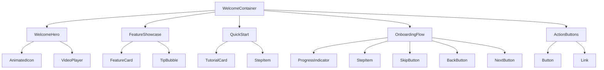
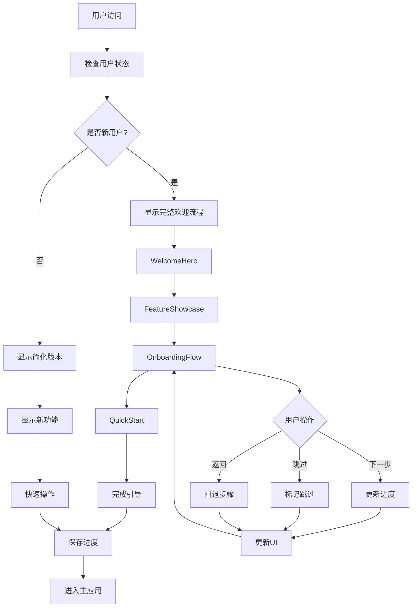

# Welcome 组件

## 1. 模块概述

Welcome 组件模块负责为新用户提供友好的欢迎界面和引导体验，包括产品介绍、功能亮点、快速入门指南、用户注册引导等功能，帮助用户快速了解和上手Kilocode应用。

### 核心功能

- 欢迎页面展示
- 产品功能介绍
- 用户引导流程
- 快速入门教程
- 注册登录引导
- 个性化设置
- 使用技巧展示
- 帮助文档链接

### 业务价值

- 提升用户首次体验
- 降低学习成本
- 提高用户留存率
- 增强产品认知度
- 引导用户完成关键操作

## 2. 组件列表

### 2.1 核心组件

| 组件名称          | 文件路径              | 功能描述                             |
| ----------------- | --------------------- | ------------------------------------ |
| WelcomeContainer  | WelcomeContainer.tsx  | 欢迎页面主容器，管理整体布局和状态   |
| WelcomeHero       | WelcomeHero.tsx       | 欢迎页面头部区域，展示产品标题和简介 |
| FeatureShowcase   | FeatureShowcase.tsx   | 功能展示组件，介绍产品核心特性       |
| QuickStart        | QuickStart.tsx        | 快速入门组件，提供操作指南           |
| OnboardingFlow    | OnboardingFlow.tsx    | 用户引导流程，分步骤介绍功能         |
| TutorialCard      | TutorialCard.tsx      | 教程卡片组件，展示使用技巧           |
| ActionButtons     | ActionButtons.tsx     | 操作按钮组，提供主要操作入口         |
| ProgressIndicator | ProgressIndicator.tsx | 进度指示器，显示引导完成度           |

### 2.2 子组件

| 组件名称     | 文件路径         | 功能描述                         |
| ------------ | ---------------- | -------------------------------- |
| FeatureCard  | FeatureCard.tsx  | 功能特性卡片，单个功能介绍       |
| StepItem     | StepItem.tsx     | 步骤项组件，引导流程中的单个步骤 |
| TipBubble    | TipBubble.tsx    | 提示气泡组件，显示操作提示       |
| VideoPlayer  | VideoPlayer.tsx  | 视频播放器，展示演示视频         |
| AnimatedIcon | AnimatedIcon.tsx | 动画图标组件，增强视觉效果       |
| SkipButton   | SkipButton.tsx   | 跳过按钮，允许用户跳过引导       |
| BackButton   | BackButton.tsx   | 返回按钮，支持步骤回退           |
| NextButton   | NextButton.tsx   | 下一步按钮，推进引导流程         |

### 2.3 Hook组件

| Hook名称            | 文件路径               | 功能描述         |
| ------------------- | ---------------------- | ---------------- |
| useWelcomeState     | useWelcomeState.ts     | 欢迎页面状态管理 |
| useOnboarding       | useOnboarding.ts       | 用户引导流程管理 |
| useWelcomeProgress  | useWelcomeProgress.ts  | 引导进度跟踪     |
| useFeatureHighlight | useFeatureHighlight.ts | 功能高亮显示     |
| useWelcomeAnalytics | useWelcomeAnalytics.ts | 欢迎页面数据统计 |

### 2.4 工具类

| 类名            | 文件路径           | 功能描述         |
| --------------- | ------------------ | ---------------- |
| WelcomeConfig   | WelcomeConfig.ts   | 欢迎页面配置管理 |
| OnboardingSteps | OnboardingSteps.ts | 引导步骤定义     |
| FeatureData     | FeatureData.ts     | 功能特性数据     |
| WelcomeUtils    | WelcomeUtils.ts    | 欢迎页面工具函数 |

### 2.5 组件层次关系



## 3. 技术架构

### 3.1 设计模式

- **状态机模式**: 管理引导流程状态转换
- **观察者模式**: 监听用户操作和进度变化
- **策略模式**: 不同用户类型的引导策略
- **装饰器模式**: 功能高亮和提示装饰

### 3.2 状态管理

```typescript
interface WelcomeState {
	// 当前状态
	currentStep: number
	totalSteps: number
	isCompleted: boolean
	isSkipped: boolean

	// 用户信息
	userType: "new" | "returning" | "guest"
	hasSeenWelcome: boolean
	completedSteps: number[]

	// 界面状态
	isLoading: boolean
	showVideo: boolean
	highlightedFeature: string | null

	// 配置选项
	showOnboarding: boolean
	autoPlay: boolean
	enableAnimations: boolean
}

interface OnboardingStep {
	id: string
	title: string
	description: string
	component: React.ComponentType
	target?: string
	position?: "top" | "bottom" | "left" | "right"
	isOptional?: boolean
	duration?: number
}

interface FeatureItem {
	id: string
	title: string
	description: string
	icon: string
	category: string
	isNew?: boolean
	isPremium?: boolean
	demoUrl?: string
}
```

### 3.3 数据流



## 4. API文档

### 4.1 WelcomeContainer Props

```typescript
interface WelcomeContainerProps {
	/** 用户类型 */
	userType?: "new" | "returning" | "guest"
	/** 是否显示引导 */
	showOnboarding?: boolean
	/** 是否自动播放 */
	autoPlay?: boolean
	/** 完成回调 */
	onComplete?: (data: WelcomeCompletionData) => void
	/** 跳过回调 */
	onSkip?: (step: number) => void
	/** 步骤变化回调 */
	onStepChange?: (step: number, total: number) => void
	/** 自定义配置 */
	config?: WelcomeConfig
	/** 子组件 */
	children?: React.ReactNode
}

interface WelcomeCompletionData {
	completedSteps: number[]
	totalSteps: number
	timeSpent: number
	skippedSteps: number[]
	userActions: UserAction[]
}

interface UserAction {
	type: "click" | "view" | "skip" | "complete"
	target: string
	timestamp: number
	metadata?: Record<string, any>
}
```

### 4.2 OnboardingFlow Props

```typescript
interface OnboardingFlowProps {
	/** 引导步骤 */
	steps: OnboardingStep[]
	/** 当前步骤 */
	currentStep?: number
	/** 是否显示进度 */
	showProgress?: boolean
	/** 是否允许跳过 */
	allowSkip?: boolean
	/** 是否允许返回 */
	allowBack?: boolean
	/** 步骤完成回调 */
	onStepComplete?: (step: OnboardingStep, index: number) => void
	/** 流程完成回调 */
	onFlowComplete?: (completedSteps: OnboardingStep[]) => void
	/** 跳过回调 */
	onSkip?: (currentStep: number) => void
	/** 自定义渲染 */
	renderStep?: (step: OnboardingStep, index: number) => React.ReactNode
}
```

### 4.3 FeatureShowcase Props

```typescript
interface FeatureShowcaseProps {
	/** 功能列表 */
	features: FeatureItem[]
	/** 布局模式 */
	layout?: "grid" | "carousel" | "list"
	/** 每行显示数量 */
	columns?: number
	/** 是否显示分类 */
	showCategories?: boolean
	/** 是否自动轮播 */
	autoSlide?: boolean
	/** 轮播间隔 */
	slideInterval?: number
	/** 功能点击回调 */
	onFeatureClick?: (feature: FeatureItem) => void
	/** 演示回调 */
	onDemoRequest?: (feature: FeatureItem) => void
	/** 自定义渲染 */
	renderFeature?: (feature: FeatureItem) => React.ReactNode
}
```

### 4.4 useWelcomeState Hook

```typescript
interface UseWelcomeStateResult {
	/** 当前状态 */
	state: WelcomeState
	/** 更新状态 */
	setState: (updates: Partial<WelcomeState>) => void
	/** 下一步 */
	nextStep: () => void
	/** 上一步 */
	prevStep: () => void
	/** 跳转到指定步骤 */
	goToStep: (step: number) => void
	/** 跳过引导 */
	skipOnboarding: () => void
	/** 完成引导 */
	completeOnboarding: () => void
	/** 重置状态 */
	reset: () => void
	/** 保存进度 */
	saveProgress: () => void
	/** 加载进度 */
	loadProgress: () => Promise<WelcomeState>
}
```

### 4.5 useOnboarding Hook

```typescript
interface UseOnboardingResult {
	/** 当前步骤 */
	currentStep: number
	/** 总步骤数 */
	totalSteps: number
	/** 当前步骤数据 */
	currentStepData: OnboardingStep | null
	/** 是否第一步 */
	isFirstStep: boolean
	/** 是否最后一步 */
	isLastStep: boolean
	/** 进度百分比 */
	progress: number
	/** 下一步 */
	next: () => void
	/** 上一步 */
	back: () => void
	/** 跳转 */
	goTo: (step: number) => void
	/** 跳过 */
	skip: () => void
	/** 完成 */
	finish: () => void
	/** 重新开始 */
	restart: () => void
}
```

## 5. 使用示例

### 5.1 基础欢迎页面

```tsx
import { WelcomeContainer, WelcomeHero, FeatureShowcase, ActionButtons, useWelcomeState } from "@/components/welcome"

function BasicWelcomePage() {
	const { state, nextStep, skipOnboarding, completeOnboarding } = useWelcomeState()

	const features = [
		{
			id: "ai-assistant",
			title: "AI 智能助手",
			description: "强大的AI助手帮助您提高编程效率",
			icon: "robot",
			category: "ai",
			isNew: true,
		},
		{
			id: "code-generation",
			title: "代码生成",
			description: "自动生成高质量的代码片段",
			icon: "code",
			category: "productivity",
		},
		{
			id: "collaboration",
			title: "团队协作",
			description: "与团队成员实时协作开发",
			icon: "users",
			category: "collaboration",
		},
	]

	const handleGetStarted = () => {
		completeOnboarding()
		// 跳转到主应用
		window.location.href = "/dashboard"
	}

	const handleLearnMore = () => {
		// 显示详细介绍
		nextStep()
	}

	return (
		<WelcomeContainer
			userType="new"
			showOnboarding={true}
			onComplete={(data) => {
				console.log("Welcome completed:", data)
				handleGetStarted()
			}}
			onSkip={(step) => {
				console.log("Skipped at step:", step)
			}}>
			<div className="welcome-page">
				<WelcomeHero
					title="欢迎使用 Kilocode"
					subtitle="让AI助力您的编程之旅"
					description="Kilocode是一款强大的AI编程助手，帮助您提高开发效率，简化复杂任务。"
					videoUrl="/videos/intro.mp4"
					showVideo={state.showVideo}
					onVideoToggle={(show) => setState({ showVideo: show })}
				/>

				<FeatureShowcase
					features={features}
					layout="grid"
					columns={3}
					showCategories={true}
					onFeatureClick={(feature) => {
						console.log("Feature clicked:", feature)
					}}
					onDemoRequest={(feature) => {
						console.log("Demo requested:", feature)
					}}
				/>

				<ActionButtons
					primaryAction={{
						text: "开始使用",
						onClick: handleGetStarted,
						variant: "solid",
						colorScheme: "primary",
						size: "lg",
					}}
					secondaryAction={{
						text: "了解更多",
						onClick: handleLearnMore,
						variant: "outline",
						size: "lg",
					}}
					tertiaryAction={{
						text: "跳过引导",
						onClick: skipOnboarding,
						variant: "ghost",
						size: "sm",
					}}
				/>
			</div>
		</WelcomeContainer>
	)
}
```

### 5.2 用户引导流程

```tsx
import { OnboardingFlow, StepItem, ProgressIndicator, useOnboarding } from "@/components/welcome"

function OnboardingExample() {
	const steps = [
		{
			id: "welcome",
			title: "欢迎",
			description: "欢迎使用Kilocode，让我们开始您的AI编程之旅",
			component: WelcomeStep,
		},
		{
			id: "setup-workspace",
			title: "设置工作区",
			description: "配置您的开发环境和偏好设置",
			component: WorkspaceSetupStep,
			target: "#workspace-settings",
		},
		{
			id: "first-project",
			title: "创建项目",
			description: "创建您的第一个AI辅助项目",
			component: ProjectCreationStep,
			target: "#create-project-btn",
		},
		{
			id: "ai-features",
			title: "AI功能介绍",
			description: "了解强大的AI编程功能",
			component: AIFeaturesStep,
		},
		{
			id: "completion",
			title: "完成设置",
			description: "恭喜！您已经准备好开始使用Kilocode了",
			component: CompletionStep,
		},
	]

	const { currentStep, totalSteps, currentStepData, isFirstStep, isLastStep, progress, next, back, skip, finish } =
		useOnboarding(steps)

	const handleStepComplete = (step: OnboardingStep, index: number) => {
		console.log(`Step ${index + 1} completed:`, step)

		// 记录用户行为
		analytics.track("onboarding_step_completed", {
			step_id: step.id,
			step_index: index,
			step_title: step.title,
		})

		// 自动进入下一步
		if (!isLastStep) {
			setTimeout(next, 1000)
		}
	}

	const handleFlowComplete = (completedSteps: OnboardingStep[]) => {
		console.log("Onboarding completed:", completedSteps)

		// 记录完成事件
		analytics.track("onboarding_completed", {
			total_steps: completedSteps.length,
			completion_time: Date.now(),
		})

		// 跳转到主应用
		finish()
	}

	return (
		<div className="onboarding-container">
			<div className="onboarding-header">
				<ProgressIndicator current={currentStep + 1} total={totalSteps} progress={progress} showLabels={true} />

				<div className="onboarding-controls">
					{!isFirstStep && (
						<Button variant="ghost" onClick={back}>
							上一步
						</Button>
					)}

					<Button variant="ghost" onClick={skip}>
						跳过引导
					</Button>
				</div>
			</div>

			<OnboardingFlow
				steps={steps}
				currentStep={currentStep}
				showProgress={false}
				allowSkip={true}
				allowBack={true}
				onStepComplete={handleStepComplete}
				onFlowComplete={handleFlowComplete}
				onSkip={(step) => {
					console.log("Skipped at step:", step)
					skip()
				}}
				renderStep={(step, index) => (
					<div className="custom-step">
						<div className="step-header">
							<h2>{step.title}</h2>
							<p>{step.description}</p>
						</div>

						<div className="step-content">
							<step.component
								stepData={step}
								stepIndex={index}
								onComplete={() => handleStepComplete(step, index)}
							/>
						</div>

						<div className="step-footer">
							<div className="step-info">
								步骤 {index + 1} / {totalSteps}
							</div>

							<div className="step-actions">
								{!isLastStep ? (
									<Button onClick={next} colorScheme="primary">
										下一步
									</Button>
								) : (
									<Button onClick={finish} colorScheme="success">
										完成
									</Button>
								)}
							</div>
						</div>
					</div>
				)}
			/>
		</div>
	)
}

// 步骤组件示例
function WelcomeStep({ stepData, onComplete }: StepComponentProps) {
	useEffect(() => {
		// 自动完成欢迎步骤
		const timer = setTimeout(onComplete, 2000)
		return () => clearTimeout(timer)
	}, [onComplete])

	return (
		<div className="welcome-step">
			<div className="welcome-animation">
				<AnimatedIcon name="welcome" size="xl" />
			</div>
			<h3>欢迎使用 Kilocode！</h3>
			<p>我们将通过几个简单的步骤帮您快速上手。</p>
		</div>
	)
}

function WorkspaceSetupStep({ stepData, onComplete }: StepComponentProps) {
	const [settings, setSettings] = useState({
		theme: "dark",
		language: "zh-CN",
		autoSave: true,
		aiAssistance: true,
	})

	const handleSave = () => {
		// 保存设置
		localStorage.setItem("workspace-settings", JSON.stringify(settings))
		onComplete()
	}

	return (
		<div className="workspace-setup-step">
			<h3>配置您的工作区</h3>

			<div className="settings-form">
				<div className="setting-item">
					<label>主题</label>
					<Select
						value={settings.theme}
						onChange={(value) => setSettings((prev) => ({ ...prev, theme: value }))}
						options={[
							{ value: "light", label: "浅色主题" },
							{ value: "dark", label: "深色主题" },
							{ value: "auto", label: "跟随系统" },
						]}
					/>
				</div>

				<div className="setting-item">
					<label>语言</label>
					<Select
						value={settings.language}
						onChange={(value) => setSettings((prev) => ({ ...prev, language: value }))}
						options={[
							{ value: "zh-CN", label: "简体中文" },
							{ value: "en-US", label: "English" },
							{ value: "ja-JP", label: "日本語" },
						]}
					/>
				</div>

				<div className="setting-item">
					<Checkbox
						isChecked={settings.autoSave}
						onChange={(checked) => setSettings((prev) => ({ ...prev, autoSave: checked }))}>
						启用自动保存
					</Checkbox>
				</div>

				<div className="setting-item">
					<Checkbox
						isChecked={settings.aiAssistance}
						onChange={(checked) => setSettings((prev) => ({ ...prev, aiAssistance: checked }))}>
						启用AI智能助手
					</Checkbox>
				</div>
			</div>

			<Button onClick={handleSave} colorScheme="primary" isFullWidth>
				保存设置
			</Button>
		</div>
	)
}
```

### 5.3 功能展示组件

```tsx
import { FeatureShowcase, FeatureCard, TipBubble, VideoPlayer } from "@/components/welcome"

function FeatureShowcaseExample() {
	const [selectedFeature, setSelectedFeature] = useState<FeatureItem | null>(null)
	const [showDemo, setShowDemo] = useState(false)

	const features = [
		{
			id: "code-completion",
			title: "智能代码补全",
			description: "AI驱动的代码补全，提供精准的代码建议",
			icon: "code",
			category: "ai",
			isNew: true,
			demoUrl: "/demos/code-completion.mp4",
		},
		{
			id: "bug-detection",
			title: "智能错误检测",
			description: "实时检测代码中的潜在问题和错误",
			icon: "bug",
			category: "quality",
			demoUrl: "/demos/bug-detection.mp4",
		},
		{
			id: "refactoring",
			title: "代码重构建议",
			description: "智能分析代码结构，提供重构建议",
			icon: "refresh",
			category: "optimization",
			isPremium: true,
			demoUrl: "/demos/refactoring.mp4",
		},
		{
			id: "documentation",
			title: "自动文档生成",
			description: "根据代码自动生成详细的文档",
			icon: "book",
			category: "productivity",
			demoUrl: "/demos/documentation.mp4",
		},
		{
			id: "testing",
			title: "测试用例生成",
			description: "自动生成全面的测试用例",
			icon: "test-tube",
			category: "testing",
			isPremium: true,
			demoUrl: "/demos/testing.mp4",
		},
		{
			id: "performance",
			title: "性能优化分析",
			description: "分析代码性能瓶颈，提供优化建议",
			icon: "zap",
			category: "optimization",
			isPremium: true,
			demoUrl: "/demos/performance.mp4",
		},
	]

	const categories = [
		{ id: "all", label: "全部功能", count: features.length },
		{ id: "ai", label: "AI功能", count: features.filter((f) => f.category === "ai").length },
		{ id: "productivity", label: "效率工具", count: features.filter((f) => f.category === "productivity").length },
		{ id: "quality", label: "代码质量", count: features.filter((f) => f.category === "quality").length },
		{ id: "optimization", label: "性能优化", count: features.filter((f) => f.category === "optimization").length },
		{ id: "testing", label: "测试工具", count: features.filter((f) => f.category === "testing").length },
	]

	const [selectedCategory, setSelectedCategory] = useState("all")

	const filteredFeatures =
		selectedCategory === "all" ? features : features.filter((f) => f.category === selectedCategory)

	const handleFeatureClick = (feature: FeatureItem) => {
		setSelectedFeature(feature)

		// 记录功能点击
		analytics.track("feature_clicked", {
			feature_id: feature.id,
			feature_title: feature.title,
			category: feature.category,
		})
	}

	const handleDemoRequest = (feature: FeatureItem) => {
		setSelectedFeature(feature)
		setShowDemo(true)

		// 记录演示请求
		analytics.track("demo_requested", {
			feature_id: feature.id,
			feature_title: feature.title,
		})
	}

	return (
		<div className="feature-showcase-example">
			<div className="showcase-header">
				<h2>强大的AI编程功能</h2>
				<p>探索Kilocode提供的智能编程工具，提升您的开发效率</p>
			</div>

			<div className="category-filter">
				{categories.map((category) => (
					<Button
						key={category.id}
						variant={selectedCategory === category.id ? "solid" : "ghost"}
						colorScheme="primary"
						onClick={() => setSelectedCategory(category.id)}>
						{category.label}
						<Badge ml="2" colorScheme="gray">
							{category.count}
						</Badge>
					</Button>
				))}
			</div>

			<FeatureShowcase
				features={filteredFeatures}
				layout="grid"
				columns={3}
				showCategories={false}
				autoSlide={false}
				onFeatureClick={handleFeatureClick}
				onDemoRequest={handleDemoRequest}
				renderFeature={(feature) => (
					<FeatureCard
						key={feature.id}
						feature={feature}
						isSelected={selectedFeature?.id === feature.id}
						onClick={() => handleFeatureClick(feature)}
						onDemoClick={() => handleDemoRequest(feature)}
						showBadges={true}
						showDemo={true}
					/>
				)}
			/>

			{selectedFeature && (
				<div className="feature-detail">
					<Card padding="6">
						<div className="feature-detail-header">
							<div className="feature-info">
								<div className="feature-icon">
									<Icon name={selectedFeature.icon} size="2xl" />
								</div>
								<div className="feature-text">
									<h3>{selectedFeature.title}</h3>
									<p>{selectedFeature.description}</p>
									<div className="feature-badges">
										{selectedFeature.isNew && <Badge colorScheme="success">新功能</Badge>}
										{selectedFeature.isPremium && <Badge colorScheme="gold">高级功能</Badge>}
									</div>
								</div>
							</div>

							<div className="feature-actions">
								<Button
									variant="outline"
									onClick={() => handleDemoRequest(selectedFeature)}
									leftIcon={<Icon name="play" />}>
									观看演示
								</Button>
								<Button
									colorScheme="primary"
									onClick={() => {
										// 跳转到功能页面
										window.location.href = `/features/${selectedFeature.id}`
									}}>
									立即体验
								</Button>
							</div>
						</div>

						<div className="feature-tips">
							<h4>使用技巧</h4>
							<div className="tips-grid">
								<TipBubble title="快捷键" content="使用 Ctrl+Space 快速触发智能补全" icon="keyboard" />
								<TipBubble title="自定义设置" content="在设置中调整AI助手的行为偏好" icon="settings" />
								<TipBubble title="学习模式" content="AI会根据您的编码习惯不断优化建议" icon="brain" />
							</div>
						</div>
					</Card>
				</div>
			)}

			{showDemo && selectedFeature?.demoUrl && (
				<Modal isOpen={showDemo} onClose={() => setShowDemo(false)} size="xl" isCentered>
					<ModalHeader>
						<h3>{selectedFeature.title} - 功能演示</h3>
					</ModalHeader>
					<ModalBody>
						<VideoPlayer
							src={selectedFeature.demoUrl}
							poster={`/images/features/${selectedFeature.id}-poster.jpg`}
							autoPlay={true}
							controls={true}
							onEnded={() => {
								// 记录演示完成
								analytics.track("demo_completed", {
									feature_id: selectedFeature.id,
								})
							}}
						/>
					</ModalBody>
					<ModalFooter>
						<Button variant="outline" onClick={() => setShowDemo(false)}>
							关闭
						</Button>
						<Button
							colorScheme="primary"
							onClick={() => {
								setShowDemo(false)
								window.location.href = `/features/${selectedFeature.id}`
							}}>
							立即体验
						</Button>
					</ModalFooter>
				</Modal>
			)}
		</div>
	)
}
```

## 6. 样式和主题

### 6.1 CSS类名规范

```css
/* 欢迎页面容器 */
.welcome-container {
	min-height: 100vh;
	background: linear-gradient(135deg, var(--ui-color-primary-50) 0%, var(--ui-color-primary-100) 100%);
	padding: var(--ui-spacing-6);
}

.welcome-page {
	max-width: 1200px;
	margin: 0 auto;
	display: flex;
	flex-direction: column;
	gap: var(--ui-spacing-12);
}

/* 欢迎头部 */
.welcome-hero {
	text-align: center;
	padding: var(--ui-spacing-16) var(--ui-spacing-6);
}

.welcome-hero__title {
	font-size: var(--ui-font-size-4xl);
	font-weight: 700;
	color: var(--ui-color-text-primary);
	margin-bottom: var(--ui-spacing-4);
}

.welcome-hero__subtitle {
	font-size: var(--ui-font-size-xl);
	color: var(--ui-color-primary-600);
	margin-bottom: var(--ui-spacing-6);
}

.welcome-hero__description {
	font-size: var(--ui-font-size-lg);
	color: var(--ui-color-text-secondary);
	max-width: 600px;
	margin: 0 auto var(--ui-spacing-8);
	line-height: 1.6;
}

.welcome-hero__video {
	max-width: 800px;
	margin: 0 auto;
	border-radius: var(--ui-border-radius-lg);
	overflow: hidden;
	box-shadow: var(--ui-shadow-xl);
}

/* 功能展示 */
.feature-showcase {
	padding: var(--ui-spacing-8) 0;
}

.feature-showcase__header {
	text-align: center;
	margin-bottom: var(--ui-spacing-8);
}

.feature-showcase__title {
	font-size: var(--ui-font-size-3xl);
	font-weight: 600;
	margin-bottom: var(--ui-spacing-4);
}

.feature-showcase__grid {
	display: grid;
	grid-template-columns: repeat(auto-fit, minmax(300px, 1fr));
	gap: var(--ui-spacing-6);
}

.feature-card {
	background: var(--ui-color-background);
	border-radius: var(--ui-border-radius-lg);
	padding: var(--ui-spacing-6);
	box-shadow: var(--ui-shadow-md);
	transition: all var(--ui-transition-duration-normal) var(--ui-transition-easing-ease);
	cursor: pointer;
	border: 2px solid transparent;
}

.feature-card:hover {
	transform: translateY(-4px);
	box-shadow: var(--ui-shadow-xl);
	border-color: var(--ui-color-primary-200);
}

.feature-card--selected {
	border-color: var(--ui-color-primary-500);
	box-shadow:
		0 0 0 1px var(--ui-color-primary-500),
		var(--ui-shadow-lg);
}

.feature-card__icon {
	width: 48px;
	height: 48px;
	background: var(--ui-color-primary-100);
	border-radius: var(--ui-border-radius-lg);
	display: flex;
	align-items: center;
	justify-content: center;
	margin-bottom: var(--ui-spacing-4);
	color: var(--ui-color-primary-600);
}

.feature-card__title {
	font-size: var(--ui-font-size-lg);
	font-weight: 600;
	margin-bottom: var(--ui-spacing-2);
}

.feature-card__description {
	color: var(--ui-color-text-secondary);
	line-height: 1.5;
	margin-bottom: var(--ui-spacing-4);
}

.feature-card__badges {
	display: flex;
	gap: var(--ui-spacing-2);
	margin-bottom: var(--ui-spacing-4);
}

.feature-card__actions {
	display: flex;
	gap: var(--ui-spacing-2);
}

/* 引导流程 */
.onboarding-container {
	min-height: 100vh;
	background: var(--ui-color-background);
	display: flex;
	flex-direction: column;
}

.onboarding-header {
	padding: var(--ui-spacing-6);
	border-bottom: 1px solid var(--ui-color-border-light);
	display: flex;
	justify-content: space-between;
	align-items: center;
}

.onboarding-content {
	flex: 1;
	display: flex;
	align-items: center;
	justify-content: center;
	padding: var(--ui-spacing-8);
}

.onboarding-step {
	max-width: 600px;
	width: 100%;
	text-align: center;
}

.onboarding-step__header {
	margin-bottom: var(--ui-spacing-8);
}

.onboarding-step__title {
	font-size: var(--ui-font-size-2xl);
	font-weight: 600;
	margin-bottom: var(--ui-spacing-4);
}

.onboarding-step__description {
	font-size: var(--ui-font-size-lg);
	color: var(--ui-color-text-secondary);
	line-height: 1.6;
}

.onboarding-step__content {
	margin-bottom: var(--ui-spacing-8);
}

.onboarding-step__footer {
	display: flex;
	justify-content: space-between;
	align-items: center;
}

/* 进度指示器 */
.progress-indicator {
	display: flex;
	align-items: center;
	gap: var(--ui-spacing-4);
}

.progress-indicator__bar {
	flex: 1;
	height: 4px;
	background: var(--ui-color-border-light);
	border-radius: var(--ui-border-radius-full);
	overflow: hidden;
}

.progress-indicator__fill {
	height: 100%;
	background: var(--ui-color-primary-500);
	transition: width var(--ui-transition-duration-normal) var(--ui-transition-easing-ease);
}

.progress-indicator__text {
	font-size: var(--ui-font-size-sm);
	color: var(--ui-color-text-secondary);
	white-space: nowrap;
}

/* 操作按钮 */
.action-buttons {
	display: flex;
	flex-direction: column;
	align-items: center;
	gap: var(--ui-spacing-4);
	padding: var(--ui-spacing-8);
}

.action-buttons__primary {
	display: flex;
	gap: var(--ui-spacing-4);
}

.action-buttons__secondary {
	display: flex;
	gap: var(--ui-spacing-2);
}

/* 提示气泡 */
.tip-bubble {
	background: var(--ui-color-background);
	border: 1px solid var(--ui-color-border-light);
	border-radius: var(--ui-border-radius-lg);
	padding: var(--ui-spacing-4);
	box-shadow: var(--ui-shadow-sm);
	position: relative;
}

.tip-bubble::before {
	content: "";
	position: absolute;
	top: -8px;
	left: 50%;
	transform: translateX(-50%);
	width: 0;
	height: 0;
	border-left: 8px solid transparent;
	border-right: 8px solid transparent;
	border-bottom: 8px solid var(--ui-color-border-light);
}

.tip-bubble::after {
	content: "";
	position: absolute;
	top: -7px;
	left: 50%;
	transform: translateX(-50%);
	width: 0;
	height: 0;
	border-left: 8px solid transparent;
	border-right: 8px solid transparent;
	border-bottom: 8px solid var(--ui-color-background);
}

.tip-bubble__icon {
	width: 24px;
	height: 24px;
	color: var(--ui-color-primary-500);
	margin-bottom: var(--ui-spacing-2);
}

.tip-bubble__title {
	font-size: var(--ui-font-size-sm);
	font-weight: 600;
	margin-bottom: var(--ui-spacing-1);
}

.tip-bubble__content {
	font-size: var(--ui-font-size-xs);
	color: var(--ui-color-text-secondary);
	line-height: 1.4;
}

/* 动画效果 */
@keyframes welcome-fade-in {
	from {
		opacity: 0;
		transform: translateY(20px);
	}
	to {
		opacity: 1;
		transform: translateY(0);
	}
}

@keyframes welcome-slide-in {
	from {
		opacity: 0;
		transform: translateX(-20px);
	}
	to {
		opacity: 1;
		transform: translateX(0);
	}
}

@keyframes welcome-scale-in {
	from {
		opacity: 0;
		transform: scale(0.95);
	}
	to {
		opacity: 1;
		transform: scale(1);
	}
}

.welcome-animate-fade-in {
	animation: welcome-fade-in 0.6s var(--ui-transition-easing-ease) forwards;
}

.welcome-animate-slide-in {
	animation: welcome-slide-in 0.6s var(--ui-transition-easing-ease) forwards;
}

.welcome-animate-scale-in {
	animation: welcome-scale-in 0.4s var(--ui-transition-easing-ease) forwards;
}

/* 响应式设计 */
@media (max-width: 768px) {
	.welcome-hero__title {
		font-size: var(--ui-font-size-3xl);
	}

	.welcome-hero__subtitle {
		font-size: var(--ui-font-size-lg);
	}

	.feature-showcase__grid {
		grid-template-columns: 1fr;
	}

	.onboarding-step {
		padding: var(--ui-spacing-4);
	}

	.action-buttons__primary {
		flex-direction: column;
		width: 100%;
	}

	.action-buttons__primary .ui-button {
		width: 100%;
	}
}

@media (max-width: 480px) {
	.welcome-container {
		padding: var(--ui-spacing-4);
	}

	.welcome-page {
		gap: var(--ui-spacing-8);
	}

	.welcome-hero {
		padding: var(--ui-spacing-8) var(--ui-spacing-4);
	}

	.feature-card {
		padding: var(--ui-spacing-4);
	}

	.onboarding-header {
		flex-direction: column;
		gap: var(--ui-spacing-4);
	}

	.onboarding-step__footer {
		flex-direction: column;
		gap: var(--ui-spacing-4);
	}
}
```

### 6.2 主题变量

```css
/* 欢迎页面专用颜色 */
:root {
	--welcome-gradient-start: #667eea;
	--welcome-gradient-end: #764ba2;
	--welcome-accent-color: #f093fb;
	--welcome-success-color: #4facfe;
	--welcome-warning-color: #f6d365;

	/* 动画时长 */
	--welcome-animation-fast: 0.2s;
	--welcome-animation-normal: 0.4s;
	--welcome-animation-slow: 0.6s;

	/* 特殊间距 */
	--welcome-section-gap: 4rem;
	--welcome-card-gap: 1.5rem;
	--welcome-button-gap: 1rem;
}

/* 暗色主题适配 */
[data-theme="dark"] {
	--welcome-gradient-start: #2d3748;
	--welcome-gradient-end: #4a5568;
	--welcome-accent-color: #805ad5;
	--welcome-success-color: #38b2ac;
	--welcome-warning-color: #ed8936;
}
```

## 7. 测试策略

### 7.1 单元测试

```typescript
// WelcomeContainer.test.tsx
import { render, screen, fireEvent, waitFor } from '@testing-library/react';
import { WelcomeContainer } from '../WelcomeContainer';

describe('WelcomeContainer', () => {
  const mockOnComplete = jest.fn();
  const mockOnSkip = jest.fn();
  const mockOnStepChange = jest.fn();

  beforeEach(() => {
    jest.clearAllMocks();
  });

  it('should render welcome container with default props', () => {
    render(<WelcomeContainer />);

    expect(screen.getByRole('main')).toBeInTheDocument();
    expect(screen.getByText(/欢迎/i)).toBeInTheDocument();
  });

  it('should handle user type correctly', () => {
    render(
      <WelcomeContainer
        userType="new"
        showOnboarding={true}
      />
    );

    expect(screen.getByText(/新用户/i)).toBeInTheDocument();
    expect(screen.getByText(/引导/i)).toBeInTheDocument();
  });

  it('should call onComplete when welcome flow is finished', async () => {
    render(
      <WelcomeContainer
        onComplete={mockOnComplete}
        showOnboarding={true}
      />
    );

    const completeButton = screen.getByText(/完成/i);
    fireEvent.click(completeButton);

    await waitFor(() => {
      expect(mockOnComplete).toHaveBeenCalledWith(
        expect.objectContaining({
          completedSteps: expect.any(Array),
          totalSteps: expect.any(Number),
          timeSpent: expect.any(Number),
        })
      );
    });
  });

  it('should call onSkip when skip button is clicked', () => {
    render(
      <WelcomeContainer
        onSkip={mockOnSkip}
        showOnboarding={true}
      />
    );

    const skipButton = screen.getByText(/跳过/i);
    fireEvent.click(skipButton);

    expect(mockOnSkip).toHaveBeenCalledWith(expect.any(Number));
  });

  it('should track step changes', async () => {
    render(
      <WelcomeContainer
        onStepChange={mockOnStepChange}
        showOnboarding={true}
      />
    );

    const nextButton = screen.getByText(/下一步/i);
    fireEvent.click(nextButton);

    await waitFor(() => {
      expect(mockOnStepChange).toHaveBeenCalledWith(1, expect.any(Number));
    });
  });
});

// useWelcomeState.test.ts
import { renderHook, act } from '@testing-library/react';
import { useWelcomeState } from '../useWelcomeState';

describe('useWelcomeState', () => {
  it('should initialize with default state', () => {
    const { result } = renderHook(() => useWelcomeState());

    expect(result.current.state).toEqual({
      currentStep: 0,
      totalSteps: 5,
      isCompleted: false,
      isSkipped: false,
      userType: 'new',
      hasSeenWelcome: false,
      completedSteps: [],
      isLoading: false,
      showVideo: false,
      highlightedFeature: null,
      showOnboarding: true,
      autoPlay: false,
      enableAnimations: true,
    });
  });

  it('should advance to next step', () => {
    const { result } = renderHook(() => useWelcomeState());

    act(() => {
      result.current.nextStep();
    });

    expect(result.current.state.currentStep).toBe(1);
  });

  it('should go back to previous step', () => {
    const { result } = renderHook(() => useWelcomeState());

    act(() => {
      result.current.nextStep();
      result.current.prevStep();
    });

    expect(result.current.state.currentStep).toBe(0);
  });

  it('should skip onboarding', () => {
    const { result } = renderHook(() => useWelcomeState());

    act(() => {
      result.current.skipOnboarding();
    });

    expect(result.current.state.isSkipped).toBe(true);
    expect(result.current.state.isCompleted).toBe(true);
  });

  it('should complete onboarding', () => {
    const { result } = renderHook(() => useWelcomeState());

    act(() => {
      result.current.completeOnboarding();
    });

    expect(result.current.state.isCompleted).toBe(true);
  });

  it('should save and load progress', async () => {
    const { result } = renderHook(() => useWelcomeState());

    act(() => {
      result.current.nextStep();
      result.current.nextStep();
    });

    act(() => {
      result.current.saveProgress();
    });

    act(() => {
      result.current.reset();
    });

    expect(result.current.state.currentStep).toBe(0);

    await act(async () => {
      await result.current.loadProgress();
    });

    expect(result.current.state.currentStep).toBe(2);
  });
});
```

### 7.2 集成测试

```typescript
// WelcomeFlow.integration.test.tsx
import { render, screen, fireEvent, waitFor } from '@testing-library/react';
import { WelcomeFlow } from '../WelcomeFlow';

describe('Welcome Flow Integration', () => {
  it('should complete full welcome flow', async () => {
    const mockOnComplete = jest.fn();

    render(<WelcomeFlow onComplete={mockOnComplete} />);

    // 验证欢迎页面
    expect(screen.getByText(/欢迎使用 Kilocode/i)).toBeInTheDocument();

    // 点击开始按钮
    fireEvent.click(screen.getByText(/开始使用/i));

    // 验证功能展示
    await waitFor(() => {
      expect(screen.getByText(/功能介绍/i)).toBeInTheDocument();
    });

    // 点击下一步
    fireEvent.click(screen.getByText(/下一步/i));

    // 验证引导流程
    await waitFor(() => {
      expect(screen.getByText(/设置工作区/i)).toBeInTheDocument();
    });

    // 完成设置
    fireEvent.click(screen.getByText(/保存设置/i));

    // 验证完成
    await waitFor(() => {
      expect(mockOnComplete).toHaveBeenCalled();
    });
  });

  it('should handle skip functionality', async () => {
    const mockOnSkip = jest.fn();

    render(<WelcomeFlow onSkip={mockOnSkip} />);

    // 点击跳过按钮
    fireEvent.click(screen.getByText(/跳过引导/i));

    // 验证跳过确认
    expect(screen.getByText(/确定要跳过/i)).toBeInTheDocument();

    // 确认跳过
    fireEvent.click(screen.getByText(/确定/i));

    await waitFor(() => {
      expect(mockOnSkip).toHaveBeenCalled();
    });
  });
});
```

### 7.3 E2E测试

```typescript
// welcome.e2e.test.ts
import { test, expect } from "@playwright/test"

test.describe("Welcome Page E2E", () => {
	test("should complete welcome flow for new user", async ({ page }) => {
		await page.goto("/welcome")

		// 验证欢迎页面加载
		await expect(page.locator("h1")).toContainText("欢迎使用 Kilocode")

		// 播放介绍视频
		await page.click('[data-testid="play-video"]')
		await expect(page.locator("video")).toBeVisible()

		// 浏览功能特性
		await page.click('[data-testid="feature-ai-assistant"]')
		await expect(page.locator('[data-testid="feature-detail"]')).toBeVisible()

		// 开始引导流程
		await page.click('[data-testid="start-onboarding"]')

		// 完成工作区设置
		await page.selectOption('[data-testid="theme-select"]', "dark")
		await page.check('[data-testid="auto-save-checkbox"]')
		await page.click('[data-testid="save-settings"]')

		// 创建第一个项目
		await page.fill('[data-testid="project-name"]', "My First Project")
		await page.selectOption('[data-testid="project-template"]', "react")
		await page.click('[data-testid="create-project"]')

		// 完成引导
		await page.click('[data-testid="finish-onboarding"]')

		// 验证跳转到主应用
		await expect(page).toHaveURL("/dashboard")
	})

	test("should allow skipping welcome flow", async ({ page }) => {
		await page.goto("/welcome")

		// 点击跳过按钮
		await page.click('[data-testid="skip-welcome"]')

		// 确认跳过
		await page.click('[data-testid="confirm-skip"]')

		// 验证跳转到主应用
		await expect(page).toHaveURL("/dashboard")
	})

	test("should handle returning user", async ({ page }) => {
		// 设置返回用户状态
		await page.addInitScript(() => {
			localStorage.setItem("user-type", "returning")
			localStorage.setItem("has-seen-welcome", "true")
		})

		await page.goto("/welcome")

		// 验证显示简化版本
		await expect(page.locator('[data-testid="welcome-returning"]')).toBeVisible()
		await expect(page.locator('[data-testid="new-features"]')).toBeVisible()

		// 快速进入主应用
		await page.click('[data-testid="continue-to-app"]')
		await expect(page).toHaveURL("/dashboard")
	})
})
```

## 8. 性能优化

### 8.1 React性能优化

```typescript
// 使用React.memo优化组件渲染
export const FeatureCard = React.memo<FeatureCardProps>(({
  feature,
  isSelected,
  onClick,
  onDemoClick
}) => {
  return (
    <div
      className={`feature-card ${isSelected ? 'feature-card--selected' : ''}`}
      onClick={() => onClick(feature)}
    >
      {/* 组件内容 */}
    </div>
  );
});

// 使用useMemo优化计算
export const FeatureShowcase: React.FC<FeatureShowcaseProps> = ({
  features,
  selectedCategory
}) => {
  const filteredFeatures = useMemo(() => {
    return selectedCategory === 'all'
      ? features
      : features.filter(f => f.category === selectedCategory);
  }, [features, selectedCategory]);

  const categoryCounts = useMemo(() => {
    return features.reduce((acc, feature) => {
      acc[feature.category] = (acc[feature.category] || 0) + 1;
      return acc;
    }, {} as Record<string, number>);
  }, [features]);

  return (
    <div className="feature-showcase">
      {/* 组件内容 */}
    </div>
  );
};

// 使用useCallback优化事件处理
export const OnboardingFlow: React.FC<OnboardingFlowProps> = ({
  steps,
  onStepComplete
}) => {
  const handleStepComplete = useCallback((step: OnboardingStep, index: number) => {
    // 防抖处理
    const debounced = debounce(() => {
      onStepComplete?.(step, index);
    }, 300);

    debounced();
  }, [onStepComplete]);

  const handleNext = useCallback(() => {
    // 节流处理
    const throttled = throttle(() => {
      setCurrentStep(prev => Math.min(prev + 1, steps.length - 1));
    }, 500);

    throttled();
  }, [steps.length]);

  return (
    <div className="onboarding-flow">
      {/* 组件内容 */}
    </div>
  );
};
```

### 8.2 资源加载优化

```typescript
// 懒加载组件
const VideoPlayer = React.lazy(() => import('./VideoPlayer'));
const FeatureDemo = React.lazy(() => import('./FeatureDemo'));

export const WelcomeHero: React.FC<WelcomeHeroProps> = ({
  showVideo,
  videoUrl
}) => {
  return (
    <div className="welcome-hero">
      {showVideo && (
        <Suspense fallback={<div className="video-loading">加载中...</div>}>
          <VideoPlayer src={videoUrl} />
        </Suspense>
      )}
    </div>
  );
};

// 图片预加载
export const useImagePreload = (imageUrls: string[]) => {
  const [loadedImages, setLoadedImages] = useState<Set<string>>(new Set());

  useEffect(() => {
    const preloadImages = async () => {
      const promises = imageUrls.map(url => {
        return new Promise<string>((resolve, reject) => {
          const img = new Image();
          img.onload = () => resolve(url);
          img.onerror = reject;
          img.src = url;
        });
      });

      try {
        const loaded = await Promise.allSettled(promises);
        const successful = loaded
          .filter(result => result.status === 'fulfilled')
          .map(result => (result as PromiseFulfilledResult<string>).value);

        setLoadedImages(new Set(successful));
      } catch (error) {
        console.error('Failed to preload images:', error);
      }
    };

    preloadImages();
  }, [imageUrls]);

  return loadedImages;
};

// 虚拟滚动优化
export const VirtualizedFeatureList: React.FC<{
  features: FeatureItem[];
  itemHeight: number;
  containerHeight: number;
}> = ({ features, itemHeight, containerHeight }) => {
  const [scrollTop, setScrollTop] = useState(0);

  const visibleStart = Math.floor(scrollTop / itemHeight);
  const visibleEnd = Math.min(
    visibleStart + Math.ceil(containerHeight / itemHeight) + 1,
    features.length
  );

  const visibleFeatures = features.slice(visibleStart, visibleEnd);

  return (
    <div
      className="virtualized-list"
      style={{ height: containerHeight, overflow: 'auto' }}
      onScroll={(e) => setScrollTop(e.currentTarget.scrollTop)}
    >
      <div style={{ height: features.length * itemHeight, position: 'relative' }}>
        {visibleFeatures.map((feature, index) => (
          <div
            key={feature.id}
            style={{
              position: 'absolute',
              top: (visibleStart + index) * itemHeight,
              height: itemHeight,
              width: '100%',
            }}
          >
            <FeatureCard feature={feature} />
          </div>
        ))}
      </div>
    </div>
  );
};
```

### 8.3 动画性能优化

```typescript
// 使用CSS变换而非改变布局属性
export const AnimatedFeatureCard: React.FC<FeatureCardProps> = ({ feature }) => {
  const [isHovered, setIsHovered] = useState(false);

  return (
    <div
      className="feature-card"
      style={{
        transform: isHovered ? 'translateY(-4px) scale(1.02)' : 'translateY(0) scale(1)',
        transition: 'transform 0.2s ease-out',
        willChange: 'transform', // 提示浏览器优化
      }}
      onMouseEnter={() => setIsHovered(true)}
      onMouseLeave={() => setIsHovered(false)}
    >
      {/* 卡片内容 */}
    </div>
  );
};

// 使用Intersection Observer优化动画触发
export const useInViewAnimation = (threshold = 0.1) => {
  const [isInView, setIsInView] = useState(false);
  const ref = useRef<HTMLElement>(null);

  useEffect(() => {
    const observer = new IntersectionObserver(
      ([entry]) => {
        setIsInView(entry.isIntersecting);
      },
      { threshold }
    );

    if (ref.current) {
      observer.observe(ref.current);
    }

    return () => observer.disconnect();
  }, [threshold]);

  return { ref, isInView };
};
```

## 9. 可访问性

### 9.1 ARIA属性支持

```typescript
export const WelcomeContainer: React.FC<WelcomeContainerProps> = ({
  children,
  userType
}) => {
  return (
    <main
      role="main"
      aria-label="欢迎页面"
      aria-describedby="welcome-description"
    >
      <div id="welcome-description" className="sr-only">
        {userType === 'new' ? '新用户欢迎和引导流程' : '返回用户快速入口'}
      </div>
      {children}
    </main>
  );
};

export const OnboardingFlow: React.FC<OnboardingFlowProps> = ({
  steps,
  currentStep
}) => {
  return (
    <div
      role="region"
      aria-label="用户引导流程"
      aria-live="polite"
      aria-atomic="true"
    >
      <div
        role="progressbar"
        aria-valuenow={currentStep + 1}
        aria-valuemin={1}
        aria-valuemax={steps.length}
        aria-label={`引导进度: 第 ${currentStep + 1} 步，共 ${steps.length} 步`}
      >
        <ProgressIndicator current={currentStep + 1} total={steps.length} />
      </div>

      <div
        role="tabpanel"
        aria-labelledby={`step-${currentStep}-title`}
        tabIndex={0}
      >
        {/* 步骤内容 */}
      </div>
    </div>
  );
};

export const FeatureCard: React.FC<FeatureCardProps> = ({
  feature,
  onClick,
  onDemoClick
}) => {
  return (
    <div
      role="button"
      tabIndex={0}
      aria-label={`功能: ${feature.title}`}
      aria-describedby={`feature-${feature.id}-description`}
      onClick={() => onClick(feature)}
      onKeyDown={(e) => {
        if (e.key === 'Enter' || e.key === ' ') {
          e.preventDefault();
          onClick(feature);
        }
      }}
      className="feature-card"
    >
      <h3 id={`feature-${feature.id}-title`}>{feature.title}</h3>
      <p id={`feature-${feature.id}-description`}>{feature.description}</p>

      {onDemoClick && (
        <button
          aria-label={`观看 ${feature.title} 演示`}
          onClick={(e) => {
            e.stopPropagation();
            onDemoClick(feature);
          }}
        >
          观看演示
        </button>
      )}
    </div>
  );
};
```

### 9.2 键盘导航

```typescript
export const useKeyboardNavigation = (items: any[], onSelect: (item: any, index: number) => void) => {
	const [focusedIndex, setFocusedIndex] = useState(0)
	const containerRef = useRef<HTMLDivElement>(null)

	useEffect(() => {
		const handleKeyDown = (e: KeyboardEvent) => {
			switch (e.key) {
				case "ArrowDown":
					e.preventDefault()
					setFocusedIndex((prev) => Math.min(prev + 1, items.length - 1))
					break
				case "ArrowUp":
					e.preventDefault()
					setFocusedIndex((prev) => Math.max(prev - 1, 0))
					break
				case "Enter":
				case " ":
					e.preventDefault()
					onSelect(items[focusedIndex], focusedIndex)
					break
				case "Home":
					e.preventDefault()
					setFocusedIndex(0)
					break
				case "End":
					e.preventDefault()
					setFocusedIndex(items.length - 1)
					break
			}
		}

		const container = containerRef.current
		if (container) {
			container.addEventListener("keydown", handleKeyDown)
			return () => container.removeEventListener("keydown", handleKeyDown)
		}
	}, [items, focusedIndex, onSelect])

	return { containerRef, focusedIndex }
}
```

### 9.3 屏幕阅读器支持

```typescript
export const ScreenReaderAnnouncements: React.FC = () => {
  const [announcement, setAnnouncement] = useState('');

  const announce = useCallback((message: string) => {
    setAnnouncement(message);
    // 清除消息以允许重复播报
    setTimeout(() => setAnnouncement(''), 100);
  }, []);

  return (
    <div
      aria-live="assertive"
      aria-atomic="true"
      className="sr-only"
    >
      {announcement}
    </div>
  );
};

// 在组件中使用
export const WelcomeFlow: React.FC = () => {
  const announceRef = useRef<(message: string) => void>();

  const handleStepChange = (step: number) => {
    announceRef.current?.(`已进入第 ${step + 1} 步`);
  };

  return (
    <div>
      <ScreenReaderAnnouncements ref={announceRef} />
      {/* 其他内容 */}
    </div>
  );
};
```

## 10. 国际化

### 10.1 多语言支持

```typescript
// i18n/welcome.ts
export const welcomeTranslations = {
  'zh-CN': {
    welcome: {
      title: '欢迎使用 Kilocode',
      subtitle: '让AI助力您的编程之旅',
      description: 'Kilocode是一款强大的AI编程助手，帮助您提高开发效率，简化复杂任务。',
      getStarted: '开始使用',
      learnMore: '了解更多',
      skipGuide: '跳过引导',
    },
    features: {
      title: '强大的AI编程功能',
      aiAssistant: 'AI 智能助手',
      codeGeneration: '代码生成',
      collaboration: '团队协作',
    },
    onboarding: {
      welcome: '欢迎',
      setupWorkspace: '设置工作区',
      firstProject: '创建项目',
      aiFeatures: 'AI功能介绍',
      completion: '完成设置',
      next: '下一步',
      back: '上一步',
      skip: '跳过',
      finish: '完成',
    },
  },
  'en-US': {
    welcome: {
      title: 'Welcome to Kilocode',
      subtitle: 'Empower Your Coding Journey with AI',
      description: 'Kilocode is a powerful AI programming assistant that helps you improve development efficiency and simplify complex tasks.',
      getStarted: 'Get Started',
      learnMore: 'Learn More',
      skipGuide: 'Skip Guide',
    },
    features: {
      title: 'Powerful AI Programming Features',
      aiAssistant: 'AI Assistant',
      codeGeneration: 'Code Generation',
      collaboration: 'Team Collaboration',
    },
    onboarding: {
      welcome: 'Welcome',
      setupWorkspace: 'Setup Workspace',
      firstProject: 'Create Project',
      aiFeatures: 'AI Features',
      completion: 'Complete Setup',
      next: 'Next',
      back: 'Back',
      skip: 'Skip',
      finish: 'Finish',
    },
  },
};

// 使用react-i18next
export const WelcomeHero: React.FC<WelcomeHeroProps> = () => {
  const { t } = useTranslation('welcome');

  return (
    <div className="welcome-hero">
      <h1>{t('welcome.title')}</h1>
      <h2>{t('welcome.subtitle')}</h2>
      <p>{t('welcome.description')}</p>

      <div className="welcome-actions">
        <Button colorScheme="primary">
          {t('welcome.getStarted')}
        </Button>
        <Button variant="outline">
          {t('welcome.learnMore')}
        </Button>
      </div>
    </div>
  );
};
```

### 10.2 文本资源管理

```typescript
// 动态加载语言包
export const useWelcomeTranslations = (language: string) => {
	const [translations, setTranslations] = useState<any>(null)
	const [loading, setLoading] = useState(true)

	useEffect(() => {
		const loadTranslations = async () => {
			try {
				const module = await import(`../i18n/welcome/${language}.json`)
				setTranslations(module.default)
			} catch (error) {
				console.error(`Failed to load translations for ${language}:`, error)
				// 回退到默认语言
				const fallback = await import("../i18n/welcome/zh-CN.json")
				setTranslations(fallback.default)
			} finally {
				setLoading(false)
			}
		}

		loadTranslations()
	}, [language])

	return { translations, loading }
}

// 格式化文本
export const useFormattedText = () => {
	const { t } = useTranslation()

	const formatText = useCallback(
		(key: string, values?: Record<string, any>) => {
			let text = t(key)

			if (values) {
				Object.entries(values).forEach(([placeholder, value]) => {
					text = text.replace(new RegExp(`{{${placeholder}}}`, "g"), String(value))
				})
			}

			return text
		},
		[t],
	)

	return formatText
}
```

## 11. 错误处理

### 11.1 错误边界

```typescript
export class WelcomeErrorBoundary extends React.Component<
  { children: React.ReactNode; fallback?: React.ComponentType<any> },
  { hasError: boolean; error?: Error }
> {
  constructor(props: any) {
    super(props);
    this.state = { hasError: false };
  }

  static getDerivedStateFromError(error: Error) {
    return { hasError: true, error };
  }

  componentDidCatch(error: Error, errorInfo: React.ErrorInfo) {
    console.error('Welcome component error:', error, errorInfo);

    // 发送错误报告
    analytics.track('welcome_error', {
      error: error.message,
      stack: error.stack,
      componentStack: errorInfo.componentStack,
    });
  }

  render() {
    if (this.state.hasError) {
      const FallbackComponent = this.props.fallback || WelcomeErrorFallback;
      return <FallbackComponent error={this.state.error} />;
    }

    return this.props.children;
  }
}

const WelcomeErrorFallback: React.FC<{ error?: Error }> = ({ error }) => {
  return (
    <div className="welcome-error-fallback">
      <div className="error-content">
        <Icon name="alert-triangle" size="xl" color="error" />
        <h2>欢迎页面加载失败</h2>
        <p>抱歉，欢迎页面遇到了问题。请刷新页面重试。</p>
        {error && (
          <details className="error-details">
            <summary>错误详情</summary>
            <pre>{error.message}</pre>
          </details>
        )}
        <div className="error-actions">
          <Button onClick={() => window.location.reload()}>
            刷新页面
          </Button>
          <Button
            variant="outline"
            onClick={() => window.location.href = '/dashboard'}
          >
            跳过欢迎页
          </Button>
        </div>
      </div>
    </div>
  );
};
```

### 11.2 异步错误处理

```typescript
export const useWelcomeErrorHandler = () => {
	const [error, setError] = useState<Error | null>(null)
	const [isRetrying, setIsRetrying] = useState(false)

	const handleError = useCallback((error: Error, context?: string) => {
		console.error(`Welcome error${context ? ` in ${context}` : ""}:`, error)
		setError(error)

		// 发送错误报告
		analytics.track("welcome_async_error", {
			error: error.message,
			context,
			timestamp: Date.now(),
		})
	}, [])

	const retry = useCallback(
		async (retryFn: () => Promise<void>) => {
			setIsRetrying(true)
			setError(null)

			try {
				await retryFn()
			} catch (error) {
				handleError(error as Error, "retry")
			} finally {
				setIsRetrying(false)
			}
		},
		[handleError],
	)

	const clearError = useCallback(() => {
		setError(null)
	}, [])

	return { error, isRetrying, handleError, retry, clearError }
}
```

## 12. 集成与最佳实践

### 12.1 与其他模块集成

```typescript
// 与设置系统集成
export const useWelcomeSettings = () => {
	const { settings, updateSettings } = useSettings()

	const welcomeSettings = useMemo(
		() => ({
			showWelcome: settings.ui?.showWelcome ?? true,
			autoPlayVideo: settings.ui?.autoPlayVideo ?? false,
			enableAnimations: settings.ui?.enableAnimations ?? true,
			preferredLanguage: settings.general?.language ?? "zh-CN",
		}),
		[settings],
	)

	const updateWelcomeSettings = useCallback(
		(updates: Partial<typeof welcomeSettings>) => {
			updateSettings({
				ui: {
					...settings.ui,
					...updates,
				},
			})
		},
		[settings, updateSettings],
	)

	return { welcomeSettings, updateWelcomeSettings }
}

// 与用户系统集成
export const useWelcomeUser = () => {
	const { user } = useAuth()

	const userType = useMemo(() => {
		if (!user) return "guest"
		if (user.isFirstLogin) return "new"
		return "returning"
	}, [user])

	const hasSeenWelcome = useMemo(() => {
		return user?.metadata?.hasSeenWelcome ?? false
	}, [user])

	const markWelcomeAsSeen = useCallback(async () => {
		if (user) {
			await updateUserMetadata({
				hasSeenWelcome: true,
				welcomeCompletedAt: new Date().toISOString(),
			})
		}
	}, [user])

	return { userType, hasSeenWelcome, markWelcomeAsSeen }
}
```

### 12.2 最佳实践

```typescript
// 1. 性能优化
export const WelcomeOptimized: React.FC = () => {
  // 使用懒加载
  const LazyFeatureShowcase = useMemo(
    () => React.lazy(() => import('./FeatureShowcase')),
    []
  );

  // 预加载关键资源
  useEffect(() => {
    const preloadCriticalResources = async () => {
      // 预加载关键图片
      const criticalImages = [
        '/images/welcome-hero.jpg',
        '/images/features/ai-assistant.png',
      ];

      await Promise.all(
        criticalImages.map(src => {
          const img = new Image();
          img.src = src;
          return new Promise(resolve => {
            img.onload = resolve;
            img.onerror = resolve;
          });
        })
      );
    };

    preloadCriticalResources();
  }, []);

  return (
    <WelcomeErrorBoundary>
      <Suspense fallback={<WelcomeLoading />}>
        <LazyFeatureShowcase />
      </Suspense>
    </WelcomeErrorBoundary>
  );
};

// 2. 用户体验优化
export const useWelcomeUX = () => {
  // 防止意外离开
  useEffect(() => {
    const handleBeforeUnload = (e: BeforeUnloadEvent) => {
      e.preventDefault();
      e.returnValue = '确定要离开欢迎页面吗？您的进度可能会丢失。';
    };

    window.addEventListener('beforeunload', handleBeforeUnload);
    return () => window.removeEventListener('beforeunload', handleBeforeUnload);
  }, []);

  // 自动保存进度
  const { saveProgress } = useWelcomeState();

  useEffect(() => {
    const interval = setInterval(saveProgress, 30000); // 每30秒保存一次
    return () => clearInterval(interval);
  }, [saveProgress]);
};

// 3. 数据分析
export const useWelcomeAnalytics = () => {
  const trackEvent = useCallback((event: string, properties?: Record<string, any>) => {
    analytics.track(`welcome_${event}`, {
      timestamp: Date.now(),
      page: 'welcome',
      ...properties,
    });
  }, []);

  const trackPageView = useCallback((page: string) => {
    analytics.page('Welcome', page, {
      timestamp: Date.now(),
    });
  }, []);

  const trackUserAction = useCallback((action: string, target?: string) => {
    analytics.track('welcome_user_action', {
      action,
      target,
      timestamp: Date.now(),
    });
  }, []);

  return { trackEvent, trackPageView, trackUserAction };
};
```

## 13. 故障排除

### 13.1 常见问题

1. **欢迎页面不显示**

    - 检查用户状态和权限
    - 验证路由配置
    - 确认组件正确导入

2. **引导流程卡住**

    - 检查步骤配置
    - 验证状态管理
    - 确认事件处理函数

3. **动画效果异常**
    - 检查CSS动画定义
    - 验证浏览器兼容性
    - 确认性能设置

### 13.2 调试工具

```typescript
// 开发模式调试工具
export const WelcomeDebugPanel: React.FC = () => {
  const { state } = useWelcomeState();
  const [showDebug, setShowDebug] = useState(false);

  if (process.env.NODE_ENV !== 'development') {
    return null;
  }

  return (
    <>
      <button
        className="debug-toggle"
        onClick={() => setShowDebug(!showDebug)}
      >
        Debug
      </button>

      {showDebug && (
        <div className="debug-panel">
          <h3>Welcome State</h3>
          <pre>{JSON.stringify(state, null, 2)}</pre>

          <h3>Performance</h3>
          <div>
            Render Count: {useRenderCount()}
          </div>

          <h3>Actions</h3>
          <button onClick={() => localStorage.clear()}>
            Clear Storage
          </button>
        </div>
      )}
    </>
  );
};

const useRenderCount = () => {
  const renderCount = useRef(0);
  renderCount.current += 1;
  return renderCount.current;
};
```
