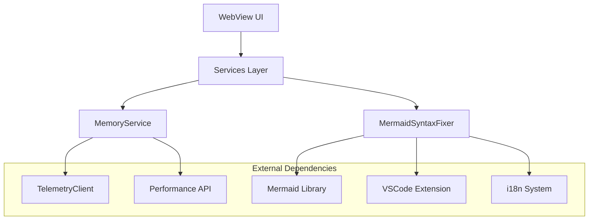

# Services 服务层架构

## 概述

Services层是webview-ui项目的核心服务层，负责提供各种业务逻辑和功能服务。该层采用模块化设计，每个服务都有明确的职责边界，确保代码的可维护性和可扩展性。

## 服务模块

### 1. MemoryService - 内存监控服务

- **职责**: 监控和报告webview的内存使用情况
- **核心功能**:
    - 定期收集JavaScript堆内存使用数据
    - 通过遥测系统上报内存指标
    - 支持采样率控制以减少性能影响
- **使用场景**: 性能监控、内存泄漏检测、用户体验优化

### 2. MermaidSyntaxFixer - Mermaid语法修复服务

- **职责**: 验证和修复Mermaid图表语法错误
- **核心功能**:
    - 自动检测和修复常见的语法错误
    - 集成LLM进行智能语法修复
    - 提供语法验证和错误报告
- **使用场景**: 图表渲染、代码生成、用户输入处理

## 架构设计



## 服务间依赖关系

### MemoryService 依赖

- `TelemetryClient`: 用于上报遥测数据
- `Performance API`: 获取内存使用信息
- `sampling utils`: 控制数据采样率

### MermaidSyntaxFixer 依赖

- `mermaid`: Mermaid图表库，用于语法验证
- `vscode`: VSCode扩展API，用于LLM通信
- `i18next`: 国际化支持

## 使用模式

### 1. 服务初始化

```typescript
// 内存监控服务
const memoryService = new MemoryService()
memoryService.start()

// Mermaid语法修复
const result = await MermaidSyntaxFixer.autoFixSyntax(code)
```

### 2. 生命周期管理

- **MemoryService**: 支持start/stop控制，自动清理定时器
- **MermaidSyntaxFixer**: 静态方法设计，无状态服务

### 3. 错误处理

- 统一的错误处理机制
- 优雅降级策略
- 详细的错误信息和日志

## 最佳实践

### 性能优化

1. **采样控制**: MemoryService使用1%采样率减少性能影响
2. **超时机制**: MermaidSyntaxFixer设置30秒超时防止阻塞
3. **重试策略**: 智能重试机制，最多2次LLM修复尝试

### 可维护性

1. **模块化设计**: 每个服务职责单一，接口清晰
2. **类型安全**: 完整的TypeScript类型定义
3. **测试覆盖**: 全面的单元测试和集成测试

### 扩展性

1. **插件化架构**: 易于添加新的服务模块
2. **配置驱动**: 支持运行时配置调整
3. **事件驱动**: 基于消息传递的松耦合设计

## 监控和调试

### 遥测数据

- 内存使用情况监控
- 服务调用频率统计
- 错误率和性能指标

### 日志记录

- 详细的操作日志
- 错误堆栈跟踪
- 性能分析数据

## 未来规划

1. **服务发现**: 实现动态服务注册和发现机制
2. **缓存层**: 添加智能缓存提升性能
3. **批处理**: 支持批量操作优化
4. **健康检查**: 实现服务健康状态监控
