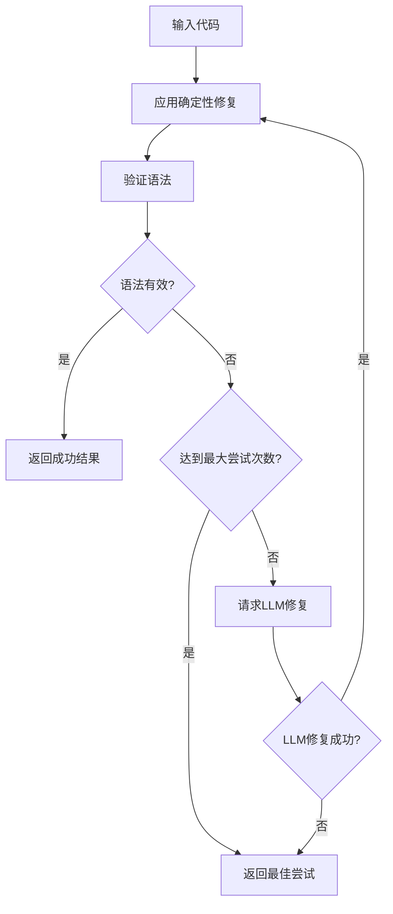

# MermaidSyntaxFixer Mermaid语法修复服务

## 模块概述

MermaidSyntaxFixer是一个专门用于验证和修复Mermaid图表语法错误的智能服务。它结合了确定性修复规则和LLM智能修复能力，能够自动检测和修复常见的Mermaid语法问题，确保图表能够正确渲染。

## 核心功能

### 1. 确定性语法修复

- 修复HTML实体编码错误（`--&gt;` → `-->`）
- 移除多余的代码块标记（````mermaid`）
- 应用预定义的常见错误修复规则

### 2. 智能语法验证

- 使用Mermaid库进行语法验证
- 提供详细的错误信息和位置
- 支持异步验证处理

### 3. LLM智能修复

- 集成VSCode扩展的LLM能力
- 基于错误信息进行智能修复
- 支持多次重试和优化

### 4. 自动修复流程

- 组合确定性修复和智能修复
- 自动重试机制（最多2次）
- 超时保护（30秒）

## 类型定义

### MermaidFixResult

```typescript
export interface MermaidFixResult {
	success: boolean // 修复是否成功
	fixedCode?: string // 修复后的代码
	error?: string // 错误信息
	attempts?: number // 尝试次数
}
```

### MermaidValidationResult

```typescript
export interface MermaidValidationResult {
	isValid: boolean // 语法是否有效
	error?: string // 验证错误信息
}
```

## 主要类：MermaidSyntaxFixer

```typescript
export class MermaidSyntaxFixer {
    private static readonly MAX_FIX_ATTEMPTS = 2
    private static readonly FIX_TIMEOUT = 30000 // 30秒

    // 公共静态方法
    static applyDeterministicFixes(code: string): string
    static async validateSyntax(code: string): Promise<MermaidValidationResult>
    static async autoFixSyntax(code: string): Promise<MermaidFixResult>

    // 私有静态方法
    private static requestLLMFix(code: string, error: string): Promise<{...}>
}
```

## 详细API文档

### 公共方法

#### applyDeterministicFixes(code: string): string

应用确定性修复规则，处理常见的LLM生成错误。

**参数**:

- `code`: 待修复的Mermaid代码

**返回值**:

- 应用修复规则后的代码

**修复规则**:

1. 将`--&gt;`替换为`-->`（HTML实体解码）
2. 移除````mermaid`前缀标记

**使用示例**:

````typescript
const code = "A --&gt; B\n```mermaid\ngraph TD"
const fixed = MermaidSyntaxFixer.applyDeterministicFixes(code)
// 结果: "A --> B\ngraph TD"
````

#### validateSyntax(code: string): Promise<MermaidValidationResult>

使用Mermaid库验证语法的有效性。

**参数**:

- `code`: 待验证的Mermaid代码

**返回值**:

- Promise包装的验证结果

**使用示例**:

```typescript
const result = await MermaidSyntaxFixer.validateSyntax("graph TD\nA --> B")
if (result.isValid) {
	console.log("语法有效")
} else {
	console.log("语法错误:", result.error)
}
```

#### autoFixSyntax(code: string): Promise<MermaidFixResult>

自动修复Mermaid语法，结合确定性修复和LLM智能修复。

**参数**:

- `code`: 待修复的Mermaid代码

**返回值**:

- Promise包装的修复结果

**修复流程**:

1. 应用确定性修复
2. 验证语法
3. 如果无效，请求LLM修复
4. 重复步骤1-3，最多2次LLM尝试
5. 返回最佳修复结果

**使用示例**:

```typescript
const result = await MermaidSyntaxFixer.autoFixSyntax(invalidCode)
if (result.success) {
	console.log("修复成功:", result.fixedCode)
} else {
	console.log("修复失败:", result.error)
	console.log("最佳尝试:", result.fixedCode)
}
```

### 私有方法

#### requestLLMFix(code: string, error: string): Promise<{...}>

通过VSCode扩展请求LLM修复语法错误。

**实现机制**:

1. 生成唯一请求ID
2. 设置30秒超时保护
3. 监听VSCode扩展响应
4. 清理事件监听器和定时器

**消息格式**:

```typescript
// 发送给VSCode扩展
{
    type: "fixMermaidSyntax",
    requestId: string,
    text: string,
    values: { error: string }
}

// 从VSCode扩展接收
{
    type: "mermaidFixResponse",
    requestId: string,
    success: boolean,
    fixedCode?: string,
    error?: string
}
```

## 语法修复算法

### 1. 确定性修复规则

#### HTML实体修复

```typescript
// 修复箭头符号的HTML实体编码
code.replace(/--&gt;/g, "-->")
```

**常见场景**:

- LLM输出被HTML编码
- 复制粘贴导致的编码问题
- 网页渲染后的符号转换

#### 代码块标记清理

````typescript
// 移除Markdown代码块标记
code.replace(/```mermaid/, "")
````

**应用场景**:

- LLM输出包含Markdown格式
- 用户复制包含格式的代码
- 多层嵌套的代码块

### 2. 智能修复流程



### 3. 错误处理策略

#### 超时处理

- 30秒超时限制
- 自动清理资源
- 返回超时错误信息

#### 重试机制

- 最多2次LLM修复尝试
- 每次尝试后应用确定性修复
- 保留最佳修复结果

#### 降级策略

- 即使修复失败也返回最佳尝试
- 提供详细的错误信息
- 不阻塞用户操作流程

## 使用示例

### 基本语法修复

```typescript
import { MermaidSyntaxFixer } from "./services/mermaidSyntaxFixer"

// 修复简单的HTML实体错误
const simpleCode = "A --&gt; B --&gt; C"
const fixed = MermaidSyntaxFixer.applyDeterministicFixes(simpleCode)
console.log(fixed) // "A --> B --> C"
```

### 完整的自动修复

```typescript
async function fixMermaidDiagram(code: string) {
	try {
		const result = await MermaidSyntaxFixer.autoFixSyntax(code)

		if (result.success) {
			console.log(`修复成功，尝试次数: ${result.attempts}`)
			return result.fixedCode
		} else {
			console.warn(`修复失败: ${result.error}`)
			console.log(`最佳尝试结果: ${result.fixedCode}`)
			return result.fixedCode // 仍然返回最佳尝试
		}
	} catch (error) {
		console.error("修复过程出错:", error)
		return code // 返回原始代码
	}
}
```

### 集成到图表渲染流程

```typescript
class MermaidRenderer {
	async renderDiagram(code: string): Promise<string> {
		// 1. 尝试修复语法
		const fixResult = await MermaidSyntaxFixer.autoFixSyntax(code)

		// 2. 使用修复后的代码进行渲染
		const codeToRender = fixResult.fixedCode || code

		// 3. 渲染图表
		try {
			return await this.mermaidRender(codeToRender)
		} catch (renderError) {
			if (!fixResult.success) {
				throw new Error(`语法修复失败: ${fixResult.error}`)
			}
			throw renderError
		}
	}
}
```

## 测试覆盖

### 单元测试覆盖范围

#### 确定性修复测试

- HTML实体替换功能
- 多个实例替换
- 复杂图表修复
- 边界情况处理
- 空字符串处理
- 混合内容处理

#### 自动修复流程测试

- 确定性修复成功场景
- LLM修复成功场景
- 修复失败但返回最佳尝试
- LLM请求失败处理
- 超时处理机制

### 测试示例

#### 确定性修复测试

```typescript
describe("applyDeterministicFixes", () => {
	it("should replace --&gt; with -->", () => {
		const input = "A --&gt; B"
		const expected = "A --> B"
		const result = MermaidSyntaxFixer.applyDeterministicFixes(input)
		expect(result).toBe(expected)
	})

	it("should handle complex diagrams", () => {
		const input = `graph TD
    A[Start] --&gt; B{Decision}
    B --&gt; C[Option 1]`
		const expected = `graph TD
    A[Start] --> B{Decision}
    B --> C[Option 1]`
		const result = MermaidSyntaxFixer.applyDeterministicFixes(input)
		expect(result).toBe(expected)
	})
})
```

#### 自动修复测试

```typescript
describe("autoFixSyntax", () => {
	it("should return success when deterministic fixes are sufficient", async () => {
		validateSyntaxSpy.mockResolvedValue({ isValid: true })

		const result = await MermaidSyntaxFixer.autoFixSyntax("A --&gt; B")

		expect(result.success).toBe(true)
		expect(result.fixedCode).toBe("A --> B")
		expect(result.attempts).toBe(0)
	})
})
```

## 性能优化

### 1. 缓存策略

- 验证结果可以缓存
- 相同代码避免重复修复
- LLM修复结果缓存

### 2. 异步处理

- 所有修复操作异步执行
- 不阻塞UI渲染
- 支持并发修复请求

### 3. 资源管理

- 及时清理事件监听器
- 超时机制防止内存泄漏
- 错误边界保护

## 依赖关系

### 外部依赖

1. **mermaid**: Mermaid图表库

    - 用途: 语法验证和解析
    - 版本: 动态导入最新版本

2. **vscode**: VSCode扩展API

    - 路径: `@src/utils/vscode`
    - 用途: 与扩展通信，请求LLM修复

3. **i18next**: 国际化库
    - 用途: 错误信息本地化
    - 支持多语言错误提示

### 内部依赖

- 消息传递机制（postMessage/addEventListener）
- 扩展通信协议
- 遥测和日志系统

## 集成方式

### 1. 在React组件中使用

```typescript
import { MermaidSyntaxFixer } from '../services/mermaidSyntaxFixer';

function MermaidEditor({ initialCode }: { initialCode: string }) {
    const [code, setCode] = useState(initialCode);
    const [isFixing, setIsFixing] = useState(false);

    const handleAutoFix = async () => {
        setIsFixing(true);
        try {
            const result = await MermaidSyntaxFixer.autoFixSyntax(code);
            setCode(result.fixedCode || code);

            if (!result.success) {
                showWarning(result.error);
            }
        } finally {
            setIsFixing(false);
        }
    };

    return (
        <div>
            <textarea value={code} onChange={e => setCode(e.target.value)} />
            <button onClick={handleAutoFix} disabled={isFixing}>
                {isFixing ? '修复中...' : '自动修复'}
            </button>
        </div>
    );
}
```

### 2. 在图表渲染管道中集成

```typescript
class MermaidPipeline {
	async process(rawCode: string): Promise<string> {
		// 1. 预处理
		const preprocessed = this.preprocess(rawCode)

		// 2. 语法修复
		const fixResult = await MermaidSyntaxFixer.autoFixSyntax(preprocessed)

		// 3. 最终验证
		const validation = await MermaidSyntaxFixer.validateSyntax(fixResult.fixedCode!)

		if (!validation.isValid) {
			throw new Error(`无法修复语法错误: ${validation.error}`)
		}

		return fixResult.fixedCode!
	}
}
```

## 最佳实践

### 1. 错误处理

```typescript
// 推荐：始终处理修复失败的情况
const result = await MermaidSyntaxFixer.autoFixSyntax(code)
const finalCode = result.fixedCode || code // 使用修复结果或原始代码

if (!result.success) {
	// 记录错误但不阻塞用户
	console.warn("Mermaid语法修复失败:", result.error)
}
```

### 2. 性能优化

```typescript
// 推荐：对相同代码进行缓存
const cache = new Map<string, MermaidFixResult>()

async function cachedAutoFix(code: string): Promise<MermaidFixResult> {
	if (cache.has(code)) {
		return cache.get(code)!
	}

	const result = await MermaidSyntaxFixer.autoFixSyntax(code)
	cache.set(code, result)
	return result
}
```

### 3. 用户体验

```typescript
// 推荐：提供修复进度反馈
async function fixWithProgress(code: string, onProgress: (stage: string) => void) {
	onProgress("应用快速修复...")
	const quickFix = MermaidSyntaxFixer.applyDeterministicFixes(code)

	onProgress("验证语法...")
	const validation = await MermaidSyntaxFixer.validateSyntax(quickFix)

	if (!validation.isValid) {
		onProgress("请求智能修复...")
		return await MermaidSyntaxFixer.autoFixSyntax(code)
	}

	return { success: true, fixedCode: quickFix, attempts: 0 }
}
```

## 扩展建议

### 1. 功能扩展

- 支持更多确定性修复规则
- 添加语法高亮和错误标记
- 实现修复历史记录
- 支持批量修复操作

### 2. 性能优化

- 实现智能缓存策略
- 添加修复结果预测
- 优化LLM请求频率
- 实现增量修复

### 3. 用户体验

- 提供修复建议预览
- 添加修复置信度评分
- 实现交互式修复向导
- 支持自定义修复规则
