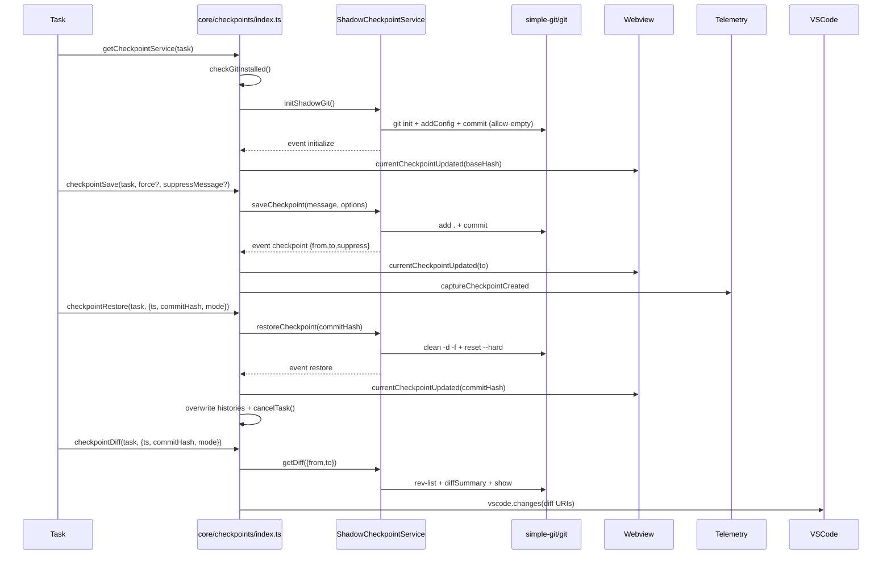

# Checkpoints 服务与 Git 交互架构

## 目标

- 在不污染用户主仓库的前提下，为任务提供可保存、可回滚、可对比的文件系统快照
- 通过事件驱动与 UI/Webview/聊天历史集成，形成端到端的可视化与可操作体验

## 核心设计

- 影子仓库：在 `globalStorageDir` 下为每个任务创建独立的 Git 仓库，目录为 `shadowDir/tasks/<taskId>/checkpoints`
- 工作树绑定：影子仓库的 `core.worktree` 指向用户真实工作区，使提交与重置作用于工作区文件
- 事件驱动：服务在初始化、保存检查点、恢复检查点、错误等时机触发事件，上层订阅并同步 UI 与历史

## 关键组件

- `src/services/checkpoints/ShadowCheckpointService.ts`：封装 Git 初始化、提交、重置、差异计算与事件发布
- `src/services/checkpoints/RepoPerTaskCheckpointService.ts`：按任务生成影子仓库路径策略
- `src/services/checkpoints/types.ts`：事件与数据结构定义
- `src/core/checkpoints/index.ts`：业务入口与事件桥接到 Webview/聊天历史/遥测

## 架构图

```mermaid
flowchart TD
    T[Task] --> CP[core/checkpoints/index.ts]
    CP --> Factory[RepoPerTaskCheckpointService.create]
    Factory --> Svc[ShadowCheckpointService]
    Svc --> SG[simple-git]
    SG --> Git[git CLI]
    Git --> ShadowRepo[shadowDir/tasks/<taskId>/checkpoints/.git]
    ShadowRepo -.->|core.worktree| WS[Workspace Folder]

    %% Events and integrations
    Svc -- events: initialize/checkpoint/restore/error --> CP
    CP --> Webview[Webview UI]
    CP --> Telemetry[@roo-code/telemetry]

    %% Excludes and nested repo detection
    Svc --> Exclude[.git/info/exclude\ngetExcludePatterns]
    Svc --> Ripgrep[executeRipgrep\nscan nested .git/HEAD]
```

## 初始化流程

- 路径与保护：校验工作区不位于用户主目录、桌面、文档、下载等敏感路径（`src/services/checkpoints/ShadowCheckpointService.ts:70-79`）
- 嵌套仓库检测：在工作区内搜索 `.git/HEAD` 以禁用存在嵌套仓库的场景（`src/services/checkpoints/ShadowCheckpointService.ts:185-235`）
- 创建或重用影子仓库：
    - 若 `.git` 存在，校验 `core.worktree` 与工作区一致，写入 `.git/info/exclude`，记录 `baseHash`（`src/services/checkpoints/ShadowCheckpointService.ts:116-128`，`168-172`）
    - 若不存在，执行 `git init`，设置 `core.worktree`、关闭签名、设定用户信息，写入排除规则，暂存并进行一次允许空提交作为基线（`src/services/checkpoints/ShadowCheckpointService.ts:130-139`）
- 发布 `initialize` 事件（`src/services/checkpoints/ShadowCheckpointService.ts:152-160`）

## 保存检查点

- 执行 `add .` 暂存当前工作区更改（`src/services/checkpoints/ShadowCheckpointService.ts:174-183`）
- 执行 `commit` 保存快照，支持 `allowEmpty` 强制生成检查点（`src/services/checkpoints/ShadowCheckpointService.ts:252-269`）
- 计算 `fromHash` 与 `toHash` 并维护内部检查点列表；发布 `checkpoint` 事件（`src/services/checkpoints/ShadowCheckpointService.ts:269-282`）
- 任务层记录消息、更新 Webview 当前检查点并写入遥测（`src/core/checkpoints/index.ts:147-177`，`197-214`）

## 恢复检查点

- 清理未跟踪与目录项：`git clean -d -f`（`src/services/checkpoints/ShadowCheckpointService.ts:310`）
- 回滚到指定提交：`git reset --hard <hash>`（`src/services/checkpoints/ShadowCheckpointService.ts:311-312`）
- 修剪内部检查点列表并发布 `restore` 事件（`src/services/checkpoints/ShadowCheckpointService.ts:314-322`）
- 上层同步 Webview、重写聊天与 API 历史、取消并重建任务上下文（`src/core/checkpoints/index.ts:241-284`）

## 差异查看

- 计算基线：若未指定 `from`，通过 `rev-list --max-parents=0 HEAD` 获取最早提交（`src/services/checkpoints/ShadowCheckpointService.ts:339-340`）
- 暂存以包含未跟踪文件进入 diff（`src/services/checkpoints/ShadowCheckpointService.ts:342-344`）
- 获取文件列表与内容：
    - 使用 `diffSummary` 获取变更文件（`src/services/checkpoints/ShadowCheckpointService.ts:345-347`）
    - 使用 `show from:path` 读取历史版本、使用 `show to:path` 或直接读取工作区当前文件获取对比内容（`src/services/checkpoints/ShadowCheckpointService.ts:353-369`）
- 通过 VS Code 命令渲染对比视图（`src/core/checkpoints/index.ts:328-340`）

## Git 操作与依赖

- 依赖库：`simple-git`（`src/services/checkpoints/ShadowCheckpointService.ts:7`）
- 核心命令：`init`、`add .`、`commit`、`revparse`、`clean -d -f`、`reset --hard`、`diffSummary`、`show`
- 安装检测：`git --version`，未安装则禁用并提示下载（`src/utils/git.ts:222-229`，`src/core/checkpoints/index.ts:120-145`）

## 路径策略与排除规则

- 影子仓库路径：`RepoPerTaskCheckpointService.create` -> `shadowDir/tasks/<taskId>/checkpoints`（`src/services/checkpoints/RepoPerTaskCheckpointService.ts:7-14`）
- 排除规则：写入 `.git/info/exclude`，包含构建产物、缓存、日志、数据库、媒体等模式，并动态合并 `.gitattributes` 中 LFS 文件模式（`src/services/checkpoints/ShadowCheckpointService.ts:168-172`，`src/services/checkpoints/excludes.ts:201-212`）

## 事件与集成

- 事件模型：`initialize`、`checkpoint`、`restore`、`error`（`src/services/checkpoints/types.ts:24-35`）
- 事件桥接：任务层订阅事件，更新 Webview 与聊天历史，并记录遥测（`src/core/checkpoints/index.ts:141-177`）

## 健壮性与限制

- 保护目录：禁止在用户主目录、桌面、文档、下载路径使用检查点（`src/services/checkpoints/ShadowCheckpointService.ts:70-79`）
- 嵌套仓库：检测并禁用，避免与用户多仓库结构冲突（`src/services/checkpoints/ShadowCheckpointService.ts:185-235`）
- 分支操作：核心流程不依赖分支；存在用于任务分支清理的静态方法，不参与日常保存/恢复（`src/services/checkpoints/ShadowCheckpointService.ts:437-483`）

## 时序概览

1. 任务请求服务 -> 检测 Git 安装 -> 创建服务并订阅事件（`src/core/checkpoints/index.ts:31-112`）
2. 初始化影子仓库并发布 `initialize`（`src/services/checkpoints/ShadowCheckpointService.ts:116-161`）
3. 保存检查点：暂存与提交 -> 发布 `checkpoint` -> 更新 Webview 与历史（`src/services/checkpoints/ShadowCheckpointService.ts:252-282`，`src/core/checkpoints/index.ts:147-177`）
4. 恢复检查点：清理与硬重置 -> 发布 `restore` -> 重写历史与取消任务（`src/services/checkpoints/ShadowCheckpointService.ts:309-322`，`src/core/checkpoints/index.ts:241-284`）
5. 差异：生成文件与内容对比，渲染 VS Code 变更视图（`src/services/checkpoints/ShadowCheckpointService.ts:331-372`，`src/core/checkpoints/index.ts:328-340`）

### 调用流程图



## 维护建议

- 在新增排除模式时优先更新 `getExcludePatterns`，避免误提交大型或二进制文件
- 若引入新的工作流（如分支或暂存栈），应保持影子仓库与主仓库完全隔离，避免影响用户主仓库历史
- 为复杂恢复场景增加更多遥测与错误上报，以便定位问题与改进体验
