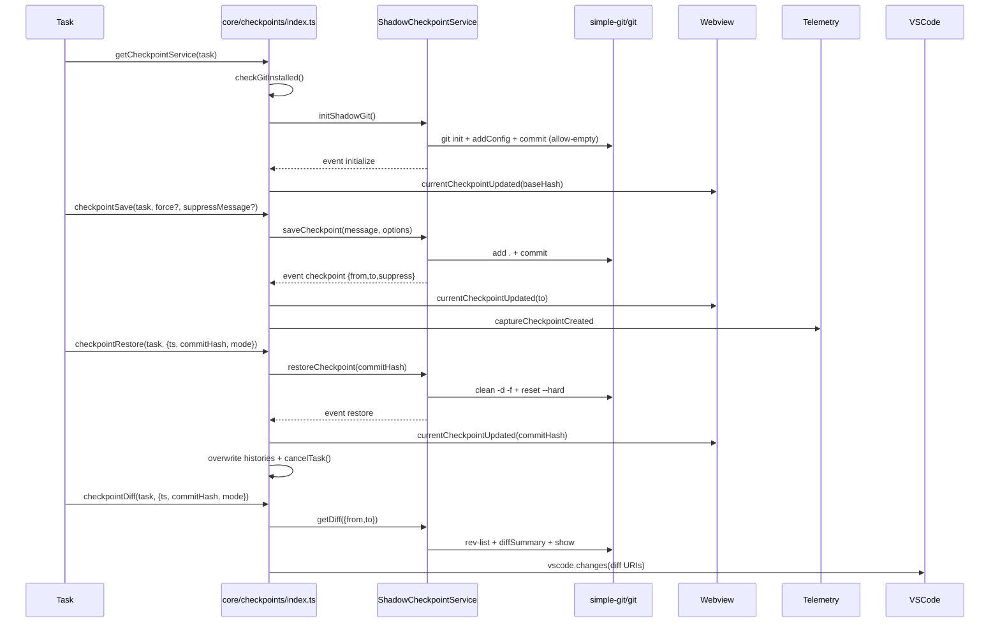

# Checkpoints 技术架构（core/checkpoints × services/checkpoints）

## 概述

- 目标：提供任务级代码快照（保存、恢复、差异）能力，且不污染用户主仓库
- 方案：在 `globalStorageDir` 下创建“影子仓库”，将其 `core.worktree` 绑定到真实工作区；使用 `simple-git` 驱动 Git 操作
- 集成：通过事件驱动将状态同步到 Webview 与聊天历史，并记录遥测

## 组件与职责

- `src/services/checkpoints/ShadowCheckpointService.ts`：
    - 初始化影子仓库、设置 `core.worktree`、写 `.git/info/exclude`，首个允许空提交作为基线（`src/services/checkpoints/ShadowCheckpointService.ts:130-139, 168-172`）
    - 保存检查点：`add .` + `commit`，维护内部检查点列表并触发事件（`src/services/checkpoints/ShadowCheckpointService.ts:174-183, 252-282`）
    - 恢复检查点：`clean -d -f` + `reset --hard`，修剪内部列表并触发事件（`src/services/checkpoints/ShadowCheckpointService.ts:309-322`）
    - 差异查看：`rev-list`/`diffSummary`/`show`，生成文件级前后内容（`src/services/checkpoints/ShadowCheckpointService.ts:339-372`）
    - 嵌套仓库检测与保护目录校验（`src/services/checkpoints/ShadowCheckpointService.ts:70-79, 185-235`）
- `src/services/checkpoints/RepoPerTaskCheckpointService.ts`：
    - 为每个任务生成影子仓库路径 `shadowDir/tasks/<taskId>/checkpoints`（`src/services/checkpoints/RepoPerTaskCheckpointService.ts:7-14`）
- `src/services/checkpoints/types.ts`：
    - 定义事件与数据结构（`src/services/checkpoints/types.ts:24-35`）
- `src/core/checkpoints/index.ts`：
    - 业务入口：`getCheckpointService`、`checkpointSave`、`checkpointRestore`、`checkpointDiff`（`src/core/checkpoints/index.ts:31-112, 197-214, 223-289, 298-347`）
    - 事件桥接：更新 Webview 当前检查点，记录聊天历史与遥测（`src/core/checkpoints/index.ts:141-177`）
    - Git 安装检测与用户提示（`src/core/checkpoints/index.ts:120-145`，`src/utils/git.ts:222-229`）

## 初始化流程

1. 业务层调用 `getCheckpointService(task)`，检查 Git 是否安装（`src/core/checkpoints/index.ts:31-112, 120-145`）
2. 构建 `CheckpointServiceOptions` 并创建服务实例（`src/core/checkpoints/index.ts:74-80, 100-104`；`src/services/checkpoints/RepoPerTaskCheckpointService.ts:7-14`）
3. 服务执行 `initShadowGit`：
    - 防护：拒绝敏感路径（`src/services/checkpoints/ShadowCheckpointService.ts:70-79`）
    - 嵌套仓库扫描 `.git/HEAD`（`src/services/checkpoints/ShadowCheckpointService.ts:185-235`）
    - 初始化或重用 `.git`、写 `.git/info/exclude`、设定 `core.worktree`、关闭签名、设置用户信息、首个空提交（`src/services/checkpoints/ShadowCheckpointService.ts:116-139, 168-172`）
4. 触发 `initialize` 事件，业务层解除初始化中状态并同步 UI（`src/services/checkpoints/ShadowCheckpointService.ts:152-160`；`src/core/checkpoints/index.ts:142-145`）

## 保存检查点

- 入口：`checkpointSave(task, force?, suppressMessage?)`（`src/core/checkpoints/index.ts:197-214`）
- 服务：`saveCheckpoint(message, options)` -> `add .` + `commit`；维护 `fromHash`/`toHash` 并触发 `checkpoint` 事件（`src/services/checkpoints/ShadowCheckpointService.ts:252-282`）
- 上层：更新 Webview、写入聊天消息（可抑制展示但保留历史）、记录遥测（`src/core/checkpoints/index.ts:147-177`）

## 恢复检查点

- 入口：`checkpointRestore(task, { ts, commitHash, mode, operation? })`（`src/core/checkpoints/index.ts:223-289`）
- 服务：`restoreCheckpoint(commitHash)` -> `clean -d -f` + `reset --hard`；修剪内部列表并触发 `restore`（`src/services/checkpoints/ShadowCheckpointService.ts:309-322`）
- 上层：
    - 更新 Webview 当前检查点（`src/core/checkpoints/index.ts:244-245`）
    - 根据模式重写聊天/API 历史、统计删除代价、取消并重建任务上下文（`src/core/checkpoints/index.ts:246-284`）

## 差异查看

- 入口：`checkpointDiff(task, { ts, previousCommitHash?, commitHash, mode })`（`src/core/checkpoints/index.ts:298-347`）
- 服务：按“与下一检查点”或“与当前工作区”模式生成变更集（`src/core/checkpoints/index.ts:307-318, 320-340`；`src/services/checkpoints/ShadowCheckpointService.ts:331-372`）
- 渲染：通过 VS Code 命令 `vscode.changes` 展示前后内容（`src/core/checkpoints/index.ts:328-340`）

## 事件与集成

- 事件：`initialize`、`checkpoint`、`restore`、`error`（`src/services/checkpoints/types.ts:24-35`）
- 桥接：任务层订阅事件，更新 Webview 与聊天历史，写入遥测（`src/core/checkpoints/index.ts:141-177`）

## 依赖关系

- 外部：
    - `simple-git`（Git 操作，`src/services/checkpoints/ShadowCheckpointService.ts:7`）
    - `vscode`（消息与视图集成，`src/services/checkpoints/ShadowCheckpointService.ts:9`，`src/core/checkpoints/index.ts:1-3`）
    - `p-wait-for`（流程等待，`src/services/checkpoints/ShadowCheckpointService.ts:8`，`src/core/checkpoints/index.ts:1`）
- 内部：
    - `utils/git.checkGitInstalled`（`src/utils/git.ts:222-229`）
    - `utils/fs.fileExistsAtPath`（`src/services/checkpoints/ShadowCheckpointService.ts:11`）
    - `services/search/file-search.executeRipgrep`（嵌套仓库检测，`src/services/checkpoints/ShadowCheckpointService.ts:12, 185-235`）
    - `i18n.t`（文案，`src/services/checkpoints/ShadowCheckpointService.ts:13`，`src/core/checkpoints/index.ts:10`）
    - `shared/kilocode/errorUtils.stringifyError`（错误序列化，`src/services/checkpoints/ShadowCheckpointService.ts:21`，`src/core/checkpoints/index.ts:21-28`）
    - `@roo-code/telemetry`、`@roo-code/types`（遥测，`src/services/checkpoints/ShadowCheckpointService.ts:19-27`，`src/core/checkpoints/index.ts:19-29`）
    - `integrations/editor/DiffViewProvider.DIFF_VIEW_URI_SCHEME`（差异视图，`src/core/checkpoints/index.ts:15, 328-340`）
    - `shared/getApiMetrics`、`shared/ExtensionMessage`（恢复时统计，`src/core/checkpoints/index.ts:12-14, 251-270`）

## 健壮性与安全

- 安装前置：Git 未安装则禁用并引导下载（`src/core/checkpoints/index.ts:120-145`）
- 目录保护：拒绝主目录/桌面/文档/下载等（`src/services/checkpoints/ShadowCheckpointService.ts:70-79`）
- 嵌套仓库：检测到子仓库则禁用（`src/services/checkpoints/ShadowCheckpointService.ts:185-235`）
- 排除规则：`.git/info/exclude` 排除构建产物/缓存/日志/媒体/数据库/LFS 文件（`src/services/checkpoints/ShadowCheckpointService.ts:168-172`，`src/services/checkpoints/excludes.ts:201-212`）
- 账号与签名：影子仓库关闭 GPG 签名，使用内部用户名邮箱（`src/services/checkpoints/ShadowCheckpointService.ts:132-135`）

## 错误处理与遥测

- 关键点错误上报：使用 `TelemetryService` 记录失败事件（`src/services/checkpoints/ShadowCheckpointService.ts:18-27`，`src/core/checkpoints/index.ts:19-29`）
- 运行期错误：事件 `error` 统一透出，业务层禁用功能并提示（`src/services/checkpoints/ShadowCheckpointService.ts:296, 326`，`src/core/checkpoints/index.ts:171-177, 209-214, 285-289, 341-347`）

## 架构图

```mermaid
flowchart TD
    T[Task / 调用方模块] --> CP[core/checkpoints/index.ts]
    CP --> Factory[RepoPerTaskCheckpointService.create]
    Factory --> Svc[ShadowCheckpointService]
    Svc --> SG[simple-git]
    SG --> Git[git CLI]
    Git --> ShadowRepo[shadowDir/tasks/<taskId>/checkpoints/.git]
    ShadowRepo -.->|core.worktree| WS[Workspace Folder]

    %% Events and integrations
    Svc -- events: initialize/checkpoint/restore/error --> CP
    CP --> Webview[Webview UI]
    CP --> Telemetry[@roo-code/telemetry]

    %% Excludes and nested repo detection
    Svc --> Exclude[.git/info/exclude\ngetExcludePatterns]
    Svc --> Ripgrep[executeRipgrep\nscan nested .git/HEAD]
```

## 调用流程图



## 设计取舍

- 影子仓库与 `core.worktree`：最大化隔离与安全，保证主仓库无分支/提交污染
- 提交而非 stash：提交具备可寻址与可视化优势，便于差异渲染与恢复
- `.git/info/exclude`：局部排除不影响用户主仓库 `.gitignore`
- 事件驱动：与 UI/聊天历史解耦，易扩展遥测与多接收方
