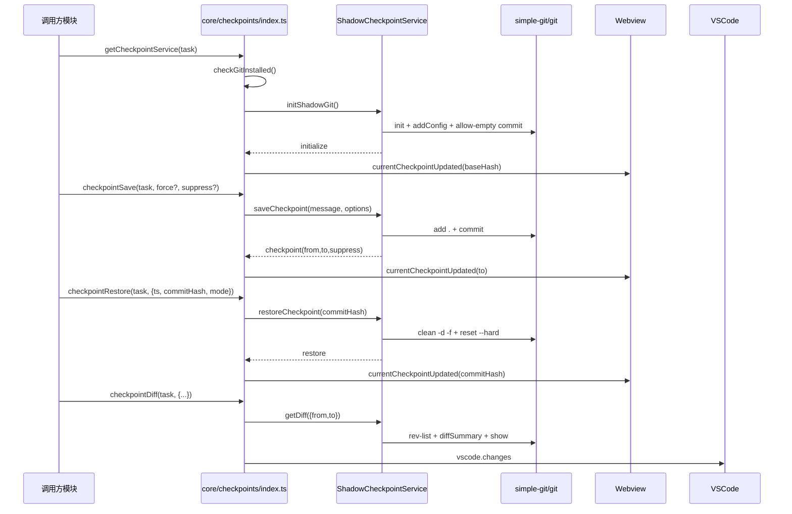

# Checkpoints 服务调用与依赖说明

## 模块概览

- 功能：为任务提供可保存（提交）、可回滚（重置）、可对比（差异）的一致性快照能力
- 位置：核心实现位于 `src/services/checkpoints`，业务入口与桥接位于 `src/core/checkpoints/index.ts`

## 对外调用入口

- 任务级 API（推荐从业务层使用）：
    - `getCheckpointService(task)`：获取并初始化服务（`src/core/checkpoints/index.ts:31-112`）
    - `checkpointSave(task, force?, suppressMessage?)`：保存检查点（`src/core/checkpoints/index.ts:197-214`）
    - `checkpointRestore(task, { ts, commitHash, mode, operation? })`：恢复检查点（`src/core/checkpoints/index.ts:223-289`）
    - `checkpointDiff(task, { ts, previousCommitHash?, commitHash, mode })`：查看差异（`src/core/checkpoints/index.ts:298-347`）
- 服务级 API（如需更细粒度控制）：
    - `RepoPerTaskCheckpointService.create(options)`：按任务创建服务实例（`src/services/checkpoints/RepoPerTaskCheckpointService.ts:7-14`）
    - `ShadowCheckpointService#initShadowGit(onInit?)`：初始化影子仓库（`src/services/checkpoints/ShadowCheckpointService.ts:89-161`）
    - `ShadowCheckpointService#saveCheckpoint(message, { allowEmpty?, suppressMessage? })`（`src/services/checkpoints/ShadowCheckpointService.ts:252-299`）
    - `ShadowCheckpointService#restoreCheckpoint(commitHash)`（`src/services/checkpoints/ShadowCheckpointService.ts:301-329`）
    - `ShadowCheckpointService#getDiff({ from?, to? })`（`src/services/checkpoints/ShadowCheckpointService.ts:331-372`）

## 最小集成示例（业务层）

```ts
import { checkpointSave, checkpointRestore, checkpointDiff, getCheckpointService } from "src/core/checkpoints"

async function run(task: Task) {
	const svc = await getCheckpointService(task)
	if (!svc) return

	await checkpointSave(task) // 保存当前快照
	await checkpointDiff(task, { ts: Date.now(), commitHash: svc.getCheckpoints().at(-1)!, mode: "full" })
	await checkpointRestore(task, { ts: Date.now(), commitHash: svc.baseHash!, mode: "restore" })
}
```

## 事件订阅

- 事件模型定义：`CheckpointEventMap`（`src/services/checkpoints/types.ts:24-35`）
- 常见事件：
    - `initialize`：完成影子仓库初始化（`src/services/checkpoints/ShadowCheckpointService.ts:152-160`）
    - `checkpoint`：保存检查点完成（`src/services/checkpoints/ShadowCheckpointService.ts:275-282`）
    - `restore`：恢复检查点完成（`src/services/checkpoints/ShadowCheckpointService.ts:321`）
    - `error`：发生错误（`src/services/checkpoints/ShadowCheckpointService.ts:296, 326`）
- 业务层桥接：在任务层订阅并更新 Webview、聊天历史与遥测（`src/core/checkpoints/index.ts:141-177`）

## 依赖模块

- 外部库：
    - `simple-git`：Git 操作（`src/services/checkpoints/ShadowCheckpointService.ts:7`）
    - `vscode`：消息与视图集成（`src/services/checkpoints/ShadowCheckpointService.ts:9`，`src/core/checkpoints/index.ts:1-3`）
    - `p-wait-for`：流程等待（`src/services/checkpoints/ShadowCheckpointService.ts:8`，`src/core/checkpoints/index.ts:1`）
- 内部模块：
    - `utils/git.checkGitInstalled`：检测是否安装 Git（`src/utils/git.ts:222-229`）
    - `utils/fs.fileExistsAtPath`：文件存在性检测（`src/services/checkpoints/ShadowCheckpointService.ts:11`）
    - `services/search/file-search.executeRipgrep`：嵌套仓库检测（`src/services/checkpoints/ShadowCheckpointService.ts:12, 185-235`）
    - `i18n.t`：文案（`src/services/checkpoints/ShadowCheckpointService.ts:13`，`src/core/checkpoints/index.ts:10`）
    - `shared/kilocode/errorUtils.stringifyError`：错误序列化（`src/services/checkpoints/ShadowCheckpointService.ts:21`，`src/core/checkpoints/index.ts:21-28`）
    - `@roo-code/telemetry` 与 `@roo-code/types`：遥测与事件名（`src/services/checkpoints/ShadowCheckpointService.ts:19-27`，`src/core/checkpoints/index.ts:19-29`）
    - `integrations/editor/DiffViewProvider.DIFF_VIEW_URI_SCHEME`：差异视图渲染（`src/core/checkpoints/index.ts:15`，`328-340`）
    - `shared/getApiMetrics`、`shared/ExtensionMessage`：恢复时统计与消息结构（`src/core/checkpoints/index.ts:12-14, 251-270`）

## 集成注意事项

- 需要安装 Git：未安装时会禁用功能并提示下载（`src/core/checkpoints/index.ts:120-145`）
- 保护目录限制：用户主目录/桌面/文档/下载路径将被拒绝（`src/services/checkpoints/ShadowCheckpointService.ts:70-79`）
- 嵌套仓库禁用：检测到工作区内存在子仓库时禁用（`src/services/checkpoints/ShadowCheckpointService.ts:185-235`）
- 排除规则：写入 `.git/info/exclude`，避免大型或二进制文件进入影子仓库（`src/services/checkpoints/ShadowCheckpointService.ts:168-172`，`src/services/checkpoints/excludes.ts:201-212`）
- UI 与历史：事件触发后需同步 Webview 的当前检查点与聊天历史（`src/core/checkpoints/index.ts:147-177`）

## 扩展点

- `saveCheckpoint` 支持 `allowEmpty` 强制生成检查点；`suppressMessage` 控制是否在聊天界面显示消息（`src/services/checkpoints/ShadowCheckpointService.ts:252-282`，`src/core/checkpoints/index.ts:147-170, 197-214`）
- `getDiff` 可用于“与下一检查点”或“与当前工作区”对比（`src/core/checkpoints/index.ts:307-318, 320-340`）

## 架构图

```mermaid
flowchart TD
    A[调用方模块 / Task] --> B[core/checkpoints/index.ts]
    B --> C[RepoPerTaskCheckpointService.create]
    C --> D[ShadowCheckpointService]
    D --> E[simple-git]
    E --> F[git CLI]
    F --> G[shadowDir/tasks/<taskId>/checkpoints/.git]
    G -.->|core.worktree| H[Workspace Folder]

    D -- events --> B
    B --> I[Webview UI]
    B --> J[@roo-code/telemetry]
    D --> K[.git/info/exclude\ngetExcludePatterns]
    D --> L[executeRipgrep\nscan nested .git/HEAD]
```

## 调用流程图


