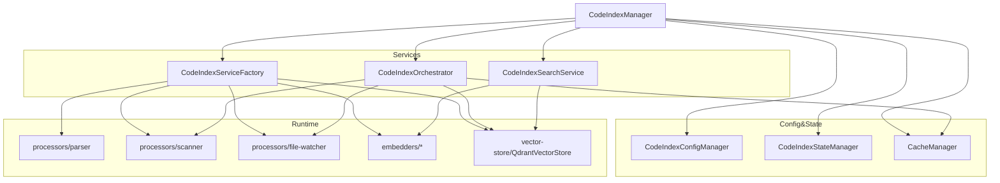
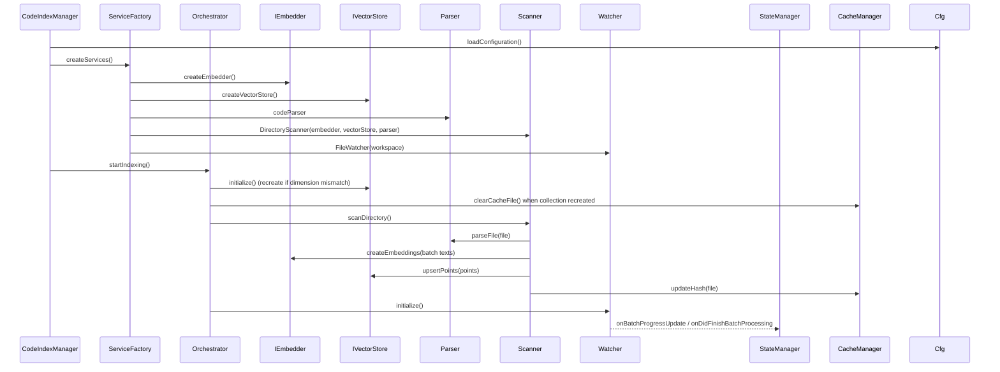

# Code Index 服务架构与目录说明

## 目标

- 对工作区源码进行切块解析、嵌入向量化、持久化到向量数据库，并提供查询能力
- 在首次全量扫描后通过文件监视增量维护索引
- 通过配置管理与状态管理实现可用性与健壮性控制

## 目录结构

- `interfaces/`：抽象接口与类型
    - `embedder.ts`：嵌入器接口 `IEmbedder` 与 `EmbeddingResponse`
    - `vector-store.ts`：向量库接口 `IVectorStore` 与查询结果 `VectorStoreSearchResult`
    - `file-processor.ts`：解析器 `ICodeParser`、目录扫描器 `IDirectoryScanner`、文件监视器 `IFileWatcher` 及批处理类型
    - `manager.ts`：索引管理器 `ICodeIndexManager` 状态与事件定义
    - `index.ts`：接口聚合导出
- `constants/`：常量
    - `index.ts`：解析阈值、并发与批处理、默认检索参数、Qdrant 命名空间等
- `embedders/`：多供应商嵌入器实现
    - `openai.ts`、`ollama.ts`、`openai-compatible.ts`、`gemini.ts`、`mistral.ts`、`vercel-ai-gateway.ts`
    - `__tests__/`：各嵌入器与限流网关测试
- `processors/`：解析与增量处理
    - `parser.ts`：Tree-sitter 语法解析与 Markdown 分段；对不稳定语言使用长度分块回退
    - `scanner.ts`：全量目录扫描，批量解析、创建嵌入、构造点位并写入向量库；支持并发、重试与协作取消
    - `file-watcher.ts`：文件系统事件批处理（创建/变更/删除），合并批次、删除旧点位、增量嵌入与写入
    - `index.ts`：处理器导出
    - `__tests__/`：扫描器、解析器、监视器测试
- `shared/`：辅助函数
    - `supported-extensions.ts`：支持的扩展与回退分块策略
    - `get-relative-path.ts`：路径归一化与相对路径生成
    - `validation-helpers.ts`：错误清洗与标准化验证消息
    - `__tests__/`：单元测试
- `vector-store/`：向量库客户端
    - `qdrant-client.ts`：Qdrant REST 客户端，集合初始化/重建、索引创建、upsert/search/delete/clear/exists
    - `__tests__/`：Qdrant 客户端测试
- 根模块
    - `config-manager.ts`：配置加载、校验与重启判定；提供当前模型、维度、检索阈值与 Qdrant 配置
    - `state-manager.ts`：索引状态机与进度事件（Standby/Indexing/Indexed/Error）
    - `cache-manager.ts`：基于全局存储的文件哈希缓存；去重与落盘
    - `service-factory.ts`：按配置创建 `embedder`、`vectorStore`、`parser`、`scanner`、`fileWatcher`
    - `orchestrator.ts`：工作流编排（初始化、全量扫描、启动监视、错误清理与取消）
    - `search-service.ts`：查询服务（生成查询向量、按目录前缀与阈值搜索）
    - `manager.ts`：对外入口与生命周期管理（单例、初始化、启动/停止/取消、清理、搜索、设置变化）

## 核心职责

- `CodeIndexConfigManager`：统一读取 VSCode 全局状态与密钥，决定是否启用/已配置，计算模型维度与检索阈值，判断是否需重启
- `CodeIndexStateManager`：维护系统状态与进度消息，向 UI 发事件
- `CacheManager`：记录文件路径→哈希，减少重复嵌入与写库；支持清空
- `CodeIndexServiceFactory`：依配置构建依赖，校验嵌入器可用性，向下游传递批大小等参数
- `CodeIndexOrchestrator`：
    - 初始化向量库集合（维度不匹配时重建集合）
    - 全量扫描：并发解析→批量嵌入→批量 upsert→更新缓存；记录批错误与失败率
    - 启动文件监视：批处理事件，删除旧点位、增量嵌入与 upsert、更新缓存
    - 取消与清理：协作取消扫描/批处理、停止监视、删除集合或清空
- `CodeIndexSearchService`：在 Indexed/Indexing 状态下接受查询，生成查询向量，在 Qdrant 中以目录前缀过滤并返回结果
- `QdrantVectorStore`：集合生命周期管理、索引创建、upsert、search、delete（单/多路径）、clear、exists；路径段索引用于精确过滤
- `processors/parser`：Tree-sitter 捕获结构块；超长块按行分段；Markdown 以标题分层切片并复用统一分块逻辑
- `processors/scanner`：全量扫描并批处理，幂等删除（修改文件先删旧点位）、创建嵌入、上载点位；多级并发与退避重试；协作取消
- `processors/file-watcher`：事件聚合与批处理三阶段（删、解析准备、上载），分段上载与重试，批完成后发进度

## 数据流

- 解析与嵌入
    - 文件→解析为 `CodeBlock[]`（含 `segmentHash`）→文本批次→`IEmbedder.createEmbeddings`→向量
    - 构造 `PointStruct`（`id` 基于 `segmentHash` 或稳定名）→`IVectorStore.upsertPoints`
    - 更新 `CacheManager` 文件哈希
- 查询
    - 输入查询→生成嵌入向量→`IVectorStore.search`（阈值与目录过滤）→返回匹配块与分数
- 删除
    - 变更/删除文件→先 `deletePointsByMultipleFilePaths`→再上载新点位或清理缓存

## 架构图

## 工作流时序

## 健壮性与治理

- 重启判定：供应商/认证/维度/Qdrant 连接变化导致重启；检索阈值等非关键变更不需重启
- 维度不匹配：自动重建集合并清空缓存
- 并发与退避：解析并发、批处理并发、失败指数退避重试
- 取消：全量扫描与批处理均支持协作取消；监视器可随时停用
- 过滤与忽略：.gitignore 与 .rooignore 联合过滤，跳过超大文件与被忽略目录
- 遥测与错误清洗：统一捕捉错误并清洗敏感信息

## 与上层集成

- 通过 `CodeIndexManager` 提供统一入口：
    - `initialize(contextProxy)`、`startIndexing()`、`stopWatcher()`、`cancelIndexing()`、`clearIndexData()`
    - `searchIndex(query, directoryPrefix?)`、`onProgressUpdate` 事件用于 UI 更新
