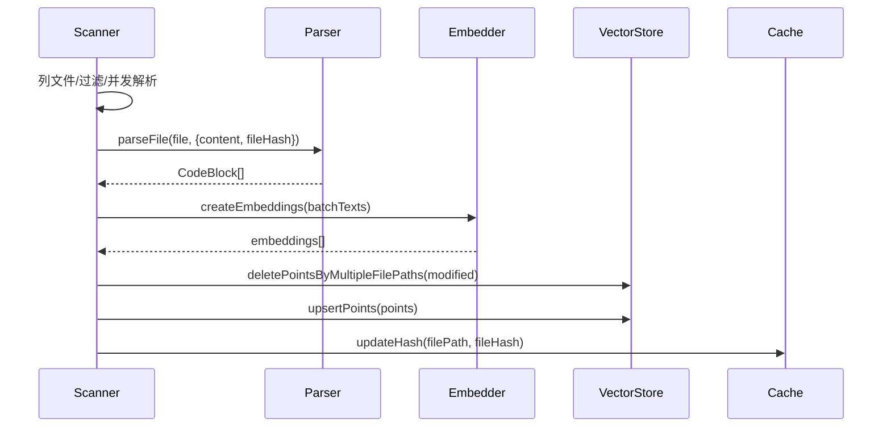
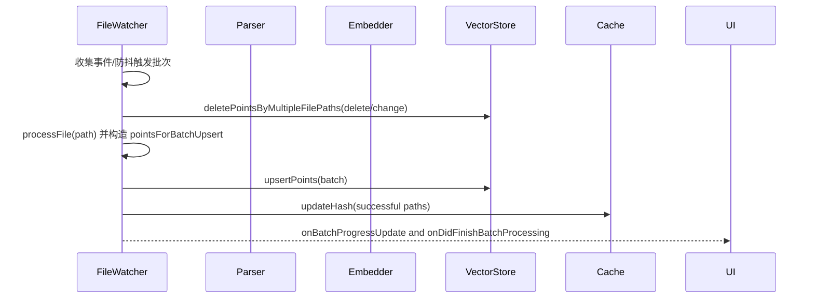

# Code Index Processors 技术文档

## 模块概览

- 位置：`src/services/code-index/processors/`，包含解析器（parser）、目录扫描器（scanner）、文件监视器（file-watcher），以及聚合导出（index.ts）。
- 作用：
    - parser：将文件内容切分为语义代码块（CodeBlock），生成稳定的 segmentHash；支持 Tree-sitter 与 Markdown 分段，必要时回退长度分块。
    - scanner：全量扫描工作区目录，批量解析与嵌入，幂等删除旧点位后批量 upsert 到向量库；支持并发、退避重试与协作取消。
    - file-watcher：监听文件创建/变更/删除事件，合并为批次后按三阶段处理（删除→解析准备→分段上载），并上报进度。

## 解析器（parser.ts）

- 入口：`codeParser.parseFile(filePath, { content?, fileHash? }): Promise<CodeBlock[]>` [parser.ts](file:///d:/zyhome_work/kilocode/src/services/code-index/processors/parser.ts#L29-L68)
- 语言支持与策略：
    - Tree-sitter 解析：按扩展加载语言解析器与查询，捕获结构节点并切块 [parser.ts](file:///d:/zyhome_work/kilocode/src/services/code-index/processors/parser.ts#L146-L170)
    - Markdown 特殊处理：根据标题层级（h1–h6）分段，并复用统一的分块逻辑 [parser.ts](file:///d:/zyhome_work/kilocode/src/services/code-index/processors/parser.ts#L469-L551)
    - 回退分块：对于不稳定语言或无匹配节点，按行进行长度分块，避免生成过大代码块 [parser.ts](file:///d:/zyhome_work/kilocode/src/services/code-index/processors/parser.ts#L380-L388)
- 分块算法与阈值：
    - 常量来源：`constants/index.ts`（MAX_BLOCK_CHARS、MIN_BLOCK_CHARS、MAX_CHARS_TOLERANCE_FACTOR、MIN_CHUNK_REMAINDER_CHARS）
    - 超长节点处理：优先子节点拆分；无子节点时按行分段；避免小尾分块（对剩余长度进行再平衡） [parser.ts](file:///d:/zyhome_work/kilocode/src/services/code-index/processors/parser.ts#L232-L378)
- Hash 与去重：
    - fileHash：基于全文内容生成（SHA-256），用于缓存对比
    - segmentHash：基于路径+行区间+内容长度+预览生成（SHA-256），作为向量点稳定标识 [parser.ts](file:///d:/zyhome_work/kilocode/src/services/code-index/processors/parser.ts#L206-L223)

## 目录扫描器（scanner.ts）

- 入口：`scanDirectory(directory, onError?, onBlocksIndexed?, onFileParsed?)` [scanner.ts](file:///d:/zyhome_work/kilocode/src/services/code-index/processors/scanner.ts#L85-L132)
- 工作流：
    1. 列出文件并过滤：结合 `.rooignore`、`.gitignore` 与扩展白名单，跳过忽略目录与超大文件 [scanner.ts](file:///d:/zyhome_work/kilocode/src/services/code-index/processors/scanner.ts#L107-L125) [scanner.ts](file:///d:/zyhome_work/kilocode/src/services/code-index/processors/scanner.ts#L166-L169)
    2. 并发解析：使用 `p-limit` 控制解析并发；对比 `CacheManager` 哈希，未变更文件跳过 [scanner.ts](file:///d:/zyhome_work/kilocode/src/services/code-index/processors/scanner.ts#L148-L181)
    3. 批量累积：将新块与文本加入批缓存（受互斥锁保护），达到阈值触发批处理 [scanner.ts](file:///d:/zyhome_work/kilocode/src/services/code-index/processors/scanner.ts#L218-L275)
    4. 批处理流程：
        - 删除：对变更文件先批量删除旧点位（确保幂等） [scanner.ts](file:///d:/zyhome_work/kilocode/src/services/code-index/processors/scanner.ts#L462-L511)
        - 嵌入：`IEmbedder.createEmbeddings(batchTexts)`，并构造 `PointStruct`（id 基于 segmentHash） [scanner.ts](file:///d:/zyhome_work/kilocode/src/services/code-index/processors/scanner.ts#L517-L542)
        - upsert：批量写入向量库并更新缓存 [scanner.ts](file:///d:/zyhome_work/kilocode/src/services/code-index/processors/scanner.ts#L544-L559)
    5. 重试机制：批处理失败时指数退避重试，最多 MAX_BATCH_RETRIES 次 [scanner.ts](file:///d:/zyhome_work/kilocode/src/services/code-index/processors/scanner.ts#L445-L486, file:///d:/zyhome_work/kilocode/src/services/code-index/constants/index.ts#L20-L23)
    6. 删除缺失文件：处理完成后，与缓存比对，删除不存在的文件对应点位并清理缓存 [scanner.ts](file:///d:/zyhome_work/kilocode/src/services/code-index/processors/scanner.ts#L368-L420)
- 并发与批大小：
    - 解析并发：`PARSING_CONCURRENCY`；批处理并发：`BATCH_PROCESSING_CONCURRENCY`；最大待处理批：`MAX_PENDING_BATCHES`
    - 批阈值：`embeddingBatchSize`（VSCode 设置）或常量 `BATCH_SEGMENT_THRESHOLD` [service-factory.ts](file:///d:/zyhome_work/kilocode/src/services/code-index/service-factory.ts#L163-L171)
- 取消与协作：
    - `cancel()` 设置 `_cancelled` 标记；解析、批处理与最终收尾均尊重该标记，尽快退出 [scanner.ts](file:///d:/zyhome_work/kilocode/src/services/code-index/processors/scanner.ts#L63-L75, L148-L156, L176-L181, L232-L241, L321-L366, L432-L438, L545-L547)

## 文件监视器（file-watcher.ts）

- 入口：`initialize()` 启动监视；事件：`onDidStartBatchProcessing`、`onBatchProgressUpdate`、`onDidFinishBatchProcessing` [file-watcher.ts](file:///d:/zyhome_work/kilocode/src/services/code-index/processors/file-watcher.ts#L108-L121, L55-L66)
- 事件聚合与防抖：
    - 收集 create/change/delete 事件，500ms 防抖后触发批处理 [file-watcher.ts](file:///d:/zyhome_work/kilocode/src/services/code-index/processors/file-watcher.ts#L166-L171, L176-L188)
- 批处理三阶段：
    1. 删除阶段：对删除或变更文件批量删点位，并同步缓存 [file-watcher.ts](file:///d:/zyhome_work/kilocode/src/services/code-index/processors/file-watcher.ts#L194-L251)
    2. 解析与准备阶段：并发处理文件，产出 `pointsForBatchUpsert` 与 `successfullyProcessedForUpsert` [file-watcher.ts](file:///d:/zyhome_work/kilocode/src/services/code-index/processors/file-watcher.ts#L253-L351)
    3. 上载阶段：分段 upsert（按批阈值切分），成功后更新缓存；失败时重试并记录遥测 [file-watcher.ts](file:///d:/zyhome_work/kilocode/src/services/code-index/processors/file-watcher.ts#L353-L420)
- 进度事件：
    - 开始：`onDidStartBatchProcessing(filePathsInBatch)`
    - 过程：`onBatchProgressUpdate({ processedInBatch, totalInBatch, currentFile })`
    - 完成：`onDidFinishBatchProcessing({ processedFiles, batchError })`
- 单文件处理：`processFile(filePath)` 支持忽略与大小检查，解析与点位构造（按稳定名生成 ID） [file-watcher.ts](file:///d:/zyhome_work/kilocode/src/services/code-index/processors/file-watcher.ts#L509-L600)

## 配置与常量

- 配置来源：
    - VSCode 设置 `codeIndex.embeddingBatchSize`（批阈值） [service-factory.ts](file:///d:/zyhome_work/kilocode/src/services/code-index/service-factory.ts#L163-L171, L187-L195)
    - 全局常量：`constants/index.ts`（大小阈值、并发、退避重试参数）
- 忽略策略：`.rooignore` 与 `.gitignore` 联合过滤，且跳过常见忽略目录 [scanner.ts](file:///d:/zyhome_work/kilocode/src/services/code-index/processors/scanner.ts#L107-L125) [file-watcher.ts](file:///d:/zyhome_work/kilocode/src/services/code-index/processors/file-watcher.ts#L512-L530)

## 错误与遥测

- 遥测事件：嵌入失败、删除失败、upsert 重试耗尽等场景统一上报 [scanner.ts](file:///d:/zyhome_work/kilocode/src/services/code-index/processors/scanner.ts#L297-L304, L569-L579) [file-watcher.ts](file:///d:/zyhome_work/kilocode/src/services/code-index/processors/file-watcher.ts#L228-L236, L372-L383)
- 错误清洗：统一替换路径/URL/邮箱/IP 等敏感信息，便于上报与日志分析 [validation-helpers.ts](file:///d:/zyhome_work/kilocode/src/services/code-index/shared/validation-helpers.ts#L9-L44)

## 与其他模块的协作

- 与 `CodeIndexOrchestrator`：全量扫描与启动监视由编排器统一控制；支持取消与清理 [orchestrator.ts](file:///d:/zyhome_work/kilocode/src/services/code-index/orchestrator.ts#L98-L143, L274-L298, L300-L335)
- 与 `CodeIndexServiceFactory`：按配置创建 parser/scanner/file-watcher，并注入依赖与批阈值 [service-factory.ts](file:///d:/zyhome_work/kilocode/src/services/code-index/service-factory.ts#L211-L248)
- 与 `QdrantVectorStore`：删除与查询使用路径段索引过滤；upsert 前先删除旧点位确保幂等 [qdrant-client.ts](file:///d:/zyhome_work/kilocode/src/services/code-index/vector-store/qdrant-client.ts#L447-L509)

## 时序与数据流

### 全量扫描（Scanner）

### 增量监视（FileWatcher）

## 性能与调优建议

- 合理设置批阈值与并发：工作区规模较大时增大批阈值与并发可提高吞吐，但需注意 API 限流与 Qdrant 压力
- 优化忽略规则：通过 `.rooignore` 与 `.gitignore` 排除生成物与大文件，缩短扫描时间与嵌入成本
- 监视防抖时间：根据团队改动频率调整 `BATCH_DEBOUNCE_DELAY_MS`，避免过密的批处理

## 边界与约束

- 超大文件：超过 `MAX_FILE_SIZE_BYTES` 的文件会被跳过
- 不支持扩展：不在白名单的扩展不会解析；不稳定语言走回退分块
- 取消优先：一旦调用 `cancel()`，各阶段尽快停止，避免长时间阻塞
