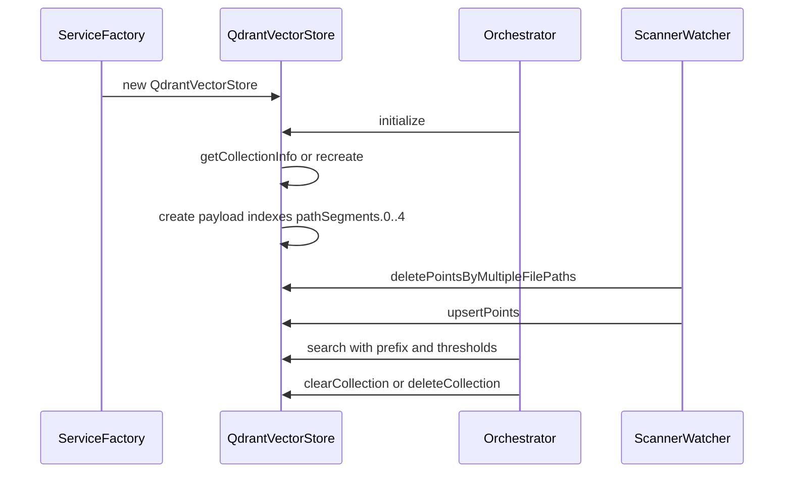

# Code Index Vector Store 技术架构文档

## 模块定位

- 位置：`src/services/code-index/vector-store/`
- 责任：基于 Qdrant 的向量存储实现，提供集合生命周期管理、索引构建、点位写入与查询、精确删除、集合清空与存在性检查。
- 接口：实现 `IVectorStore`（`initialize`, `upsertPoints`, `search`, `deletePointsByFilePath`, `deletePointsByMultipleFilePaths`, `clearCollection`, `deleteCollection`, `collectionExists`）。

## 集合生命周期与维度管理

- 类名：`QdrantVectorStore` [qdrant-client.ts](file:///d:/zyhome_work/kilocode/src/services/code-index/vector-store/qdrant-client.ts)
- 初始化流程：
    1. 解析 Qdrant URL，统一 host/port/https/prefix 配置，必要时回退到 url 直连 [qdrant-client.ts:58-78](file:///d:/zyhome_work/kilocode/src/services/code-index/vector-store/qdrant-client.ts#L58-L78)
    2. 生成集合名：基于 workspacePath 的 SHA-256 前 16 位，避免跨工程冲突 [qdrant-client.ts:80-84](file:///d:/zyhome_work/kilocode/src/services/code-index/vector-store/qdrant-client.ts#L80-L84)
    3. 在 `initialize()` 中：
        - 若集合不存在则创建，配置 vectors.size/distance 与 HNSW on-disk 参数 [qdrant-client.ts:149-168](file:///d:/zyhome_work/kilocode/src/services/code-index/vector-store/qdrant-client.ts#L149-L168)
        - 若集合存在则校验现有向量维度；不匹配时执行“删除→验证删除→重建”原子流程 [qdrant-client.ts:170-193, 222-292](file:///d:/zyhome_work/kilocode/src/services/code-index/vector-store/qdrant-client.ts#L170-L193)
        - 创建 payload 索引 `pathSegments.0..4` 用于路径段过滤（兼容项目常见深度）[qdrant-client.ts:298-315](file:///d:/zyhome_work/kilocode/src/services/code-index/vector-store/qdrant-client.ts#L298-L315)
- 错误语义：连接失败或维度重建失败时提供用户友好错误信息，并保留原始错误 cause 以便定位 [qdrant-client.ts:199-214, 265-292](file:///d:/zyhome_work/kilocode/src/services/code-index/vector-store/qdrant-client.ts#L199-L214)

## 点位模型与索引设计

- 点位结构：`{ id: string, vector: number[], payload: { filePath, codeChunk, startLine, endLine, segmentHash?, pathSegments? } }`
    - `id`：稳定标识；Scanner 使用 `segmentHash`（基于文件片段内容与行区间），Watcher 使用稳定名（路径+起始行）以兼容增量场景。
    - `payload.filePath`：相对工作区路径；`pathSegments` 为按层级分解的索引字段（0..n）。
- 索引策略：
    - `pathSegments.0..4` 索引使得基于目录前缀的过滤变为 Must 条件组合，避免扫描全库 [qdrant-client.ts:298-315](file:///d:/zyhome_work/kilocode/src/services/code-index/vector-store/qdrant-client.ts#L298-L315)
    - upsert 时自动生成 `pathSegments`，保持查询与删除的统一匹配逻辑 [qdrant-client.ts:321-358, 462-485](file:///d:/zyhome_work/kilocode/src/services/code-index/vector-store/qdrant-client.ts#L321-L358)

## 写入（Upsert）与删除（Delete）

- Upsert：
    - 对每个点位生成 `pathSegments` 后调用 `client.upsert(points, { wait: true })` [qdrant-client.ts:321-354](file:///d:/zyhome_work/kilocode/src/services/code-index/vector-store/qdrant-client.ts#L321-L354)
    - 失败时记录详细错误并抛出，交由上层处理重试 [qdrant-client.ts:355-357](file:///d:/zyhome_work/kilocode/src/services/code-index/vector-store/qdrant-client.ts#L355-L357)
- Delete：
    - 单路径删除：`deletePointsByFilePath(filePath)` 委托到多路径删除 [qdrant-client.ts:443-445](file:///d:/zyhome_work/kilocode/src/services/code-index/vector-store/qdrant-client.ts#L443-L445)
    - 多路径删除：将每个相对路径拆分为段并构造 `must` 过滤；多个路径组合为 `should`（OR 条件）以批量删除 [qdrant-client.ts:447-509](file:///d:/zyhome_work/kilocode/src/services/code-index/vector-store/qdrant-client.ts#L447-L509)
    - 防御：在删除前检查集合是否存在，避免错误噪音；记录 status 与 samplePaths 便于定位 [qdrant-client.ts:453-461, 494-508](file:///d:/zyhome_work/kilocode/src/services/code-index/vector-store/qdrant-client.ts#L453-L461)

## 查询（Search）

- 入口：`search(queryVector, directoryPrefix?, minScore?, maxResults?)` [qdrant-client.ts:382-437](file:///d:/zyhome_work/kilocode/src/services/code-index/vector-store/qdrant-client.ts#L382-L437)
- 目录前缀过滤：
    - 将 `./` 或空前缀视为全库查询，否则拆分前缀为段并构造 `must` 条件 [qdrant-client.ts:391-413](file:///d:/zyhome_work/kilocode/src/services/code-index/vector-store/qdrant-client.ts#L391-L413)
- 查询参数：
    - `score_threshold`：来自调用方配置或默认值（DEFAULT_SEARCH_MIN_SCORE）
    - `limit`：最大返回数量（DEFAULT_MAX_SEARCH_RESULTS）
    - `params.hnsw_ef/exact`：使用近似检索（ef=128, exact=false）以提升吞吐
    - `with_payload.include`：只返回必要字段（filePath, codeChunk, startLine, endLine, pathSegments）
- 结果过滤：
    - 校验 payload 完整性后返回；错误时抛出以便上层记录与状态管理 [qdrant-client.ts:429-436](file:///d:/zyhome_work/kilocode/src/services/code-index/vector-store/qdrant-client.ts#L429-L436)

## 集合操作

- 清空集合：`clearCollection()` 使用空 `must` 过滤删除所有点（支持 wait） [qdrant-client.ts:526-540](file:///d:/zyhome_work/kilocode/src/services/code-index/vector-store/qdrant-client.ts#L526-L540)
- 删除集合：`deleteCollection()` 前先确认集合存在，避免非预期错误 [qdrant-client.ts:514-523](file:///d:/zyhome_work/kilocode/src/services/code-index/vector-store/qdrant-client.ts#L514-L523)
- 集合存在性：`collectionExists()` 通过 `getCollectionInfo()` 判定，捕获异常并返回 null 安全值 [qdrant-client.ts:547-551, 130-143](file:///d:/zyhome_work/kilocode/src/services/code-index/vector-store/qdrant-client.ts#L547-L551)

## 与上层协作

- 与 `CodeIndexServiceFactory`：根据配置构造 QdrantVectorStore（workspacePath、qdrantUrl、vectorSize、apiKey）；模型维度由配置或嵌入器档案计算 [service-factory.ts:116-150](file:///d:/zyhome_work/kilocode/src/services/code-index/service-factory.ts#L116-L150)
- 与 `CodeIndexOrchestrator`：初始化时检测维度差异并重建集合；发生错误时清理并切换状态 [orchestrator.ts:129-168, 229-255](file:///d:/zyhome_work/kilocode/src/services/code-index/orchestrator.ts#L129-L168)
- 与 `Scanner/Watcher`：删除与 upsert 统一通过 `pathSegments` 精确匹配；幂等保证由“先删后写”策略实现 [scanner.ts:462-511, 517-559](file:///d:/zyhome_work/kilocode/src/services/code-index/processors/scanner.ts#L462-L559) [file-watcher.ts:194-251, 353-420](file:///d:/zyhome_work/kilocode/src/services/code-index/processors/file-watcher.ts#L194-L251)

## 时序图

## 错误处理与治理

- URL 解析与连接：统一 host/port/https/prefix；解析失败回退到 URL 模式；连接失败时提供可读错误并保留原始原因。
- 维度不匹配重建：全流程日志与错误语义；确保删除后再创建，避免“半删除半创建”不一致状态。
- 删除安全性：集合不存在时跳过删除并警告；批量删除记录状态码与示例路径，便于定位。
- 查询与写入：严格校验 payload；失败时抛出由上层进行状态管理与遥测记录。

## 性能与调优

- 向量维度：尽量与嵌入模型档案匹配，必要时通过配置指定维度，避免多次重建。
- 索引段数：默认 0..4 的路径段索引足够覆盖常见项目层级；更深层目录可酌情增加索引数量。
- 近似检索参数：`hnsw_ef=128` 与 `exact=false` 在查询速度与精度之间提供较优折中；如需更高精度可提高 ef 或启用 exact，但吞吐下降。

## 依赖

- 外部库：`@qdrant/js-client-rest`
- 内部模块：`utils/path`、`constants/index.ts`、`interfaces/vector-store.ts`
