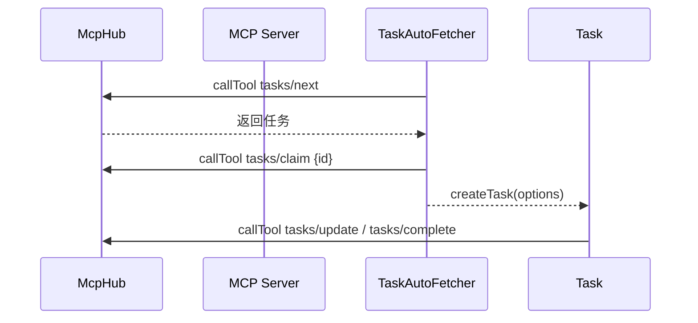

# MCP 任务服务契约与集成规范

## 目标

- 通过 MCP 工具/资源，为 Kilocode 自动拉取、认领、更新、完成任务
- 统一错误、幂等与鉴权，适配 stdio / SSE / streamable-http 传输

## 工具契约（tasks/\*）

- `tasks/list`
    - 请求：`{ filter?: { labels?: string[], priority?: string }, page?: { size?: number, cursor?: string } }`
    - 响应：`{ items: Task[], nextCursor?: string }`
- `tasks/next`
    - 请求：`{ queue?: string, labels?: string[] }`
    - 响应：`{ task: Task | null, idempotencyKey?: string }`
- `tasks/claim`
    - 请求：`{ id: string }`
    - 响应：`{ leaseId: string, expiresAt: number }`
- `tasks/update`
    - 请求：`{ id: string, patch: { status?: "queued"|"in_progress"|"paused"|"completed", progress?: number, owner?: string, labels?: string[], notes?: string } }`
    - 响应：`{ ok: true }`
- `tasks/complete`
    - 请求：`{ id: string, result: { summary: string, outputs?: Array<{ type: string, uri?: string }> } }`
    - 响应：`{ ok: true }`
- `tasks/cancel`
    - 请求：`{ id: string, reason?: string }`
    - 响应：`{ ok: true }`
- `tasks/checkpoint`（可选）
    - 请求：`{ id: string, commitHash: string, meta?: Record<string, any> }`
    - 响应：`{ ok: true }`

## 资源契约

- `task://{id}` → 详情
    - 响应：`Task`
- `queue://events` → 推送任务事件（SSE/h2）
    - 事件：`{ type: "created"|"updated"|"completed", task: Task }`

## Task 结构示例

```json
{
	"id": "t_123",
	"title": "修复登录页错误",
	"description": "点击登录按钮报 500 错误，需排查后修复",
	"labels": ["bug", "frontend"],
	"priority": "high",
	"workspacePath": "d:/projects/app",
	"repo": { "url": "https://github.com/org/app.git" },
	"pathHints": ["src/pages/Login.tsx"],
	"attachments": [{ "uri": "resource://logs/login-error.txt" }]
}
```

## 错误与幂等

- 错误：`{ error: { code: string, message: string } }`
- 幂等：`tasks/next` 返回 `idempotencyKey`；`tasks/claim` 返回 `leaseId` 与失效时间；客户端去重基于 `id`/`leaseId`。

## 鉴权

- SSE/HTTP：`Authorization: Bearer <token>`；可选 mTLS
- stdio：通过环境变量注入（由 Kilocode `McpHub` 完成）

## 数据映射（MCP → Kilocode）

- `title/description/labels/priority` → `TaskOptions.task` 与元数据
- `workspacePath/pathHints` → `workspacePath` 与初始 `todos`
- `attachments` → 以资源读取并注入上下文

## 配置示例（SSE）

```json
{
	"mcpServers": {
		"task-broker": {
			"type": "sse",
			"url": "https://mcp.example.com/sse",
			"headers": { "Authorization": "Bearer ${env:MCP_TOKEN}" },
			"timeout": 60,
			"alwaysAllow": ["tasks/next", "tasks/claim", "tasks/update", "tasks/complete"],
			"disabledTools": []
		}
	}
}
```

## 全局开关（环境变量）

- `KILOCODE_AUTO_FETCH_TASKS=1` 开启自动任务拉取（默认关闭）

## 流程图



## 架构图

```mermaid
flowchart TD
    subgraph Kilocode
      Provider[ClineProvider] --> Hub[McpHub]
      Hub --> Auto[TaskAutoFetcher]
      Auto --> Task[Task]
    end

    subgraph MCP Server
      API[tools: tasks/*]\nresources: task://{id}, queue://events
    end

    Hub == transport ==> Transport[stdio | sse | streamable-http]
    Transport == connects ==> API
```
