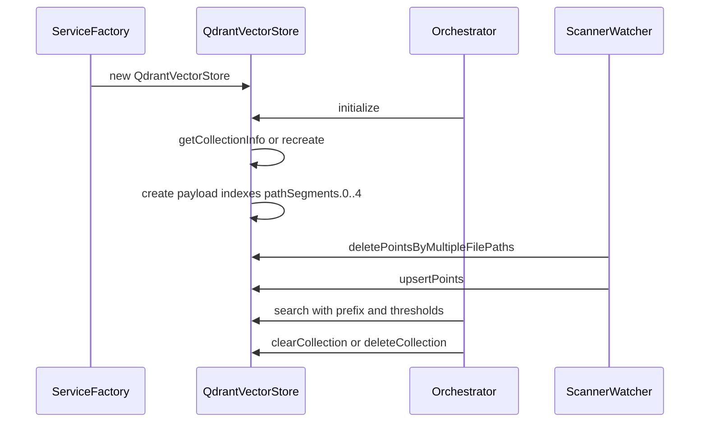

# QdrantVectorStore 技术文档（qdrant-client.ts）

## 概述

- 文件位置：`src/services/code-index/vector-store/qdrant-client.ts`
- 角色：实现 `IVectorStore`，为 Code Index 服务提供对 Qdrant 的统一封装：集合生命周期管理、点位写入与查询、路径精确删除、集合清空与存在性检查。
- 依赖：`@qdrant/js-client-rest`（Qdrant REST SDK）

## 类与构造

- 类名：`QdrantVectorStore` [qdrant-client.ts:13-21](file:///d:/zyhome_work/kilocode/src/services/code-index/vector-store/qdrant-client.ts#L13-L21)
- 构造函数 [qdrant-client.ts:27-84](file:///d:/zyhome_work/kilocode/src/services/code-index/vector-store/qdrant-client.ts#L27-L84)
    - 参数：`workspacePath: string`, `url: string`, `vectorSize: number`, `apiKey?: string`
    - 行为：
        - 解析与规范化 Qdrant URL（优先 host/port/prefix 模式，失败回退 url 模式）
        - 创建 `QdrantClient`（设置 `User-Agent: Kilo Code`）
        - 基于 `workspacePath` 生成集合名（`ws-<sha256前16位>`）

## URL 解析与主机名处理

- `parseQdrantUrl(url?: string): string` [qdrant-client.ts:91-113](file:///d:/zyhome_work/kilocode/src/services/code-index/vector-store/qdrant-client.ts#L91-L113)
    - 空值→`http://localhost:6333`
    - 无协议→走 `parseHostname`
    - 有协议且可解析→原样返回
- `parseHostname(hostname: string): string` [qdrant-client.ts:120-128](file:///d:/zyhome_work/kilocode/src/services/code-index/vector-store/qdrant-client.ts#L120-L128)
    - 若含端口但无协议→补 `http://`
    - 不含端口→补 `http://hostname`

## 集合探测与初始化

- `getCollectionInfo(): Promise<Schemas["CollectionInfo"] | null>` [qdrant-client.ts:130-143](file:///d:/zyhome_work/kilocode/src/services/code-index/vector-store/qdrant-client.ts#L130-L143)
    - 获取集合信息；异常时返回 `null` 而非抛出，便于上层存在性判断
- `initialize(): Promise<boolean>` [qdrant-client.ts:149-215](file:///d:/zyhome_work/kilocode/src/services/code-index/vector-store/qdrant-client.ts#L149-L215)
    - 逻辑：
        1. 获取集合信息
        2. 不存在→`createCollection`（配置 vectors.size/distance、HNSW on-disk）
        3. 存在→校验向量维度，如不匹配调用 `_recreateCollectionWithNewDimension`
        4. 创建 payload 索引（`pathSegments.0..4`）用于目录前缀过滤
    - 返回：是否创建了新集合（`true` 表示新建或重建）
    - 错误处理：连接失败或维度重建失败时返回用户友好错误消息（保留原始 `cause`）
- `_recreateCollectionWithNewDimension(existingVectorSize: number): Promise<boolean>` [qdrant-client.ts:222-293](file:///d:/zyhome_work/kilocode/src/services/code-index/vector-store/qdrant-client.ts#L222-L293)
    - 步骤：删除旧集合→验证删除→创建新集合（新维度）
    - 失败时：区分阶段（删除/验证/创建）构造上下文错误，挂载原始错误为 `cause` 并抛出
- `_createPayloadIndexes(): Promise<void>` [qdrant-client.ts:298-315](file:///d:/zyhome_work/kilocode/src/services/code-index/vector-store/qdrant-client.ts#L298-L315)
    - 为 `pathSegments.0..4` 创建 keyword 索引；已存在时忽略

## 点位写入（Upsert）

- `upsertPoints(points: { id: string; vector: number[]; payload: Record<string, any> }[]): Promise<void>` [qdrant-client.ts:321-358](file:///d:/zyhome_work/kilocode/src/services/code-index/vector-store/qdrant-client.ts#L321-L358)
    - 处理：若 payload 包含 `filePath`，自动生成 `pathSegments`（基于相对路径的分段）
    - 调用：`client.upsert(collectionName, { points, wait: true })`
    - 错误：抛出由上层重试/记录遥测

## 检索查询（Search）

- `isPayloadValid(payload: Record<string, unknown> | null | undefined): payload is Payload` [qdrant-client.ts:365-372](file:///d:/zyhome_work/kilocode/src/services/code-index/vector-store/qdrant-client.ts#L365-L372)
    - 校验 payload 字段是否完整（`filePath, codeChunk, startLine, endLine`）
- `search(queryVector: number[], directoryPrefix?: string, minScore?: number, maxResults?: number): Promise<VectorStoreSearchResult[]>` [qdrant-client.ts:382-437](file:///d:/zyhome_work/kilocode/src/services/code-index/vector-store/qdrant-client.ts#L382-L437)
    - 前缀过滤：将 `directoryPrefix` 拆分为多个 `pathSegments.i` 的 must 条件组合（无前缀则全库）
    - 参数：`score_threshold` 与 `limit` 来自默认或调用方配置；检索采用 `hnsw_ef=128, exact=false`
    - 返回：过滤掉 payload 不完整项后返回匹配点

## 精确删除（Delete）

- `deletePointsByFilePath(filePath: string): Promise<void>` [qdrant-client.ts:443-445](file:///d:/zyhome_work/kilocode/src/services/code-index/vector-store/qdrant-client.ts#L443-L445)
    - 委托到多路径删除
- `deletePointsByMultipleFilePaths(filePaths: string[]): Promise<void>` [qdrant-client.ts:447-509](file:///d:/zyhome_work/kilocode/src/services/code-index/vector-store/qdrant-client.ts#L447-L509)
    - 集合存在性检查：不存在则警告并返回
    - 过滤构造：对每个相对路径拆分为段，创建 `must` 条件；多路径用 `should` 组合（OR）批量删除
    - 错误日志：记录状态码、集合名与样例路径；不抛出以降低阻塞

## 集合操作

- `deleteCollection(): Promise<void>` [qdrant-client.ts:514-523](file:///d:/zyhome_work/kilocode/src/services/code-index/vector-store/qdrant-client.ts#L514-L523)
    - 若存在则删除；异常抛出由上层处理
- `clearCollection(): Promise<void>` [qdrant-client.ts:529-540](file:///d:/zyhome_work/kilocode/src/services/code-index/vector-store/qdrant-client.ts#L529-L540)
    - 使用空 `must` 过滤清空集合；异常抛出
- `collectionExists(): Promise<boolean>` [qdrant-client.ts:547-551](file:///d:/zyhome_work/kilocode/src/services/code-index/vector-store/qdrant-client.ts#L547-L551)
    - 基于 `getCollectionInfo()` 是否返回非 null 判断

## 交互时序（Mermaid）



## 使用示例

- 初始化与写入：

```ts
import { QdrantVectorStore } from "src/services/code-index/vector-store/qdrant-client"

const store = new QdrantVectorStore(workspacePath, "http://localhost:6333", 1536, process.env.QDRANT_API_KEY)
const created = await store.initialize()
await store.upsertPoints([
	{
		id: "point-id",
		vector: embedding,
		payload: { filePath: "src/app.ts", codeChunk: "function foo(){}", startLine: 10, endLine: 20 },
	},
])
```

- 检索与删除：

```ts
const hits = await store.search(queryVector, "./src", 0.3, 20)
await store.deletePointsByFilePath("src/app.ts")
```

## 设计要点与建议

- 维度一致性：初始化时自动检测并重建集合，避免 upsert/search 的维度错误
- 路径段索引：统一生成 `pathSegments`，使目录前缀过滤高效且与删除逻辑一致
- 幂等写入：Scanner/Watcher 遵循“先删后写”策略，确保索引状态一致
- 错误治理：区分连接/维度重建/删除阶段错误，提供具象日志与 cause，便于定位与恢复
